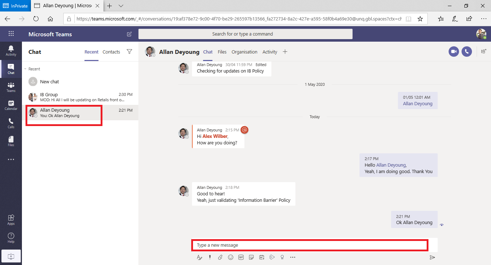
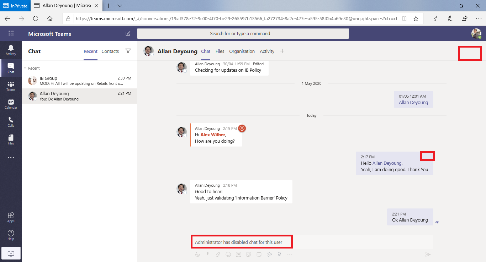

# Microsoft 团队中的信息障碍Information barriers in Microsoft Teams

 (IB) 的信息障碍是管理员可以配置以防止个人或组相互通信的策略。Information barriers (IB) are policies that an admin can configure to prevent individuals or groups from communicating with each other. 例如，如果一个部门处理的信息不应与其他部门共享，或者需要防止或独立地与该组外的任何人进行通信，则这将非常有用。This is useful if, for example, one department is handling information that shouldn't be shared with other departments or a group needs to be prevented, or isolated, from communicating with anyone outside of that group.

> [!NOTE]
> - 不能跨租户创建信息障碍组。Information barrier groups cannot be created across tenants.
> - 版本1不支持使用机器人添加用户。Using bots to add users is not supported in version 1.
> - 专用频道符合您配置的信息屏障策略。Private channels are compliant to information barrier policies that you configure.
> - 新增：有关连接到团队的 SharePoint 网站的障碍支持的信息，请单击[此处](https://docs.microsoft.com/sharepoint/information-barriers#segments-associated-with-microsoft-teams-sites)。New: For Information about barriers support for SharePoint site connected to Teams, click [here](https://docs.microsoft.com/sharepoint/information-barriers#segments-associated-with-microsoft-teams-sites).

信息屏障策略还可防止查找和发现。Information barrier policies also prevent lookups and discovery. 这意味着，如果你尝试与不应与之通信的人员进行通信，你将在人员选取器中找不到该用户。This means that if you attempt to communicate with someone you should not be communicating with, you will not find that user in the people picker.

## 背景Background

信息障碍的主要驱动因素来自金融服务行业。The primary driver for information barriers comes from the financial services industry. 金融行业监管机构 ([FINRA]( http://www.finra.org)) 查看成员公司中的信息障碍和利益冲突，并提供有关如何管理此类冲突的指南， (FINRA 2241、[债务研究机构声明 15-31](http://www.finra.org/sites/default/files/Regulatory-Notice-15-31_0.pdf)。The Financial Industry Regulatory Authority ([FINRA]( http://www.finra.org)) reviews information barriers and conflicts of interest within member firms and provides guidance as to how to manage such conflicts (FINRA 2241, [Debt Research Regulatory Notice 15-31](http://www.finra.org/sites/default/files/Regulatory-Notice-15-31_0.pdf).  

但是，由于信息障碍的推出，许多其他方面发现它们非常有用。However, since introducing information barriers, many other areas have found them to be useful. 其他常见方案包括：Other common scenarios include:

- 教育：一学校学生无法查找其他学校的学生的联系人详情。Education: Students in one school aren't able to look up contact details for students of other schools.
- 法律：保留由一位客户的律师为同一事务所获取的不同客户的律师所获得的数据的机密性。Legal: Maintaining confidentiality of data obtained by the lawyer of one client from being accessed by a lawyer for the same firm representing a different client.
- 政府：信息访问和控制限制在部门和群组之间。Government: Information access and control is limited across departments and groups.
- 专业服务：公司中的一组人员只能在客户服务期间通过联盟或来宾访问与客户或特定客户聊天。Professional services: A group of people in a company is only able to chat with a client or specific customer via federation or guest access during a customer engagement.

例如，Enrico 属于 "银行" 段，Pradeep 属于财务顾问段。For example, Enrico belongs to the Banking segment and Pradeep belongs to the Financial advisor segment. Enrico 和 Pradeep 无法互相通信，因为组织的 IB 策略阻止这两个网段之间的通信和协作。Enrico and Pradeep can't communicate with each other because the organization's IB policy blocks communication and collaboration between these two segments. 但是，Enrico 和 Pradeep 可以与 HR 中的和进行通信。However, Enrico and Pradeep can communicate with Lee in HR.

## 何时使用信息障碍When to use information barriers

您可能希望在类似情况下使用信息障碍：You might want to use information barriers in situations like these:

- 必须阻止团队与特定其他团队进行通信或共享数据。A team must be prevented from communicating or sharing data with a specific other team.
- 团队不得与团队外部的任何人通信或与之共享数据。A team must not communicate or share data with anyone outside of the team.

信息屏障策略评估服务确定通信是否符合信息屏障策略。The Information Barrier Policy Evaluation Service determines whether a communication complies with information barrier policies.

## 管理信息屏障策略Managing information barrier policies

信息屏障策略在 Microsoft 365 合规性中心 (SCC) 使用 PowerShell cmdlet 进行管理。Information barrier policies are managed in the Microsoft 365 Compliance Center (SCC) using PowerShell cmdlets. 有关详细信息，请参阅[定义信息障碍策略](https://docs.microsoft.com/office365/securitycompliance/information-barriers-policies)。For more information, see [Define policies for information barriers](https://docs.microsoft.com/office365/securitycompliance/information-barriers-policies).

> [!IMPORTANT]
> 在设置或定义策略之前，**必须在 Microsoft 团队中启用范围的目录搜索**。Before you set up or define policies, **you must enable scoped directory search in Microsoft Teams**. 在设置或定义信息障碍策略之前，请至少等待几小时后再启用范围目录搜索。Wait at least a few hours after enabling scoped directory search before you set up or define policies for information barriers. [了解有关信息障碍的先决条件的详细信息](https://docs.microsoft.com/office365/securitycompliance/information-barriers-policies#prerequisites)。[Learn more about prerequisites for information barriers](https://docs.microsoft.com/office365/securitycompliance/information-barriers-policies#prerequisites).

## 信息障碍管理员角色Information barriers administrator role

IB 合规性管理角色负责管理信息屏障策略。The IB Compliance Management role is responsible for managing information barrier policies. 有关此角色的详细信息，请参阅[Microsoft 365 合规性中心中的权限](https://docs.microsoft.com/office365/securitycompliance/permissions-in-the-security-and-compliance-center)。For more information about this role, see [Permissions in the Microsoft 365 Compliance Center](https://docs.microsoft.com/office365/securitycompliance/permissions-in-the-security-and-compliance-center).

## 信息障碍触发器Information barrier triggers

当以下团队事件发生时，将激活信息屏障策略：Information barrier policies are activated when the following Teams events take place:

- 将**成员添加到团队**-每当您将用户添加到团队时，用户的策略必须根据其他团队成员的信息屏障策略进行评估。**Members are added to a team** - Whenever you add a user to a team, the user's policy must be evaluated against the information barrier policies of other team members. 成功添加用户后，用户可以执行团队中的所有功能，而无需进一步检查。After the user is successfully added, the user can perform all functions in the team without further checks. 如果用户的策略阻止将他们添加到团队，则该用户将不会显示在 "搜索" 中。If the user's policy blocks them from being added to the team, the user will not show up in search.

    

- **请求新的聊天**-每次在两个或更多用户之间请求新的聊天时，将对聊天进行评估以确保它不违反任何信息障碍策略。**A new chat is requested** - Each time a new chat is requested between two or more users, the chat is evaluated to make sure that it isn't violating any information barrier policies. 如果对话违反了 "信息屏障" 策略，则不会启动对话。If the conversation violates an information barrier policy, then the conversation isn't initiated.

    下面是1:1 聊天的示例。Here's an example of a 1:1 chat.

     

    下面是群组聊天的示例。Here's an example of a group chat.

    

- **邀请用户加入会议**-当用户被邀请加入会议时，将根据其他团队成员的策略评估用户的策略，如果发生冲突，则不允许用户加入会议中。。**A user is invited to join a meeting** - When a user is invited to join a meeting, the user's policy is evaluated against the policies of other team members, and if there's a violation, the user will not be allowed to join the meeting.

    

- **在两个或更多用户之间共享屏幕**-无论何时在两个或更多用户之间共享屏幕，都必须评估屏幕共享以确保它不违反其他用户的信息屏障策略。**A screen is shared between two or more users** - Any time a screen is shared between two or more users, the screen share must be evaluated to make sure that it doesn't violate the information barrier policies of other users. 如果违反了信息障碍策略，则不允许使用屏幕共享。If an information barrier policy is violated, the screen share won't be allowed. 
 
    下面是应用策略前的屏幕共享示例。Here's an example of screen share before the policy is applied. 

    

    下面是应用策略后的屏幕共享示例。Here's an example of screen share after the policy is applied. 屏幕共享和呼叫图标不可见。The screen share and call icons aren't visible.

    

- \*\*用户将电话呼叫 (团队中的 VOIP) \*\* -只要用户向另一个用户或一组用户发起语音呼叫，就会评估呼叫以确保它不违反其他团队成员的信息屏障策略。**A user places a phone call (VOIP) in Teams** - Any time a voice call is initiated by a user to another user or group of users, the call is evaluated to make sure that it doesn't violate the information barrier policies of other team members. 如果存在任何冲突，将阻止语音通话。If there is any violation, the voice call is blocked.
- **团队中的来宾用户**-信息障碍策略也适用于团队中的来宾用户。**Guest users in Teams** - Information barrier policies apply to guest users in Teams too. 如果您的组织的全球通讯簿中需要发现来宾用户，请参阅[管理 Microsoft 365 组中的来宾访问](https://docs.microsoft.com/microsoft-365/admin/create-groups/manage-guest-access-in-groups)。If guest users need to be discoverable in your organization's global address list, see [Manage guest access in Microsoft 365 Groups](https://docs.microsoft.com/microsoft-365/admin/create-groups/manage-guest-access-in-groups). 一旦来宾用户可发现，你可以[定义信息障碍策略](https://docs.microsoft.com/office365/securitycompliance/information-barriers-policies)。Once guest users are discoverable, you can [define information barrier policies](https://docs.microsoft.com/office365/securitycompliance/information-barriers-policies).

## 策略更改如何影响现有聊天How policy changes impact existing chats

当信息屏障策略管理员对策略进行更改，或者由于对用户配置 (文件的更改（例如作业更改或类似) 原因）而导致策略更改生效时，信息屏障策略评估服务将自动搜索成员，以确保团队成员不违反任何策略。When the information barrier policy administrator makes changes to a policy, or a policy change kicks into effect because of a change to a user's profile (such as for a job change or a similar reason), the Information Barrier Policy Evaluation Service automatically searches the members to ensure that members of the Team are not violating any policies.

如果用户之间已有聊天或其他通信，并且已设置新策略或更改了现有策略，则该服务将评估现有通信，以确保仍允许进行通信。If there is an existing chat or other communication between users, and a new policy is set or an existing policy is changed, the service evaluates existing communications to make sure that the communications are still allowed to occur. 

- **1:1 聊天**-如果将阻止通信的策略同时应用于一个或两个用户，则 (两个用户之间的通信) ，将阻止进一步通信，聊天对话将变为只读。**1:1 chat** - If communication between the two users is no longer allowed (if a policy blocking communication is applied to one or both users), further communication is blocked and the chat conversation will become read-only. 

    下面是显示聊天的示例。Here's an example that shows the chat is visible.

    

    下面是显示 "聊天" 已禁用的示例。Here's an example that shows the chat is disabled.

    

- **群组聊天**-如果不再允许从一个用户到组的通信 (例如，如果用户更改作业) ，则用户和其他违反该策略的用户可能会从群组聊天中删除，并且不允许与组进行进一步通信。**Group chat** - If communication from one user to the group is no longer allowed (for example, if a user changes jobs), the user along with the other users who violate the policy may be removed from group chat and further communication with the group will not be allowed. 用户仍然可以查看旧对话 (这将是只读) ，但无法查看或参与与组的任何新对话。The user can still see old conversations (which will be read-only), but will not be able to see or participate in any new conversations with the group. 如果新的或已更改的策略阻止通信被应用到多个用户，则受该策略影响的用户可能会从群组聊天中被删除。If the new or changed policy preventing communication is applied to more than one user, the users who are affected by the policy may be removed from group chat. 他们仍然可以看到旧的对话。They can still see old conversations.

在此示例中，Enrico 移动到组织内的其他部门，并从群组聊天中删除。In this example, Enrico moved to a different department within the organization and is removed from the group chat.

  

Enrico 无法再向群组聊天发送消息。Enrico can no longer send messages to the group chat.

  

- **团队**-已从组中删除的任何用户都将从团队中删除，并且将无法查看或参与现有对话或新对话。**Team** - Any users who have been removed from the group are removed from the team and will not be able to see or participate in existing or new conversations.

## 方案：现有聊天中的用户遭到阻止Scenario: A user in an existing chat becomes blocked

当前，如果信息屏障策略阻止其他用户，则用户会遇到以下情况：Currently, users experience the following if an information barrier policy blocks another user:

- "**人员" 选项卡**-用户在 "**人员**" 选项卡上看不到被阻止的用户。**People tab** - A user cannot see blocked users on the **People** tab.
- **人员选取器**-阻止的用户将在人员选取器中不可见。**People Picker** - Blocked users will not be visible in the people picker.

    
    
- **"活动" 选项卡**-如果用户访问被阻止用户的 "**活动**" 选项卡，则不会显示任何帖子。**Activity tab** - If a user visits the **Activity** tab of a blocked user, no posts will appear.  ("**活动**" 选项卡将仅显示频道发布，并且两个用户之间不存在任何公共频道。 ) (The **Activity** tab displays channel posts only, and there would be no common channels between the two users.)

    下面是已阻止的 "活动" 选项卡视图的示例。Here's an example of the activity tab view that is blocked.

    

- **组织结构图**-如果用户访问的组织结构图中出现被阻止的用户，则被阻止的用户将不会显示在组织结构图中，并且将显示一条错误消息。**Org charts** - If a user accesses an org chart on which a blocked user appears, the blocked user will not appear on the org chart and an error message will appear instead.
- **人员卡片**-如果用户参与对话，随后被阻止，则其他用户将在其悬停在阻止用户的名称上时看到错误消息，而不是人员卡。**People card** - If a user participates in a conversation and the user is subsequently blocked, other users will see an error message instead of the people card when they hover over the blocked user's name. 卡上列出的操作 (如通话和聊天) 将不可用。Actions listed on the card (such as calling and chat) will be unavailable.
- **建议的联系人**-阻止的用户不会显示在 "建议的联系人" 列表中 () 为新用户显示的初始联系人列表。**Suggested contacts** - Blocked users do not appear on the suggested contacts list (the initial contact list that appears for new users).
- **聊天联系人**-用户可以在聊天联系人列表中看到被阻止的用户，但将标识被阻止的用户，并且用户唯一可以执行的操作是将其删除。**Chat contacts** - A user can see blocked users on the chats contact list, but the blocked users will be identified and the only action the user can perform is to delete them. 用户也可以单击它们以查看其过去的对话。The user can also click on them to view their past conversation.
- **呼叫联系人**-用户可以在通话联系人列表中看到被阻止的用户，但将标识被阻止的用户，并且用户唯一可以执行的操作是将其删除。**Calls contacts** - A user can see blocked users on the calls contact list, but the blocked users will be identified and the only action the user can perform is to delete them.

    下面是 "通话联系人" 列表中被阻止的用户的示例。Here's an example of a blocked user in the calls contact list.

    

    下面是对 "通话内容" 列表中的用户禁用聊天的示例。Here's an example of the chat being disabled for a user on the calls content list.

    

- **Skype 到团队迁移**-在 Skype for Business 到团队迁移期间，所有用户（甚至是信息屏障策略阻止的用户）都将迁移到团队，然后按照上述说明进行处理。**Skype to Teams migration** - During a Skype for Business to Teams migration, all users, even those blocked by information barrier policies, will be migrated to Teams and then will be handled as described above.

## 团队策略和 SharePoint 网站Teams policies and SharePoint sites

创建团队后，SharePoint 网站将预配并与 Microsoft 团队的文件体验相关联。When a team is created, a SharePoint site is provisioned and associated with Microsoft Teams for the files experience. 默认情况下，信息障碍策略不会在此 SharePoint 网站和文件上生效。Information barrier policies are not honored on this SharePoint site and files by default. 若要启用信息障碍策略，管理员已填写一个表单，请求在 SharePoint 和 OneDrive 上启用 IB 策略 (请参阅[信息障碍](https://docs.microsoft.com/sharepoint/information-barriers#prerequisites)中的*先决条件*部分) 。To enable Information Barrier policies, the administrator has already filled out a form, requesting that IB policies be enabled on SharePoint and OneDrive (see the *Prerequisite* section in [Information barriers](https://docs.microsoft.com/sharepoint/information-barriers#prerequisites)). 如果信息屏障策略在 SharePoint 和 OneDrive 中处于打开状态，则在使用 Microsoft 团队创建团队时，IB 策略将在预配 SharePoint 网站上工作。If the Information Barrier policy is turned on in SharePoint and OneDrive, then the IB policies will work on SharePoint sites provisioned when a team is created with Microsoft Teams.

**团队的 SharePoint 网站上的 IB 策略示例**：在 Contoso Bank corporation 中，用户 "Sesha@contosobank.onmicrosoft.com" 属于投资银行段，而用户 "Nikita@contosobank.onmicrosoft.com" 属于 "部门咨询"。**Example of IB policies on SharePoint site of a team**: In Contoso Bank corporation, user 'Sesha@contosobank.onmicrosoft.com' belongs to Investment Banking segment and user 'Nikita@contosobank.onmicrosoft.com' belongs to segment Advisory. 组织的 IB 策略阻止这两个网段之间的通信和协作。The organization's IB policy blocks communication and collaboration between these two segments.
当用户 Sesha 为投资银行段创建团队时，团队和支持它的 SharePoint 网站将仅供投资银行段用户访问。When user Sesha creates a team for Investment Banking segment, the team and the SharePoint site that backs it will be accessible only to Investment Banking segment users. 用户 Nikita 无法访问该网站，即使她拥有网站链接也是如此。User Nikita can't access that site even if she has the site link.

有关详细信息，请参阅[信息障碍](https://docs.microsoft.com/sharepoint/information-barriers#segments-associated-with-microsoft-teams-sites)文章。See the [Information barriers](https://docs.microsoft.com/sharepoint/information-barriers#segments-associated-with-microsoft-teams-sites) article for more details.

## 所需的许可证和权限Required licenses and permissions

有关详细信息（包括计划和定价），请参阅[许可指南](https://docs.microsoft.com/office365/servicedescriptions/microsoft-365-service-descriptions/microsoft-365-tenantlevel-services-licensing-guidance/microsoft-365-security-compliance-licensing-guidance)。For more details, including plans and pricing, see [Licensing Guidance](https://docs.microsoft.com/office365/servicedescriptions/microsoft-365-service-descriptions/microsoft-365-tenantlevel-services-licensing-guidance/microsoft-365-security-compliance-licensing-guidance).

## 已知问题Known Issues
- **用户无法加入会议**：如果启用了 IB 策略，则不允许用户加入会议（如果会议名单的大小超过250个用户）。**Users can't join meetings**: If IB policies are enabled, users are not allowed to join meetings IF the meeting roster size is more than 250 users. 根本原因是 IB 检查依赖于用户是否可以添加到会议聊天名单并接受该信号以允许用户加入会议。The root cause is that IB checks rely on whether users can be added to a meeting chat roster and takes that signal to allow users to join meetings. 加入会议一次会将该用户添加到名单，因此对于定期会议，名单将快速充满。Joining a meeting once will add that user to the roster, hence for recurring meetings, the roster fills up fast. 一旦达到250用户的计数，就不允许向会议聊天名单添加其他用户。Once it reaches a count of 250 users, no additional users are allowed to be added to the meeting chat roster. 如果启用了 IB，则不允许用户加入会议，但如果未启用 IB，则允许用户加入会议，但不会将其添加到会议聊天名单。If IB is enabled, users are not allowed to join the meeting, but if IB is not enabled, users are allowed to join the meeting, though they won't be added to the meeting chat roster. 短期解决方案是从会议聊天名单中删除非活动成员，为新用户腾出空间。A short term solution is to remove inactive members from the meeting chat roster to make space for new users. 但是，我们将在更晚的日期增加会议聊天海报的大小。We will, however, be increasing the size of meeting chat rosters at a later date.

## 更多信息More information

- 若要了解有关信息障碍的详细信息，请参阅[信息障碍](https://docs.microsoft.com/office365/securitycompliance/information-barriers)。To learn more about information barriers, see [Information barriers](https://docs.microsoft.com/office365/securitycompliance/information-barriers).

- 若要设置信息障碍策略，请参阅[定义信息障碍策略](https://docs.microsoft.com/office365/securitycompliance/information-barriers-policies)。To set up information barrier policies, see [Define policies for information barriers](https://docs.microsoft.com/office365/securitycompliance/information-barriers-policies).

- 若要编辑或删除信息障碍策略，请参阅[编辑 (或删除) 信息屏障策略](https://docs.microsoft.com/microsoft-365/compliance/information-barriers-edit-segments-policies)。To edit or remove information barrier policies, see [Edit (or remove) information barrier policies](https://docs.microsoft.com/microsoft-365/compliance/information-barriers-edit-segments-policies).
