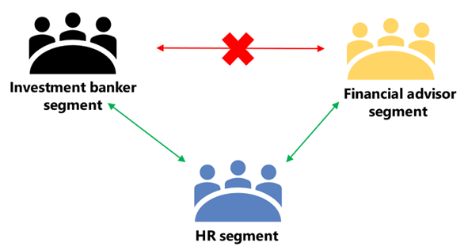

# Microsoft 团队中的信息障碍

信息障碍（IB）是管理员可以配置以防止个人或组相互通信的策略。 例如，如果一个部门处理的信息不应与其他部门共享，或者需要防止或独立地与该组外的任何人进行通信，则这将非常有用。

> [!NOTE]
> - 不能跨租户创建信息障碍组。
> - 版本1不支持使用机器人添加用户。
> - 专用频道符合您配置的信息屏障策略。
> - 新增：连接到团队的 SharePoint 网站的信息屏障支持现在处于私人预览版中。 单击[此处](https://forms.office.com/Pages/ResponsePage.aspx?id=v4j5cvGGr0GRqy180BHbR3-O9WDTKhhDtgWfphwS9YhUM0hJNklNRkZKMlhLNDRZNzlEQlVDSjdZVi4u)参与私人预览版。

信息屏障策略还可防止查找和发现。 这意味着，如果你尝试与不应与之通信的人员进行通信，你将在人员选取器中找不到该用户。

## 背景

信息障碍的主要驱动因素来自金融服务行业。 金融行业监管机构（[FINRA]( http://www.finra.org)）检查成员公司内的信息障碍和利益冲突，并提供有关如何管理此类冲突（FINRA 2241、[债务研究机构声明 15-31](http://www.finra.org/sites/default/files/Regulatory-Notice-15-31_0.pdf)）的指导。  

但是，由于信息障碍的推出，许多其他方面发现它们非常有用。 其他常见方案包括：

- 教育：一学校学生无法查找其他学校的学生的联系人详情。
- 法律：保留由一位客户的律师为同一事务所获取的不同客户的律师所获得的数据的机密性。
- 政府：信息访问和控制限制在部门和群组之间。
- 专业服务：公司中的一组人员只能在客户服务期间通过联盟或来宾访问与客户或特定客户聊天。

例如，Enrico 属于 "银行" 段，Pradeep 属于财务顾问段。 Enrico 和 Pradeep 无法互相通信，因为组织的 IB 策略阻止这两个网段之间的通信和协作。 但是，Enrico 和 Pradeep 可以与 HR 中的和进行通信。

## 何时使用信息障碍

您可能希望在类似情况下使用信息障碍：

- 必须阻止团队与特定其他团队进行通信或共享数据。
- 团队不得与团队外部的任何人通信或与之共享数据。

信息屏障策略评估服务确定通信是否符合信息屏障策略。

## 管理信息屏障策略

信息屏障策略在 Microsoft 365 合规性中心（SCC）中使用 PowerShell cmdlet 进行管理。 有关详细信息，请参阅[定义信息障碍策略](https://docs.microsoft.com/office365/securitycompliance/information-barriers-policies)。

> [!IMPORTANT]
> 在设置或定义策略之前，**必须在 Microsoft 团队中启用范围的目录搜索**。 在设置或定义信息障碍策略之前，请至少等待几小时后再启用范围目录搜索。 [了解有关信息障碍的先决条件的详细信息](https://docs.microsoft.com/office365/securitycompliance/information-barriers-policies#prerequisites)。

## 信息障碍管理员角色

IB 合规性管理角色负责管理信息屏障策略。 有关此角色的详细信息，请参阅[Microsoft 365 合规性中心中的权限](https://docs.microsoft.com/office365/securitycompliance/permissions-in-the-security-and-compliance-center)。

## 信息障碍触发器

当以下团队事件发生时，将激活信息屏障策略：

- 将**成员添加到团队**-每当您将用户添加到团队时，用户的策略必须根据其他团队成员的信息屏障策略进行评估。 成功添加用户后，用户可以执行团队中的所有功能，而无需进一步检查。 如果用户的策略阻止将他们添加到团队，则该用户将不会显示在 "搜索" 中。

    

- **请求新的聊天**-每次在两个或更多用户之间请求新的聊天时，将对聊天进行评估以确保它不违反任何信息障碍策略。 如果对话违反了 "信息屏障" 策略，则不会启动对话。

    下面是1:1 聊天的示例。

     

    下面是群组聊天的示例。

    

- **邀请用户加入会议**-当用户被邀请加入会议时，将根据其他团队成员的策略评估用户的策略，如果发生冲突，则不允许用户加入会议中。。

    

- **在两个或更多用户之间共享屏幕**-无论何时在两个或更多用户之间共享屏幕，都必须评估屏幕共享以确保它不违反其他用户的信息屏障策略。 如果违反了信息障碍策略，则不允许使用屏幕共享。
- **用户在团队中放置电话呼叫（VOIP）** -只要用户向另一个用户或一组用户发起语音呼叫，就会评估呼叫以确保它不违反其他团队成员的信息屏障策略。 如果存在任何冲突，将阻止语音通话。
- **团队中的来宾用户**-信息障碍策略也适用于团队中的来宾用户。 如果您的组织的全球通讯簿中需要发现来宾用户，请参阅[管理 Microsoft 365 组中的来宾访问](https://docs.microsoft.com/office365/admin/create-groups/manage-guest-access-in-groups?view=o365-worldwide#can-i-make-guest-objects-visible-in-the-global-address-list)。 一旦来宾用户可发现，你可以[定义信息障碍策略](https://docs.microsoft.com/office365/securitycompliance/information-barriers-policies)。

## 策略更改如何影响现有聊天

当信息屏障策略管理员对策略进行更改，或者由于对用户配置文件的更改（如作业更改或类似原因）而导致策略更改生效时，信息屏障策略评估服务将自动搜索成员以确保团队成员不违反任何策略。

如果用户之间已有聊天或其他通信，并且已设置新策略或更改了现有策略，则该服务将评估现有通信，以确保仍允许进行通信。

- **1:1 聊天**-如果不再允许两个用户之间的通信（如果策略阻止通信被应用到一个或两个用户），则将阻止进一步通信，并且聊天对话将变为只读。

- **群组聊天**-如果不再允许从一个用户到组的通信（例如，如果用户更改了作业），则用户和其他违反该策略的用户可能会从群组聊天中删除，并且不允许与组进行进一步通信。 用户仍然可以查看旧对话（该对话将为只读），但无法查看或参与与组的任何新对话。 如果新的或已更改的策略阻止通信被应用到多个用户，则受该策略影响的用户可能会从群组聊天中被删除。 他们仍然可以看到旧的对话。

在此示例中，Enrico 移动到组织内的其他部门，并从群组聊天中删除。

  

Enrico 无法再向群组聊天发送消息。

  

- **团队**-已从组中删除的任何用户都将从团队中删除，并且将无法查看或参与现有对话或新对话。

## 方案：现有聊天中的用户遭到阻止

当前，如果信息屏障策略阻止其他用户，则用户会遇到以下情况：

- "**人员" 选项卡**-用户在 "**人员**" 选项卡上看不到被阻止的用户。
- **人员选取器**-阻止的用户将在人员选取器中不可见。

    
    
- **"活动" 选项卡**-如果用户访问被阻止用户的 "**活动**" 选项卡，则不会显示任何帖子。 （"**活动**" 选项卡仅显示频道发布，在两个用户之间不存在任何公共频道。）
- **组织结构图**-如果用户访问的组织结构图中出现被阻止的用户，则被阻止的用户将不会显示在组织结构图中，并且将显示一条错误消息。
- **人员卡片**-如果用户参与对话，随后被阻止，则其他用户将在其悬停在阻止用户的名称上时看到错误消息，而不是人员卡。 卡片上列出的操作（如通话和聊天）将不可用。
- **建议的联系人**-阻止的用户不会显示在 "建议的联系人" 列表中（为新用户显示的初始联系人列表）。
- **聊天联系人**-用户可以在聊天联系人列表中看到被阻止的用户，但将标识被阻止的用户，并且用户唯一可以执行的操作是将其删除。 用户也可以单击它们以查看其过去的对话。
- **呼叫联系人**-用户可以在通话联系人列表中看到被阻止的用户，但将标识被阻止的用户，并且用户唯一可以执行的操作是将其删除。
- **Skype 到团队迁移**-在 Skype for Business 到团队迁移期间，所有用户（甚至是信息屏障策略阻止的用户）都将迁移到团队，然后按照上述说明进行处理。

## 团队策略和 SharePoint 网站

创建团队时，将预配 SharePoint 网站并将其与团队相关联以实现文件体验。 对此 SharePoint 网站和文件的访问将接受组织的 IB，即，只有其 IB 段匹配每个 IB 策略的用户才可以访问。 即使在文件共享时，IB 策略也会生效。

例如：在 Contoso Bank corporation 中，用户 "Sesha@contosobank.onmicrosoft.com" 属于 "投资银行" 段，而用户 "Nikita@contosobank.onmicrosoft.com" 属于 "部门咨询"。 组织的 IB 策略阻止这两个网段之间的通信和协作。
当用户 Sesha 为投资银行段创建团队时，团队和支持它的 SharePoint 网站将仅供投资银行段用户访问。 用户 Nikita 无法访问该网站，即使她拥有网站链接也是如此。

## 所需的许可证和权限

有关详细信息（包括计划和定价），请参阅[许可指南](https://docs.microsoft.com/office365/servicedescriptions/microsoft-365-service-descriptions/microsoft-365-tenantlevel-services-licensing-guidance/microsoft-365-security-compliance-licensing-guidance)。

## 更多信息

- 若要了解有关信息障碍的详细信息，请参阅[信息障碍](https://docs.microsoft.com/office365/securitycompliance/information-barriers)。

- 若要设置信息障碍策略，请参阅[定义信息障碍策略](https://docs.microsoft.com/office365/securitycompliance/information-barriers-policies)。

- 若要编辑或删除信息障碍策略，请参阅[编辑（或删除）信息屏障策略](https://docs.microsoft.com/microsoft-365/compliance/information-barriers-edit-segments-policies)。
