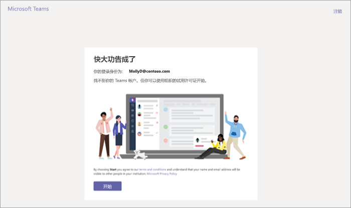
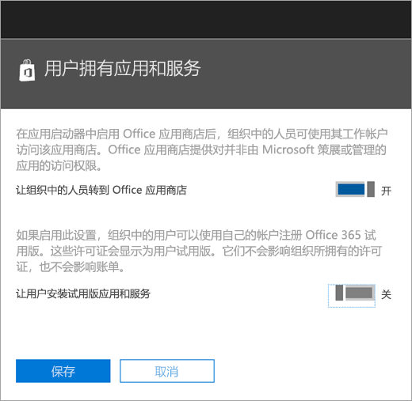
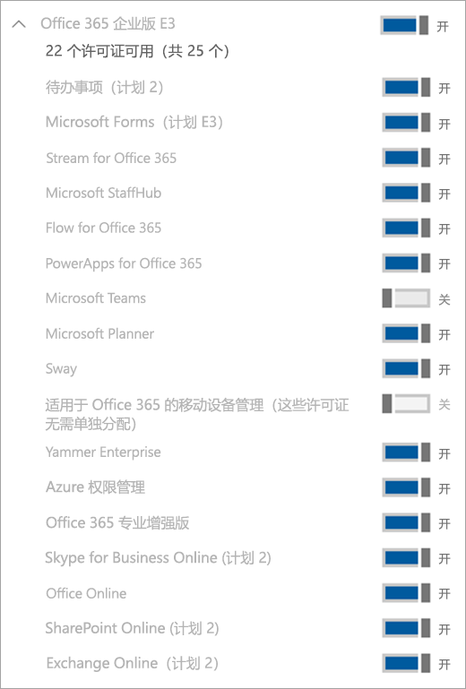

管理 Microsoft 团队商业云试用版
=======================================================

Microsoft 团队是为您的组织的绝佳协作工具。 它使人和团队讨论、 创新和共享想法使用 Office 365 的能力。 Microsoft 团队商业云试用版提供了您的组织中未授权的 Microsoft 团队启动 1 年试用版的产品的现有 Office 365 用户。 管理员能够打开或关闭此功能可供其租户中的用户。

## 什么是在优惠中

包含此服务的服务计划是：

- Exchange Foundation
- Flow for Office 365 计划 1
- Microsoft 计划程序
- Microsoft 团队 （Teams1、 团队 IW）
- Office Online
- Office 365 的 PowerApps 计划 1
- SharePoint Online 计划 1
- Sway
- Yammer Enterprise

## 谁有资格参与

没有包括团队的 Office 365 许可证的用户可以启动 Microsoft 团队商业云试用版。 例如，如果用户具有 Office 365 企业高级版 （其中包括团队），并且禁用团队服务计划，它们不适合试用版。

此外，您的租户不符合试用 if 条件： 
- 您是联合合作伙伴客户
- 您是经销商合作伙伴客户
- 您是 GCC、 GOV 或 EDU 客户

此外，如果您的租户的 Microsoft 团队商业云试用版不符合要求，您将不会看到**让用户安装试用版应用程序和服务**的开关。

在租户级别，作为服务团队需要启用 （在工作组管理中心）。 有关详细信息，请参阅[Office 365 组织中的管理 Microsoft 团队 features](enable-features-office-365.md)。 此外，用户必须启用以注册应用程序和试用 （英文） (Office 365 管理中心中）。 有关详细信息，请参阅本文后面的[管理试用，IW](#manage-the-iw-trial) 。

## 如何用户注册试用版

合格的用户可以注册 IW 试用版通过登录到团队 ([teams.microsoft.com](https://teams.microsoft.com))。 如果符合条件，他们将看到以下屏幕启动试用版。 

IW 试用版授予对您的整个组织的 1 年试用版。 组织内的其他合格用户可以注册 IW 试用一般通过相同的过程。
 
组织内的所有 trials 都共享相同的开始和结束日期，即的日期的第一个用户登录试用。 例如，如果用户 A 启动 2018 年 4 月 25，在第一个试用版，用户 B 启动年 6 月 3 2018年上的试用这两个用户的试用版将上 2019 年 4 月 25，过期。

## 管理 IW 试用版

管理员可以禁用最终用户能够试用版应用程序和服务在其租户中的声明的功能。 目前，团队 IW 试用版是仅试用在此类别中，但这可能将来适用于其他类似的程序。 

驱动器。 从[Office 365 管理中心](https://portal.office.com/adminportal/home)，转到**服务和外接程序** > **用户拥有的应用程序和服务**。

2\。 关闭**让用户安装试用版应用程序和服务**。

3\。 您可以关闭团队的租户，转到团队管理门户。 时禁用此功能，用户不能声明团队 IW 试用版。

4\。 如果已禁用团队服务计划针对个别用户拥有合格的许可证，则该用户不适合声明使用试用许可证。

5\。 如果用户已声明团队试用许可证，您可以通过删除许可证或服务计划将其删除。 

### 用户从试用许可证升级

若要从试用版许可证升级用户，执行以下操作：

1. 购买包括团队 SKU。
2. 团队试用版 SKU 删除用户。
3. 然后分配新购买的许可证。

有关详细信息，请参阅[适用于 Microsoft Teams 的 Office 365 许可](Office-365-licensing.md)。