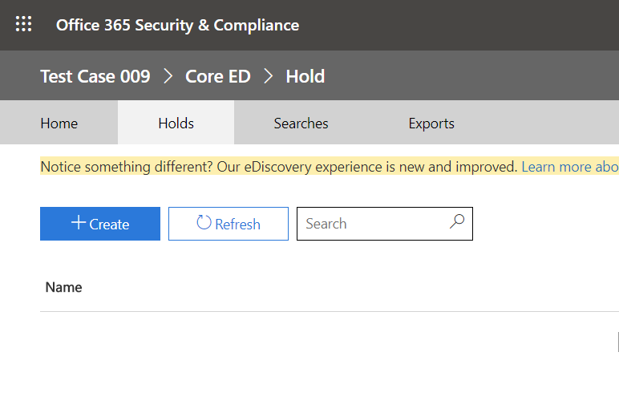

将 Microsoft Teams 用户或团队置于法定保留状态Place a Microsoft Teams user or team on legal hold
==================================================

如果有合理的诉讼预期，组织需要保留电子存储的信息（ESI），包括与案例相关的团队聊天消息。When a reasonable expectation of litigation exists, organizations are required to preserve electronically stored information (ESI), including Teams chat messages that are relevant to the case. 组织可能需要保留与特定主题或特定人员相关的所有消息。Organizations may need to preserve all messages related to a specific topic or for certain individuals. 本文将介绍 Microsoft 团队中的法律封存（若要解决跨 M365 空间的保留实施，请参阅[管理电子数据展示事例：保留内容位置](https://docs.microsoft.com/microsoft-365/compliance/ediscovery-cases#step-4-place-content-locations-on-hold)。）。This article will cover legal hold in Microsoft Teams (To address hold implementation across the M365 space, please review [Manage eDiscovery cases: Place content locations on hold](https://docs.microsoft.com/microsoft-365/compliance/ediscovery-cases#step-4-place-content-locations-on-hold).).

> [!NOTE]
> 在2020年2月，我们已为专用频道（专用频道聊天存储在用户邮箱中，普通频道聊天存储在该团队的组邮箱中）启用了法律封存或案例保留。In Feb 2020, we turned on legal hold or case hold on private channels (private channel chats are stored in user mailboxes, normal channel chats are stored in that Teams’ group mailboxes). 如果用户邮箱已有合法保留，则保留策略现在将自动应用到存储在该邮箱中的专用通道邮件。If there is already a legal hold in place for a user mailbox, the hold policy will now automatically apply to private channel messages stored in that mailbox. 管理员无需执行任何操作即可打开此功能。There is no further action needed for an admin to turn this on. 在专用频道中共享的文件的法定保留也受支持。Legal hold of files shared in private channels is also supported.

在 Microsoft 团队中，整个团队或选择用户可进行保留或法律封存。Within Microsoft Teams, an entire team or select users can be put on hold or legal hold. 执行此操作将确保组织的合规性管理者或团队管理员可以发现在这些团队（包括专用信道）或由这些人员交换的消息中交换的所有消息。Doing that will make sure that all messages that were exchanged in those teams (including private channels) or messages exchanged by those individuals are discoverable by the organization’s compliance managers or Teams Admins.

> [!NOTE]
> 将用户置于保留状态并不会自动将组置于保留状态，反之亦然。Placing a user on hold does not automatically place a group on hold or vice-versa.

将用户或团队置于法律封存状态：To put a user or a team on Legal Hold:

1. 导航到[安全 & 合规中心](https://go.microsoft.com/fwlink/?linkid=854628)。Navigate to the [Security & Compliance Center](https://go.microsoft.com/fwlink/?linkid=854628). 在你创建新案例时，系统会为你提供用于将邮箱或网站置于保留状态的选项。When you create a new case, you are presented with the option to place mailboxes or sites on hold.
1. 转到电子数据展示或高级电子数据展示，并通过单击 "创建事例" 来创建案例。Go to eDiscovery or Advanced eDiscovery and create a case by clicking “+ Create a case”. 一旦创建了事例，请将其打开。Once the case is created, open it.

1. 转到顶部菜单中的 "保留" 部分，然后单击 "+ 创建" 以创建将用户或团队置于保持状态时保存由这些用户或邮件交换的所有邮件保存由这些用户或邮件交换的所有邮件当您创建新事例时，将显示将邮箱或网站置于保持状态的选项。Go to “Holds” section from the top menu and click on “+ Create” to create a hold Putting a user or a team on hold saves all the messages exchanged by those users or messages When you create a new case, you are presented with the option to place mailboxes or sites on hold.

    1. 为**您的保留命名**。**Name your hold**. 为要创建的保留选择一个描述性且唯一的名称。Select a descriptive and unique name for the hold you are going to create.

    1. **选择 "位置**"。**Choose location**. 选择是希望保留应用于用户还是整个团队（现在无法在单个频道上应用保留）。Choose whether you want the hold to be applied on a user or on an entire Team (hold cannot be applied on individual channels for now). 注意：如果用户处于暂停状态，则其所有邮件都将处于暂停状态，包括在1:1 聊天中发送的任何内容、1：许多或群组聊天，或者频道对话（包括专用频道）。Note: if a user is on hold, all their messages would be on hold, including whatever they sent in a 1:1 chat, 1:many or group chat, or a channel conversation (including private channels).
    
    1. **创建查询**。**Create Query**. 如果在保留策略中需要更多粒度，则可以自定义保留。You can customize the hold if you want more granularity in the hold policy. 例如，你可以指定要查找的关键字，也可以添加更多条件，使保留生效。For example, you can specify keywords to look for, or you can add more conditions, that would need to be satisfied for the hold to take effect.
    1. 请先**查看您的设置**，然后再将其发布到您的组织。**Review your settings** before publishing it to your organization.

设置法律封存后，您可以通过关注[团队 eDiscovery](eDiscovery-investigation.md)文章的任何保留政策来发现所有内容。Once the legal hold has been set, you can discover all the content retained by any hold policy following the [Teams eDiscovery](eDiscovery-investigation.md) article.

> [!IMPORTANT]
> 当用户或组处于保留状态时，将保留所有邮件副本。When a user or group is placed on hold, all message copies will be retained. 例如，如果用户在频道中发布了一封邮件，然后修改了该邮件，则在保留方案中，将保留该邮件的两个副本。For example, if a user posted a message in a channel and then modified the message, in a hold scenario, both copies of the message are retained. 如果不保留法律保留，则仅保留最新消息。Without the legal hold in-place, only the latest message is retained.

作为一个有用的指南，您可以使用下表了解基于数据需求需要对法律封存施加哪些内容：As a helpful guide, you can use the table below to understand what needs to be placed on Legal Hold based on data requirements:

|应用场景Scenario  |置于保留状态的内容What to place on hold  |
|---------|---------|
|**Microsoft 团队通过用户（在1:1 聊天上，1：多个或群组聊天、专用频道对话等）聊天内容****Microsoft Teams chat content by a user (on 1:1 chats, 1:many or group chats, private channel conversations, etc.)**     |用户邮箱User mailbox         |
|**Microsoft 团队频道聊天（不包括专用频道）****Microsoft Teams Channel chats (excluding private channels)**    |用于团队的组邮箱Group mailbox used for the team         |
|**Microsoft 团队内容（如 Wiki、文件）****Microsoft Teams content (e.g. Wiki, Files)**     |团队使用的 SharePoint 网站SharePoint site used by the team         |
|**Microsoft 团队专用频道文件****Microsoft Teams Private Channel files**     |专用的专用通道 SharePoint 网站Dedicated Private Channel SharePoint Site     |
|**用户的私人内容****User's private content**     |用户的 OneDrive for Business 网站OneDrive for Business site of the user         |

> [!NOTE]
> 若要在专用通道中保留通信，你需要将用户邮箱（专用通道用户）置于保留状态，使用电子数据展示工具进行搜索时，应在该用户的邮箱中进行搜索。To retain communication in private channels, you need to put the user mailboxes ( Private channel users) on hold and when using eDiscovery tool to search, you should search in that user’s mailbox. 正如之前所述，专用通道聊天存储在用户邮箱中，而不是在团队的组邮箱中。As was stated earlier, private channel chats are stored in user mailboxes, not in group mailbox of a Team.

如果想要阅读有关 M365 中非团队区域的本主题的详细内容，请参阅[管理电子数据展示事例：保留内容位置](https://docs.microsoft.com/microsoft-365/compliance/ediscovery-cases#step-4-place-content-locations-on-hold)。If you want to read further on this topic for non-Teams areas in M365, you should review [Manage eDiscovery cases: Place content locations on hold](https://docs.microsoft.com/microsoft-365/compliance/ediscovery-cases#step-4-place-content-locations-on-hold).
