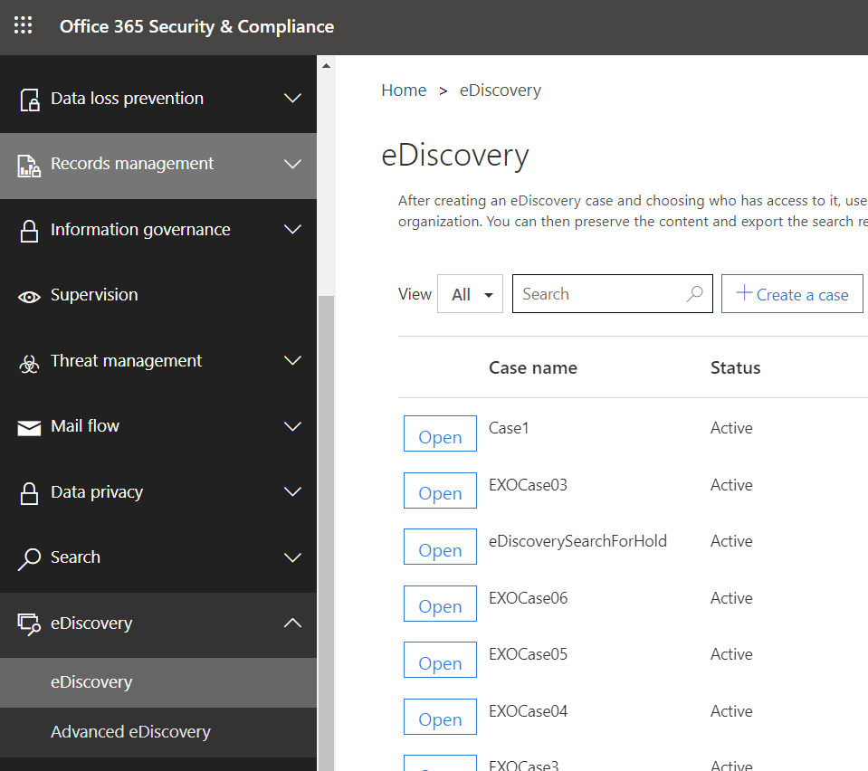

将 Microsoft Teams 用户或团队置于法定保留状态
==================================================

如果有合理的诉讼预期，组织需要保留电子存储的信息（ESI），包括与案例相关的团队聊天消息。 组织可能需要保留与特定主题或特定人员相关的所有消息。 本文将介绍 Microsoft 团队中的法律封存（若要解决跨 M365 空间的保留实施，请参阅[管理电子数据展示事例：保留内容位置](https://docs.microsoft.com/microsoft-365/compliance/ediscovery-cases#step-4-place-content-locations-on-hold)。）。

> [!NOTE]
> 在2020年2月，我们已为专用频道（专用频道聊天存储在用户邮箱中，普通频道聊天存储在该团队的组邮箱中）启用了法律封存或案例保留。 如果用户邮箱已有合法保留，则保留策略现在将自动应用到存储在该邮箱中的专用通道邮件。 管理员无需执行任何操作即可打开此功能。 在专用频道中共享的文件的法定保留也受支持。

在 Microsoft 团队中，整个团队或选择用户可进行保留或法律封存。 执行此操作将确保组织的合规性管理者或团队管理员可以发现在这些团队（包括专用信道）或由这些人员交换的消息中交换的所有消息。

> [!NOTE]
> 将用户置于保留状态并不会自动将组置于保留状态，反之亦然。

将用户或团队置于法律封存状态：

1. 导航到[安全 & 合规中心](https://go.microsoft.com/fwlink/?linkid=854628)。 在你创建新案例时，系统会为你提供用于将邮箱或网站置于保留状态的选项。
1. 转到电子数据展示或高级电子数据展示，并通过单击 "创建事例" 来创建案例。 一旦创建了事例，请将其打开。

1. 转到顶部菜单中的 "保留" 部分，然后单击 "+ 创建" 以创建将用户或团队置于保持状态时保存由这些用户或邮件交换的所有邮件保存由这些用户或邮件交换的所有邮件当您创建新事例时，将显示将邮箱或网站置于保持状态的选项。

    1. 为**您的保留命名**。 为要创建的保留选择一个描述性且唯一的名称。

    1. **选择 "位置**"。 选择是希望保留应用于用户还是整个团队（现在无法在单个频道上应用保留）。 注意：如果用户处于暂停状态，则其所有邮件都将处于暂停状态，包括在1:1 聊天中发送的任何内容、1：许多或群组聊天，或者频道对话（包括专用频道）。
    
    1. **创建查询**。 如果在保留策略中需要更多粒度，则可以自定义保留。 例如，你可以指定要查找的关键字，也可以添加更多条件，使保留生效。
    1. 请先**查看您的设置**，然后再将其发布到您的组织。

设置法律封存后，您可以通过关注[团队 eDiscovery](eDiscovery-investigation.md)文章的任何保留政策来发现所有内容。

> [!IMPORTANT]
> 当用户或组处于保留状态时，将保留所有邮件副本。 例如，如果用户在频道中发布了一封邮件，然后修改了该邮件，则在保留方案中，将保留该邮件的两个副本。 如果不保留法律保留，则仅保留最新消息。

作为一个有用的指南，您可以使用下表了解基于数据需求需要对法律封存施加哪些内容：

|应用场景  |置于保留状态的内容  |
|---------|---------|
|**Microsoft 团队通过用户（在1:1 聊天上，1：多个或群组聊天、专用频道对话等）聊天内容**     |用户邮箱         |
|**Microsoft 团队频道聊天（不包括专用频道）**    |用于团队的组邮箱         |
|**Microsoft 团队内容（如 Wiki、文件）**     |团队使用的 SharePoint 网站         |
|**Microsoft 团队专用频道文件**     |专用的专用通道 SharePoint 网站     |
|**用户的私人内容**     |用户的 OneDrive for Business 网站         |

> [!NOTE]
> 若要在专用通道中保留通信，你需要将用户邮箱（专用通道用户）置于保留状态，使用电子数据展示工具进行搜索时，应在该用户的邮箱中进行搜索。 正如之前所述，专用通道聊天存储在用户邮箱中，而不是在团队的组邮箱中。

如果想要阅读有关 M365 中非团队区域的本主题的详细内容，请参阅[管理电子数据展示事例：保留内容位置](https://docs.microsoft.com/microsoft-365/compliance/ediscovery-cases#step-4-place-content-locations-on-hold)。
