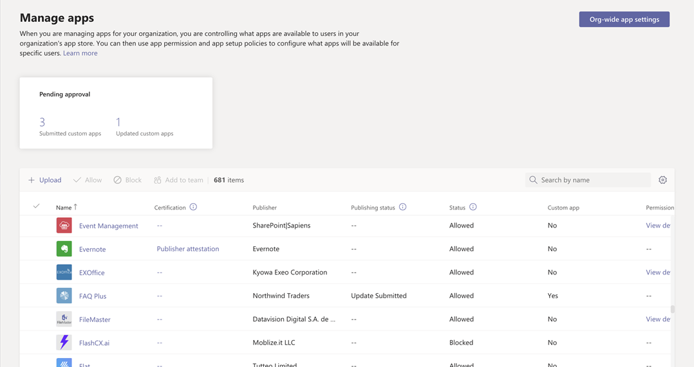

# 在Microsoft Teams管理中心管理Teams应用

在管理中心 **Teams应用** 中管理组织的应用。 使用“[管理应用](https://admin.teams.microsoft.com/policies/manage-apps)”页面查看和管理组织应用目录中的所有Teams应用。 “管理应用”页提供了租户目录中所有可用应用的视图，为你提供决定允许或阻止组织中哪些应用所需的信息。 可以看到应用的组织级别状态和属性，阻止或允许组织级别的应用，将新的自定义应用上传到租户目录，以及管理组织范围的应用设置。

若要使用Teams管理中心，必须是全局管理员或Teams服务管理员。有关详细信息，请参阅[Teams管理员角色](./using-admin-roles.md)。

若要管理应用，请使用策略来控制用户的权限、应用安装以及在组织中创建的自定义应用的上传。 若要了解策略，请参阅 [应用策略概述](app-policies.md)。

> [!NOTE]
> [!INCLUDE [new-teams-sfb-admin-center-notice](includes/new-teams-sfb-admin-center-notice.md)]

> [!NOTE]
> Microsoft 365 政府社区云高 (GCCH) 或国防部 (DoD) 部署Teams中，无法使用“管理应用”页面。

<!--- TBD: This info belongs in the app policy overview article. Title it as mentioned in the spreadsheet.

* **App permission policy**: With it, you can control what apps are available to specific users in your organization. You can allow or block all apps or specific apps published by Microsoft, third-parties, and your organization. See [Manage app permission policies in Teams](teams-app-permission-policies.md).
* **App setup policies**: It lets you customize the app experience for your users. You choose the apps that you want to pin to the app bar in the Teams clients and the order in which they appear, on web, desktop, and mobile clients. See [Manage app setup policies in Teams](teams-app-setup-policies.md).
* **Custom app policies and settings**: Teams allows developers in your organization to build, test, and deploy custom apps to other users. Custom apps can be added to Teams by uploading an app package in a .zip file directly to a team or in the personal context. You can use app setup policies to control who in your organization can upload custom apps. You can also set org-wide settings to control whether users can interact with specific custom apps. See [Manage custom app policies and settings in Teams](teams-custom-app-policies-and-settings).

The following are the important use cases you can accomplish via the the Manage apps page:

* [Allow or block apps at the org level](#allow-and-block-apps)
* [Apps blocked by publishers](#apps-blocked-by-publishers)
* [Add apps to teams](#add-an-app-to-a-team)
* [Approve or upload new custom apps to your organization's app store](#publish-a-custom-app-to-your-organizations-app-store)
* [View permissions requested by apps](#view-resource-specific-consent-permissions)
* [Grant consent to apps](#grant-admin-consent-to-apps)
* [Purchase service for third-party apps](#purchase-services-for-third-party-apps)
* [See org-level status and properties of apps](#view-apps)
* [Manage org-wide app settings](#manage-org-wide-app-settings)
* [View security and compliance information for Microsoft 365 Certified apps](#view-security-and-compliance-information-for-microsoft-365-certified-apps)

<!--- TBD: Commenting for now in favor of the definition list above: 

The Manage apps page gives you a view into all available apps, providing you with the information you need to decide which apps to allow or block across your organization. You can then use [app permission policies](teams-app-permission-policies.md), [app setup policies](teams-app-setup-policies.md), and [custom app policies and settings](teams-custom-app-policies-and-settings.md) to configure the app experience for specific users in your organization.

In the left navigation of the Microsoft Teams admin center, go to **Teams apps** > **Manage apps**. You must be a global admin or Teams service admin to access the page.

--->

<!--- TBD: Move this view apps section to a new article about navigating and understanding TAC. It is yet to be created.

## View apps

You can view every app including the following information about each app.

- **Name**: The app name. Select the app name to go to the app details page to see more information about the app. This includes a description of the app, whether it's allowed or blocked, version, privacy policy, terms of use, categories that apply to the app, certification status, supported capabilities, and app ID.
- **Certification**: If the app has gone through certification, you'll see either **Microsoft 365 certified** or **Publisher attestation**. Select the link to view certification details for the app. If you see `--`, we don't have certification information for the app. To learn more about certified apps in Teams, read [Microsoft 365 App Certification program](/microsoft-365-app-certification/overview).
- **Publisher**: Name of the publisher.
- **Publishing status**: Publishing status of custom apps.
- **Status**: Status of the app at the org level, which can be one of the following:
  - **Allowed**: The app is available for all users in your organization.
  - **Blocked**: The app is blocked and not available for any users in your organization.
  - **Blocked by publisher**: The app is blocked by the publisher and is hidden from end-users by default. After you set up the app using the publisher's guidance, you can allow or block the app to make it available to end-users.
  - **Blocked org-wide**: The app is blocked in org-wide app settings.
      It's important to know that this column represents the allowed and blocked status of apps that were formerly on the **Org-wide settings** pane. You now view, block, and allow apps at the org-wide on the **Manage apps** page.
- **Licenses**: Indicates whether an app offers a Software as a Service (SaaS) subscription for purchase. This column applies only to third-party apps. Each third-party app will have one of the following values:
  - **Purchase**: The app offers a SaaS subscription and is available to purchase.  
  - **Purchased**: The app offers a SaaS subscription and you've purchased licenses for it.
  - **- -**: The app doesn't offer a SaaS subscription.
- **Custom app**: Whether the app is a custom app.
- **Permissions**: Indicates whether a third-party or custom app that's registered in Azure Active Directory (Azure AD) has permissions that need consent. You'll see one of the following values:
  - **View details**: The app has permissions that require consent before the app can access data.
  - **- -**: The app doesn't have permissions that need consent.
- **Categories**: Categories that apply to the app.
- **Version**: App version.
- **Admin can install in meetings**: Indicates whether an app can be installed by admins in Team meetings. [Learn more](teams-app-setup-policies.md#install-apps)

To see the information that you want in the table, select **Edit Column** in the upper-right corner to add or remove columns to the table.
--->

## 将自定义应用发布到组织的应用商店

使用“管理应用”页面发布专门为组织构建的应用。 发布自定义应用后，它可供组织应用商店中的用户使用。 有两种方法可以将自定义应用发布到组织的应用商店。 使用方式取决于获取应用的方式。

* [批准自定义应用](#approve-a-custom-app)：如果开发人员使用Teams应用提交 API 将应用直接提交到“管理应用”页面，请使用此方法。 然后，可以直接从应用详细信息页查看和发布 (或拒绝) 应用。
* [Upload应用包](#upload-an-app-package)：如果开发人员以.zip格式向你发送应用包，请使用此方法。 可以通过上传应用包来发布应用。

### 批准自定义应用

“管理应用”页上的 **“挂起审批**”小组件在开发人员使用Teams应用提交 API 提交应用时通知你。 新提交的应用列出了 **发布状态** 为 **“已提交**”和“**已阻止****状态**”。 转到应用详细信息页，查看有关应用的详细信息，然后将其发布，将 **发布状态** 设置为 **“发布**”。

开发人员将更新提交到自定义应用时，也会收到通知。 然后，可以在应用详细信息页上查看和发布 (或拒绝) 更新。 所有应用权限策略和应用设置策略仍会针对更新后的应用强制实施。

若要了解详细信息，请参阅[发布通过Teams应用提交 API 提交的自定义应用](submit-approve-custom-apps.md)。

### Upload应用包

开发人员使用 Teams [App Studio 创建Teams应用](/microsoftteams/platform/get-started/get-started-app-studio)包，然后以.zip格式将其发送给你。 拥有应用包后，可以将其上传到组织的应用商店。

若要上传新的自定义应用，请选择 **Upload** 上传应用包。 应用上传后不会突出显示，因此需要在“管理应用”页上搜索应用列表才能找到它。

若要在上传应用后更新应用，请在“管理应用”页上的应用列表中选择应用名称，然后选择 **“更新**”。 执行此操作将替换现有应用，并且所有应用权限策略和应用设置策略仍会针对更新后的应用强制执行。

若要了解详细信息，请参阅 [通过上传应用包发布自定义应用](upload-custom-apps.md)。

## 允许和阻止应用

“管理应用”页是允许或阻止组织级别的单个应用的位置。 它显示每个可用的应用及其当前组织级别的应用状态。  (阻止和允许组织级别的应用已从 **组织范围的应用设置** 窗格移动到此处。) 

若要允许或阻止应用，请选择它，然后选择 **“允许** ”或 **“阻止**”。 阻止应用时，将禁用与该应用的所有交互，并且对于组织中的任何用户，应用不会显示在Teams中。

在“管理应用”页上阻止或允许应用时，会阻止或允许组织中的所有用户使用该应用。  在Teams应用权限策略中阻止或允许应用时，系统会阻止或允许分配该策略的用户使用该应用。 若要使用户能够安装任何应用并与之交互，必须在“管理应用”页上的组织级别以及分配给用户的应用权限策略中允许该应用。

 > [!NOTE]
 > 若要卸载应用，请右键单击应用，然后单击 **“卸载** ”或使用左侧的 **“更多应用** ”菜单。

## 被发布者阻止的应用

当 ISV 将应用发布到全局应用商店时，他们可能需要管理员来配置或自定义应用体验。 管理员可以在完全设置应用时将其提供给最终用户。

例如，Contoso 电子版是一个 ISV，它为Microsoft Teams构建了一个技术支持。 Contoso Electronics 希望其客户设置应用的某些属性，以便当用户与应用交互时，它按预期运行。 在管理员允许或阻止应用程序之前，它会在Teams管理中心中显示为 **“被发布者阻止**”，默认情况下会对最终用户进行隐藏。 按照发布者的指南设置应用后，可以通过更改为 **“允许**”状态向用户提供应用，或者通过将状态更改为 **“已阻止**”来阻止用户使用该应用。

## 将应用添加到团队

使用 **“添加到团队** ”按钮将应用安装到团队。 请记住，这仅适用于可在团队范围内安装的应用。 “ **添加到团队** ”按钮不适用于只能安装在个人范围内的应用。

1. 搜索所需的应用，然后单击应用名称左侧选择应用。
1. 选择 **“添加到团队**”。
1. 在 **“添加到团队** ”窗格中，搜索要将应用添加到的团队，选择团队，然后选择 **“应用**”。

## 自定义应用

现在可以自定义应用，以便根据组织需求包含特定的外观。 请参阅[Teams中的自定义应用](customize-apps.md)。

## 购买第三方应用的服务

可以直接从“管理应用”页搜索并购买组织中用户的第三方应用提供的服务许可证。 表中的 **“许可证”** 列指示应用是否提供付费 SaaS 订阅。 **立即选择“购买**”以查看计划和定价信息，并为用户购买许可证。 若要了解详细信息，请参阅[Microsoft Teams管理中心中Teams第三方应用的购买服务](purchase-third-party-apps.md)。

## 向应用授予管理员许可

可以代表组织中的所有用户对请求权限的应用进行评审并授予许可。 为此，用户无需在启动应用时查看和接受应用请求的权限。 “ **权限** ”列指示应用是否具有需要同意的权限。 你将看到在Azure AD中注册的每个应用的 **视图详细信息** 链接，该链接具有需要同意的权限。 若要了解详细信息，请参阅[Microsoft Teams管理中心查看应用权限并授予管理员许可](app-permissions-admin-center.md)。

## 查看特定于资源的许可权限

特定于资源的许可 (RSC) 权限允许团队所有者授予应用访问和修改团队数据的许可。 RSC 权限是精细的、特定于Teams的权限，用于定义应用在特定团队中可以执行的操作。 可以在应用详细信息页的“ **权限** ”选项卡上查看 RSC 权限。 若要了解详细信息，请参阅[Microsoft Teams管理中心查看应用权限并授予管理员许可](app-permissions-admin-center.md)。

## 管理组织范围的应用设置

使用组织范围的应用设置来控制拥有 [F 许可证](https://www.microsoft.com/microsoft-365/enterprise/frontline#office-SKUChooser-0dbn8nt) 的用户是否获得定制的一线应用体验、用户是否可以安装第三方应用，以及用户是否可以上传或与组织中的自定义应用交互。 组织范围的应用设置可控制所有用户的行为，并且可覆盖分配给用户的任何其他应用权限策略。 你可以使用它们控制恶意应用或有问题的应用。

> [!NOTE]
> 若要了解如何在Microsoft 365政府中使用组织范围的应用设置 - 政府社区云高 GCCH 和国防部 (DoD) 部署Teams，请[参阅Teams中的管理应用权限策略](teams-app-permission-policies.md)。

1. 在“管理应用”页上，选择 **组织范围的应用设置**。 然后，可以在窗格中配置所需的设置。

    :::image type="content" source="media/manage-apps-org-wide-app-settings.png" alt-text="“管理应用”页上“组织范围的应用设置”窗格的屏幕截图":::

1. 在 **“定制应用**”下，关闭或打开 **“显示定制应用**”。 启用此设置时，具有 [F 许可证](https://www.microsoft.com/microsoft-365/enterprise/frontline#office-SKUChooser-0dbn8nt) 的用户可获得定制的一线应用体验。 此体验为一线工作人员固定Teams最相关的应用。 若要了解详细信息，请参阅[为一线员工Teams应用](pin-teams-apps-based-on-license.md)。

    此功能适用于 F 许可证。 将来将支持其他许可证类型。
1. 在“**第三方应用**”下，关闭或打开这些设置以控制对第三方应用的访问权限：

    - **允许第三方应用**：控制用户是否可以使用第三方应用。 如果关闭此设置，用户将无法安装或使用任何第三方应用，并且这些应用的应用状态在表中显示为 **“已阻止的组织范围** ”。

        > [!NOTE]
        > **当允许第三方应用** 关闭时，仍会为所有用户启用 [传出 Webhook](/microsoftteams/platform/webhooks-and-connectors/what-are-webhooks-and-connectors)，但可以通过应用权 [限策略](teams-app-permission-policies.md)允许或阻止传出 Webhook 应用在用户级别控制它们。 请注意，如果现有 [Microsoft 应用的应用权限策略](teams-app-permission-policies.md)使用 **“允许特定应用”并阻止所有其他** 设置，并且要为用户启用传出 Webhook，请将传出 Webhook 应用添加到列表中。

        > [!NOTE]
        > 主持会议或与来自其他组织的人员聊天时，Teams 用户可以添加应用。 当他们加入由其他组织主持的会议或聊天时，也可以使用由这些组织的人共享的应用。 将应用主持用户组织的数据策略，以及该用户组织共享的任何第三方应用的数据共享实践。

    - **默认情况下，允许发布到应用商店的所有新的第三方应用**：控制发布到 Teams 应用商店的新第三方应用是否在 Teams 中自动可用。 仅在允许第三方应用时才能设置此选项。

1. 在 **“自定义应用**”下，关闭或启用 **允许与自定义应用的交互**。 此设置控制用户是否可以与自定义应用交互。 要了解详细信息，请参阅[在 Teams 中管理自定义应用策略和设置](teams-custom-app-policies-and-settings.md)。
1. 选择 **“保存** ”以实现组织范围的应用设置。
