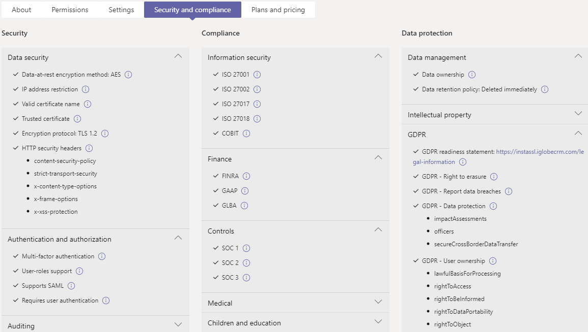

# 在管理中心内Microsoft Teams应用

作为管理员，管理中心中的"Microsoft Teams"页面是查看和管理组织Teams应用的地方。 在这里，可以查看应用的组织级状态和属性、批准新的自定义应用或将其上载到组织的应用商店、在组织级别阻止或允许应用、将应用添加到团队、购买第三方应用的服务、查看应用请求的权限、向应用授予管理员同意，以及管理组织范围内的应用设置。

"管理应用"页面提供所有可用应用的视图，为你提供确定在整个组织中允许或阻止哪些应用时需要的信息。 然后，可以使用 [应用权限策略](teams-app-permission-policies.md)、 [应用设置策略](teams-app-setup-policies.md)和自定义应用策略 [和](teams-custom-app-policies-and-settings.md) 设置为组织中特定用户配置应用体验。

在 Microsoft Teams 管理中心的左侧导航中，转到“**Teams 应用**” > “**管理应用**”。 只有全局管理员或Teams才能访问页面。

> [!NOTE]
> "管理应用"页在 Microsoft 365 政府社区云 High (GCCH) 或国防部 (DoD) 部署中Teams。

## 查看应用

你可以查看每个应用，包括有关每个应用的以下信息。

- **名称**：应用名称。 选择应用名称以转到应用详细信息页以查看有关该应用的详细信息。 这包括应用的说明，无论是允许还是阻止应用、版本、隐私策略、使用条款、适用于应用的类别、认证状态、支持的功能和应用 ID。 下面是一个示例：

  
  
- **认证**：如果应用已通过认证，你将看到 **Microsoft 365认证Publisher****认证。** 选择链接以查看应用的认证详细信息。 如果看到 **--** ""，则我们没有应用的认证信息。 若要详细了解应用中的认证Teams，请阅读Microsoft 365[认证计划。](/teams-app-certification/all-apps)  
- **Publisher：** 发布者的名称。
- **发布状态**：自定义应用的发布状态。
- **状态**：组织级别的应用状态，可以是下列其中一项：
- **允许**：该应用可供你组织的所有用户使用。
- **已** 阻止：应用被阻止，并且不适用于组织的任何用户。
- **阻止组织范围**：应用在组织范围内的应用设置中受阻。
      必须知道，此列表示以前位于" **组织** 范围的设置"窗格中的应用的允许和阻止状态。 现在，您可以在"管理应用"页面上的组织范围内查看、阻止和 **允许应用** 。
- **许可证**：指示应用是否提供软件即服务 (SaaS) 订阅进行购买。 此列仅适用于第三方应用。 每个第三方应用将具有以下值之一：
- **现在购买**：该应用提供 SaaS 订阅，可供购买。  
- **已** 购买：该应用提供 SaaS 订阅，并且你已购买其许可证。
- **- -**：应用未提供 SaaS 订阅。
- **自定义应用**：应用是否是自定义应用。
- **权限**：指示在 Azure AD Azure Active Directory (注册的第三方或自定义) 是否具有需要许可的权限。 会看到以下值之一：
- **查看详细信息**：应用具有需要许可才能访问数据的权限。
- **-**： 应用没有需要许可的权限。
- **类别**：适用于应用的类别。
- **版本**：应用版本。
- **管理员可以在会议中安装**：指示管理员是否可以在团队会议中安装应用。 [了解详细信息](teams-app-setup-policies.md#install-apps)

若要在表中查看信息，请选择右上角的"编辑列"，向表中添加或删除列。

## 将自定义应用发布到组织的应用商店

使用"管理应用"页发布专为组织构建的应用。 发布自定义应用后，该应用可供组织应用商店中的用户使用。 有两种方法将自定义应用发布到组织的应用商店。 你使用的方式取决于你获取应用的方式。

- [批准自定义应用](#approve-a-custom-app)：如果开发人员使用应用提交 API 将应用直接提交到"管理应用"Teams使用此方法。 然后，你可以直接从应用 (查看) 或拒绝应用。
- [Upload应用包](#upload-an-app-package)：如果开发人员以其他格式将应用包发送给你，.zip方法。 通过上传应用包发布应用。

### 批准自定义应用

当 **开发人员使用** 应用提交 API 提交应用时，"管理应用"页面上的"挂起审批"小组件Teams通知你。 新提交的应用将列出，其发布 **状态****为"已** 提交"，"**状态"** 为"已 **阻止"。** 转到应用详细信息页以查看有关应用的详细信息，然后发布它，将"**发布状态"设置为**"发布 **"。**

开发人员将更新提交到自定义应用时，也会收到通知。 然后，可以在应用详细信息 (查看) 或拒绝更新。 对于更新的应用，所有应用权限策略和应用设置策略仍然强制实施。

若要了解有关详细信息，请参阅[发布通过应用提交 API Teams提交的自定义应用](submit-approve-custom-apps.md)。

### Upload应用包

开发人员使用 Teams [App Studio](/microsoftteams/platform/get-started/get-started-app-studio)创建Teams应用包，然后以 .zip 格式发送给你。 当你拥有应用包时，你可以将其上传到组织的应用商店。

若要上传新的自定义应用，请选择Upload **应用包**。 应用上传后不会突出显示，因此你需要在"管理应用"页面上搜索应用列表以找到它。

若要在应用上传后更新应用，请在"管理应用"页面上的应用列表中，选择应用名称，然后选择"更新 **"。** 执行此操作会替换现有应用，并且所有应用权限策略和应用设置策略仍对更新的应用强制实施。

若要了解有关详细信息，请参阅通过 [上传应用包 发布自定义应用](upload-custom-apps.md)。

## 允许和阻止应用

"管理应用"页面是组织级别允许或阻止单个应用的地方。 它显示每个可用的应用及其当前的组织级应用状态。  (组织级别的阻止和允许应用已从" **组织范围** 的应用设置"窗格移动到此处。) 

若要允许或阻止应用，请选择它，然后选择"允许 **"或**"阻止 **"。** 当你阻止应用时，将禁用与该应用的所有交互，并且该应用不会显示在你Teams的任何用户的应用中。

在"管理应用"页面上阻止或允许应用时，将阻止或允许组织中所有用户使用该应用。  当你阻止或允许应用Teams应用权限策略时，将阻止或允许分配有该策略的用户使用。 若要使用户能够安装任何应用并与之交互，必须在"管理应用"页面和分配给用户的应用权限策略中允许组织级别的应用。

 > [!NOTE]
 > 若要卸载应用，请右键单击该应用，然后单击左侧的"卸载或使用更多应用"菜单。

## 向团队添加应用

使用" **添加到团队"** 按钮将应用安装到团队。 请记住，这仅适用于可在团队范围内安装的应用。 " **添加到团队** "按钮不适用于只能在个人范围内安装的应用。

1. 搜索你需要的应用，然后单击应用名称左侧选择该应用。
2. 选择 **"添加到团队"。**
3. 在"**添加到团队"** 窗格中，搜索要添加应用的团队，选择团队，然后选择"应用 **"。**

## 自定义应用

现在，你可以自定义应用，以根据组织需求包含特定的外观。 请参阅[自定义应用中Teams。](customize-apps.md)

## 购买第三方应用的服务

可以直接从"管理应用"页面搜索并购买第三方应用为组织用户提供的服务的许可证。 表中的 **"** 许可证"列指示应用是否提供付费 SaaS 订阅。 选择 **"立即** 购买"，查看计划和定价信息，并购买用户的许可证。 有关详细信息，请参阅在 Teams 管理中心中购买第三[方Microsoft Teams服务](purchase-third-party-apps.md)。

## 向应用授予管理员许可

可以代表组织中所有用户查看并授予对请求权限的应用的许可。 你这样做，以便用户不必在启动应用时查看并接受应用请求的权限。 " **权限"** 列指示应用是否具有需要许可的权限。 对于在 Azure  AD 中注册并拥有需要许可的权限的每个应用，你将看到"查看详细信息"链接。 若要了解有关详细信息，请参阅在管理中心中查看应用权限Microsoft Teams[管理员许可](app-permissions-admin-center.md)。

## 查看特定于资源的许可权限

RSC (资源) 权限允许团队所有者授予应用访问和修改团队数据的许可。 RSC 权限是Teams特定权限，用于定义应用可在特定团队中执行哪些操作。 可以在应用详细信息页面的"权限"选项卡上查看 RSC 权限。 若要了解有关详细信息，请参阅在管理中心中查看应用权限Microsoft Teams[管理员许可](app-permissions-admin-center.md)。

## 管理组织范围内的应用设置

使用组织范围的应用设置来控制用户是否可以安装第三方应用，以及用户是否可以上载或与组织中的自定义应用进行交互。 组织范围的应用设置可控制所有用户的行为，并且可覆盖分配给用户的任何其他应用权限策略。 你可以使用它们控制恶意应用或有问题的应用。

> [!NOTE]
> 若要了解如何使用 Microsoft 365 政府 - 政府社区云 高 GCCH 和国防部 (DoD) Teams 部署中的组织范围应用设置，请参阅在 Teams 中[管理应用权限策略](teams-app-permission-policies.md)。

1. 在"管理应用"页上，选择 **"组织范围的应用设置"。** 然后，你可以在面板中配置所需的设置。

    

2. 在“**第三方应用**”下，关闭或打开这些设置以控制对第三方应用的访问权限：

    - **允许第三方应用**：控制用户是否可以使用第三方应用。 如果关闭此设置，用户将无法安装或使用任何第三方应用，并且这些应用的应用状态在表中显示为"阻止组织范围"。 

        > [!NOTE]
        > 当 **"** 允许第三方应用"关闭时，仍为所有用户启用传出 [Webhook，](/microsoftteams/platform/webhooks-and-connectors/what-are-webhooks-and-connectors) 但可以通过应用权限策略 允许或阻止传出 Webhook 应用，在用户级别控制 [它们](teams-app-permission-policies.md)。   请注意，如果 Microsoft 应用的现有应用权限策略使用"允许特定应用并阻止所有其他应用"设置，并且希望为用户启用传出 Webhook，则向列表添加传出 Webhook 应用。 

        > [!NOTE]
        > 主持会议或与来自其他组织的人员聊天时，Teams 用户可以添加应用。 当他们加入由其他组织主持的会议或聊天时，也可以使用由这些组织的人共享的应用。 将应用主持用户组织的数据策略，以及该用户组织共享的任何第三方应用的数据共享实践。

    - **默认情况下，允许发布到应用商店的所有新的第三方应用**：控制发布到 Teams 应用商店的新第三方应用是否在 Teams 中自动可用。 仅在允许第三方应用时才能设置此选项。

3. 在 **"自定义应用**"下，关闭或打开 **"允许与自定义应用交互"。** 此设置控制用户是否可以与自定义应用交互。 要了解详细信息，请参阅[在 Teams 中管理自定义应用策略和设置](teams-custom-app-policies-and-settings.md)。
4. 选择 **"保存** "，使组织范围内的应用设置生效。

## 查看认证应用的安全Microsoft 365信息

为组织评估应用时，管理员可以使用独立的云访问安全代理 (CASB) （如 Microsoft Cloud App Security (MCAS) ）来查找有关应用安全性和行为的信息。 Teams管理中心包含来自 MCAS 的安全和合规性信息，Microsoft 365认证应用，以便你了解有关应用是否满足你需求的信息。

> [!NOTE]
> 此功能可供所有管理员使用，无论你的组织是否具有支持 MCAS 的许可证。

若要访问 MCAS 信息，请执行以下步骤：

1. 在"Teams管理中心"中，选择"**管理应用"Teams****应用"。**
1. 选择 **"** 认证"以对应用进行排序，Microsoft 365认证应用推送到表格顶部。
1. 选择一Microsoft 365认证应用。
1. 选择" **安全性和符合性"** 选项卡。

在此选项卡上，可找到有关安全性、符合性和数据保护的信息。 还可以展开每个下拉列表，获取有关所选应用程序支持哪些功能的更多详细信息。

## 相关主题

- [Teams 中应用的管理设置](admin-settings.md)
