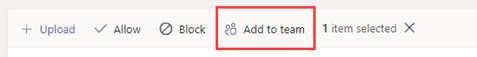

在 Microsoft Teams 管理中心管理应用
======================================================

作为管理员，Microsoft Teams 管理中心中的"管理应用"页面是查看和管理组织的所有 Teams 应用的地方。 在这里，可以查看应用的组织级状态和属性、批准新的自定义应用或将其上载到组织的应用商店、在组织级别阻止或允许应用、将应用添加到团队、购买第三方应用的服务、查看应用请求的权限、向应用授予管理员同意，以及管理组织范围内的应用设置。

"管理应用"页面提供所有可用应用的视图，为你提供确定在整个组织中允许或阻止哪些应用时需要的信息。 然后，可以使用 [应用权限策略](teams-app-permission-policies.md)、 [应用设置](teams-app-setup-policies.md)策略以及自定义应用策略 [和](teams-custom-app-policies-and-settings.md) 设置为组织中特定用户配置应用体验。

在 Microsoft Teams 管理中心的左侧导航栏中，转到 **"Teams 应用**  >  **管理应用"。** 只有全局管理员或 Teams 服务管理员才能访问页面。

> [!NOTE]
> 在 Teams 部署中，Microsoft 365 政府社区云和 GCC (") 页尚不可用。

## 查看应用

你可以查看每个应用，包括有关每个应用的以下信息。

- **名称**：应用名称。 单击应用名称转到应用详细信息页，查看有关应用的详细信息。 这包括应用的描述，无论是允许还是阻止、版本、隐私策略、使用条款、适用于应用的类别、认证状态、支持的功能和应用 ID。 下面是一个示例：

  
  
- **认证**：如果应用已通过认证，你将看到 **Microsoft 365** 认证或 **发布者证明**。 单击该链接可查看应用的认证详细信息。 如果看到 **--** ""，则没有应用的认证信息。 若要详细了解 Teams 中的认证应用，请阅读 [Microsoft 365 应用认证计划](https://docs.microsoft.com/teams-app-certification/all-apps)。  
- **发布者**：发布者的名称。
- **发布状态**：自定义应用的发布状态。
- **状态**：组织级别的应用状态，可以是下列其中一项：

    - **允许**：该应用可供你组织的所有用户使用。
    
    - **已阻止**：应用被阻止，对组织中任何用户不可用。
    
    - **阻止组织范围**：应用在组织范围内的应用设置中被阻止。
    
      必须知道，此列表示以前位于组织范围的设置窗格中的应用的允许和 **阻止** 状态。 现在，您可以在"管理应用"页面上查看、阻止和允许组织 **范围内的** 应用。 
- **许可证**：指示应用是否提供软件即服务 (SaaS) 订阅进行购买。 此列仅适用于第三方应用。 每个第三方应用将具有以下值之一：
    - **现在购买**：该应用提供 SaaS 订阅，可供购买。  
    - **已** 购买：该应用提供 SaaS 订阅，并且你已购买其许可证。
    - **- -**：应用未提供 SaaS 订阅。
- **自定义应用**：应用是否是自定义应用。
- **权限**：指示在 Azure AD (Azure Active Directory) 注册的第三方或自定义应用是否具有需要许可的权限。 会看到以下值之一：
    - **查看详细信息**：应用具有需要同意才能访问数据的权限。 
    - **- -** 应用没有需要许可的权限。
- **类别**：适用于应用的类别。
- **版本**：应用版本。

若要在表中查看您需要的信息，请单击右上角的"编辑列"，向表中添加或删除列。

## 将自定义应用发布到组织的应用商店

使用"管理应用"页发布专为组织构建的应用。 发布自定义应用后，该应用可供组织应用商店中的用户使用。 有两种方法将自定义应用发布到组织的应用商店。 使用方式取决于获取应用的方式。

- [批准自定义应用](#approve-a-custom-app)：如果开发人员使用 Teams 应用提交 API 将应用直接提交到"管理应用"页面，请使用此方法。 然后，你可以直接从应用 (查看) 或拒绝应用。
- [上传应用包](#upload-an-app-package)：如果开发人员以 .zip 格式发送给你应用包，请使用此方法。 通过上传应用包发布应用。

###  批准自定义应用

当 **开发人员使用** Teams 应用提交 API 提交应用时，"管理应用"页面上的"等待审批"小组件会通知你。 新提交的应用将列出，发布 **状态为****"已** 提交"，状态 **为**"已 **阻止"。** 转到应用详细信息页以查看有关应用的详细信息，然后发布它，将 **发布状态设置为****"发布"。**

开发人员将更新提交到自定义应用时，你也会收到通知。 然后，可以在应用详细信息 (查看) 或拒绝更新。 对于更新的应用，所有应用权限策略和应用设置策略仍强制实施。

若要了解有关详细信息，请参阅 ["发布通过 Teams 应用](submit-approve-custom-apps.md)提交 API 提交的自定义应用"。

### 上传应用包

开发人员使用 [Teams App Studio](https://docs.microsoft.com/microsoftteams/platform/get-started/get-started-app-studio)创建 Teams 应用包，然后以 .zip 格式发送给你。 当你拥有应用包时，你可以将其上传到组织的应用商店。

若要上传新的自定义应用，请选择 **"上传** "以上传应用包。 应用上传后未突出显示，因此你需要在"管理应用"页面上搜索应用列表以找到它。

若要在应用上传后更新应用，请在"管理应用"页面上的应用列表中，单击应用名称，然后单击"更新 **"。** 这样做会替换现有应用，并且所有应用权限策略以及应用设置策略仍对更新的应用强制实施。

若要了解有关详细信息，请参阅"通过[上传应用包发布自定义应用"。](upload-custom-apps.md)

## 允许和阻止应用

在"管理应用"页中，您可以在组织级别允许或阻止单个应用。 它显示每个可用的应用及其当前的组织级应用状态。  (阻止和允许组织级别的应用从"组织范围的应用设置"窗格移动到此处。) 

若要允许或阻止应用，请选择它，然后单击"**允许"或**"**阻止"。** 当你阻止应用时，将禁用与该应用的所有交互，并且对于你组织的任何用户，该应用不会显示在 Teams 中。

当你在"管理应用"页面上阻止或允许应用时，将阻止或允许你组织中所有用户使用该应用。  在 Teams 应用权限策略中阻止或允许应用时，会阻止或允许分配有该策略的用户使用该应用。 若要使用户能够安装任何应用并与之交互，必须在"管理应用"页面和分配给用户的应用权限策略中允许组织级别的应用。

 > [!NOTE]
 > 若要卸载应用，请右键单击该应用，然后单击"卸载"或使用左侧的"更多应用"菜单。

## 向团队添加应用

使用" **添加到团队"** 按钮将应用安装到团队。 请记住，这仅适用于可在团队范围内安装的应用。 " **添加到团队** "按钮不适用于只能在个人范围内安装的应用。

1. 搜索你需要的应用，然后单击应用名称左侧选择该应用。
2. 选择 **"添加到团队"。**
3. 在"**添加到团队"** 窗格中，搜索要添加应用的团队，选择团队，然后选择"应用 **"。**

## 购买第三方应用的服务

可以直接从"管理应用"页面搜索并购买第三方应用为组织用户提供的服务的许可证。 表中的 **"** 许可证"列指示应用是否提供付费 SaaS 订阅。 单击 **"立即** 购买"查看计划和定价信息，并购买用户的许可证。 若要了解有关详细信息，请参阅 Microsoft Teams 管理中心中为 Teams 第三 [方应用购买服务](purchase-third-party-apps.md)。

## 向应用授予管理员许可

可以代表组织中所有用户查看并授予对请求权限的应用的许可。 这样做是让用户在启动应用时不必查看并接受应用请求的权限。 " **权限"** 列指示应用是否具有需要许可的权限。 对于在 Azure  AD 中注册并拥有需要许可的权限的每个应用，你将看到"查看详细信息"链接。 若要了解有关详细信息，请参阅"在 Microsoft Teams 管理中心查看应用[权限并授予管理员许可"。](app-permissions-admin-center.md)

## 查看特定于资源的许可权限

RSC (资源) 权限允许团队所有者授予应用访问和修改团队数据的许可。 RSC 权限是特定于团队的粒度权限，用于定义应用可在特定团队中执行哪些操作。 可以在应用详细信息页面的"权限"选项卡上查看 RSC 权限。 若要了解有关详细信息，请参阅"在 Microsoft Teams 管理中心查看应用[权限并授予管理员许可"。](app-permissions-admin-center.md)

## 管理组织范围内的应用设置

使用组织范围的应用设置来控制用户是否可以安装第三方应用，以及用户是否可以上传或与组织中的自定义应用交互。 组织范围的应用设置控制所有用户的行为，并覆盖分配给用户的其他任何应用权限策略。 可以使用它们来控制恶意或有问题的应用。

> [!NOTE]
> 若要了解如何在 Microsoft 365 政府版 - Teams 的 GCC 部署中使用组织范围的应用设置，请参阅"在 Teams 中管理[应用权限策略"。](teams-app-permission-policies.md)

1. 在"管理应用"页面上，选择 **组织范围内的应用设置**。 然后，可以在面板中配置想要的设置。

    
    
2. 在第 **三方应用下**，关闭或打开这些设置以控制对第三方应用的访问：

    - **允许第三方应用**：控制用户是否可以使用第三方应用。 如果关闭此设置，用户将无法安装或使用任何第三方应用，并且这些应用的应用状态在表中显示为"已阻止组织范围"。 

        > [!NOTE]
        > 当 **"允许第三方** 应用"关闭时，将禁用传出 [Webhook，](https://docs.microsoft.com/microsoftteams/platform/webhooks-and-connectors/what-are-webhooks-and-connectors) 这意味着用户无法创建它们。 启用此设置后，将针对所有用户启用传出 Webhook，并且可以通过应用权限策略允许或阻止传出 Webhook 应用，在用户级别 [控制它们](teams-app-permission-policies.md)。   请注意，如果有 Microsoft 应用的现有应用权限策略使用"允许特定应用"并阻止所有其他设置，并且希望为用户启用传出 Webhook，则向列表添加传出 Webhook 应用。 
    - **允许默认情况下发布到** 应用商店的任何新第三方应用：这控制发布到 Teams 应用商店的新第三方应用在 Teams 中是否自动可用。 只有在允许第三方应用时，才能设置此选项。

3. 在 **"自定义应用**"下，关闭或打开"**允许与自定义应用交互"。** 此设置控制用户是否可以与自定义应用交互。 若要了解有关详细信息，请参阅["在 Teams 中管理自定义应用策略和设置"。](teams-custom-app-policies-and-settings.md)
4. 单击 **"** 保存"，使组织范围内的应用设置生效。

## 相关主题

- [Teams 中适用于应用的管理设置](admin-settings.md)