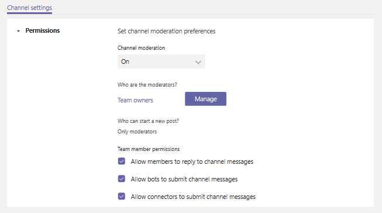

# 在 Microsoft 团队中设置和管理渠道裁决Set up and manage channel moderation in Microsoft Teams

在 Microsoft 团队中, 团队所有者可以为频道启用裁决, 以控制哪些人可以开始新文章以及答复该频道中的帖子。In Microsoft Teams, team owners can turn on moderation for a channel to control who can start new posts and reply to posts in that channel.

团队所有者还可以将团队成员添加为审阅人。Team owners can also add team members as moderators. 团队所有者可能在频道级别没有主题专业知识, 以获得最佳支持渠道裁决。A team owner might not have the subject matter expertise at the channel level to best support channel moderation. 通过允许特定团队成员来安排频道, 管理频道中的内容和上下文的责任由团队所有者和渠道审阅者共享。By allowing specific team members to moderate a channel, the responsibility of managing content and context within a channel is shared between team owners and channel moderators. 例如, 团队所有者可以将企业所有者或内容所有者添加为审阅者, 从而使他们可以控制该频道中的信息共享。For example, a team owner can add business owners or content owners as moderators, which lets them control information sharing in that channel.

## 频道审查方可以执行哪些操作？What can a channel moderator do?

频道审阅者可以:Channel moderators can:

- 在频道中开始新的文章。Start new posts in the channel. 为频道启用裁决后, 只有审阅人可以在该频道中开始新的帖子。When moderation is turned on for a channel, only moderators can start new posts in that channel.
- 将团队成员添加和删除为频道的审阅人。Add and remove team members as moderators to a channel. 请记住, 默认情况下, 团队所有者是 "频道审阅者", 不能删除。Keep in mind that by default, team owners are channel moderators and can't be removed.
- 控制团队成员是否可以答复现有信道消息, 以及机器人和连接器是否可以提交频道消息。Control whether team members can reply to existing channel messages and whether bots and connectors can submit channel messages.

## 方案Scenarios

下面是组织如何在团队中使用渠道裁决的一些示例。Here's some examples of how your organization can use channel moderation in Teams.

### 将频道用作公告通道Use a channel as an announcement channel

市场营销团队使用特定的频道来共享关键项目公告和可交付结果。The Marketing team uses a specific channel to share key project announcements and deliverables. 有时, 团队成员向频道发布内容更恰当地属于其他频道。Sometimes team members post content to the channel that more appropriately belongs in other channels. 团队所有者希望将频道中的信息共享限制为仅通知通知, 以便团队成员可以使用该频道保持最重要的内容。The team owner wants to restrict information sharing in the channel to only announcements so that team members can use that channel to stay on top of what's important.

在此方案中, 团队所有者将市场营销线索添加为审阅者, 以便他们可以在频道中发布公告, 并关闭工作组成员答复该频道中的邮件的功能。In this scenario, the team owner adds Marketing leads as moderators so they can post announcements in the channel and turns off the ability for team members to reply to messages in that channel.

### 在教育团队中使用渠道进行课堂讨论Use a channel for class discussions in Teams for Education

在 "教育团队" 中, 一位科学老师希望使用频道在特定教室主题的重点讨论中吸引学生。In Teams for Education, a science teacher want to use a channel to engage students in focused discussions on specific classroom topics.

在这种情况下, 教师可以通过 "教学助手" 来使频道适中。In this scenario, the teacher allows their teaching assistants to moderate the channel. 然后, "教学助手" 可以创建新的文章来启动和推动与学生进行讨论。The teaching assistants can then create new posts to initiate and drive discussions with students.

## 管理渠道裁决Manage channel moderation

在 "团队" 中, 转到频道, 单击 "**更多选项 ...** " > **管理频道**。In Teams, go to the channel, click **More options ...** > **Manage channel**. 在此处, 您可以打开和关闭 "裁决", 将团队成员添加为审阅者, 以及设置首选项。From here you can turn on and turn off moderation, add team members as moderators, and set preferences.

### 打开或关闭频道裁决Turn on or turn off moderation for a channel

默认情况下, "裁决" 处于关闭状态, 你可以仅将新帖子限制为团队成员, 或允许每个人 (包括来宾) 开始新的帖子。By default, moderation is off and you can restrict new posts to only team members or allow everyone, including guests, to start new posts.

若要为频道启用裁决, 请在 "**通道裁决**" 下, 单击 **"打开"**。To turn on moderation for a channel, under **Channel moderation**, click **On**. 当频道裁决处于开启时, 只有审阅人可以开始新的帖子。When channel moderation is on, only moderators can start new posts. 

### 添加或删除频道审阅者Add or remove channel moderators

在 "**谁是审阅人**" 下, 单击 "**管理**", 然后添加或删除团队成员为 "审阅者"。Under **Who are the moderators?**, click **Manage**, and then add or remove team members as moderators. 团队所有者和审阅者可以添加和删除其他审阅人。Team owners and moderators can add and remove other moderators.  

### 设置团队成员权限Set team member permissions

在 "**团队成员权限**" 下, 选中要允许的活动旁边的复选框。Under **Team member permissions**, select the check boxes next to the activities  you want to allow.

## 相关主题Related topics

- [团队中的团队和频道概述Overview of teams and channels in Teams](teams-channels-overview.md)