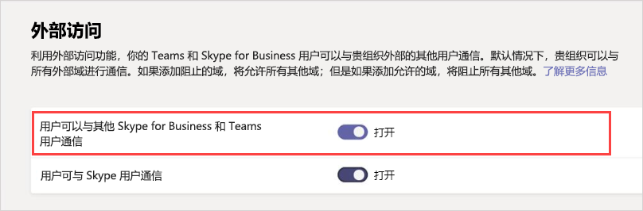
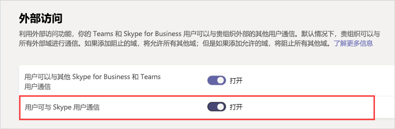

# 在 Microsoft Teams 中管理外部访问

外部访问让整个外部域中的 Teams 用户能够在 Teams 中进行查找、通话、聊天和安排与你之间的会议。 还可使用外部访问与仍在使用 Skype for Business（联机和本地）和 Skype（预览版）的其他组织人员进行通信。

如果希望其他组织中的人员有权访问团队和频道，来宾访问可能更好。 有关外部访问和来宾访问之间的差异的详细信息，请参阅[比较外部访问和来宾访问](communicate-with-users-from-other-organizations.md#compare-external-and-guest-access)。 

在以下情况下使用外部访问：
  
- 你拥有在不同域中需要协作的用户。 例如，Rob@contoso.com 和 Ann@northwindtraders.com 与 contoso.com 和 northwindtraders.com 域中的其他一些人协作处理某个项目。

- 你希望自己组织内的人员使用 Teams 联系组织外特定企业中的人员。

- 你希望世界各地使用 Teams 的所有其他人都能够通过使用你的电子邮件地址找到并联系你。 

> [!IMPORTANT]
> 若要使用 Teams 客户端与外部用户（无论该用户使用的是 Teams 还是 Skype for Business）进行通信，Teams 用户必须位于 Skype for Business Online 中。

## 规划外部访问

默认情况下，Teams 中的外部访问处于启用状态，这意味着你的组织可以与所有外部域进行通信。 如果添加阻止的域，将允许所有其他域；如果添加允许的域，将阻止所有其他域。 此规则的例外是允许匿名参与者参加会议。 在 Teams 管理中心（“**组织范围的设置**” > “**外部访问**”）设置外部访问有三种情形：

> [!NOTE]
> 如果关闭组织中的外部访问，外部用户仍可通过匿名加入加入会议。 若要了解详细信息，请参阅[管理 Teams 中的会议策略](https://docs.microsoft.com/microsoftteams/meeting-settings-in-teams)。

- **开放式联合身份验证**：这是 Teams 中的默认设置，可让你组织中的用户查找你组织外部任何域中的人员，并与这些人员进行通话、聊天和安排会议。

    在这种情形中，你的用户能够与符合以下条件的所有外部域进行通信：正在运行 Teams 或 Skype for Business，并且正在使用开放式联合身份验证，或者已将你的域添加到他们允许列表中。

- **允许特定域**：通过将域添加到“**允许**”列表中，将外部访问限制为仅允许的域。 设置允许的域列表后，将阻止所有其他域。 若要允许特定域，请单击“**添加域**”，添加域名，单击“**要在此域上执行的操作**”，然后选择“**已允许**”。

- **阻止特定域** - 通过将域添加到“**阻止**”列表中，可与 *除阻止的域之外* 的所有外部域进行通信。 若要阻止特定域，请单击“**添加域**”，添加域名，单击“**要在此域上执行的操作**”，然后选择“**已阻止**”。 设置阻止的域列表后，将允许所有其他域。

> [!NOTE]
> 允许或阻止的域仅适用于会议（当匿名访问会议"关闭"时）。

## 允许或阻止域

### 步骤 1 - 使组织能够与其他团队或 Skype for Business 组织进行通信

  **使用 Microsoft Teams 管理中心**

1. 在左侧导航栏中，转到“**组织范围的设置**” > “**外部访问**”。

2. 启用“**用户可以与其他 Skype for Business 和 Teams 用户通信**”设置。

     .

3. 如果想要允许所有 Teams 组织与你组织中的用户进行通信，请跳到步骤 5。

4. 如果想要限制可与你组织中的用户进行通信的组织，你可以允许除某些域之外的所有域，或者你可以仅允许特定域。 

    - 若要允许除某些域之外的所有域，请单击“**添加域**”，添加要阻止的域。 在“**添加域**”窗格中，键入域名，单击“**已阻止**”，然后单击“**完成**”。 
    - 若要限制为仅与特定组织进行通信，请将这些域添加到具有“**已允许**”状态的列表中。 将任何域添加到“允许”列表后，与其他组织的通信将仅限于所在域位于“允许”列表中的组织。 

5. 单击“**保存**”。

6. 确保其他 Teams 组织中的管理员完成了上述相同步骤。 例如，如果他们要限制可与其用户通信的组织，其管理员需要在“**允许的域**”列表中输入你企业的域。

### 步骤 2 - 测试

若要测试你的设置，你需要一名不在你防火墙后方的 Teams 用户。
  
1. 在你和你组织的管理员更改了“**外部访问**”设置后，应该可以继续进行操作。

2. 在 Teams 应用中，通过电子邮件地址搜索该用户，并发送聊天请求。

3. 让你的 Teams 联系人向你发送聊天请求。 如果未收到其请求，则问题源于你的防火墙设置（假设他们已确认他们的防火墙设置正确）。

4. 测试问题是否源于防火墙的另一种方法是转到一个不在你防火墙后方的 WiFi 位置。 例如前往某家咖啡店，然后使用 Teams 向联系人发送聊天请求。 如果在这个 WiFi 位置可以顺利传送消息，但在你的工作地点不行，那么可以确定问题源于你的防火墙。

> [!NOTE]
> 如果你和另一名用户都启用了外部访问并允许了彼此的域，应该可以正常工作。 如果不正常，另一名用户应确保其配置未阻止你的域。

## 与 Skype 用户进行通信（处于预览阶段）

请按照以下步骤，让你组织中的 Teams 用户与 Skype 用户聊天和通话。 然后，Teams 用户可以搜索和启动与 Skype 用户之间的一次性文本对话或音频/视频通话，以及反向操作。

  **使用 Microsoft Teams 管理中心**

1. 在左侧导航栏中，转到“**组织范围的设置**” > “**外部访问**”。

2. 启用“**用户可与 Skype 用户通信**”设置。

    .

若要深入了解 Teams 用户和 Skype 用户之间的通信方式（包括适用的限制），请参阅 [Teams 和 Skype 的互操作性](teams-skype-interop.md)。

## 常见外部访问情形

以下部分介绍了如何为常见外部访问方案启用联合身份验证，以及 TeamsUpgradePolicy 如何确定传入聊天和呼叫的传递。

### 启用联盟：

若要使组织中的用户能与另一个组织中用户进行通信，两个组织必须启用联合身份验证。 为给定组织启用联合身份验证的步骤取决于组织是否完全联机、混合或完全在本地。

|**如果您的组织是** |**启用联合身份验证，如下所示**  |
|:---------|:-----------------------|
|在线，无需内部部署Skype for Business。 这包括具有 TeamsOnly 用户和/或 Skype for Business Online 用户的组织。| 如果使用 Teams 管理中心：  - 请确保已 **外部访问中启用了"** Skype for Business"和"团队"用户之间的通信。 - 如果不使用打开的联盟（允许与任何其他域进行联盟），则外部域添加到允许列表中。  如果使用 PowerShell： - 确保为联合身份验证启用租户： `Get-CsTenantFederationConfiguration` 必须显示 `AllowFederatedUsers=true`。  - 确保用户具有 `CsExternalAccessPolicy` 有效 `EnableFederationAccess=true`。 - 如果不使用打开的联盟，请确保目标域列于`AllowedDomains``CsTenantFederationConfiguration`。 |
|纯本地 | 在本地工具中：  - 确保 `CsAccessEdgeConfiguration`已启用。 - 确保通过策略 `ExternalAccessPolicy` 用户联盟（通过全局策略、网站策略或用户分配的策略）。   - 如果不使用打开的联盟，请确保目标域列于 `AllowedDomains`。 |
|与一些联机用户（在 Skype for Business 或 Teams 中）和一些本地用户混合。 | 为联机组织本地组织执行上述步骤。 |

### 送达传入聊天和呼叫 

联合组织的传入聊天和呼叫将位于用户的 Teams 或 Skype for Business 客户端，具体取决于 TeamsUpgradePolicy 中收件人的模式。

|**如果您要** |**为此，可以：**  |
|:---------|:-----------------------|
| 确保传入的联合聊天和呼叫会到达用户的 Teams 客户端： | 将用户配置为 TeamsOnly。
| 确保传入的联合聊天和呼叫会到达用户的 Skype for Business 客户端 | 将用户配置为除 TeamsOnly 外的任何模式。 |

### 在组织用户与 Skype 消费者用户之间启用联合身份验证

若要在组织用户与 Skype 消费者用户之间启用联合身份验证：

|**如果您的组织是** |**启用消费者联合身份验证，如下所示**  |
|:---------|:-----------------------|
| 纯在线，本地没有 Skype for Business。  这包括具有 TeamsOnly 用户和/或 Skype for Business Online 用户的组织。 | 如果使用 Teams 管理中心：  - 确保 **外部访问中启用了 skype** 与 Skype 用户进行通信。  如果使用 PowerShell：  -确保为联合身份验证启用租户： `Get-CsTenantFederationConfiguration` 必须显示 `AllowPublicUsers=true`。   - 确保用户具有 `CsExternalAccessPolicy` 有效 `EnablePublicCloudAccess=true`。 |
| 纯本地 | 在本地工具中：   - 确保启用 Skype 作为联盟合作伙伴。   - 通过 `EnablePublicCloudAccess=true` 确保 `ExternalAccessPolicy` 服务（通过全局策略、网站策略或用户分配的策略）。|
| 与一些联机用户（在 Skype for Business 或 Teams 中）和一些本地用户混合。| 为联机组织本地组织执行上述步骤。

> [!IMPORTANT]
> 你无需添加任何 **Skype 域** 作为允许的域，就可以使 Teams 或 Skype for Business Online 用户与你组织内部或外部的 Skype 用户进行通信。 允许 **Skype 域** Skype 域。

## 外部访问与来宾访问有何不同？

若要了解外部访问和来宾访问之间的区别，请参阅[与其他组织的用户通信](communicate-with-users-from-other-organizations.md)。

## 相关主题

- [外部（联合身份验证）用户的本机聊天体验](native-chat-for-external-users.md)
