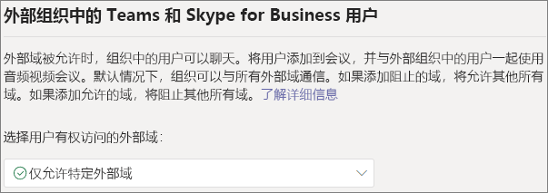
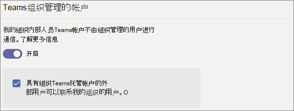
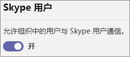

# <a name="manage-external-access-in-microsoft-teams"></a>在 Microsoft Teams 中管理外部访问

外部访问让组织外的 Teams 用户能够在 Teams 中进行查找、通话、聊天和设置与你之间的会议。 还可使用外部访问与仍在使用 Skype for Business (联机和本地) 和 Skype 的其他组织人员进行通信。

如果希望其他组织中的人员有权访问你的团队和频道，请改用来宾访问。 有关外部访问和来宾访问之间的差异的详细信息，请参阅[比较外部访问和来宾访问](communicate-with-users-from-other-organizations.md#compare-external-and-guest-access)。 

在以下情况下使用外部访问：
  
- 你在外部域中有需要聊天的用户。例如，Rob@contoso.com 和 Ann@northwindtraders.com 与 contoso.com 和 northwindtraders.com 域中的其他一些人协作处理某个项目。

- 你希望自己组织内的人员使用 Teams 联系组织外特定企业中的人员。

- 你希望世界各地使用 Teams 的所有其他人都能够通过使用你的电子邮件地址找到并联系你。 

## <a name="plan-for-external-access"></a>规划外部访问

外部访问策略包括组织和用户级别的每种联合类型的控制。 无论所有用户的用户级别设置如何，在组织级别关闭策略都会将其关闭。 默认情况下启用所有外部访问设置。

Teams 管理中心控制组织级别的外部访问。 大多数选项 (域限制除外) 都可在用户级别使用 PowerShell。 有关详细信息，请参阅以下的 [使用 PowerShell](#using-powershell)。

> [!NOTE]
> 如果在组织中关闭外部访问权限，组织外部的人员仍可以通过匿名加入加入会议。若要了解详细信息，请参阅 [管理 Teams 中的会议设置](meeting-settings-in-teams.md)。

> [!NOTE]
> 主持会议或与来自其他组织的人员聊天时，Teams 用户可以添加应用。 当他们加入由其他组织主持的会议或聊天时，也可以使用由这些组织的人共享的应用。 将应用主持用户组织的数据策略，以及该用户组织共享的任何第三方应用的数据共享实践。

## <a name="allow-or-block-domains"></a>允许或阻止域

如果添加阻止的域，将允许所有其他域；如果添加允许的域，将阻止所有其他域。 此规则的例外是允许匿名参与者参加会议。 在 Teams 管理中心 (**用户** > **外部访问**) 设置外部访问有四种情形:

- **允许所有外部域**: 这是 Teams 中的默认设置，可让你组织中的用户查找你组织外部任何域中的人员，并与这些人员进行通话、聊天和安排会议。

    在此方案中，只要其他租户也支持外部通信，你的用户可以与所有运行 Teams 或 Skype for Business 的外部域进行通信。
    
- **仅允许特定外部域**: 通过将域添加到 **“允许”** 列表中，将外部访问限制为仅允许的域。 设置允许的域列表后，将阻止所有其他域。 

- **阻止特定域** - 通过将域添加到“**阻止**”列表中，可与 *除阻止的域之外* 的所有外部域进行通信。  设置阻止的域列表后，将允许所有其他域。

- **阻止所有外部域**: 阻止组织中的人在任何域中查找、呼叫、聊天和与组织外部的人安排会议。

> [!NOTE]
> 允许或阻止的域仅适用于会议（当匿名访问会议"关闭"时）。



**使用 Microsoft Teams 管理中心**

允许特定域

1. 在 Teams 管理中心，转到 **“用户”** > **“外部访问”**。

2. 在 **选择用户有权访问的域** 下，选择 **仅允许特定外部域**。

3. 选择 **允许域**。

4. 在 **域** 框中，键入想要允许的域，然后单击 **完成**。

5. 如果要允许其他域，请单击 **添加域**。

6. 单击“**保存**”。

阻止特定域

1. 在 Teams 管理中心，转到 **“用户”** > **“外部访问”**。

2. 在 **选择用户有权访问的域** 下，选择 **仅阻止特定外部域**。

3. 选择 **阻止域**。

4. 在 **域** 框中，键入想要允许的域，然后单击 **完成**。

5. 如果要阻止其他域，请单击 **添加域**。

6. 单击“**保存**”。

若要与其他租户通信，他们必须启用 **允许所有外部域** 或按照上述相同步骤将租户添加到允许的域列表中。  

## <a name="manage-contact-with-external-teams-users-not-managed-by-an-organization"></a>管理与组织未管理的外部 Teams 用户的联系人

管理员可以选择启用或禁用与不受组织管理的外部 Teams 用户 (“非托管”) 的通信。 如果启用，他们还可以进一步控制具有非托管 Teams 帐户的人员是否可以发起联系人 (请参阅下图)。 如果关闭 **组织未托管的 Teams 帐户的外部用户可以联系我组织中的用户**，则非托管 Teams 用户将无法搜索完整的电子邮件地址以查找组织联系人，并且必须由组织用户启动与非托管 Teams 用户的所有通信。

在 Teams 管理中心，转到 **“用户”** > **“外部访问”**。



若要阻止组织中的 Teams 用户与帐户不由组织管理的外部 Teams 用户进行通信:
1. 关闭 **组织中的人员可以与帐户不受组织管理的 Teams 用户进行通信** 设置。
2. 清除 **具有不由组织管理的 Teams 帐户的外部用户可以联系我组织中用户** 的复选框。

如果你的 Teams 用户已启动联系人，则要让组织中的 Teams 用户与其帐户未由组织管理的外部 Teams 用户通信:
1. 开启 **组织中的人员可以与帐户不受组织管理的 Teams 用户进行通信** 设置。
2. 清除 **具有不由组织管理的 Teams 帐户的外部用户可以联系我组织中用户** 的复选框。

若要让组织中的 Teams 用户与帐户不受组织管理的外部 Teams 用户进行通信，并接收与这些外部 Teams 用户通信的请求:
1. 开启 **组织中的人员可以与帐户不受组织管理的 Teams 用户进行通信** 设置。
2. 选择 **具有不由组织管理的 Teams 帐户的外部用户可以联系我组织中用户** 的复选框。

## <a name="communicate-with-skype-users"></a>与 Skype 用户进行通信

请按照以下步骤，让你组织中的 Teams 用户与 Skype 用户聊天和通话。 然后，Teams 用户可以搜索和启动与 Skype 用户之间的一次性文本对话或音频/视频通话，以及反向操作。



**使用 Microsoft Teams 管理中心**

1. 在左侧导航栏中，转到 **用户** > **外部域**。

2. 启动 **允许组织中的用户与 Skype 用户通信** 设置。

若要深入了解 Teams 用户和 Skype 用户之间的通信方式（包括适用的限制），请参阅 [Teams 和 Skype 的互操作性](teams-skype-interop.md)。

## <a name="using-powershell"></a>使用 PowerShell

可以使用 [Set-CSTenantFederationConfiguration](/powershell/module/skype/set-cstenantfederationconfiguration) 配置组织级别设置，并且可以使用 [Set-CsExternalAccessPolicy](/powershell/module/skype/set-csexternalaccesspolicy) 配置用户级别设置。

下表显示了用于配置联合的 cmdlet 参数。

|配置|组织级别 (Set-CSTenantFederationConfiguration)|用户级别 (Set-CsExternalAccessPolicy)|
|:-------|:--------|:------------------|
|启用/禁用与其他 Teams 组织和 Skype for Business 的联合|`-AllowFederatedUsers`|`-EnableFederationAccess`|
|启用与特定域的联合|`-AllowedDomains`|不可用|
|禁用与特定域的联合|`-BlockedDomains`|不可用|
|启用/禁用与未由组织管理的 Teams 用户的联合|`-AllowTeamsConsumer`|`-EnableTeamsConsumerAccess`|
|启用/禁用组织未管理的 Teams 用户启动的对话|`-AllowTeamsConsumerInbound`|`-EnableTeamsConsumerInbound`|
|启用/禁用与 Skype 的联合|`-AllowPublicUsers`|`-EnablePublicCloudAccess`|

请务必注意，禁用策略将从租户“下滚”到用户。例如：

```PowerShell
Set-CsTenantFederationConfiguration -AllowFederatedUsers $false
Set-CsExternalAccessPolicy -EnableFederationAccess $true
```

在此示例中，尽管启用了用户级别策略，但用户将无法与托管 Teams 用户或 Skype for Business 用户进行通信，因为此类联合身份验证已在组织级别关闭。 因此，如果要为用户子集启用这些控件，必须在组织级别启用该控件，并创建两个组策略 – 一个使用于应关闭控件的用户，一个使用于应打开控件的用户。

## <a name="limit-external-access-to-specific-people"></a>限制对于特定人员的外部访问

如果已在组织级别启用任何外部访问控制，则可以使用 PowerShell 限制特定用户的外部访问。

可以使用以下示例脚本，使用控件替换要改变的 *控件*，使用 *PolicyName* 代替要给策略的名称，使用 *UserName* 代替要启用/禁用外部访问的每个用户。

在运行脚本之前，请确保已安装 [Microsoft Teams PowerShell 模块](/microsoftteams/teams-powershell-install)。

```PowerShell
Connect-MicrosoftTeams

# Disable external access globally
Set-CsExternalAccessPolicy -<Control> $false

# Create a new external access policy
New-CsExternalAccessPolicy -Identity <PolicyName> -<Control> $true

# Assign users to the policy
$users_ids = @("<UserName1>", "<UserName2>")
New-CsBatchPolicyAssignmentOperation -PolicyType ExternalAccessPolicy -PolicyName "<PolicyName>" -Identity $users_ids

```

例如，启用与组织未管理的外部 Teams 用户的通信:

```PowerShell
Connect-MicrosoftTeams

Set-CsExternalAccessPolicy -EnableTeamsConsumerAccess $false

New-CsExternalAccessPolicy -Identity ContosoExternalAccess -EnableTeamsConsumerAccess $true

$users_ids = @("MeganB@contoso.com", "AlexW@contoso.com")
New-CsBatchPolicyAssignmentOperation -PolicyType ExternalAccessPolicy -PolicyName "ContosoExternalAccess" -Identity $users_ids

```

有关如何编译用户列表的其他示例，请参阅 [New-CsBatchPolicyAssignmentOperation](/powershell/module/teams/new-csbatchpolicyassignmentoperation)。

可以通过运行 `Get-CsExternalAccessPolicy` 来查看新策略。

另请参阅 [New-CsExternalAccessPolicy](/powershell/module/skype/new-csexternalaccesspolicy) 和[Set-CsExternalAccessPolicy](/powershell/module/skype/set-csexternalaccesspolicy)。

## <a name="common-external-access-scenarios"></a>常见外部访问情形

以下部分介绍了如何为常见外部访问方案启用联合身份验证，以及 TeamsUpgradePolicy 如何确定传入聊天和呼叫的传递。

### <a name="enable-federation-between-users-in-your-organization-and-other-organizations"></a>在组织中的用户与其他组织之间启用联合

若要使组织中的用户能与另一个组织中用户进行通信，两个组织必须启用联合身份验证。 为给定组织启用联合身份验证的步骤取决于组织是否完全联机、混合或完全在本地。

| 如果你的组织是 | 启用联合身份验证，如下所示 |
|:---------|:-----------------------|
|在线，无需内部部署Skype for Business。 这包括具有 TeamsOnly 用户和/或 Skype for Business Online 用户的组织。| 如果使用 Teams 管理中心： <br>- 确保允许要与之通信的域进行外部访问。<br><br>如果使用 PowerShell：<br>- 确保为联合身份验证启用租户： `Get-CsTenantFederationConfiguration` 必须显示 `AllowFederatedUsers=true`。 <br>- 确保用户的有效 `CsExternalAccessPolicy` 值具有 `EnableFederationAccess=true`。<br>- 如果不使用打开的联盟，请确保目标域列于`AllowedDomains``CsTenantFederationConfiguration`。 |
|仅本地| 在本地工具中： <br>- 确保 `CsAccessEdgeConfiguration`已启用。<br>- 确保通过策略 `ExternalAccessPolicy` 用户联盟（通过全局策略、网站策略或用户分配的策略）。 <br> - 如果不使用打开的联盟，请确保目标域列于 `AllowedDomains`。|
|与一些联机用户（在 Skype for Business 或 Teams 中）和一些本地用户混合。 | 为联机组织本地组织执行上述步骤。 |

### <a name="delivery-of-incoming-chats-and-calls"></a>送达传入聊天和呼叫 

联合组织的传入聊天和呼叫将位于用户的 Teams 或 Skype for Business 客户端，具体取决于 TeamsUpgradePolicy 中收件人的模式。

| 如果要 | 执行以下操作： |
|:---------|:-----------------------|
|确保传入的联合聊天和呼叫会到达用户的 Teams 客户端|将用户配置为 TeamsOnly。
|确保传入的联合聊天和呼叫会到达用户的 Skype for Business 客户端|将用户配置为除 TeamsOnly 外的任何模式。|

### <a name="enable-federation-between-users-in-your-organization-and-unmanaged-teams-users"></a>在组织中的用户与未托管 Teams 用户之间启用联合

若要将在组织中的用户与未托管 Teams 用户之间启用联合:

| 如果你的组织是 | 启用联合身份验证，如下所示 |
|:---------|:-----------------------|
|在线，无需内部部署Skype for Business。 这包括具有 TeamsOnly 用户和/或 Skype for Business Online 用户的组织。| 如果使用 Teams 管理中心:<br>-确保在 **外部访问** 中，**我的组织中的人员可以与账户不受组织管理的 Team 用户交流**。<br>-如果希望非托管 Teams 帐户启动聊天，请选中 **组织未管理的 Teams 帐户的外部用户可与组织中的用户联系** 方框。<br><br>如果使用 PowerShell：<br>-确保为联合身份验证启用租户： `Get-CsTenantFederationConfiguration` 必须显示 `AllowTeamsConsumer=true`。<br>- 确保用户具有 `CsExternalAccessPolicy` 有效 `EnableTeamsConsumerAccess=true`。<br>-确保为非托管用户启用租户以启动聊天: `Get-CsTenantFederationConfiguration` 必须显示 `AllowTeamsConsumerInbound=true`。<br>- 确保用户具有 `CsExternalAccessPolicy` 有效 `EnableTeamsConsumerInbound=true`。|
|仅本地| 仅本地组织不支持与非托管 Teams 用户聊天。|
|与一些联机用户（在 Skype for Business 或 Teams 中）和一些本地用户混合。 | 按照前面所述的联机组织步骤进行操作。 请注意，本地用户不支持与非托管 Teams 用户聊天。|

> [!IMPORTANT]
> 无需将任何 **Teams 域** 添加为允许的域，以使 Teams 用户与组织外部的非托管 Teams 用户进行通信。允许所有 **未托管的 Teams 域**。

### <a name="enable-federation-between-users-in-your-organization-and-consumer-users-of-skype"></a>在组织用户与 Skype 消费者用户之间启用联合身份验证

若要在组织用户与 Skype 消费者用户之间启用联合身份验证：

| 如果你的组织是 | 启用消费者联合身份验证，如下所示 |
|:---------|:-----------------------|
|仅提供在线服务，不提供本地的 Skype for Business。 这包括具有 TeamsOnly 用户和/或 Skype for Business Online 用户的组织。 | 如果使用 Teams 管理中心： <br>- 请确保 **允许组织中的用户与 Skype 用户通信** 在外部访问中启用。<br><br>如果使用 PowerShell： <br>-确保为联合身份验证启用租户： `Get-CsTenantFederationConfiguration` 必须显示 `AllowPublicUsers=true`。 <br> - 确保用户的有效 `CsExternalAccessPolicy` 值具有 `EnablePublicCloudAccess=true`。 |
|仅本地| 在本地工具中： <br> - 确保启用 Skype 作为联盟合作伙伴。 <br> - 通过 `EnablePublicCloudAccess=true` 确保 `ExternalAccessPolicy` 服务（通过全局策略、网站策略或用户分配的策略）。|
| 与一些联机用户（在 Skype for Business 或 Teams 中）和一些本地用户混合。| 为联机组织本地组织执行上述步骤。

> [!IMPORTANT]
> 你无需添加任何 **Skype 域** 作为允许的域，就可以使 Teams 或 Skype for Business Online 用户与你组织内部或外部的 Skype 用户进行通信。已允许所有 **Skype 域**。

## <a name="federation-diagnostic-tool"></a>联合诊断工具

如果你是管理员，则可以使用以下诊断工具来验证 Teams 用户是否可以与联合 Teams 用户进行通信:

1. 选择下面 **运行测试**，这将在 Microsoft 365 管理中心中弹出诊断结果。 

   > [!div class="nextstepaction"]
   > [运行测试: Teams 联盟](https://aka.ms/TeamsFederationDiag)

2. 在“运行”诊断窗格中，输入 **会话初始协议 (SIP) 地址** 和 **联合租户的域名**，然后选择 **运行测试**。

3. 测试将返回最佳后续步骤，以解决阻止与联合用户通信的任何租户或策略配置的问题。


## <a name="related-topics"></a>相关主题

[外部（联合身份验证）用户的本机聊天体验](native-chat-for-external-users.md)
