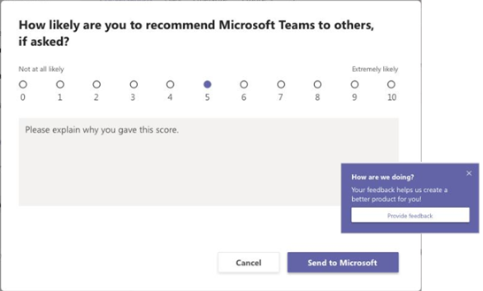

# <a name="manage-feedback-policies-in-microsoft-teams"></a>在 Microsoft Teams 中管理反馈策略

组织中的用户可以发送有关 Microsoft Teams 的反馈，让我们知道我们是如何直接从 Teams 桌面、Web 客户端和移动设备中执行的。 我们正在不断改进 Teams 体验，并使用此反馈使 Teams 变得更好。

> [!NOTE]
> GCC、GCC High 或 DOD 部署中不提供反馈策略。

****“提供反馈**”功能**

用户可以通过转到 Teams 桌面和 Web 中的 **“帮助** > **提供反馈** ”向我们发送有关 Teams 的意见和建议。


使用 **“设置** > **帮助”访问移动版反馈&反馈** > **发送反馈**。


 根据 Microsoft 365 或Office 365协议，通过 **“提供反馈** 和 **发送”反馈** 发送的数据被视为“支持数据”，包括将被视为“客户数据”或“个人数据”的信息。


**调查**

用户还可以对他们使用 Teams 的体验进行评分，并向我们发送有关他们给出的分级的详细信息。 此弹出式调查会在 Teams 中不时向用户显示。 当用户在通知中选择 **“提供反馈** ”时，会显示调查以供其完成。



## <a name="set-whether-users-can-send-feedback-about-teams-to-microsoft"></a>设置用户是否可以向 Microsoft 发送有关 Teams 的反馈

作为管理员，你可以控制组织中的用户是否可以向 Microsoft 发送有关 Teams 的反馈，以及他们是否收到调查。 默认情况下，组织中的所有用户都会自动分配全局 (组织范围内的默认) 策略，并且在策略中启用反馈功能和调查。 异常Teams 教育版，其中为教师启用了功能，并为学生禁用了功能。

可以编辑全局策略或创建和分配自定义策略。 编辑全局策略或分配自定义策略后，更改可能需要几个小时才能生效。

例如，你希望允许组织中的所有用户发送反馈并接收调查，但培训中的新员工除外。 在此方案中，你将创建一个自定义策略来关闭这两个功能，并将其分配给新员工。 组织中的所有其他用户都会在启用功能后获取全局策略。  

使用 PowerShell 管理反馈策略。 使用 [**New-CsTeamsFeedbackPolicy** cmdlet](/powershell/module/skype/new-csteamsfeedbackpolicy) 创建自定义策略。 使用 **Grant-CsTeamsFeedbackPolicy** cmdlet 将其分配给一个或多个用户或用户组，例如安全组或通讯组。 使用 **Set-CsTeamsFeedbackPolicy** 设置特定标志。

若要关闭和打开功能，请设置以下参数：

 - **提供反馈**：将 **userInitiatedMode** 参数设置为 **启用** ，以允许分配策略的用户提供反馈。 将参数设置为 **“已禁** 用”会关闭该功能，并且分配了策略的用户没有提供反馈的选项。

 - **调查**：将 **receiveSurveysMode** 参数设置为 **启用** ，以允许分配策略的用户接收调查。 若要让用户接收调查并允许他们选择退出，请将参数设置为 **enabledUserOverride**。 在 Teams 中，用户可以转到 **“设置隐私”** > ，并选择是否要参与调查。 将参数设置为 **禁用** 会关闭该功能，分配策略的用户将不会收到调查。

 - **屏幕截图**：使用 **AllowScreenshotCollection** 标志为用户添加屏幕截图集合选择加入。
 - **Email**：使用 **AllowEmailCollection** 标志添加电子邮件字段。
 - **日志收集**：使用 **AllowLogCollection** 标志为用户添加日志收集选择加入。 日志收集当前仅在移动设备上启用。 有关通过日志共享的数据的更多详细信息，请 [了解详细信息](https://go.microsoft.com/fwlink/?linkid=2168178)。

## <a name="create-a-custom-feedback-policy"></a>创建自定义反馈策略

在此示例中，我们创建了名为“新员工反馈策略”的反馈策略，并关闭通过 **“提供反馈** ”和“调查”提供反馈的功能。

```PowerShell
New-CsTeamsFeedbackPolicy -identity "New Hire Feedback Policy" -userInitiatedMode disabled -receiveSurveysMode disabled
```

## <a name="assign-a-custom-feedback-policy-to-users"></a>向用户分配自定义反馈策略

[!INCLUDE [assign-policy](includes/assign-policy.md)]

在此示例中，我们将一个名为“新建雇佣反馈策略”的自定义策略分配给名为 user1 的用户。

```PowerShell
Grant-CsTeamsFeedbackPolicy -Identity user1@contoso.com -PolicyName "New Hire Feedback Policy"
```

## <a name="related-topics"></a>相关主题

- [Teams PowerShell 概览](teams-powershell-overview.md)
- [向 Teams 中的用户分配策略](policy-assignment-overview.md)
