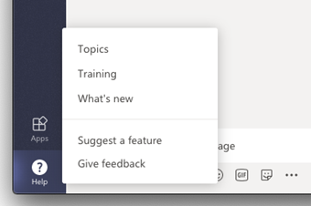

# <a name="manage-feedback-policies-in-microsoft-teams"></a>管理反馈策略Microsoft Teams

[!INCLUDE [preview-feature](includes/preview-feature.md)]

您的组织中的用户可以发送有关Microsoft Teams的反馈，让我们知道我们直接从桌面、web 客户端和Teams内部进行的工作。 我们正在不断改进用户体验，Teams反馈来改进Teams体验。

> [!NOTE]
> 反馈策略在高级、GCC GCC DOD 部署中不可用。

**" **提供反馈"** 功能**

用户可以通过在桌面和 web Teams帮助提供反馈，向我们发送Teams  >  和建议。




在移动设备上使用"帮助  >  **"设置"&"发送**  >  **反馈"。**


 通过"提供反馈"和"发送反馈"发送的数据在 Microsoft 365 或 Office 365 协议下被视为"支持数据"，包括否则被视为"客户数据"或"个人数据"的信息。


**调查**

用户还可以评价他们使用Teams并向我们发送他们给出的分级的详细信息。 此弹出式调查会实时向用户显示Teams。 当用户在通知 **中选择"提供** 反馈"时，将显示调查供其完成。


## <a name="set-whether-users-can-send-feedback-about-teams-to-microsoft"></a>设置用户是否可以向 Microsoft Teams反馈

作为管理员，你可以控制你组织中用户是否可以向 Microsoft 发送有关Teams的反馈，以及他们是否收到调查。 默认情况下，将自动为组织中的所有用户分配全局 (组织范围的默认) 策略，并且反馈功能与调查在策略中启用。 例外情况是Teams 教育版，其中为教师启用和禁用了学生的功能。

可以编辑全局策略，也可以创建和分配自定义策略。 编辑全局策略或分配自定义策略后，可能需要几个小时更改才能生效。

例如，您希望允许您的组织中的所有用户发送反馈和接收调查，但培训中的新员工除外。 在此方案中，请创建自定义策略来关闭这两项功能，并将其分配给新员工。 组织中所有其他用户在启用功能后获取全局策略。  

使用 PowerShell 管理反馈策略。 使用 [**New-CsTeamsFeedbackPolicy** cmdlet](/office365/enterprise/powershell/manage-skype-for-business-online-with-office-365-powershell) 创建自定义策略。 使用 **Grant-CsTeamsFeedbackPolicy** cmdlet 将其分配给一个或多个用户或用户组，例如安全组或通讯组。 使用 **Set-CsTeamsFeedbackPolicy** 设置特定标志。

若要关闭并打开功能，请设置以下参数：

 - **提供反馈**：将 **userInitiatedMode** 参数设置为 **"启用** "，以允许分配有策略的用户提供反馈。 将 参数 **设置为 disabled** 会关闭该功能，并且分配有策略的用户没有提供反馈的选项。
 - **Surveys：** 将 **receiveSurveysMode** 参数设置为 **已启用** ，以允许分配了策略的用户接收调查。 若要让用户接收调查并允许他们选择退出，将 参数设置为 **enabledUserOverride**。 在Teams中，用户可以转到"设置  >  **隐私**"并选择是否要参与调查。 将 参数 **设置为 disabled** 会关闭该功能，分配有策略的用户不会收到调查。
 - **电子邮件**：使用 **AllowEmailCollection** 标志添加电子邮件字段。
 - **日志收集**：使用 **AllowLogCollection** 标志为用户添加日志收集选择加入。 目前仅在移动设备上启用日志收集。 有关通过日志共享哪些数据的更多详细信息， [请了解详细信息](https://go.microsoft.com/fwlink/?linkid=2168178)。

## <a name="create-a-custom-feedback-policy"></a>创建自定义反馈策略

本示例创建一个称为"新员工反馈策略"的反馈策略，并关闭通过"提供反馈"和"调查" **提供** 反馈的能力。

```PowerShell
New-CsTeamsFeedbackPolicy -identity "New Hire Feedback Policy" -userInitiatedMode disabled -receiveSurveysMode disabled
```

## <a name="assign-a-custom-feedback-policy-to-users"></a>向用户分配自定义反馈策略

[!INCLUDE [assign-policy](includes/assign-policy.md)]

本示例将名为"新员工反馈策略"的自定义策略分配给名为 user1 的用户。

```PowerShell
Grant-CsTeamsFeedbackPolicy -Identity user1@contoso.com -PolicyName "New Hire Feedback Policy"
```

## <a name="related-topics"></a>相关主题

- [Teams PowerShell 概览](teams-powershell-overview.md)
- [向 Teams 中的用户分配策略](assign-policies.md)
