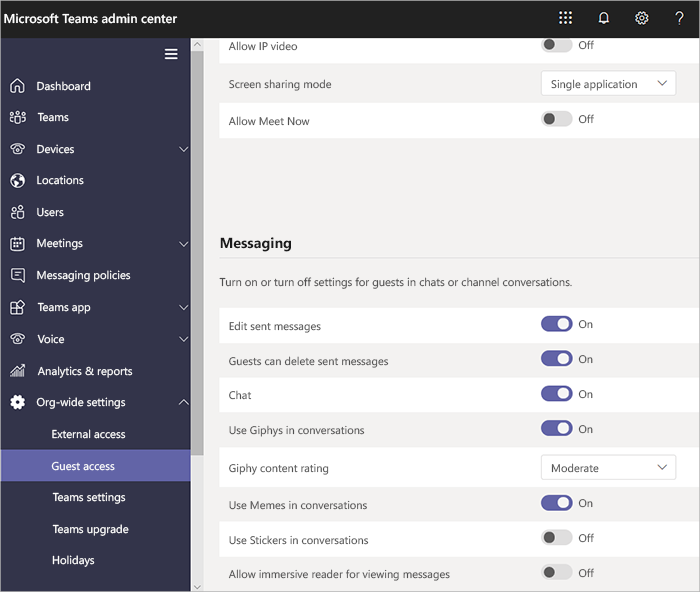

在 Microsoft Teams 中管理来宾访问Manage guest access in Microsoft Teams
======================================

**来宾**是 Microsoft 团队中的一种用户/许可证类型，包含在所有 Office 365 Business Premium、Office 365 企业版和 Office 365 教育版订阅中。**Guest** is a user/license type in Microsoft Teams that is included with all Office 365 Business Premium, Office 365 Enterprise, and Office 365 Education subscriptions. 无需额外的 Office 365 许可证。No additional Office 365 license is necessary. Teams 来宾访问是租户级别设置，默认情况下关闭。Teams guest access is a tenant-level setting and is turned off by default. 有关如何启用来宾访问的详细信息，请参阅[打开或关闭对 Microsoft 团队的来宾访问](set-up-guests.md)。For details about how to enable guest access, see [Turn on or off guest access to Microsoft Teams](set-up-guests.md).

打开**来宾**用户/许可证类型后，您可以通过组织的 "[管理 Microsoft 团队设置](enable-features-office-365.md)" 中所述的控件配置来宾的设置，并在[过渡到新的 Microsoft 团队期间管理团队。管理中心](manage-teams-skypeforbusiness-admin-center.md)。After the **Guest** user/license type is turned on, you can configure settings for guests via the controls described in [Manage Microsoft Teams settings for your organization](enable-features-office-365.md) and [Manage Teams during the transition to the new Microsoft Teams admin center](manage-teams-skypeforbusiness-admin-center.md).     
    
IT 管理员可以在租户级别添加来宾、设置和管理来宾用户策略和权限，以及获取有关来宾用户活动的报告。IT admins can add guests at the tenant level, set and manage guest user policies and permissions, and pull reports on guest user activity. 可通过 Microsoft 团队管理中心获取这些控件。These controls are available through the Microsoft Teams admin center. 来宾用户内容和活动与 Office 365 的其他部分一样受到相同的合规性和审核保护。Guest user content and activities are under the same compliance and auditing protection as the rest of Office 365.

团队所有者可以邀请新来宾，并将现有的目录来宾用户添加到其团队。Team owners can invite new guests and add existing directory guest users to their teams. 团队所有者可以通过**团队** > **管理团队**来标识来宾用户，并通过**组织范围内的设置** > **来宾访问**为来宾设置频道相关的功能，包括允许来宾创建、更新和删除频道，如下图所示。Team owners can identify guest users via **Teams** > **Manage teams**, and set channel-related capabilities for guests via **Org-wide settings** > **Guest access**, including allowing guests to create, update, and delete channels, as shown in the following illustration.

  
你可以使用 Azure Active Directory （Azure AD）门户管理来宾及其对 Office 365 和团队资源的访问权限。You can use the Azure Active Directory (Azure AD) portal to manage guests and their access to Office 365 and Teams resources. 团队来宾访问利用 Azure AD 企业对企业（B2B）协作功能，作为存储安全原则信息（如标识属性、成员身份和多重身份验证设置）的基础基础结构。Teams guest access makes use of Azure AD business-to-business (B2B) collaboration capabilities as the underlying infrastructure to store security principles information such as identity properties, memberships, and multi-factor authentication settings. 若要了解有关 Azure AD B2B 的详细信息，请参阅[什么是 AZURE AD b2b 协作？](https://go.microsoft.com/fwlink/p/?linkid=853011)和[AZURE Active Directory b2b 协作常见问题解答](https://go.microsoft.com/fwlink/p/?linkid=853020)。To learn more about Azure AD B2B, see [What is Azure AD B2B collaboration?](https://go.microsoft.com/fwlink/p/?linkid=853011) and [Azure Active Directory B2B collaboration FAQs](https://go.microsoft.com/fwlink/p/?linkid=853020).

> [!NOTE]
> Microsoft 团队始终采用 Azure AD 外部设置，以允许或阻止来宾用户对租户的添加。Microsoft Teams always honors Azure AD external settings to allow or prevent guest user additions to the tenant. 有关更多详细信息，请参阅[在 Microsoft 团队中授权来宾访问](Teams-dependencies.md)。For more details, see [Authorize guest access in Microsoft Teams](Teams-dependencies.md).
  
## 来宾访问与外部访问（联合身份验证）Guest access vs. external access (federation)

[!INCLUDE [guest-vs-external-access](includes/guest-vs-external-access.md)]

## 定期查看来宾访问权限Review guest access periodically

在团队中，你可以为每个许可用户添加5个来宾。In Teams, you can add 5 guests for each licensed user. 由于此限制，或者你希望让你的租户保持最新状态，你应定期查看来宾访问权限，以标识有权不再需要的访问权限的用户。Because of this limitation, or because you want to keep your tenant up to date, you should review guest access periodically to identify users who have access that they don't need anymore. 你可以使用 Azure AD 为组成员或分配到应用程序的用户创建访问审核。You can use Azure AD to create an access review for group members or users assigned to an application. 创建定期访问评论可节省您的时间。Creating recurring access reviews can save you time. 如果需要定期查看有权访问应用程序或组成员的用户，您可以定义这些评论的频率。If you need to routinely review users who have access to an application or are members of a group, you can define the frequency of those reviews. 

你可以自行执行来宾访问检查、要求来宾查看其自己的成员身份，或者要求应用程序所有者或业务决策人执行访问权审核。You can perform a guest access review yourself, ask guests to review their own membership, or ask an application owner or business decision maker to perform the access review. 使用 Azure 门户执行来宾访问审核。You use the Azure portal to perform guest access reviews. 有关详细信息，请参阅[使用 AZURE AD 访问审核管理来宾访问](https://docs.microsoft.com/en-us/azure/active-directory/governance/manage-guest-access-with-access-reviews)。For more information, see [Manage guest access with Azure AD access reviews](https://docs.microsoft.com/en-us/azure/active-directory/governance/manage-guest-access-with-access-reviews).

###  先决条件Prerequisites

Access 评论适用于 Azure AD 高级 P2 版本，它包含在 Microsoft 企业移动性 + 安全性，E5 中。Access reviews are available with the Premium P2 edition of Azure AD, which is included in Microsoft Enterprise Mobility + Security, E5. 有关详细信息，请参阅[Azure Active Directory 版本](https://docs.microsoft.com/en-us/azure/active-directory/fundamentals/active-directory-whatis)。For more information, see [Azure Active Directory editions](https://docs.microsoft.com/en-us/azure/active-directory/fundamentals/active-directory-whatis). 通过创建评论、填写评论或确认其访问来与此功能交互的每个用户都必须有许可证。Each user who interacts with this feature by creating a review, filling out a review, or confirming their access, must have a license.

团队不会限制可添加的来宾数量。Teams doesn't restrict the number of guests you can add. 但是，可添加到租户的来宾总数取决于 AAD 授权所允许的内容。However, the total number of guests that can be added to your tenant is based on what your AAD licensing allows. 有关详细信息，请参阅[AZURE AD B2B 协作授权](https://docs.microsoft.com/en-us/azure/active-directory/b2b/licensing-guidance)。For more information, see [Azure AD B2B collaboration licensing](https://docs.microsoft.com/en-us/azure/active-directory/b2b/licensing-guidance).

## 来宾访问延迟Guest access latencies

来宾设置在 Azure AD 中设置。The guest settings are set in Azure AD. 更改在 Office 365 组织中生效需要 2 小时到 24 小时。It takes 2 hours to 24 hours for the changes to be effective across your Office 365 organization. 如果用户尝试向其团队中添加来宾时看到消息 "请联系你的管理员"，则很可能是来宾功能尚未启用或设置尚未生效。If a user sees the message "Contact your administrator" when they try to add a guest to their team, it's likely that either the guest feature hasn't been enabled or the settings aren't effective yet.

## 更多信息More information

有关使用 PowerShell 管理来宾访问权限的信息，请参阅[使用 powershell 控制对团队的来宾访问](guest-access-powershell.md)。For information about using PowerShell to manage guest access, see [Use PowerShell to control guest access to a team](guest-access-powershell.md).

