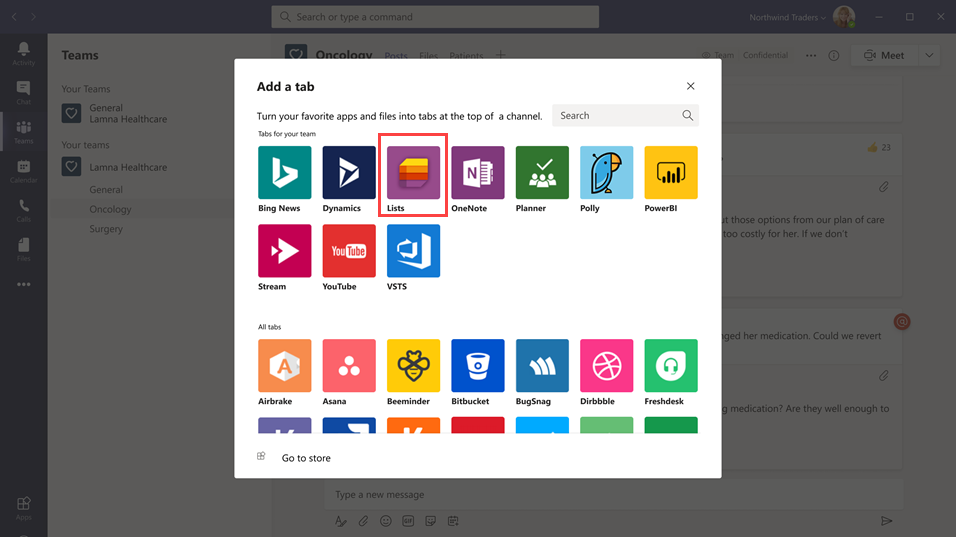
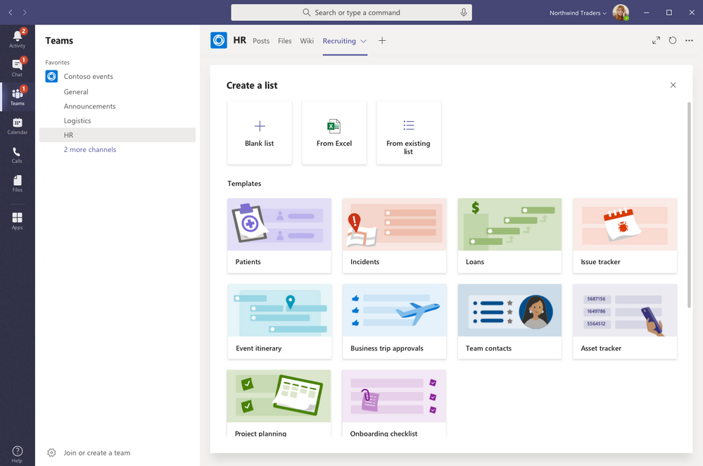

# 在 Microsoft Teams 中为组织管理 Lists 应用

## Lists 概述

Microsoft Teams 中的 Lists 应用帮助组织中的用户跟踪信息、整理工作并管理工作流。 用户可以使用 Lists 跟踪像问题、资产、例程、联系人、库存、事件、借贷、患者等的数据，使用自定义的视图、规则和警报来保持团队里所有人同步。

在 Teams 中，用户以选项卡形式在频道中访问 Lists。  点击 **+** 来打开选项卡库并添加一个新的 Lists 应用选项卡实例到频道，就可以开始了。

用户可以在相同的团队或有权限的另一个 SharePoint 站点中创建新列表或固定现有列表。 新列表可以从头创建，或根据内置模版、基于现有列表的结构或从 Excel 工作簿导入数据创建。 Lists 应用在 Teams 桌面、web 以及移动客户端均可用。

## 模板

Lists 中的模版为用户跟踪信息的应用场景量身打造。 每个模版都有预定义的列表结构、表单布局以及格式选项，这些在列表视图和详细信息视图级别都有，帮助用户快速入门。 选中一个模版后，用户可以预览列表的样子以及一些示例数据。 下面的一些例子是解释了组织中的团队可以如何在 Lists 中使用预定义的模版：

- 使用问题跟踪模版跟踪问题并终结它们。
- 使用事件行程模版整理你的所有事件信息。
- 使用患者模版记录患者的需求和状态，让医疗组织中的健康团队监控并协调护理。
- 使用借贷模版来跟踪借贷申请的状态。

## 示例应用场景

一个当地的邮局负责整理并派送地区内的邮件。 每天早晨，邮局会开一个小型会议来确定每天的目标，共享声明以及讨论已知的事件。

会议过后，邮递员进行收件并开始派送。 派送路途中会发生事件，比如汽车事故、和狗有关的问题或社会不安抗议。 当邮递员遇到事件时，它们可以在移动设备上使用 Teams 来记录事件的详细信息，该信息在团队频道中的列表中受到跟踪。 团队里的所有人，包括现场的邮递员，都可以看到这个消息并保持知情。

在使用 Teams 之前，邮递员必须得回到邮局，填写一份纸质的表格来报告一件已经输入进 Excel 表格的事件。 Teams 给邮递员们创造了一份移动优先的体验，它们可以使用 Lists 现场实时报告事件，与团队成员共享事件的详细信息，和他们在频道中交谈，并促进事件解决。

## 你需要了解的 Lists 相关信息

### Lists 在所有团队和频道中可用

列表已针对所有 Teams 用户预安装，并且可以直接在每个团队和频道的选项卡库中使用。 这意味着用户无需转到 Teams 应用商店来安装它。

### Lists 和 SharePoint

Lists 的数据存储在 SharePoint Online 团队网站中。 要了解关于 SharePoint Online 与 Teams 如何交互的详细信息，请参阅 [SharePoint Online 和 OneDrive for Business 与 Teams 如何交互](SharePoint-OneDrive-interact.md)。

SharePoint 中的权限集应用于 Lists 应用中创建的列表。 列表默认继承所属网站的权限。 这些权限管理用户可以执行的操作类型，比如是否可以创建或编辑列表。 要了解更多，请参阅 [SharePoint 中的权限级别](/sharepoint/understanding-permission-levels)以及 [SharePoint 服务器中的用户权限和权限级别](/sharepoint/sites/user-permissions-and-permission-levels)。

在某些应用场景下，你需要限制用户在列表中的操作。 比如，团队中某个人可以编辑列表视图，更改会应用于所有团队成员，你只想允许团队所有者或某些成员编辑列表视图。 要了解更多，请参阅[自定义 SharePoint 列表或库的权限](https://support.microsoft.com/office/customize-permissions-for-a-sharepoint-list-or-library-02d770f3-59eb-4910-a608-5f84cc297782#ID0EAACAAA=Online,_2019,_2016,_2013)。

> [!NOTE]
> 此时，团队中的所有者和成员权限还没有以任何方式链接到团队网站中管理 LIsts 应用和列表行为的权限。 然而，居于客户反馈和使用情况，我们会考虑将其加入未来的产品迭代中。  

### 限制

用户可以获得桌面、web 以及移动端的 Lists 体验。 需要记住的是，用户无法在 Teams 移动客户端中通过 Lists 创建新列表或固定现有列表。 要在 Teams 移动客户端中查看或编辑列表，必须首先通过 Teams 桌面或 web 客户端使用 Lists 创建或添加列表。

来宾无法创建或删除列表。但可以向现有列表添加列表项、开始关于列表项的新对话，以及回复关于列表项的现有对话。

### Lists 和 SharePoint 应用

如果组织中的用户使用 SharePoint 应用创建了列表，那些列表将自动移动到 Lists，用户无需进行任何操作。 要在 Teams 中获得最佳和最全的列表整合体验，请使用 Lists 应用并固定你的现有列表。

## 设置 Lists

### 在你的组织中启用或禁用 Lists

Lists 在你的组织中默认为所有 Teams 用户启用。 你可以在 Microsoft Teams 管理中心的[管理应用](manage-apps.md)页面在组织级别关闭或打开此应用。

1. 在 Microsoft Teams 管理中心的左侧导航中，转到“**Teams 应用**” > “**权限策略**”。
2. 执行下列操作之一：

    - 要为组织关闭 Lists，请搜索 Lists 应用，选中然后单击“**阻止**”。
    - 要为组织开启 Lists，请搜索 Lists 应用，选中然后单击“**允许**”。

### 在你的组织中为某个特定用户启用或禁用 Lists

要在你的组织中允许或阻止特定用户使用 Lists，请确保在[管理应用](manage-apps.md)页面中 Lists 已为你的组织打开，然后创建自定义应用权限策略并将其分配给特定用户。 要了解详细信息，请参阅[在 Teams 中管理自定义应用策略和设置](teams-app-permission-policies.md)。

## 搜索列表事件的审核日志

列表启用了企业级别的审核，所以你可以在安全与合规中心的审核日志中搜索列表和列表项事件。 若要了解详细信息，请参阅[在安全与合规中心中搜索审核日志](/microsoft-365/compliance/search-the-audit-log-in-security-and-compliance)。

在 Teams 中查看与 Lists 应用有关的审核事件列表，请参阅 [SharePoint 列表活动](/microsoft-365/compliance/search-the-audit-log-in-security-and-compliance#sharepoint-list-activities)。

在搜索审核日志之前，你必须先在[安全与合规中心](https://protection.office.com)中用审核。 请记住，审核数据仅从你打开审核开始可用。

## Power Automate 和 Graph API

Lists 工作流支持 [Power Automate](/power-automate/flow-types)，列表表单支持[Power Apps](/powerapps/maker/canvas-apps/customize-list-form)。 开发人员可以通过 Microsoft Graph 使用 [Lists API](/sharepoint/dev/sp-add-ins/working-with-lists-and-list-items-with-rest) 连接列表数据作为源。

## 提供反馈或报告问题
  
若要给我们发送反馈或报告问题，请单击 Teams 左导航底部附近的 **帮助**，然后选择 **报告问题**。 选择 **LIsts**，然后输入反馈或关于你正在经历的问题的详细信息。

## 相关主题

- [Lists 帮助文档](https://support.microsoft.com/office/apps-and-services-cc1fba57-9900-4634-8306-2360a40c665b#PickTab=Lists)