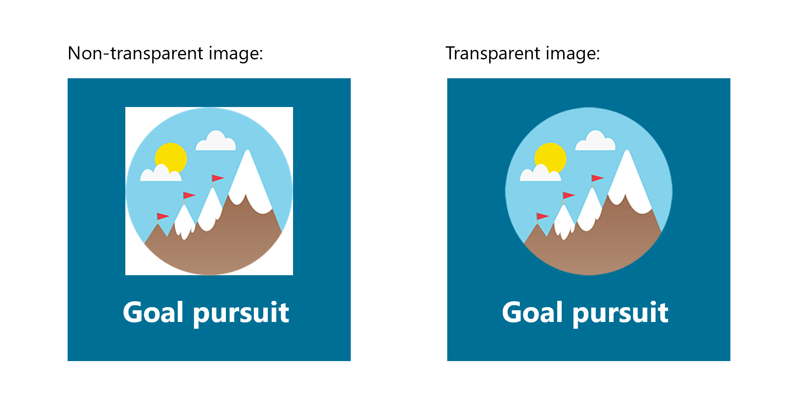

# 在 表扬 管理中心Microsoft Teams应用

> [!NOTE]
> 管理员必须具有一个Teams才能访问此功能。 如果尝试在没有许可证的情况下访问Teams，则会显示一条错误消息。

表扬应用Microsoft Teams帮助用户向组织或课堂成员表示感激。 借助一系列锁屏提醒集以及创建自己的锁屏提醒的选项，表扬 旨在帮助识别用户从教育工作者到一线员工Teams各种工作所付出的工作。 若要了解有关详细信息，请查看向[表扬发送通知。](https://support.microsoft.com/office/send-praise-to-people-50f26b47-565f-40fe-8642-5ca2a5ed261e)

管理员可以从管理中心控制其组织Microsoft Teams徽章。 在左侧导航栏中，转到Teams **应用>应用"**。 在应用列表中，**单击**"表扬"，然后选择"设置"。   在这里，你可以选择启用默认和内置锁屏提醒集并创建自定义锁屏提醒。

> [!NOTE]
> 表扬应用功能不适用于美国政府云。

## 使用内置锁屏提醒集

内置集是 Microsoft 为应用应用设计的锁表扬集合。 管理员不可编辑这些集。 默认锁屏提醒集已启用，可在 表扬 应用中使用。 若要更改默认集或任何锁屏提醒集的可用性，请切换为"开"或"关"。 

<a name="default-badges"> </a>

### 默认锁屏提醒

默认锁屏提醒集旨在帮助Teams识别其同事，以完成工作。

<a name="sel-edu-badges"> </a>

### 用于教育的社交和情感学习徽章

教师可以使用徽章识别各个学生，以通过 SEL (学习) 学习成就和行为，这些徽章可以阐释这些概念。

<a name="create-your-own-badges"> </a>

## 创建自己的锁屏提醒

选择 **"创建自定义锁屏提醒"。** 在这里，可以在侧面板中设计自定义锁屏提醒。 可创建多达 25 个自定义锁屏提醒。 

1. 输入锁屏提醒名称。 这是当用户发送表扬时锁屏提醒上显示的名称。

2. 设置锁屏提醒颜色。 若要设置锁屏提醒的文本和背景颜色，需要输入十六进制 (十六) 值。

   > [!TIP]
   > 如果您没有使用十六进制值，本文包含 [一个快速](#hex-colors-intro) 介绍，用于展示如何使用这些值。

3. Upload锁屏提醒图像。 接受的文件类型是.PNG。 图像文件必须小于 40 KB，最大尺寸为 216 X 216 像素。

4. 本地化锁屏提醒名称：在 **"本地化锁屏提醒名称"下**，选择"**添加"。** 从下拉列表中选择所需的区域设置。 然后以指定语言输入锁屏提醒名称。

5. 从特定区域设置中排除锁屏提醒：在"从这些区域设置中 **排除锁屏提醒"下，选择**"**添加"。** 从下拉列表中选择要排除区域设置。

6. 选择"**应用"。** 新锁屏提醒现在将显示在自定义锁屏提醒表中。

> [!NOTE]
> 如果跳过步骤 4 和 5，则锁屏提醒将针对所有区域设置使用默认语言。
>
> 完成对锁屏提醒选择的更改后，请确保选择"提交 **"。** 可能需要几个小时才能向组织提供这些更改。

<a name="hex-colors-intro"> </a>

## 使用十六进制值指定颜色

十六进制颜色值是六个十六进制数字的字符串，以 00 到 FF 的刻度表示特定颜色的红色 (RR) 、绿色 (GG) 和蓝色 (BB) 的强度。 将所有三种颜色的值放在一起时，得到一个十六进制值：#RRGGBB

例如，红色表示的十六进制值是#FF0000因为红色设置为可能的最高值，而绿色和蓝色分别设置为可能的最低值 00。

若要浏览不同颜色及其十六进制值，请查看必应[选取器。](https://www.bing.com/search?q=color+picker)

下面是一系列示例颜色，可让你入门：

|颜色  |十六进制值|
|-------|---------|
||  #FF6666   |
||  #7FFFD4   |
||  #FF75F0   |
||  #00BFFF   |
||  #800080   |
||  #000000   |

<a name="best-practices"> </a>

## 创建自定义锁屏提醒的最佳实践

**一次提交所有锁屏提醒。** 由于处理新锁屏提醒需要一段时间，因此最好在提交之前将所有自定义锁屏提醒添加到表中。

**选择颜色时，请记住辅助功能。** 某些颜色相加效果更好。  在文本和背景颜色之间创建对比度，使锁屏提醒名称易于阅读。 例如，如果选择深色背景色，请选择浅色文本颜色。

**选择图像时，请记住锁屏提醒尺寸。** 为获得最佳质量，我们建议上传 216 x 216 像素的图像文件 (是最大尺寸) 。 避免拉伸或扭曲图像以适应这些尺寸。

**如果你的锁屏提醒图像不是矩形，请使图像透明。** 在将图像文件上传到其他位置之前，需要表扬。

## 锁屏提醒集资产

无法修改内置锁屏提醒集，因此启用内置集后，该集内的所有锁屏提醒将添加到表扬应用。 如果要从内置集中添加特定锁屏提醒并排除其他锁屏提醒，请重新创建要用作自定义锁屏提醒的锁屏提醒。 你可以下载锁屏提醒图像，然后从下表中的内置集查找锁屏提醒的文本和背景颜色。

### 默认锁屏提醒资产

 

|锁屏提醒名称     |图像文件  |文本颜色 | 背景色 |
|---------------|------------|---------- |--------|
|实现器       |[实现器 PNG](https://github.com/MicrosoftDocs/OfficeDocs-SkypeForBusiness/raw/live/Teams/downloads/praise-app/default-set/achiever-badge.png)|#D36E70    |#E3F4FC|
|令人赞叹        |[令人赞叹的 PNG](https://github.com/MicrosoftDocs/OfficeDocs-SkypeForBusiness/raw/live/Teams/downloads/praise-app/default-set/awesome-badge.png)</a>|#8283B2    |#D1EFF2|
|指导          |[指导 PNG](https://github.com/MicrosoftDocs/OfficeDocs-SkypeForBusiness/raw/live/Teams/downloads/praise-app/default-set/coach-badge.png)</a>|#6AA55A    |#DBF1D6|
|做人        |[无名小人 PNG](https://github.com/MicrosoftDocs/OfficeDocs-SkypeForBusiness/raw/live/Teams/downloads/praise-app/default-set/courage-badge.png)</a>|#DC5041    |#FCF6C8|
|创意       |[Creative PNG](https://github.com/MicrosoftDocs/OfficeDocs-SkypeForBusiness/raw/live/Teams/downloads/praise-app/default-set/creative-badge.png) |#CF9D50    |#FCF6C8|
|（含）      |[非独占 PNG](https://github.com/MicrosoftDocs/OfficeDocs-SkypeForBusiness/raw/live/Teams/downloads/praise-app/default-set/inclusive-badge.png)</a>|#3C77BB    |#E2F4FC|
|Kind Heart     |[Kind Heart PNG](https://github.com/MicrosoftDocs/OfficeDocs-SkypeForBusiness/raw/live/Teams/downloads/praise-app/default-set/kind-heart-badge.png)</a>|#D36D6E    |#F4DEDE|
|领导     |[领导 PNG](https://github.com/MicrosoftDocs/OfficeDocs-SkypeForBusiness/raw/live/Teams/downloads/praise-app/default-set/leadership-badge.png)|#419098    |#D2EAEC|
|乐观       |[乐观 PNG](https://github.com/MicrosoftDocs/OfficeDocs-SkypeForBusiness/raw/live/Teams/downloads/praise-app/default-set/optimism-badge.png)</a>|#D8338C    |#F4DDDE|
|问题解算器 |[问题解算器 PNG](https://github.com/MicrosoftDocs/OfficeDocs-SkypeForBusiness/raw/live/Teams/downloads/praise-app/default-set/problem-solver-badge.png)|#B8916E    |#CBDADF|
|团队玩家    |[团队玩家 PNG](https://github.com/MicrosoftDocs/OfficeDocs-SkypeForBusiness/raw/live/Teams/downloads/praise-app/default-set/team-player-badge.png)|#8B8DC0    |#F4EEC0|
|谢谢      |[谢谢 PNG](https://github.com/MicrosoftDocs/OfficeDocs-SkypeForBusiness/raw/live/Teams/downloads/praise-app/default-set/thank-you-badge.png)|#469CA4    |#BACCB6|

 

### 教育资产的社交和情感学习徽章

 

|锁屏提醒名称        |图像文件  |文本颜色 | 背景色 |
|------------------|------------|---------- |--------|
|通信     |[通信 PNG](https://github.com/MicrosoftDocs/OfficeDocs-SkypeForBusiness/raw/live/Teams/downloads/praise-app/sel-edu-set/communication-badge.png)|#FFFFFF    |#173B65|
|关键思考 |[关键思考 PNG](https://github.com/MicrosoftDocs/OfficeDocs-SkypeForBusiness/raw/live/Teams/downloads/praise-app/sel-edu-set/critical-thinking-badge.png)|#FFFFFF    |#084D26|
|好奇         |[奇才 PNG](https://github.com/MicrosoftDocs/OfficeDocs-SkypeForBusiness/raw/live/Teams/downloads/praise-app/sel-edu-set/curiosity-badge.png)|#FFFFFF    |#008078|
|移情           |[移情 PNG](https://github.com/MicrosoftDocs/OfficeDocs-SkypeForBusiness/raw/live/Teams/downloads/praise-app/sel-edu-set/empathy-badge.png)|#FFFFFF    |#650B35|
|目标实现      |[目标目标 PNG](https://github.com/MicrosoftDocs/OfficeDocs-SkypeForBusiness/raw/live/Teams/downloads/praise-app/sel-edu-set/goal-pursuit-badge.png)|#FFFFFF    |#006F95|
|动机        |[动机 PNG](https://github.com/MicrosoftDocs/OfficeDocs-SkypeForBusiness/raw/live/Teams/downloads/praise-app/sel-edu-set/motivation-badge.png)|#FFFFFF    |#C52127|
|持久性       |[持久性 PNG](https://github.com/MicrosoftDocs/OfficeDocs-SkypeForBusiness/raw/live/Teams/downloads/praise-app/sel-edu-set/persistence-badge.png)|#FFFFFF    |#167D3E|
|尊重           |[尊重 PNG](https://github.com/MicrosoftDocs/OfficeDocs-SkypeForBusiness/raw/live/Teams/downloads/praise-app/sel-edu-set/respect-badge.png)|#FFFFFF    |#8251A0|
|责任    |[责任 PNG](https://github.com/MicrosoftDocs/OfficeDocs-SkypeForBusiness/raw/live/Teams/downloads/praise-app/sel-edu-set/responsibility-badge.png)|#FFFFFF    |#B05DA3|
|自我感知    |[自我感知 PNG](https://github.com/MicrosoftDocs/OfficeDocs-SkypeForBusiness/raw/live/Teams/downloads/praise-app/sel-edu-set/self-awareness-badge.png)|#FFFFFF    |#1680E5|
|自我管理   |[自我管理 PNG](https://github.com/MicrosoftDocs/OfficeDocs-SkypeForBusiness/raw/live/Teams/downloads/praise-app/sel-edu-set/self-management-badge.png)|#FFFFFF    |#4C144D|
|周到度    |[周到性 PNG](https://github.com/MicrosoftDocs/OfficeDocs-SkypeForBusiness/raw/live/Teams/downloads/praise-app/sel-edu-set/thoughtfulness-badge.png)|#FFFFFF    |#EE4086|
