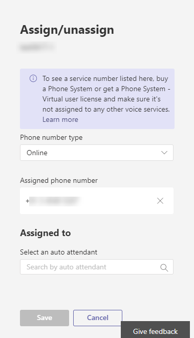

# <a name="manage-resource-accounts-in-microsoft-teams"></a>在 Microsoft Teams 中管理资源帐户

资源帐户也称为 Azure Active Directory 中的已禁用的用户对象，可以用于通常表示资源。 在 Exchange 它可能用于表示会议室，例如，并允许有一个电话号码。 在 Microsoft 365 或本地的企业服务器，使用 Skype 可托管资源帐户并使用 Powershell 命令创建这些帐户。

在 Microsoft 团队或 Skype 业务联机，每个呼叫队列或自动助理需要具有关联的资源帐户。 资源帐户是否需要分配的电话号码将取决于打算使用的关联的呼叫队列或自动助理。 引用上调用队列的文章和自动助理电话号码分配给资源帐户之前底部这篇文章的链接。

> [!NOTE]
> 本文同时适用于 Microsoft 团队和 Skype 业务 online。

## <a name="prerequisites-to-assign-a-phone-number-to-a-resource-account"></a>若要将电话号码分配给资源帐户的先决条件

若要开始非常重要记住几件事：
  
- 自动助理或呼叫队列需要具有关联的资源帐户。 有关资源帐户的详细信息，请参阅[团队中的管理资源帐户](manage-resource-accounts.md)。
- 如果您打算分配一个直接路由号，则需要获取并将以下许可证分配给资源帐户\(Office 365 企业版 E1、 E3 或 E5，与电话系统加载项\)。
- 如果要改用分配 Microsoft 服务号码，您需要获取并将以下许可证分配给资源帐户\(Office 365 企业版 E1、 E3 或 E5，与电话系统加载项调用规划\)。
- 您只需使用的电话号码分配给他们许可资源帐户。 在嵌套的自动助理或呼叫队列中，您不需要许可证自动助理的其余部分或呼叫队列，如果没有与其关联的电话号码

> [!NOTE] 
> Microsoft 团队用户和代理仅支持直接路由服务号码的自动助理和呼叫的队列。

> [!NOTE] 
> 现在您需要使用用户授权模型，Microsoft 的协作的应用程序云自动助理和呼叫的队列，如适当许可模型中。
    
> [!NOTE]
> 要重定向呼叫的人员在组织中联机，它们必须具有**电话系统**许可证和启用了企业语音或其 Office 365 调用计划。 请参阅[分配的 Microsoft 团队许可证](assign-teams-licenses.md)。 要为他们启用企业语音，可以使用 Windows PowerShell。 例如运行： `Set-CsUser -identity "Amos Marble" -EnterpriseVoiceEnabled $true`
  
- 您可以直接路由混合数字分配资源帐户。  有关详细信息，请参阅[规划直接路由](direct-routing-plan.md)。
- 对于 Microsoft 调用计划，您可以仅分配收费和免费电话服务电话号码的**Microsoft 团队管理中心**中获得或端口从另一个服务提供商的资源帐户。 若要获取并使用免费电话号码，则需要设置通信点数。

> [!NOTE]
> 用户 （订阅服务器） 的电话号码不能分配给资源帐户。 可以使用只有服务收费电话或免费电话号码。

若要将电话号码分配给资源帐户，您需要用于获取或您现有的收费电话或免费电话服务的端口号。 获得收费电话或免费电话服务电话号码后，他们会显示在**Microsoft 团队管理中心** > **语音** > **电话号码**，以及被列为**Service-免费电话****号码类型**列出将。 若要获取服务号码，请参阅[Getting 服务电话号码](https://docs.microsoft.com/SkypeForBusiness/what-is-phone-system-in-office-365/getting-service-phone-numbers?toc=/MicrosoftTeams/toc.json&bc=/microsoftteams/breadcrumb/toc.json)或如果您想要传输的现有服务号码，请参阅[传输到 Office 365 的电话号码](transfer-phone-numbers-to-office-365.md)。
  
> [!NOTE]
> 如果您在美国以外，您无法使用的 Microsoft 团队管理中心获取服务号码。 转到[管理您的组织的电话号码](manage-phone-numbers-for-your-organization/manage-phone-numbers-for-your-organization.md)而是以了解如何执行从美国的外部。

## <a name="create-a-resource-account-in-microsoft-teams-admin-center"></a>在 Microsoft 团队管理中心创建资源帐户

在 Microsoft 团队管理中心中，导航到**组织范围的设置** > **资源帐户**。 


若要创建新的资源帐户，单击 **+ 新帐户**。 在弹出窗口中，填写的显示名称和用户名 （域名应自动填充） 的资源帐户然后单击**保存**。


接下来，您将需要许可证于资源帐户后，[将对业务的 Office 365 中的用户的许可证分配](https://docs.microsoft.com/office365/admin/subscriptions-and-billing/assign-licenses-to-users?view=o365-worldwide)中所述

一旦您已创建资源帐户并分配许可证，您可以在上**分配/取消分配**要调用规划服务号码分配资源帐户后，单击或将资源帐户分配给自动助理或呼叫队列已存在。 可以完成分配直接路由号码仅使用 Cmdlet。 如果您呼叫的队列或自动助理仍需要创建，您创建它时，您可以将链接的资源帐户。 完成后，请单击**保存**。



可以编辑使用**编辑**选项的资源帐户显示名称。  完成后，请单击**保存**。


## <a name="create-a-resource-account-in-powershell"></a>在 Powershell 中创建资源帐户

对于 Microsoft 调用计划，您可以仅分配收费和免费电话服务电话号码的**Microsoft 团队管理中心**中获得或端口从另一个服务提供商的资源帐户。 若要获取并使用免费电话号码，则需要设置通信点数。

根据您的资源帐户是否位于联机或本地，您需要连接到相应的 Powershell 提示符处，具有管理员权限。 
- 下面的 Powershell cmdlet 示例假定联机托管资源帐户使用[新建 CsOnlineApplicationInstance](https://docs.microsoft.com/powershell/module/skype/new-CsOnlineApplicationInstance?view=skype-ps)创建联机托管资源帐户。

- 资源帐户驻留在内部部署中 Skype 的业务服务器 2019 可以用于云呼叫的队列和云自动助理，请参阅[配置云呼叫队列](/skypeforbusiness/SfbHybrid/hybrid/configure-call-queue.md)或[配置云自动助理](/skypeforbusiness/SfbHybrid/hybrid/configure-cloud-auto-attendant.md)。 混合实现 （号码驻留在直接路由） 将使用[新建 CsHybridApplicationEndpoint](https://docs.microsoft.com/powershell/module/skype/new-cshybridapplicationendpoint?view=skype-ps)。

应用程序 ID 需要创建的应用程序实例时使用：
- **自动助理：** ce933385-9390-45d1-9512-c8d228074e07
- **呼叫队列：** 11cd3e2e-fccb-42ad-ad00-878b93575e07

> [!NOTE]
> 如果您希望呼叫队列或自动助理可由内部用户，应创建您资源帐户内部，因为不向 Active Directory 同步联机资源帐户。

1. 若要创建资源帐户为使用自动助理，使用与下面的命令。  

``` Powershell
New-CsOnlineApplicationInstance -UserPrincipalName testra1@contoso.com -ApplicationId “ce933385-9390-45d1-9512-c8d228074e07” -DisplayName "Resource account 1"
```

2. 您将不能使用资源帐户，直到对其应用许可证。 有关如何将许可证应用于 O365 管理中心中的帐户，请参阅[分配对业务的 Office 365 中的用户的许可证](https://docs.microsoft.com/office365/admin/subscriptions-and-billing/assign-licenses-to-users?view=o365-worldwide#assign-licenses-to-one-user)以及[业务许可证分配 Skype](https://docs.microsoft.com/en-us/skypeforbusiness/skype-for-business-and-microsoft-teams-add-on-licensing/assign-skype-for-business-and-microsoft-teams-licenses)。

3. （可选）一旦正确的许可证适用于资源帐户可以将电话号码设置为资源帐户，如下所示。 并非所有资源帐户将都需要一个电话号码。 如果您未对资源帐户应用许可证，将失败的电话号码分配。

``` Powershell
Set-CsOnlineVoiceApplicationInstance -Identity testra1@contoso.com
 -TelephoneNumber +14255550100
Get-CsOnlineTelephoneNumber -TelephoneNumber +14255550100
```

在此命令的详细信息，请参阅[设置 CsOnlineVoiceApplicationInstance](https://docs.microsoft.com/powershell/module/skype/set-csonlinevoiceapplicationinstance?view=skype-ps) 。

> [!NOTE]
> 是最容易设置 online 的电话号码使用的 Microsoft 团队管理中心中，如前面所述。

## <a name="manage-resource-account-settings-in-microsoft-teams-admin-center"></a>管理资源的 Microsoft 团队管理中心中的帐户设置

若要管理资源帐户设置的 Microsoft 团队管理中心中，导航到**组织范围的设置**  > **资源帐户**和选择资源帐户所需更改设置，然后单击**编辑**按钮。 在**编辑资源帐户**屏幕中，您将能够更改这些设置：

- 该帐户的**显示名称**
- 呼叫队列或自动助理使用的帐户
- 分配给该帐户的电话号码

完成后，单击在**保存**。

## <a name="delete-a-resource-account"></a>删除资源帐户

请确保删除它，以避免获取挂起的模式滞留在您服务号码之前中解除关联的电话号码从资源帐户。 您可以使用以下 commandlet: 

``` Powershell
Set-csonlinevoiceapplicationinstance -identity <Resource Account oid> -TelephoneNumber $null
```
                
一旦您这样做，可以从 O365 管理门户，用户选项卡中删除资源帐户。


## <a name="related-information"></a>相关的信息

为实现的混合与 Skype 的业务服务器：

[规划云自动助理](/SkypeForBusiness/hybrid/plan-cloud-auto-attendant)

[配置云自动助理](/SkypeForBusiness/hybrid/configure-cloud-auto-attendant)

对于业务 online 团队或 Skype 中实现：

[什么是云自动助理？](what-are-phone-system-auto-attendants.md)

[设置云自动助理](/SkypeForBusiness/what-is-phone-system-in-office-365/set-up-a-phone-system-auto-attendant)

[小型企业示例 - 设置自动助理](https://docs.microsoft.com/en-us/SkypeForBusiness/what-is-phone-system-in-office-365/tutorial-org-aa)

[创建云呼叫队列](/SkypeForBusiness/what-is-phone-system-in-office-365/create-a-phone-system-call-queue)

[新 CsHybridApplicationEndpoint](https://docs.microsoft.com/powershell/module/skype/new-cshybridapplicationendpoint?view=skype-ps)

[新 CsOnlineApplicationInstance](https://docs.microsoft.com/powershell/module/skype/new-csonlineapplicationinstance?view=skype-ps)
