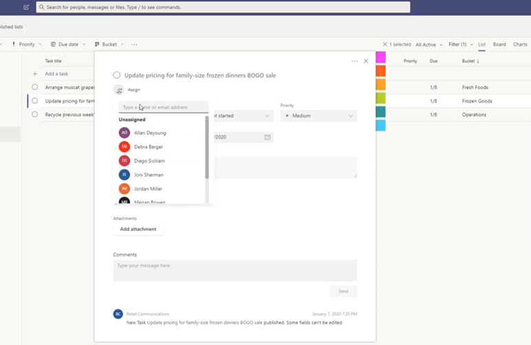

# 在 Microsoft 团队中管理组织的 "任务" 应用Manage the Tasks app for your organization in Microsoft Teams

> **此功能当前处于私人预览版中。****This feature is currently in private preview.**

## 任务概述Overview of Tasks

"任务" 应用为 Microsoft 团队带来了一种内聚的任务管理体验，将由 Planner 提供的个人任务与由 Planner 提供支持的团队任务集成在一个位置。The Tasks app brings a cohesive task management experience to Microsoft Teams, integrating personal tasks powered by To Do and team tasks powered by Planner in one place. 用户可以将任务作为应用访问到团队的左侧，以及在单个团队中的频道中作为选项卡。Users can access Tasks as an app on the left side of Teams and as a tab in a channel within individual teams. "任务" 中的**个人列表**和**团队列表**使用户可以查看和管理其所有个人和工作组任务，并确定其工作优先级。The **Personal lists** and **Team lists** in Tasks let users view and manage all their personal and team tasks and prioritize their work. 任务在团队桌面版、web 版和移动客户端中可用。Tasks is available in Teams desktop, web, and mobile clients. 

> [!NOTE]
> 当我们推出团队桌面客户端的任务体验时，应用名称最初将显示为用户的**Planner** 。As we roll out the Tasks experience on Teams desktop clients, the app name will initially appear as **Planner** to users. 该名称随后会暂时更改为 "**按 Planner" 和 "待办事项**"，稍后将重命名为 "**任务**"。The name will then temporarily change to **Tasks by Planner and To Do**, and later on, it will be renamed to **Tasks**. 在团队移动客户端上，用户将始终看到应用名称为 "**任务**"。On Teams mobile clients, users will always see the app name as **Tasks**. 桌面体验推出后，移动体验的可用性可能会出现短暂延迟。There may be a short delay in the availability of the mobile experience after the desktop experience is available.

   

对于想要为一线工作者简化任务管理的组织，任务还包括使你能够以横向方式在一线劳动力范围内进行任务的目标、发布和跟踪任务的功能。For organizations who want to streamline task management for Firstline Workers, Tasks also includes capabilities that enable you to target, publish, and track tasks at scale across your Firstline Workforce. 例如，公司和区域领导可以创建和发布针对相关位置（如特定零售商店）的任务列表，并通过实时报表跟踪进度。For example, corporate and regional leadership can create and publish task lists targeted to relevant locations, such as specific retail stores, and track progress through real-time reports. 经理可以将任务分配给其员工和其所在位置的直接活动，并且一线工作者在移动或桌面上拥有其分配任务的优先级列表。Managers can assign tasks to their staff and direct activities within their locations, and Firstline Workers have a prioritized list of their assigned tasks on mobile or desktop. 若要启用[任务发布](#task-publishing)，首先需要为组织设置团队目标层次结构，以定义层次结构中的所有团队如何相互关联。To enable [task publishing](#task-publishing), you'll first need to set up a team targeting hierarchy for your organization, which defines how all teams in the hierarchy are related to each other.

## 您需要了解的有关任务的信息What you need to know about Tasks

任务作为应用和频道中的选项卡提供。Tasks is available as an app and as a tab in a channel. 请记住，应用包括来自 Planner 的个人任务和团队任务，而选项卡仅显示团队任务。Keep in mind that the app comprises both personal tasks from To Do and team tasks from Planner whereas the tab shows only team tasks.

通过任务，用户可以获得桌面版、web 和手机体验。With Tasks, users get a desktop, web, and mobile experience. 如果在团队桌面客户端上安装了任务，用户还将在其团队 web 和移动客户端上看到该任务。If Tasks is installed on the Teams desktop client, users will also see it on their Teams web and mobile clients. 例外情况是来宾用户。The exception is guest users. 请务必了解，来宾只能从团队移动客户端以应用的形式访问任务。It's important to know that guests can only access Tasks as an app from the Teams mobile client. 来宾将在两个团队桌面和 web 客户端上看到 "任务" 选项卡。Guests will see Tasks tabs on both Teams desktop and web clients.

"个人列表" 显示用户的单个任务。Personal lists show a user's individual tasks. 团队列表显示整个团队正在处理的任务，包括作为 "任务" 选项卡添加到频道的任何任务列表。Team lists show tasks that the whole team is working on and includes any task list that's added as a Tasks tab to a channel. 请注意以下事项：Note the following:

- 用户在 "任务" 应用中创建的个人列表也会显示在 "为该用户执行客户端" 中。Personal lists that a user creates in the Tasks app will also appear in To Do clients for that user. 同样，用户在中创建的任务列表将显示在该用户的 "任务" 中的 "个人列表" 中。Similarly, task lists that a user creates in To Do will appear in Personal lists in Tasks for that user. 对于单个任务，也是如此。The same is true for individual tasks.

- 添加到频道的任何 "任务" 选项卡也将显示在 Planner 客户端中。Any Tasks tab that's added to a channel will also appear in Planner clients. 当用户在 Planner 中创建计划时，计划将不会显示在 "任务" 或 "Planner" 应用中，除非该计划已作为选项卡添加到频道。When a user creates a plan in Planner, the plan won't show in the Tasks or Planner app unless it's added as a tab to a channel. 当用户添加新的 "任务" 选项卡时，他们可以创建新的列表或计划，或选择现有的计划。When a user adds a new Tasks tab, they can create a new list or plan or choose an existing one.

## 设置任务Set up Tasks

> [!IMPORTANT]
> 为 Planner 配置的设置和策略也将应用于任务。Settings and policies that you configured for Planner will also apply to Tasks.

### 启用或禁用组织中的任务Enable or disable Tasks in your organization

默认情况下，将为组织中的所有团队用户启用任务。Tasks is enabled by default for all Teams users in your organization. 你可以在 Microsoft 团队管理中心的 "[管理应用](manage-apps.md)" 页面上，关闭或打开组织级别的应用。You can turn off or turn on the app at the org level on the [Manage apps](manage-apps.md) page in the Microsoft Teams admin center.

1. 在 Microsoft 团队管理中心的左侧导航中，转到 "**团队应用** > **管理应用**"。In the left navigation of the Microsoft Teams admin center, go to **Teams apps** > **Manage apps** .
2. 在应用列表中，执行下列操作之一：In the list of apps, do one of the following:

    - 若要为你的组织关闭任务，请搜索 "任务" 应用，选择它，然后单击 "**阻止**"。To turn off Tasks for your organization, search for the Tasks app, select it, and then click **Block**.
    - 若要为你的组织启用任务，请搜索 "任务" 应用，选择它，然后单击 "**允许**"。To turn on Tasks for your organization, search for the Tasks app, select it, and then click **Allow**.

### 为组织中的特定用户启用或禁用任务Enable or disable Tasks for specific users in your organization

若要允许或阻止组织中的特定用户使用任务，请确保在 "[管理应用](manage-apps.md)" 页面上为你的组织启用任务，然后创建自定义应用权限策略并将其分配给这些用户。To allow or block specific users in your organization from using Tasks, make sure Tasks is turned on for your organization on the [Manage apps](manage-apps.md) page, and then create a custom app permission policy and assign it to those users. 若要了解详细信息，请参阅[管理团队中的应用权限策略](teams-app-permission-policies.md)。To learn more, see [Manage app permission policies in Teams](teams-app-permission-policies.md).

### 使用应用设置策略将任务固定到团队Use an app setup policy to pin Tasks to Teams

应用设置策略允许你自定义团队，以突出显示你的组织中的用户最重要的应用。App setup policies let you customize Teams to highlight the apps that are most important for users in your organization. 你在策略中设置的应用将固定到应用程序栏&mdash;，应用栏位于团队桌面客户端和团队移动客户&mdash;端的底部，用户可以快速轻松地访问它们。The apps you set in a policy are pinned to the app bar&mdash;the bar on the side of the Teams desktop client and at the bottom of the Teams mobile clients&mdash;where users can quickly and easily access them.

若要为你的用户固定 "任务" 应用，你可以编辑全局（组织范围的默认）策略，或者创建并分配自定义应用设置策略。To pin the Tasks app for your users, you can edit the global (Org-wide default) policy or create and assign a custom app setup policy. 若要了解详细信息，请参阅[管理团队中的应用设置策略](teams-app-setup-policies.md)。To learn more, see [Manage app setup policies in Teams](teams-app-setup-policies.md).

### 如果不希望用户看到用户的个人列表，请将其隐藏Hide users' Personal lists if you don't want users to see them 

如果不希望用户看到个人列表，可以将其隐藏。If you don't want users to see Personal lists, you can hide it. 若要执行此操作，请[删除用户的 Exchange Online 许可证](https://docs.microsoft.com/microsoft-365/admin/manage/remove-licenses-from-users)。To do this, [remove the user's Exchange Online license](https://docs.microsoft.com/microsoft-365/admin/manage/remove-licenses-from-users). 请注意，删除 Exchange Online 许可证后，用户将无法再访问其邮箱。Note that after you remove an Exchange Online license, the user no longer has access to their mailbox. 邮箱数据保留30天，在此之后将删除数据，并且不能恢复，除非邮箱被置于[现场保留或诉讼保留](https://docs.microsoft.com/exchange/security-and-compliance/in-place-and-litigation-holds)。Mailbox data is held for 30 days, after which the data will be removed and can't be recovered unless the mailbox is placed on [In-Place Hold or Litigation Hold](https://docs.microsoft.com/exchange/security-and-compliance/in-place-and-litigation-holds).

## 任务发布Task publishing

通过任务发布，你的组织可以发布针对组织内特定位置（团队）的任务列表，以便定义和共享要在这些位置完成的工作计划。With task publishing, your organization can publish task lists targeted to specific locations (teams) across your organization to define and share a work plan to be completed at those locations.

- 发布团队中的人员（如企业或区域领导）可以创建任务列表并将其发布到特定团队。People on the publishing team, such as corporate or regional leadership, can create task lists and publish them to specific teams. 
    
- 收件人团队的经理可以查看已发布的任务列表，并将单个任务分配给团队成员。Managers on the recipient teams can review the published task lists and assign individual tasks to team members. 
    
- 一线工作者具有简单的移动体验，可查看分配给他们的任务。Firstline Workers have a simple mobile experience to see tasks assigned to them. 他们可以附加照片，以便在需要时显示其工作，并将其任务标记为 "已完成"。They can attach photos to show their work when appropriate and mark their tasks as completed.
- 发布者和经理可以查看报表，以查看每个级别的任务的工作分配和完成状态，包括 "位置（团队）"、"任务列表" 和 "单个任务"。Publishers and managers can view reports to see assignment and completion status of tasks at each level, including by location (team), task list, and individual task. 
    

用户在 "任务" 应用中的 "**已发布的列表**" 选项卡上创建、管理和发布任务列表。Users create, manage, and publish task lists on the **Published lists** tab in the Tasks app. 仅当你的组织[设置团队目标层次结构](#set-up-your-team-targeting-hierarchy)，并且用户位于层次结构中包含的团队时，此选项卡才会向用户显示。This tab only shows for a user if your organization [set up a team targeting hierarchy](#set-up-your-team-targeting-hierarchy) and the user is on a team that's included in the hierarchy. 层次结构确定用户是否可以发布或接收任务列表和查看已接收列表的报告。The hierarchy determines whether the user can publish or receive task lists and view reporting for received lists.

### 示例方案Example scenario

下面是有关任务发布工作原理的示例。Here's an example of how task publishing works.

Contoso 正在推出新的食物 takeout 和交付优惠。Contoso is rolling out a new food takeout and delivery promotion. 为保持一致的品牌体验，他们需要协调跨300应用商店位置的推出一致的执行。To maintain a consistent brand experience, they need to coordinate consistent execution of the rollout across over 300 store locations.

市场营销团队与零售通信管理器共享促销详细信息和相应的任务列表。The Marketing team shares the promotion details and the corresponding list of tasks with the Retail Communications Manager. 零售通信管理员（充当商店的网关守卫）可查看信息、为促销创建任务列表，然后为每个受影响的存储需要执行的每个工作单元创建任务。The Retail Communications Manager, who serves as the gatekeeper for stores, reviews the information, creates a task list for the promotion, and then creates a task for each unit of work that needs to be performed by each of the affected stores. 任务列表完成后，她需要选择必须完成工作的商店。When the task list is complete, she needs to select the stores that must complete the work. 在这种情况下，促销仅适用于具有内部商店餐馆的美国商店。In this case, the promotion only applies to stores in the United States that have an in-store restaurant. 在 "任务" 中，她根据 "存储区餐馆" 属性筛选应用商店列表，在层次结构中选择匹配的美国位置，然后将任务列表发布到这些商店。In Tasks, she filters the store list based on the in-store restaurant attribute, selects the matching United States locations in the hierarchy, and then publishes the task list to those stores.

每个位置的商店经理接收已发布任务的副本并将这些任务分配给其团队成员。Store managers at each location receive a copy of the published tasks and assign those tasks to their team members. 经理可以使用 "任务" 体验来了解其应用商店所需的所有工作。Managers can use the Tasks experience to understand all the work required across their store. 他们还可以使用可用的筛选器重点关注特定的工作集，如 "今天到期的工作" 或特定区域中的工作。They can also use the available filters to focus on a specific set of work, such as work due today or work in a particular area.

每个应用商店位置的一线工作者现在在其移动设备上的任务中有一个按优先级排列的工作人员列表。Firstline Workers at each store location now have a prioritized list of their work in Tasks on their mobile device. 完成任务后，他们将其标记为 "完成"。When they finish a task, they mark it complete. 某些人甚至可能选择将照片上传和附加到任务以显示其工作。Some may even choose to upload and attach a photo to the task to show their work.

Contoso 总部和中级经理可以查看报告，以查看每个商店和商店内任务的作业和完成状态。Contoso headquarters and intermediate managers can view reporting to see the assignment and completion status of tasks at each store and across stores. 他们还可以向下钻取到特定任务，以查看不同商店中的状态。They can also drill down to a specific task to see the status within different stores. 随着启动日期更近，他们可以发现任何 abnormalities，并根据需要与团队成员一起登记。As the launch date gets closer, they can spot any abnormalities and check in with their teams as needed. 此可见性使 Contoso 能够提高推出的效率，并在其存储中提供更一致的体验。This visibility allows Contoso to improve the efficiency of the rollout and provide a more consistent experience across their stores.

### 设置团队目标层次结构Set up your team targeting hierarchy

若要在你的组织中启用任务发布，你必须首先在中设置你的团队目标架构。CSV 文件。To enable task publishing in your organization, you have to first set up your team targeting schema in a .CSV file. 该架构定义层次结构中的所有团队如何相互关联以及用于筛选和选择团队的属性。The schema defines how all the teams in your hierarchy are related to each other and the attributes used to filter and select teams. 创建架构后，将其上载到团队以将其应用于你的组织。After you create the schema, upload it to Teams to apply it to your organization. 发布团队的成员（如示例方案中的零售通信管理器）可以按层次结构、属性或组合筛选团队，以选择应收到任务列表的相关团队，然后将任务列表发布给这些团队。Members of the publishing team, such as the Retail Communications Manager in the example scenario, can then filter teams by hierarchy, attributes, or a combination of both to select the relevant teams that should receive the task lists, and then publish the task lists to those teams.

有关如何设置团队目标层次结构的步骤，请参阅[设置团队目标层次结构](set-up-your-team-hierarchy.md)。For steps on how to set up your team targeting hierarchy, see [Set up your team targeting hierarchy](set-up-your-team-hierarchy.md).

## 自动处理电源和图形 APIPower Automate and Graph API

任务支持为 Planner 执行 "待办事项" 和 "图形 Api" 的 "电源自动化"。Tasks supports Power Automate for To Do and Graph APIs for Planner. 要了解详细信息，请参阅：To learn more, see:

- [Planner 任务和计划 API 概述Planner tasks and plans API overview](https://docs.microsoft.com/graph/planner-concept-overview)
- [使用 Microsoft 对电源进行自动化Using Microsoft To Do with Power Automate](https://support.office.com/article/using-microsoft-to-do-with-power-automate-526e8f75-217b-46e0-9e06-44780b72c295)