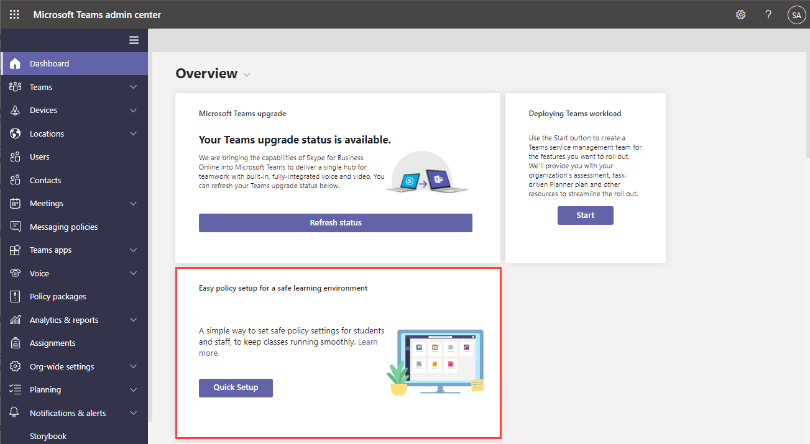

# 使用策略管理Teams

策略是管理Teams的重要组成部分。 使用本文导航如何使用策略使组织受益。

## 使用策略的内容

策略用于在不同领域（如消息传送、会议和应用程序）完成组织中的许多任务。 可执行的一些操作包括允许用户在团队频道中安排会议、使用户能够编辑已发送的消息，以及控制用户是否可以将应用固定到Teams应用栏。

## 如何分配策略

策略可以通过多种不同的方式分配，具体取决于组织尝试完成的操作。 可以在Teams管理中心进行和查看工作分配。

在此处详细了解如何[分配策略。](policy-assignment-overview.md)

## 如何管理策略

策略通过Microsoft Teams管理中心或 [PowerShell](./teams-powershell-managing-teams.md#manage-policies-via-powershell) 进行管理。

例如，应用设置策略允许用户上传自定义应用、代表用户安装应用，并将应用固定到Teams应用栏。 这些策略是在Teams管理中心配置的。

此外，会议策略可用于控制Teams会议中的音频和视频设置，例如听录、云录制和 IP 音频/视频。

### Teams 教育版

还可以使用[Teams 教育版策略向导](easy-policy-setup-edu.md)轻松设置和管理学习环境的策略。

## 策略类型

可以使用Microsoft Teams管理以下策略。

策略类型 | 说明
------------|------------
[策略包](manage-policy-packages.md) | Microsoft Teams中的策略包是可分配给组织中具有类似角色的用户的预定义策略和设置的集合。
[会议策略](meeting-policies-overview.md) | 会议策略用于控制组织中用户安排的会议的会议参与者可用的功能。 会议策略包括以下主题。  - 音频和视频策略  - 内容和屏幕共享策略  - 参与者、来宾和访问策略  - 常规策略
[语音和呼叫策略](voice-and-calling-policies.md)| 语音和呼叫策略通过团队（例如紧急呼叫、呼叫路由和呼叫者 ID）管理这些设置。
[应用策略](app-policies.md)| 应用策略用于控制Microsoft Teams中的应用程序。 管理员可以允许或阻止用户可以安装的应用，将应用程序固定到用户的Teams应用栏，并代表用户安装应用程序。
[消息策略](messaging-policies-in-teams.md)| 消息策略控制聊天和频道功能可用性。

## 相关主题

* [在Teams中分配策略 - 入门](policy-assignment-overview.md)
* [在Microsoft Teams中管理反馈策略](manage-feedback-policies-in-teams.md)
* [在 Microsoft Teams 中管理团队策略](teams-policies.md)
* [在 Microsoft Teams 中为实时事件进行设置](teams-live-events/set-up-for-teams-live-events.md)
* [Teams 教育版策略和策略包](policy-packages-edu.md)