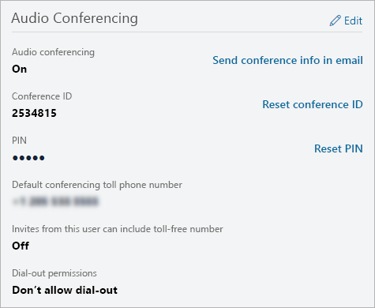

# 在 Microsoft Teams 中管理用户的音频会议设置

作为Microsoft 365管理员Office 365，您可以编辑贵组织中单个用户的音频会议设置，例如提供商、默认收费或免费号码、会议 ID 或 PIN。 如果要编辑组织的设置，请参阅 [管理组织的音频会议设置](manage-the-audio-conferencing-settings-for-my-organization-in-teams.md)。

##  使用 Microsoft Teams 管理中心

1. 在左侧导航栏中， **单击"用户**"，然后从可用用户列表中选择用户。

2. 单击"**编辑"。**

3. 在 **"音频会议"** 下，修改以下任一项：

|**设置**|**说明**|
|:-----|:-----|
|**音频会议**|若要为用户打开或关闭音频会议，请单击"音频会议"旁边的"编辑"，然后在"音频会议"窗格中，切换"音频 **会议** 打开"或"关闭"。 |
|**通过电子邮件发送会议信息**  |仅当您要立即使用其会议 ID 和电话号码向用户发送电子邮件时，才单击此链接。 （此电子邮件不包括 PIN）。请参阅[使用其音频会议信息向用户发送电子邮件](send-an-email-to-a-user-with-their-dial-in-information-in-teams.md)。  |
|**会议 ID**  |如果需要重置用户的会议 **ID，** 请单击"重置会议 ID"。 有关详细信息，请参阅[重置用户的会议 ID](reset-a-conference-id-for-a-user-in-teams.md)。  |
|**PIN** |如果需要 **重置用户的 PIN，** 请单击"重置 PIN"。 有关详细信息，请参阅[重置的音频会议 PIN](reset-the-audio-conferencing-pin-in-teams.md)。 |
|**默认会议收费电话号码 ()** |这些号码将在音频会议网桥上设置。 设置数字的格式，因为您希望它们显示在会议请求Skype for Business Microsoft Teams中。 若要更改默认收费电话号码，请单击"音频会议"旁边的"编辑"，在"音频会议"窗格中，选择"收费电话号码"**下的号码**。  |
|**来自此用户的邀请可以包含免费电话号码**|若要更改此设置，**请单击"音频** 会议"旁边的"编辑"，在"音频会议"窗格中，切换"在此用户的会议请求中包括免费号码""开"或"关"。  |
|**未经身份验证的用户可以是会议的第一人**|若要更改此设置，请切换" **未经** 身份验证的用户可以是会议的第一人"开"或"关"。
|**拨出权限**|若要更改此设置，请单击"**音频会议**"旁边的"编辑"，在"音频会议"窗格中，选择"**从会议拨出"下的选项**。|

 

> [!Note]
> [!INCLUDE [updating-admin-interfaces](includes/updating-admin-interfaces.md)]

## 相关主题

[管理组织的音频会议设置](manage-the-audio-conferencing-settings-for-my-organization-in-teams.md)

[音频会议常见问题](audio-conferencing-common-questions.md)
