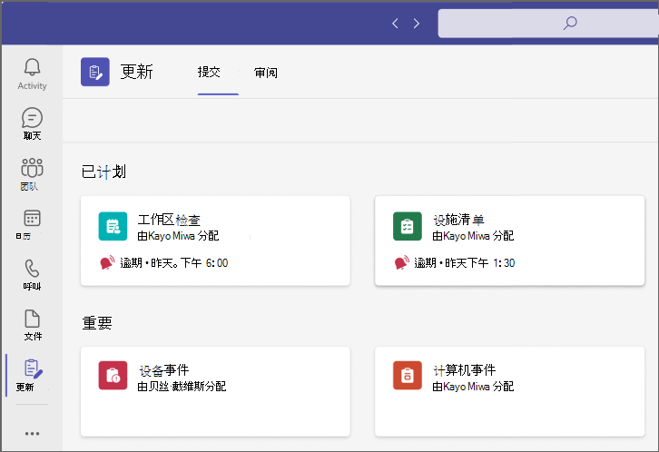
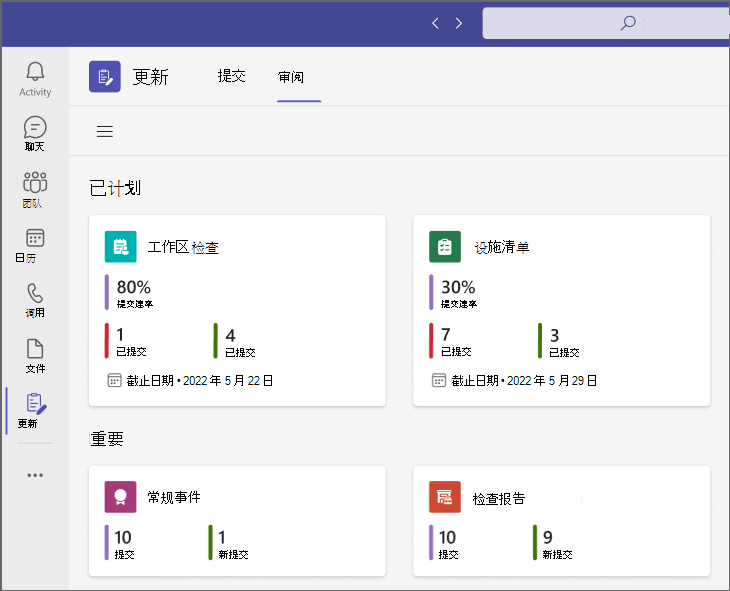
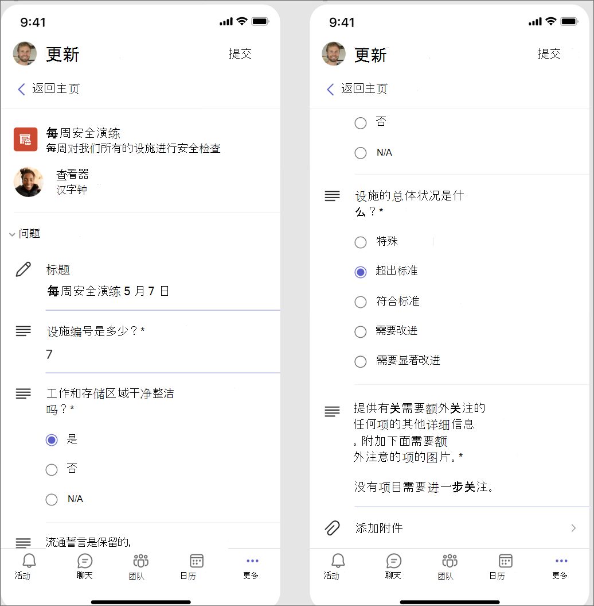
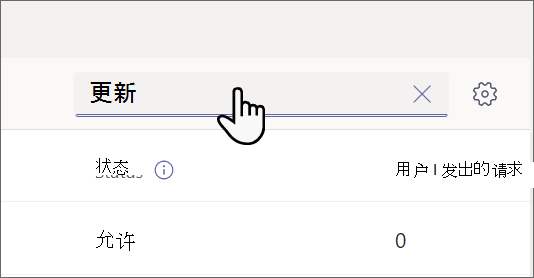
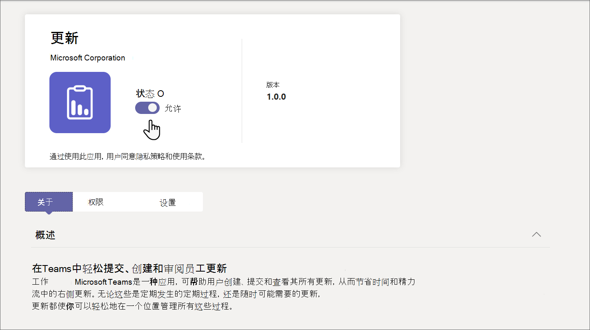

# 在 Microsoft Teams 中管理组织的汇报应用

## 什么是汇报应用

Microsoft Teams 应用中的汇报为组织成员提供了一个集中的位置来创建、审阅和提交更新。 通过创建模板，可以使用汇报应用来跟踪组织所需的任何内容。 汇报适用于桌面版和移动版。

在 Teams 中，用户可以从 Teams 应用商店获取汇报。 他们将在“ **提交** ”页上看到需要提交的所有更新。 可以与用户共享[汇报文章入](https://support.microsoft.com/office/get-started-in-updates-c03a079e-e660-42dc-817b-ca4cfd602e5a)门，帮助他们使用汇报。

用户可以在 **“审阅** ”页中查看已分配的更新。

为用户分配更新后，更新将显示在其 Teams 活动源中。 用户还可以在汇报应用中查看其当前的所有更新请求和以前的提交。 此外，任何人都可以创建模板并发送更新请求。

汇报附带适用于常见业务方案的现现模板和创建自己的模板的选项。 任何人都可以为新类型的更新创建模板。

## 应用场景示例

服装店的员工负责每天开店和关门。 每天早上，班长都会填写应用商店开门更新，这是汇报应用中的现汇报模板。 在此更新中，他们描述了前一天晚上的关闭的任何问题，回答有关商店清洁性的问题，并报告任何需要补充的用品。 提交更新使他们能够快速高效地传达对存储的需求和任何问题。 每日更新还让店员有机会突出显示运行状况。

在商店的制造设施中，员工使用移动设备对汇报进行安全检查。

与此同时，一个远程工人团队正在更新商店的网站。 它们分布在时区之间，因此每天的站立会议并不方便。 相反，每个团队成员每天向团队领导提交关于其进度的汇报报告。

[下载汇报 lookbook](https://go.microsoft.com/fwlink/?linkid=2197649&clcid=0x409)，查看有关可以使用汇报执行的更多示例。

## 所需权限和许可证

需要以下项的权限才能部署汇报：

- 创建 Microsoft Dataverse 数据库的权限。

- [powerautomate.microsoft.com 上的](https://powerautomate.microsoft.com/)帐户。

- 目标环境中的管理员角色。

- Power Automate、Office 365 或 Dynamics 365 的许可证。

- 用户需要Microsoft Forms许可证才能设置新模板。

## 使用 Microsoft Dataverse 进行存储

通用数据模型 (CDM) 是 Microsoft Dataverse 中的业务和分析应用程序使用的共享数据语言。 它由 Microsoft 和合作伙伴发布的一组标准化、可扩展的数据架构组成，这些架构可实现数据的一致性及其在应用程序和业务流程中的含义。 详细了解 [Common Data Model](/common-data-model/)。

从模板创建的汇报仍会将数据存储在 Microsoft Dataverse 中，例如其标题、详细信息、模板 ID 等。 详细了解 [Microsoft Forms的数据存储](https://support.microsoft.com/office/data-storage-for-microsoft-forms-97a34e2e-98e1-4dc2-b6b4-7a8444cb1dc3#:~:text=Where%20data%20is%20stored%20for%20Microsoft%20Forms.%20Microsoft,European-based%20tenants%20is%20stored%20on%20servers%20in%20Europe)。

>[!Note]
>如果删除Microsoft Forms网站上的表单模板，则会中断汇报模板，并且用户无法提交更新。 用户在尝试打开已在Microsoft Forms上删除的模板时收到错误“CDB TableNotFound”。

## 汇报 Teams 应用权限

使用 汇报 Teams 应用可以访问以下功能：

- 接收你向其提供的消息和数据。

- 向你发送消息和通知。

- 呈现个人应用和对话框，但不显示 Teams 提供的标题。

- 访问你的个人资料信息，如姓名、电子邮件地址、公司名称和首选语言。

- 在频道中接收团队成员向其提供的消息和数据。

- 在频道中发送消息和通知。

- 访问团队的信息：
  - 团队名称
  - 频道列表
  - 名单 (团队成员的姓名和电子邮件地址) 

- 使用团队的信息联系他们。

## 禁用汇报应用

默认情况下，汇报应用可用。 可在 Teams 管理中心中禁用该应用。

  1. 登录到 Teams 管理中心。

  2. 转到 “**Teams 应用**” > “**管理应用**”。

  3. 搜索汇报应用。

     

  4. 选择 **汇报**。

  5. 选择切换开关以为你的组织禁用该应用。
    

## 将汇报固定到 Teams

通过应用设置策略，可以自定义 Teams 以固定用户中对用户最重要的应用。 应用固定到应用栏（Teams 桌面客户端侧面和 Teams 移动客户端底部的栏），用户可在其中快速轻松地访问应用栏。

若要为用户固定汇报应用，可以编辑全局 (组织范围的默认) 策略，或创建和分配自定义应用设置策略。 要了解详细信息，请参阅[在 Teams 中管理应用设置策略](teams-app-setup-policies.md)。

## 保留策略

从汇报应用创建的汇报存储在默认的 Microsoft Dataverse 环境中，目前不支持备份。 详细了解如何[备份和还原环境 - Power Platform\| Microsoft Docs](/power-platform/admin/backup-restore-environments)。

在模板创建者从Microsoft Forms Web 应用中 **已删除的窗体** 选项卡中清理数据之前，不会删除窗体中存储的数据。

## 条件访问和权限策略

Teams 中的汇报应用目前不支持为 Microsoft Teams 设置的条件访问策略。

可以使用 [Teams 应用权限策略](teams-app-permission-policies.md)来管理汇报。

## 数据限制

每个用户最多可以创建 400 个汇报模板，每个模板最多可以根据Microsoft Forms中的当前功能收集 50，000 个请求。

## 安全性

在 Teams 汇报 应用中，用户有权创建新更新并查看已发送和接收的更新。 除非用户是请求的查看者，否则用户将无法访问其他人创建的汇报。

> [!Note]
> 如果用户是创建更新报表的聊天或频道的一部分，或者模板创建者手动将其添加为查看者，则为用户提供请求的查看者角色。 如果在创建报表时未赋予该角色，他们将无法对请求采取行动。
