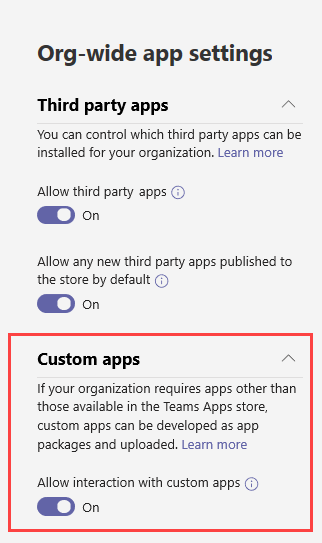
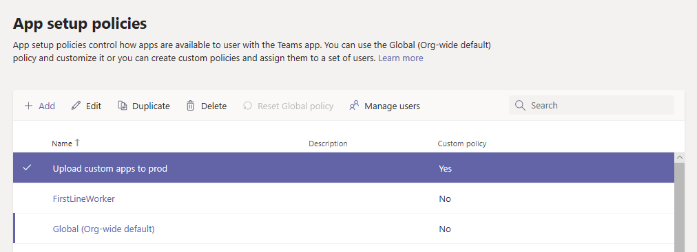

# 管理 Microsoft 团队中的业务线应用Manage your line-of-business apps in Microsoft Teams

本文提供了有关如何将团队应用从开发部署到部署的端到端指南。This article provides end-to-end guidance for how to take your Teams app from development to deployment. 本指南重点介绍应用的团队内容，面向 IT 专业人士。This guidance focuses on the Teams aspects of the app and is intended for IT pros. 有关开发团队应用的详细信息，请参阅<a href="https://docs.microsoft.com/microsoftteams/platform" target="_blank">此处</a>。For more information on developing Teams apps, see <a href="https://docs.microsoft.com/microsoftteams/platform" target="_blank">here</a>.

## 入门Getting started

若要创建和管理团队中的业务线（LOB）应用，需要两个租户：用于开发和生产租户的测试租户。To create and manage line-of-business (LOB) apps in Teams, you’ll need two tenants: a test tenant for development and a production tenant.

> [!NOTE]
> 如果你还没有测试租户，则可以使用 Office 365 开发人员程序快速创建一个测试租户并使用测试数据填充它。If you don’t already have a test tenant, you can quickly create one and populate it with test data using the Office 365 Developer Program. <a href="https://developer.microsoft.com/office/dev-program" target="_blank">在此处了解详细信息</a>。<a href="https://developer.microsoft.com/office/dev-program" target="_blank">Learn more here</a>.

## 步骤1：开发和测试Step 1: Develop and test

### 创建测试用户Create test users

请确保你的开发人员（无论是内部还是外部）在你的测试租户中具有帐户。Make sure that your developers, whether in-house or external, have accounts in your test tenant. <a href="https://docs.microsoft.com/office365/admin/add-users/add-users" target="_blank">了解有关添加用户的详细信息</a>。<a href="https://docs.microsoft.com/office365/admin/add-users/add-users" target="_blank">Learn more about adding users</a>.

### 允许在测试租户中自定义应用Allow custom apps in the test tenant

若要向开发人员提供测试所需的访问权限，请允许测试租户中的所有用户上载自定义应用（也称为旁加载）。To give developers the access they need for testing, allow all users in the test tenant to upload custom apps (also known as sideloading). 这允许开发人员上载自定义应用程序，以供个人或跨测试租户使用，而无需将应用提交到团队应用商店。This lets developers upload a custom app to be used personally or across the test tenant without having to submit the app to the Teams apps store. 上载自定义应用程序使开发人员可以在更广泛地分发应用之前对其进行测试。Uploading a custom app lets developers test an app before you distribute it more widely.

若要允许用户上载自定义应用程序，请按照下列步骤操作：To allow users to upload custom apps, follow these steps:

1. 启用 "**允许与自定义应用交互**" 组织范围设置。Turn on the **Allow interaction with custom apps** org-wide setting. 要执行此操作：To do this:
    1. 在<a href="https://admin.teams.microsoft.com/" target="_blank">Microsoft 团队管理中心</a>的左侧导航中，转到 "**团队应用** > **权限策略**"，然后单击 "**组织范围的设置**"。In the left navigation of the <a href="https://admin.teams.microsoft.com/" target="_blank">Microsoft Teams admin center</a>, go to **Teams apps** > **Permission policies**, and then click **Org-wide settings**.
    2. 在 "**自定义应用**" 下，打开 "**允许与自定义应用交互**"，然后单击 "**保存**"。Under **Custom apps**, turn on **Allow interaction with custom apps**, and then click **Save**.

    

2. 在全局应用设置策略中启用 "**上载自定义应用**" 设置。Turn on the **Upload custom apps** setting in the global app setup policy. 要执行此操作：To do this:
    1. 在<a href="https://admin.teams.microsoft.com/" target="_blank">Microsoft 团队管理中心</a>的左侧导航中，转到 "**团队应用** > **设置策略**"，然后单击 "**全局（组织范围默认）** " 策略。In the left navigation of the <a href="https://admin.teams.microsoft.com/" target="_blank">Microsoft Teams admin center</a>, go to **Teams apps** > **Setup policies**, and then click the **Global (Org-wide default)** policy.
    2. 打开 "**上载自定义应用**"，然后单击 "**保存**"。Turn on **Upload custom apps**, and then click **Save**.

    

> [!NOTE]
> 在团队级别还会有一个上载自定义应用设置。There's also an upload custom app setting at the team level. 默认情况下，此设置为 "打开"。By default this setting is on. 但是，如果开发人员无法将自定义应用上载到团队，请按照<a href="https://docs.microsoft.com/microsoftteams/teams-custom-app-policies-and-settings#configure-the-team-custom-app-setting" target="_blank">此处</a>的步骤检查设置。However, if developers are unable to upload a custom app to a team, check the setting by following the steps <a href="https://docs.microsoft.com/microsoftteams/teams-custom-app-policies-and-settings#configure-the-team-custom-app-setting" target="_blank">here</a>.

### 创建你的应用Create your app

开发人员现在应拥有创建你的应用所需的内容。Developers should now have what they need to create your app. 请参阅<a href="https://docs.microsoft.com/microsoftteams/platform" target="_blank">此处</a>了解相关指南。See <a href="https://docs.microsoft.com/microsoftteams/platform" target="_blank">here</a> for guidance on that.

## 步骤2：在生产中验证Step 2: Validate in production

### 获取应用包Get the app package

当应用准备好在生产中使用时，开发人员应该生成一个应用包。When the app is ready for use in production, the developer should produce an app package. 他们可以使用适用于该<a href="https://docs.microsoft.com/microsoftteams/platform/get-started/get-started-app-studio" target="_blank">应用的应用 Studio</a> 。They can use <a href="https://docs.microsoft.com/microsoftteams/platform/get-started/get-started-app-studio" target="_blank">App Studio</a> for that. 他们将以 .zip 格式发送文件。They'll send you the file in .zip format.

Microsoft 使用<a href="https://docs.microsoft.com/microsoftteams/platform/publishing/office-store-approval" target="_blank">这些指南</a>确保应用符合全球团队应用商店的质量和安全标准。Microsoft uses <a href="https://docs.microsoft.com/microsoftteams/platform/publishing/office-store-approval" target="_blank">these guidelines</a> to ensure apps comply with the quality and security standards of the global Teams apps store.

### 允许受信任的用户在生产租户中上载自定义应用Allow trusted users to upload custom apps in the production tenant

若要验证应用是否在你的生产租户中正常工作，你需要允许你的组织中的自己和/或受信任的用户上载自定义应用。To validate that the app is working correctly in your production tenant, you need to allow yourself and/or trusted users in your organization to upload custom apps.  非常类似于前面的<a href="https://docs.microsoft.com/microsoftteams/manage-your-lob-apps#allow-custom-apps-in-the-test-tenant" target="_blank">步骤</a>，你可以使用应用设置策略执行此操作。Much like in the earlier <a href="https://docs.microsoft.com/microsoftteams/manage-your-lob-apps#allow-custom-apps-in-the-test-tenant" target="_blank">step</a>, you use app setup policies to do this.

> [!NOTE]
> 如果你不满意将应用上载到生产租户进行验证，即使对于你自己或受信任的用户，你也可以跳过此步骤，然后按照步骤3和步骤4将 unvalidated 应用上载到租户应用商店。If you’re uncomfortable with uploading the app to your production tenant for validation, even for yourself or trusted users, you can skip this step and follow steps 3 and 4 to upload the unvalidated app to your tenant apps store. 然后，将对该应用的访问限制为仅限自己和你信任的用户。Then, restrict access to that app to only yourself and users you trust. 然后，这些用户可以从租户应用商店获取该应用以执行验证。These users can then get the app from the tenant apps store to perform validation. 验证应用后，使用相同的权限策略打开 access，并将应用滚出以供生产使用。After the app is validated, use the same permission policies to open access and roll the app out for production use.

若要允许受信任用户上载自定义应用程序，请按照下列步骤操作：To allow trusted users to upload custom apps, follow these steps:

1. 启用 "**允许与自定义应用交互**" 组织范围设置。Turn on the **Allow interaction with custom apps** org-wide setting. 要执行此操作：To do this:
    1. 在<a href="https://admin.teams.microsoft.com/" target="_blank">Microsoft 团队管理中心</a>的左侧导航中，转到 "**团队应用** > **权限策略**"，然后单击 "**组织范围的设置**"。In the left navigation of the <a href="https://admin.teams.microsoft.com/" target="_blank">Microsoft Teams admin center</a>, go to **Teams apps** > **Permission policies**, and then click **Org-wide settings**.
    2. 在 "**自定义应用**" 下，打开 "**允许与自定义应用交互**"，然后单击 "**保存**"。Under **Custom apps**, turn on **Allow interaction with custom apps**, and then click **Save**.
2. 关闭全局应用设置策略中的 "**上载自定义应用**" 设置。Turn off the **Upload custom apps** setting in the global app setup policy. 要执行此操作：To do this:
    1. 在<a href="https://admin.teams.microsoft.com/" target="_blank">Microsoft 团队管理中心</a>的左侧导航中，转到 "**团队应用** > **设置策略**"，然后单击 "**全局（组织范围默认）** " 策略。In the left navigation of the <a href="https://admin.teams.microsoft.com/" target="_blank">Microsoft Teams admin center</a>, go to **Teams apps** > **Setup policies**, and then click the **Global (Org-wide default)** policy.
    2. 关闭 "**上载自定义应用**"，然后单击 "**保存**"。Turn off **Upload custom apps**, and then click **Save**.
3. 创建一个新的应用设置策略，该策略允许上载自定义应用并将其分配给你的受信任的用户集。Create a new app setup policy that allows uploading custom apps and assign it to your set of trusted users. 要执行此操作：To do this:
    1. 在<a href="https://admin.teams.microsoft.com/" target="_blank">Microsoft 团队管理中心</a>的左侧导航中，转到 "**团队应用** > **设置策略**"，然后单击 "**添加**"。In the left navigation of the <a href="https://admin.teams.microsoft.com/" target="_blank">Microsoft Teams admin center</a>, go to **Teams apps** > **Setup policies**, and then click the **Add**. 为新策略提供名称和说明，打开 "**上载自定义应用**"，然后单击 "**保存**"。Give the new policy a name and description, turn on **Upload custom apps**, and then click **Save**.
    2. 选择您创建的新策略，然后单击 "**管理用户**"。Select the new policy you created, and then click **Manage users**. 搜索用户，单击 "**添加**"，然后单击 "**应用**"。Search for a user, click **Add**, and then click **Apply**. 重复此步骤，将策略分配给所有受信任的用户。Repeat this step to assign the policy to all your trusted users.

        

    这些用户现在可以上载应用清单，以验证应用是否在生产租户中正常工作。These users can now upload the app manifest to validate that the app is working correctly in the production tenant.

## 步骤3：上传到租户应用目录Step 3: Upload to the Tenant Apps Catalog

若要让租户应用商店中的用户可以使用该应用，请上载该应用。To make the app available to users in the tenant apps store, upload the app. 你可以使用团队桌面客户端执行此操作。You can do this using the Teams desktop client. 请按照<a href="https://docs.microsoft.com/microsoftteams/tenant-apps-catalog-teams#go-to-the-tenant-apps-catalog" target="_blank">此处</a>的步骤操作。Follow the steps <a href="https://docs.microsoft.com/microsoftteams/tenant-apps-catalog-teams#go-to-the-tenant-apps-catalog" target="_blank">here</a>.

## 步骤4：配置和分配权限Step 4: Configure and assign permissions

### 控制对应用的访问Control access to the app

默认情况下，所有用户都可以在 "团队应用商店" 中访问此应用。By default, all users have access to this app in the the Teams apps store. 若要限制和控制谁有权使用该应用程序，你可以创建并分配新的应用权限策略。To restrict and control who has permission to use the app, you can create and assign a new app permission policy. 请按照<a href="https://docs.microsoft.com/microsoftteams/teams-app-permission-policies#create-a-custom-app-permission-policy" target="_blank">此处</a>的步骤操作。Follow the steps <a href="https://docs.microsoft.com/microsoftteams/teams-app-permission-policies#create-a-custom-app-permission-policy" target="_blank">here</a>.

### 固定应用以供用户发现Pin the app for users to discover

默认情况下，为使用户能够找到此应用，他们将必须转到 "团队应用商店" 和 "浏览" 或 "搜索"。By default, for users to find this app they would have to go to Teams apps store and browse or search for it. 若要使用户可以轻松访问应用，可以将应用固定到团队中的应用栏。To make it easy for users to get to the app, you can pin the app to the app bar in Teams. 若要执行此操作，请创建新的应用设置策略并将其分配给用户。To do this, create a new app setup policy and assign it to users. 请按照<a href="https://docs.microsoft.com/microsoftteams/teams-app-setup-policies#create-a-custom-app-setup-policy" target="_blank">此处</a>的步骤操作。Follow the steps  <a href="https://docs.microsoft.com/microsoftteams/teams-app-setup-policies#create-a-custom-app-setup-policy" target="_blank">here</a>.

## 步骤5：更新应用Step 5: Update the app

若要更新应用，开发人员应继续执行[步骤 1](#step-1-develop-and-test)和[步骤 2](#step-2-validate-in-production)。To update an app, developers should continue to follow [step 1](#step-1-develop-and-test) and [step 2](#step-2-validate-in-production).

你可以通过租户应用目录更新应用。You can update the app through the Tenant Apps Catalog. 若要执行此操作，请在团队桌面客户端中，转到为**租户&gt;名称生成&lt;的\*\*\*\*应用** > ，然后单击 **...**To do this, in the Teams desktop client, go to **Apps** > **Built for &lt;Your tenant name&gt;**, click **…** 在应用的右上角，然后单击 "**更新**"。in the upper-right corner of the app, and then click **Update**. 执行此操作将替换租户应用目录中的现有应用，并且所有权限策略和设置策略都将对已更新的应用保持强制。Doing this replaces the existing app in the Tenant Apps Catalog, and all permission policies and setup policies remain enforced for the updated app. 

