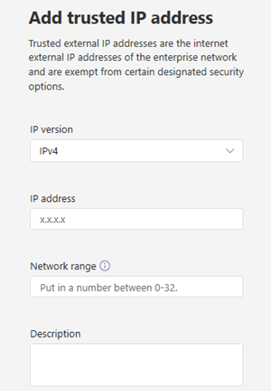

# <a name="manage-your-network-topology-for-cloud-voice-features-in-microsoft-teams"></a><span data-ttu-id="fef0f-103">在 Microsoft 团队中管理云语音功能的网络拓扑</span><span class="sxs-lookup"><span data-stu-id="fef0f-103">Manage your network topology for cloud voice features in Microsoft Teams</span></span>

<span data-ttu-id="fef0f-104">如果你的组织为 [直接路由](location-based-routing-plan.md) 或 [动态紧急呼叫](configure-dynamic-emergency-calling.md)部署基于位置的路由，则必须在 Microsoft 团队中配置用于这些云语音功能的网络设置。</span><span class="sxs-lookup"><span data-stu-id="fef0f-104">If your organization is deploying [Location-Based Routing for Direct Routing](location-based-routing-plan.md) or [dynamic emergency calling](configure-dynamic-emergency-calling.md), you must configure network settings for use with these cloud voice features in Microsoft Teams.</span></span> <span data-ttu-id="fef0f-105">网络设置用于确定团队客户端的位置，包括网络区域、网络站点、子网和受信任的 IP 地址。</span><span class="sxs-lookup"><span data-stu-id="fef0f-105">Network settings are used to determine the location of a Teams client and include network regions, network sites, subnets, and trusted IP addresses.</span></span> <span data-ttu-id="fef0f-106">你可以配置部分或所有这些设置，具体取决于你部署的云语音功能和功能。</span><span class="sxs-lookup"><span data-stu-id="fef0f-106">Depending on the cloud voice feature and capability that you're deploying, you configure some or all these settings.</span></span> <span data-ttu-id="fef0f-107">若要了解有关这些术语的详细信息，请参阅 [云语音功能的网络设置](cloud-voice-network-settings.md)。</span><span class="sxs-lookup"><span data-stu-id="fef0f-107">To learn more about these terms, see [Network settings for cloud voice features](cloud-voice-network-settings.md).</span></span>

<span data-ttu-id="fef0f-108">在 Microsoft 团队管理中心或使用 Windows PowerShell 的 " **网络拓扑** " 页面上配置网络设置。</span><span class="sxs-lookup"><span data-stu-id="fef0f-108">You configure network settings on the **Network topology** page of the Microsoft Teams admin center or by using Windows PowerShell.</span></span>

## <a name="configure-network-settings-in-the-microsoft-teams-admin-center"></a><span data-ttu-id="fef0f-109">在 Microsoft 团队管理中心中配置网络设置</span><span class="sxs-lookup"><span data-stu-id="fef0f-109">Configure network settings in the Microsoft Teams admin center</span></span>

[!INCLUDE [preview-feature](includes/preview-feature.md)]

<span data-ttu-id="fef0f-110">在 " **网络拓扑结构** " 页面的 " **网络站点** " 选项卡上定义网络区域、网络站点和子网。</span><span class="sxs-lookup"><span data-stu-id="fef0f-110">You define network regions, network sites, and subnets on the **Network sites** tab of the **Network topology** page.</span></span> <span data-ttu-id="fef0f-111">在此处，你可以创建或修改网络网站、将网站与网络区域关联、将子网关联到网站、打开基于位置的路由，以及向网站分配紧急策略。</span><span class="sxs-lookup"><span data-stu-id="fef0f-111">Here, you can create or modify a network site, associate a site with a network region, associate a subnet to the site, turn on Location-based Routing, and assign emergency policies to the site.</span></span> <span data-ttu-id="fef0f-112">你还可以添加可针对所有网站全局使用的网络区域。</span><span class="sxs-lookup"><span data-stu-id="fef0f-112">You can also add network regions that can be used globally for all sites.</span></span>

#### <a name="add-and-configure-a-network-site"></a><span data-ttu-id="fef0f-113">添加和配置网络网站</span><span class="sxs-lookup"><span data-stu-id="fef0f-113">Add and configure a network site</span></span>

1. <span data-ttu-id="fef0f-114">在 Microsoft 团队管理中心的左侧导航中，转到 " **位置**  >  **网络拓扑** "，然后单击 " **网络站点** " 选项卡。</span><span class="sxs-lookup"><span data-stu-id="fef0f-114">In the left navigation of the Microsoft Teams admin center, go to **Locations** > **Network topology** , and then click the **Network sites** tab.</span></span>
2. <span data-ttu-id="fef0f-115">单击 " **添加** "，然后输入网站的名称和说明。</span><span class="sxs-lookup"><span data-stu-id="fef0f-115">Click **Add** , and then enter a name and description for the site.</span></span>

    

3. <span data-ttu-id="fef0f-117">若要将网站与网络区域相关联，请单击 " **添加网络区域** "，选择现有区域或单击 " **添加** " 以添加区域，然后单击 " **链接** "。</span><span class="sxs-lookup"><span data-stu-id="fef0f-117">To associate the site with a network region, click **Add network region** , select an existing region or click **Add** to add a region, and then click **Link**.</span></span>  
4. <span data-ttu-id="fef0f-118">若要为网站启用 Location-Based 路由，请打开 **基于位置的路由** 。</span><span class="sxs-lookup"><span data-stu-id="fef0f-118">To enable Location-Based Routing for the site, turn on **Location based routing**.</span></span>
5. <span data-ttu-id="fef0f-119">若要向网站分配紧急服务策略，请执行下列一项或两项操作：</span><span class="sxs-lookup"><span data-stu-id="fef0f-119">To assign emergency services policies to the site, do one or both of the following:</span></span>

    - <span data-ttu-id="fef0f-120">如果您的组织使用呼叫计划或部署的电话系统直接路由，请在 " **紧急呼叫策略** " 下，选择所需的策略。</span><span class="sxs-lookup"><span data-stu-id="fef0f-120">If your organization uses Calling Plans or deployed Phone System Direct Routing, under **Emergency calling policy** , select the policy that you want.</span></span>
    - <span data-ttu-id="fef0f-121">如果您的组织部署了 "电话系统直接路由"，请在 " **紧急呼叫路由策略** " 下，选择所需的策略。</span><span class="sxs-lookup"><span data-stu-id="fef0f-121">If your organization deployed Phone System Direct Routing, under **Emergency call routing policy** , select the  policy that you want.</span></span>

6. <span data-ttu-id="fef0f-122">要将子网与网站相关联，请在 " **子网** " 下单击 " **添加子网** "。</span><span class="sxs-lookup"><span data-stu-id="fef0f-122">To associate a subnet to the site, under **Subnets** , click **Add subnets**.</span></span> <span data-ttu-id="fef0f-123">指定 "IP 版本"、"IP 地址"、"网络范围"、"添加说明"，然后单击 " **应用** "。</span><span class="sxs-lookup"><span data-stu-id="fef0f-123">Specify the IP version, IP address, network range, add a description, and then click **Apply**.</span></span> <span data-ttu-id="fef0f-124">每个子网都必须与特定网站相关联。</span><span class="sxs-lookup"><span data-stu-id="fef0f-124">Each subnet must be associated with a specific site.</span></span>
7. <span data-ttu-id="fef0f-125">单击“ **保存** ”。</span><span class="sxs-lookup"><span data-stu-id="fef0f-125">Click **Save**.</span></span>

#### <a name="modify-a-network-site"></a><span data-ttu-id="fef0f-126">修改网络网站</span><span class="sxs-lookup"><span data-stu-id="fef0f-126">Modify a network site</span></span>

1. <span data-ttu-id="fef0f-127">在 Microsoft 团队管理中心的左侧导航中，转到 " **位置**  >  **网络拓扑** "，然后单击 " **网络站点** " 选项卡。</span><span class="sxs-lookup"><span data-stu-id="fef0f-127">In the left navigation of the Microsoft Teams admin center, go to **Locations** > **Network topology** , and then click the **Network sites** tab.</span></span>
2. <span data-ttu-id="fef0f-128">通过单击网站名称左侧的位置选择网站，然后单击 " **编辑** "。</span><span class="sxs-lookup"><span data-stu-id="fef0f-128">Select the site by clicking to the left of the site name, and then click **Edit**.</span></span>
3. <span data-ttu-id="fef0f-129">进行所需的更改，然后单击 " **保存"。**</span><span class="sxs-lookup"><span data-stu-id="fef0f-129">Make the changes that you want, and then click **Save.**</span></span>

### <a name="manage-external-trusted-ip-addresses"></a><span data-ttu-id="fef0f-130">管理外部受信任的 IP 地址</span><span class="sxs-lookup"><span data-stu-id="fef0f-130">Manage external trusted IP addresses</span></span>

<span data-ttu-id="fef0f-131">可在 Microsoft 团队管理中心的 " **网络拓扑** " 页面上的 " **受信任** 的 ip" 选项卡上管理外部受信任的 IP 地址。</span><span class="sxs-lookup"><span data-stu-id="fef0f-131">You manage external trusted IP addresses on the **Trusted IPs** tab on the **Network topology** page of the Microsoft Teams admin center.</span></span> <span data-ttu-id="fef0f-132">你可以添加不限数量的外部受信任 IP 地址。</span><span class="sxs-lookup"><span data-stu-id="fef0f-132">You can add an unlimited number of external trusted IP addresses.</span></span>

#### <a name="add-a-trusted-ip-address"></a><span data-ttu-id="fef0f-133">添加受信任的 IP 地址</span><span class="sxs-lookup"><span data-stu-id="fef0f-133">Add a trusted IP address</span></span>

1. <span data-ttu-id="fef0f-134">在 Microsoft 团队管理中心的左侧导航中，转到 " **位置**  >  **网络拓扑** "，然后单击 " **受信任的 ip** " 选项卡。</span><span class="sxs-lookup"><span data-stu-id="fef0f-134">In the left navigation of the Microsoft Teams admin center, go to **Locations** > **Network topology** , and then click the **Trusted IPs** tab.</span></span>
2. <span data-ttu-id="fef0f-135">单击“新建”。</span><span class="sxs-lookup"><span data-stu-id="fef0f-135">Click **New**.</span></span>
3. <span data-ttu-id="fef0f-136">在 " **添加信任的 IP 地址** " 窗格中，指定 "ip 版本"、"ip 地址"、"网络范围"、"添加说明"，然后单击 " **应用** "。</span><span class="sxs-lookup"><span data-stu-id="fef0f-136">In the **Add trusted IP address** pane, specify the IP version, IP address, network range, add a description, and then click **Apply**.</span></span>

    

#### <a name="edit-a-trusted-ip-address"></a><span data-ttu-id="fef0f-138">编辑受信任的 IP 地址</span><span class="sxs-lookup"><span data-stu-id="fef0f-138">Edit a trusted IP address</span></span>

1. <span data-ttu-id="fef0f-139">在 Microsoft 团队管理中心的左侧导航中，转到 " **位置**  >  **网络拓扑** "，然后单击 " **受信任的 ip** " 选项卡。</span><span class="sxs-lookup"><span data-stu-id="fef0f-139">In the left navigation of the Microsoft Teams admin center, go to **Locations** > **Network topology** , and then click the **Trusted IPs** tab.</span></span>
2. <span data-ttu-id="fef0f-140">通过单击 IP 地址左侧的，然后单击 " **编辑** " 来选择 IP 地址。</span><span class="sxs-lookup"><span data-stu-id="fef0f-140">Select the IP address by clicking to the left of it, and then click **Edit**.</span></span>
3. <span data-ttu-id="fef0f-141">在 " **编辑信任的 IP 地址** " 窗格中，进行所需的更改，然后单击 " **应用** "。</span><span class="sxs-lookup"><span data-stu-id="fef0f-141">In the **Edit trusted IP address** pane, make the changes that you want, and then click **Apply**.</span></span>

## <a name="configure-network-settings-using-powershell"></a><span data-ttu-id="fef0f-142">使用 PowerShell 配置网络设置</span><span class="sxs-lookup"><span data-stu-id="fef0f-142">Configure network settings using PowerShell</span></span>

<span data-ttu-id="fef0f-143">若要完成本部分中的步骤，你需要熟悉 PowerShell cmdlet。</span><span class="sxs-lookup"><span data-stu-id="fef0f-143">To complete the steps in this section, you'll need some familiarity with PowerShell cmdlets.</span></span> <span data-ttu-id="fef0f-144">若要了解详细信息，请参阅 [团队 PowerShell 概述](teams-powershell-overview.md)。</span><span class="sxs-lookup"><span data-stu-id="fef0f-144">To learn more, see [Teams PowerShell Overview](teams-powershell-overview.md).</span></span>

### <a name="define-network-regions"></a><span data-ttu-id="fef0f-145">定义网络区域</span><span class="sxs-lookup"><span data-stu-id="fef0f-145">Define network regions</span></span>

 <span data-ttu-id="fef0f-146">使用 [CsTenantNetworkRegion](https://docs.microsoft.com/powershell/module/skype/New-CsTenantNetworkRegion) cmdlet 定义网络区域。</span><span class="sxs-lookup"><span data-stu-id="fef0f-146">Use the [New-CsTenantNetworkRegion](https://docs.microsoft.com/powershell/module/skype/New-CsTenantNetworkRegion) cmdlet to define network regions.</span></span> <span data-ttu-id="fef0f-147">请注意，RegionID 参数是一个逻辑名称，表示区域的地理位置，并且没有相关性或限制，并且 CentralSite &lt; SITE ID &gt; 参数是可选的。</span><span class="sxs-lookup"><span data-stu-id="fef0f-147">Note that the RegionID parameter is a logical name that represents the geography of the region and has no dependencies or restrictions and the CentralSite &lt;site ID&gt; parameter is optional.</span></span>

```PowerShell
New-CsTenantNetworkRegion -NetworkRegionID <region ID>  
```

<span data-ttu-id="fef0f-148">在此示例中，我们创建一个名为 "印度" 的网络区域。</span><span class="sxs-lookup"><span data-stu-id="fef0f-148">In this example, we create a network region named India.</span></span>
```PowerShell
New-CsTenantNetworkRegion -NetworkRegionID "India"  
```

<span data-ttu-id="fef0f-149">另请参阅 [设置-CsTenantNetworkRegion](https://docs.microsoft.com/powershell/module/skype/set-cstenantnetworkregion)。</span><span class="sxs-lookup"><span data-stu-id="fef0f-149">See also [Set-CsTenantNetworkRegion](https://docs.microsoft.com/powershell/module/skype/set-cstenantnetworkregion).</span></span>

### <a name="define-network-sites"></a><span data-ttu-id="fef0f-150">定义网络站点</span><span class="sxs-lookup"><span data-stu-id="fef0f-150">Define network sites</span></span>

<span data-ttu-id="fef0f-151">使用 [CsTenantNetworkSite](https://docs.microsoft.com/powershell/module/skype/new-cstenantnetworksite?view=skype-ps) cmdlet 定义网络站点。</span><span class="sxs-lookup"><span data-stu-id="fef0f-151">Use the [New-CsTenantNetworkSite](https://docs.microsoft.com/powershell/module/skype/new-cstenantnetworksite?view=skype-ps) cmdlet to define network sites.</span></span> <span data-ttu-id="fef0f-152">每个网络站点都必须与一个网络区域相关联。</span><span class="sxs-lookup"><span data-stu-id="fef0f-152">Each network site must be associated with a network region.</span></span>

```PowerShell
New-CsTenantNetworkSite -NetworkSiteID <site ID> -NetworkRegionID <region ID>
```

<span data-ttu-id="fef0f-153">在此示例中，我们将在印度地区创建两个新的网络站点：新德里和 Hyderabad。</span><span class="sxs-lookup"><span data-stu-id="fef0f-153">In this example, we create two new network sites, Delhi and Hyderabad, in the India region.</span></span>

```PowerShell
New-CsTenantNetworkSite -NetworkSiteID "Delhi" -NetworkRegionID "India"
New-CsTenantNetworkSite -NetworkSiteID "Hyderabad" -NetworkRegionID "India"
```

<span data-ttu-id="fef0f-154">下表显示了本示例中定义的网络站点。</span><span class="sxs-lookup"><span data-stu-id="fef0f-154">The following table shows the network sites defined in this example.</span></span>

||<span data-ttu-id="fef0f-155">站点1</span><span class="sxs-lookup"><span data-stu-id="fef0f-155">Site 1</span></span> |<span data-ttu-id="fef0f-156">网站2</span><span class="sxs-lookup"><span data-stu-id="fef0f-156">Site 2</span></span> |
|---------|---------|---------|
|<span data-ttu-id="fef0f-157">网站 ID</span><span class="sxs-lookup"><span data-stu-id="fef0f-157">Site ID</span></span>    |    <span data-ttu-id="fef0f-158">站点 1 (新德里) </span><span class="sxs-lookup"><span data-stu-id="fef0f-158">Site 1 (Delhi)</span></span>     |  <span data-ttu-id="fef0f-159">网站 2 (Hyderabad) </span><span class="sxs-lookup"><span data-stu-id="fef0f-159">Site 2 (Hyderabad)</span></span>       |
|<span data-ttu-id="fef0f-160">区域 ID</span><span class="sxs-lookup"><span data-stu-id="fef0f-160">Region ID</span></span>  |     <span data-ttu-id="fef0f-161">地区 1 (印度) </span><span class="sxs-lookup"><span data-stu-id="fef0f-161">Region 1 (India)</span></span>    |   <span data-ttu-id="fef0f-162">地区 1 (印度) </span><span class="sxs-lookup"><span data-stu-id="fef0f-162">Region 1 (India)</span></span>      |

<span data-ttu-id="fef0f-163">另请参阅 [设置-CsTenantNetworkRegion](https://docs.microsoft.com/powershell/module/skype/set-cstenantnetworksite)。</span><span class="sxs-lookup"><span data-stu-id="fef0f-163">See also [Set-CsTenantNetworkRegion](https://docs.microsoft.com/powershell/module/skype/set-cstenantnetworksite).</span></span>

### <a name="define-network-subnets"></a><span data-ttu-id="fef0f-164">定义网络子网</span><span class="sxs-lookup"><span data-stu-id="fef0f-164">Define network subnets</span></span>

<span data-ttu-id="fef0f-165">使用 [CsTenantNetworkSubnet](https://docs.microsoft.com/powershell/module/skype/new-cstenantnetworksubnet?view=skype-ps) cmdlet 定义网络子网并将其与网络站点相关联。</span><span class="sxs-lookup"><span data-stu-id="fef0f-165">Use the [New-CsTenantNetworkSubnet](https://docs.microsoft.com/powershell/module/skype/new-cstenantnetworksubnet?view=skype-ps) cmdlet to define network subnets and associate them to network sites.</span></span> <span data-ttu-id="fef0f-166">每个网络子网只能与一个网站相关联。</span><span class="sxs-lookup"><span data-stu-id="fef0f-166">Each network subnet can only be associated with one site.</span></span>

```PowerShell
New-CsTenantNetworkSubnet -SubnetID <Subnet IP address> -MaskBits <Subnet bitmask> -NetworkSiteID <site ID>
```

<span data-ttu-id="fef0f-167">在此示例中，我们将创建子网192.168.0.0 和新德里网络站点之间以及子网2001之间的关联：4898： e8：25：844e：926f：85ad： dd8e 和 Hyderabad 网络站点。</span><span class="sxs-lookup"><span data-stu-id="fef0f-167">In this example, we create an association between subnet 192.168.0.0 and the Delhi network site and between subnet 2001:4898:e8:25:844e:926f:85ad:dd8e and the Hyderabad network site.</span></span>

```PowerShell
New-CsTenantNetworkSubnet -SubnetID "192.168.0.0" -MaskBits "24" -NetworkSiteID "Delhi"
New-CsTenantNetworkSubnet -SubnetID "2001:4898:e8:25:844e:926f:85ad:dd8e" -MaskBits "120" -NetworkSiteID "Hyderabad"
```

<span data-ttu-id="fef0f-168">下表显示了在此示例中定义的子网。</span><span class="sxs-lookup"><span data-stu-id="fef0f-168">The following table shows the subnets defined in this example.</span></span>

||<span data-ttu-id="fef0f-169">站点1</span><span class="sxs-lookup"><span data-stu-id="fef0f-169">Site 1</span></span> |<span data-ttu-id="fef0f-170">网站2</span><span class="sxs-lookup"><span data-stu-id="fef0f-170">Site 2</span></span> |
|---------|---------|---------|
|<span data-ttu-id="fef0f-171">子网 ID</span><span class="sxs-lookup"><span data-stu-id="fef0f-171">Subnet ID</span></span>   |    <span data-ttu-id="fef0f-172">含</span><span class="sxs-lookup"><span data-stu-id="fef0f-172">192.168.0.0</span></span>     |  <span data-ttu-id="fef0f-173">2001：4898： e8：25：844e：926f：85ad： dd8e</span><span class="sxs-lookup"><span data-stu-id="fef0f-173">2001:4898:e8:25:844e:926f:85ad:dd8e</span></span>     |
|<span data-ttu-id="fef0f-174">Usm</span><span class="sxs-lookup"><span data-stu-id="fef0f-174">Mask</span></span>  |     <span data-ttu-id="fef0f-175">全</span><span class="sxs-lookup"><span data-stu-id="fef0f-175">24</span></span>    |   <span data-ttu-id="fef0f-176">120</span><span class="sxs-lookup"><span data-stu-id="fef0f-176">120</span></span>      |
|<span data-ttu-id="fef0f-177">网站 ID</span><span class="sxs-lookup"><span data-stu-id="fef0f-177">Site ID</span></span>  | <span data-ttu-id="fef0f-178"> (新德里) 的网站</span><span class="sxs-lookup"><span data-stu-id="fef0f-178">Site (Delhi)</span></span> | <span data-ttu-id="fef0f-179">网站 2 (Hyderabad) </span><span class="sxs-lookup"><span data-stu-id="fef0f-179">Site 2 (Hyderabad)</span></span> |

<span data-ttu-id="fef0f-180">对于多个子网，您可以使用如下所示的脚本导入 CSV 文件。</span><span class="sxs-lookup"><span data-stu-id="fef0f-180">For multiple subnets, you can import a CSV file by using a script such as the following.</span></span>

```PowerShell
Import-CSV C:\subnet.csv | foreach {New-CsTenantNetworkSubnet –SubnetID $_.Identity -MaskBits $_.Mask -NetworkSiteID $_.SiteID}  
```

<span data-ttu-id="fef0f-181">在此示例中，CSV 文件的外观如下所示：</span><span class="sxs-lookup"><span data-stu-id="fef0f-181">In this example, the CSV file looks something like this:</span></span> 

```console
Identity, Mask, SiteID
172.11.12.0, 24, Redmond
172.11.13.0, 24, Chicago
172.11.14.0, 25, Vancouver
172.11.15.0, 28, Paris
```

<span data-ttu-id="fef0f-182">另请参阅 [设置-CsTenantNetworkSubnet](hhttps://docs.microsoft.com/powershell/module/skype/set-cstenantnetworksubnet)。</span><span class="sxs-lookup"><span data-stu-id="fef0f-182">See also [Set-CsTenantNetworkSubnet](hhttps://docs.microsoft.com/powershell/module/skype/set-cstenantnetworksubnet).</span></span>

### <a name="define-external-subnets-external-trusted-ip-addresses"></a><span data-ttu-id="fef0f-183"> (外部受信任的 IP 地址定义外部子网) </span><span class="sxs-lookup"><span data-stu-id="fef0f-183">Define external subnets (external trusted IP addresses)</span></span>

<span data-ttu-id="fef0f-184">使用 [CsTenantTrustedIPAddress](https://docs.microsoft.com/powershell/module/skype/new-cstenanttrustedipaddress?view=skype-ps) cmdlet 定义外部子网并将其分配给租户。</span><span class="sxs-lookup"><span data-stu-id="fef0f-184">Use the [New-CsTenantTrustedIPAddress](https://docs.microsoft.com/powershell/module/skype/new-cstenanttrustedipaddress?view=skype-ps) cmdlet to define external subnets and assign them to the tenant.</span></span> <span data-ttu-id="fef0f-185">你可以为租户定义无限数量的外部子网。</span><span class="sxs-lookup"><span data-stu-id="fef0f-185">You can define an unlimited number of external subnets for a tenant.</span></span>

```PowerShell
New-CsTenantTrustedIPAddress -IPAddress <External IP address> -MaskBits <Subnet bitmask> -Description <description> 
```

<span data-ttu-id="fef0f-186">例如：</span><span class="sxs-lookup"><span data-stu-id="fef0f-186">For example:</span></span>

```PowerShell
New-CsTenantTrustedIPAddress -IPAddress 198.51.100.0 -MaskBits 30 -Description "Contoso address"  
```

<span data-ttu-id="fef0f-187">另请参阅 [设置-CsTenantTrustedIPAddress](https://docs.microsoft.com/powershell/module/skype/set-cstenanttrustedipaddress)。</span><span class="sxs-lookup"><span data-stu-id="fef0f-187">See also [Set-CsTenantTrustedIPAddress](https://docs.microsoft.com/powershell/module/skype/set-cstenanttrustedipaddress).</span></span>

## <a name="related-topics"></a><span data-ttu-id="fef0f-188">相关主题</span><span class="sxs-lookup"><span data-stu-id="fef0f-188">Related topics</span></span>

- [<span data-ttu-id="fef0f-189">团队中云语音功能的网络设置</span><span class="sxs-lookup"><span data-stu-id="fef0f-189">Network settings for cloud voice features in Teams</span></span>](cloud-voice-network-settings.md)
