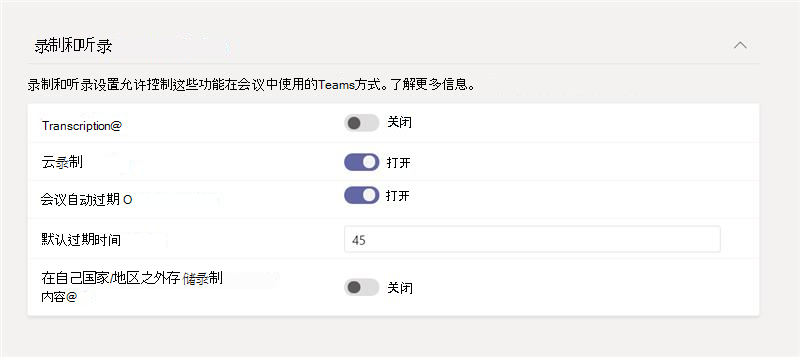

# <a name="meeting-policies-and-meeting-expiration-in-microsoft-teams"></a>会议策略和会议到期时间Microsoft Teams

[会议](meeting-policies-overview.md)Microsoft Teams用于控制您的组织中的用户是否可以启动和安排会议，以及可供会议参与者用于用户安排的会议的功能。 可以使用全局（组织范围内的默认）策略，也可以创建并分配自定义策略。 在管理中心内，Microsoft Teams [Get、](/powershell/module/skype/get-csteamsmeetingpolicy)[New](/powershell/module/skype/new-csteamsmeetingpolicy)、[Set](/powershell/module/skype/set-csteamsmeetingpolicy)、[Remove](/powershell/module/skype/remove-csteamsmeetingpolicy)、[Grant](/powershell/module/skype/grant-csteamsmeetingpolicy) -CsTeamsMeetingPolicy PowerShell cmdlet 管理会议策略。

会议策略设置，用于控制用户是否可以启动和安排会议，以及控制用户安排的会议的到期时间。 当会议的会议加入链接和会议 ID 过期时，没有人可以加入会议。 以下会议策略设置确定用户是否可以在 Teams 中启动和安排Teams。 本文介绍会议设置。

- [现在在频道中开会](meeting-policies-in-teams-general.md#meet-now-in-channels)：控制用户是否可以在频道中启动即席会议。
- [频道会议计划](meeting-policies-in-teams-general.md#channel-meeting-scheduling)：控制用户是否可以在频道中安排会议。
- [私人会议计划](meeting-policies-in-teams-general.md#private-meeting-scheduling)：控制用户是否可以在 Teams 中安排私人Teams。 当会议未发布到团队中的某个频道时，这个会议就是私人的。
- [Outlook加载项](meeting-policies-in-teams-general.md#outlook-add-in)：控制用户是否可以从 Outlook 安排私人Outlook。 当会议未发布到团队中的某个频道时，这个会议就是私人的。
- [现在在私人会议中召开会议](meeting-policies-in-teams-general.md#meet-now-in-private-meetings)：控制用户是否可以启动即席私人会议。

默认情况下，这些设置为打开状态。 当其中任一设置关闭时，分配有策略的任何用户都无法启动或安排该类型的新会议。 同时，用户以前启动或计划过期的所有现有会议的会议加入链接和会议 ID。

例如，如果为用户分配会议策略，其中这些会议策略设置设置为"开"，然后关闭"允许立即在频道中召开会议"设置，该用户无法再在频道中启动即席会议，并且频道"现在开会"加入用户之前创建的链接已过期。 用户仍可以启动和安排其他会议类型和加入由其他人组织的会议。

## <a name="what-happens-when-the-meeting-join-link-and-conference-id-expire"></a>当会议加入链接和会议 ID 过期时会发生什么情况？

当会议的会议加入链接和会议 ID 过期时，没有人可以加入会议。 当用户尝试通过链接或通过电话加入会议时，他们收到一条消息，指出会议不再可用。 对话、文件、白板、录制、脚本和与会议相关的其他内容将保留，用户仍可以访问它们。

## <a name="what-happens-when-you-turn-on-and-turn-off-a-meeting-policy-setting"></a>打开和关闭会议策略设置时会发生什么情况？

### <a name="switch-a-meeting-policy-setting-from-on-to-off"></a>将会议策略设置从"开"切换为"关"

当会议策略设置设置为" **开**"时，分配有该策略的用户可以启动或安排该类型的会议，每个人都可以加入。 将会议策略设置切换为"关闭"时，分配有该策略的用户无法启动或安排该类型的新会议，并且用户以前安排的现有会议的会议加入链接和会议 ID 已过期。

请记住，用户仍可以加入由其他人组织的会议。

### <a name="switch-a-meeting-policy-setting-from-off-to-on"></a>将会议策略设置从"关"切换为"开"

将会议策略设置从 **"关"** 切换为"开"时，分配有该策略的用户可以启动或安排该类型的会议。 如果会议策略设置已关闭，然后再次为用户启用，则用户组织的所有以前计划的 (和过期的) 会议将变为活动状态，用户可以使用会议加入链接或通过电话加入它们。  

## <a name="meeting-expiration-scenarios"></a>会议过期方案

下面汇总了本文中讨论的每个会议策略设置的会议到期工作原理。

|如果你希望...&nbsp;&nbsp; |执行此操作&nbsp;&nbsp;&nbsp;&nbsp;  |会议加入行为&nbsp;&nbsp;&nbsp;&nbsp;  |
|---------------------------|---------------------|---------|
|使专用会议现在由用户启动的会议过期&nbsp;&nbsp;|在私人 **会议中关闭"现在开会"**。&nbsp;&nbsp;|现在没有人 **可以加入由** 用户启动的专用会议。|
|使用户安排的私人会议过期&nbsp;&nbsp;|关闭 **专用会议计划，**_并_ Outlook **加载项**。 &nbsp;&nbsp;|没有人可以加入用户安排的私人会议。 这可以防止用户加入以下会议：<ul><li>过去发生的私人会议。</li><li>计划在将来召开但尚未发生的私人会议。</li><li>将来的定期私人会议实例。</li></ul><br>专用 **会议计划和** Outlook必须关闭，用户安排的私人会议必须过期。 如果一个设置处于关闭状态，另一个设置处于打开状态，则现有会议的会议加入链接和会议 ID 将保持活动状态，并且不会过期。|
|使频道 **"现在开会** "由用户启动的会议过期&nbsp;&nbsp;|关闭频道 **中的"现在开会"**_，并_ 关闭 **频道会议安排**。&nbsp;&nbsp;|没有人可以加入频道 **"现在开会** "会议由用户启动。|
|使用户安排的频道会议过期&nbsp;&nbsp;|关闭 **频道会议安排**。&nbsp;&nbsp;|没有人可以加入用户安排的频道会议。 这可以防止用户加入以下会议：<ul><li>过去发生的频道会议。</li><li>计划在将来召开但尚未发生的频道会议。</li><li>将来的定期频道会议实例。</li></ul>|

如果希望用户访问以前由特定用户安排或启动的会议，您可以：

- 打开该用户的会议策略设置。
- 关闭该用户的会议策略设置，让启用了策略设置的另一个用户创建一个新会议来替换已过期的会议。

> [!NOTE]
> 如果会议是由代理发送的，而该代理人有权代表其他人（例如经理）发送会议邀请，则会议策略设置将应用于向经理 (权限) 。

## <a name="changes-to-meeting-expiration"></a>对会议过期的更改

> [!IMPORTANT]
> 如果要在租户上Teams过期，请申请Microsoft Teams[提前采用者计划](https://forms.office.com/pages/responsepage.aspx?id=v4j5cvGGr0GRqy180BHbR8YMDA0A9INMv_DZ8yW5uG1URDc3U1VVMklPTzVMS0RLR0pUQTlWU1BEVC4u)。

所有新创建的Teams会议录制 (TMR) 的默认过期时间为 60 天。 默认情况下，所有租户都启用此选项。 这意味着默认情况下，启用此功能 *后* 创建的所有 TMR 将在创建日期后 60 天删除。 管理员还可以将会议设置为 **永不自动过期**。 系统OneDrive SharePoint监视所有 TMR 上设置的过期日期，并会在 TMR 过期日期自动将其移到回收站。

自动会议过期是一种轻型整理机制，可减少旧 TMR 创建的存储混乱。 平均而言，在所有客户中，96% 的 TMR 在 60 天后不会受到监视，99% 的 TMR 在 110 天后不会受到监视。 我们认为，通过删除 60 天后可能不会再观看的录制内容，几乎所有客户都将从租户上减少的存储负载中获益。 我们的目标是默认为所有客户提供尽可能干净的体验。

使用会议过期限制OneDrive SharePoint会议记录驱动的云存储Teams限制。 典型的会议录制每小时使用大约 400 MB 的录制内容。

> [!NOTE]
> A1 用户的最大默认到期日期为 30 天。

### <a name="expiration-date"></a>到期日期

- 到期日期计算为创建日期加上管理员在策略中设置Teams **天数**。
- 播放不会影响到期日期。

### <a name="change-the-default-expiration-date"></a>更改默认到期日期

管理员可以在 PowerShell 或管理中心内编辑Teams过期设置。 任何更改仅影响 *从该时间点* 开始新创建的 TMR。 它不会影响该日期之前创建的任何录制。 管理员不能更改现有 TMR 的到期日期。 这样做是为了保护拥有 TMR 的用户的决策。 会议和呼叫都可以通过此设置进行控制。

到期日期值可设置如下：

- 最小值： **1 天**
- 最大值： **99，999 天**
- 还可以将到期日期设置为 **-1** ，使录制永不过期。

示例 PowerShell 命令：

```powershell
Set-CsTeamsMeetingPolicy -Identity Global -NewMeetingRecordingExpirationDays 50
```

您可以在"会议策略"下的"Teams管理中心设置 **到期日期。** 启用"会议 **"自动过期** 后，您可以选择设置录制过期。



### <a name="security-and-compliance"></a>安全性和合规性

#### <a name="should-i-rely-on-this-feature-for-strict-security-and-compliance-adherence"></a>我应依赖此功能来严格遵循安全性和符合性吗？

否，不应依赖此功能进行数据保护，因为最终用户可以修改他们控制的任何录制的到期日期。

#### <a name="will-a-retention-andor-deletion-policy-ive-set-in-the-security--compliance-center-override-the-teams-meeting-recording-expiration-setting"></a>我在安全与合规中心设置的保留和/或删除策略&会覆盖Teams录制过期设置？

是的，在合规性中心设置的任何策略都将具有完全优先级。

例如：

- 如果策略指出网站中所有文件必须保留 100 天，Teams 会议录制的过期设置为 30 天，则录制内容将保留 100 天。
- 如果删除策略显示所有 Teams 会议录制将在 5 天后删除，并且具有 30 天的 Teams 会议录制的过期设置，则录制将在 5 天后删除。

### <a name="will-this-feature-enforce-file-retention"></a>此功能是否会强制文件进行保留？

否，由于此功能或其设置，文件不会保留。 如果具有删除权限的用户尝试删除有到期设置的 TMR，则将执行该用户的删除操作。

### <a name="what-skus-are-required-for-this-feature"></a>此功能需要哪些 SKU？

- 默认情况下，所有 SKU 都将具有此功能。
- A1 用户默认为最长 30 天的过期期，但他们可根据需要更改到期日期。

### <a name="what-if-i-want-the-admin-to-have-full-control-over-the-lifecycle-of-meeting-recordings-and-dont-want-to-give-end-users-the-ability-to-override-the-expiration-date"></a>如果我希望管理员对会议录制的生命周期拥有完全控制权，并且不希望让最终用户替代到期日期，该做什么？

建议使用安全性和符合性保留和/或删除策略。 该产品/服务旨在解决复杂的策略和 SLA 驱动的行政法律问题。

自动过期功能仅用作轻型整理机制，以减少旧会议录制中Teams混乱。

### <a name="will-future-tmrs-migrated-from-classic-stream-after-this-feature-is-released-have-auto-expiration-applied-to-them-too"></a>发布此功能后，从经典流迁移的 TMR 将来是否也会应用自动到期？

否，迁移的 TMR 不会有到期设置。 相反，我们鼓励管理员仅迁移要保留的 TMR。 迁移文档将提供更多详细信息。

### <a name="how-is-this-feature-different-from-the-expiration-message-i-see-when-a-tmr-upload-to-onedrive-and-sharepoint-fails"></a>此功能与 TMR 上传到 OneDrive 失败时看到的过期消息SharePoint如何？

当录制内容无法上传到 OneDrive 或 SharePoint 时，Teams 应用程序会在聊天中显示一条消息，指出用户在从 Teams 服务器永久删除 TMR 之前最多有 21 天的下载时间。 由于 TMR 上传失败而存在的这种过期体验与帮助文档中讨论OneDrive SharePoint和自动过期功能没有关系。

## <a name="related-topics"></a>相关主题

[更改会议到期日期 - 最终用户控制](https://support.microsoft.com/office/record-a-meeting-in-teams-34dfbe7f-b07d-4a27-b4c6-de62f1348c24#bkmk_view_change_expiration_date)

[管理 Teams 中的会议策略](meeting-policies-overview.md)

[向 Teams 中的用户分配策略](policy-assignment-overview.md)

[Teams PowerShell 概览](teams-powershell-overview.md)


