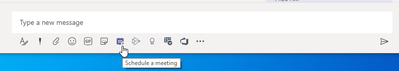

# 会议策略设置 - 常规

本文介绍 Teams 会议的以下常规策略设置：

- [立即在频道中开会](#meet-now-in-channels)
- [Outlook 加载项](#outlook-add-in)
- [频道会议安排](#channel-meeting-scheduling)
- [私人会议安排](#private-meeting-scheduling)
- [参与报告](#engagement-report)
- [会议注册](#meeting-registration)
- [网络研讨会](#webinars)
- [岛模式的会议提供商](#meeting-provider-for-islands-mode)
- [会议反应](#meeting-reactions)
- [演讲者指导](#speaker-coach)

## 立即在频道中开会

这是按用户政策，在会议开始前适用。 此设置可控制用户是否可以在 Teams 频道中启动非计划会议。 如果启用此设置，用户可以单击“ **会议** ”按钮启动计划外会议或在频道中安排会议。 默认情况下，此设置处于打开状态。

## Outlook 加载项

这是按用户政策，在会议开始前适用。 此设置控制是否可以从 Outlook (Windows、Mac、Web和移动设备) 内安排 Teams 会议。

如果关闭此设置，用户在 Outlook 中创建新会议时将无法安排 Teams 会议。 例如，在 Windows 上的 Outlook 中，**“新 Teams 会议”** 选项不会显示在功能区中。

## 频道会议安排

使用现有的 AllowChannelMeetingScheduling 策略来控制可以在团队频道日历上创建的事件类型。 这是按用户政策，在会议开始前适用。 此设置控制用户是否可以在 Teams 频道中安排会议。 默认情况下，此设置已启动。

如果关闭此策略，用户将无法创建新的频道会议。 但是，现有的频道会议可以由活动的组织者进行编辑。

将禁用会议日程安排。

将禁用“频道选择”。

在频道帖子页中，将禁用以下功能：

- 在频道回复撰写框中的 **“安排会议”** 按钮。
  
  
- 频道标题上的“**安排会议**”按钮。
  

在频道日历中:

- 将禁用频道日历标题上的 **“添加新事件”** 按钮。
  

- 用户将无法在频道日历上拖动并选择时间块来创建频道会议。

- 用户无法使用键盘快捷键在频道日历上创建会议。

在管理中心:

频道日历应用将显示在应用权限策略页面的 **Microsoft 应用** 部分。

## 私人会议安排

这是按用户政策，在会议开始前适用。 此设置控制用户是否可以在 Teams 中安排私人会议。 当会议未发布到团队中的某个频道时，这个会议就是私人的。 **默认情况下，私人会议安排** 处于打开状态。

如果同时关闭 **“专用会议安排**”和 **“频道会议安排**”设置，Teams 中的用户将禁用 **“添加所需与会者****”和“添加频道**”选项。

## 参与报告

这是按用户策略。 此设置控制会议组织者是否可以下载 [会议参与报告](teams-analytics-and-reports/meeting-attendance-report.md)。

此策略默认处于打开状态，并允许组织者查看谁注册并参加了他们设置的会议和网络研讨会。 若要在 Teams 管理中心中将其关闭，请转到 **“会议”“** > **会议策略**”，并将 **“参与报告”** 设置设置为 **“关闭**”。

还可以使用 [Set-CsTeamsMeetingPolicy](/powershell/module/skype/set-csteamsmeetingpolicy) cmdlet 编辑现有的 Teams 会议策略。 或者，使用 [New-CsTeamsMeetingPolicy](/powershell/module/skype/new-csteamsmeetingpolicy) cmdlet 创建一个新的 Teams 会议策略，并将其分配给用户。

默认情况下， **AllowEngagementReport** 参数在 PowerShell 中设置为 **Enabled** 。 若要防止会议组织者下载会议参与报告，请将 **AllowEngagementReport** 参数设置为 **Disabled**。

启用此策略后，用于下载会议参与报告的选项将显示在“ **参与者** ”窗格中。

> [!NOTE]
> 管理员无法查看未组织的会议的出席报告。 但是，可以在该会议后的 24 小时内查看给定会议的参与者详细信息。 在 Teams 管理中心中，转到 **“用户** > **管理用户**”。 选择会议组织者的显示名称。 选择“ **会议&呼叫** ”选项卡，然后选择相应的会议 ID 或呼叫 ID。 然后，选择“ **参与者详细信息**”。

有关详细信息，包括参与报告的限制，请参阅 [在 Teams 中查看和下载会议出席情况报告](https://support.microsoft.com/office/ae7cf170-530c-47d3-84c1-3aedac74d310)。

## 会议注册

这是按用户策略。 如果启用此设置，组织中的用户可以向会议添加注册。 默认情况下，此策略处于启用状态。

若要了解有关会议注册的详细信息，请阅读 [配置会议注册](set-up-webinars.md#configure-meeting-registration)。

## 网络研讨会

这是按用户策略。 如果启用网络研讨会，组织中的用户可以使用可靠的注册管理、可自定义的事件和注册网站以及面向事件的默认会议选项创建网络研讨会。 默认情况下，此策略处于启用状态。

在设置网络研讨会中详细了解 [网络研讨会](set-up-webinars.md)。

有关会议、网络研讨会和直播活动之间的差异的详细信息，请参阅 [会议、网络研讨会和实时事件](quick-start-meetings-live-events.md)。

## 岛模式的会议提供商

这是按用户策略。 此设置可控制 *处于并行模式的用户* 使用哪个 Outlook 会议加载项。 你可以指定用户是只能使用 Team 会议加载项，还是可同时使用 Teams 会议加载项和 Skype for Business 会议加载项来在 Outlook 中安排会议。

你只能将此策略应用于处于孤岛模式且其 Teams 会议策略中的 **AllowOutlookAddIn** 参数设置为 **True** 的用户。

目前，只能使用 PowerShell 来设置该策略。 可以使用 [Set-CsTeamsMeetingPolicy](/powershell/module/skype/set-csteamsmeetingpolicy) cmdlet 编辑现有的 Teams 会议策略。 或者，使用 [New-CsTeamsMeetingPolicy](/powershell/module/skype/new-csteamsmeetingpolicy) cmdlet 创建一个新的 Teams 会议策略，并将其分配给用户。

若要指定希望用户可以使用哪种会议加载项，请按以下方式设置 **PreferredMeetingProviderForIslandsMode** 参数:

- 将参数设置为 **TeamsAndSfB** 以启用 Outlook 中的 Teams 会议加载项和 Skype for Business 加载项。 **TeamsAndSfB** 是默认值。
- 将参数设置为 **Teams**，以便仅启用 Outlook 中的 Teams 会议加载项。 此策略设置可确保所有将来的会议均具有 Teams 会议的加入链接。 它不能将现有的 Skype for Business 会议加入链接迁移到 Teams。 该策略设置不会影响 Skype for Business 中的状态、聊天、PSTN 呼叫或任何其他功能，这意味着用户将继续使用 Skype for Business 的这些功能。

  如果将参数设置为 **Teams**，然后切换回 **TeamsAndSfB**，则将启用这两个会议加载项。 但请注意，现有 Teams 会议加入链接不会迁移到Skype for Business。 只有在更改后安排的 Skype for Business 会议才会有 Skype for Business 会议加入链接。

## 会议反应

可以通过 Teams 管理中心界面或使用 PowerShell 配置会议反应的可用性。 默认情况下，会议反应处于启用状态。

在 Teams 管理中心中，可以在会议策略的 **“参与者&来宾**”部分下的 **“会议** > ”**策略** 下启用或禁用会议反应。

若要在 PowerShell 中配置设置，请使用 [Set-CsTeamsMeetingPolicy](/powershell/module/skype/set-csteamsmeetingpolicy) cmdlet。 若要将其关闭，请将 **AllowMeetingReactions** 设置为 **False**。

关闭用户的反应并不意味着用户无法在他们安排的会议中使用反应。 无论默认设置如何，会议组织者仍然可以从会议选项页面开启回应。

## 演讲者指导

此设置允许用户在 Teams 会议期间打开演讲者指导。 演讲者指导在用户演示时收听用户的音频，并提供私人实时反馈和改进建议。 用户还会在会议后获取其反馈的摘要报告。

> [!NOTE]
> 在会议期间打开演讲者指导的用户是唯一可以查看反馈摘要报告的用户。 管理员无权访问任何此类数据。

目前，只能在 PowerShell 中设置和编辑此策略。 通过使用 [Set-CsTeamsMeetingPolicy](/powershell/module/skype/set-csteamsmeetingpolicy) cmdlet。 或者，使用 [New-CsTeamsMeetingPolicy](/powershell/module/skype/new-csteamsmeetingpolicy) cmdlet 创建一个新的 Teams 会议策略，并将其分配给用户。

默认情况下，此设置处于启用状态。 若要将其关闭，请将 **AllowMeetingCoach** 设置为 **False**。

## 相关主题

- [Teams PowerShell 概览](teams-powershell-overview.md)
- [在 Teams 中分配策略](policy-assignment-overview.md)
- [从用户删除 RestrictedAnonymousAccess Teams 会议策略](meeting-policies-restricted-anonymous-access.md)
