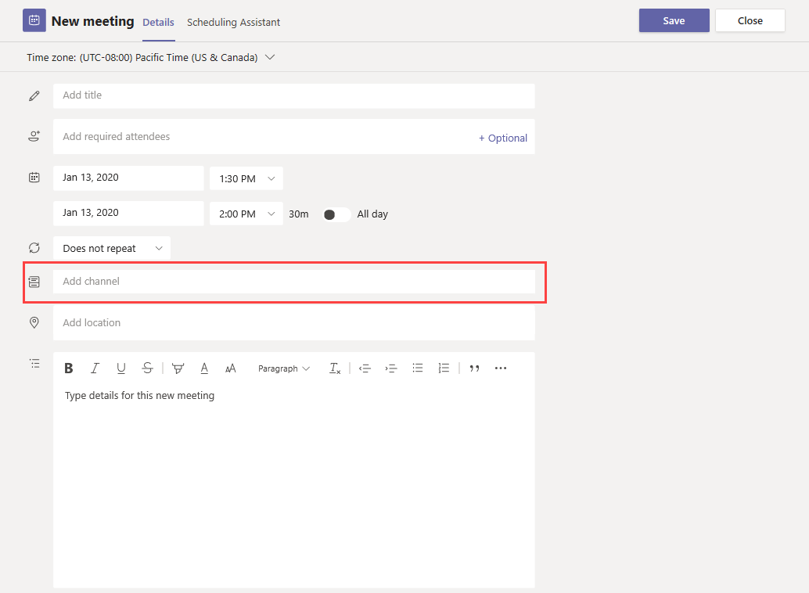
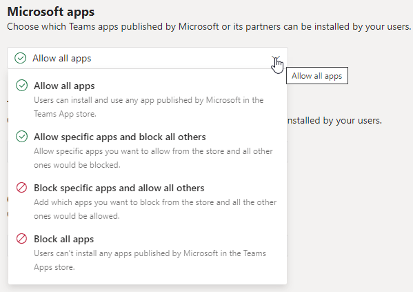

# 会议策略设置 - 常规

本文介绍 Teams 会议的以下常规策略设置：

- [立即在频道中见面](#meet-now-in-channels)
- [Outlook 加载项](#outlook-add-in)
- [频道会议日程安排](#channel-meeting-scheduling)
- [私人会议日程安排](#private-meeting-scheduling)
- [立即在私人会议中会面](#meet-now-in-private-meetings)
- [指定的演示者角色模式](#designated-presenter-role-mode)
- [Engagement 报表](#engagement-report)
- [会议注册](#meeting-registration)
- [谁可以注册](#who-can-register)
- [Islands 的会议提供程序模式](#meeting-provider-for-islands-mode)
- [说话人教练](#speaker-coach)

## 立即在频道中见面

这是按用户政策，在会议开始前适用。 此设置控制用户是否可以在 Teams 频道中启动即席会议。 如果启用此功能，用户可以单击 **“会议** ”按钮以启动即席会议或在频道中安排会议。 默认值为 True。

## Outlook 加载项

这是按用户政策，在会议开始前适用。 此设置控制是否可以从 Outlook (Windows、Mac、Web和移动设备) 内安排 Teams 会议。

如果关闭此功能，则用户在 Outlook 中创建新会议时无法安排 Teams 会议。 例如，在 Windows 上的 Outlook 中，**“新 Teams 会议”** 选项不会显示在功能区中。

## 频道会议日程安排

使用现有的 AllowChannelMeetingScheduling 策略来控制可以在团队频道日历上创建的事件类型。 这是按用户政策，在会议开始前适用。 此设置控制用户是否可以在 Teams 频道中安排会议。 默认情况下，此设置已启动。

如果此策略被关闭，用户将无法创建新的频道会议。 但是，现有的频道会议可以由活动的组织者进行编辑。

将禁用会议日程安排。

将禁用“频道选择”。

在频道帖子页中，将禁用以下内容：

- 在频道回复撰写框中的 **“安排会议”** 按钮。
  
  
- 频道标题上的“**安排会议**”按钮。
  

在频道日历中:

- 将禁用频道日历标题上的 **“添加新事件”** 按钮。
  

- 用户将无法拖动并选择频道日历上的时间块来创建频道会议。

- 用户无法使用键盘快捷方式在频道日历上创建会议。

在管理中心:

频道日历应用将显示在应用权限策略页面的 **Microsoft 应用** 部分。

## 私人会议日程安排

这是按用户政策，在会议开始前适用。 此设置控制用户是否可以在 Teams 中安排私人会议。 当会议未发布到团队中的某个频道时，这个会议就是私人的。

请注意，如果关闭 **“允许安排私人会议** ”和 **“允许安排频道会议”**，则 Teams 中的用户将禁用 **“添加所需的与会者** ”和 **“添加频道** ”选项。 默认情况下，此设置已启动。

## 立即在私人会议中会面

这是按用户政策，在会议开始前适用。 此设置控制用户是否可以启动临时私人会议。  默认情况下，此设置已启动。

## 指定的演示者角色模式

这是按用户策略。 通过此设置，可更改 Teams 客户端中 **“会议选项中”** 的 **“谁能演示?”** 设置的默认值。 此策略设置影响所有会议，包括 “立即开会会议”。

通过 **“谁能演示?”** 会议组织者可以选择谁可以成为会议中的演示者。 要了解更多信息，请参阅 [更改 Teams 会议的与会者设置](https://support.microsoft.com/article/change-participant-settings-for-a-teams-meeting-53261366-dbd5-45f9-aae9-a70e6354f88e) 和 [Teams 会议中的角色](https://support.microsoft.com/article/roles-in-a-teams-meeting-c16fa7d0-1666-4dde-8686-0a0bfe16e019)。

目前，只能使用 PowerShell 来配置此策略设置。 可以使用 [Set-CsTeamsMeetingPolicy](/powershell/module/skype/set-csteamsmeetingpolicy) cmdlet 编辑现有的 Teams 会议策略。 或者，使用 [New-CsTeamsMeetingPolicy](/powershell/module/skype/new-csteamsmeetingpolicy) cmdlet 创建一个新的 Teams 会议策略，并将其分配给用户。

要在 Teams 中指定 **“谁能演示?”** 设置的默认值，请将 **DesignatedPresenterRoleMode** 参数设置为以下之一:

- **EveryoneUserOverride**:  所有会议参与者都能成为演示者。 此值为默认值。 该参数对应 Teams 中的 **“每个人”** 设置。
- **EveryoneInCompanyUserOverride**: 组织中的认证用户，包括客人用户，都能成为演示者。 此参数对应 Teams 中 **“我的组织中的人员”** 设置。
- **OrganizerOnlyUserOverride**: 只有会议组织者可以成为演示者，所有其他会议参与者都将指定为与会者。 此参数对应 Teams 中的 **“只有我”** 设置。

请记住，在设置默认值后，会议组织者仍然可以在 Teams 中更改此设置，并选择谁可以在他们安排的会议中演示。

## Engagement 报表

这是按用户策略。 此设置控制会议组织者是否可以下载 [会议出席报告](teams-analytics-and-reports/meeting-attendance-report.md)。

默认情况下，此策略处于启用状态，使组织者能够查看注册和参加他们设置的会议和网络研讨会的人员。 若要在 Teams 管理中心关闭它，请转到 **会议** > **会议策略**，并将 **Engagement 报告** 设置设置为 **“关闭**”。

还可以使用 [Set-CsTeamsMeetingPolicy](/powershell/module/skype/set-csteamsmeetingpolicy) cmdlet 编辑现有的 Teams 会议策略。 或者，使用 [New-CsTeamsMeetingPolicy](/powershell/module/skype/new-csteamsmeetingpolicy) cmdlet 创建一个新的 Teams 会议策略，并将其分配给用户。

默认情况下， **AllowEngagementReport** 参数设置为在 PowerShell 中 **启用** 。 若要防止会议组织者下载会议出席情况报告，请将 **AllowEngagementReport** 参数设置为 **“已禁用**”。

启用此策略后，下载会议出席情况报告的选项将显示在 **“参与者** ”窗格中。

> [!NOTE]
> 作为管理员，无法查看未组织的会议的出席情况报告。 但是，可以在会议后 24 小时内查看给定会议的参与者详细信息。 在 Teams 管理中心，转到 **“用户** > **管理用户**”。 为会议组织者选择显示名称。 选择 **“会议&呼叫** ”选项卡，然后选择相应的会议 ID 或呼叫 ID。 然后，选择 **参与者详细信息**。

有关详细信息，包括参与度报告的限制，请参阅 [Teams 中的查看和下载会议出席情况报告](https://support.microsoft.com/office/view-and-download-meeting-attendance-reports-in-teams-ae7cf170-530c-47d3-84c1-3aedac74d310)。

## 会议注册

这是按用户策略。 如果启用此功能，组织中的用户可以设置网络研讨会。 默认情况下启用此策略。

若要在 Teams 管理中心编辑此策略，请转到 **会议** > **会议策略**。 若要关闭会议注册，请将策略设置为 **“关闭**”。

可以使用 [Set-CsTeamsMeetingPolicy](/powershell/module/skype/set-csteamsmeetingpolicy) cmdlet 编辑现有的 Teams 会议策略。 或者，使用 [New-CsTeamsMeetingPolicy](/powershell/module/skype/new-csteamsmeetingpolicy) cmdlet 创建一个新的 Teams 会议策略，并将其分配给用户。

若要启用会议注册，请将  **MeetingRegistration** 参数设置为 **True**。 默认情况下，此设置为 **True** 。

若要关闭会议注册并阻止用户安排网络研讨会，请将参数设置为 **False**。

## 谁可以注册

此策略控制哪些用户可以注册和参加网络研讨会。 此策略有两个选项，仅在打开 **会议注册** 时才可用。

- 如果希望允许所有人（包括匿名用户）注册和参加组织设置中的用户的网络研讨会，请设置 **“谁可以注册** 到 **每个人** ”。
- 如果希望仅允许组织中的用户注册和参加网络研讨会，请设置 **“谁可以注册** 到 **组织中的每个人** ”。

默认情况下， **可以注册的人员** 设置为 **“每个人**”。 若要在 Teams 管理中心编辑此策略，请转到 **会议** > **会议策略**。

可以使用 [Set-CsTeamsMeetingPolicy](/powershell/module/skype/set-csteamsmeetingpolicy) cmdlet 编辑现有的 Teams 会议策略。 或者，使用 [New-CsTeamsMeetingPolicy](/powershell/module/skype/new-csteamsmeetingpolicy) cmdlet 创建一个新的 Teams 会议策略，并将其分配给用户。

若要允许所有人（包括匿名用户）注册和参加网络研讨会，请将 **WhoCanRegister** 参数设置为 **“每个人**”。 默认情况下，此设置为 **“每个人** ”。

若要仅允许组织中的用户注册和参加网络研讨会，请将参数设置为 **EveryoneInCompany**。

## Islands 的会议提供程序模式

这是按用户策略。 此设置可控制 *处于并行模式的用户* 使用哪个 Outlook 会议加载项。 你可以指定用户是只能使用 Team 会议加载项，还是可同时使用 Teams 会议加载项和 Skype for Business 会议加载项来在 Outlook 中安排会议。

你只能将此策略应用于处于孤岛模式且其 Teams 会议策略中的 **AllowOutlookAddIn** 参数设置为 **True** 的用户。

目前，只能使用 PowerShell 来设置该策略。 可以使用 [Set-CsTeamsMeetingPolicy](/powershell/module/skype/set-csteamsmeetingpolicy) cmdlet 编辑现有的 Teams 会议策略。 或者，使用 [New-CsTeamsMeetingPolicy](/powershell/module/skype/new-csteamsmeetingpolicy) cmdlet 创建一个新的 Teams 会议策略，并将其分配给用户。

若要指定希望用户可以使用哪种会议加载项，请按以下方式设置 **PreferredMeetingProviderForIslandsMode** 参数:

- 将参数设置为 **TeamsAndSfB** 以启用 Outlook 中的 Teams 会议加载项和 Skype for Business 加载项。 此值为默认值。
- 将参数设置为 **Teams**，以便仅启用 Outlook 中的 Teams 会议加载项。 此策略设置可确保所有将来的会议均具有 Teams 会议的加入链接。 它不能将现有的 Skype for Business 会议加入链接迁移到 Teams。 该策略设置不会影响 Skype for Business 中的状态、聊天、PSTN 呼叫或任何其他功能，这意味着用户将继续使用 Skype for Business 的这些功能。

  如果将参数设置为 **Teams**，然后切换回 **TeamsAndSfB**，则将启用这两个会议加载项。 但是，请注意，现有的 Teams 会议联接链接不会迁移到Skype for Business。 只有在更改后安排的 Skype for Business 会议才会有 Skype for Business 会议加入链接。

## 会议反应
可以通过 Teams 管理中心接口或 PowerShell 配置会议响应的可用性。 可以在会议策略的 **参与者&来宾** 部分下启用或禁用会议反应。

若要配置设置，请使用Set-CsTeamsMeetingPolicy cmdlet。 默认情况下启用此设置。 若要将其关闭，请将 **AllowMeetingReactions** 设置为 **False**。

会议回应默认为“关闭”。 关闭用户的回应，并不意味着用户不能在自己安排的会议中使用回应。 无论默认设置如何，会议组织者仍然可以从会议选项页面开启回应。

## 说话人教练

此设置允许用户在 Teams 会议期间打开说话人教练。 说话人教练在用户演示时收听其音频，并提供私人实时反馈和改进建议。 用户还会在会后获取其反馈的摘要报告。

> [!NOTE]
> 在会议期间打开说话人教练的用户是唯一能够查看反馈摘要报告的用户。 管理员将无权访问这些数据。

目前，只能在 PowerShell 中设置和编辑此策略。 使用 [Set-CsTeamsMeetingPolicy](/powershell/module/skype/set-csteamsmeetingpolicy) cmdlet。 或者，使用 [New-CsTeamsMeetingPolicy](/powershell/module/skype/new-csteamsmeetingpolicy) cmdlet 创建一个新的 Teams 会议策略，并将其分配给用户。

默认情况下启用此设置。 若要将其关闭，请将 **AllowMeetingCoach** 设置为 **False**。

## 相关主题

- [Teams PowerShell 概览](teams-powershell-overview.md)
- [在 Teams 中分配策略](policy-assignment-overview.md)
- [从用户删除 RestrictedAnonymousAccess Teams 会议策略](meeting-policies-restricted-anonymous-access.md)
