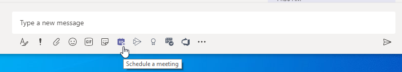
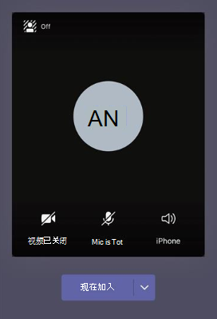

# 管理 Teams 中的会议策略

::: zone target="docs"
使用会议策略来控制用户在组织中安排会议中对会议参与者可用的功能。 可以使用自动创建的全局 (默认整个组织) 策略，也可以创建和分配自定义策略。 可以在 Microsoft Teams 管理中心内或使用 [PowerShell](teams-powershell-overview.md) 管理会议策略。

> [!NOTE]
> 有关使用角色管理会议演示者和与会者权限的信息，请参阅 [Teams 会议角色](https://support.microsoft.com/office/roles-in-a-teams-meeting-c16fa7d0-1666-4dde-8686-0a0bfe16e019?ui=en-us&rs=en-us&ad=us)。

可以通过以下方式实施策略，这些策略会在会议开始前、会议期间或会议结束后影响用户的会议体验。

|实施类型  |说明  |
|---------|---------|
|按组织者    |如果你实现按组织者策略，所有会议参加者都会继承组织者的策略。 例如， **自动允许人员** 为按组织者的策略。 它控制用户是直接加入会议还是在大厅里等待由分配策略的用户安排的会议。          |
|按用户    |实施按用户策略时，只有每用户策略适用于限制组织者和/或会议参与者的某些功能。 例如， **“在频道中允许立即开会”** 是按用户策略。     |
|按组织者和按用户     |当实施按组织者和按用户策略的组合时，会根据会议参与者的策略和组织者的策略对其进行某些功能限制。 例如，**“允许云录制”** 是按组织者和按用户策略。 打开此设置以允许用户开始和停止录制。

可编辑全局策略中的设置，或创建和分配一个或多个自定义策略。 除非创建并指定一个自定义策略，否则用户将获得全局策略。

> [!NOTE]
> 如果用户启用了音频会议许可或允许用户进行音频会议，则会议详情按钮将可用，否则，会议详情将不可用。

## 创建自定义会议策略

1. 在 Microsoft Teams 管理员中心的左侧导航中，转到 **“会议”** > **“会议策略”**。
2. 选择“**添加**”。
3. 输入策略的名称和说明。 名称不能包含特殊字符或超过 64 个字符。
4. 选择想要的设置。
5. 选择“**保存**”。

例如，假设你有一组用户并且你想要限制这组用户的会议所需的带宽量。 你要创建新的自定义策略并命名为“带宽限制”，然后禁用以下设置：

在“音频和视频”中：

- 禁用“允许云录制”。
- 禁用“允许 IP 视频”。

在“内容共享”中：

- 禁用屏幕共享模式。
- 禁用“允许白板”。
- 禁用“允许共享笔记”。

然后将此策略分配给用户。

## 编辑会议策略

可以编辑全局策略和创建的任何自定义策略。

1. 在 Microsoft Teams 管理员中心的左侧导航中，转到 **“会议”** > **“会议策略”**。
2. 通过单击策略名称的左侧选择策略，然后选择 **“编辑”**。
3. 在此处根据需要进行更改。
4. 选择“**保存**”。

> [!NOTE]
> 一次只能向一个用户分配一个会议策略。

## 将会议策略分配给用户

[!INCLUDE [assign-policy](includes/assign-policy.md)]

> [!NOTE]
> 如果已将它分配给用户，则无法删除该策略。 必须首先为所有受影响的用户指定不同的策略，然后才能删除原来的策略。

## 会议策略设置

在 **“会议策略”** 页面上选择现有策略，或选择 **“添加”** 以添加新策略。 为以下内容配置设置。

- [常规](#meeting-policy-settings---general)
- [音频和视频](#meeting-policy-settings---audio--video)
- [内容共享](#meeting-policy-settings---content-sharing)
- [参与者和来宾](#meeting-policy-settings---participants--guests)

::: zone-end

## 会议策略设置 - 常规

- [允许在频道中立即开会](#allow-meet-now-in-channels)
- [允许 Outlook 加载项](#allow-the-outlook-add-in)
- [允许频道会议安排](#allow-channel-meeting-scheduling)
- [允许安排私人会议](#allow-scheduling-private-meetings)
- [允许在私人会议中立即开会](#allow-meet-now-in-private-meetings)

### 允许在频道中立即开会

允许 **立即开会** 是按用户策略，在会议开始之前适用。 此设置可控制用户是否可以在 Teams 频道中启动非计划会议。 如果打开此设置，用户可以选择 **“会议”** 按钮开始非计划的会议或在频道中安排会议。 默认值为 True。

### 允许 Outlook 加载项

允许 Outlook 加载项是按用户的策略，在会议开始前适用。 此设置控制是否可以从 Outlook (Windows、Mac、Web和移动设备) 内安排 Teams 会议。

如果关闭此功能，用户将无法进行日程安排。 当他们在 Outlook 中创建一个新会议时进行 Teams 会议。 例如，在 Windows 上的 Outlook 中，**“新 Teams 会议”** 选项不会显示在功能区中。

### 允许安排频道会议

使用现有的 AllowChannelMeetingScheduling 策略来控制可以在团队频道日历上创建的事件类型。 这是按用户政策，在会议开始前适用。 此设置控制用户是否可以在 Teams 频道中安排会议。 默认情况下，此设置已启动。

如果该策略关闭，用户就无法创建新频道会议。 但是，现有的频道会议可以由活动的组织者进行编辑。

将禁用会议日程安排。

 

将禁用“频道选择”。

在频道公告页面上，将禁用以下功能:

- 在频道回复撰写框中的 **“安排会议”** 按钮。
  
  
- 频道标题上的 **“安排会议”** 按钮。
  

在频道日历中:

- 将禁用频道日历标题上的 **“添加新事件”** 按钮。
  

- 用户无法在频道日历上拖动和选择时间块来创建频道会议。

- 用户无法使用键盘快捷键在频道日历上创建会议。

在管理中心:

频道日历应用将显示在应用权限策略页面的 **Microsoft 应用** 部分。

 

### 允许安排私人会议

“安排私人会议”是按用户策略，在会议开始前适用。 此设置控制用户是否可以在 Teams 中安排私人会议。 当会议未发布到团队中的某个频道时，这个会议就是私人的。

如果关闭 **“允许安排私人会议”** 和 **“允许频道会议安排”**，则 Teams 中的用户将禁用 **“添加所需与会者”** 和 **“添加频道”** 选项。 默认情况下，此设置已启动。

### 允许在私人会议中立即开会

这是按用户政策，在会议开始前适用。 此设置控制用户是否可以启动非计划的私人会议。 默认情况下，此设置已启动。

## 会议策略设置 - 音频和视频

- [允许转录](#allow-transcription)
- [允许云录制](#allow-cloud-recording)
- [IP 音频模式](#mode-for-ip-audio)
- [IP 视频模式](#mode-for-ip-video)
- [允许 IP 视频](#allow-ip-video)
- [媒体位率 (Kbs)](#media-bit-rate-kbs)

### 允许转录

此策略将启用实时转录功能。 允许转录是按用户的策略。 此设置控制是否可以转录这个特定团队的会议。

实时转录在团队会议期间以近乎实时的方式显示口语内容的语音转文本。 文字与会议视频一起出现，包括演示者的姓名和时间戳。 有关详细信息，请参阅 [Teams 会议中的实时转录](https://support.microsoft.com/office/view-live-transcription-in-a-teams-meeting-dc1a8f23-2e20-4684-885e-2152e06a4a8b)。

目前，Teams 桌面客户端支持实时转录。 支持美国英语口语的转录。 会议结束后，可在 Teams 桌面或 Web 上查看转录内容。

以下是 **“允许转录”** 和 **“允许云录制”** 策略设置如何共同工作。 下表介绍了这些设置的值和会议行为。

|允许转录|允许云录制|行为|
|---------|---------|---------|
|**打开**|**打开**|Teams 会议中可使用 **“开始转录”** 选项。 会议组织者或会议参与者可以开始和停止转录。 Teams 会议中可使用 **“开始录制”** 选项。 会议组织者或会议参与者可以开始和停止录制。 |
|**打开**|**禁用**|Teams 会议中可使用 **“开始转录”** 选项。 Teams 会议中无法使用 **“开始录制”** 选项。 |
|**禁用**|**打开**|Teams 会议中可使用 **“开始录制”** 选项。 **“开始录制”** 选项在 Teams 会议中不可用。|
|**禁用**|**禁用**|Teams 会议中没有录制和转录功能。  |

### 允许云录制

允许云录制是在按用户策略中控制的。 此设置控制用户是否可以录制。 如果会议组织者或其他会议参与者的特定策略设置已打开，并且他们是与组织者来自同一组织的认证用户，则可由他们启动录制。

组织之外的人员，如联合和匿名用户，无法启动录制。 来宾用户无法启动或停止录制。

若要了解有关云会议记录的更多信息，请参阅 [Teams 云会议录制](cloud-recording.md)。

### IP 音频模式

IP 音频的模式是按用户策略。 此设置控制是否可以在会议和群组通话中打开音频。 下面是此设置的值。

|设置值 |行为  |
|---------|---------|
|**已启用传出和传入音频**    |会议允许传出和传入音频。这是默认设置。 |
|**禁用**     |传出和传入音频在会议中已关闭。     |

如果为用户设置为 **禁用**，该用户仍然可以安排和组织会议，但不能使用音频。 若要加入会议，用户必须通过公共交换电话网 (PSTN) 拨入，或由会议通过电话呼叫加入用户。 没有指定任何策略的会议参与者 (例如，匿名参与者) 将此设置为默认 **启用传出和传入音频**。 在 Teams 移动客户端上，如果禁用此设置，用户必须通过 PSTN 拨入会议。

此设置不适用于 1:1 呼叫。 若要限制 1:1 通话，请配置 Teams [通话策略](teams-calling-policy.md) 并关闭 **“进行私人通话”** 设置。 此设置也不适用于 Surface Hub 和 Microsoft Teams 会议室设备等会议室设备。

此设置尚未适用于 Microsoft 365 政府社区云 (GCC)、GCC High 或国防部 (DoD) 环境。

有关详细信息，请参阅 [会议参与者管理音频/视频](#manage-audiovideo-for-meeting-participants)。

### IP 视频模式

IP 视频的模式是按用户策略。 此设置控制是否可以在会议和群组通话中打开视频。 下面是此设置的值。

|设置值 |行为  |
|---------|---------|
|**已启用传出和传入视频**    | 默认设置是允许会议中传出和传入视频。 |
|**禁用**     | 传出和传入视频在会议中已关闭。 在 Teams 移动客户端上，用户无法在会议中分享视频或照片。   如果禁用 **IP 音频的模式**，那么 **IP 视频的模式** 也将保持禁用。  |

如果为用户设置为 **禁用**，则该用户无法打开视频或查看其他会议参与者共享的视频。 没有指定任何策略的会议参与者 (例如，匿名参与者) 将此设置为默认 **启用传出和传入视频**。

此设置不适用于 Surface Hub 和 Microsoft Teams 会议室设备等会议室设备。

此设置尚未适用于 Microsoft 365 政府社区云 (GCC)、GCC High 或国防部 (DoD) 环境。

> [!NOTE]
> 请记住，该设置同时控制传出和传入的视频，而 **允许 IP 视频** 设置则控制传出视频。 若要了解更多信息，请参阅[哪些 IP 视频策略设置优先?](#which-ip-video-policy-setting-takes-precedence) 和 [管理会议参与者的音频/视频 ](#manage-audiovideo-for-meeting-participants)。

有关详细信息，请参阅 [会议参与者管理音频/视频](#manage-audiovideo-for-meeting-participants)。

### 允许 IP 视频

允许 IP 视频是按组织者和按用户策略的组合。 视频是会议的重要组成部分。 在一些组织中，管理员可能希望对有视频的用户会议进行更多的控制。 此设置控制是否可以在用户主持的会议和用户启动的 1:1 和群组通话中打开视频。 在 Teams 移动客户端上，该设置可以控制用户是否可以在会议中共享照片和视频。

由启用了此策略设置的用户组织的会议，如果与会者也启用了此策略设置，则允许与会者在会议中进行视频共享。 没有指定任何策略的会议参与者 (例如，匿名和联合参与者) 继承会议组织者的策略。

> [!NOTE]
> 请记住，此设置控制传出视频，而 **IP 视频的模式** 设置则控制传出和传入视频。 若要了解更多信息，请参阅[哪些 IP 视频策略设置优先?](#which-ip-video-policy-setting-takes-precedence) 和 [管理会议参与者的音频/视频 ](#manage-audiovideo-for-meeting-participants)。

| Teams 桌面和 Web 客户端 |Teams 移动客户端  |
|:-------:|:-------:|
|    |          |

查看以下示例。

|用户 |会议策略  |允许 IP 视频 |
|---------|---------|---------|
|Daniela   | 全局   | 开       |
|Amanda    | Location1MeetingPolicy        | 关闭      |

由 Daniela 主持的会议允许开启视频。 Daniela 可以加入会议并打开视频。 Amanda 不能在 Daniela 的会议上开视频，因为 Amanda 的策略不允许视频。 Amanda 可以看到其他与会者在会议上分享的视频。

在 Amanda 主持的会议中，无论分配给他们的视频策略如何，任何人都无法打开视频。 这意味着 Daniela 不能在 Amanda 的会议上开视频。  

如果 Daniela 给 Amanda 打电话时开着视频，Amanda 可以只用音频接听电话。 电话接通后，Amanda 可以看到 Daniela 的视频，但无法打开视频。 如果 Amanda 给 Daniela 打电话，Daniela 可以用视频和音频接听电话。 通话接通后，Daniela 可以根据需要打开或关闭其视频。

有关详细信息，请参阅 [会议参与者管理音频/视频](#manage-audiovideo-for-meeting-participants)。

#### 哪些 IP 视频策略设置优先

对于用户，视频的最多限制策略设置优先。此处为一些示例。

|允许 IP 视频|IP 视频模式|会议体验|
|---------|---------|---------|
|组织者: **打开**  参与者: **打开** |参与者: **禁用**        |**IP 视频模式** 设置优先。 分配到此策略的参与者不能开启或查看他人分享的视频。|
|组织者: **打开**  参与者: **打开** |参与者: **启用传出和传入视频**          |分配到该策略的参与者可以打开或查看他人分享的视频。         |
|组织者: **打开**  参与者: **关闭** |参与者: **启用传出和传入视频**         |允许 **IP 视频** 设置优先。 参与者只能看到传入视频，无法发送传出视频。         |
|组织者: **打开**  参与者: **关闭** |参与者: **禁用**         |**IP 视频模式** 设置优先。 参与者无法看到传入或传出的视频。|
|组织者: **关闭**    |       |**允许 IP 视频** 设置优先，因为它已为组织者关闭。 任何人都不能在分配此策略的用户组织会议中打开视频。         |

### 管理与会者的音频/视频

|如果你想要...  |设置以下策略设置  |
|---------|---------|
|禁用会议参与者的音频和视频  |IP 音频模式: **禁用**  IP 视频模式: **禁用** 允许 IP 视频: 不适用       |
|只为会议参与者启用传入的视频和音频  |IP 音频模式: **启用传出和传入音频**  IP 视频模式: **启用传出和传入视频** 允许 IP 视频: **关闭**       |
|禁用会议参与者的视频 (参与者仅有音频)|  IP 音频模式: **启用传出和传入音频**  IP 视频模式: **禁用** 允许 IP 视频: 不适用
|为会议参与者启用音频和视频    |IP 音频模式: **启用的传出和传入** (默认)  IP 视频模式: **启用传出和传入视频** (默认) 允许 IP 视频: **打开** (默认)    |

适用会议组织者政策和用户政策之间最严格的政策。 例如，如果组织者有限制视频的策略，而用户的策略不限制视频，那么会议参与者就会继承会议组织者的策略，在会议中无法访问视频。 这意味着他们只能使用音频加入会议。

> [!NOTE]
> 当用户通过电话启动群组呼叫加入时，不会出现 **使用电话进行音频** 的画面。 这是一个已知的问题，我们正在努力解决。 若要解决这个问题，选择 **其他加入选项** 下的 **电话音频**。  

#### Teams 移动设备客户端

对于 Teams 移动设备客户端的用户来说，在会议期间分享照片和视频的能力由 **允许 IP 视频** 或 **IP 视频模式** 设置决定。 根据策略设置优先，将无法使用分享视频和照片的功能。 这不会影响屏幕共享，可以使用单独的 [屏幕共享模式](#screen-sharing-mode) 设置进行配置。 此外，还可以设置 [Teams 移动性策略](/powershell/module/skype/new-csteamsmobilitypolicy)，防止移动用户通过蜂窝连接使用 IP 视频，这意味着他们必须使用 WiFi 连接。

### 媒体位率 (Kbs)

这是按用户策略。 此设置决定了用户在通话和会议中的音频、视频和基于视频的应用共享传输的总平均媒体位速率。 它适用于通话或会议中用户的上行和下行媒体遍历。 此设置可让你对组织中的带宽管理进行精细控制。 根据用户所需的会议场景，我们建议准备足够的带宽，以保证优质的体验。 最小值为 30Kbps，最大值取决于会议场景。 若要了解有关在 Teams 中举行高质量会议、通话和实时活动的最低推荐带宽的更多信息，请参阅 [“带宽要求”](prepare-network.md#bandwidth-requirements)。

如果没有足够的带宽供会议使用，与会者会看到一条表明网络质量差的消息。

对于需要最高质量视频体验的会议，如 CEO 董事会会议和 Teams 直播活动，我们建议将带宽设置为 10 Mbps。 即使设置了最大体验，当检测到某些网络状况时，Teams 媒体栈也会根据不同的场景，适应低带宽的条件。

## 会议策略设置 - 内容共享

- [屏幕共享模式](#screen-sharing-mode)
- [允许参与者授予或请求控制权](#allow-a-participant-to-give-or-request-control)
- [允许外部参与者授予或请求控制权](#allow-an-external-participant-to-give-or-request-control)
- [允许 PowerPoint 共享](#allow-powerpoint-sharing)
- [允许白板](#allow-whiteboard)
- [允许共享笔记](#allow-shared-notes)

### 屏幕共享模式

> [!NOTE]
> 此功能仍处于开发阶段。屏幕共享是按参与者的策略，但是，如本节中所述，可能会受组织者的屏幕共享设置的影响。

此设置控制是否允许在用户的会议中进行桌面和/或窗口共享。 未分配任何策略的会议参与者 (例如，匿名、嘉宾、B2B和联合参与者) 继承会议组织者的策略。

|设置值 |行为  |
|---------|---------|
|**整个屏幕**    | 会议中可以实现完全的桌面共享和应用共享 |
|**单个应用程序**   | 会议中允许应用共享        |
|**禁用**     |会议中关闭了屏幕共享和应用共享。       |

查看以下示例。

|用户 |会议策略 |屏幕共享模式 |
|---------|---------|---------|
|Daniela  | 全局   | 整个屏幕 |
|Amanda   | Location1MeetingPolicy  | 已禁用 |

由 Daniela 主持的会议允许会议参与者分享他们的整个屏幕或特定的应用程序。 如果 Amanda 加入 Daniela 的会议，Amanda 则无法分享她的屏幕或特定的应用程序，因为她已禁用她的策略设置。 在 Amanda 主持的会议中，无论分配给他们的屏幕共享模式策略是什么，都不允许任何人共享他们的屏幕或单个应用程序。 这意味着 Daniela 无法在 Amanda 的会议上分享她的屏幕或单个应用程序。  

目前，如果用户使用谷歌浏览器，就无法在 Teams 会议中播放视频或分享屏幕。

### 允许参加者授予或请求控制权

这是按用户策略。 此设置可控制用户是否可以将共享桌面或窗口的控制权交给其他会议参与者。 若要想进行控制，请将鼠标悬停在屏幕上方。

如果为用户开启此设置，则在共享会话中的顶部栏中会显示 **“授予控制”** 选项。

如果已关闭用户的设置，则无法使用 **“授予控制”** 选项。

查看以下示例。

|用户 |会议策略  |允许参加者授予或请求控制权 |
|---------|---------|---------|
|Daniela   | 全局   | 开       |
|Babek    | Location1MeetingPolicy        | 关闭   |

在 Babek 组织的会议中，Daniela 可以将共享桌面或窗口的控制权交给其他参与者，而 Babek 则无法将控制权交给其他参与者。

若要使用 PowerShell 来控制可以授予控制权或接受控制权请求的人选，请使用 AllowParticipantGiveRequestControl cmdlet。

> [!NOTE]
> 若要在共享过程中授予并控制共享内容，双方必须都使用 Teams 桌面客户端。 如果任何一方在浏览器中运行 Teams，则不支持控制。 这是由我们计划修复的一个技术限制造成。

### 允许外部参加者授予或请求控制权

这是按用户策略。 无论会议组织者设置了什么，组织是否为用户设置了这个功能，都无法控制外部参与者的行为。 该参数控制是否可以让外部参与者控制或请求控制共享者的屏幕，这取决于共享者在其组织的会议策略中设置的内容。 Teams 会议的外部与会者可分为以下几类:  

- 匿名用户
- 来宾用户  
- B2B 用户
- 联合用户  

联合用户在共享时是否可以将控制权交给外部用户，由组织中的 **允许外部参与者授予或请求控制权** 设置控制。

要使用 PowerShell 来控制外部参与者是否可以授予控制权或接受控制权请求，请使用AllowExternalParticipantGiveRequestControl cmdlet。

### 允许 PowerPoint 共享

这是按用户策略。 此设置可控制用户是否可以在会议中共享 PowerPoint 幻灯片。 外部用户，包括匿名用户、来宾用户和联合用户，继承会议组织者的策略。

查看以下示例。

|用户 |会议策略  |允许 PowerPoint 共享 |
|---------|---------|---------|
|Daniela   | 全局   | 开       |
|Amanda   | Location1MeetingPolicy        | 关闭   |

Amanda 无法在会议上共享 PowerPoint 幻灯片，即使她是会议组织者。 Daniela 可以分享 PowerPoint 幻灯片，即使会议是由 Amanda 组织的。 Amanda 可以查看会议中其他人共享的 PowerPoint 幻灯片，尽管她不能共享 PowerPoint 幻灯片。

### 允许白板

这是按用户策略。 此设置控制用户是否可以在会议中共享白板。 外部用户，包括匿名用户、B2B用户和联盟用户，继承会议组织者的策略。

查看以下示例。

|用户 |会议策略  |允许白板|
|---------|---------|---------|
|Daniela   | 全局   | 开       |
|Amanda   | Location1MeetingPolicy        | 关闭   |

Amanda 不能在会议上共享白板，即使她是会议组织者。 Daniela 可以共享白板，即使会议是由 Amanda 组织的。  

### 允许共享的笔记

这是按用户策略。 此设置控制用户是否可以在会议中创建和共享笔记。 外部用户，包括匿名用户、B2B用户和联盟用户，继承会议组织者的策略。 在最多100人参加的会议中，支持 **“会议记录”** 选项卡。

查看以下示例。

|用户 |会议策略  |允许共享的笔记 |
|---------|---------|---------|
|Daniela   | 全局   | 开       |
|Amanda   | Location1MeetingPolicy | 关闭 |

Daniela 可以在 Amanda 的会议上做笔记，而 Amanda 不能在任何会议上做笔记。

<!-- Bookmark used by Context Sensitive Help (CSH). Do not delete. -->

<!-- Do not remove the bookmark link above. -->

## 会议策略设置 - 参与者和来宾

这些设置可以控制哪些与会者在进入会议之前在大厅等待，以及允许他们参与会议的级别。

- [允许匿名用户启动会议](#let-anonymous-people-start-a-meeting)
- [自动管理人员](#automatically-admit-people)
- [允许拨入用户绕过问题](#allow-dial-in-users-to-bypass-the-lobby)
- [允许团队成员绕过问题](#allow-team-members-to-bypass-the-lobby)
- [启用实时字幕](#enable-live-captions)
- [在会议中允许聊天](#allow-chat-in-meetings)

> [!NOTE]
>加入会议的选项会有所不同，这取决于每个 Teams 组的设置和连接方法。 如果小组有音频会议，并使用它来连接，请参阅 [音频会议](./audio-conferencing-in-office-365.md)。 如果 Teams 组没有音频会议，请参阅 [在 Teams 中加入会议](https://support.office.com/article/join-a-meeting-in-teams-1613bb53-f3fa-431e-85a9-d6a91e3468c9)。

### 允许匿名人员发起会议

这是按组织者的策略，允许召开无领导会议。 此设置可控制匿名用户是否可以在没有来自组织的认证用户出席的情况下加入会议。 默认情况下，这个设置是关闭的，这意味着匿名用户将在大厅里等待，直到组织的认证用户加入会议。

> [!NOTE]
> 如果关闭此设置，并且匿名用户先加入会议且放在俱乐部中，则组织用户必须与 Teams 客户端加入会议，以将用户从俱乐部中离开。没有可供拨号用户的控音控件。

### 自动允许人员

这是按组织者的策略。 此设置可以控制人员是直接加入会议还是在大厅里等待，直到受认证的用户入场。 此设置不适用于拨入用户。

 会议组织者可以在会议邀请中选择 **“会议选项”**，为他们安排的每次会议更改此设置。

> [!NOTE]
> 在会议选项中，设置标记为"谁可以绕过问题"。如果更改任何用户的默认设置，它将应用于该用户组织的所有新会议以及用户未修改会议选项的任何之前会议。
  
|设置值  |加入行为 |
|---------|---------|
|**每个人**   |所有参会人员无需在大厅等待，直接加入会议。 这包括经过认证的用户、来自受信任组织的外部用户 (联合)、客人和匿名用户。     |
|**我的组织中人员、受信任的组织和来宾**     |组织中经过身份验证的用户（包括来宾用户和受信任的组织的用户）直接加入会议，而无需等待。匿名用户等待等待。   |
|**组织中用户和来宾**    |来自组织内部的认证用户，包括来宾用户，直接加入会议，无需在大厅等待。 来自可信组织的用户和匿名用户在大厅里等待。 这是默认设置。           |
|**仅管理器**    |只有会议组织者才能直接参加会议，无需在大厅等待。 其他所有人，包括组织内部的认证用户、访客用户、来自受信任组织的用户和匿名用户都必须在大厅里等待。           |
|**我的组织中人员**  |来自组织内部的认证用户，包括来宾用户，直接加入会议，无需在大厅等待。 来自可信组织的用户和匿名用户在大厅里等待。|

### 允许拨入用户绕过大厅

这是按组织者的策略。 此设置可控制通过电话拨入的人是直接加入会议还是在大厅等待，而不考虑 **“自动接收人员”** 设置。 默认情况下，此设置已关闭。 当此设置关闭时，拨号用户将在大厅中等待，直到组织用户用 Teams 客户端加入会议并接收他们。 打开此设置后，拨入用户将自动加入会议。

> [!NOTE]
> 如果更改任何用户的默认设置，它将适用于该用户组织的所有新会议以及该用户没有修改会议选项的任何之前会议。

### 允许团队成员绕过绕过问题

会议策略有一个设置，允许工作组成员绕过会议主场。 我们已为组织内部人员添加了 EveryoneInCompanyExcludingGuests 选项，以便绕过客人，但阻止来宾用户绕过客人。

### 启用实时字幕

这是按用户策略，在会议期间适用。 此设置控制 **开启实时字幕** 选项是否可以让用户在参加的会议中开启和关闭实时字幕。  

|设置值 |行为  |
|---------|---------|
|**已禁用，但用户可以替代**     | 在会议期间，实时字幕不会自动为用户开启。 用户在溢出 (**...**) 菜单中看到 **“开启实时字幕”** 选项，即可其打开。 这是默认设置。 |
|**禁用**     | 在会议期间，将禁用用户的实时字幕。 用户无法选择启用它们。          |

### 允许在会议中聊天

这是按参与者设置。此设置控制用户会议是否允许进行会议聊天。

## 会议策略设置 - 指定的演示者角色模式

这是按用户策略。 通过此设置，可更改 Teams 客户端中 **“会议选项中”** 的 **“谁能演示?”** 设置的默认值。 此策略设置影响所有会议，包括 “立即开会会议”。

通过 **“谁能演示?”** 会议组织者可以选择谁可以成为会议中的演示者。 要了解更多信息，请参阅 [更改 Teams 会议的与会者设置](https://support.microsoft.com/article/change-participant-settings-for-a-teams-meeting-53261366-dbd5-45f9-aae9-a70e6354f88e) 和 [Teams 会议中的角色](https://support.microsoft.com/article/roles-in-a-teams-meeting-c16fa7d0-1666-4dde-8686-0a0bfe16e019)。

可以使用 [Set-CsTeamsMeetingPolicy](/powershell/module/skype/set-csteamsmeetingpolicy) cmdlet 编辑现有的 Teams 会议策略。 或者，使用 [New-CsTeamsMeetingPolicy](/powershell/module/skype/new-csteamsmeetingpolicy) cmdlet 创建一个新的 Teams 会议策略，并将其分配给用户。

要在 Teams 中指定 **“谁能演示?”** 设置的默认值，请将 **DesignatedPresenterRoleMode** 参数设置为以下之一:

- **EveryoneUserOverride**:  所有会议参与者都能成为演示者。 此值为默认值。 该参数对应 Teams 中的 **“每个人”** 设置。
- **EveryoneInCompanyUserOverride**: 组织中的认证用户，包括客人用户，都能成为演示者。 此参数对应 Teams 中 **“我的组织中的人员”** 设置。
- **OrganizerOnlyUserOverride**: 只有会议组织者可以成为演示者，所有其他会议参与者都将指定为与会者。 此参数对应 Teams 中的 **“只有我”** 设置。

此外，还可以在 Teams 管理中心编辑此策略。

请记住，在设置默认值后，会议组织者仍然可以在 Teams 中更改此设置，并选择谁可以在他们安排的会议中演示。

## 会议策略设置 - 会议出席报告

这是按用户策略。 此设置控制会议组织者是否可以下载 [会议出席报告](teams-analytics-and-reports/meeting-attendance-report.md)。

目前，只能使用 PowerShell 来配置此策略设置。 可以使用 [Set-CsTeamsMeetingPolicy](/powershell/module/skype/set-csteamsmeetingpolicy) cmdlet 编辑现有的 Teams 会议策略。 或者，使用 [New-CsTeamsMeetingPolicy](/powershell/module/skype/new-csteamsmeetingpolicy) cmdlet 创建一个新的 Teams 会议策略，并将其分配给用户。

若要启用会议组织者下载会议出席报告，请将 **AllowEngagementReport** 参数设置为 **已启用**。 启用后，下载报告的选项会显示在 **“参与者”** 窗格中。

若要防止会议组织者下载报告，请将该参数设置为 **禁用**。 默认情况下，该设置是禁用的，并且下载报告的选项不可用。

## 会议策略设置 - 并行模式的会议提供程序

这是按用户策略。 此设置可控制 *处于并行模式的用户* 使用哪个 Outlook 会议加载项。 你可以指定用户是只能使用 Team 会议加载项，还是可同时使用 Teams 会议加载项和 Skype for Business 会议加载项来在 Outlook 中安排会议。

你只能将此策略应用于处于孤岛模式且其 Teams 会议策略中的 **AllowOutlookAddIn** 参数设置为 **True** 的用户。

目前，只能使用 PowerShell 来设置该策略。 可以使用 [Set-CsTeamsMeetingPolicy](/powershell/module/skype/set-csteamsmeetingpolicy) cmdlet 编辑现有的 Teams 会议策略。 或者，使用 [New-CsTeamsMeetingPolicy](/powershell/module/skype/new-csteamsmeetingpolicy) cmdlet 创建一个新的 Teams 会议策略，并将其分配给用户。

若要指定希望用户可以使用哪种会议加载项，请按以下方式设置 **PreferredMeetingProviderForIslandsMode** 参数:

- 将参数设置为 **TeamsAndSfB** 以启用 Outlook 中的 Teams 会议加载项和 Skype for Business 加载项。 此值为默认值。
- 将参数设置为 **Teams**，以便仅启用 Outlook 中的 Teams 会议加载项。 此策略设置可确保所有将来的会议均具有 Teams 会议的加入链接。 它不能将现有的 Skype for Business 会议加入链接迁移到 Teams。 该策略设置不会影响 Skype for Business 中的状态、聊天、PSTN 呼叫或任何其他功能，这意味着用户将继续使用 Skype for Business 的这些功能。

  如果将参数设置为 **Teams**，然后切换回 **TeamsAndSfB**，则将启用这两个会议加载项。 现有的团队会议加入链接将 **不会** 迁移到 Skype for Business。 只有在更改后安排的 Skype for Business 会议才会有 Skype for Business 会议加入链接。

## 会议策略设置 - 视频筛选器模式

这是每用户策略。此设置控制用户是否可以自定义他们在会议中的视频背景。

目前，只能使用 PowerShell 来设置该策略。 可以使用 [Set-CsTeamsMeetingPolicy](/powershell/module/skype/set-csteamsmeetingpolicy) cmdlet 编辑现有的 Teams 会议策略。 或者，使用 [New-CsTeamsMeetingPolicy](/powershell/module/skype/new-csteamsmeetingpolicy) cmdlet 创建一个新的 Teams 会议策略，然后将该策略分配给用户。

要指定用户是否可以在会议中自定义视频背景，请按以下方式设置 **VideoFiltersMode** 参数:

|在 PowerShell 中设置值 |行为  |
|---------|---------|
|**NoFilters**     |用户无法自定义其视频背景。|
|**BlurOnly**     |用户可以模糊显示其视频背景。 |
|**BlurandDefaultBackgrounds**     |用户可以选择模糊显示视频背景或选择从默认的图像集作为他们的背景。 |
|**AllFilters**     |用户可以选择模糊显示视频背景、从默认的图像集选择、或上传自定义图像作为他们的背景。 |

> [!IMPORTANT]
> 用户上传的图片不会经过 Teams 的筛选。 当使用 **AllFilters** 设置时，应该制定内部组织政策，以防止用户上传攻击性或不适当的图像，或组织无权用于 Teams 会议背景的图像。

> [!NOTE]
> 并非所有 Teams 客户端都有这些功能。 更多信息，请参阅 [会议和现场活动](https://support.microsoft.com/office/meetings-and-live-events-5c3e0646-dc37-45ad-84a4-1666fac62d4e) 中的 _视频和背景_ 标题。

## 会议策略设置 - 会议回应

AllowMeetingReactions 设置只能使用 PowerShell 应用。 在 Teams 管理中心，没有任何选项可以打开或关闭 AllowMeetingReactions。

会议回应默认为“关闭”。 关闭用户的回应，并不意味着用户不能在自己安排的会议中使用回应。 无论默认设置如何，会议组织者仍然可以从会议选项页面开启回应。

## 相关主题

- [Teams PowerShell 概览](teams-powershell-overview.md)
- [向 Teams 中的用户分配策略](assign-policies.md)
- [从用户删除 RestrictedAnonymousAccess Teams 会议策略](meeting-policies-restricted-anonymous-access.md)
