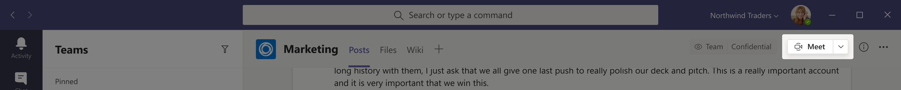
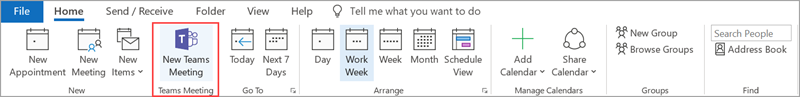
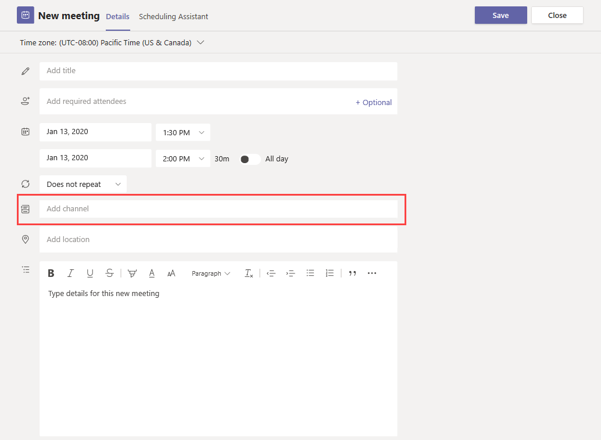
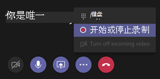
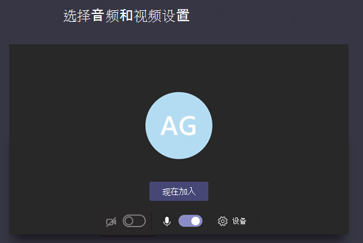

# 管理团队中的会议策略Manage meeting policies in Teams

::: zone target="docs"
会议策略Meeting policies用于控制组织中用户安排的会议的与会者可用的功能。Meeting policies are used to control the features that are available to meeting participants for meetings that are scheduled by users in your organization. 创建策略并进行更改后，即可以将用户分配到策略。After you create a policy and make your changes, you can then assign users to the policy. 可在 Microsoft 团队管理中心或通过使用[PowerShell](teams-powershell-overview.md)管理会议策略。You manage meeting policies in the Microsoft Teams admin center or by using [PowerShell](teams-powershell-overview.md).

你可以通过以下方式实施策略，这会在会议开始之前、会议期间或会议后影响用户的会议体验。You can implement policies in the following ways, which affect the meeting experience for users before a meeting starts, during a meeting, or after a meeting.

|实现类型Implementation type  |说明Description  |
|---------|---------|
|每个组织者Per-organizer    |实施按组织者策略时，所有会议参与者都将继承组织者的策略。When you implement a per-organizer policy, all meeting participants inherit the policy of the organizer. 例如，**自动允许人员**为每个组织者策略，并控制用户是否直接加入会议，或在会议厅中等待分配了该策略的用户安排的会议。For example, **Automatically admit people** is a per-organizer policy and controls whether users join the meeting directly or wait in the lobby for meetings scheduled by the user who is assigned the policy.          |
|每用户Per-user    |当你实现每用户策略时，仅应用每用户策略来限制组织者和/或会议参与者的某些功能。When you implement a per-user policy, only the per-user policy applies to restrict certain features for the organizer and/or meeting participants. 例如，"**允许在频道中立即开会**" 是每用户策略。For example, **Allow Meet now in channels** is a per-user policy.     |
|每个组织者和每用户Per-organizer and per-user     |当你实现每个组织单位和每用户策略的组合时，某些功能将根据其策略和组织者的策略来限制会议参与者。When you implement a combination of a per-organizer and per-user policy, certain features are restricted for meeting participants based on their policy and the organizer's policy. 例如，"**允许云录制**" 是基于每个组织者和每个用户的策略。For example, **Allow cloud recording** is a per-organizer and per-user policy. 启用此设置可允许会议组织者和参与者开始和停止录制。Turn on this setting to allow the meeting organizer and participants to start and stop a recording.

默认情况下，将创建名为 Global 的策略（组织范围的默认设置）。By default, a policy named Global (Org-wide default) is created. 默认情况下，组织中的所有用户都分配有 "全局会议策略"。All users in your organization are assigned the Global meeting policy by default. 你可以对其进行更改或创建一个或多个自定义策略，并向其分配用户。You can either make changes to it or create one or more custom policies and assign users to them. 除非你创建和分配自定义策略，否则用户将获取全局策略。Users will get the Global policy unless you create and assign a custom policy. 创建自定义策略时，你可以允许或阻止你的用户使用某些功能，然后将其分配给将对其应用设置的一个或多个用户。When you create a custom policy, you can allow or prevent certain features from being available to your users, and then assign it to one or more users who will have the settings applied to them.
-注意-会议详细信息按钮将为 availiable 如果用户已启用 audioconference 许可证，或者用户允许 audioconferencing，则不会 availiable 会议详细信息。-Note- Meeting details button will be availiable if a user has the audioconference licenses enabled or the user is allow for audioconferencing, if not, the meeting details will not be availiable
## 更改或创建会议策略Change or create a meeting policy

若要更改或创建会议策略，请转到 Microsoft Teams 管理中心 >“**会议**” > “**会议策略**”。To change or create a meeting policy, go to the Microsoft Teams admin center > **Meetings** > **Meeting policies**. 从列表中选择一个策略，或者选择“**添加**”。Select a policy from the list or select **Add**. 若正在创建新策略，则添加名称和说明。If you're creating a new policy, add a name and description. 名称不能包含特殊字符或超过 64 个字符。The name can't contain special characters or be longer than 64 characters. 选择您的设置，然后选择 "**保存**"。Choose your settings, and then select **Save**.

例如，假设你有一组用户并且你想要限制这组用户的会议所需的带宽量。For example, say you have a bunch of users and you want to limit the amount of bandwidth that their meeting would require. 你要创建新的自定义策略并命名为“带宽限制”，然后禁用以下设置：You would create a new custom policy named "Limited bandwidth" and disable the following settings:

在“音频和视频”中：\*\*\*\*Under **Audio & video**:
- 禁用“允许云录制”。Turn off Allow cloud recording.
- 禁用“允许 IP 视频”。Turn off Allow IP video.

在“内容共享”中：\*\*\*\*Under **Content sharing**:
- 禁用屏幕共享模式。Disable screen sharing mode.
- 禁用“允许白板”。Turn off Allow whiteboard.
- 禁用“允许共享笔记”。Turn off Allow shared notes.

然后将此策略分配给用户。Then assign the policy to the users.

> [!NOTE]
> 一次只能向一个用户分配一个会议策略。A user can be assigned only one meeting policy at a time.

## 将会议策略分配给用户Assign a meeting policy to users

1. 在 Microsoft Teams 管理员中心的左侧导航中，转到“用户”，然后单击相应的用户。\*\*\*\*In the left navigation of the Microsoft Teams admin center, go to **Users**, and then click the user.
2. 单击用户名的左侧以选择用户，然后单击“编辑设置”。\*\*\*\*Select the user by clicking to the left of the user name, and then click **Edit settings**.
3. 在“会议策略”中，选择想要分配的策略，然后单击“应用”。\*\*\*\*\*\*\*\*Under **Meeting policy**, select the policy you want to assign, and then click **Apply**.

若要将策略一次性分配给多个用户，请参阅[批量编辑 Teams 用户设置](edit-user-settings-in-bulk.md)。To assign a policy to multiple users at a time, see [Edit Teams user settings in bulk](edit-user-settings-in-bulk.md).

或者，您也可以执行以下操作：Or, you can also do the following:

1. 在 Microsoft 团队管理中心的左侧导航中，转到 "**会议** > **会议策略**"。In the left navigation of the Microsoft Teams admin center, go to **Meetings** > **Meeting policies**.
2. 单击策略名称的左侧以选择该策略。Select the policy by clicking to the left of the policy name.
3. 选择“管理用户”\*\*\*\*。Select **Manage users**.
4. 在“**管理用户**”窗格中，按显示名称或用户名搜索用户，选择用户名，然后选择“**添加**”。In the **Manage users** pane, search for the user by display name or by user name, select the name, and then select **Add**. 对想要添加的每一个用户重复此步骤。Repeat this step for each user that you want to add.
5. 添加完用户后，选择 "**保存**"。After you finish adding users, select **Save**.

> [!NOTE]
> 如果向用户分配了该策略，则不能删除该策略。You can't delete a policy if users are assigned to it. 必须先为所有受影响的用户分配不同的策略，然后才能删除原始策略。You must first assign a different policy to all affected users, and then you can delete the original policy.

## 会议策略设置Meeting policy settings

在 "**会议策略**" 页面上选择现有策略或选择 "**添加**" 以添加新策略时，可以为以下项配置设置。When you select an existing policy on the **Meeting policies** page or select **Add** to add a new policy, you can configure settings for the following.

- [常规General](#meeting-policy-settings---general)
- [音频 & 视频Audio & video](#meeting-policy-settings---audio--video)
- [内容共享Content sharing](#meeting-policy-settings---content-sharing)
- [参与者 & 来宾Participants & guests](#meeting-policy-settings---participants--guests)

::: zone-end 

## 会议策略设置-常规Meeting policy settings - General

- [允许在频道中立即开会Allow Meet now in channels](#allow-meet-now-in-channels)
- [允许 Outlook 加载项Allow the Outlook add-in](#allow-the-outlook-add-in)
- [允许频道会议安排Allow channel meeting scheduling](#allow-channel-meeting-scheduling)
- [允许安排私人会议Allow scheduling private meetings](#allow-scheduling-private-meetings)

### 允许在频道中立即开会Allow Meet now in channels

这是每用户策略，在会议开始之前应用。This is a per-user policy and applies before a meeting starts. 此设置控制用户是否可以在团队频道中启动临时会议。This setting controls whether a user can start an ad hoc meeting in a Teams channel. 如果启用此操作，当用户在团队频道中发布消息时，用户可以单击 "撰写" 框下的 "**立即开会**" 以在频道中启动临时会议。If you turn this on, when a user posts a message in a Teams channel, the user can click **Meet now** under the compose box to start an ad hoc meeting in the channel.

### 允许 Outlook 加载项Allow the Outlook add-in

这是每用户策略，在会议开始之前应用。This is a per-user policy and applies before a meeting starts. 此设置控制是否可以从 Outlook （Windows、Mac、web 和手机）内安排团队会议。This setting controls whether Teams meetings can be scheduled from within Outlook (Windows, Mac, web, and mobile).

如果关闭此功能，用户在 Outlook 中创建新会议时，无法安排团队会议。If you turn this off, users are unable to schedule Teams meetings when they create a new meeting in Outlook. 例如，在 Windows 上的 Outlook 中，"**新建团队会议**" 选项不会显示在功能区中。For example, in Outlook on Windows, the **New Teams Meeting** option won't show up in the ribbon.

### 允许频道会议安排Allow channel meeting scheduling

这是每用户策略，在会议开始之前应用。This is a per-user policy and applies before a meeting starts. 此设置控制用户是否可以在团队频道中安排会议。This setting controls whether users can schedule a meeting in a Teams channel.  如果关闭此功能，则当用户在团队频道中启动会议，并且为团队中的用户禁用 "**添加频道**" 选项时，"**安排会议**" 选项将不可用。If you turn this off, the **Schedule a meeting** option won't be available to the user when they start a meeting in a Teams channel and the **Add channel** option is disabled for users in Teams.

### 允许安排私人会议Allow scheduling private meetings

这是每用户策略，在会议开始之前应用。This is a per-user policy and applies before a meeting starts. 此设置控制用户是否可以在团队中安排私人会议。This setting controls whether users can schedule private meetings in Teams. 当会议未发布到团队中的频道时，它是私有的。A meeting is private when it's not published to a channel in a team.

请注意，如果关闭 "**允许安排私人会议**" 和 "**允许频道会议计划**"，则会为团队中的用户禁用 "**添加必需与会者**" 和 "**添加频道**" 选项。Note that if you turn off **Allow scheduling private meetings** and **Allow channel meeting scheduling**,  the **Add required attendees** and **Add channel** options are disabled for users in Teams.

## 会议策略设置-音频 & 视频Meeting policy settings - Audio & video

- [允许脚本Allow transcription](#allow-transcription)
- [允许云录制Allow cloud recording](#allow-cloud-recording)
- [允许 IP 视频Allow IP video](#allow-ip-video)
- [媒体比特率（Kps）Media bit rate (Kps)](#media-bit-rate-kps)

### 允许脚本Allow transcription

这是每个组织单位和每用户策略的组合。This is a combination of a per-organizer and per-user policy. 此设置控制播放会议录制期间是否提供字幕和脚本功能。This setting controls whether captions and transcription features are available during playback of meeting recordings. 如果关闭此功能，在播放会议录制的过程中，"**搜索**" 和 **"抄送**" 选项将不可用。If you turn this off, the **Search** and **CC** options won't be available during playback of a meeting recording. 启动录制的人员需要启用此设置，以便录制还包括脚本。The person who started the recording needs this setting turned on so that the recording also includes transcription. 

请注意，当前只有在团队中将语言设置为英语且在会议中朗读英语的用户才支持使用录制的会议。Note that transcription for recorded meetings is currently only supported for users who have the language in Teams set to English and when English is spoken in the meeting.

### 允许云录制Allow cloud recording

这是每个组织单位和每用户策略的组合。This is a combination of a per-organizer and per-user policy. 此设置控制是否可以录制此用户的会议。This setting controls whether this user's meetings can be recorded. 录制可以由会议组织者或其他会议参与者启动（如果为参与者启用了该策略设置，并且他们是来自同一组织的经过身份验证的用户）。The recording can be started by the meeting organizer or by another meeting participant if the policy setting is turned on for the participant and if they're an authenticated user from the same organization.

组织外部的人员（如联盟用户和匿名用户）无法启动录制。People outside your organization, such as federated and anonymous users, can't start the recording. 来宾用户无法启动或停止录制。Guest users can't start or stop the recording. 

我们来看看下面的示例。Let's look at the following example.

|用户User |会议策略Meeting policy  |允许云录制Allow cloud recording |
|---------|---------|---------|
|DanielaDaniela | 全局Global   | FalseFalse |
|AmandaAmanda | Location1MeetingPolicyLocation1MeetingPolicy | TrueTrue|
|John （外部用户）John (external user) | 不适用Not applicable | 不适用Not applicable|

按 Daniela 组织的会议无法录制，并且 Amanda 已启用策略设置，无法录制 Daniela 组织的会议。Meetings organized by Daniela can't be recorded and Amanda, who has the policy setting enabled, can't record meetings organized by Daniela. 可记录由 Amanda 组织的会议，但 Daniela，他们已禁用策略设置，并且 John 是外部用户，无法录制 Amanda 组织的会议。Meetings organized by Amanda can be recorded, however,  Daniela, who has the policy setting disabled and John who is an external user, can't record meetings organized by Amanda.

若要了解有关云会议录制的详细信息，请参阅[团队云会议录制](cloud-recording.md)。To learn more about cloud meeting recording, see [Teams cloud meeting recording](cloud-recording.md).

### 允许 IP 视频Allow IP video

这是每个组织单位和每用户策略的组合。This is a combination of a per-organizer and per-user policy. 视频是会议的关键组件。Video is a key component to meetings. 在某些组织中，管理员可能希望更好地控制哪些用户的会议有视频。In some organizations, admins might want more control over which users' meetings have video. 此设置控制是否可以在用户托管的会议中以及用户开始的1:1 呼叫和组通话中打开视频。This setting controls whether video can be turned on in meetings hosted by a user and in 1:1 calls and group calls started by a user. 已启用此策略的用户组织的会议，如果会议参与者也启用了该策略，则会议参与者允许会议中的视频共享。Meetings organized by a user who has this policy enabled, allow video sharing in the meeting by the meeting participants, if the meeting participants also have the policy enabled. 未分配任何策略的会议参与者（如匿名和联盟参与者）将继承会议组织者的策略。Meeting participants who don't have any policies assigned (for example, anonymous and federated participants) inherit the policy of the meeting organizer.

我们来看看下面的示例。Let's look at the following example.

|用户User |会议策略Meeting policy  |允许 IP 视频Allow IP Video |
|---------|---------|---------|
|DanielaDaniela   | 全局Global   | TrueTrue        |
|AmandaAmanda    | Location1MeetingPolicyLocation1MeetingPolicy        | FalseFalse      |

通过 Daniela 托管的会议允许打开视频。Meetings hosted by Daniela allow video to be turned on. Daniela 可以加入会议并打开视频。Daniela can join the meeting and turn on video. Amanda 无法在 Daniela 的会议中启用视频，因为 Amanda 的策略设置为 "不允许视频"。Amanda can't turn on video in Daniela's meeting because Amanda's policy is set to not allow video. Amanda 可以查看会议中其他参与者共享的视频。Amanda can see videos shared by other participants in the meeting.

在 Amanda 托管的会议中，无论分配给他们的视频策略如何，任何人都无法打开视频。In meetings hosted by Amanda, no one can turn on video, regardless of the video policy assigned to them. 这意味着 Daniela 无法在 Amanda 的会议中打开视频。This means Daniela can't turn on video in Amanda's meetings.  

如果 Daniela 通过视频 Amanda 调用，Amanda 只能通过音频应答呼叫。If Daniela calls Amanda with video on, Amanda can answer the call with audio only.  当呼叫连接时，Amanda 可以看到 Daniela 的视频，但无法打开视频。When the call is connected, Amanda can see Daniela's video, but can't turn on video. 如果 Amanda 呼叫 Daniela，Daniela 可以通过视频和音频接听呼叫。If Amanda calls Daniela, Daniela can answer the call with video and audio. 通话接通后，Daniela 可以根据需要打开或关闭她的视频。When the call is connected, Daniela can turn on or turn off her video, as needed.

### 媒体比特率（Kps）Media bit rate (Kps)

这是每个用户的策略。This is a per-user policy. 此设置确定用户的通话和会议中音频、视频和基于视频的应用共享传输的媒体比特率。This setting determines the media bit rate for audio, video, and video-based app sharing transmissions in calls and meetings for the user. 它同时应用于呼叫或会议中用户的上行媒体和下行媒体遍历。It's applied to both the uplink and downlink media traversal for users in the call or meeting. 此设置使你能够更细致地控制组织中的带宽管理。This setting gives you granular control over managing bandwidth in your organization. 根据用户所需的会议方案，我们建议有足够的带宽来实现优质体验。Depending on the meetings scenarios required by users, we recommend having enough bandwidth in place for a good quality experience. 最小值为30个 Kps，最大值取决于会议方案。The minimum value is 30 Kps and the maximum value depends on the meeting scenario. 若要了解更多有关建议的最小带宽以供团队的优质会议、通话和实时活动，请参阅[带宽要求](prepare-network.md#bandwidth-requirements)。To learn more about the minimum recommended bandwidth for good quality meetings, calls, and live events in Teams, see [Bandwidth requirements](prepare-network.md#bandwidth-requirements).

如果会议带宽不足，参与者会看到指示网络质量不佳的消息。If there isn't enough bandwidth for a meeting, participants see a message that indicates poor network quality.

对于需要最高质量视频体验的会议（如 CEO 董事会会议和团队现场活动），我们建议您将带宽设置为 10 Mbps。For meetings that need the highest quality video experience, such as CEO board meetings and Teams live events, we recommend you set the bandwidth to 10 Mbps. 即使设置了最大体验，团队媒体堆栈也会在检测到某些网络条件时适应低带宽条件，具体取决于方案。Even when the maximum experience is set, the Teams media stack adapts to low bandwidth conditions when certain network conditions are detected, depending on the scenario. 

## 会议策略设置-内容共享Meeting policy settings - Content sharing

- [屏幕共享模式Screen sharing mode](#screen-sharing-mode)
- [允许参与者授予或请求控制Allow a participant to give or request control](#allow-a-participant-to-give-or-request-control)
- [允许外部参与者授予或请求控制Allow an external participant to give or request control](#allow-an-external-participant-to-give-or-request-control)
- [允许 PowerPoint 共享Allow PowerPoint sharing](#allow-powerpoint-sharing)
- [允许白板Allow whiteboard](#allow-whiteboard)
- [允许共享笔记Allow shared notes](#allow-shared-notes)

### 屏幕共享模式Screen sharing mode

这是每个组织单位和每用户策略的组合。This is a combination of a per-organizer and per-user policy. 此设置控制是否允许在用户的会议中共享桌面和/或窗口共享。This setting controls whether desktop and/or window sharing is allowed in the user's meeting. 未分配任何策略的会议参与者（如匿名、来宾、B2B 和联盟参与者）将继承会议组织者的策略。Meeting participants who don't have any policies assigned (for example, anonymous, guest, B2B, and federated participants) inherit the policy of the meeting organizer.

|设置值Setting value |行为Behavior  |
|---------|---------|
|**整个屏幕****Entire screen**    | 会议中允许进行完整的桌面共享和应用程序共享Full desktop sharing and application sharing is allowed in the meeting |
|**单应用程序****Single application**   | 允许在会议中共享应用程序Application sharing is allowed in the meeting        |
|**已禁用****Disabled**     |会议中已关闭屏幕共享和应用程序共享。Screen sharing and application sharing turned off in the meeting.       |

我们来看看下面的示例。Let's look at the following example.

|用户User |会议策略Meeting policy |屏幕共享模式Screen sharing mode |
|---------|---------|---------|
|DanielaDaniela  | 全局Global   | 整个屏幕Entire screen |
|AmandaAmanda   | Location1MeetingPolicyLocation1MeetingPolicy  | 已禁用Disabled |

由 Daniela 托管的会议允许会议参与者共享其整个屏幕或特定应用程序。Meetings hosted by Daniela allow meeting participants to share their entire screen or a specific application. 如果 Amanda 加入 Daniela 的会议，Amanda 无法共享她的屏幕或特定应用程序，因为她的策略设置已被禁用。If Amanda joins Daniela's meeting, Amanda can't share her screen or a specific application as her policy setting is disabled. 在 Amanda 托管的会议中，不允许任何人共享其屏幕或单个应用程序，而不管分配给他们的屏幕共享模式策略如何。In meetings hosted by Amanda, no one is allowed to share their screen or a single application, regardless of the screen sharing mode policy assigned to them. 这意味着 Daniela 不能在 Amanda 的会议中共享她的屏幕或单个应用程序。This means that Daniela can't share her screen or a single application in Amanda's meetings.  

当前，如果用户使用的是 Google Chrome，则用户无法在团队会议中播放视频或共享其屏幕。Currently, users can't play video or share their screen in a Teams meeting if they're using Google Chrome.

### 允许参与者授予或请求控制Allow a participant to give or request control

这是每个用户的策略。This is a per-user policy. 此设置控制用户是否可以将共享桌面或窗口的控制权授予其他会议参与者。This setting controls whether the user can give control of the shared desktop or window to other meeting participants. 若要赋予控制权，请将鼠标悬停在屏幕顶部。To give control, hover over the top of the screen. 

如果为用户启用此设置，则 "**授予控制权**" 选项显示在共享会话的顶部栏中。If this setting is turned on for the user, the **Give Control** option is displayed in the top bar in a sharing session. 

如果用户的设置处于关闭状态，则 "**提供控制**" 选项不可用。If the settings is turned off for the user, the **Give Control** option isn't available.

我们来看看下面的示例。Let's look at the following example.

|用户User |会议策略Meeting policy  |允许参与者授予或请求控制Allow participant to give or request control |
|---------|---------|---------|
|DanielaDaniela   | 全局Global   | TrueTrue       |
|BabekBabek    | Location1MeetingPolicyLocation1MeetingPolicy        | FalseFalse   |

Daniela 可以将共享桌面或窗口的控制权交给 Babek 组织的会议中的其他参与者，Babek 无法将控制权授予其他参与者。Daniela can give control of the shared desktop or window to other participants in a meeting organized by Babek whereas Babek can't give control to other participants.

若要使用 PowerShell 控制哪些人可以授予控制请求或接受控制请求，请使用 AllowParticipantGiveRequestControl cmdlet。To use PowerShell to control who can give control or accept requests for control, use the AllowParticipantGiveRequestControl cmdlet.

> [!NOTE]
> 若要在共享期间提供和控制共享内容，双方都必须使用团队桌面客户端。To give and take control of shared content during sharing, both parties must be using the Teams desktop client. 如果任何一方在浏览器中运行 Teams，则不支持控制。Control isn't supported when either party is running Teams in a browser. 这是由我们计划修复的一个技术限制造成。This is due to a technical limitation that we're planning to fix. 

### 允许外部参与者授予或请求控制Allow an external participant to give or request control

这是每个用户的策略。This is a per-user policy. 此设置控制会议中的外部参与者是否可以将其共享桌面或窗口的控制权交给会议中的其他参与者。This setting controls whether external participants in a meeting can give control of their shared desktop or window to other participants in the meeting. 团队会议中的外部参与者可以按如下方式进行分类：External participants in Teams meetings can be categorized as follows:  

- 匿名用户Anonymous user
- 来宾用户Guest users  
- B2B 用户B2B user
- 联合用户Federated user  

联盟用户是否可以向外部用户授予控制权，同时共享受允许外部参与者在其组织中**授予或请求控制**设置的控制。Whether federated users can give control to external users while sharing is controlled by the **Allow an external participant to give or request control** setting in their organization.

若要使用 PowerShell 控制外部参与者是否可以授予控制或接受控制请求，请使用 AllowExternalParticipantGiveRequestControl cmdlet。To use PowerShell to control whether external participants can give control or accept requests for control, use the AllowExternalParticipantGiveRequestControl cmdlet.

### 允许 PowerPoint 共享Allow PowerPoint sharing

这是每个用户的策略。This is a per-user policy. 此设置控制用户是否可以在会议中共享 PowerPoint 幻灯片放映。This setting controls whether the user can share PowerPoint slide decks in a meeting. 外部用户（包括匿名用户、来宾和联盟用户）继承会议组织者的策略。External users, including anonymous, guest, and federated users, inherit the policy of the meeting organizer.

我们来看看下面的示例。Let's look at the following example.

|用户User |会议策略Meeting policy  |允许 PowerPoint 共享Allow PowerPoint sharing |
|---------|---------|---------|
|DanielaDaniela   | 全局Global   | TrueTrue       |
|AmandaAmanda   | Location1MeetingPolicyLocation1MeetingPolicy        | FalseFalse   |

Amanda 不能在会议中共享 PowerPoint 幻灯片卡座，即使她是会议组织者也是如此。Amanda can't share PowerPoint slide decks in meetings even if she's the meeting organizer. Daniela 可以共享 PowerPoint 幻灯片放映，即使会议由 Amanda 组织。Daniela can share PowerPoint slide decks even if the meeting is organized by Amanda. Amanda 可以查看会议中其他人共享的 PowerPoint 幻灯片卡座，即使她无法共享 PowerPoint 幻灯片放映。Amanda can view the PowerPoint slide decks shared by others in the meeting, even though she can't share PowerPoint slide decks.

### 允许白板Allow whiteboard

这是每个用户的策略。This is a per-user policy. 此设置控制用户是否可以在会议中共享白板。This setting controls whether a user can share the whiteboard in a meeting. 外部用户（包括匿名用户、B2B 和联盟用户）继承会议组织者的策略。External users, including anonymous, B2B, and federated users, inherit the policy of the meeting organizer. 

我们来看看下面的示例。Let's look at the following example.

|用户User |会议策略Meeting policy  |允许白板Allow whiteboard|
|---------|---------|---------|
|DanielaDaniela   | 全局Global   | TrueTrue       |
|AmandaAmanda   | Location1MeetingPolicyLocation1MeetingPolicy        | FalseFalse   |

Amanda 无法在会议中共享白板，即使她是会议组织者也是如此。Amanda can't share the whiteboard in a meeting even if she's the meeting organizer. 即使会议是按 Amanda 组织的，Daniela 也可以共享白板。Daniela can share the whiteboard even if a meeting is organized by Amanda.  

### 允许共享笔记Allow shared notes

这是每个用户的策略。This is a per-user policy. 此设置控制用户是否可以在会议中创建和共享笔记。This setting controls whether a user can create and share notes in a meeting. 外部用户（包括匿名用户、B2B 和联盟用户）继承会议组织者的策略。External users, including anonymous, B2B, and federated users, inherit the policy of the meeting organizer. "**会议笔记**" 选项卡目前仅在具有少于20个参与者的会议中受支持。The **Meeting Notes** tab is currently only supported in meetings that have less than 20 participants.

我们来看看下面的示例。Let's look at the following example.

|用户User |会议策略Meeting policy  |允许共享笔记Allow shared notes |
|---------|---------|---------|
|DanielaDaniela   | 全局Global   | TrueTrue       |
|AmandaAmanda   | Location1MeetingPolicyLocation1MeetingPolicy | FalseFalse |

Daniela 可以在 Amanda 的会议中做笔记，Amanda 不能在任何会议中做笔记。Daniela can take notes in Amanda's meetings and Amanda can't take notes in any meetings.

## 会议策略设置-参与者 & 来宾Meeting policy settings - Participants & guests

这些设置控制在会议厅中等待的会议参与者，以及他们在会议中允许的参与级别。These settings control which meeting participants wait in the lobby before they are admitted to the meeting and the level of participation they are allowed in a meeting.

- [让匿名人员开始会议Let anonymous people start a meeting](#let-anonymous-people-start-a-meeting)
- [自动允许人员Automatically admit people](#automatically-admit-people)
- [允许拨入用户绕过大厅Allow dial-in users to bypass the lobby](#allow-dial-in-users-to-bypass-the-lobby)
- [允许在私人会议中立即开会Allow Meet now in private meetings](#allow-meet-now-in-private-meetings)
- [启用实时字幕Enable live captions ](#enable-live-captions)
- [允许在会议中聊天Allow chat in meetings ](#allow-chat-in-meetings)

> [!NOTE]
>用于加入会议的选项会有所不同，具体取决于每个团队组的设置和连接方法。Options to join a meeting will vary, depending on the settings for each Teams group, and the connection method. 如果你的组具有音频会议，并使用它进行连接，请参阅[Office 365 中的音频会议](https://docs.microsoft.com/microsoftteams/audio-conferencing-in-office-365)。If your group has audio conferencing, and uses it to connect, see [Audio Conferencing in Office 365](https://docs.microsoft.com/microsoftteams/audio-conferencing-in-office-365). 如果你的团队组没有音频会议，请参阅[在团队中加入会议](https://support.office.com/article/join-a-meeting-in-teams-1613bb53-f3fa-431e-85a9-d6a91e3468c9)。If your Teams group does not have audio conferencing, refer to [Join a meeting in Teams](https://support.office.com/article/join-a-meeting-in-teams-1613bb53-f3fa-431e-85a9-d6a91e3468c9).

### 让匿名人员开始会议Let anonymous people start a meeting

这是每个组织者的策略。This is a per-organizer policy. 此设置控制匿名人员（包括 B2B）和联盟用户是否可以在没有经过身份验证的组织中加入用户的会议。This setting controls whether anonymous people, including B2B, and federated users, can join the user's meeting without an authenticated user from the organization in attendance. 

下面是在会议中提供了身份验证用户时匿名用户的加入行为。Here's the join behavior of anonymous people when authenticated users are present in the meeting.

|让匿名人员开始会议Let anonymous people start a meeting  |自动允许人员Automatically admit people |匿名人员的加入行为Join behavior of anonymous people |
|---------|---------|---------|
|TrueTrue    | 所有人Everyone      | 直接加入Join directly         |
|   | 您的组织中的每个人Everyone in your organization       | 在大厅中等待Wait in lobby        |
|   | 组织和联盟组织中的每个人Everyone in your organization and federated organizations       | 在大厅中等待Wait in lobby         |
|FalseFalse    | 所有人Everyone        | 直接加入Join directly        |
|   | 您的组织中的每个人Everyone in your organization     | 在大厅中等待Wait in lobby        |
|   | 组织和联盟组织中的每个人Everyone in your organization and federated organizations      | 在大厅中等待Wait in lobby         |

下面是当会议中没有经过身份验证的用户时匿名用户的加入行为。Here's the join behavior of anonymous people when no authenticated users are present in the meeting.

|让匿名人员开始会议Let anonymous people start a meeting |自动允许人员Automatically admit people  |匿名人员的加入行为Join behavior of anonymous people |
|---------|---------|---------|
|TrueTrue    | 所有人Everyone      | 直接加入Join directly         |
|   | 您的组织中的每个人Everyone in your organization       | 在大厅中等待Wait in lobby        |
|   | 组织和联盟组织中的每个人Everyone in your organization and federated organizations       | 在大厅中等待Wait in lobby         |
|FalseFalse    | 所有人Everyone        | 在大厅中等待。Wait in lobby. 当第一个经过身份验证的用户加入会议时，将自动向用户提供许可。Users are automatically admitted when the first authenticated user joins the meeting.        |
|   | 您的组织中的每个人Everyone in your organization     |在大厅中等待Wait in lobby         |
|   | 组织和联盟组织中的每个人Everyone in your organization and federated organizations      | 在大厅中等待Wait in lobby         |

### 自动允许人员Automatically admit people

这是每个组织者的策略。This is a per-organizer policy. 此设置控制用户是否直接加入会议或在大厅中等待，直到他们被经过身份验证的用户许可。This setting controls whether people join a meeting directly or wait in the lobby until they are admitted by an authenticated user.

 会议组织者可以单击会议邀请中的 "**会议选项**"，为其计划的每个会议更改此设置。Meeting organizers can click **Meeting Options** in the meeting invitation to change this setting for each meeting they schedule.
  
|设置值Setting value  |联接行为Join behavior |
|---------|---------|
|**所有人****Everyone**   |所有会议参与者都直接加入会议，而无需在大厅中等待。All meeting participants join the meeting directly without waiting in the lobby. 这包括经过身份验证的用户、联盟用户、来宾、匿名用户和通过电话拨入的用户。This includes authenticated users, federated users, guests, anonymous users, and people who dial in by phone.       |
|**组织和联盟组织中的每个人****Everyone in your organization and federated organizations**     |组织内的经过身份验证的用户，包括来宾用户和联盟组织中的用户，直接加入会议，而无需在大厅中等待。Authenticated users within the organization, including guest users and the users from federated organizations, join the meeting directly without waiting in the lobby.  通过电话拨入的匿名用户和用户在大厅中等待。Anonymous users and users who dial in by phone wait in the lobby.   |
|**您的组织中的每个人****Everyone in your organization**    |来自组织内部的经过身份验证的用户（包括来宾用户）直接加入会议，而无需在大厅中等待。Authenticated users from within the organization, including guest users, join the meeting directly without waiting in the lobby.  联合用户、匿名用户和通过电话拨入的用户在大厅中等待。Federated users, anonymous users, and users who dial in by phone wait in the lobby.           |

### 允许拨入用户绕过大厅Allow dial-in users to bypass the lobby

这是每个组织者的策略。This is a per-organizer policy. 此设置控制通过电话拨入的用户是否直接加入会议或在会议厅中等待，而不管 "是否**自动允许人员**" 设置。This setting controls whether people who dial in by phone join the meeting directly or wait in the lobby regardless of the **Automatically admit people** setting.

下面是通过电话拨入的用户的加入行为。Here's the join behavior of people who dial in by phone.

|允许拨入用户绕过大厅Allow dial-in users to bypass the lobby  |自动允许人员Automatically admit people  |拨入的用户的加入行为Join behavior of people who dial in |
|---------|---------|---------|
|TrueTrue    | 所有人Everyone      | 直接加入Join directly         |
|   | 您的组织中的每个人Everyone in your organization       | 直接加入Join directly        |
|   | 组织和联盟组织中的每个人Everyone in your organization and federated organizations       | 直接加入Join directly         |
|FalseFalse    | 所有人Everyone        | 直接加入Join directly        |
|   | 您的组织中的每个人Everyone in your organization     |在大厅中等待Wait in lobby         |
|   | 组织和联盟组织中的每个人Everyone in your organization and federated organizations      | 在大厅中等待Wait in lobby         |

### 允许在私人会议中立即开会Allow Meet now in private meetings

这是每用户策略，在会议开始之前应用。This is a per-user policy and applies before a meeting starts. 此设置控制用户是否可以启动 ad hoc 私人会议。This setting controls whether a user can start an ad hoc private meeting. 

### 启用实时字幕Enable live captions

这是每用户策略，在会议期间应用。This is a per-user policy and applies during a meeting. 此设置控制用户是否可以使用 "**打开实时标题**" 选项来打开和关闭用户出席的会议中的实时字幕。This setting controls whether the **Turn on live captions** option is available for the user to turn on and turn off live captions in meetings that the user attends.  

|设置值Setting value |行为Behavior  |
|---------|---------|
|**已禁用，但组织者可以替代****Disabled but the organizer can override**     | 会议期间不会为用户自动打开实时字幕。Live captions aren't automatically turned on for the user during a meeting. 用户可以在 "溢出（**...**）" 菜单中看到 "**打开实时标题**" 选项以将其打开。The user sees the **Turn on live captions** option in the overflow (**...**) menu to turn them on. 这是默认设置。This is the default setting. |
|**已禁用****Disabled**     | 会议期间，用户已禁用实时字幕。Live captions are disabled for the user during a meeting. 用户不能选择将其打开。The user doesn't have the option to turn them on.          |

### 允许在会议中聊天Allow chat in meetings

这是每个组织者的策略。This is a per-organizer policy. 此设置控制是否允许在用户的会议中使用会议聊天。This setting controls whether meeting chat is allowed in the user's meeting.

## 相关主题Related topics

[团队中的消息传递策略Messaging policies in Teams](messaging-policies-in-teams.md)
