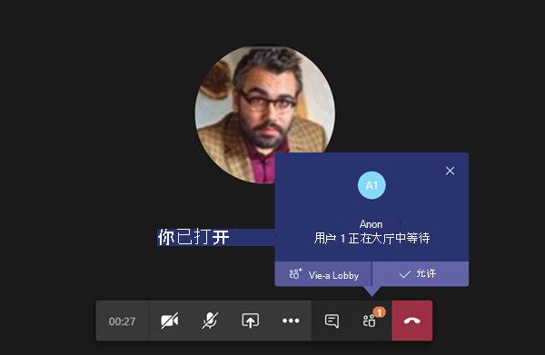
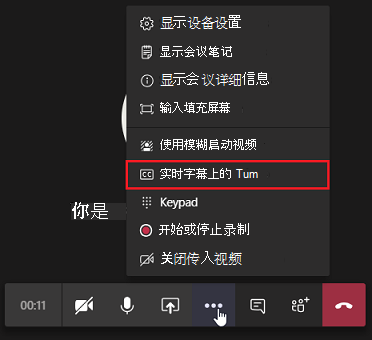

# 管理团队中的会议策略

::: zone target="docs"
会议策略Meeting policies用于控制组织中用户安排的会议的与会者可用的功能。 你可以使用自动创建或创建和分配自定义策略的全局 (组织范围默认) 策略。 可在 Microsoft 团队管理中心或通过使用 [PowerShell](teams-powershell-overview.md)管理会议策略。

> [!NOTE]
> 有关使用角色管理会议演示者和与会者的权限的信息，请参阅 [团队会议中的角色](https://support.microsoft.com/office/roles-in-a-teams-meeting-c16fa7d0-1666-4dde-8686-0a0bfe16e019?ui=en-us&rs=en-us&ad=us)。

你可以通过以下方式实施策略，这会在会议开始之前、会议期间或会议后影响用户的会议体验。

|实现类型  |说明  |
|---------|---------|
|每个组织者    |实施按组织者策略时，所有会议参与者都将继承组织者的策略。 例如， **自动允许人员** 为每个组织者策略，并控制用户是否直接加入会议，或在会议厅中等待分配了该策略的用户安排的会议。          |
|每用户    |当你实现每用户策略时，仅应用每用户策略来限制组织者和/或会议参与者的某些功能。 例如，" **允许在频道中立即开会** " 是每用户策略。     |
|每个组织者和每用户     |当你实现每个组织单位和每用户策略的组合时，某些功能将根据其策略和组织者的策略来限制会议参与者。 例如，" **允许云录制** " 是基于每个组织者和每个用户的策略。 启用此设置可允许会议组织者和参与者开始和停止录制。

你可以编辑全局策略中的设置，或者创建并分配一个或多个自定义策略。 除非你创建和分配自定义策略，否则用户将获取全局策略。

> [!NOTE]
> "会议详细信息" 按钮在用户启用音频会议许可证或用户允许音频会议的情况下可用时，会议详细信息将不可用。

## 创建自定义会议策略

1. 在 Microsoft 团队管理中心的左侧导航中，转到 "**会议**  >  **会议策略**"。
2. 单击“添加”****。
3. 输入策略的名称和说明。 名称不能包含特殊字符或超过 64 个字符。
4. 选择所需的设置。
5. 单击“**保存**”。

例如，假设你有一组用户并且你想要限制这组用户的会议所需的带宽量。 你要创建新的自定义策略并命名为“带宽限制”，然后禁用以下设置：

在“音频和视频”中：****

- 禁用“允许云录制”。
- 禁用“允许 IP 视频”。

在“内容共享”中：****

- 禁用屏幕共享模式。
- 禁用“允许白板”。
- 禁用“允许共享笔记”。

然后将此策略分配给用户。

## 编辑会议策略

你可以编辑全局策略和你创建的任何自定义策略。

1. 在 Microsoft 团队管理中心的左侧导航中，转到 "**会议**  >  **会议策略**"。
2. 通过单击策略名称左侧，然后单击 " **编辑**"，选择策略。
3. 在此处进行所需的更改。
4. 单击“**保存**”。

> [!NOTE]
> 一次只能向一个用户分配一个会议策略。

## 将会议策略分配给用户

[!INCLUDE [assign-policy](includes/assign-policy.md)]

> [!NOTE]
> 如果向用户分配了该策略，则不能删除该策略。 必须先为所有受影响的用户分配不同的策略，然后才能删除原始策略。

## 会议策略设置

在 " **会议策略** " 页面上选择现有策略或选择 " **添加** " 以添加新策略时，可以为以下项配置设置。

- [常规](#meeting-policy-settings---general)
- [音频 & 视频](#meeting-policy-settings---audio--video)
- [内容共享](#meeting-policy-settings---content-sharing)
- [参与者 & 来宾](#meeting-policy-settings---participants--guests)

::: zone-end

## 会议策略设置-常规

- [允许在频道中立即开会](#allow-meet-now-in-channels)
- [允许 Outlook 加载项](#allow-the-outlook-add-in)
- [允许频道会议安排](#allow-channel-meeting-scheduling)
- [允许安排私人会议](#allow-scheduling-private-meetings)
- [允许在私人会议中立即开会](#allow-meet-now-in-private-meetings)

### 允许在频道中立即开会

这是每用户策略，在会议开始之前应用。 此设置控制用户是否可以在团队频道中启动临时会议。 如果启用此操作，当用户在团队频道中发布消息时，用户可以单击 "撰写" 框下的 " **立即开会** " 以在频道中启动临时会议。 默认值为 True。

[ 下方的 "立即开会" 图标的屏幕截图](media/meeting-policies-meet-now.png#lightbox)

### 允许 Outlook 加载项

这是每用户策略，在会议开始之前应用。 此设置控制是否可以在 Outlook (Windows、Mac、web 和移动) 中安排团队会议。

如果关闭此功能，用户在 Outlook 中创建新会议时，无法安排团队会议。 例如，在 Windows 上的 Outlook 中，" **新建团队会议** " 选项不会显示在功能区中。

### 允许频道会议安排

使用现有的 AllowChannelMeetingScheduling 策略控制可在团队频道日历上创建的事件类型。 这是每用户策略，在会议开始之前应用。 此设置控制用户是否可以在团队频道中安排会议。 默认值为 True。

如果此策略已关闭，用户将无法创建新的频道会议。 但是，现有频道会议可由事件的组织者编辑。

安排会议将被禁用。

频道选择已禁用。

在 "频道发布" 页面中，将禁用以下内容：

- "频道答复撰写" 框中的 "**安排会议**" 按钮。
  
  
- "在频道标题上**安排会议**" 按钮。
  

在频道日历中：

- 将禁用频道日历标题上的 "**添加新事件**" 按钮。
  

- 用户将无法在频道日历上拖动和选择时间段以创建渠道会议。

- 用户无法使用键盘快捷方式在频道日历上创建会议。

在管理中心：

"频道日历" 应用将显示在权限策略的 "管理员" 面板中的 " **Microsoft 应用** " 部分下方。

### 允许安排私人会议

这是每用户策略，在会议开始之前应用。 此设置控制用户是否可以在团队中安排私人会议。 当会议未发布到团队中的频道时，它是私有的。

请注意，如果关闭 " **允许安排私人会议** " 和 " **允许频道会议计划**"，则会为团队中的用户禁用 " **添加必需与会者** " 和 " **添加频道** " 选项。 默认值为 True。

### 允许在私人会议中立即开会

这是每用户策略，在会议开始之前应用。 此设置控制用户是否可以启动 ad hoc 私人会议。  默认值为 True。

## 会议策略设置-音频 & 视频

- [允许脚本](#allow-transcription)
- [允许云录制](#allow-cloud-recording)
- [允许 IP 视频](#allow-ip-video)
- [媒体比特率 (Kbs) ](#media-bit-rate-kbs)

### 允许脚本

这是每个组织单位和每用户策略的组合。 此设置控制播放会议录制期间是否提供字幕和脚本功能。 如果关闭此功能，在播放会议录制的过程中，" **搜索** " 和 **"抄送** " 选项将不可用。 启动录制的人员需要启用此设置，以便录制还包括脚本。

请注意，当前只有在团队中将语言设置为英语且在会议中朗读英语的用户才支持使用录制的会议。

### 允许云录制

这是每个组织单位和每用户策略的组合。 此设置控制是否可以录制此用户的会议。 录制可以由会议组织者或其他会议参与者启动（如果为参与者启用了该策略设置，并且他们是来自同一组织的经过身份验证的用户）。

组织外部的人员（如联盟用户和匿名用户）无法启动录制。 来宾用户无法启动或停止录制。

我们来看看下面的示例。

|用户 |会议策略  |允许云录制 |
|---------|---------|---------|
|Daniela | 全局   | False |
|Amanda | Location1MeetingPolicy | True|
|John (外部用户)  | 不适用 | 不适用|

按 Daniela 组织的会议无法录制，并且 Amanda 已启用策略设置，无法录制 Daniela 组织的会议。 可记录由 Amanda 组织的会议，但 Daniela，他们已禁用策略设置，并且 John 是外部用户，无法录制 Amanda 组织的会议。

若要了解有关云会议录制的详细信息，请参阅 [团队云会议录制](cloud-recording.md)。

### 允许 IP 视频

这是每个组织单位和每用户策略的组合。 视频是会议的关键组件。 在某些组织中，管理员可能希望更好地控制哪些用户的会议有视频。 此设置控制是否可以在用户托管的会议中以及用户开始的1:1 呼叫和组通话中打开视频。 已启用此策略的用户组织的会议，如果会议参与者也启用了该策略，则会议参与者允许会议中的视频共享。 未分配任何策略的会议参与者 (例如，匿名参与者和联盟参与者) 继承会议组织者的策略。

我们来看看下面的示例。

|用户 |会议策略  |允许 IP 视频 |
|---------|---------|---------|
|Daniela   | 全局   | True        |
|Amanda    | Location1MeetingPolicy        | False      |

通过 Daniela 托管的会议允许打开视频。 Daniela 可以加入会议并打开视频。 Amanda 无法在 Daniela 的会议中启用视频，因为 Amanda 的策略设置为 "不允许视频"。 Amanda 可以查看会议中其他参与者共享的视频。

在 Amanda 托管的会议中，无论分配给他们的视频策略如何，任何人都无法打开视频。 这意味着 Daniela 无法在 Amanda 的会议中打开视频。  

如果 Daniela 通过视频 Amanda 调用，Amanda 只能通过音频应答呼叫。  当呼叫连接时，Amanda 可以看到 Daniela 的视频，但无法打开视频。 如果 Amanda 呼叫 Daniela，Daniela 可以通过视频和音频接听呼叫。 通话接通后，Daniela 可以根据需要打开或关闭她的视频。

### 媒体比特率 (Kbs) 

这是每个用户的策略。 此设置确定用户的通话和会议中音频、视频和基于视频的应用共享传输的媒体比特率。 它同时应用于呼叫或会议中用户的上行媒体和下行媒体遍历。 此设置使你能够更细致地控制组织中的带宽管理。 根据用户所需的会议方案，我们建议有足够的带宽来实现优质体验。 最小值为 30 Kbps，最大值取决于会议方案。 若要了解更多有关建议的最小带宽以供团队的优质会议、通话和实时活动，请参阅 [带宽要求](prepare-network.md#bandwidth-requirements)。

如果会议带宽不足，参与者会看到指示网络质量不佳的消息。

对于需要高质量视频体验的会议（如 CEO 董事会会议和团队现场活动），建议将带宽设置为 10 Mbps。 即使设置了最大体验，团队媒体堆栈也会在检测到某些网络条件时适应低带宽条件，具体取决于方案。

## 会议策略设置-内容共享

- [屏幕共享模式](#screen-sharing-mode)
- [允许参与者授予或请求控制](#allow-a-participant-to-give-or-request-control)
- [允许外部参与者授予或请求控制](#allow-an-external-participant-to-give-or-request-control)
- [允许 PowerPoint 共享](#allow-powerpoint-sharing)
- [允许白板](#allow-whiteboard)
- [允许共享笔记](#allow-shared-notes)

### 屏幕共享模式

这是每个组织单位和每用户策略的组合。 此设置控制是否允许在用户的会议中共享桌面和/或窗口共享。 未分配任何策略的会议参与者 (例如，匿名、来宾、B2B 和联盟参与者) 继承会议组织者的策略。

|设置值 |行为  |
|---------|---------|
|**整个屏幕**    | 会议中允许进行完整的桌面共享和应用程序共享 |
|**单应用程序**   | 允许在会议中共享应用程序        |
|**已禁用**     |会议中已关闭屏幕共享和应用程序共享。       |

我们来看看下面的示例。

|用户 |会议策略 |屏幕共享模式 |
|---------|---------|---------|
|Daniela  | 全局   | 整个屏幕 |
|Amanda   | Location1MeetingPolicy  | 已禁用 |

由 Daniela 托管的会议允许会议参与者共享其整个屏幕或特定应用程序。 如果 Amanda 加入 Daniela 的会议，Amanda 无法共享她的屏幕或特定应用程序，因为她的策略设置已被禁用。 在 Amanda 托管的会议中，不允许任何人共享其屏幕或单个应用程序，而不管分配给他们的屏幕共享模式策略如何。 这意味着 Daniela 不能在 Amanda 的会议中共享她的屏幕或单个应用程序。  

当前，如果用户使用的是 Google Chrome，则用户无法在团队会议中播放视频或共享其屏幕。

### 允许参与者授予或请求控制

这是每个用户的策略。 此设置控制用户是否可以将共享桌面或窗口的控制权授予其他会议参与者。 若要赋予控制权，请将鼠标悬停在屏幕顶部。

如果为用户启用此设置，则 " **授予控制权** " 选项显示在共享会话的顶部栏中。

如果用户的设置处于关闭状态，则 " **提供控制** " 选项不可用。

我们来看看下面的示例。

|用户 |会议策略  |允许参与者授予或请求控制 |
|---------|---------|---------|
|Daniela   | 全局   | True       |
|Babek    | Location1MeetingPolicy        | False   |

Daniela 可以将共享桌面或窗口的控制权交给 Babek 组织的会议中的其他参与者，Babek 无法将控制权授予其他参与者。

若要使用 PowerShell 控制哪些人可以授予控制请求或接受控制请求，请使用 AllowParticipantGiveRequestControl cmdlet。

> [!NOTE]
> 若要在共享期间提供和控制共享内容，双方都必须使用团队桌面客户端。 如果任何一方在浏览器中运行 Teams，则不支持控制。 这是由我们计划修复的一个技术限制造成。

### 允许外部参与者授予或请求控制

这是每个用户的策略。 组织是否为用户设置此集不会控制外部参与者可以执行的操作，无论会议组织者已设置了哪些内容。 此参数控制是否可以向外部参与者提供控制或请求控制共享者的屏幕，具体取决于共享者在其组织的会议策略中设置的内容。 团队会议中的外部参与者可以按如下方式进行分类：  

- 匿名用户
- 来宾用户  
- B2B 用户
- 联合用户  

联盟用户是否可以向外部用户授予控制权，同时共享受允许外部参与者在其组织中 **授予或请求控制** 设置的控制。

若要使用 PowerShell 控制外部参与者是否可以授予控制或接受控制请求，请使用 AllowExternalParticipantGiveRequestControl cmdlet。

### 允许 PowerPoint 共享

这是每个用户的策略。 此设置控制用户是否可以在会议中共享 PowerPoint 幻灯片放映。 外部用户（包括匿名用户、来宾和联盟用户）继承会议组织者的策略。

我们来看看下面的示例。

|用户 |会议策略  |允许 PowerPoint 共享 |
|---------|---------|---------|
|Daniela   | 全局   | True       |
|Amanda   | Location1MeetingPolicy        | False   |

Amanda 不能在会议中共享 PowerPoint 幻灯片卡座，即使她是会议组织者也是如此。 Daniela 可以共享 PowerPoint 幻灯片放映，即使会议由 Amanda 组织。 Amanda 可以查看会议中其他人共享的 PowerPoint 幻灯片卡座，即使她无法共享 PowerPoint 幻灯片放映。

### 允许白板

这是每个用户的策略。 此设置控制用户是否可以在会议中共享白板。 外部用户（包括匿名用户、B2B 和联盟用户）继承会议组织者的策略。

我们来看看下面的示例。

|用户 |会议策略  |允许白板|
|---------|---------|---------|
|Daniela   | 全局   | True       |
|Amanda   | Location1MeetingPolicy        | False   |

Amanda 无法在会议中共享白板，即使她是会议组织者也是如此。 即使会议是按 Amanda 组织的，Daniela 也可以共享白板。  

### 允许共享笔记

这是每个用户的策略。 此设置控制用户是否可以在会议中创建和共享笔记。 外部用户（包括匿名用户、B2B 和联盟用户）继承会议组织者的策略。 " **会议笔记** " 选项卡目前仅在具有少于20个参与者的会议中受支持。

我们来看看下面的示例。

|用户 |会议策略  |允许共享笔记 |
|---------|---------|---------|
|Daniela   | 全局   | True       |
|Amanda   | Location1MeetingPolicy | False |

Daniela 可以在 Amanda 的会议中做笔记，Amanda 不能在任何会议中做笔记。

## 会议策略设置-参与者 & 来宾

这些设置控制在会议厅中等待的会议参与者，以及他们在会议中允许的参与级别。

- [让匿名人员开始会议](#let-anonymous-people-start-a-meeting)
- [自动允许人员](#automatically-admit-people)
- [允许拨入用户绕过大厅](#allow-dial-in-users-to-bypass-the-lobby)
- [启用实时字幕](#enable-live-captions)
- [允许在会议中聊天](#allow-chat-in-meetings)

> [!NOTE]
>用于加入会议的选项会有所不同，具体取决于每个团队组的设置和连接方法。 如果你的组具有音频会议，并使用它进行连接，请参阅 [音频会议](https://docs.microsoft.com/microsoftteams/audio-conferencing-in-office-365)。 如果你的团队组没有音频会议，请参阅 [在团队中加入会议](https://support.office.com/article/join-a-meeting-in-teams-1613bb53-f3fa-431e-85a9-d6a91e3468c9)。

### 让匿名人员开始会议

这是每个组织者策略，允许 leaderless 电话拨入式会议会议。 此设置控制在没有经过身份验证的组织中，拨入用户是否可以加入会议。 默认值为 False，表示拨入用户将在大厅中等待，直到组织中的经过身份验证的用户加入会议。

> [!NOTE]
> 如果为 False，并且拨入用户首先加入会议，并且放置在会议厅中，则组织用户必须加入与团队客户的会议，以允许用户使用会议厅。 没有可用于在用户中拨打的会议厅控件。

### 自动允许人员

这是每个组织者的策略。 此设置控制用户是否直接加入会议或在大厅中等待，直到他们被经过身份验证的用户许可。 此设置不会应用于拨入用户。

 会议组织者可以单击会议邀请中的 " **会议选项** "，为其计划的每个会议更改此设置。

> [!NOTE]
> 在会议选项中，该设置标记为 "哪些人可以绕过会议厅"。 如果更改任何用户的默认设置，则该设置将应用于该用户和任何之前的会议（用户未修改会议选项）组织的所有新会议。
  
|设置值  |联接行为 |
|---------|---------|
|**所有人**   |所有会议参与者都直接加入会议，而无需在大厅中等待。 这包括经过身份验证的用户、来自受信任组织的外部用户 (联盟) 、来宾和匿名用户。     |
|**组织和联盟组织中的每个人**     |组织内的经过身份验证的用户，包括来宾用户和来自受信任组织的用户，直接加入会议，而无需在大厅中等待。  匿名用户在大厅中等待。   |
|**您的组织中的每个人**    |来自组织内部的经过身份验证的用户（包括来宾用户）直接加入会议，而无需在大厅中等待。  来自受信任组织和匿名用户在大厅中等待的用户。 这是默认设置。           |
|**仅组织者**    |只有会议组织者可以直接加入会议，而无需在大厅中等待。 其他所有人（包括组织内的经过身份验证的用户、来宾用户、受信任组织的用户和匿名用户）都必须在大厅中等待。           |

### 允许拨入用户绕过大厅

这是每个组织者的策略。 此设置控制通过电话拨入的用户是否直接加入会议或在会议厅中等待，而不管 "是否 **自动允许人员** " 设置。 默认值为 False。 当为 False 时，拨入用户将在大厅中等待，直到组织用户通过团队客户加入会议并准许他们。 当为 True 时，当组织用户加入会议时，拨入用户将自动加入会议。

> [!NOTE]
> 如果拨入用户在组织用户加入会议之前加入会议，则会将其放在大厅中，直到组织用户使用团队客户端加入会议并将其准许。 如果更改任何用户的默认设置，则该设置将应用于该用户和任何之前的会议（用户未修改会议选项）组织的所有新会议。

### 启用实时字幕

这是每用户策略，在会议期间应用。 此设置控制用户是否可以使用 " **打开实时标题** " 选项来打开和关闭用户出席的会议中的实时字幕。  

|设置值 |行为  |
|---------|---------|
|**已禁用，但用户可以替代**     | 会议期间不会为用户自动打开实时字幕。 用户可以在 "溢出 () **...** " 菜单中看到 "**打开实时标题**" 选项，将其打开。 这是默认设置。 |
|**已禁用**     | 会议期间，用户已禁用实时字幕。 用户不能选择将其打开。          |

### 允许在会议中聊天

这是每个组织者的策略。 此设置控制是否允许在用户的会议中使用会议聊天。

## 会议策略设置-指定的演示者角色模式

这是每个用户的策略。 此设置允许你更改团队客户端的 "**会议选项**" 中的 "**可以显示的人员**" 的默认值。 此策略设置影响所有会议，包括 "立即开会" 会议。

" **可以显示的人员** " 设置让会议组织者可以选择哪些人可以在会议中成为演示者。 若要了解详细信息，请参阅更改[团队会议中](https://support.microsoft.com/article/roles-in-a-teams-meeting-c16fa7d0-1666-4dde-8686-0a0bfe16e019)团队会议和角色的[参与者设置](https://support.microsoft.com/article/change-participant-settings-for-a-teams-meeting-53261366-dbd5-45f9-aae9-a70e6354f88e)。

目前，您只能使用 PowerShell 配置此策略设置。 你可以使用 [CsTeamsMeetingPolicy](https://docs.microsoft.com/powershell/module/skype/set-csteamsmeetingpolicy) cmdlet 编辑现有团队会议策略。 或者，使用 CsTeamsMeetingPolicy cmdlet 创建新 [的](https://docs.microsoft.com/powershell/module/skype/new-csteamsmeetingpolicy) 团队会议策略，并将其分配给用户。

若要指定 **可显示的人员** 的默认值？在团队中设置，请将 **DesignatedPresenterRoleMode** 参数设置为下列之一：

- **EveryoneUserOverride**：所有会议参与者都可以是演示者。 此值为默认值。 此参数对应于团队中的 " **所有人** " 设置。
- **EveryoneInCompanyUserOverride**：组织中的经过身份验证的用户（包括来宾用户）可以是演示者。 此参数对应于团队中的 " **我的组织** " 设置中的人员。
- **OrganizerOnlyUserOverride**：只有会议组织者可以是演示者，并且所有会议参与者都指定为 "与会者"。 此参数对应于 "团队" 中的 " **仅我** " 设置。

请记住，在设置默认值后，会议组织者仍可以在团队中更改此设置，并选择哪些人可以在他们计划的会议中显示。

## 会议策略设置-会议出席情况报告

这是每个用户的策略。 此设置控制会议组织者是否可以下载 [会议出席报告](teams-analytics-and-reports/meeting-attendance-report.md)。

目前，您只能使用 PowerShell 配置此策略设置。 你可以使用 [CsTeamsMeetingPolicy](https://docs.microsoft.com/powershell/module/skype/set-csteamsmeetingpolicy) cmdlet 编辑现有团队会议策略。 或者，使用 CsTeamsMeetingPolicy cmdlet 创建新 [的](https://docs.microsoft.com/powershell/module/skype/new-csteamsmeetingpolicy) 团队会议策略，并将其分配给用户。

若要使会议组织者能够下载会议出席报告，请将 **AllowEngagementReport** 参数设置为 " **已启用**"。 启用后，用于下载报告的选项将显示在 " **参与者** " 窗格中。

若要阻止会议组织者下载报表，请将该参数设置为 " **已禁用**"。 默认情况下，此设置处于禁用状态，无法使用下载报表的选项。

## 会议策略设置-岛模式的会议提供商

这是每个用户的策略。 此设置控制将哪些 Outlook 会议加载项用于 *以孤岛模式*使用的用户。 你可以指定用户是否只能使用团队会议加载项或团队会议和 Skype for business 会议加载项在 Outlook 中安排会议。

你只能将此策略应用到处于孤岛模式的用户，并在其团队会议策略中将 **AllowOutlookAddIn** 参数设置为 **True** 。

目前，您只能使用 PowerShell 设置此策略。 你可以使用 [CsTeamsMeetingPolicy](https://docs.microsoft.com/powershell/module/skype/set-csteamsmeetingpolicy) cmdlet 编辑现有团队会议策略。 或者，使用 CsTeamsMeetingPolicy cmdlet 创建新 [的](https://docs.microsoft.com/powershell/module/skype/new-csteamsmeetingpolicy) 团队会议策略，并将其分配给用户。

若要指定希望用户可以使用哪个会议加载项，请按如下方式设置 **PreferredMeetingProviderForIslandsMode** 参数：

- 将参数设置为 **TeamsAndSfB** 可在 Outlook 中启用团队会议加载项和 Skype for business 加载项。 此值为默认值。
- 将该参数设置为 " **团队** "，仅在 Outlook 中启用团队会议外接程序。 此策略设置可确保所有未来会议都有团队会议加入链接。 它不会将现有 Skype for Business 会议加入链接迁移到团队。 此政策设置不会影响 Skype for Business 中的状态、聊天、PSTN 呼叫或任何其他功能，这意味着用户将继续使用 Skype for Business 进行这些功能。

  如果你将参数设置为 " **团队**"，然后切换回 **TeamsAndSfB**，则将启用这两个会议加载项。 但是，请注意，现有团队会议联接链接不会迁移到 Skype for business。 只有在更改后安排的 Skype for Business 会议才会有 Skype for business 会议加入链接。

## 会议策略设置-视频筛选器模式

这是每个用户的策略。 此设置控制用户是否可以在会议中自定义其视频背景。

目前，您只能使用 PowerShell 设置此策略。 你可以使用 [CsTeamsMeetingPolicy](https://docs.microsoft.com/powershell/module/skype/set-csteamsmeetingpolicy) cmdlet 编辑现有团队会议策略。 或者，使用 CsTeamsMeetingPolicy cmdlet 创建新 [的](https://docs.microsoft.com/powershell/module/skype/new-csteamsmeetingpolicy) 团队会议策略，然后将策略分配给用户。

若要指定用户是否可以在会议中自定义其视频背景，请设置 **VideoFiltersMode** 参数，如下所示：

|在 PowerShell 中设置值 |行为  |
|---------|---------|
|**NoFilters**     |用户无法自定义其视频背景。|
|**BlurOnly**     |用户可以选择对视频背景进行模糊处理。 |
|**BlurandDefaultBackgrounds**     |用户可以选择对其视频背景进行模糊处理，或选择默认的图像集作为其背景。 |
|**AllFilters**     |使用可选择对其视频背景进行模糊处理，从默认的图像集进行选择，或上载自定义图像用作其背景。 |

> [!NOTE]
> 用户上载的图像不会由团队进行筛选。 使用 **AllFilters** 设置时，你应具有内部组织策略，以防止用户上传攻击性或不合适的图像，或者你的组织无权使用团队会议背景的图像。

## 相关主题

- [Teams PowerShell 概览](teams-powershell-overview.md)
- [向团队中的用户分配策略](assign-policies.md)
- [从用户中删除 RestrictedAnonymousAccess 团队会议策略](meeting-policies-restricted-anonymous-access.md)
