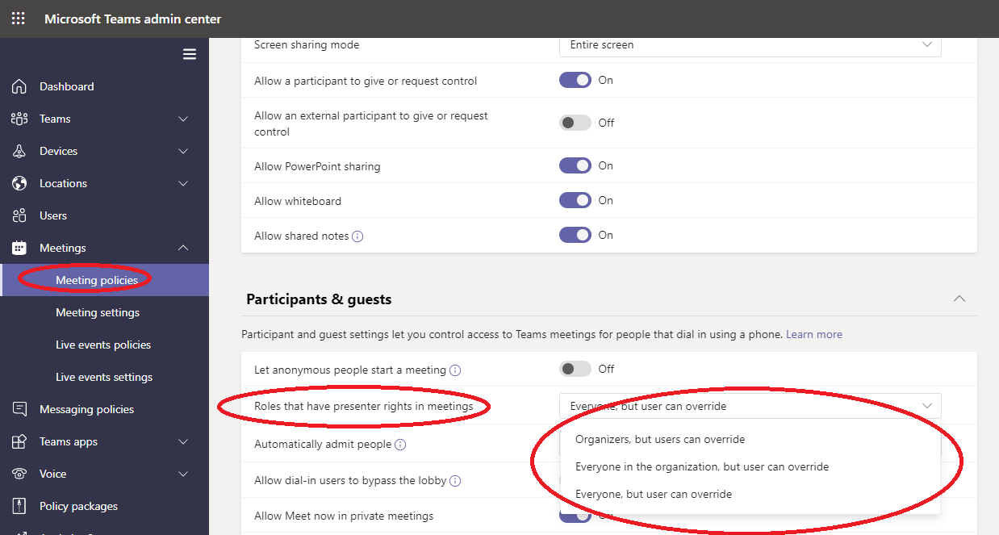

# 管理 Teams 中的会议策略

::: zone target="docs"
使用会议策略控制可供会议参与者用于组织中用户安排的会议的功能。 可以使用全局策略 (组织范围的默认) 自动创建或创建和分配自定义策略。 在 Microsoft Teams 管理中心或 PowerShell 中管理 [会议策略](teams-powershell-overview.md)。

> [!NOTE]
> 有关使用角色管理会议演示者和与会者的权限的信息，请参阅 [Teams 会议的角色](https://support.microsoft.com/office/roles-in-a-teams-meeting-c16fa7d0-1666-4dde-8686-0a0bfe16e019?ui=en-us&rs=en-us&ad=us)。

您可以通过以下方式实施策略，这会影响用户在会议启动、会议期间或会议后的会议体验。

|实现类型  |说明  |
|---------|---------|
|每个组织者    |实现按组织者的策略时，所有会议参与者将继承组织者的策略。 例如， **自动允许人员** 是按组织者的策略。 它控制用户是直接加入会议还是等待大厅中分配策略的用户安排的会议。          |
|按用户    |实现每用户策略时，仅按用户策略适用于限制组织者和/或会议参与者的某些功能。 例如， **频道中的"现在允许** 开会"是按用户的策略。     |
|按组织者和按用户     |实施按组织者和按用户策略的组合时，某些功能会基于会议参与者的策略和组织者的策略进行限制。 例如， **允许云录制** 是按组织者和按用户的策略。 打开此设置以允许用户开始和停止录制。

可以编辑全局策略中的设置，也可以创建和分配一个或多个自定义策略。 除非创建并分配自定义策略，否则用户将获取全局策略。

> [!NOTE]
> 如果用户启用了音频会议许可证或允许用户进行音频会议，则会议详细信息按钮将可用，否则会议详细信息将不可用。

## 创建自定义会议策略

1. 在 Microsoft Teams 管理中心的左侧导航栏中，转到 **"会议**  >  **会议策略"。**
2. 选择“**添加**”。
3. 输入策略的名称和说明。 名称不能包含特殊字符或超过 64 个字符。
4. 选择想要的设置。
5. 选择 **"保存"。**

例如，假设你有一组用户并且你想要限制这组用户的会议所需的带宽量。 你要创建新的自定义策略并命名为“带宽限制”，然后禁用以下设置：

在“音频和视频”中：

- 禁用“允许云录制”。
- 禁用“允许 IP 视频”。

在“内容共享”中：

- 禁用屏幕共享模式。
- 禁用“允许白板”。
- 禁用“允许共享笔记”。

然后将此策略分配给用户。

## 编辑会议策略

可以编辑全局策略和创建的任何自定义策略。

1. 在 Microsoft Teams 管理中心的左侧导航栏中，转到 **"会议**  >  **会议策略"。**
2. 单击策略名称左侧选择策略，然后选择"编辑 **"。**
3. 在此处根据需要进行更改。
4. 选择 **"保存"。**

> [!NOTE]
> 一次只能为用户分配一个会议策略。

## 将会议策略分配给用户

[!INCLUDE [assign-policy](includes/assign-policy.md)]

> [!NOTE]
> 如果将用户分配到某个策略，则不能删除该策略。 必须先将不同的策略分配给所有受影响的用户，然后可以删除原始策略。

## 会议策略设置

在"会议策略 **"页面上选择** 现有策略，或 **选择"** 添加"以添加新策略。 配置以下内容的设置。

- [常规](#meeting-policy-settings---general)
- [音频&视频](#meeting-policy-settings---audio--video)
- [内容共享](#meeting-policy-settings---content-sharing)
- [来宾&参与者](#meeting-policy-settings---participants--guests)

::: zone-end

## 会议策略设置 - 常规

- [在频道中允许"现在开会"](#allow-meet-now-in-channels)
- [允许 Outlook 加载项](#allow-the-outlook-add-in)
- [允许频道会议安排](#allow-channel-meeting-scheduling)
- [允许安排私人会议](#allow-scheduling-private-meetings)
- [允许现在在私人会议中召开会议](#allow-meet-now-in-private-meetings)

### 在频道中允许"现在开会"

**"现在允许** 开会"是按用户的策略，在会议启动之前适用。 此设置控制用户是否可以在 Teams 频道中启动计划外会议。 如果启用此设置，用户可以选择"会议"按钮以启动计划外会议或在频道中安排会议。 默认值为 True。

### 允许 Outlook 加载项

允许 Outlook 加载项是按用户的策略，在会议启动之前适用。 此设置控制是否可以在 Outlook 中安排 Teams 会议 (Windows、Mac、Web 和移动) 。

如果将其关闭，用户将无法进行计划。 Teams 会议：在 Outlook 中创建新会议时。 例如，在 Outlook on Windows 中，" **新建 Teams** 会议"选项不会显示在功能区中。

### 允许频道会议安排

使用现有的 AllowChannelMeetingScheduling 策略来控制可在团队频道日历上创建的事件类型。 这是按用户的策略，在会议启动之前适用。 此设置控制用户是否可以在 Teams 频道中安排会议。 默认情况下，此设置已打开。

如果此策略已关闭，用户无法创建新的频道会议。 但是，活动组织者可以编辑现有频道会议。

计划会议将被禁用。

 

频道选择被禁用。

在频道帖子页面中，将禁用以下功能：

- **频道答复撰写** 框上的"安排会议"按钮。
  
  
- **频道标题上的** "安排会议"按钮。
  

在频道日历中：

- **频道日历标题** 上的"添加新事件"按钮将被禁用。
  

- 用户无法拖动并选择频道日历上的一个时间块来创建频道会议。

- 用户不能使用键盘快捷方式在频道日历上创建会议。

在管理中心中：

通道日历应用会显示在应用权限策略页面的 **"Microsoft 应用** "部分。

 

### 允许安排私人会议

安排私人会议是按用户的策略，在会议启动之前适用。 此设置控制用户是否可以在 Teams 中安排私人会议。 会议未发布到团队中的频道时是私密的。

如果关闭"允许 **安排** 私人会议和允许频道会议计划"，则 Teams中的用户禁用"添加所需与会者"和"添加频道"选项。  默认情况下，此设置已打开。

### 允许现在在私人会议中召开会议

这是按用户的策略，在会议启动之前适用。 此设置控制用户是否可以启动计划外私人会议。 默认情况下，此设置已打开。

## 会议策略设置 - 音频&视频

- [允许听录](#allow-transcription)
- [允许云录制](#allow-cloud-recording)
- [IP 音频模式](#mode-for-ip-audio)
- [IP 视频的模式](#mode-for-ip-video)
- [允许 IP 视频](#allow-ip-video)
- [媒体比特率 (Kbs) ](#media-bit-rate-kbs)

### 允许听录

允许听录是按用户的策略。 此设置控制是否可以转录此用户的会议。

:::image type="content" source="media/live-transcription.png" alt-text="显示听录选项的屏幕截图":::
录制的会议的听录功能目前仅支持 Teams 中语言设置为英语和会议中使用英语的用户。

实时听录在会议期间以近乎实时的时间显示语音内容的语音到文本。 文本与会议视频一起显示，包括发言人的姓名和时间戳。 若要了解有关详细信息，请参阅 [在 Teams 会议中查看实时听录](https://support.microsoft.com/office/view-live-transcription-in-a-teams-meeting-7a1401ec-73b4-431d-875a-8b6af82b3e15)。

目前，Teams 桌面客户端支持实时听录。 美国英语口语支持听录。 会议结束后，可在 Teams 桌面版或 Web 上查看脚本。

下面将说明"允许听 **录"和** " **允许云录制** "策略设置如何协同工作。 下表描述了这些设置的值以及会议行为。

|允许听录|允许云录制|行为|
|---------|---------|---------|
|**开**|**开**|" **开始"听录** 选项在会议中可用。 会议组织者或会议参与者可以开始和停止听录。 " **开始录制** "选项在会议中可用。 会议组织者或会议参与者可以开始和停止录制。 |
|**开**|**关**|" **开始"听录** 选项在会议中可用。 " **开始录制** "选项在会议中不可用。 |
|**关**|**开**|" **开始录制** "选项在会议中可用。 " **开始"听录** 选项在会议中不可用。|
|**关**|**关**|录制和听录在会议中不可用。  |

### 允许云录制

允许云录制按用户策略控制。 此设置控制用户是否可以录制。 如果会议组织者或另一个会议参与者的特定策略设置已打开，并且他们是与组织者相同的组织中经过身份验证的用户，则录制内容可以由会议组织者或其他会议参与者启动。

组织外部的用户（例如联合用户和匿名用户）无法开始录制。 来宾用户无法启动或停止录制。

让我们看看以下示例。

|用户 |会议策略  |允许云录制 |
|---------|---------|---------|
|Daniela | 全局   | 关 |
|阿兰达 | Location1MeetingPolicy | 开|
|John (外部用户)  | 不适用 | 不适用|

Daniela，即使她是组织者，她也无法录制，因为她的策略已设置为关闭。 已启用策略设置的 Amanda 可以录制会议，包括 Daniela 组织的会议。 如果 Amanda 要组织会议，她将能够录制该会议。 但是，禁用了策略设置的 Daniela 和外部用户的 John 无法录制该会议。

若要详细了解云会议录制，请参阅 [Teams 云会议录制](cloud-recording.md)。

### IP 音频模式

IP 音频模式是按用户的策略。 此设置控制是否可以在会议和群组通话中打开音频。 下面是此设置的值。

|设置值 |行为  |
|---------|---------|
|**已启用传出和传入音频**    |会议允许传出和传入音频。 这是默认设置。 |
|**已禁用**     |传出和传入音频在会议中关闭。     |

如果用户设置为 **"** 已禁用"，该用户仍可安排和组织会议，但不能使用音频。 若要加入会议，用户必须拨打 PSTN (电话) 电话加入用户。 未分配任何策略的会议参与者（例如 (匿名参与者) 默认设置为"传出"和"传入"音频。  在 Teams 移动客户端上，如果禁用此设置，用户必须通过 PSTN 拨入会议。

此设置不适用于 1：1 调用。 若要限制 1 对 1 通话，请配置 [Teams](teams-calling-policy.md) 呼叫策略并关闭"拨打 **私人电话"** 设置。 此设置也不适用于会议室设备，例如 Surface Hub 和 Microsoft Teams 会议室设备。

此设置尚不可用于 Microsoft 365 政府社区云 (GCC) 、GCC High 或国防部 (DoD) 环境。

若要了解有关详细信息，请参阅"[管理会议参与者的音频/视频"。](#manage-audiovideo-for-meeting-participants)

### IP 视频的模式

IP 视频的模式是按用户的策略。 此设置控制是否可以在会议和群组通话中打开视频。 下面是此设置的值。

|设置值 |行为  |
|---------|---------|
|**已启用传出和传入视频**    | 会议允许传出和传入视频是默认设置。 |
|**已禁用**     | 传出和传入视频在会议中关闭。 在 Teams 移动客户端上，用户无法共享会议中的视频或照片。   请注意，如果 **禁用 IP** 音频的模式，则 **IP 视频** 的模式也将保持禁用状态。  |

如果用户设置为 **"** 禁用"，该用户无法打开视频或查看其他会议参与者共享的视频。 未分配任何策略的会议参与者 (例如，匿名参与者) 默认设置为"传出"和"传入"视频。 

此设置不适用于会议室设备，例如 Surface Hub 和 Microsoft Teams 会议室设备。

此设置尚不可用于 Microsoft 365 政府社区云 (GCC) 、GCC High 或国防部 (DoD) 环境。

> [!NOTE]
> 请记住，此设置控制传出和传入视频，而" **允许 IP 视频** "设置控制传出视频。 若要了解有关详细信息，请参阅 [哪个 IP 视频策略设置优先？](#which-ip-video-policy-setting-takes-precedence) 以及 [管理会议参与者的音频/视频](#manage-audiovideo-for-meeting-participants)。

若要了解有关详细信息，请参阅"[管理会议参与者的音频/视频"。](#manage-audiovideo-for-meeting-participants)

### 允许 IP 视频

允许 IP 视频是按组织者和按用户策略的组合。 视频是会议的关键组成部分。 在某些组织中，管理员可能希望对哪些用户的会议具有视频进行更多控制。 此设置控制是否可以在用户主持的会议以及由用户启动的 1：1 和群组通话中打开视频。 在 Teams 移动客户端上，此设置控制用户是否可以在会议中共享照片和视频。

由启用了此策略设置的用户组织的会议，如果参与者还启用了策略设置，则允许会议参与者在会议中共享视频。 未分配任何策略的会议参与者， (匿名和联合参与者) 继承会议组织者的策略。

> [!NOTE]
> 请记住，此设置控制传出视频，而 IP **视频设置模式** 控制传出和传入视频。 若要了解有关详细信息，请参阅 [哪个 IP 视频策略设置优先？](#which-ip-video-policy-setting-takes-precedence) 以及 [管理会议参与者的音频/视频](#manage-audiovideo-for-meeting-participants)。

| Teams 桌面和 Web 客户端 |Teams 移动客户端  |
|:-------:|:-------:|
|    |          |

让我们看看以下示例。

|用户 |会议策略  |允许 IP 视频 |
|---------|---------|---------|
|Daniela   | 全局   | 开       |
|阿兰达    | Location1MeetingPolicy        | 关      |

Daniela 主持的会议允许打开视频。 Daniela 可以加入会议并打开视频。 Amanda 无法打开 Daniela 会议的视频，因为 Amanda 的策略设置为不允许视频。 Amanda 可以在会议中查看其他参与者共享的视频。

在 Amanda 主持的会议中，无论分配给他们的视频策略如何，均无法打开视频。 这意味着 Daniela 无法打开 Amanda 会议中的视频。  

如果 Daniela 通过视频呼叫 Amanda，Amanda 只能使用音频应答呼叫。 当呼叫已连接时，Amanda 可以看到 Daniela 的视频，但无法打开视频。 如果 Amanda 呼叫 Daniela，Daniela 可以使用视频和音频应答呼叫。 当呼叫接通后，Daniela 可根据需要打开或关闭其视频。

若要了解有关详细信息，请参阅"[管理会议参与者的音频/视频"。](#manage-audiovideo-for-meeting-participants)

#### 哪个 IP 视频策略设置优先

对于用户，最严格的视频策略设置优先。 下面是一些示例。

|允许 IP 视频|IP 视频的模式|会议体验|
|---------|---------|---------|
|组织者： **打开**  参与者： **打开** |参与者： **已禁用**        |IP **视频设置的模式** 优先。 分配了此策略的参与者无法打开或查看其他人共享的视频。|
|组织者： **打开**  参与者： **打开** |参与者： **已启用传出和传入视频**          |分配了此策略的参与者可以打开或查看其他人共享的视频。         |
|组织者： **打开**  参与者： **关闭** |参与者： **已启用传出和传入视频**         |" **允许 IP 视频** "设置优先。 参与者只能看到传入的视频，不能发送传出视频。         |
|组织者： **打开**  参与者： **关闭** |参与者： **已禁用**         |IP **视频设置的模式** 优先。 参与者无法看到传入或传出视频。|
|组织者： **关闭**    |       |" **允许 IP 视频** "设置优先，因为组织者已关闭该设置。 在由分配有此策略的用户组织的会议中，没有人可以打开视频。         |

### 管理会议参与者的音频/视频

|如果你希望...  |设置以下策略设置  |
|---------|---------|
|为会议中的参与者禁用音频和视频  |IP 音频模式： **已禁用**  IP 视频模式： **已禁用** 允许 IP 视频：N/A       |
|仅为会议中的参与者启用传入视频和音频  |IP 音频模式： **已启用传出和传入音频**  IP 视频模式： **已启用传出和传入视频** 允许 IP 视频： **关闭**       |
|禁用会议中参与者的视频， (只有音频) |  IP 音频模式： **启用传出和传入音频**  IP 视频的模式： **已禁用** 允许 IP 视频：N/A
|为会议参与者启用音频和视频    |IP 音频模式： **已启用传出和传入音频 (** 默认)   IP 视频模式： **启用传出和传入视频 (** 默认)  允许 IP 视频： **在** (上)     |

会议组织者的策略与用户策略之间的限制性最强的策略适用。 例如，如果组织者的策略限制视频，而用户的策略不限制视频，则会议参与者将继承会议组织者的策略，并且无法访问会议中的视频。 这意味着他们只能使用音频加入会议。

> [!NOTE]
> 当用户启动群组通话以通过电话加入时，不显示"使用电话 **进行** 音频屏幕"。 这是一个已知问题，我们正在努力解决。 若要解决此问题，请在"其他加入选项"下 **选择"电话音频"。**  

#### Teams 移动客户端

对于 Teams 移动客户端上的用户，会议期间共享照片和视频的能力取决于"允许 **IP** 视频"或 **"IP 视频模式"设置** 。 共享视频和照片的能力将不可用，具体取决于哪个策略设置优先。 这不会影响屏幕共享，这是使用单独的屏幕共享模式设置 [配置的](#screen-sharing-mode) 。 此外，可以设置 [Teams](https://docs.microsoft.com/powershell/module/skype/new-csteamsmobilitypolicy) 移动策略来防止移动用户通过手机网络连接使用 IP 视频，这意味着他们必须使用 WiFi 连接。

### 媒体比特率 (Kbs) 

这是按用户的策略。 此设置确定在呼叫和会议中为用户共享音频、视频和基于视频的应用传输的总平均媒体比特率。 它同时应用于呼叫或会议中的用户的上行和下行媒体遍历。 此设置可让你精细控制组织中带宽的管理。 根据用户所需的会议方案，我们建议有足够的带宽，以便获得优质体验。 最小值为 30 Kbps，最大值取决于会议方案。 若要详细了解在 Teams 中为优质会议、通话和实时事件建议的最小带宽，请参阅 [带宽要求](prepare-network.md#bandwidth-requirements)。

如果没有足够的带宽用于会议，参与者将看到一条消息，指示网络质量差。

对于需要最高质量的视频体验的会议（如 CEO 董事会会议和 Teams 实时活动），建议将带宽设置为 10 Mbps。 即使设置了最大体验，在检测到特定网络条件时，Teams 媒体堆栈也能够适应低带宽条件，具体取决于方案。

## 会议策略设置 - 内容共享

- [屏幕共享模式](#screen-sharing-mode)
- [允许参与者授予或请求控制权](#allow-a-participant-to-give-or-request-control)
- [允许外部参与者授予或请求控制权](#allow-an-external-participant-to-give-or-request-control)
- [允许 PowerPoint 共享](#allow-powerpoint-sharing)
- [允许白板](#allow-whiteboard)
- [允许共享笔记](#allow-shared-notes)

### 屏幕共享模式

> [!NOTE]
> 此功能仍在开发中。 屏幕共享是按参与者的策略，但是，它可能会受组织者的屏幕共享设置的影响，如本部分中所述。

此设置控制是否在用户的会议中允许桌面和/或窗口共享。 未分配任何策略的会议参与者 (匿名、来宾、B2B 和联合参与者) 继承会议组织者的策略。

|设置值 |行为  |
|---------|---------|
|**整个屏幕**    | 会议允许完全桌面共享和应用程序共享 |
|**单个应用程序**   | 会议允许应用程序共享        |
|**已禁用**     |会议中的屏幕共享和应用程序共享已关闭。       |

让我们看看以下示例。

|用户 |会议策略 |屏幕共享模式 |
|---------|---------|---------|
|Daniela  | 全局   | 整个屏幕 |
|阿兰达   | Location1MeetingPolicy  | 已禁用 |

Daniela 主持的会议允许会议参与者共享其整个屏幕或特定应用程序。 如果 Amanda 加入 Daniela 的会议，Amanda 无法共享她的屏幕或特定应用程序，因为禁用了策略设置。 在 Amanda 主持的会议中，无论分配给他们的屏幕共享模式策略如何，都不允许任何人共享其屏幕或单个应用程序。 这意味着 Daniela 无法共享她的屏幕或 Amanda 会议中的单个应用程序。  

目前，如果用户使用 Google Chrome，则他们无法播放视频或在 Teams 会议中共享其屏幕。

### 允许参与者授予或请求控制权

这是按用户的策略。 此设置控制用户是否可以将共享桌面或窗口的控制权授予其他会议参与者。 若要授予控制权，请将鼠标悬停在屏幕顶部。

如果为用户启用此设置，共享会话的顶部栏中会显示"授予控制"选项。

如果用户的设置已关闭，则"授予 **控制** "选项不可用。

让我们看看以下示例。

|用户 |会议策略  |允许参与者授予或请求控制权 |
|---------|---------|---------|
|Daniela   | 全局   | 开       |
|法拉尼克    | Location1MeetingPolicy        | 关   |

Daniela 可以将共享桌面或窗口的控制权授予由一个由一名小娜组织的会议的其他参与者，而 Danielk 不能将控制权授予其他参与者。

若要使用 PowerShell 控制谁可以授予控制权或接受控制请求，请使用 AllowParticipantGiveRequestControl cmdlet。

> [!NOTE]
> 若要在共享过程中授予并控制共享内容，双方必须使用 Teams 桌面客户端。 如果任何一方在浏览器中运行 Teams，则不支持控制。 这是由我们计划修复的一个技术限制造成。

### 允许外部参与者授予或请求控制权

这是按用户的策略。 无论会议组织者设置什么，组织是否为用户设置此集都无法控制外部参与者可以执行哪些操作。 此参数控制是否可以向外部参与者提供对共享者屏幕的控制或请求控制权，具体取决于共享者在其组织的会议策略中设置的内容。 Teams 会议的外部参与者可分类如下：  

- 匿名用户
- 来宾用户  
- B2B 用户
- 联合用户  

联合用户是否可以在共享时向外部用户授予控制权，这由"允许外部参与者授予或 **请求** 其组织中控制设置"控制。

若要使用 PowerShell 控制外部参与者是否可以授予控制权或接受控制请求，请使用 AllowExternalParticipantGiveRequestControl cmdlet。

### 允许 PowerPoint 共享

这是按用户的策略。 此设置控制用户是否可以在会议中共享 PowerPoint 幻灯片。 外部用户（包括匿名用户、来宾用户和联合用户）继承会议组织者的策略。

让我们看看以下示例。

|用户 |会议策略  |允许 PowerPoint 共享 |
|---------|---------|---------|
|Daniela   | 全局   | 开       |
|阿兰达   | Location1MeetingPolicy        | 关   |

Amanda 不能共享会议中 PowerPoint 幻灯片，即使她是会议组织者。 Daniela 可以共享 PowerPoint 幻灯片，即使会议是由 Amanda 组织的。 Amanda 可以查看会议中其他人共享的 PowerPoint 幻灯片，即使她无法共享 PowerPoint 幻灯片。

### 允许白板

这是按用户的策略。 此设置控制用户是否可以在会议中共享白板。 外部用户（包括匿名用户、B2B 用户和联合用户）继承会议组织者的策略。

让我们看看以下示例。

|用户 |会议策略  |允许白板|
|---------|---------|---------|
|Daniela   | 全局   | 开       |
|阿兰达   | Location1MeetingPolicy        | 关   |

Amanda 不能共享会议中的白板，即使她是会议组织者。 Daniela 可以共享白板，即使会议是由 Amanda 组织的。  

### 允许共享笔记

这是按用户的策略。 此设置控制用户是否可以在会议创建和共享笔记。 外部用户（包括匿名用户、B2B 用户和联合用户）继承会议组织者的策略。 最多 **包含** 100 位参与者的会议支持"会议笔记"选项卡。

让我们看看以下示例。

|用户 |会议策略  |允许共享笔记 |
|---------|---------|---------|
|Daniela   | 全局   | 开       |
|阿兰达   | Location1MeetingPolicy | 关 |

Daniela 可以在 Amanda 的会议中做笔记，而 Amanda 不能在任何会议中做笔记。

<!-- Bookmark used by Context Sensitive Help (CSH). Do not delete. -->

<!-- Do not remove the bookmark link above. -->

## 会议策略设置 - 参与者&来宾

这些设置控制哪些会议参与者在进入会议之前在大厅中等待，以及允许他们参加会议的参与级别。

- [让匿名人员启动会议](#let-anonymous-people-start-a-meeting)
- [自动允许人员](#automatically-admit-people)
- [允许拨入用户绕过大厅](#allow-dial-in-users-to-bypass-the-lobby)
- [启用实时字幕](#enable-live-captions)
- [允许在会议中聊天](#allow-chat-in-meetings)

> [!NOTE]
>加入会议的选项因每个 Teams 组的设置和连接方法而异。 如果你的群组有音频会议，并使用它进行连接，请参阅 [音频会议](https://docs.microsoft.com/microsoftteams/audio-conferencing-in-office-365)。 如果你的 Teams 组没有音频会议，请参阅"在[Teams 中加入会议"。](https://support.office.com/article/join-a-meeting-in-teams-1613bb53-f3fa-431e-85a9-d6a91e3468c9)

### 让匿名人员启动会议

这是每个组织者的策略，允许无领导电话拨入式会议。 此设置控制拨入用户是否可以在没有组织中经过身份验证的用户出席的情况下加入会议。 默认情况下，此设置已关闭，这意味着拨入用户将在大厅中等待，直到组织中经过身份验证的用户加入会议。

> [!NOTE]
> 如果此设置已关闭，并且拨入用户先加入会议并放置在大厅中，则组织用户必须与 Teams 客户端加入会议，以允许用户从大厅进入。 拨入用户没有可用的大厅控件。

### 自动允许人员

这是按组织者的策略。 此设置控制用户是直接加入会议，还是等待在大厅中等待，直到经过身份验证的用户获准。 此设置不适用于拨入用户。

 会议组织者可以选择 **会议** 邀请中的"会议选项"，以更改他们计划的每个会议的此设置。

> [!NOTE]
> 在会议选项中，设置标记为"谁可以绕过大厅"。 如果更改任何用户的默认设置，它将应用于该用户组织的所有新会议以及用户未修改会议选项的任何以前会议。
  
|设置值  |联接行为 |
|---------|---------|
|**所有人**   |所有会议参与者都直接加入会议，无需在大厅中等待。 这包括经过身份验证的用户、来自受信任组织的外部 (联合) 、来宾和匿名用户。     |
|**组织和联盟组织中所有人**     |组织中经过身份验证的用户（包括来宾用户和来自受信任组织的用户）可以直接加入会议，无需在大厅中等待。  匿名用户在大厅中等待。   |
|**您的组织中的每个人**    |组织中经过身份验证的用户（包括来宾用户）无需在大厅中等待即可直接加入会议。  来自受信任组织和匿名用户的用户在大厅中等待。 这是默认设置。           |
|**仅组织者**    |只有会议组织者可以直接加入会议，而无需在大厅中等待。 其他所有人（包括组织中经过身份验证的用户、来宾用户、受信任组织和匿名用户）必须在大厅中等待。           |

### 允许拨入用户绕过大厅

这是按组织者的策略。 此设置控制通过电话拨入的人是直接加入会议还是在大厅中等待，而不考虑 **"自动允许人员"** 设置。 默认情况下，此设置已关闭。 当此设置关闭时，拨入用户将在大厅中等待，直到组织用户使用 Teams 客户端加入会议并准许他们加入会议。 启用此设置后，当组织用户加入会议时，拨入用户将自动加入会议。

> [!NOTE]
> 如果拨入用户在组织用户加入会议之前加入会议，他们将被置于大厅中，直到组织用户使用 Teams 客户端加入会议并准许他们加入会议。 如果更改任何用户的默认设置，它将应用于该用户组织的所有新会议以及用户未修改会议选项的任何以前会议。

### 启用实时字幕

这是按用户的策略，在会议期间适用。 此设置控制" **启用实时** 字幕"选项是否可供用户在用户参加的会议中打开和关闭实时字幕。  

|设置值 |行为  |
|---------|---------|
|**已禁用，但用户可以替代**     | 在会议期间，用户不会自动打开实时字幕。 用户将看到"在溢出菜单上打开实时字幕 **" (...)** 菜单以将其打开。 这是默认设置。 |
|**已禁用**     | 会议期间为用户禁用了实时字幕。 用户没有启用它们的选项。          |

### 允许在会议中聊天

这是每个参与者的设置。 此设置控制是否在用户的会议中允许会议聊天。

## 会议策略设置 - 指定的演示者角色模式

这是按用户的策略。 此设置允许您在 Teams 客户端的会议选项中更改"谁可以展示？"**设置的默认值**。 此策略设置会影响所有会议，包括"现在开会"会议。

" **谁可以演示？"** 设置允许会议组织者选择谁可以是会议中的演示者。 若要了解有关详细信息，请参阅["更改 Teams 会议的参与者设置"](https://support.microsoft.com/article/change-participant-settings-for-a-teams-meeting-53261366-dbd5-45f9-aae9-a70e6354f88e)和["Teams 会议的角色"。](https://support.microsoft.com/article/roles-in-a-teams-meeting-c16fa7d0-1666-4dde-8686-0a0bfe16e019)

可以使用 [Set-CsTeamsMeetingPolicy](https://docs.microsoft.com/powershell/module/skype/set-csteamsmeetingpolicy) cmdlet 编辑现有的 Teams 会议策略。 或者，使用 [New-CsTeamsMeetingPolicy](https://docs.microsoft.com/powershell/module/skype/new-csteamsmeetingpolicy) cmdlet 创建新的 Teams 会议策略并将其分配给用户。

若要在 Teams 中指定"谁可以展示 **？"** 设置的默认值，将 **SpecifyedPresenterRoleMode** 参数设置为以下参数之一：

- **EveryoneUserOverride：** 所有会议参与者都可以是演示者。 此值为默认值。 此参数对应于 Teams **中的 Everyone** 设置。
- **EveryoneInCompanyUserOverride：** 组织中经过身份验证的用户（包括来宾用户）可以是演示者。 此参数对应于 Teams **中的组织人员** 设置。
- **OrganizerOnlyUserOverride：** 只有会议组织者才能成为演示者，所有会议参与者都将被指定为与会者。 此参数对应于 Teams **中的"仅我** "设置。

此外，还可以在 Teams 管理中心编辑此策略。

请记住，设置默认值后，会议组织者仍然可以在 Teams 中更改此设置，并选择谁可以在他们安排的会议中参加。

## 会议策略设置 - 会议出席报告

这是按用户的策略。 此设置控制会议组织者是否可以下载 [会议出席报告](teams-analytics-and-reports/meeting-attendance-report.md)。

目前，只能使用 PowerShell 配置此策略设置。 可以使用 [Set-CsTeamsMeetingPolicy](https://docs.microsoft.com/powershell/module/skype/set-csteamsmeetingpolicy) cmdlet 编辑现有的 Teams 会议策略。 或者，使用 [New-CsTeamsMeetingPolicy](https://docs.microsoft.com/powershell/module/skype/new-csteamsmeetingpolicy) cmdlet 创建新的 Teams 会议策略并将其分配给用户。

若要使会议组织者能够下载会议出席情况报告，将 **AllowEngagementReport** 参数设置为 **"已启用"。** 启用后，下载报表的选项会显示在"参与者 **"窗格中** 。

若要防止会议组织者下载报告，将参数设置为 **"已禁用"。** 默认情况下，此设置已禁用，并且下载报表的选项不可用。

## 会议策略设置 - 群岛模式的会议提供商

这是按用户的策略。 此设置控制哪些 Outlook 会议加载项用于位于 *群岛模式的用户*。 你可以指定用户是只能使用 Team 会议加载项，还是可同时使用 Teams 会议加载项和 Skype for Business 会议加载项来在 Outlook 中安排会议。

你只能将此策略应用于处于孤岛模式且其 Teams 会议策略中的 **AllowOutlookAddIn** 参数设置为 **True** 的用户。

目前，只能使用 PowerShell 设置此策略。 可以使用 [Set-CsTeamsMeetingPolicy](https://docs.microsoft.com/powershell/module/skype/set-csteamsmeetingpolicy) cmdlet 编辑现有的 Teams 会议策略。 或者，使用 [New-CsTeamsMeetingPolicy](https://docs.microsoft.com/powershell/module/skype/new-csteamsmeetingpolicy) cmdlet 创建新的 Teams 会议策略并将其分配给用户。

若要指定希望哪些会议加载项可供用户使用，请设置 **PreferredMeetingProviderForIslandsMode** 参数，如下所示：

- 将参数设置为 **TeamsAndSfB，** 以在 Outlook 中同时启用 Teams 会议加载项和 Skype for Business 加载项。 此值为默认值。
- 将参数设置为 **Teams** 以在 Outlook 中仅启用 Teams 会议加载项。 此策略设置可确保所有将来的会议都有 Teams 会议加入链接。 它不会将现有 Skype for Business 会议加入链接迁移到 Teams。 此策略设置不会影响 Skype for Business 中的状态、聊天、PSTN 呼叫或其他任何功能，这意味着用户将继续使用 Skype for Business 实现这些功能。

  如果将参数设置为 **Teams，** 然后切换回 **TeamsAndSfB，** 则两个会议加载项都已启用。 现有 Teams 会议 **加入链接** 不会迁移到 Skype for Business。 只有更改后安排的 Skype for Business 会议才具有 Skype for Business 会议加入链接。

## 会议策略设置 - 视频筛选器模式

这是按用户的策略。 此设置控制用户是否可以在会议中自定义其视频背景。

目前，只能使用 PowerShell 设置此策略。 可以使用 [Set-CsTeamsMeetingPolicy](https://docs.microsoft.com/powershell/module/skype/set-csteamsmeetingpolicy) cmdlet 编辑现有的 Teams 会议策略。 或者，使用 [New-CsTeamsMeetingPolicy](https://docs.microsoft.com/powershell/module/skype/new-csteamsmeetingpolicy) cmdlet 创建新的 Teams 会议策略，然后将该策略分配给用户。

若要指定用户是否可以在会议中自定义其视频背景，请设置 **VideoFiltersMode** 参数，如下所示：

|在 PowerShell 中设置值 |行为  |
|---------|---------|
|**NoFilters**     |用户无法自定义其视频背景。|
|**BlurOnly**     |用户可以模糊其视频背景。 |
|**BlurandDefaultBackgrounds**     |用户可以选择模糊其视频背景，或者选择用作背景的默认图像集。 |
|**AllFilters**     |用户可以选择模糊其视频背景、从默认图像集选择或上传自定义图像以用作背景。 |

> [!IMPORTANT]
> Teams 不会筛选用户上传的图像。 使用 **AllFilters** 设置时，应制定内部组织策略来防止用户上传冒犯性或不当图像，或组织没有权限用于 Teams 会议背景的图像。

> [!NOTE]
> 这些功能不可用于所有 Teams 客户端。 有关详细信息，请参阅会议和实时活动中的视频[和背景标题](https://support.microsoft.com/office/meetings-and-live-events-5c3e0646-dc37-45ad-84a4-1666fac62d4e)。

## 会议策略设置 - 会议回应

AllowMeetingReactions 设置只能使用 PowerShell 应用。 无法从 Teams 管理中心打开或关闭 AllowMeetingReactions。

会议回应默认为"关闭"。 关闭用户的反应并不意味着用户无法安排在会议中使用回应。 无论默认设置如何，会议组织者仍可打开会议选项页面中的反应。

## 相关主题

- [Teams PowerShell 概览](teams-powershell-overview.md)
- [向 Teams 中的用户分配策略](assign-policies.md)
- [从用户中删除 RestrictedAnonymousAccess Teams 会议策略](meeting-policies-restricted-anonymous-access.md)
