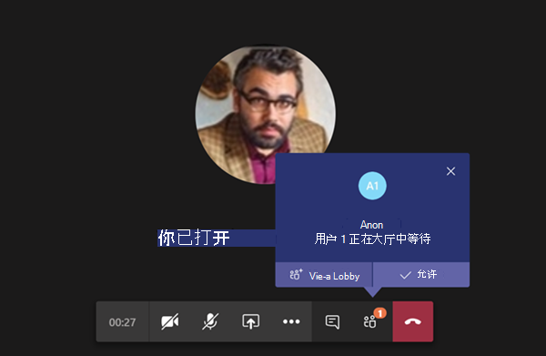
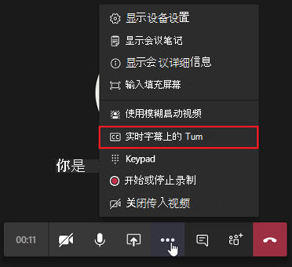

# 会议策略设置 - 参与者&来宾Meeting policy settings - Participants & guests

这些设置控制哪些会议参与者在获准参加会议之前在大厅中等待，以及允许他们参加会议的参与级别。These settings control which meeting participants wait in the lobby before they are admitted to the meeting and the level of participation they are allowed in a meeting.

- [让匿名人员启动会议Let anonymous people start a meeting](#let-anonymous-people-start-a-meeting)
- [自动允许人员Automatically admit people](#automatically-admit-people)
- [允许拨入用户绕过大厅Allow dial-in users to bypass the lobby](#allow-dial-in-users-to-bypass-the-lobby)
- [启用实时字幕Enable live captions](#enable-live-captions)
- [允许在会议中聊天Allow chat in meetings](#allow-chat-in-meetings)

> [!NOTE]
>用于加入会议的选项因每个 Teams 组的设置和连接方法而异。Options to join a meeting will vary, depending on the settings for each Teams group, and the connection method. 如果你的群组有音频会议，并使用它进行连接，请参阅 [音频会议](https://docs.microsoft.com/microsoftteams/audio-conferencing-in-office-365)。If your group has audio conferencing, and uses it to connect, see [Audio Conferencing](https://docs.microsoft.com/microsoftteams/audio-conferencing-in-office-365). 如果你的 Teams 组没有音频会议，请参阅 [在 Teams 中加入会议](https://support.office.com/article/join-a-meeting-in-teams-1613bb53-f3fa-431e-85a9-d6a91e3468c9)。If your Teams group doesn't have audio conferencing, refer to [Join a meeting in Teams](https://support.office.com/article/join-a-meeting-in-teams-1613bb53-f3fa-431e-85a9-d6a91e3468c9).

## 让匿名人员启动会议Let anonymous people start a meeting

此设置是一个按组织者的策略，允许召开无领导电话拨入式会议。This setting is a per-organizer policy that allows for leaderless dial-in conferencing meetings. 此设置控制拨入用户是否可以在没有组织中经过身份验证的用户参加会议的情况下加入会议。This setting controls whether dial-in users can join the meeting without an authenticated user from the organization in attendance. 默认情况下，此设置已关闭，这意味着拨入用户将在大厅中等待，直到组织中经过身份验证的用户加入会议。By default, this setting is turned off, which means dial-in users will wait in the lobby until an authenticated user from the organization joins the meeting.

> [!NOTE]
> 如果此设置已关闭，并且拨入用户先加入会议并放置在大厅中，则组织用户必须通过 Teams 客户端加入会议，以允许用户从大厅访问。If this setting is turned off and a dial-in user joins the meeting first and is placed in the lobby, an organization user must join the meeting with a Teams client to admit the user from the lobby. 拨入用户没有可用的大厅控件。There are no lobby controls available for dialed in users.

## 自动允许人员Automatically admit people

这是按组织者的策略。This is a per-organizer policy. 此设置控制用户是直接加入会议，还是等待大厅，直到经过身份验证的用户获准。This setting controls whether people join a meeting directly or wait in the lobby until they are admitted by an authenticated user. 此设置不适用于拨入用户。This setting does not apply to dial-in users.

 会议组织者可以在会议 **邀请中** 单击"会议选项"，更改他们计划的每个会议的此设置。Meeting organizers can click **Meeting Options** in the meeting invitation to change this setting for each meeting they schedule.

> [!NOTE]
> 在会议选项中，设置标记为"谁可以绕过大厅"。In the meeting options the setting is labeled "Who can bypass the lobby". 如果更改任何用户的默认设置，它将应用于该用户组织的所有新会议以及用户未修改会议选项的任何以前会议。If you change the default setting for any user, it will apply to all new meetings organized by that user and any prior meetings where the user didn't modify Meeting options.
  
|设置值Setting value  |联接行为Join behavior |
|---------|---------|
|**所有人****Everyone**   |所有会议参与者都直接加入会议，无需在大厅中等待。All meeting participants join the meeting directly without waiting in the lobby. 这包括经过身份验证的用户、来自受信任组织的外部用户 (联合) 、来宾和匿名用户。This includes authenticated users, external users from trusted organizations (federated), guests, and anonymous users.     |
|**组织与联盟组织中的每个人****Everyone in your organization and federated organizations**     |组织中经过身份验证的用户（包括来宾用户和来自受信任组织的用户）可以直接加入会议，无需在大厅中等待。Authenticated users within the organization, including guest users and the users from trusted organizations, join the meeting directly without waiting in the lobby.  匿名用户在大厅中等待。Anonymous users wait in the lobby.   |
|**您的组织中的每个人****Everyone in your organization**    |组织中经过身份验证的用户（包括来宾用户）可以直接加入会议，无需在大厅中等待。Authenticated users from within the organization, including guest users, join the meeting directly without waiting in the lobby.  来自受信任组织和匿名用户的用户在大厅中等待。Users from trusted organizations and anonymous users wait in the lobby. 这是默认设置。This is the default setting.           |
|**仅组织者****Organizer only**    |只有会议组织者可以直接加入会议，而无需在大厅中等待。Only meeting organizers can join the meeting directly without waiting in the lobby. 其他所有人（包括组织中经过身份验证的用户、来宾用户、来自受信任组织的用户和匿名用户）必须在大厅中等待。Everyone else, including authenticated users within the organization, guest users, users from trusted organizations and anonymous users must wait in the lobby.           |

## 允许拨入用户绕过大厅Allow dial-in users to bypass the lobby

这是按组织者的策略。This is a per-organizer policy. 此设置控制通过电话拨入的人是直接加入会议还是等待在大厅中，而不考虑" **自动允许人员"** 设置。This setting controls whether people who dial in by phone join the meeting directly or wait in the lobby regardless of the **Automatically admit people** setting. 默认情况下，此设置已关闭。By default, this setting is turned off. 当此设置关闭时，拨入用户将在大厅中等待，直到组织用户使用 Teams 客户端加入会议并准许他们加入会议。When this setting is turned off, dial-in users will wait in the lobby until an organization user joins the meeting with a Teams client and admits them. 启用此设置后，当组织用户加入会议时，拨入用户将自动加入会议。When this setting is turned on, dial-in users will automatically join the meeting when an organization user joins the meeting.

> [!NOTE]
> 如果拨入用户在组织用户加入会议之前加入会议，他们将被放置在大厅中，直到组织用户使用 Teams 客户端加入会议并准许他们加入。If a dial-in user joins a meeting before an organization user joins the meeting, they will be placed in the lobby until an organization user joins the meeting using a Teams client and admits them. 如果更改任何用户的默认设置，它将应用于该用户组织的所有新会议以及用户未修改会议选项的任何以前会议。If you change the default setting for any user, it will apply to all new meetings organized by that user and any prior meetings where the user didn't modify Meeting options.

## 启用实时字幕Enable live captions

此设置是按用户的策略，在会议期间适用。This setting is a per-user policy and applies during a meeting. 此设置控制" **启用实时** 字幕"选项是否可供用户在用户参加的会议中打开和关闭实时字幕。This setting controls whether the **Turn on live captions** option is available for the user to turn on and turn off live captions in meetings that the user attends.  

|设置值Setting value |行为Behavior  |
|---------|---------|
|**已禁用，但用户可以替代****Disabled but the user can override**     | 在会议期间，用户不会自动打开实时字幕。Live captions aren't automatically turned on for the user during a meeting. 用户会看到溢出 **菜单中的"** 启用实时字幕" (...) 打开它们。 The user sees the **Turn on live captions** option in the overflow (**...**) menu to turn them on. 这是默认设置。This is the default setting. |
|**已禁用****Disabled**     | 会议期间为用户禁用了实时字幕。Live captions are disabled for the user during a meeting. 用户没有启用它们的选项。The user doesn't have the option to turn them on.          |

## 允许在会议中聊天Allow chat in meetings

此设置是每个参与者的设置。This setting is a per-participant setting. 此设置控制是否在用户的会议中允许会议聊天。This setting controls whether meeting chat is allowed in the user's meeting.

## 相关主题Related topics

- [Teams PowerShell 概览Teams PowerShell overview](teams-powershell-overview.md)
- [向 Teams 中的用户分配策略Assign policies to your users in Teams](assign-policies.md)
- [从用户中删除 RestrictedAnonymousAccess Teams 会议策略Remove the RestrictedAnonymousAccess Teams meeting policy from users](meeting-policies-restricted-anonymous-access.md)
