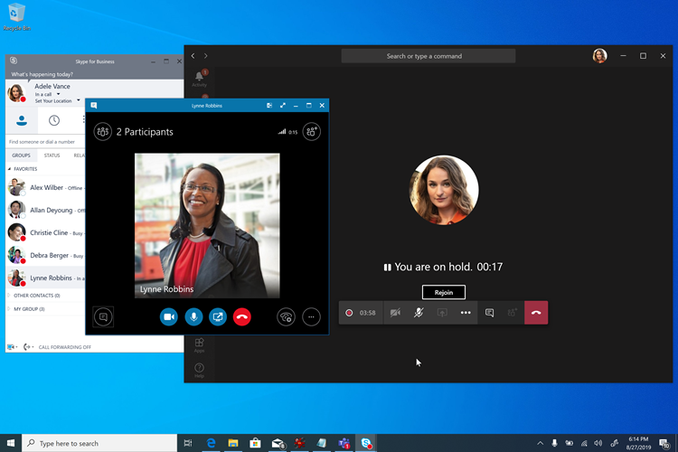

# 会议优先Meetings First

"会议优先" 面向具有企业内部部署的 Skype for business 服务器组织，并针对希望尽可能快地开始使用团队会议的 Skype for business 服务器组织进行优化。"Meetings First" is targeted at and optimized for Skype for Business Server organizations with Enterprise Voice on premises who want to start using Teams meetings as rapidly as possible. 对于这些组织，会议优先的另一种方法是使用**孤岛**模式来排定团队会议体验的优先级。For these organizations, Meetings First is an alternative to using **Islands** mode that prioritizes the Teams meetings experience.

## 会议首先是什么？What is Meetings First?

会议优先基于**SfBWithTeamsCollabAndMeetings**共存模式。Meetings First is based on the **SfBWithTeamsCollabAndMeetings** coexistence mode. 会议优先不是一种产品或功能，它是一种可利用团队和 Skype for business 的功能和 Skype for business 提供唯一量身定制的共存体验的配置。Meetings First is not a product or a feature—it is a configuration that leverages capabilities and features of Teams and Skype for Business to provide a uniquely tailored coexistence experience.

首先，在会议中，用户在团队中创建会议，同时继续使用 Skype for Business 进行聊天、通话和联机状态。In Meetings First, users create their meeting in Teams, while continuing to use Skype for Business for chat, calling, and presence. 团队和 Skype for business 之间无形式重叠。There is no overlap of modalities between Teams and Skype for Business. Skype for Business 中的 "聊天"、"通话" 和 "状态" 均为 "在团队中"。Chat, calling, and presence are on in Skype for Business and off in Teams. 这使得在共存期间增强用户体验的 Skype for Business 和团队之间的 "更好结合" 方案，以及与**团队仅**有用户的互操作方案。This enables unique "better together" scenarios between Skype for Business and Teams that enhance the user's experience during coexistence, as well as interoperability scenarios with **Teams Only** users.

> [!Important]
> 会议优先对于没有或几乎没有活动团队聊天用户的组织而言是更好的匹配。Meetings First is a better match for organizations who have no or few active Teams chat users. 活动团队聊天用户不应切换到会议第一种模式，因为他们将失去在团队中聊天和访问其聊天历史记录的功能。Active Teams chat users should not be switched to Meetings First mode, as they would lose the ability to chat in Teams and to access to their chat history. 这些用户应 grandfathered 为 "**岛**" 模式，而首先仅授予用户在团队聊天中尚未激活的用户。These users should be grandfathered in **Islands** mode instead, and Meetings First only granted to the users not yet active in chat in Teams.

## 谁应该先考虑会议？Who should consider Meetings First?

会议优先适用于使用具有企业语音的 Skype for Business 服务器的组织，该服务器希望加速其移动到团队会议，尤其是那些想要为团队进行托管、确定性的升级途径的高 IT 学科的组织。Meetings First was designed for organizations who use Skype for Business Server with Enterprise Voice who want to accelerate their move to Teams meetings, especially those with strong IT discipline who want a managed, deterministic upgrade path to Teams.

对于复杂或大型组织，语音迁移通常在逐个网站完成，可能需要花费很长时间，这种情况下可能会产生较长的共存方案。For complex or large organizations, voice migrations are typically done on a site-by-site basis and might take a long time, potentially several years, resulting in extended coexistence scenarios. 如果该共存处于 "**孤岛**" 模式，则用户始终可以选择两个会议解决方案（Skype for Business 和团队），这可能导致混乱或不够理想的情况。If that coexistence is in **Islands** mode, users will always have the choice of two meeting solutions (Skype for Business and Teams), which can result in confusing or suboptimal situations. 与语音迁移不同，会议迁移通常可以在整个公司的一段时间内完成。Unlike voice migrations, meetings migrations can generally be completed across the entire company in a short amount of time. 希望尽快完全切换到团队会议（且无需等待完成语音迁移）的组织应首先考虑会议。Organizations who want to completely switch to Teams meetings as quickly as possible (and without waiting for their voice migration to be complete) should consider Meetings First.

只有没有企业语音用户的组织才有可能无法使用会议。Meetings First might not be useful to organizations who have no Enterprise Voice users. 只有当这些组织能够采用团队会议后，这些组织才能升级到**团队**。These organizations should be able to upgrade to **Teams Only** as soon as they are able to adopt Teams meetings. 他们应考虑先跳过会议。They should consider skipping Meetings First.

此外，会议优先对于范围是一种纯粹扮演的会议解决方案的组织非常有用，例如，当发出 "仅会议" RFP 时。In addition, Meetings First is useful to organizations whose scope is a pure-play meeting solution, for example when a "meetings-only" RFP is being issued.

## 会议中的功能优先Capabilities in Meetings First

会议首先将以下功能结合在一起：Meeting First brings the following capabilities together:

- 使用[团队音频会议](tutorial-audio-conferencing.yml)[设置 Skype for business 服务器（本地）用户](https://docs.microsoft.com/microsoftteams/tutorial-audio-conferencing?tutorial-step=3)。[Provision a Skype for Business Server (on-premises) user](https://docs.microsoft.com/microsoftteams/tutorial-audio-conferencing?tutorial-step=3) with [Teams Audio Conferencing](tutorial-audio-conferencing.yml).
- [会议迁移服务](https://docs.microsoft.com/skypeforbusiness/audio-conferencing-in-office-365/setting-up-the-meeting-migration-service-mms)：用户组织的会议将迁移到云并在用户首先升级到会议时转换为团队会议（需要 Exchange Online）。[Meetings Migration Service](https://docs.microsoft.com/skypeforbusiness/audio-conferencing-in-office-365/setting-up-the-meeting-migration-service-mms): Meetings organized by the user will be migrated to the cloud and converted to Teams meetings as the user is promoted to Meetings First (requires Exchange Online).
- 简化了团队中的用户体验，可在团队会议和团队和频道（可选）中使用[应用权限策略](teams-app-permission-policies.md)进行隐藏;[工作组私人聊天、通话和自我展示](teams-client-experience-and-conformance-to-coexistence-modes.md)不会首先在会议中公开，从而实现部署和采用工作，以充分关注会议。Streamlined user experience in Teams, centered on Teams meetings and teams and channels (which can, optionally, be hidden using the [App Permissions policy](teams-app-permission-policies.md)); [Teams private chat, calling, and self-presence](teams-client-experience-and-conformance-to-coexistence-modes.md) are not exposed in Meetings First, enabling the deployment and adoption effort to fully focus on meetings.
- 出色的[团队会议体验](tutorial-meetings-in-teams.yml)。Superior [Teams meeting experience](tutorial-meetings-in-teams.yml).
- 团队和 Skype for business 之间的 "更好地协作"："Better Together" between Teams and Skype for Business: 
  - 自动保留：当在团队中的会议中，在 Skype for Business 中进入呼叫将使团队会议保持不动，反之亦然。Automatic hold: When in a meeting in Teams, getting in a call in Skype for Business will place the Teams meeting on hold, and vice-versa. 这可防止用户通过会议参与者 overheard 私人通话。This prevents users from having their private calls overheard by the meetings participants.
    
  - 状态协调：团队中的活动反映在用户的状态中，因为聊天和通话都在 Skype for business 中，这是 Skype for business 的状态。Presence reconciliation: Activity in Teams is reflected in the user's presence, which is the Skype for Business presence since chat and calling are in Skype for Business. 尤其是，当会议第一位用户在团队会议中时，其状态将更新为 "反映"。Specifically, when Meetings First users are in a Teams meeting, their presence will be updated to reflect that. 当用户显示屏幕时，其状态将更新为 "请勿打扰" （基于其在 Skype for Business 中的设置）。When they present their screen, their presence will be updated to show Do Not Disturb (based on their settings in Skype for Business).
  - USB 设备 HID 控件对帐（也可以在 Mac 上使用）：当团队会议中和在所有其他情况下，在团队会议和 Skype for Business 中，HID 控件均由团队接受。USB device HID control reconciliation (also available on Mac): The HID controls are honored by Teams while in Teams meetings and by Skype for Business in all other circumstances.
  - 除非另有说明，但更好地将功能组合在一起需要最新的 Windows 桌面客户端。Unless otherwise mentioned, Better Together capabilities require recent Windows desktop clients at this time.

## 首先参加会议的先决条件Prerequisites for Meetings First

会议的唯一硬性要求与具有本地 Active Directory 和 Skype for business 内部部署的团队的要求相同：The only hard requirements for Meetings First are the same as the requirements for Teams with on-premises Active Directory and a Skype for Business on-premises deployment:

- [团队的一般预备先决条件](upgrade-plan-journey-prerequisites.md)，包括[General pre-requisites for Teams](upgrade-plan-journey-prerequisites.md), including
- [团队和中的身份和身份验证](identify-models-authentication.md)[Identity and authentication in Teams](identify-models-authentication.md) and
- [配置团队和 Skype for business 的 Azure Active Directory](https://docs.microsoft.com/skypeforbusiness/hybrid/configure-azure-ad-connect)。[Configure Azure Active Directory for Teams and Skype for Business](https://docs.microsoft.com/skypeforbusiness/hybrid/configure-azure-ad-connect).

不需要[Skype for business 混合拓扑](https://docs.microsoft.com/skypeforbusiness/hybrid/configure-federation-with-skype-for-business-online)，但建议使用。A [Skype for Business hybrid topology](https://docs.microsoft.com/skypeforbusiness/hybrid/configure-federation-with-skype-for-business-online) is not required, but it is recommended. 某些功能（如会议迁移服务和互操作性）依赖于该拓扑。Some capabilities such as Meetings Migration Service and interoperability rely on that topology.

任何版本的 Skype for Business 服务器（和不再支持的 Lync 服务器）都支持会议优先。Meetings First is supported with any version of the Skype for Business Server (and known to work with the no-longer-supported Lync Server). 任何受支持的 Skype for Business 客户端都支持它，但是更好的功能需要最新的客户端。It is supported with any supported Skype for Business client, however Better Together capabilities require a recent client.

一旦满足这些要求（而不是之前），用户可以[获得 Office 365 和团队的许可](https://docs.microsoft.com/office365/enterprise/assign-licenses-to-user-accounts)。Once these requirements are met (and not prior), the users can be [licensed for Office 365 and Teams](https://docs.microsoft.com/office365/enterprise/assign-licenses-to-user-accounts).

为获得最佳会议首次体验，应为用户启用[Exchange Online](exchange-teams-interact.md)、 [SharePoint online 和 OneDrive For](sharepoint-onedrive-interact.md)Business 以及 Office 365 组创建。For the best Meetings First experience, users should be enabled for [Exchange Online](exchange-teams-interact.md), [SharePoint Online, and OneDrive for Business](sharepoint-onedrive-interact.md), and Office 365 Group creation. 只有邮箱位于本地 Exchange 的用户或没有 SharePoint Online 或 OneDrive for Business 或 Office 365 组创建的用户，才支持会议优先。Meetings First is supported for users whose mailbox is on Exchange on-premises, or who don't have SharePoint Online or OneDrive For Business, or Office 365 Group creation. 但是，其体验将不会很完整。However, their experience will be less complete. 特别是，对于使用 Exchange Server 本地版的组织，可能有一些限制：创建和查看来自团队客户的会议以及与合规性功能相关。In particular, for organizations using Exchange Server on-premises, there might be (depending on the version of Exchange Server) some limitations to creating and viewing meetings from the Teams client, as well as with respect to compliance capabilities.

至少，用户必须获得[团队许可](https://docs.microsoft.com/office365/admin/subscriptions-and-billing/assign-licenses-to-users?view=o365-worldwide)。At minimum, users must be [licensed for Teams](https://docs.microsoft.com/office365/admin/subscriptions-and-billing/assign-licenses-to-users?view=o365-worldwide). 此外，如果需要，可以为[音频会议](set-up-audio-conferencing-in-teams.md)授权。In addition, they can be licensed for [Audio Conferencing](set-up-audio-conferencing-in-teams.md), if needed.

我们建议你在为用户授权时，将[ **SfBOnly**或**SfBWithTeamsCollab**模式授予](https://docs.microsoft.com/powershell/module/skype/grant-csteamsupgradepolicy?view=skype-ps)租户默认值。We recommend you [grant **SfBOnly** or **SfBWithTeamsCollab**](https://docs.microsoft.com/powershell/module/skype/grant-csteamsupgradepolicy?view=skype-ps) mode as tenant default at the time you license the users. 这可确保在你准备好开始会议之前，用户将不会在默认的 "**岛**" 模式下使用团队。This ensures users would not start using Teams on their own in the default **Islands** mode prior to you being ready to launch Meetings First.

在完整桌面客户端（Windows 和 Mac）、浏览器客户端和移动客户端上支持会议优先。Meetings First is supported on full desktop clients (Windows and Mac), on browser clients, and on mobile clients. 它还与[Microsoft 团队聊天室](https://docs.microsoft.com/microsoftteams/room-systems/)兼容。It is also compatible with [Microsoft Teams Rooms](https://docs.microsoft.com/microsoftteams/room-systems/). 更好地进行协作需要完整的桌面客户端。Better Together requires the full desktop client.

## 首先在会议中准备团队会议Prepare for Teams meetings in Meetings First

为了让你的用户能够在团队会议中获得最佳体验，你应该：For your users to have the best possible experience in Teams meetings, you should:

- 尤其是，请按照[Microsoft 团队会议和会议](deploy-meetings-microsoft-teams-landing-page.md)中的步骤进行操作。Follow the steps in [Meetings and conferencing for Microsoft Teams](deploy-meetings-microsoft-teams-landing-page.md), in particular.
- [评估你的环境](3-envision-evaluate-my-environment.md)。[Evaluate your environment](3-envision-evaluate-my-environment.md).
- [为 Microsoft 团队准备组织的网络](prepare-network.md)。[Prepare your organization's network for Microsoft Teams](prepare-network.md).
- 使用支持团队的会议室[设备和解决方案](https://docs.microsoft.com/skypeforbusiness/certification/devices-meeting-rooms?toc=/MicrosoftTeams/toc.json&bc=/microsoftteams/breadcrumb/toc.json)升级会议室，或使用[Microsoft 团队的云视频互操作](cloud-video-interop.md)来支持现有的第三方会议室和设备加入团队会议。Upgrade your meeting rooms with Teams capable [meeting room devices and solutions](https://docs.microsoft.com/skypeforbusiness/certification/devices-meeting-rooms?toc=/MicrosoftTeams/toc.json&bc=/microsoftteams/breadcrumb/toc.json), or use [Cloud Video Interop for Microsoft Teams](cloud-video-interop.md) to enable your existing third-party rooms and devices to join Teams meetings.
- 通过[经认证的 USB 音频和视频设备](https://docs.microsoft.com/skypeforbusiness/certification/devices-usb-devices?toc=/MicrosoftTeams/toc.json&bc=/microsoftteams/breadcrumb/toc.json)为你的用户提供。Equip your users with [certified USB audio and video devices](https://docs.microsoft.com/skypeforbusiness/certification/devices-usb-devices?toc=/MicrosoftTeams/toc.json&bc=/microsoftteams/breadcrumb/toc.json).
- 准备[推动团队会议的认识和采纳](adopt-microsoft-teams-landing-page.md)。Prepare to [drive awareness and adoption for Teams meetings](adopt-microsoft-teams-landing-page.md).
- [规划服务管理](4-envision-plan-my-service-management.md)。[Plan your service management](4-envision-plan-my-service-management.md).
- 熟悉丰富的呼叫分析报告，以[解决较差的通话质量](use-call-analytics-to-troubleshoot-poor-call-quality.md)。Familiarize yourself with the rich Call Analytics reports to [troubleshoot poor call quality](use-call-analytics-to-troubleshoot-poor-call-quality.md).

您可能会考虑在此阶段运行中等比例生产试用版试点。You might consider running a moderate scale production ready pilot at this stage.

## 首先为会议配置用户Configure users for Meetings First

一旦您的用户已获得授权，并且为团队会议准备好组织后，就可以先为您的用户启用会议。Once you have licensed your users and prepared your organization for Teams meetings, it's time to enable your users for Meetings First. 我们做得非常简单：一种单一的设置即可完成所有任务！We've made it easy: one single setting will do it all!

首先，会议中的所有功能和用户体验（包括团队客户端配置和用户体验的[自动一致性](teams-client-experience-and-conformance-to-coexistence-modes.md)、会议迁移服务以及更好的功能）通过在[Microsoft 团队管理中心](manage-teams-in-modern-portal.md)或使用[PowerShell](https://docs.microsoft.com/powershell/module/skype/grant-csteamsupgradepolicy?view=skype-ps)授予用户（或用户组或租户默认值）的[SfBWithTeamsCollabAndMeetings 共存模式](setting-your-coexistence-and-upgrade-settings.md)进行配置。All capabilities and user experiences in Meetings First, including the Teams client configuration and [auto-conformance](teams-client-experience-and-conformance-to-coexistence-modes.md) of the user experience, Meetings Migration Service, and Better Together capabilities, are configured by granting the user (or group of users, or tenant default) the [SfBWithTeamsCollabAndMeetings coexistence mode](setting-your-coexistence-and-upgrade-settings.md) either in the [Microsoft Teams admin center](manage-teams-in-modern-portal.md) or by using [PowerShell](https://docs.microsoft.com/powershell/module/skype/grant-csteamsupgradepolicy?view=skype-ps).

或者，你希望从用户团队客户端的左侧导航中隐藏 "团队和频道" 应用程序，以便进一步集中关注他们在会议上的体验，可通过使用[应用权限策略](teams-app-permission-policies.md)来实现。Optionally, should you want to hide the Teams and Channels application from the left navigation of your users' Teams client to further focus their experience on meetings, that can be achieved by using the [App Permission policy](teams-app-permission-policies.md).

## 报告和调用分析Reporting and Call Analytics

会议中团队会议的报告和调用分析不会与其他模式中的内容保持联系。Reporting and Call Analytics for Teams meetings in Meetings First are unchanged from what they are in other modes.

## 相关链接Related links

查看本文后，您可能需要参阅[选择升级旅行](upgrade-and-coexistence-of-skypeforbusiness-and-teams.md)、[迁移和互操作性指南](migration-interop-guidance-for-teams-with-skype.md)以及[与 Skype for business 共存](coexistence-chat-calls-presence.md)的详细信息。After you review this article, you might want to consult [Choose your upgrade journey](upgrade-and-coexistence-of-skypeforbusiness-and-teams.md), [Migration and interoperability guidance](migration-interop-guidance-for-teams-with-skype.md), and [Coexistence with Skype for Business](coexistence-chat-calls-presence.md) for further details.

