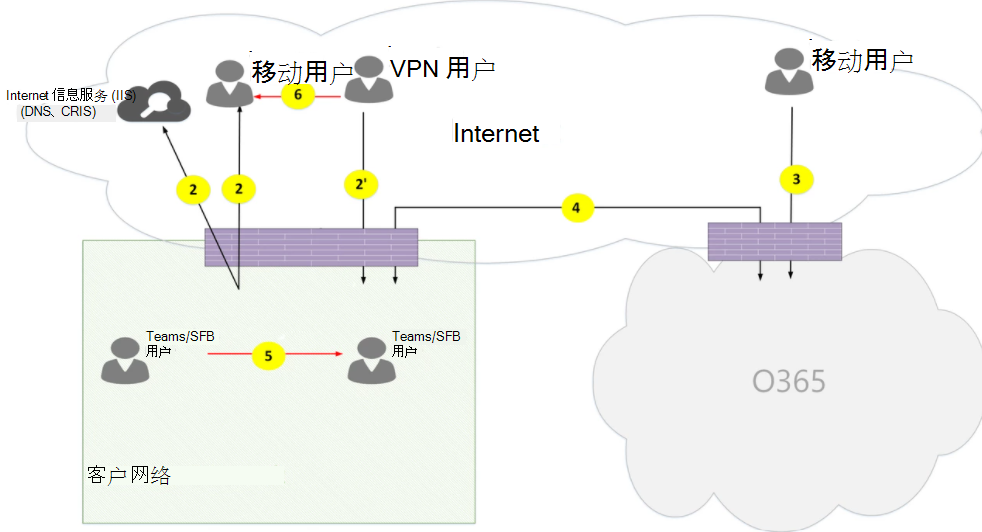
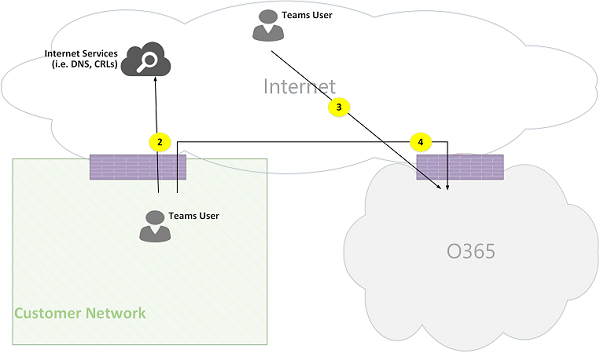
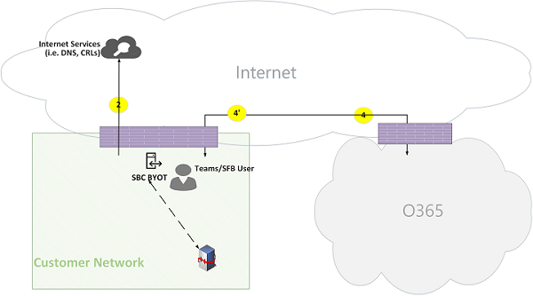
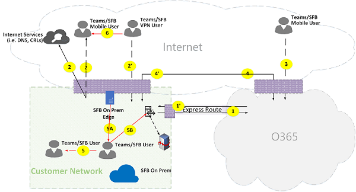

# Microsoft Teams 通话流程

> [!TIP]
> 观看此会话，了解如何Teams网络以及如何规划最佳网络连接：Teams[规划](https://aka.ms/teams-networking)。

## 概述

本文介绍如何Teams拓扑Microsoft 365 Office 365调用流。 此外，还介绍了Teams媒体通信的唯一流。 本文档介绍这些流及其用途，以及网络上流的来源和终止。 出于本文的目的，假设以下各项：

- Flow本地客户端使用 X 与云中的Microsoft 365 Office 365服务通信。 它源自客户网络，在客户端或客户端中终止Microsoft 365 Office 365。

- FlowY 由本地客户端用来与 Internet 上依赖于Microsoft 365或Office 365的服务通信。 它源自客户网络，在 Internet 上终止为终结点。

本文介绍以下信息：

- **背景**。 提供背景信息，例如流可能遍历的网络、流量类型、从客户网络到 Microsoft 365 或 Office 365 服务终结点的连接指南、第三方组件的互操作性，以及 Teams 用于选择媒体流的原理。

- **调用各种拓扑中的流**。 演示如何在各种拓扑中使用调用流。 对于每个拓扑，该部分枚举所有受支持的流，并说明如何在几个用例中使用这些流。 对于每个用例，它使用流程图描述流的序列和选择。

- **Teams Express Route 优化 。** 介绍部署 Express Route 进行优化时如何使用这些流，使用简单的拓扑进行演示。

## 背景

### 网段

**客户网络**。 这是您控制和管理的网络段。 这包括客户办公室内的所有客户连接，无论是有线连接还是无线连接、办公大楼间的连接、与本地数据中心的连接，以及 Internet 提供商、Express Route 或其他任何专用对等互连的连接。

通常，客户网络具有多个网络边界，防火墙和/或代理服务器强制实施组织的安全策略，并且仅允许已设置和配置的某些网络流量。 由于你管理此网络，因此你可以直接控制网络的性能，我们建议你完成网络评估，以验证网络中站点内部的性能，以及从网络到 Microsoft 365 或 Office 365 网络的性能。

**Internet。** 这是属于整个网络的一部分的网络段，由从客户网络外部连接到 Microsoft 365 或 Office 365的用户使用。 它还会由客户网络发来的流量用于Microsoft 365 Office 365。

**访问的或来宾专用网络**。 这是客户网络外部（而不是公共 Internet）中的网络段，用户及其来宾可能会访问 (，例如，家庭专用网络或企业专用网络（不部署 Teams，用户及其与 Teams 服务交互的客户可能驻留在) 中。

> [!NOTE]
> 与 Microsoft 365 或 Office 365 的连接也适用于这些网络。

**Microsoft 365 或 Office 365。** 这是支持服务或Microsoft 365 Office 365段。 它分布在世界各地，在大多数位置具有靠近客户网络的边缘。 函数包括传输中继、会议服务器和媒体处理器。

**Express Route (可选) 。** 这是整个网络的一部分网络段，可让你与虚拟网络或Microsoft 365专用Office 365连接。

### 流量类型

**实时媒体**。 支持音频、视频和屏幕共享工作负荷 (RTP) 中封装的数据。 通常，媒体流量对延迟高度敏感，因此，你可能希望此流量采用尽可能最直接的路径，并使用 UDP 与 TCP 作为传输层协议，这是从质量角度对交互式实时媒体的最佳传输。  (请注意，作为最后手段，媒体可以使用 TCP/IP，并且也会在 HTTP 协议内进行隧道传输，但由于质量影响不佳，不建议这样做。) RTP 流使用 SRTP 进行保护，其中只加密有效负载。

**发出信号**。 客户端与服务器或其他客户端之间的通信链接，用于控制活动 (例如，当发起呼叫时) 发送即时消息。 大多数信令流量使用基于 HTTPS 的 REST 接口，但在某些情况下 (例如，Microsoft 365 或 Office 365 与会话边界控制器) 它使用 SIP 协议。 必须了解，此流量对延迟不太敏感，但如果终结点之间的延迟超过几秒，则可能会导致服务中断或调用超时。

### 连接到 Microsoft 365 或 Office 365

Teams需要[连接到 Internet。](/office365/enterprise/assessing-network-connectivity) Teams URL 和 IP 地址范围中列出了Office 365 [URL 和 IP 地址范围](/office365/enterprise/urls-and-ip-address-ranges)。  (请注意，需要打开到 TCP 端口 80 和 443 以及到 UDP 端口 3478 到 3481 的连接。) 此外，Teams 依赖于 Skype for Business Online，这还必须连接到 Internet。

Teams IETF Interactive Connectivity Establishment (ICE) 实现媒体流连接。

### 互操作性限制

**第三方媒体中继**。 一Teams媒体 (，即其中一个媒体终结点Teams) 只能遍历Teams或Skype for Business媒体中继。 不支持第三方媒体中继的互操作性。  (PSTN 边界上的第三方 SBC 必须终止使用 SRTP 保护的 RTP/RTCP 流，而不是中继到下一跃点.) 

**第三方 SIP 代理服务器**。 使用Teams SBC 和/或网关发送 SIP 信号的网关可能会遍历Teams或Skype for Business SIP 代理。 不支持第三方 SIP 代理的互操作性。

**第三方 B2BUA (或 SBC) 。** 与Teams PSTN 之间的媒体流由第三方 SBC 终止。 但是，不支持在 Teams 网络 (内与第三方 SBC 的互操作性Teams或 Skype for Business 终结点) 。

### 不建议使用 Microsoft Teams

**VPN 网络**。 不建议对媒体流量进行 (流 2 的) 。 VPN 客户端应该使用拆分隧道，Teams外部非 VPN 用户一样路由媒体流量，如允许 Lync 媒体绕过 VPN 隧道[中指定](https://techcommunity.microsoft.com/t5/Skype-for-Business-Blog/Enabling-Lync-Media-to-Bypass-a-VPN-Tunnel/ba-p/620210)。

> [!NOTE]
> 尽管游戏指示 Lync，但它也适用于Teams Lync。

**数据包形状。** 对于媒体流量，不建议使用任何类型的数据包捕获器、数据包检查或数据包Teams设备，并且可能会显著降低质量。

### 原则

有四个一般性原则可帮助你了解以下Microsoft Teams：

- 会议Microsoft Teams由第一Microsoft 365 Office 365参与者加入的同一区域主持。  (请注意，如果某些拓扑存在此规则例外，本文档中将介绍这些异常，并按相应的调用流.) 

- Teams或Microsoft 365媒体Office 365基于媒体处理需求使用，而不是基于呼叫类型。  (例如，点到点呼叫可以使用云中的媒体终结点处理媒体进行听录或录制，而具有两个参与者的会议可能不会使用云中的任何媒体终结点。) 但是，大多数会议将使用媒体终结点进行混合和路由，而该终结点是会议托管位置分配的。 由于客户网络防火墙限制，从客户端发送到媒体终结点的媒体流量可以直接路由或使用 Microsoft 365 或 Office 365 中的传输中继。

- 点对点呼叫的媒体流量采用最直接的可用路由，假设该调用不强制云中的媒体终结点 (请参阅前面的原则) 。 首选路由将直接路由到远程对等 (客户端) ，但如果该路由不可用，则一个或多个传输中继将中继流量。 建议媒体流量不要转置数据包形状器、VPN 服务器等服务器，因为这会影响媒体质量。

- 信令流量始终会转到离用户最近的服务器。

若要了解有关所选媒体路径的详细信息，请参阅了解媒体流Microsoft Teams - [BRK4016。](https://www.youtube.com/watch?v=1tmHMIlAQdo)

## 各种拓扑中的调用流

### Teams拓扑

此拓扑由利用云中Teams服务的客户使用，无需任何本地部署，例如直接路由Skype for Business Server电话系统路由。 此外，无需 Azure Express Route 即可Microsoft 365或Office 365的接口通过 Internet 完成。

*图 1 - Teams拓扑*

请注意：

- 上图中箭头的方向反映影响企业外围连接的通信的启动方向。 对于媒体的 UDP，第一 (数据包) 可能会反向流动，但这些数据包可能会被阻止，直到其他方向的数据包流动。
- Teams与 Skype for Business Online 并排部署，因此客户端显示为"Teams/SFB 用户"。

可以在本文的稍后部分找到有关以下可选拓扑详细信息：

- Skype for Business混合拓扑 中介绍了 **Teams部署**。
- 电话系统PSTN (直接路由) 使用直接路由Teams **中所述**。
- Express Route 在快速Teams **中进行了介绍**。

**Flow说明**：

- **Flow 2** – 表示客户网络上用户启动到 Internet 的流，作为用户体验的一Teams部分。 这些流的示例包括 DNS 和对等媒体。
- **Flow 2'** – 表示由远程移动用户启动Teams，使用 VPN 到客户网络的流。
- **Flow 3** – 表示由远程移动用户启动Teams到Microsoft 365终结点Office 365/Teams流。
- **Flow 4** – 表示客户网络上用户启动的流，Microsoft 365或Office 365/Teams终结点。
- **Flow 5** – 表示客户网络中 Teams 用户与另一Teams或Skype for Business用户之间的对等媒体流。
- **Flow 6** – 表示远程移动用户与另一个远程移动用户Teams远程移动用户或Teams或Skype for Business用户之间的对等媒体流。

#### 用例：一对一

一对一调用使用通用模型，调用方将获取一组候选项，其中包括 IP 地址/端口，包括客户端的本地、中继和反身 (公共 IP 地址，如中继候选) 所见。 调用方将这些候选者发送到被调用方;被调用方还会获取一组类似的候选项，并将其发送给调用方。 STUN 连接性检查消息用于查找哪些调用方/被呼叫方媒体路径工作，并且选择了最佳工作路径。 媒体 (，即使用 SRTP 保护的 RTP/RTCP) 使用所选候选对发送。 传输中继部署为 Microsoft 365 和 Office 365。

如果本地 IP 地址/候选端口或反身候选项具有连接性，则客户端之间的直接路径 (或者使用 NAT) 媒体。 如果客户端都位于客户网络上，应选择直接路径。 这需要在客户网络中建立直接 UDP 连接。 如果客户端都是云用户，则根据 NAT/防火墙，媒体可能会使用直接连接。

如果一个客户端位于客户网络内部，一个客户端是外部客户端 (例如移动云用户) ，则本地或反身候选者之间的直接连接不太可能正常工作。 在这种情况下，一个选项是使用来自任一客户端的传输中继候选项之一 (例如，内部客户端从 Microsoft 365 或 Office 365 中的传输中继候选项;外部客户端需要能够将 STUN/RTP/RTCP 数据包发送到传输中继) 。 另一个选项是内部客户端发送到移动云客户端获取的中继候选项。 请注意，尽管强烈建议建立媒体的 UDP 连接，但支持 TCP。

**高级步骤**：

1. Teams用户 A 使用流 2 (DNS) 解析 URL 域名。
1. Teams用户 A 使用流 4 在Teams中继上分配媒体中继端口。
1. Teams用户 A 使用流 4 向 ICE 候选项发送"邀请"Microsoft 365或Office 365。
1. Microsoft 365或Office 365使用流 4 Teams向用户 B 发送通知。
1. Teams用户 B 使用流 4 在Teams中继上分配媒体中继端口。
1. Teams用户 B 使用流 4 向 ICE 候选项发送"答案"，流 4 使用 Teams 4 转发Flow A。
1. Teams用户 A Teams用户 B 调用 ICE 连接测试，并且选择了最佳可用媒体路径 (请参阅下图了解各种用例) 。
1. Teams用户使用流 4 Microsoft 365或Office 365遥测数据。

**在客户网络中：**

*图 2 - 在客户网络中*

在步骤 7 中，选择"对等媒体流 5"。

媒体是双向的。 流 5 的方向指示一端从连接角度启动通信，与本文档中所有流一致。 在这种情况下，使用哪个方向并不重要，因为两个终结点都位于客户网络中。

**客户网络与外部用户 (传输中继中继Teams媒体) ：**

*图 3 - 客户网络与外部用户 (中继中继Teams媒体)*

在步骤 7 中，选择从客户网络到 Microsoft 365 或 Office 365 的流 4，以及从远程移动 Teams 用户到 Microsoft 365 或 Office 365 的流 3。 这些流由 Teams 或 Microsoft 365 内的传输中继Office 365。

媒体是双向的，其中方向指示哪个端从连接角度启动通信。 在这种情况下，这些流用于信令和媒体，使用不同的传输协议和地址。

**客户网络与外部用户 (媒体) ：**

*图 4 - 客户网络与外部用户 (媒体)*

在步骤 7 中，将选择"流 2"，即从客户网络 (客户端对等) Internet。

- 使用远程移动用户直接 (不通过 Microsoft 365 或 Office 365) 中继是可选的。 换言之，客户可能会阻止此路径，以通过传输中继在 Microsoft 365 或 Office 365。

- 媒体是双向的。 流 2 到远程移动用户的方向指示一端从连接角度启动通信。

**VPN 用户到内部用户 (中继中继Teams媒体)**

*图 5 - VPN 用户到内部用户 (中继中继Teams媒体)*

VPN 与客户网络之间的信号发送使用的是流 2'。 客户网络与客户网络Microsoft 365或Office 365之间的信号Office 365流 4。 但是，媒体绕过 VPN，使用流 3 和流 4 通过Teams或媒体中继Microsoft 365 Office 365。

**VPN 用户到内部用户 (媒体)**

*图 6 - VPN 用户到内部用户 (媒体)*

VPN 与客户网络之间的信号发送使用的是流 2'。 客户网络与客户网络Microsoft 365或Office 365之间的信号Office 365流 4。 但是，媒体绕过 VPN，使用流 2 从客户网络路由到 Internet。

媒体是双向的。 流 2 到远程移动用户的方向指示一端从连接角度启动通信。

**VPN 用户到外部用户 (媒体)**

*图 7 - VPN 用户到外部用户 (媒体)*

VPN 用户与客户网络之间的信令使用流 2'，使用流 4 Microsoft 365或Office 365。 但是，媒体绕过 VPN，并且使用流 6 进行路由。

媒体是双向的。 流 6 到远程移动用户的方向指示一端从连接角度启动通信。

#### 用例：Teams中继Microsoft 365 PSTN Office 365 PSTN

Microsoft 365和Office 365具有电话系统，允许从 PSTN 公用电话交换网和 PSTN (接听) 。 如果 PSTN 中继使用呼叫电话系统连接，则此用例没有特殊的连接要求。  (如果要将自己的本地 PSTN 中继连接到 Microsoft 365 或 Office 365，可以使用 电话系统 Direct Routing.) 

*图 8 - Teams通过中继Office 365 PSTN*

#### 用例：Teams会议

VBSS 会议 (的音频/视频/屏幕) 共享是Microsoft 365 Office 365。 它拥有一个公共 IP 地址，该地址必须从客户网络访问，并且必须从 Nomadic 云客户端访问。 每个客户端/终结点都需要能够连接到会议服务器。

内部客户端将像一对一调用所述一样获取本地、反身和中继候选项。 客户将在邀请中将这些候选者发送到会议服务器。 会议服务器不使用中继，因为它具有可公开访问的 IP 地址，因此它使用其本地 IP 地址候选项进行响应。 客户端和会议服务器以一对一呼叫中所述的相同方式检查连接。

请注意：

- Teams无法加入Skype for Business会议，Skype for Business无法加入Teams会议。

- PSTN 用户可选择"拨入"或"拨出"，具体取决于会议的组织者 PSTN 呼叫和/或会议预配。

- 来宾用户或客户用户可以从来宾专用网络加入，该网络通过严格的规则使用 FW/NAT 进行保护。

*图 9 - Teams 会议*

#### 用例：与本地Skype for Business联合

**通过媒体传输中继Teams或Microsoft 365中继Office 365**

*图 10 - 由 Teams 传输中继中继的Office 365*

请注意：

- 根据定义，联合身份验证是两个租户之间的通信。 在这种情况下，使用 Teams 的租户 A Skype for Business B 联合。 如果租户 B 也使用 Microsoft 365 或 Office 365，则 Skype for Business 客户端会使用流 3 与 Microsoft 365 或 Office 365。

- 从联合客户端Skype for Business到本地Skype for Business Server信号和媒体超出了本文档的范围。 但是，为了清楚起见，此处说明了这一点。

- 网关Teams Skype for Business之间发出信号。

- 在这种情况下，媒体使用流 4 Teams传输中继中继到客户网络和Skype for Business客户端。

**由联合租户Skype for Business媒体中继的媒体**

*图 11 - 联合租户Skype for Business媒体中继的媒体*

请注意：

- 从联合客户端Skype for Business到本地客户端Skype for Business Server信号和媒体超出了本文档的范围。 但是，为了清楚起见，此处说明了这一点。

- 网关Teams Skype for Business网关之间的信令。

- 在这种情况下，媒体使用流 2 Skype for Business本地媒体中继中继到客户网络。  (请注意，从 Teams 用户发到联合客户网络中远程媒体中继的流量最初将被媒体中继阻止，直到反向的流量开始流动。 但是，双向流将在两个方向打开连接。) 

**直接 (对等)**

*图 12 - (直接对等)*

### Teams混合拓扑

此拓扑包含Teams本地Skype for Business的拓扑。

*图 13 - Teams混合拓扑*

- 上图中箭头的方向反映影响企业外围连接的通信的启动方向。 对于媒体的 UDP，第一个数据包 () 可能会反向流动，但可能会阻止这些数据包，直到其他方向的数据包流动。

- Teams与 Skype for Business Online 并排部署，因此客户端显示为"Teams/SFB 用户"。

基于 (拓扑的其他Teams流) ：

- **Flow 5A** – 表示客户网络中 Teams 用户与客户网络边缘的 Skype for Business 本地媒体中继之间的对等媒体流。

#### 用例：Teams Skype for Business一对一

**客户网络内的混合**

*图 14 - 客户网络内部的混合*

网关Teams Skype for Business之间发出信号。 但是，媒体使用流 5 直接在客户网络中点对点路由。

**与外部用户Skype for Business混合客户网络 – 由Microsoft 365或Office 365**

*图 15 - 具有外部用户Skype for Business混合客户网络 - 由 Office 365*

请注意：

- 从客户端Skype for Business到本地客户端Skype for Business Server信号和媒体超出了本文档的范围。 但是，为了清楚起见，此处说明了这一点。

- 网关Teams Skype for Business之间发出信号。

- 媒体通过流 4 Teams传输中继中继到客户网络。

**与外部用户Skype for Business混合客户网络 – 由本地 Edge 中继**

*图 16 - 具有外部用户Skype for Business混合客户网络 - 由本地 Edge 中继*

请注意：

- 从客户端Skype for Business到本地客户端Skype for Business Server信号和媒体超出了本文档的范围。 但是，为了清楚起见，此处说明了这一点。

- 信号由网关桥接。

- 媒体通过本地 Edge Skype for Business媒体中继Skype for Business，以Teams 5A 在客户网络中与用户通信。

### Teams直接电话系统拓扑

此拓扑包括Teams直接电话系统的拓扑。

直接路由：通过将受支持的本地客户拥有的会话边界控制器 (SBC) 硬件设备与 Microsoft 365 或 Office 365 配对，然后将电话中继连接到该设备，使用第三方公用电话交换网 (PSTN) 服务提供商。

若要支持此方案，客户必须部署 Microsoft 的认证合作伙伴之一的经认证的 SBC 进行直接路由。 SBC 必须按照供应商的建议进行配置，并且对于直接 UDP 流量，Microsoft 365 Office 365路由。 媒体可以直接从 Teams 和/或 Skype for Business 客户端流向 SBC (绕过 Teams 网关) 或遍历 Teams 网关。 当中继配置为绕过 Teams 网关时，与 SBC 的连接基于 ICE，其中 SBC 支持 ICE-Lite，而 Teams/Skype for Business 媒体终结点支持 ICE 完整形式。

*图 17 - Teams直接电话系统拓扑

请注意：

- 上图中箭头的方向反映影响企业外围连接的通信的启动方向。 对于媒体的 UDP，第一个数据包 () 可能会反向流动，但可能会阻止这些数据包，直到其他方向的数据包流动。

- Teams与 Skype for Business Online 并排部署，因此客户端显示为"Teams/SFB 用户"。

其他流 (联机拓扑Teams附加) ：

- **Flow 4'** - 表示从 Microsoft 365 或 Office 365 到客户网络的流，用于在云中的 Teams 媒体服务器与本地 SBC 建立连接。
- **Flow 5B** - 表示客户网络中直接路由 SBC Teams直接路由 SBC 的用户之间的媒体流。
- **Flow 5C** – 表示 PSTN hairpin 呼叫绕过模式下直接路由 SBC 到另一个直接路由 SBC 之间的媒体流。

**具有直接路由的内部用户 (传输中继Teams中继)**

*图 18 - 具有直接路由的内部用户 (传输中继Teams中继)*

请注意：

- SBC 必须具有一个公共 IP 地址，该地址从 Microsoft 365 或 Office 365。

- 从 SBC 发信号和媒体Microsoft 365或Office 365反之亦然，使用流 4 和/或流 4'。

- 从客户网络内的客户端发出信号和媒体，Microsoft 365或Office 365流 4。

**使用直接路由的远程 (媒体通过媒体服务器和 MP (路由) )**

*图 19 - 使用直接路由 (媒体的远程用户通过媒体服务器 (MP) )*

请注意：

- SBC 必须具有一个公共 IP 地址，该地址从 Microsoft 365 或 Office 365。

- 从 SBC 发信号和媒体Microsoft 365或Office 365反之亦然，使用流 4 和/或流 4'。

- 从 Internet 上的客户端发出信号和媒体以Microsoft 365或Office 365流 3。

**内部用户直接路由 (绕过媒体)**

*图 20 - 内部用户直接路由 (绕过媒体)*

请注意：

- SBC 必须具有一个公共 IP 地址，该地址从 Microsoft 365 或 Office 365。

- 从 SBC 发Microsoft 365或Office 365，反之亦然，使用流 4 和/或流 4'。

- 从客户网络内的客户端发出信号Microsoft 365或Office 365流 4。

- 从客户网络内的客户端到客户网络内的 SBC 的媒体使用流 5B。

**使用直接路由的远程用户 (传输中继Teams媒体旁路)**

*图 21 - 使用直接路由的远程用户 (传输中继中继Teams媒体旁路)*

请注意：

- SBC 必须具有一个公共 IP 地址，该地址从 Microsoft 365 或 Office 365 Internet 进行路由。

- 从 SBC 发信号Microsoft 365或Office 365反之亦然，使用流 4 和/或流 4'。

- 从 Internet 上的客户端发出信号以Microsoft 365或Office 365流 3。

- 从 Internet 上的客户端到客户网络中 SBC 的媒体使用流 3 和流 4，由 Teams中继。

**远程用户直接路由 (绕过媒体直接)**

*图 22 - 远程用户直接路由 (媒体旁路直接)*

请注意：

- SBC 必须具有一个公共 IP 地址，该地址从 Microsoft 365 或 Office 365 Internet 进行路由。

- 从 SBC 发出信号Microsoft 365或Office 365反之亦然，使用流 4 和/或流 4'。

- 从 Internet 上的客户端发出信号以Microsoft 365或Office 365流 3。

- 从 Internet 上的客户端到客户网络中 SBC 的媒体使用流 2。

**直接路由 (媒体旁路) – PSTN (由于呼叫转接/转接)**

*图 23 - 直接路由 (媒体旁路) - PSTN (由于呼叫转接/转接)*

请注意：

- SBC 必须具有一个公共 IP 地址，该地址从 Microsoft 365 或 Office 365。

- 从 SBC 发出信号Microsoft 365或Office 365反之亦然，使用流 4 和/或流 4'。

- 将呼叫从 PSTN 固定到 PSTN 后，客户端将退出信号和媒体循环。

- 从客户网络内的 SBC 实例 A 到客户网络内 SBC 实例 B 的媒体 (其中，A 和 B 可以是使用流 5C 的) 实例。

**直接路由 (通过 Microsoft 365 或 Office 365) - 跨两个租户的 PSTN hairpin 呼叫**

*图 24 - 直接路由 (通过 Microsoft 365 或 Office 365) - 跨两个租户的 PSTN hairpin 呼叫*

请注意：

- SBC 必须具有一个公共 IP 地址，该地址从 Microsoft 365 或 Office 365。

- 从 SBC 发出信号Microsoft 365或Office 365反之亦然，使用流 4 和/或流 4'。

- 将呼叫从 PSTN 固定到 PSTN 后，客户端将退出信号和媒体循环。

- 客户网络 X 中的 SBC 实例 A 到 SBC 实例 B 的媒体必须通过 Microsoft 365 或 Office 365 媒体服务器中继，并且不能使用绕过模式。

## Teams快速路由优化

*图 25 - Teams快速路由优化*

在两端对齐并部署 Express Route 的情况下，Teams流从流 4 重新路由到流 1，从流 4'重新路由到流 1'。 但是，Teams应用程序依赖于使用流 4 和Microsoft 365 4'Office 365 Internet 上流的其他流或流;因此，不得阻止这些流。

请注意，Skype for Business混合边缘流量路由到 Internet，而不是路由到 Express Route，以便与外部用户通信并与其他租户联合。

为了防止非对称流，重新路由必须同时朝两个方向进行。 换言之，客户网络内的地址可以基于优化通过 Internet 或 Express Route 进行路由，但不能同时通过两者。

**客户网络与外部用户 (传输中继中继Teams媒体) ：**

*图 26 - 客户网络与外部用户 (传输中继Teams媒体)*

**高级步骤：**

1. Teams客户网络内的用户使用 flow2 解析 DNS () 域名。
1. Teams客户网络内的用户使用流 1 在 Teams 传输中继上分配媒体中继端口。
1. Teams客户网络内的用户使用流 1 将"邀请"与 ICE 候选项一起发送到Microsoft 365或Office 365。
1. Microsoft 365或Office 365使用流 3 Teams向外部用户发送通知。
1. Teams使用流 3 在 Teams 传输中继上分配媒体中继端口。
1. Teams使用流 3 向 ICE 候选项发送"答案"，使用流 1 将Teams转发Flow A。
1. Teams用户 A Teams用户 B 调用 ICE 连接测试，并选择流 1 和流 3，它们由 Teams中继。
1. Teams用户使用流 1 和Microsoft 365 Office 365向用户或用户发送遥测数据。

> [!NOTE]
> Flow 4 必须启用，以支持应用程序Teams依赖于要求流 4 的其他微服务。
