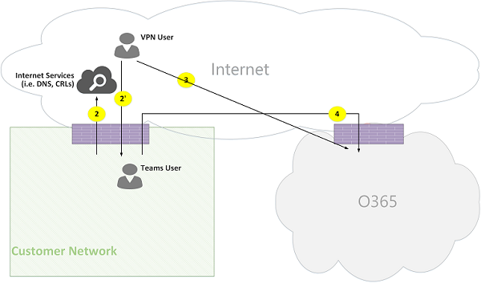

# Microsoft 团队呼叫流Microsoft Teams call flows

> [!Tip]
> 观看以下会话，从而了解团队如何利用您的网络，以及如何规划最佳的网络连接：[团队网络规划](https://aka.ms/teams-networking)Watch the following session to learn how Teams leverages your network and how to plan for optimal network connectivity: [Teams Network Planning](https://aka.ms/teams-networking)

## 概述Overview
本文介绍团队使用 Office 365 如何在各种拓扑中呼叫流。This article describes how Teams uses Office 365 call flows in various topologies. 此外，它介绍了用于对等媒体通信的唯一团队流。In addition, it describes unique Teams flows that are used for peer-to-peer media communication. 文档在网络上介绍这些流程，其目的，及其原点和终止。The document describes these flows, their purpose, and their origin and termination on the network. 出于本文，假定以下几点：For purposes of this article, assume the following:

- 流 X 使用内部部署 Office 365 客户端与 Office 365 服务在云中进行通信。Flow X is used by the on-premises Office 365 client to communicate with the Office 365 service in the cloud. 来自客户网络，并作为 Office 365 中的终结点终止。It originates from the customer network, and it terminates as an endpoint in Office 365.

- 流 Y 使用内部部署 Office 365 客户端与 Office 365 具有依赖项 Internet 上的服务进行通信。Flow Y is used by the on-premises Office 365 client to communicate with a service on the Internet that Office 365 has a dependency on. 来自客户网络，并为 Internet 上的终结点终止。It originates from the customer network, and it terminates as an endpoint on the Internet.

本文包含以下各节：The article contains the following sections:

- **背景**-提供背景信息，如网络的 Office 365 流可能遍历，通信、 连接到 Office 365 服务终结点的客户网络、 与第三方组件互操作性指南的类型和团队用于选择媒体流的原则。**Background** - Provides background information, such as networks that Office 365 flows may traverse, type of traffic, connectivity guidance from the customer network to Office 365 service endpoints, interoperability with third-party components, and principles that are used by Teams to select media flows.

- **调用各种拓扑中的流程**-演示如何使用各种拓扑中的呼叫流。**Call flows in various topologies** - Illustrates the use of call flows in various topologies. 为每个拓扑，部分枚举所有受支持的数据流，并说明了如何使用这些流程通过多个用例。For each topology, the section enumerates all supported flows and illustrates how these flows are used via several use cases. 对于每个用例，它介绍顺序以及选择通过流程图的流。For each use case, it describes the sequence and selection of flows via a flow diagram. 

- **团队和 Express 路由优化**-介绍用于优化，通过简单拓扑中说明了部署 Express 路由时如何使用这些流程。**Teams with Express Route optimization** - Describes how these flows are used when Express Route is deployed for optimization, illustrated via a simple topology.

## 背景Background
### 网络段Network segments
**客户网络**： 这是网络段的控制和管理。**Customer network**: This is the network segment that you control and manage. 这包括客户办公室内的所有客户连接是否有线或无线，办公楼到本地数据中心之间的连接到 Internet 提供程序、 Express 路由或任何其他专用对等。This includes all customer connections within customer offices, whether wired or wireless, between office buildings, to on-premises datacenters, and your connections to Internet providers, Express Route, or any other private peering. 

通常情况下，客户网络具有多个网络外围防火墙和/或代理服务器，其强制实施组织的安全策略，以及仅允许您已设置和配置的某些网络流量。Typically, a customer network has several network perimeters with firewalls and/or proxy servers, which enforce your organization's security policies, and that only allow certain network traffic that you have set up and configured. 由于管理此网络，您可以直接控制的网络，性能，强烈建议您完成网络评估，以验证从您的网络到 Office 365 网络中的网络和网站中的性能。Because you manage this network, you have direct control over the performance of the network, and it is highly recommended that you complete network assessments to validate performance both within sites in your network and from your network to the Office 365 network. 

**Internet**： 这是客户网络外部连接到 Office 365 中的用户将使用您整个网络一部分的网络段。**Internet**: This is the network segment that is part of your overall network that will be used by users who are connecting to Office 365 from outside of the customer network. 它还使用到 Office 365 客户网络一些流量。It is also used by some traffic from the customer network to Office 365. 

**已访问/来宾专用网络**： 这是外部客户网络，但不能在公用 Internet，也可以访问您的用户和/或其来宾的网络段。**Visited/Guest private network**: This is the network segment outside your customer network, but not in the public Internet, that your users and/or their guests may visit. 例如，主专用网络或企业版专用网络的不部署团队，可能位于您的用户和/或其与团队服务进行交互的客户。For example, home private network or an Enterprise private network, that does not deploy Teams, where your users and/or their customers that interact with Teams services may reside.

>**注意**： 连接到 Office 365 也是适用于这些网络。**Note**: Connectivity to Office 365 is also applicable to these networks.

**Office 365**： 这是支持 Office 365 服务的网络段。**Office 365**: This is the network segment that supports Office 365 services. 它与接近大多数位置中的客户网络中的边缘世界各地分布。It is distributed worldwide with edges in proximity to the customer network in most locations. 本文档中提到的功能包括传输中继、 会议服务器和媒体处理器。Functions mentioned in this document include Transport Relay, conferencing server, and Media Processor. 

**Express 路由 （可选）**： 这是您将为您提供专用的专用连接到 Office 365 网络的总体网络一部分的网络段。**Express Route (optional)**: This is the network segment that is part of your overall network that will give you a dedicated, private connection to the Office 365 network.

### 类型的通信Types of traffic

**实时媒体**： 封装在支持音频、 视频和屏幕共享工作负荷的 RTP （实时传输协议） 的数据。**Real-time media**: Data encapsulated within RTP (Real-time Transport Protocol) that supports audio, video and screen sharing workloads. 一般情况下，媒体流量是高延迟敏感的因此您希望采用的最直接路径可能，并使用 UDP 和 TCP 作为传输层协议，它是最佳传输质量角度从交互式实时媒体此通信.In general, media traffic is highly latency sensitive, so you would want this traffic to take the most direct path possible, and to use UDP versus TCP as the transport layer protocol, which is the best transport for interactive real time media from a quality perspective. (注意： 媒体作为最后的手段，可以使用 TCP/IP 和还隧道 HTTP 协议内，但不是建议由于错误质量影响。)通过 SRTP，只对负载用于加密被安全 RTP 流。(Note: As a last resort, media can use TCP/IP and also be tunneled within the HTTP protocol, but it is not recommended due to bad quality implications.) RTP flow is secured via SRTP, in which only the payload is encrypted.

**信号**： 客户端和服务器或用于控制活动 （例如，当发起呼叫），其他客户端之间的通信链接和提供即时消息。**Signaling**: The communication link between the client and server, or other clients that are used to control activities (for example, when a call is initiated), and deliver instant messages. 最信号流量使用了基于 HTTPS 的 REST 接口，但在某些情况下 （例如，Office 365 和会话边界控制器之间的连接），它使用 SIP 协议。Most signaling traffic uses the HTTPS-based REST interfaces, though in some scenarios (for example, connection between Office 365 and a Session Border Controller) it uses SIP protocol. 务必要了解此通信是这么对延迟敏感，但可能会导致服务中断或呼叫超时，如果终结点之间的延迟超过几秒钟的时间。It's important to understand that this traffic is much less sensitive to latency but may cause service outages or call timeouts if latency between the endpoints exceeds several seconds. 

### 连接到 Office 365Connectivity to Office 365

团队需要[连接到 Internet](https://support.office.com/article/connectivity-to-the-internet-64b420ef-0218-48f6-8a34-74bb27633b10)。Teams requires [connectivity to the Internet](https://support.office.com/article/connectivity-to-the-internet-64b420ef-0218-48f6-8a34-74bb27633b10). [Office 365 Url 和 IP 地址范围](https://docs.microsoft.com/office365/enterprise/urls-and-ip-address-ranges)中列出了工作组终结点 Url 和 IP 地址范围。Teams endpoint URLs and IP address ranges are listed in [Office 365 URLs and IP address ranges](https://docs.microsoft.com/office365/enterprise/urls-and-ip-address-ranges). (注意： 打开连接到 TCP 端口 80 和 443，并且 UDP 端口通过 3481 3478 是必选。)此外，团队依赖 Skype 业务 online，其必须连接到 Internet。(Note: Open connectivity to TCP ports 80 and 443, and to UDP ports 3478 through 3481 is required.) Furthermore, Teams has a dependency on Skype for Business Online, which must also be connected to the Internet.

通过标准 IETF ICE （互动式连接建立） 过程中实现团队媒体流连接。Teams media flows connectivity is implemented via standard IETF ICE (Interactive Connectivity Establishment) procedures.

### 互操作性限制Interoperability restrictions
**第三方媒体中继**： 团队媒体流 （即，其中一个媒体端点是团队） 可能遍历仅团队或 Skype 的业务本机媒体中继。**Third party media relays**: A Teams media flow (that is, one of the media endpoints is Teams) may traverse only Teams or Skype for Business native media relays. 不支持与第三方媒体中继互操作性。Interoperability with a third party media relay is not supported. (注意： 与 PSTN 边界上的第三方 SBC 必须终止 RTP/RTCP 流，通过 SRTP 保护并不将其中继到下一个跃点。)(Note: A third party SBC on the boundary with PSTN must terminate RTP/RTCP stream, secured via SRTP, and not relay it to the next hop.)

**第三方 SIP 代理服务器**： 团队信号 SIP 对话与第三方 SBC 和/或网关可能的业务本机 SIP 代理遍历团队或 Skype。**Third party SIP proxy servers**: A Teams signaling SIP dialog with a third party SBC and/or gateway may traverse Teams or Skype for Business native SIP proxies. 不支持与第三方 SIP 代理互操作性。Interoperability with a third party SIP proxy is not supported.

**第三方 B2BUA (即，SBC)**： 由第三方 SBC 终止团队从/到 PSTN 的媒体流。**Third party B2BUA (that is, SBC)**: A Teams media flow from/to the PSTN is terminated by a third party SBC. 但是，与互操作性第三方 SBC 团队网络内 （即，第三方 SBC 作为两个团队/Skype 业务终结点） 不受支持。However, interoperability with a third party SBC within the Teams network (that is, a third party SBC mediates two Teams/Skype for Business endpoints) is not supported.

### 建议不要使用的 Microsoft 团队的技术Technologies that are not recommended with Microsoft Teams

**VPN 网络**： 不建议用于的媒体流量 （即，流 2）。**VPN network**: It is not recommended for media traffic (that is, flow 2'). VPN 客户端应使用中指定的拆分 VPN 和路由媒体流量的任何外部的非 VPN 用户，如https://blogs.technet.microsoft.com/nexthop/2011/11/14/enabling-lync-media-to-bypass-a-vpn-tunnel/。The VPN client should use split VPN and route media traffic like any external non-VPN user, as specified in https://blogs.technet.microsoft.com/nexthop/2011/11/14/enabling-lync-media-to-bypass-a-vpn-tunnel/.

>**注意**： 虽然标题为 Lync，它也适用于团队。**Note**: Although the title is Lync, it is applicable to Teams as well.

**数据包 shapers**： 任何类型的数据包 snippers、 数据包检查或数据包整形程序设备不建议使用，并且会显著可能会降低的质量。**Packet shapers**: Any kind of packet snippers, packet inspection, or packet shaper devices are not recommended and may degrade quality significantly. 

### 原则Principles
有四个一般原则，帮助您了解 Microsoft 团队的呼叫流：There are four general principles that help you understand call flows for Microsoft Teams:
 
1.  由 Office 365，其中第一个参与者加入同一区域中承载的 Microsoft 团队会议。A Microsoft Teams conference is hosted by Office 365 in the same region where the first participant joined. (注意： 如果将在某些拓扑中，此规则的例外，则将此文档中所述并由相应的呼叫流量所示。)(Note: If there will be exceptions to this rule in some topologies, then they will be described in this document, and illustrated by an appropriate call flow.)

2.  使用 Office 365 中的媒体终结点团队基于媒体处理需求，并不基于呼叫类型。A Teams media endpoint in Office 365 is used based on media processing needs and not based on call type. （例如，点对点呼叫可能用于媒体终结点到过程介质云中转录和/或时具有两个参与者的会议中不能使用任何媒体终结点云录制。）但是，大多数会议将用于混合和路由目的，分配承载会议使用媒体终结点。(For example, a point-to-point call may use a media endpoint in the cloud to process media for transcription and/or recording, while a conference with two participants may not use any media endpoint in the cloud.) However, most conferences will use a media endpoint for mixing and routing purposes, allocated where the conference is hosted. 从客户端发送到的媒体端点的媒体流量可能会直接路由或 Office 365 中使用传输中继，如果需要由于客户网络防火墙限制。The media traffic sent from a client to the media endpoint may be routed directly or use a Transport Relay in Office 365 if required due to customer network firewall restrictions. 

3.  媒体流量的对等呼叫发生不可用，假定呼叫不要求在云中的媒体终结点的最直接路由 （请参阅上面的 #2）。Media traffic for peer-to-peer calls take the most direct route that is available, assuming that the call doesn't mandate a media endpoint in the cloud (see #2 above). 首选的路由是直接连接到远程对等方 （客户端），但如果该路由不可用，然后一个或多个传输中继将通信中继。The preferred route is direct to the remote peer (client), but if that route isn't available, then one or more Transport Relays will relay traffic. 建议媒体流量应如数据包 shapers、 VPN 服务器和等等，不遍历服务器，因为这将影响的媒体质量。It is recommended that media traffic shall not transverse servers such as packet shapers, VPN servers, and so on, since this will impact the media quality.

4.  始终信号流量转到最近服务器向用户。Signaling traffic always goes to the closest server to the user. 

若要了解有关上选择的媒体路径的详细信息，请参阅https://www.youtube.com/watch?v=1tmHMIlAQdo。To learn more about the details on the media path that is chosen, see https://www.youtube.com/watch?v=1tmHMIlAQdo.

## 在不同拓扑中的呼叫流Call flows in various topologies
### 团队拓扑Teams topology
利用团队中不通过任何本地部署，如业务服务器或电话系统直接路由的 Skype 云的服务的客户使用这种拓扑。This topology is used by customers that leverage Teams services from the cloud without any on-premises deployment, such as Skype for Business Server or Phone System Direct Routing. 此外，通过不 Azure Express 路由 Internet 完成到 Office 365 的接口。In addition, the interface to Office 365 is done via the Internet without Azure Express Route. 

*图 1-团队拓扑**Figure 1 - Teams topology*

注意：Note that:

- 在上图上箭头的方向反映影响连接功能的企业外围环境的通信的初始方向。The direction of the arrows on the diagram above reflect the initiation direction of the communication that affects connectivity at the enterprise perimeters. 对于媒体 UDP，第一个数据包可能流的反向方向，但可能被阻止这些数据包，直到在其他方向的数据包将流。In the case of UDP for media, the first packet(s) may flow in the reverse direction, but these packets may be blocked until packets in the other direction will flow.
- 团队业务 online 部署并排 Skype，因此客户端显示为"团队/SFB 用户"。Teams is deployed side by side with Skype for Business Online, hence clients are displayed as "Teams/SFB user".

您可以更高版本一文中找到以下可选拓扑的详细信息：You can find more information on the following optional topologies later in the article:

- Skype for Business 的本地部署所述**团队混合拓扑**。Skype for Business on-premises deployment is described in **Teams  hybrid topology**.
- **使用直接路由拓扑的团队**中介绍了电话系统直接路由 （对于 PSTN 连接）。Phone System Direct Routing (for PSTN connectivity) is described in **Teams with Direct Routing topology**.
- Express 路由所述**使用 Express 路由优化的团队**。Express Route is described in  **Teams with Express Route optimization**.

**流说明**：**Flow descriptions**:
- **流 2** – 表示由客户网络到 Internet 上的用户启动的用户的工作组体验一部分流。**Flow 2** – Represents a flow initiated by a user on the customer network to the Internet as a part of the user's Teams experience. 这些流程的示例是 DNS 和对等媒体。Examples of these flows are DNS and peer-to-peer media.
- **流 2** – 表示的远程移动团队用户，具有到客户网络的 VPN 启动流。**Flow 2'** – Represents a flow initiated by a remote mobile Teams user, with VPN to the customer network. 
- **流 3** – 表示启动远程移动团队用户对 Office 365/Teams 终结点的流。**Flow 3** – Represents a flow initiated by a remote mobile Teams user to Office 365/Teams endpoints. 
- **流 4** – 表示启动客户网络到 Office 365/Teams 终结点上的用户的流量。**Flow 4** – Represents a flow initiated by a user on the customer network to Office 365/Teams endpoints.
- **流 5** – 表示客户网络内的业务用户团队用户与其他工作组或 Skype 之间的对等媒体流。**Flow 5** – Represents a peer-to-peer media flow between a Teams user and another Teams or Skype for Business user within the customer network.
- **流 6** – 表示通过 Internet 的远程移动团队用户和业务用户的另一个远程移动的团队或 Skype 之间的对等媒体流。**Flow 6** – Represents a peer-to-peer media flow between a remote mobile Teams user and another remote mobile Teams or Skype for Business user over the Internet.

#### 用例： 一对一Use case: One-to-one
一对一呼叫使用通用模型呼叫者将在其中获取一的 IP 地址/端口-包括本地、 中继和身 （公共 IP 地址的查看者中继的客户端） 的候选项组成的候选人。One-to-one calls use a common model in which the caller will obtain a set of candidates consisting of IP addresses/ports--including local, relay, and reflexive (public IP address of client as seen by the relay) candidates. 呼叫者发送到呼叫方; 这些候选人调用的方还获取一组类似的候选人，并将其发送到呼叫者。The caller sends these candidates to the called party; the called party also obtains a similar set of candidates and sends them to the caller. 邮件用来查找的调用方/调用方媒体路径起作用，STUN 连接检查和最佳工作路径处于选中状态。STUN connectivity check messages are used to find which caller/called party media paths work, and the best working path is selected. 然后，使用选定的候选对发送介质 （即，通过 SRTP 保护的 RTP/RTCP 数据包）。Media (that is, RTP/RTCP packets secured via SRTP) are then sent using the selected candidate pair. 传输中继部署作为 Office 365 的一部分。The Transport relay is deployed as part of Office 365.

如果本地 IP 地址/端口候选人或身候选人具有连接，然后将媒体选择直接路径客户端之间 （或通过 NAT）。If the local IP address/port candidates or the reflexive candidates have connectivity, then the direct path between the clients (or via a NAT) will be selected for media. 如果客户端都客户网络上，则应选择直接路径。If the clients are both on the customer network, then the direct path should be selected. 这需要客户网络内的直接 UDP 连接。This requires direct UDP connectivity within the customer network. 如果客户端这两个游牧云用户，然后根据 NAT/防火墙，媒体可能会使用直接连接。If the clients are both nomadic cloud users, then depending on the NAT/firewall, media may use direct connectivity.

如果一个客户端是内部客户网络上，一个客户端是外部 （例如，移动云用户），则不太可能之间的本地或身候选的直接连接是否正常工作。If one client is internal on the customer network and one client is external (for example, a mobile cloud user), then it is unlikely that direct connectivity between the local or reflexive candidates is working. 在这种情况下，选择是使用从任一客户端的传输中继候选之一 (例如，内部客户端从 Office 365 中的传输中继获取中继候选; 外部客户端需要能够发送到的 STUN/RTP/RTCP 数据包传输中继）。In this case, an option is to use one of the Transport Relay candidates from either client (for example, the internal client obtained a relay candidate from the Transport relay in Office 365; the external client needs to be able to send STUN/RTP/RTCP packets to the transport relay). 另一个选项是内部客户端将发送到移动云客户端获取中继候选。Another option is the internal client sends to the relay candidate obtained by the mobile cloud client. 请注意，但强烈建议 UDP 连接的媒体，支持使用 TCP。Note that, although UDP connectivity for media is highly recommended, TCP is supported.

**简要步骤**：**High-level steps**:
1. 团队需要用户 A 解析 URL 域 (DNS) 通过名 flow2Teams User A resolves URL domain name (DNS) via flow2
2. 团队用户 A 分配媒体中继端口团队传输中继上的通过流 4Teams User A allocates a media Relay port on Teams Transport Relay via flow 4
3. 团队需要用户 A 发送与通过流 4 到 Office 365 的 ICE 候选人"邀请"Teams User A sends "invite" with ICE candidates via flow 4 to Office 365
4. Office 365 将通知发送给团队用户 B，通过流 4Office 365 sends notification to Teams User B via flow 4
5. 团队用户 B 分配媒体中继端口团队传输中继上的通过流 4Teams User B allocates a media Relay port on Teams Transport Relay via flow 4
6. 团队用户 B 发送而被转接回通过流 4 的团队用户 A 的流 4，通过 ICE 候选人"应答"Teams User B sends "answer" with ICE candidates via flow 4, which is forwarded back to Teams User A via Flow 4
7. 团队用户 A 和团队用户 B 调用 ICE 连接测试和选择最佳可用的媒体路径 （的各种使用情况下，请参阅下面的图表）Teams User A and Teams User B invoke ICE connectivity tests and the best available media path is selected (see diagrams below for various use cases)
8. 团队用户发送到 Office 365 通过流 4 的遥测Teams Users send telemetry to Office 365 via flow 4

**客户网络： 中****Within customer network:**

*图 2-客户的网络内**Figure 2 - Within customer network*
 
在步骤 7 中，对等媒体流 5 处于选中状态。In step 7, peer-to-peer media flow 5 is selected.
 
媒体为双向。Media is bidirectional. 流 5 的方向指示一方启动从连接角度看，与本文档中的所有流一致的通信。The direction of flow 5 indicates that one side initiates the communication from a connectivity perspective, consistent with all the flows in this document. 在这种情况下，无论使用哪个方向，因为这两个终结点客户网络内部。In this case, it doesn't matter which direction is used because both endpoints are within the customer network.

**客户网络向外部用户 （媒体中继的团队传输中继）：****Customer network to external user (media relayed by Teams Transport Relay):**

*图 3-客户网络向外部用户 （媒体中继的团队传输中继）**Figure 3 - Customer network to external user (media relayed by Teams Transport Relay)*
 
在步骤 7 中，选择 4，从到 Office 365 客户网络和流 3，来自远程移动到 Office 365 的团队用户。In step 7, flow 4, from customer network to Office 365, and flow 3, from remote mobile Teams user to Office 365, are selected. 通过 Office 365 中的团队传输中继中继这些流程。These flows are relayed by Teams Transport Relay within Office 365.

媒体是双向，其中方向表示哪一侧启动从连接角度通信。Media is bidirectional, where direction indicates which side initiates the communication from a connectivity perspective. 在这种情况下，这些流程用于信号和媒体，通过不同的传输协议和地址。In this case, these flows are used for signaling and media, via different transport protocols and addresses.

**客户网络向外部用户 （直接媒体）：****Customer network to external user (direct media):**

*图 4-客户网络向外部用户 （直接媒体）**Figure 4 - Customer network to external user (direct media)*
 
在步骤 7 中，从 internet （客户端的对等） 的客户网络的流 2 中，处于选中状态。In step 7, flow 2, from customer network to Internet (client's peer), is selected.
- 与远程移动用户 （即，不通过 Office 365 中继） 的直接媒体是可选的。Direct media with remote mobile user (that is, not relayed through Office 365) is optional. 换句话说，客户可能会阻止此路径强制实施通过 Office 365 中的传输中继的媒体路径。In other words, customer may block this path to enforce a media path through Transport Relay in Office 365.

- 媒体为双向。Media is bidirectional. 到远程移动用户的流 2 的方向指示一方启动从连接角度的通信。The direction of flow 2 to remote mobile user indicates that one side initiates the communication from a connectivity perspective. 

**VPN 用户与内部用户 （媒体中继的团队传输中继）****VPN user to internal user (media relayed by Teams Transport Relay)**

*图 5-VPN 用户与内部用户 （媒体中继的团队传输中继）**Figure 5 - VPN user to internal user (media relayed by Teams Transport Relay)*
 
到客户网络 VPN 之间信号是通过流 2。Signaling between the VPN to the customer network is via flow 2'. 客户网络与 Office 365 之间信号是通过流 4。Signaling between the customer network and Office 365 is via flow 4. 但是，媒体绕过 VPN 和通过流 3 和 4 到 Office 365 中的团队媒体中继路由。However, media bypasses the VPN and is routed via flows 3 and 4 through Teams media relay in Office 365.

**VPN 用户与内部用户 （直接媒体）****VPN user to internal user (direct media)**

*图 6-VPN 用户与内部用户 （直接媒体）**Figure 6 - VPN user to internal user (direct media)*

到客户网络 VPN 之间信号是通过流 2。Signaling between the VPN to the customer network is via flow 2'. 客户网络与 Office 365 之间信号是通过流 4。Signaling between the customer network and Office 365 is via flow 4. 但是，媒体绕过 VPN 和路由通过流 2 来自客户网络到 Internet。However, media bypasses the VPN and is routed via flow 2 from the customer network to the Internet.

媒体为双向。Media is bidirectional. 到远程移动用户的流 2 的方向指示一方启动从连接角度的通信。The direction of flow 2 to the remote mobile user indicates that one side initiates the communication from a connectivity perspective.

**VPN 用户与外部用户 （直接媒体）****VPN user to external user (direct media)**

*图 7-VPN 用户与外部用户 （直接媒体）**Figure 7 - VPN user to external user (direct media)*

客户网络 VPN 用户之间信号是通过流 2，并通过流 4 到 Office 365。Signaling between the VPN user to the customer network is via flow 2' and via flow 4 to Office 365. 但是，媒体绕过 VPN 和通过流 6 路由。However, media bypasses VPN and is routed via flow 6.

媒体为双向。Media is bidirectional. 到远程移动用户的流 6 的方向指示一方启动从连接角度的通信。The direction of flow 6 to the remote mobile user indicates that one side initiates the communication from a connectivity perspective.

#### 通过 Office 365 中继的 pstn 的使用案例： 团队Use Case: Teams to PSTN through Office 365 Trunk
Office 365 具有允许发起和接收呼叫从公共公用电话交换网 (PSTN) 电话系统。Office 365 has a Phone System that allows placing and receiving calls from the Public Switched Telephone Network (PSTN). 如果通过电话系统调用规划所连接的 PSTN 中继，则使用本例没有特殊连接要求。If the PSTN trunk is connected via the Phone System Calling Plan, then there are no special connectivity requirements for this use case. （如果您想要连接到 Office 365 您自己的本地 PSTN 中继，您可以使用电话系统直接路由。）(If you want to connect your own on-premises PSTN trunk to Office 365, you can use Phone System Direct Routing.)

*图 8-通过 Office 365 中继的 PSTN 团队**Figure 8 - Teams to PSTN through Office 365 Trunk*

#### 使用案例： 团队会议Use Case: Teams Meeting

音频/视频/屏幕共享 (VBSS) 会议服务器是 Office 365 的一部分。The audio/video/screen sharing (VBSS) conferencing server is part of Office 365. 具有公共 IP 地址必须从客户网络上可以访问，必须将其从游牧云客户端访问。It has a public IP address that must be reachable from the customer network and must be reachable from a Nomadic Cloud client. 每个客户端/终结点需要能够连接到会议服务器。Each client/endpoint needs to be able to connect to the conferencing server.

内部客户端将获取本地、 身，和中继候选相同的方式，一对一呼叫所述。Internal clients will obtain local, reflexive, and relay candidates in the same manner as described for one-to-one calls. 客户端将邀请中的会议服务器发送这些候选人。The clients will send these candidates to the conferencing server in an invite. 会议服务器不使用中继，因为它具有一个公共可访问的 IP 地址，以便它使用其本地 IP 地址应聘者的响应。The conferencing server does not use a relay since it has a publicly reachable IP address, so it responds with its local IP address candidate. 客户端和会议服务器将检查连接一对一呼叫所述的方式相同。The client and conferencing server will check connectivity in the same manner described for one-to-one calls. 

注意：Note that:

- 团队客户端无法加入 Skype 业务会议和 Skype 业务客户端无法加入团队会议。Teams clients cannot join Skype for Business meetings, and Skype for Business clients cannot join Teams meetings.

- PSTN 用户 （可选）"拨打中"或"拨出"，具体取决于会议组织者 PSTN 呼叫和/或会议设置。A PSTN user optionally "Dials IN" or "Dialed OUT", depending on the meeting's organizer PSTN Calling and/or conferencing provisioning. 

- 来宾用户或客户的用户可以加入从来宾专用网络，其通过 FW/NAT 术 シ モ メ 严格的规则。A guest user or a customer user may join from a guest private network, which is protected via FW/NAT with strict rules.

*图 9-团队会议**Figure 9 - Teams Meeting*

#### 与 Skype 的本地业务的使用案例： 联盟Use Case: Federation with Skype for Business on premises

**媒体中继的 Office 365 中的团队传输中继****Media relayed by Teams Transport Relay in Office 365**

*图 10-媒体中继的 Office 365 中的团队传输中继**Figure 10 - Media relayed by Teams Transport Relay in Office 365*

注意：Note that:

- 根据定义，联合身份验证是两个租户之间的通信。Federation is, by definition, a communication between two tenants. 在这种情况下，租户，以使用团队，与租户 B，使用本地业务 Skype 建立联盟。In this case, tenant A, which uses Teams, federates with tenant B, which uses Skype for Business on premises. 如果租户 B 也使用的 Office 365，然后业务客户端 Skype 将已使用流 3 与 Office 365 连接。If tenant B is also using Office 365, then the Skype for Business client would have used flow 3 to connect with Office 365.

- 信号和媒体从业务客户端的联合 Skype 到业务服务器的内部部署 Skype 已超出本文档的范围。Signaling and media from the federated Skype for Business client to on-premises Skype for Business Server is out of scope of this document. 但是，它所示为清楚起见。However, it is illustrated here for clarity.

- 工作组和 for Business 的 Skype 之间信号桥接 Office 365 中的网关。Signaling between Teams and Skype for Business is bridged by a gateway in Office 365.

- 媒体在这种情况下被中继通过 Office 365 中的团队传输中继到客户网络和远程 Skype 业务通过流 4 的客户端。Media in this case is relayed by Teams Transport Relay in Office 365 to the customer network and remote Skype for Business client via flow 4.

**Skype 通过中继进行业务媒体中继联盟租户中的媒体****Media relayed by Skype for Business Media Relay in federated tenant**

*图 11-Skype 通过中继进行业务媒体中继联盟租户中的媒体**Figure 11 - Media relayed by Skype for Business Media Relay in federated tenant*

注意：Note that:

- 本文档的范围超出信号和媒体从业务客户端的联合 Skype 到业务服务器的内部部署 Skype。Signaling and media from the federated Skype for Business client to an on-premises Skype for Business Server is out of scope of this document. 但是，它所示为清楚起见。However, it is illustrated here for clarity.

- 工作组和 for Business 的 Skype 之间信号桥接 Office 365 中的网关。Signaling between Teams and Skype for Business is bridged by a Gateway in Office 365.

- 媒体在这种情况下是由中继 Skype 的业务本地媒体中继到通过流 2 客户网络。Media in this case is relayed by Skype for Business on-premises Media Relay to the customer network via flow 2. （请注意，到远程媒体中继的联盟的客户网络中的团队用户流量之前将被最初阻止媒体中继反向流量开始流动。(Note that traffic from Teams user to the remote Media Relay in the federated customer network will be initially blocked by the Media Relay until traffic in the reverse direction starts to flow. 但是，双向流中会打开连接两个方向。）However, the bidirectional flow will open connectivity in both directions.)

**直接 （对等）****Direct (peer-to-peer)**

*图 12-直接 （对等）**Figure 12 - Direct (peer-to-peer)*

### 团队混合拓扑Teams hybrid topology
此拓扑包括与业务在本地部署 Skype 的团队。This topology includes Teams with a Skype for Business on-premises deployment.

*图 13-团队混合拓扑**Figure 13 - Teams hybrid topology*
 
- 在上图上箭头的方向反映影响连接功能的企业外围环境的通信的初始方向。The direction of the arrows on the diagram above reflect the initiation direction of the communication that affects connectivity at the enterprise perimeters. 对于媒体 UDP，第一个数据包可能流的反向方向，但可能被阻止这些数据包，直到在其他方向的数据包将流。In the case of UDP for media, the first packet(s) may flow in the reverse direction, but these packets may be blocked until packets in the other direction will flow.

- 团队业务 online 部署并排 Skype，因此客户端显示为"团队/SFB 用户"。Teams is deployed side by side with Skype for Business Online, hence clients are displayed as "Teams/SFB user".

（在工作组拓扑） 的其他流：Additional flows (on top of Teams topology):
- **流 5A** – 表示客户网络内的团队用户和业务在客户网络边缘的内部部署媒体中继 Skype 之间的对等媒体流。**Flow 5A** – Represents a peer-to-peer media flow between a Teams user within the customer network and a Skype for Business on-premises media relay at the customer network edge.

#### 使用案例： 业务一对一的 Skype 团队Use Case: Teams to Skype for Business one-to-one
**客户网络中的混合****Hybrid within the customer network**

*图 14-客户网络中的混合**Figure 14 - Hybrid within customer network*
 
工作组和 for Business 的 Skype 之间信号桥接 Office 365 中的网关。Signaling between Teams and Skype for Business is bridged by a gateway in Office 365. 但是，媒体直接通过流 5-对等客户中网络路由。However, media is routed directly peer-to-peer within the customer network via flow 5.

**与外部业务用户 – Office 365 中继 Skype 混合客户网络****Hybrid customer network with external Skype for Business user – relayed by Office 365**

*图 15-与外部业务用户的 Skype 混合客户网络-Office 365 中继**Figure 15 - Hybrid customer network with external Skype for Business user - relayed by Office 365*

注意：Note that:

- 本文档的范围超出信号和媒体从业务客户端 Skype 到业务服务器的内部部署 Skype。Signaling and media from the Skype for Business client to an on-premises Skype for Business Server is out of scope of this document. 但是，它所示为清楚起见。However, it is illustrated here for clarity.

- 工作组和 for Business 的 Skype 之间信号桥接 Office 365 中的网关。Signaling between Teams and Skype for Business is bridged by a gateway in Office 365.

- 通过 Office 365 中的团队传输中继情况下，媒体中继到通过流 4 客户网络。Media is relayed through Teams Transport Relay in Office 365 to the customer network through flow 4.

**与外部业务用户 – 内部部署边缘中继 Skype 混合客户网络****Hybrid customer network with external Skype for Business user – relayed by on-premises Edge**

*图 16-混合客户网络与外部 Skype 业务用户的内部部署边缘中继**Figure 16 - Hybrid customer network with external Skype for Business user - relayed by on-premises Edge*
 
注意：Note that:

- 信号和媒体从 Skype 业务客户端到业务服务器的内部部署 Skype 已超出本文档的范围。Signaling and media from Skype for Business client to an on-premises Skype for Business Server is out of scope of this document. 但是，它所示为清楚起见。However, it is illustrated here for clarity.

- 信号桥接 Office 365 中的网关。Signaling is bridged by a gateway in Office 365.

- 媒体中继的 Skype 进行中的业务给团队用户通过媒体流 5A 客户网络内的内部部署边缘 Skype 业务媒体中继。Media is relayed by Skype for Business Media Relay within Skype for Business on-premises Edge to Teams user within the customer network via media flow 5A.

### 与电话系统直接路由拓扑的团队Teams with Phone System Direct Routing topology
此拓扑包括与电话系统直接路由的团队。This topology includes Teams with Phone System Direct Routing. 

直接路由，您可以通过配对的受支持的本地客户拥有会话边界控制器 (SBC) 硬件设备到 Office 365，然后将连接到电话中继使用第三方公共公用电话交换网 (PSTN) 服务提供商该设备。Direct Routing enables you to use a third-party Public Switched Telephone Network (PSTN) service provider by pairing a supported on-premises customer-owned Session Border Controller (SBC) hardware device to Office 365, and then connecting the telephony trunk to that device. 

若要支持这种情况下，客户必须直接路由从 Microsoft 认证合作伙伴的部署认证的 SBC。To support this scenario, the customer must deploy a certified SBC for Direct Routing from one of Microsoft's certified partners. SBC 所推荐供应商，必须配置并为可从 Office 365 的直接 UDP 流量路由。The SBC must be configured as recommended by the vendor, and be routable from Office 365 for direct UDP traffic. 媒体可能直接从工作组和/或业务客户端 Skype 流向 SBC （绕过团队网关） 或遍历通过团队网关。The media may flow directly from Teams and/or the Skype for Business client to the SBC (bypassing the Teams gateway) or traverse through the Teams gateway. 与 SBC，连接时中继配置为绕过团队网关，基于的 ICE，其中 SBC 支持 ICE Lite，而对业务媒体端点团队/Skype 支持 ICE 完全。The connectivity with the SBC, when the trunk is configured to bypass the Teams gateway, is based on ICE, where SBC supports ICE-Lite, while the Teams/Skype for Business media endpoint supports ICE Full. 

\* 图与电话系统直接路由拓扑 17-团队\*Figure 17 - Teams with Phone System Direct Routing topology

注意：Note that:

- 在上图上箭头的方向反映影响连接功能的企业外围环境的通信的初始方向。The direction of the arrows on the diagram above reflect the initiation direction of the communication that affects connectivity at the enterprise perimeters. 对于媒体 UDP，第一个数据包可能流的反向方向，但可能被阻止这些数据包，直到在其他方向的数据包将流。In the case of UDP for media, the first packet(s) may flow in the reverse direction, but these packets may be blocked until packets in the other direction will flow.

- 团队业务 online 部署并排 Skype，因此客户端显示为"团队/SFB 用户"。Teams is deployed side by side with Skype for Business Online, hence clients are displayed as "Teams/SFB user".

（在工作组联机拓扑） 的其他流：Additional flows (on top of Teams online topology):
- **流 4** -表示流来自 Office 365 客户网络，用于在云中使用本地 SBC 中的团队媒体服务器之间建立连接。**Flow 4'** - Represents a flow from Office 365 to the customer network, used to establish a connection between the Teams media server in the cloud with the SBC on premises.
- **流 5B** – 表示团队用户在具有直接路由以绕过模式 SBC 客户网络之间的媒体流。**Flow 5B** – Represents a media flow between the Teams user within the customer network with the Direct Routing SBC in bypass mode.
- **流 5c** – 表示之间直接路由到另一个直接路由 SBC PSTN 发夹呼叫绕过模式 SBC 媒体流。**Flow 5C** – Represents a media flow between the Direct Routing SBC to another Direct Routing SBC in a PSTN hairpin call bypass mode.

**内部用户与直接路由 （媒体中继的 Office 365 中的团队传输中继）****Internal user with Direct Routing (media relayed by Teams Transport Relay in Office 365)**

*图 18-直接路由 （媒体中继的 Office 365 中的团队传输中继） 的内部用户**Figure 18 - Internal user with Direct Routing (media relayed by Teams Transport Relay in Office 365)*

注意：Note that:
 
- SBC 必须是从 Office 365 可穿绕的公共 IP 地址。The SBC must have a public IP address that is routable from Office 365.

- 信号和媒体从 SBC 到 Office 365，反之亦然使用流 4，和/或流 4。Signaling and media from the SBC to Office 365 and vice versa use flow 4 and/or flow 4'.

- 信号和媒体客户网络内的客户端到 Office 365 使用流 4。Signaling and media from the client within the customer network to Office 365 use flow 4.

**远程用户直接路由 （媒体路由至 Office 365 中的媒体服务器 (MP)）****Remote user with Direct Routing (media is routed through a media server (MP) in Office 365)**

*图 19-远程用户直接路由 （媒体路由至 Office 365 中的媒体服务器 (MP)）**Figure 19 - Remote user with Direct Routing (media is routed through a media server (MP) in Office 365)*
 
注意：Note that:

- SBC 必须是从 Office 365 可穿绕的公共 IP 地址。The SBC must have a public IP address that is routable from Office 365.

- 信号和媒体从 SBC 到 Office 365，反之亦然使用流 4，和/或流 4。Signaling and media from the SBC to Office 365 and vice versa use flow 4 and/or flow 4'.

- 信号和媒体从 Internet 上的客户端到 Office 365 使用流 3。Signaling and media from the client on the Internet to Office 365 use flow 3.

**内部用户直接路由 （媒体绕过）****Internal user Direct Routing (media bypass)**

*图 20-直接路由 （媒体绕过） 的内部用户**Figure 20 - Internal user Direct Routing (media bypass)*
 
注意：Note that:

- SBC 必须是从 Office 365 可穿绕的公共 IP 地址。The SBC must have a public IP address that is routable from Office 365.

- 使用从 SBC 到 Office 365，反之亦然信号流 4 和/或流 4。Signaling from SBC to Office 365 and vice versa use flow 4 and/or flow 4'.

- 从客户的网络内的客户端到 Office 365 使用流 4 的信号。Signaling from client within the customer network to Office 365 use flow 4.

- 媒体从客户的网络内的客户端到客户网络内的 SBC 使用流 5B。Media from client within the customer network to SBC within the customer network use flow 5B.

**远程用户直接路由 （由 Office 365 中的团队传输中继中继的媒体绕过）****Remote user with Direct Routing (media bypass relayed by Teams Transport Relay in Office 365)**

*图 21-远程用户直接路由 （由 Office 365 中的团队传输中继中继的媒体绕过）**Figure 21 - Remote user with Direct Routing (media bypass relayed by Teams Transport Relay in Office 365)*

注意：Note that:

- SBC 必须是从 Office 365 和 Internet 可路由的公共 IP 地址。The SBC must have a public IP address that is routable from Office 365 and Internet.

- 从 SBC 到 Office 365，反之亦然信号使用流 4 和/或流 4。Signaling from the SBC to Office 365 and vice versa uses flow 4 and/or flow 4'.

- 从 Internet 上的客户端信号到 Office 365 使用流 3。Signaling from the client on the Internet to Office 365 uses flow 3.

- 媒体从 Internet 上的客户端到客户网络内 SBC 使用流 3 和 4 时，由 Office 365 中的团队传输中继中继。Media from the client on the Internet to the SBC within the customer network uses flows 3 and 4, relayed by Teams Transport Relay in Office 365. 

**远程用户直接路由 （媒体绕过直接）****Remote user Direct Routing (media bypass direct)**

*图 22-远程用户直接路由 （媒体绕过直接）**Figure 22 - Remote user Direct Routing (media bypass direct)*
 
注意：Note that:

- SBC 必须是从 Office 365 和 Internet 可路由的公共 IP 地址。The SBC must have a public IP address that is routable from Office 365 and the Internet.

- 从 SBC 到 Office 365，反之亦然信号使用流 4 和/或流 4。Signaling from the SBC to Office 365 and vice versa uses flow 4 and/or flow 4'.

- 从 Internet 上的客户端信号到 Office 365 使用流 3。Signaling from the client on the Internet to Office 365 uses flow 3.

- 媒体从 Internet 上的客户端到客户网络内 SBC 使用流 2。Media from the client on the Internet to the SBC within the customer network uses flow 2.

**直接路由 （媒体绕过） – （由于呼叫转接/传输） 的 PSTN 发夹呼叫****Direct Routing (media bypass) – PSTN hairpin call (due to call forward/transfer)**

*图 23-直接路由 （媒体绕过）-PSTN 发夹呼叫 （由于呼叫转接/传输）**Figure 23 - Direct Routing (media bypass) - PSTN hairpin call (due to call forward/transfer)*
 
注意：Note that:

- SBC 必须是从 Office 365 可穿绕的公共 IP 地址。The SBC must have a public IP address that is routable from Office 365.

- 从 SBC 到 Office 365，反之亦然信号使用流 4 和/或流 4。Signaling from the SBC to Office 365 and vice versa uses flow 4 and/or flow 4'.

- 客户端是不足的信号和媒体循环 hairpinned 从 PSTN 向 PSTN 呼叫后。The client is out of the signaling and media loop after the call is hairpinned from PSTN to PSTN.

- 从客户的网络内的 SBC 实例 A 到 SBC 实例 B 中 （其中，A 和 B 可以是同一个实例） 的客户网络媒体使用流 5 c。Media from SBC instance A within the customer network to SBC instance B within the customer network (where, A and B can be the same instance) uses flow 5C.

**跨两个租户 PSTN 发夹呼叫直接路由 （通过 Office 365 的媒体 –）****Direct Routing (media through Office 365) – PSTN hairpin call across two tenants**

*跨两个租户的图 24-直接路由 （媒体通过 Office 365） – PSTN 发夹呼叫**Figure 24 - Direct Routing (media through Office 365) – PSTN hairpin call across two tenants*
 
注意：Note that:

- SBC 必须是从 Office 365 可穿绕的公共 IP 地址。The SBC must have a public IP address that is routable from Office 365.

- 从 SBC 到 Office 365，反之亦然信号使用流 4 和/或流 4。Signaling from the SBC to Office 365 and vice versa uses flow 4 and/or flow 4'.

- 客户端是不足的信号和媒体循环 hairpinned 从 PSTN 向 PSTN 呼叫后。The client is out of the signaling and media loop after the call is hairpinned from PSTN to PSTN.

- 从客户网络 X 内的 SBC 实例 A 到 SBC 实例 B 必须通过 Office 365 媒体服务器中继和不能使用媒体绕过模式。Media from SBC instance A within the customer network X to SBC instance B must be relayed through the Office 365 Media Server and can't use bypass mode.

## 与 Express 路由优化的团队Teams with Express Route optimization

*图 25-与 Express 路由优化的团队**Figure 25 - Teams with Express Route optimization*
 
在这种情况的两端对齐 Express 路由并将其部署，然后团队流无法重新路由从流流 1 并从流 4 1 的排列的 4。In the case that Express Route is justified and deployed, then Teams flows could be re-routed from flow 4 to flow 1 and from flow 4' to flow 1'. 但是，团队应用程序依赖硬其他 Office 365 流通过流 4 通过 internet 和 4;因此必须不阻止这些流程。However, Teams Application has a hard dependency on other Office 365 flows over the internet via flows 4 and 4'; hence these flows must not be blocked. 

请注意业务混合边缘流量的 Skype 被路由到 Internet，而不适用于 Express 路由与外部用户通信并与其他租户联盟。Note that Skype for Business hybrid Edge traffic is routed to the Internet and not to Express Route to communicate with external users and federate with other tenants. 

若要阻止非对称流，请重新路由而必须在两个方向。To prevent asymmetrical flows, re-routing must be in both directions. 换句话说，客户网络内的地址是通过 Internet 或 Express 路由，基于优化，而不是通过同时，可穿绕的。In other words, an address within the customer network is routable either through Internet or Express Route, based on optimization, but not through both.

例如：For example:

**客户网络向外部用户 （媒体中继的团队传输中继）：****Customer network to external user (media relayed by Teams Transport Relay):**

*图 26-客户网络向外部用户 （媒体中继的团队传输中继）**Figure 26 - Customer network to external user (media relayed by Teams Transport Relay)*
 
**简要步骤：****High Level Steps:**
1. 客户网络中的团队用户解析 URL 域名 (DNS) 通过 flow2Teams User within customer network resolves URL domain name (DNS) via flow2
2. 客户网络中的团队用户分配媒体中继端口团队传输中继上的通过流 1Teams User within customer network allocates a media Relay port on Teams Transport Relay via flow 1
3. 客户网络中的团队用户发送与通过流 1 到 Office 365 的 ICE 候选人"邀请"Teams User within customer network sends "invite" with ICE candidates via flow 1 to Office 365
4. OFFICE 365 将通知发送给外部团队用户通过流 3OFFICE 365 sends notification to external Teams user via flow 3
5. 团队外部用户分配媒体中继端口团队传输中继上的通过流 3Teams external user allocates a media Relay port on Teams Transport Relay via flow 3
6. 团队外部用户发送与通过流 3，转发回到通过流 1 的团队用户 A 的 ICE 候选人"应答"Teams external user sends "answer" with ICE candidates via flow 3, which is forwarded back to Teams user A via Flow 1
7. 团队用户 A 团队用户 B 调用 ICE 连接测试和选择流 1 和 3，由 Office 365 中的团队传输中继中继Teams User A and Teams User B invoke ICE connectivity tests and selects flows 1 and 3, which are relayed by Teams Transport Relay in Office 365
8. 团队用户通过流 1 和 3 将遥测发送到 Office 365Teams Users send telemetry to Office 365 via flows 1 and 3

>**注意**： 必须启用流 4 以对其他微服务要求流 4 支持团队应用程序依赖项。**Note**: Flow 4 must be enabled to support dependencies of Teams application on other micro-services that mandates flow 4.
