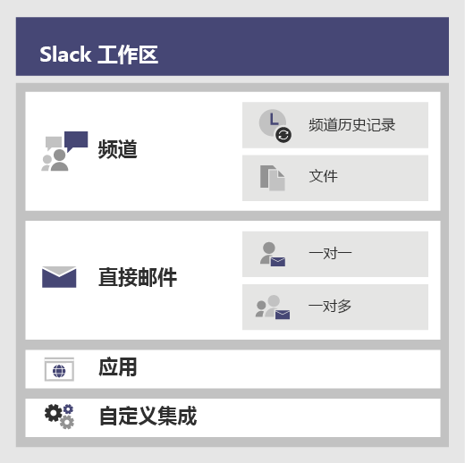
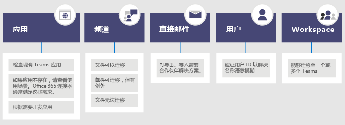

# <a name="migrate-from-slack-to-microsoft-teams"></a><span data-ttu-id="37e5e-103">从 Slack 迁移到 Microsoft Teams</span><span class="sxs-lookup"><span data-stu-id="37e5e-103">Migrate from Slack to Microsoft Teams</span></span>

<span data-ttu-id="37e5e-104">本文介绍了从 Slack 迁移到 Microsoft Teams 的步骤。</span><span class="sxs-lookup"><span data-stu-id="37e5e-104">This article walks you through the journey of moving to Microsoft Teams from Slack.</span></span>

<span data-ttu-id="37e5e-105">当为组织制定从 Slack 迁移到 Teams 的计划时，请务必确定你需要保留的内容（如有）。</span><span class="sxs-lookup"><span data-stu-id="37e5e-105">When planning your organization’s move to Teams from Slack, it's important to decide what you need to keep (if anything).</span></span> <span data-ttu-id="37e5e-106">我们首先介绍可以迁移的数据类型，然后说明如何评估需求、制定迁移计划以及完成迁移。</span><span class="sxs-lookup"><span data-stu-id="37e5e-106">We'll start off by describing what types of data can be migrated and then walk you through how to assess your needs, plan your move, and then make the move.</span></span>

<span data-ttu-id="37e5e-107">下图简单展示了 Slack 架构。</span><span class="sxs-lookup"><span data-stu-id="37e5e-107">The diagram below shows the Slack architecture at a high level.</span></span>



## <a name="plan-your-migration-from-slack"></a><span data-ttu-id="37e5e-109">制定从 Slack 迁移的计划</span><span class="sxs-lookup"><span data-stu-id="37e5e-109">Plan your migration from Slack</span></span>
### <a name="what-you-can-and-cant-migrate"></a><span data-ttu-id="37e5e-110">可以迁移和无法迁移的内容</span><span class="sxs-lookup"><span data-stu-id="37e5e-110">What you can and can’t migrate</span></span>
<span data-ttu-id="37e5e-111">Slack 服务计划将明确可以迁移和无法迁移的内容。</span><span class="sxs-lookup"><span data-stu-id="37e5e-111">Your Slack service plan will determine what you can and can’t migrate.</span></span> <span data-ttu-id="37e5e-112">例如，某些 Slack 服务计划只允许你导出公共频道历史记录和文件，而其他计划则必须通过 DocuSign 请求将专用频道和直接消息纳入导出内容。</span><span class="sxs-lookup"><span data-stu-id="37e5e-112">For example, some Slack service plans only let you export public channels history and files, other require a DocuSign request to include Private Channels and Direct Messages.</span></span> 

<span data-ttu-id="37e5e-113">若要确定你的 Slack 工作区服务级别，请登录 Slack 并记下 **关于此工作区** 页面上的计划类型。</span><span class="sxs-lookup"><span data-stu-id="37e5e-113">To determine your Slack Workspace service level, log into Slack and note your plan type on the **About this Workspace** page.</span></span>

<span data-ttu-id="37e5e-114">若要详细了解 Slack 导出选项，请转至 Slack 网站：https://get.slack.help/hc/articles/204897248-Guide-to-Slack-import-and-export-tools</span><span class="sxs-lookup"><span data-stu-id="37e5e-114">To learn more about Slack export options, go to the Slack website: https://get.slack.help/hc/articles/204897248-Guide-to-Slack-import-and-export-tools</span></span> 

<span data-ttu-id="37e5e-115">下图概略描述了 Slack 迁移过程，我们将在本文中对此过程进行说明。</span><span class="sxs-lookup"><span data-stu-id="37e5e-115">The diagram below gives you a high-level look at the Slack migration landscape that we’ll cover in this article.</span></span> 



<span data-ttu-id="37e5e-117">完成本部分后，你应该会了解以下内容：</span><span class="sxs-lookup"><span data-stu-id="37e5e-117">When you're done with this section, you should understand:</span></span>
- <span data-ttu-id="37e5e-118">你的 Slack 工作区的服务级别</span><span class="sxs-lookup"><span data-stu-id="37e5e-118">The service level of your Slack Workspaces</span></span>
- <span data-ttu-id="37e5e-119">可以导出和无法导出的内容</span><span class="sxs-lookup"><span data-stu-id="37e5e-119">What can and can't be exported</span></span>
- <span data-ttu-id="37e5e-120">常见的导出方法</span><span class="sxs-lookup"><span data-stu-id="37e5e-120">Common approaches to exporting</span></span>

### <a name="assess-your-slack-workspaces"></a><span data-ttu-id="37e5e-121">评估你的 Slack 工作区</span><span class="sxs-lookup"><span data-stu-id="37e5e-121">Assess your Slack workspaces</span></span>
<span data-ttu-id="37e5e-122">在制定组织迁移计划之前，你需要综合分析 Slack 工作区的某些信息。</span><span class="sxs-lookup"><span data-stu-id="37e5e-122">Before you can plan your organization’s migration plan, you need to pull together some information about your Slack workspaces.</span></span> <span data-ttu-id="37e5e-123">了解 Slack 工作区的使用方式有助于确定迁移的范围。</span><span class="sxs-lookup"><span data-stu-id="37e5e-123">Understanding how your Slack workspaces are being used helps you determine the scope of your migration.</span></span> <span data-ttu-id="37e5e-124">例如，你要迁移多少个工作区？</span><span class="sxs-lookup"><span data-stu-id="37e5e-124">For example, how many workspaces are being moved?</span></span> <span data-ttu-id="37e5e-125">这些工作区由某个特定部门、多个部门还是整个组织使用？</span><span class="sxs-lookup"><span data-stu-id="37e5e-125">Are they used by a specific department, many, or in use by an entire organization?</span></span>

<span data-ttu-id="37e5e-126">如果你是要迁移的 Slack 工作区的成员，可以转至 *<your Slack workspace>.slack.com/stats* 自行分析使用情况。查看“频道”和“成员”选项卡，了解使用模式。</span><span class="sxs-lookup"><span data-stu-id="37e5e-126">If you’re a member of the Slack Workspaces you want to migrate, you can analyze the usage yourself by going to *<your Slack workspace>.slack.com/stats*. Review the Channels and Members tabs to look for usage patterns.</span></span> <span data-ttu-id="37e5e-127">确定要迁移的工作区（和要保留的工作区）。</span><span class="sxs-lookup"><span data-stu-id="37e5e-127">Decide which workspaces you want to migrate (and which ones you want to leave behind).</span></span> 

> [!NOTE]
> <span data-ttu-id="37e5e-128">如果你无权访问统计信息页面，则说明你不是管理员或所有者。</span><span class="sxs-lookup"><span data-stu-id="37e5e-128">If you don’t have access to the stats page, you’re not an admin or owner.</span></span> 

### <a name="export-channels"></a><span data-ttu-id="37e5e-129">导出频道</span><span class="sxs-lookup"><span data-stu-id="37e5e-129">Export Channels</span></span>

<span data-ttu-id="37e5e-130">在 Slack 中，用户会加入作为 Slack 工作区的一部分的频道，而在 Teams 中，用户则是加入作为频道集合的团队。</span><span class="sxs-lookup"><span data-stu-id="37e5e-130">In Slack, users join a channel which is part of a Slack Workspace, whereas in Teams users join a team which is a collection of channels.</span></span> <span data-ttu-id="37e5e-131">我们建议你使用 Slack 分析功能了解每个频道的活动量，以确定要迁移的频道。</span><span class="sxs-lookup"><span data-stu-id="37e5e-131">We recommend that you use Slack analytics to see how much activity happens in each channel to help you decide which channels to move.</span></span> <span data-ttu-id="37e5e-132">你可以根据生成的列表确定如何将 Slack 频道划分成 Teams 中的团队，并确定每个团队的成员。</span><span class="sxs-lookup"><span data-stu-id="37e5e-132">You’ll use the resulting list to figure out how to group your Slack channels into teams in Teams as well as who should be members of each team.</span></span>

<span data-ttu-id="37e5e-133">如果你有 Slack 付费服务计划（任何非免费内容），可以使用 Slack 分析功能 (<your Slack workspace>.slack.com/admin/stats#channels) 了解频道的活跃程度、上次使用时间以及频道成员数量。</span><span class="sxs-lookup"><span data-stu-id="37e5e-133">If you have a paid Slack service plan (anything other than Free), you can use Slack’s analytics (<your Slack workspace>.slack.com/admin/stats#channels) to see how active a channel is, when it was last used, and how many people are members.</span></span> <span data-ttu-id="37e5e-134">这些信息有助于确定是否要迁移相关频道。</span><span class="sxs-lookup"><span data-stu-id="37e5e-134">This can help you decide whether to migrate the channel.</span></span> <span data-ttu-id="37e5e-135">默认情况下，可以导出公共频道内容（消息和文件）。</span><span class="sxs-lookup"><span data-stu-id="37e5e-135">By default, public channels content (messages and files) can be exported.</span></span> <span data-ttu-id="37e5e-136">可导出的内容取决于你的 Slack 服务计划，以及你是否请求从 Slack 导出专用频道和直接消息。</span><span class="sxs-lookup"><span data-stu-id="37e5e-136">Depending on your Slack service plan and whether you’ve requested Private Channels and Direct Messages from Slack, those can be exported.</span></span>

<span data-ttu-id="37e5e-137">若要详细了解 Slack 导出选项，请转至 Slack 网站：https://get.slack.help/hc/articles/204897248-Guide-to-Slack-import-and-export-tools</span><span class="sxs-lookup"><span data-stu-id="37e5e-137">To learn more about Slack export options, go to the Slack website: https://get.slack.help/hc/articles/204897248-Guide-to-Slack-import-and-export-tools</span></span> 

> [!IMPORTANT]
> <span data-ttu-id="37e5e-138">查看组织在频道数据方面的隐私和合规性要求。</span><span class="sxs-lookup"><span data-stu-id="37e5e-138">Check your organization’s privacy and compliance requirements around channel data.</span></span> <span data-ttu-id="37e5e-139">除需遵守最终用户可识别内容 (EUII) 生命周期规定外，你所在的组织可能还对这类数据的控制、存储和处理做出了合规性要求。</span><span class="sxs-lookup"><span data-stu-id="37e5e-139">Your organization may have compliance requirements around the handling, storage, and processing of this data, in addition to complying with the lifecycle of end-user identifiable content (EUII).</span></span>

### <a name="export-direct-messages"></a><span data-ttu-id="37e5e-140">导出直接消息</span><span class="sxs-lookup"><span data-stu-id="37e5e-140">Export Direct Messages</span></span>
<span data-ttu-id="37e5e-141">直接消息与 Teams 中的聊天相同，即 1 对 1 或 1 对多的非频道对话。</span><span class="sxs-lookup"><span data-stu-id="37e5e-141">Direct Messages are the same as chats in Teams, which are 1:1 or 1-to-many non-channel conversations.</span></span> <span data-ttu-id="37e5e-142">“导出”功能取决于你的 Slack 服务计划，以及你是否请求将直接消息纳入 Slack 导出。</span><span class="sxs-lookup"><span data-stu-id="37e5e-142">Export-ability depends on your Slack service plan and if you’ve requested Direct Messages to be included in your Slack Export.</span></span> <span data-ttu-id="37e5e-143">目前 Teams 不支持导入直接消息。</span><span class="sxs-lookup"><span data-stu-id="37e5e-143">Teams doesn’t support importing Direct messages currently.</span></span> <span data-ttu-id="37e5e-144">请咨询 Microsoft 合作伙伴，了解可通过哪些第三方解决方案将直接消息内容导入 Teams。</span><span class="sxs-lookup"><span data-stu-id="37e5e-144">Consult a Microsoft partner to learn about third-party solutions you can explore that bring Direct Messages content into Teams.</span></span>

<span data-ttu-id="37e5e-145">若要导出直接消息，请查看 Slack App Store 中的“导出”等工具。</span><span class="sxs-lookup"><span data-stu-id="37e5e-145">For exporting Direct Messages, check out tools, such as Export, in the Slack App Store.</span></span>

### <a name="apps-and-custom-integrations"></a><span data-ttu-id="37e5e-146">应用和自定义集成</span><span class="sxs-lookup"><span data-stu-id="37e5e-146">Apps and custom integrations</span></span>

<span data-ttu-id="37e5e-147">Slack 中的应用与 Teams 中的应用相差无几。</span><span class="sxs-lookup"><span data-stu-id="37e5e-147">Apps in Slack are like apps in Teams.</span></span> <span data-ttu-id="37e5e-148">获得工作区中的应用及其配置的列表后，你可以在 Teams 应用商店中进行搜索，看看这些应用是否适用于 Teams\*。</span><span class="sxs-lookup"><span data-stu-id="37e5e-148">Once you have a list of apps and their configurations in the Workspace, you can search in the Teams App store to see if they’re available for Teams\*.</span></span> 

<span data-ttu-id="37e5e-149">转至 <your Slack workspace>.slack.com/apps/manage，获取应用和自定义集成的列表。</span><span class="sxs-lookup"><span data-stu-id="37e5e-149">Go to <your Slack workspace>.slack.com/apps/manage to get a list of Apps and Custom Integrations.</span></span> <span data-ttu-id="37e5e-150">此页面还显示了使用每个应用的配置数目。</span><span class="sxs-lookup"><span data-stu-id="37e5e-150">This page also shows you the number of configurations where each app is in use.</span></span> <span data-ttu-id="37e5e-151">自定义集成的“迁移能力”各不相同。</span><span class="sxs-lookup"><span data-stu-id="37e5e-151">Custom Integrations vary in their “migrate-ability.”</span></span> <span data-ttu-id="37e5e-152">如果是 Webhook，你通常可以将其发送到 Microsoft 365 或 Office 365 连接器，将工作流转入 Teams。</span><span class="sxs-lookup"><span data-stu-id="37e5e-152">If it’s a Web Hook, you can usually send it to a Microsoft 365 or Office 365 Connector to shift the workflow into Teams.</span></span> <span data-ttu-id="37e5e-153">逐个评估机器人和其他应用，做好将其迁移到 Teams 的规划。</span><span class="sxs-lookup"><span data-stu-id="37e5e-153">Assess bots and other apps on a case-by-case basis to plan for moving them to Teams.</span></span>

<span data-ttu-id="37e5e-154">\* 如果管理员限制了应用使用，则你可能无法查看可用应用的完整列表。</span><span class="sxs-lookup"><span data-stu-id="37e5e-154">\* If your administrator has restricted apps usage, you may not be looking at the full list of available apps.</span></span>

### <a name="users"></a><span data-ttu-id="37e5e-155">用户</span><span class="sxs-lookup"><span data-stu-id="37e5e-155">Users</span></span>
<span data-ttu-id="37e5e-156">你在 Slack 中使用的身份方案可能不会直接映射到 Microsoft 365 或 Office 365。</span><span class="sxs-lookup"><span data-stu-id="37e5e-156">The identity schemes you used in Slack might not map directly to Microsoft 365 or Office 365.</span></span> <span data-ttu-id="37e5e-157">例如，Slack 用户的电子邮件地址可能不会映射到 Microsoft 365 或 Office 365 的工作或学校帐户。</span><span class="sxs-lookup"><span data-stu-id="37e5e-157">For example, the email addresses of your Slack users may not map to Microsoft 365 or Office 365 work or school accounts.</span></span> <span data-ttu-id="37e5e-158">开始规划 Teams 部署之前，你应创建用户 ID 映射。</span><span class="sxs-lookup"><span data-stu-id="37e5e-158">You should create a user-ID map before you start planning your Teams rollout.</span></span>

<span data-ttu-id="37e5e-159">如果你使用的是 Slack 付费服务计划，可以转至 *<your Slack workspace>.slack.com/admin/stats#members*，获取每位用户的电子邮件地址和帐户类型等成员详细信息（例如，单频道来宾还是多频道来宾）。</span><span class="sxs-lookup"><span data-stu-id="37e5e-159">If you’re on a paid Slack service plan, you can go to *<your Slack workspace>.slack.com/admin/stats#members* to get member details such as email address and account type for each user (for example, single vs. multi-channel guest).</span></span>

<span data-ttu-id="37e5e-160">你可以使用下面的脚本，将从 Slack 导出的电子邮件地址与 Azure AD 中的内容进行对比，以解决名称不明确的问题。</span><span class="sxs-lookup"><span data-stu-id="37e5e-160">Here’s a script you can use to compare email addresses from a Slack export against Azure AD to help solve for name ambiguity.</span></span> <span data-ttu-id="37e5e-161">此外，它还会报告是否为用户启用了 Teams。</span><span class="sxs-lookup"><span data-stu-id="37e5e-161">It’ll also report if the user is enabled for Teams.</span></span> <span data-ttu-id="37e5e-162">如需 PowerShell 方面的帮助，请参阅 [Azure PowerShell 入门](/powershell/azure/get-started-azureps)。</span><span class="sxs-lookup"><span data-stu-id="37e5e-162">If you need help with PowerShell, read [Get started with Azure PowerShell](/powershell/azure/get-started-azureps).</span></span>

```azurepowershell
Connect-AzureAD
Function Get-TimeStamp {
    return "[{0:MM/dd/yy} {0:HH:mm:ss}]" -f (Get-Date)
}

class User {
    [ValidateNotNullOrEmpty()] $ID
    [ValidateNotNullOrEmpty()] $FullName
    [string] $Email
    [string] $UPN
    [ValidateNotNullOrEmpty()][bool] $ExistsAzureAD
    [ValidateNotNullOrEmpty()][bool] $TeamsEnabled
}

$output = New-Object -type System.Collections.ObjectModel.Collection["User"]

$users = Get-Content -Raw -Path .\slackHistory\users.json | ConvertFrom-Json

Write-Host -ForegroundColor Green "$(Get-Timestamp) User Count: " $users.Count

$i=1
Write-Host "$(Get-Timestamp) Attempting direct email match.. `n"
foreach ($slackUser in $users) {
    $user = New-Object User
    $user.id = $slackUser.id
    $user.FullName = $slackUser.name
    try {
        if ($null -ne $slackUser.profile.email) {
            $user.email = $slackUser.profile.email
            $emailSplit = $slackUser.profile.email.Split('@')
            $mailNickName = $emailSplit[0]
            $result = Get-AzureADUser -Filter "MailNickName eq '$($mailNickName)' or UserPrincipalName eq '$($slackUser.profile.email)' or proxyAddresses/any(c:c eq 'smtp:$($slackUser.profile.email)')"
            if ($null -ne $result) {
                $user.ExistsAzureAD = $true
                $user.UPN = $result.UserPrincipalName
                $assignedPlans = $result.assignedPlans
                foreach ($plan in $assignedPlans) {
                    if ($plan.ServicePlanId -eq "57ff2da0-773e-42df-b2af-ffb7a2317929") {
                        if ($plan.CapabilityStatus -eq "Enabled") {
                            $user.TeamsEnabled = $true
                        }
                        else {
                            $user.TeamsEnabled = $false
                        }
                    }
                }
                Write-Host -ForegroundColor Green "$(Get-Timestamp) Current User $($i) - AzureAD object found:" $result.MailNickName
                Write-Host -ForegroundColor Green "$(Get-Timestamp) Current User $($i) - Teams Enabled:" $user.TeamsEnabled
            }
            else {
                $user.ExistsAzureAD = $false
                Write-Host -ForegroundColor Yellow "$(Get-Timestamp) Current User $($i) - AzureAD object not found: " $slackUser.profile.email
            }
        }
        $i++
    }   
    catch
    {
        $user.ExistsAzureAD = $false
        Write-Host -ForegroundColor Yellow "$(Get-Timestamp) Current User $($i) - AzureAD object not found: $($i)" $user.profile.email
        $i++
    }
    $output.Add($user)
}

$output | Export-Csv -Path .\SlackToAzureADIdentityMapping.csv -NoTypeInformation
Write-Host "`n $(Get-Timestamp) Generated SlackToAzureADIdentityMapping.csv. Exiting..."
$output | Export-Csv -Path .\SlackToAzureADIdentityMapping.csv -NoTypeInformation
Write-Host "`n $(Get-Timestamp) Generated SlackToAzureADIdentityMapping.csv. Exiting..."
```

<span data-ttu-id="37e5e-163">完成本部分后，你应该拥有以下内容并完成以下事项：</span><span class="sxs-lookup"><span data-stu-id="37e5e-163">When you’re done with this section, you should have:</span></span>
- <span data-ttu-id="37e5e-164">包含每个工作区频道及其使用情况统计信息的列表。</span><span class="sxs-lookup"><span data-stu-id="37e5e-164">A list of Channels per Workspace with usage statistics.</span></span>
- <span data-ttu-id="37e5e-165">每个频道的 Slack 应用及配置列表。</span><span class="sxs-lookup"><span data-stu-id="37e5e-165">A list of Slack Apps with configurations per channel.</span></span>
- <span data-ttu-id="37e5e-166">确定了要导出的 Slack 消息历史记录类型（如有）。</span><span class="sxs-lookup"><span data-stu-id="37e5e-166">Determined what type of Slack message history you want to export (if any).</span></span>
- <span data-ttu-id="37e5e-167">包含 Slack 帐户映射到 Microsoft 工作或学校帐户的用户及其拥有的 Teams 许可的列表。</span><span class="sxs-lookup"><span data-stu-id="37e5e-167">A list of users whose Slack accounts map to Microsoft work or school accounts and which Teams license they have.</span></span>

## <a name="plan-your-teams-deployment"></a><span data-ttu-id="37e5e-168">规划 Teams 部署</span><span class="sxs-lookup"><span data-stu-id="37e5e-168">Plan your Teams deployment</span></span>
<span data-ttu-id="37e5e-169">你已从 Slack 中导出了所需的内容（并留下了不需要的内容）。</span><span class="sxs-lookup"><span data-stu-id="37e5e-169">You’ve exported what you need from Slack (and left behind anything you don’t need).</span></span> <span data-ttu-id="37e5e-170">现在可以规划 Teams 部署方式并导入 Slack 数据了。</span><span class="sxs-lookup"><span data-stu-id="37e5e-170">Now it’s time to plan how you’ll roll out Teams and import your Slack data.</span></span> <span data-ttu-id="37e5e-171">此时是根据使用情况评估哪些内容适合团队，以及将这些元素纳入 Teams 部署计划的绝佳时机。</span><span class="sxs-lookup"><span data-stu-id="37e5e-171">This is a great opportunity to assess what's worked well for the team based on usage and include those elements in your Teams deployment plan.</span></span> <span data-ttu-id="37e5e-172">本部分结束时，你将获得涉及 Teams 用户、频道和应用的蓝图。</span><span class="sxs-lookup"><span data-stu-id="37e5e-172">At the end of this section, you’ll have a blueprint for your Teams users, channels, and apps.</span></span> 

<span data-ttu-id="37e5e-173">下图概述了你要在 Teams 部署过程中解决的问题。</span><span class="sxs-lookup"><span data-stu-id="37e5e-173">The diagram below gives you a high-level outline of the things you’ll address in your Teams deployment.</span></span>

:::image type="content" source="media/migrate-slack-to-teams-image3.png" alt-text="从 Slack 迁移到 Teams 的部署规划概述。":::

### <a name="team-and-channel-structure"></a><span data-ttu-id="37e5e-175">团队和频道结构</span><span class="sxs-lookup"><span data-stu-id="37e5e-175">Team and channel structure</span></span>

<span data-ttu-id="37e5e-176">一个 Slack 工作区可能代表一个团队、多个团队或整个组织。</span><span class="sxs-lookup"><span data-stu-id="37e5e-176">A Slack Workspace may represent a single team, multiple teams or an entire organization.</span></span> <span data-ttu-id="37e5e-177">确定结构时，了解工作区的范围非常重要。</span><span class="sxs-lookup"><span data-stu-id="37e5e-177">It’s important to understand the scope of the Workspaces as you determine the structure.</span></span> <span data-ttu-id="37e5e-178">Slack 中最接近 Teams 团队的就是工作区，工作区包含频道集合。</span><span class="sxs-lookup"><span data-stu-id="37e5e-178">The closest relationship to a Teams team in Slack is the Workspace, which contains a collection of channels.</span></span> <span data-ttu-id="37e5e-179">下图显示了 3 种不同的 Slack 到 Teams 映射，以及为每个工作区选取适当映射的指南。</span><span class="sxs-lookup"><span data-stu-id="37e5e-179">The diagram below demonstrates 3 different Slack-to-Teams mappings, and guidance for picking the right one for each Workspace.</span></span>


|<span data-ttu-id="37e5e-180">Slack 到 Teams 映射</span><span class="sxs-lookup"><span data-stu-id="37e5e-180">Slack-to-Teams mapping</span></span> |  |
|---------|---------|
|<span data-ttu-id="37e5e-181">1 个 Slack 工作区 :arrow_right: 1 个团队</span><span class="sxs-lookup"><span data-stu-id="37e5e-181">1 Slack Workspace :arrow_right: 1 team</span></span>   | <span data-ttu-id="37e5e-182">适用于需要 200 个以内频道的较小 Slack 工作区</span><span class="sxs-lookup"><span data-stu-id="37e5e-182">For smaller Slack workspaces that need fewer than 200 channels</span></span><br><span data-ttu-id="37e5e-183">包含针对增长和专用频道规划的缓冲区</span><span class="sxs-lookup"><span data-stu-id="37e5e-183">Include a buffer for growth and private channel planning</span></span>  |
|<span data-ttu-id="37e5e-184">1 个 Slack 工作区 :arrow_right: 多个团队</span><span class="sxs-lookup"><span data-stu-id="37e5e-184">1 Slack Workspace :arrow_right: multiple teams</span></span>     | <span data-ttu-id="37e5e-185">使用 Slack 工作区分析数据创建逻辑频道分组，这将成为团队的基础</span><span class="sxs-lookup"><span data-stu-id="37e5e-185">Use your Slack Workspace analytics data to create logical channel groupings, which become the basis of your teams</span></span>        |
|<span data-ttu-id="37e5e-186">2 个以上的 Slack 工作区 :arrow_right: 多个团队</span><span class="sxs-lookup"><span data-stu-id="37e5e-186">2+ Slack Workspaces :arrow_right: multiple teams</span></span>     | <span data-ttu-id="37e5e-187">使用 Slack 工作区分析数据创建逻辑团队和频道分组，这将成为团队的基础</span><span class="sxs-lookup"><span data-stu-id="37e5e-187">Use your Slack Workspace analytics data to create logical team and channel groupings, which become the basis of your teams</span></span>        |

<span data-ttu-id="37e5e-188">第三方解决方案会提供使用情况统计信息，以帮助你评估频道的活跃程度，以及频道的帖子数量。</span><span class="sxs-lookup"><span data-stu-id="37e5e-188">Third-party solutions have usage statistics to help you assess how active the channel is and how many posts there are.</span></span> <span data-ttu-id="37e5e-189">通常情况下，常用频道将会是团队规划中的候选项。</span><span class="sxs-lookup"><span data-stu-id="37e5e-189">Typically, channels that are frequently used would be candidates to include in your team planning.</span></span>

> [!TIP]
> <span data-ttu-id="37e5e-190">只保留你的方法所需的内容，以便确定要在 Teams 中重新创建哪些频道。</span><span class="sxs-lookup"><span data-stu-id="37e5e-190">Retain only what is required in your approach to determine which channels to recreate in Teams.</span></span> <span data-ttu-id="37e5e-191">若要了解详细信息，请阅读[团队和频道概述](teams-channels-overview.md)。</span><span class="sxs-lookup"><span data-stu-id="37e5e-191">To learn more, read [Overview of teams and channels](teams-channels-overview.md).</span></span> 

#### <a name="team-planning"></a><span data-ttu-id="37e5e-192">团队规划</span><span class="sxs-lookup"><span data-stu-id="37e5e-192">Team Planning</span></span>
<span data-ttu-id="37e5e-193">使用你在上面的“规划”部分编译的频道清单，并与 Slack 所有者和管理员共同确定哪些频道应成为团队，以及哪些频道应成为团队中的频道。</span><span class="sxs-lookup"><span data-stu-id="37e5e-193">Using the Channel inventory you compiled in the Planning section above, work with your Slack owners and admins to figure out which channels should become teams and which ones should become channels in a team.</span></span> <span data-ttu-id="37e5e-194">利用 Excel 或 PowerBI 来进行这项分析 - 这两种工具都可提供更多见解，帮助推动就要保留哪些频道展开讨论。</span><span class="sxs-lookup"><span data-stu-id="37e5e-194">Use either Excel or PowerBI to help with this analysis - both can provide additional insights to help drive these discussions on which channels to retain.</span></span>

> [!TIP]
> <span data-ttu-id="37e5e-195">Teams 目前规定每个团队不能超过 200 个频道。</span><span class="sxs-lookup"><span data-stu-id="37e5e-195">Teams currently has a 200-channel limit per team.</span></span> <span data-ttu-id="37e5e-196">如果频道列表接近该限制，则应想办法将其拆分为两个单独的团队。</span><span class="sxs-lookup"><span data-stu-id="37e5e-196">If your list of channels is getting close to that limit, you should figure out a way to split them into two separate teams.</span></span>

### <a name="channel-history"></a><span data-ttu-id="37e5e-197">频道历史记录</span><span class="sxs-lookup"><span data-stu-id="37e5e-197">Channel History</span></span>

<span data-ttu-id="37e5e-198">你可以使用 GitHub 上的免费解决方案和付费解决方案，具体取决于你所在的组织在保留公共频道和专用频道历史记录方面的要求。</span><span class="sxs-lookup"><span data-stu-id="37e5e-198">There are both free solutions on GitHub and paid solutions you can use, depending on your organization’s requirements to retain Channel History of Public and Private channels.</span></span> <span data-ttu-id="37e5e-199">此外，还可通过编写脚本来将此内容纳入 Teams。</span><span class="sxs-lookup"><span data-stu-id="37e5e-199">Additionally, this could be scripted into Teams.</span></span>

<span data-ttu-id="37e5e-200">在 Teams 中设置新的团队和频道结构后，可将导出的文件复制到 Teams 频道中的相应文档库。</span><span class="sxs-lookup"><span data-stu-id="37e5e-200">Once you’ve set up your new team and channel structure in Teams, you can copy the exported files into the appropriate document libraries in your Teams channels.</span></span>

<span data-ttu-id="37e5e-201">若要自动导入内容，可考虑采用以下几种方法。</span><span class="sxs-lookup"><span data-stu-id="37e5e-201">To automate the importing of your content, there are several approaches you can consider.</span></span> <span data-ttu-id="37e5e-202">你可以使用 GitHub 上的免费解决方案（[ChannelSurf](https://github.com/tamhinsf/ChannelSurf) 或 [Slack Export Viewer](https://github.com/hfaran/slack-export-viewer)）以及合作伙伴解决方案。</span><span class="sxs-lookup"><span data-stu-id="37e5e-202">There are  free solutions on GitHub ([ChannelSurf](https://github.com/tamhinsf/ChannelSurf) or [Slack Export Viewer](https://github.com/hfaran/slack-export-viewer)) and partner solutions.</span></span> <span data-ttu-id="37e5e-203">请根据组织需要选择解决方案。</span><span class="sxs-lookup"><span data-stu-id="37e5e-203">Choose a solution based on your organization’s needs.</span></span> 

### <a name="channel-files"></a><span data-ttu-id="37e5e-204">频道文件</span><span class="sxs-lookup"><span data-stu-id="37e5e-204">Channel Files</span></span>

<span data-ttu-id="37e5e-205">多数解决方案都会导出文件。</span><span class="sxs-lookup"><span data-stu-id="37e5e-205">Most solutions will export files.</span></span> <span data-ttu-id="37e5e-206">但是，这些文件通常以频道历史记录中的链接的形式提供，需要借助 API 密钥以编程方式取回。</span><span class="sxs-lookup"><span data-stu-id="37e5e-206">However, they’re typically provided as links in the Channel History that require an API key to programmatically retrieve.</span></span>

<span data-ttu-id="37e5e-207">对于 Slack 中存储的文件，当在 Teams 中设置好团队和频道后，你可以以编程方式将其从 Slack 复制到目标 Teams 频道。</span><span class="sxs-lookup"><span data-stu-id="37e5e-207">For files stored in Slack, once you’ve set up your teams and channels in Teams, you can programmatically copy them from Slack into the target Teams channel.</span></span>

<span data-ttu-id="37e5e-208">以下脚本会从 Slack 取回文件。</span><span class="sxs-lookup"><span data-stu-id="37e5e-208">The following script retrieves files from Slack.</span></span> <span data-ttu-id="37e5e-209">这个脚本会在你的计算机上搜索指定的 Slack 导出内容，在每个目标频道中创建一个文件夹，并将所有文件下载到该位置。</span><span class="sxs-lookup"><span data-stu-id="37e5e-209">It searches the specified Slack export on your computer, creates a folder in each target channel, and downloads all of the files to that location.</span></span> <span data-ttu-id="37e5e-210">此外，还存在可提取数据的第三方解决方案。</span><span class="sxs-lookup"><span data-stu-id="37e5e-210">Third-party solutions exist that can extract data.</span></span> <span data-ttu-id="37e5e-211">如需 PowerShell 方面的帮助，请参阅 [Azure PowerShell 入门](/powershell/azure/get-started-azureps)。</span><span class="sxs-lookup"><span data-stu-id="37e5e-211">If you need help with PowerShell, read [Get started with Azure PowerShell](/powershell/azure/get-started-azureps).</span></span>


```azurepowershell
$ExportPath = ".\slackHistory"
$ExportContents = Get-ChildItem -path $ExportPath -Recurse
Function Get-TimeStamp {
    return "[{0:MM/dd/yy} {0:HH:mm:ss}]" -f (Get-Date)
}

class File {
    [string] $Name
    [string] $Title
    [string] $Channel
    [string] $DownloadURL
    [string] $MimeType
    [double] $Size
    [string] $ParentPath
    [string] $Time
}

$channelList = Get-Content -Raw -Path .\slackHistory\channels.json | ConvertFrom-Json
$Files = New-Object -TypeName System.Collections.ObjectModel.Collection["File"]

Write-Host -ForegroundColor Green "$(Get-TimeStamp) Starting Step 1 (processing channel export for files) of 2. Total Channel Count: $($channelList.Count)"
#Iterate through each Channel listed in the Archive
foreach ($channel in $channelList) {
    #Iterate through Channel folders from the Export
    foreach ($folder in $ExportContents)
    {
        #If Channel Name matches..
        if ($channel.name -eq $folder){
            $channelJsons = Get-ChildItem -Path $folder.FullName -File
            Write-Host -ForegroundColor White "$(Get-TimeStamp) Info: Starting to process $($channelJsons.Count) days of content for #$($channel.name)."
            #Start processing the daily JSON for files
            foreach ($json in $channelJsons){
                $currentJson = Get-Content -Raw -Path $json.FullName | ConvertFrom-Json
                #Write-Host -ForegroundColor Yellow "$(Get-TimeStamp) Info: Processing $($json.Name) in #$($channel.name).."
                #Iterate through every action
                foreach ($entry in $currentJson){
                    #If the action contained file(s)..
                    if($null -ne $entry.files){
                        #Iterate through each file and add it to the List of Files to download
                        foreach ($item in $entry.Files) {
                        $file = New-Object -TypeName File
                            if ($null -ne $item.url_private_download){
                                $file.Name = $item.name
                                $file.Title = $item.Title
                                $file.Channel = $channel.name
                                $file.DownloadURL = $item.url_private_download
                                $file.MimeType = $item.mimetype
                                $file.Size = $item.size
                                $file.ParentPath = $folder.FullName
                                $file.Time = $item.created
                                $files.Add($file)
                            }
                        }
                    }
                }
            }
        }
    }
}
Write-Host -ForegroundColor Green "$(Get-TimeStamp) Step 1 of 2 complete. `n"

Write-Host -ForegroundColor Green "$(Get-TimeStamp) Starting step 2 (creating folders and downloading files) of 2."
#Determine which Files folders need to be created
$FoldersToMake = New-Object System.Collections.ObjectModel.Collection["string"]
foreach ($file in $files){
    if ($FoldersToMake -notcontains $file.Channel){
        $FoldersToMake.Add($file.Channel)
    }
}

#Create Folders
foreach ($folder in $FoldersToMake){
    #$fullFolderPath = $file.ParentPath + "\Files"
    $fullFolderPath = $ExportPath +"\$($folder)"
    $fullFilesPath = $ExportPath +"\$($folder)\Files"
    if (-not (Test-Path $fullFilesPath)){
        New-Item -Path $fullFolderPath  -Name "Files" -ItemType "directory"
    }
}

#Downloading Files
foreach ($file in $files)
{
    Write-Host -ForegroundColor Yellow "$(Get-TimeStamp) Downloading $($file.Name)."
    $fullFilePath = $file.ParentPath + "\Files\" + $file.Name
        if (-not (Test-Path $fullFilePath)){
            try{
                $request = (New-Object System.Net.WebClient).DownloadFile($file.DownloadURL, $fullFilePath)
            }
            catch [System.Net.WebException]{
                Write-Host -ForegroundColor Red "$(Get-TimeStamp) Error: Unable to download $($file.Name) to $($fullFilePath)"
            }   
        }
        else {
            try{
                $extensionPosition = $file.name.LastIndexOf('.')
                $splitFileName = $file.name.Substring(0,$extensionPosition)
                $splitFileExtention = $file.name.Substring($extensionPosition)
                $newFileName = $splitFileName + $file.Time + $splitFileExtention
                $fullFilePath = $file.ParentPath + "\Files\" + $newFileName
                $request = (New-Object System.Net.WebClient).DownloadFile($file.DownloadURL, $fullFilePath)
            }
            catch [System.Net.WebException]{
                Write-Host -ForegroundColor Red "$(Get-TimeStamp) Error: Unable to download $($file.Name) to $($fullFilePath)"
            }   
        }
}
Write-Host -ForegroundColor Green "$(Get-TimeStamp) Step 2 of 2 complete. `n"
Write-Host -ForegroundColor Green "$(Get-TimeStamp) Exiting.."
```


### <a name="apps-and-custom-integrations"></a><span data-ttu-id="37e5e-212">应用和自定义集成</span><span class="sxs-lookup"><span data-stu-id="37e5e-212">Apps and Custom Integrations</span></span>
<span data-ttu-id="37e5e-213">查看 Slack 应用和自定义集成（含配置）列表，并确定要将哪些内容迁移到 Teams。</span><span class="sxs-lookup"><span data-stu-id="37e5e-213">Review your list of Slack apps and custom integrations (with configurations) and decide which ones you want to move to Teams.</span></span> <span data-ttu-id="37e5e-214">查看 Teams Marketplace，了解某款应用是否可用。</span><span class="sxs-lookup"><span data-stu-id="37e5e-214">Check the Teams Marketplace to see if an app is available.</span></span> <span data-ttu-id="37e5e-215">如果不可用，则可能会有备选项。</span><span class="sxs-lookup"><span data-stu-id="37e5e-215">If not, there are likely alternatives.</span></span> 

<span data-ttu-id="37e5e-216">若要确定要添加到 Teams 的应用，请务必了解应用的使用方式。</span><span class="sxs-lookup"><span data-stu-id="37e5e-216">To figure out which apps to add to Teams, it’s important to understand how the app is being used.</span></span> <span data-ttu-id="37e5e-217">考虑“这个应用可为此频道提供哪些功能？”，了解应用将会造成的结果。</span><span class="sxs-lookup"><span data-stu-id="37e5e-217">By asking the question "what functionality is the app providing to this channel?", you'll learn about the outcome the app is delivering.</span></span> 

<span data-ttu-id="37e5e-218">在许多情况下，应用主要接收来自外部服务（如监控系统）的事件驱动数据，并将消息推送到 Slack。</span><span class="sxs-lookup"><span data-stu-id="37e5e-218">In many cases, apps primarily receive event-driven data from an external service (for example, monitoring system) and push a message into Slack.</span></span> <span data-ttu-id="37e5e-219">通过使用可根据事件将消息推送到 Teams 的 Microsoft 365 连接器，也可以实现相同的结果。</span><span class="sxs-lookup"><span data-stu-id="37e5e-219">You can achieve the same outcome by using a Microsoft 365 Connector that can push messages into Teams based on events.</span></span>

<span data-ttu-id="37e5e-220">下面是 Slack 解决方案示例，其中在 Teams 中使用了 Microsoft 365 连接器进行集成。</span><span class="sxs-lookup"><span data-stu-id="37e5e-220">Below are examples of Slack solutions where a Microsoft 365 Connector was used in Teams for integration.</span></span>
- <span data-ttu-id="37e5e-221">Ansible</span><span class="sxs-lookup"><span data-stu-id="37e5e-221">Ansible</span></span>
  - <span data-ttu-id="37e5e-222">可通过 [Ansible Webhook](https://docs.ansible.com/ansible-tower/latest/html/userguide/notifications.html#webhook) 向 Teams 发送警报</span><span class="sxs-lookup"><span data-stu-id="37e5e-222">Alerts can be sent to Teams via [Ansible webhook](https://docs.ansible.com/ansible-tower/latest/html/userguide/notifications.html#webhook)</span></span>
- <span data-ttu-id="37e5e-223">New Relic</span><span class="sxs-lookup"><span data-stu-id="37e5e-223">New Relic</span></span>
  - <span data-ttu-id="37e5e-224">请查看这一[向 Teams 发送 New Relic 警报](https://discuss.newrelic.com/t/new-relic-alerts-not-working-with-microsoft-teams/48609/3)的用户解决方案</span><span class="sxs-lookup"><span data-stu-id="37e5e-224">Check out this user solution for [sending New Relic alerts to Teams](https://discuss.newrelic.com/t/new-relic-alerts-not-working-with-microsoft-teams/48609/3)</span></span>
- <span data-ttu-id="37e5e-225">Nagios</span><span class="sxs-lookup"><span data-stu-id="37e5e-225">Nagios</span></span>
  - <span data-ttu-id="37e5e-226">现在可通过连接器集成警报。</span><span class="sxs-lookup"><span data-stu-id="37e5e-226">Alerts can be integrated today via Connectors.</span></span> <span data-ttu-id="37e5e-227">https://github.com/isaac-galvan/nagios-teams-notify</span><span class="sxs-lookup"><span data-stu-id="37e5e-227">https://github.com/isaac-galvan/nagios-teams-notify</span></span>
- <span data-ttu-id="37e5e-228">ZenDesk</span><span class="sxs-lookup"><span data-stu-id="37e5e-228">ZenDesk</span></span>
  - <span data-ttu-id="37e5e-229">Teams 商店中拥有该应用</span><span class="sxs-lookup"><span data-stu-id="37e5e-229">App exists in Teams Store</span></span>
- <span data-ttu-id="37e5e-230">Jenkins</span><span class="sxs-lookup"><span data-stu-id="37e5e-230">Jenkins</span></span>
  - <span data-ttu-id="37e5e-231">可使用 [Jenkins 的 Office 365 连接器](https://plugins.jenkins.io/Office-365-Connector)向 Teams 发送警报</span><span class="sxs-lookup"><span data-stu-id="37e5e-231">Alerts can be sent to Teams using [Jenkins’s Office 365 Connector](https://plugins.jenkins.io/Office-365-Connector)</span></span>


### <a name="user-readiness-and-adoption-plan"></a><span data-ttu-id="37e5e-232">用户准备情况和采用计划</span><span class="sxs-lookup"><span data-stu-id="37e5e-232">User readiness and adoption plan</span></span>
<span data-ttu-id="37e5e-233">软件成功部署的基础取决于用户是否已准备好接受变化。</span><span class="sxs-lookup"><span data-stu-id="37e5e-233">The cornerstone of any successful software deployment hinges on how prepared users are for the change.</span></span> <span data-ttu-id="37e5e-234">组织中使用 Slack 的用户可以轻松理解 Teams 概念，但仍需为他们提供培训，帮助他们实现平稳过渡。</span><span class="sxs-lookup"><span data-stu-id="37e5e-234">Users in your organization using Slack will easily understand Teams concepts, but training is still needed to help them make a smooth transition.</span></span> <span data-ttu-id="37e5e-235">如需全面的 Teams 采用资源，请转至 [Teams 采用中心](adopt-microsoft-teams-landing-page.md)。</span><span class="sxs-lookup"><span data-stu-id="37e5e-235">For a comprehensive set of Teams adoption resources, go to the [Teams adoption hub](adopt-microsoft-teams-landing-page.md).</span></span>

<span data-ttu-id="37e5e-236">例如，这两种产品均提供频道，但频道在它们中的使用方式各不相同。</span><span class="sxs-lookup"><span data-stu-id="37e5e-236">For example, both products feature channels, but they’re used differently in each product.</span></span> <span data-ttu-id="37e5e-237">例如，Slack 中的频道就像 Teams 中的聊天，通常用于短期事务性对话。</span><span class="sxs-lookup"><span data-stu-id="37e5e-237">For example, often a Channel in Slack is used like a chat in Teams for short-term, transactional conversations.</span></span> <span data-ttu-id="37e5e-238">其他明显区别存在于链式/非链式对话和调整通知设置方面。</span><span class="sxs-lookup"><span data-stu-id="37e5e-238">Other notable differences are around threaded/non-threaded conversations and tuning notification settings.</span></span>

<span data-ttu-id="37e5e-239">查看我们内容丰富的[最终用户 Teams 视频培训](https://support.office.com/article/microsoft-teams-video-training-4f108e54-240b-4351-8084-b1089f0d21d7)库。</span><span class="sxs-lookup"><span data-stu-id="37e5e-239">Check out our rich library of [End-user Teams video training](https://support.office.com/article/microsoft-teams-video-training-4f108e54-240b-4351-8084-b1089f0d21d7).</span></span> 

## <a name="move-to-teams"></a><span data-ttu-id="37e5e-240">迁移到 Teams</span><span class="sxs-lookup"><span data-stu-id="37e5e-240">Move to Teams</span></span> 
<span data-ttu-id="37e5e-241">现在，你已确定了过渡计划，可以开始在 Teams 中创建团队和频道了。</span><span class="sxs-lookup"><span data-stu-id="37e5e-241">Now that your transition plan is defined, you can begin creating your teams and channels in Teams.</span></span> 

<span data-ttu-id="37e5e-242">创建团队和频道后，开始将文件从 Slack 频道复制到 Teams，并配置应用。</span><span class="sxs-lookup"><span data-stu-id="37e5e-242">Once you’ve created your teams & channels, begin copying files from Slack channels into Teams and configuring your apps.</span></span> <span data-ttu-id="37e5e-243">如果你要使用某个解决方案来保留历史记录，则现在可以也对其进行配置。</span><span class="sxs-lookup"><span data-stu-id="37e5e-243">If you’re using a solution to retain history, that can be configured now as well.</span></span> <span data-ttu-id="37e5e-244">然后，你就可以开始授予用户许可（如果用户尚未获得许可），并将其添加到相应的团队。</span><span class="sxs-lookup"><span data-stu-id="37e5e-244">Then you’re ready to start licensing users (if they aren’t licensed already) and adding them to the appropriate teams.</span></span> <span data-ttu-id="37e5e-245">为了减少需要额外导出的内容和复制的文件，请考虑在商定的日期（将每个用户添加到团队中的时间）撤销 Slack 访问权限。</span><span class="sxs-lookup"><span data-stu-id="37e5e-245">To reduce the need for additional exports and file copies, consider removing Slack access at an agreed-upon date that coincides with each user’s addition to the team.</span></span> <span data-ttu-id="37e5e-246">这可避免重新导出和导入文件和历史记录的增量更改。</span><span class="sxs-lookup"><span data-stu-id="37e5e-246">This avoids needing to re-export and import delta changes on files and history.</span></span>

<span data-ttu-id="37e5e-247">按照下图中的步骤在你所在的组织部署 Teams。</span><span class="sxs-lookup"><span data-stu-id="37e5e-247">Follow the steps in the diagram below to roll out Teams in your organization.</span></span> <span data-ttu-id="37e5e-248">有关详情，请参阅[如何部署 Teams](./deploy-overview.md)。</span><span class="sxs-lookup"><span data-stu-id="37e5e-248">For more information, check out [How to roll out Teams](./deploy-overview.md).</span></span>


:::image type="content" source="media/migrate-slack-to-teams-image4.png" alt-text="列出从 Slack 迁移到 Teams 的步骤的图表。":::