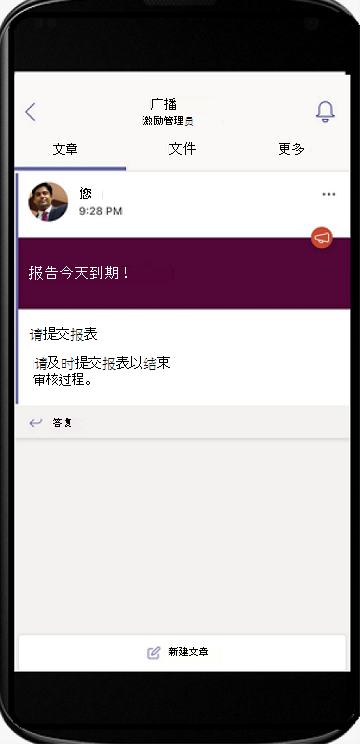

# 导航 Microsoft Teams

现在，你已清楚地了解了组织的独特路径和需求，接下来就可以开始与 Microsoft Teams 进行强大的协作了。 使用以下部分了解如何在 Teams 中导航 Kaizala 的功能。

> [!Important]
> Microsoft Kaizala 将于 2023 年 8 月 31 日停用。 建议迁移到 Microsoft Teams 以继续连接、共享和协作。 停用日期后，将停止对 Kaizala 的访问和支持。

| 从凯扎拉 | 到 Teams |
|---------|-----------------------|
| 入门 – 登录和配置文件设置| [Teams 入门](#getting-started) |
| 开始新聊天，1：1 音频和视频通话 | [Teams、音频和视频通话中的聊天](#starting-new-chats-11-audio-and-video-calls) |
| Kaizala 组| [将 Kaizala 组移动到 Teams](#moving-your-kaizala-groups-to-microsoft-teams) |
| 模拟使用者应用消息传递体验| [模拟使用者应用消息传递体验](#mimic-the-consumer-app-messaging-experience) |
| 开箱即用操作卡 |  [在 Teams 中完成工作](#getting-work-done-in-teams) |
| 投票、调查和清单| [在 Teams 中运行投票、调查和清单](#polls-surveys-and-checklists-in-teams) |
| 会议 - 操作卡片| [让我们在 Teams 中开会 - 会议](#getting-work-done-in-teams) |
| 公告 - 操作卡片| [Teams 中的公告](#announcements-in-teams) |
| 照片签入操作卡| [Teams 中的照片签入](#photo-check-ins)
| 测验 - 操作卡| [Teams 中的测验](#quiz-in-teams)
| 培训 - 操作卡片| [Teams 中的培训](#training-in-teams) |
| 自定义操作卡 | [Teams 中的自定义解决方案](#moving-kaizala-custom-solutions-to-microsoft-teams) |
| Kaizala 管理门户| [对于 IT 专业人员](#it-professionals) |
| | [对于最终用户](#end-user-guidance) |
| 凯扎拉集团解散| [凯扎拉集团解散](#kaizala-group-dissolution) |
| Kaizala 租户数据导出| [导出 Kaizala 租户数据](#export-kaizala-tenant-data)  |
| 与外部用户合作 (供应商/供应商/合作伙伴) | [将 Teams 组织外部的人员添加或邀请到聊天](#collaborating-with-external-usersvendorssupplierspartners) |

## 入门

从 Kaizala 迁移到 Teams 的入门，我们的入门指南比以往更容易。 若要了解有关开始 Microsoft Teams 旅程的详细信息，请 [参阅 Teams 入](https://support.microsoft.com/office/start-and-pin-chats-a864b052-5e4b-4ccf-b046-2e26f40e21b5?wt.mc_id=otc_microsoft_teams&ui=en-us&rs=en-us&ad=us)门。

## 开始新聊天，1：1 音频和视频通话

创建 1：1 或群聊，以便与较小的组协作或在 Teams 中私下交谈。 可以固定聊天并保存消息以快速访问。 若要开始使用我们的富文本格式、表情符号和 gif 聊天，请参阅 [Teams 中的聊天](https://support.microsoft.com/office/start-and-pin-chats-a864b052-5e4b-4ccf-b046-2e26f40e21b5?wt.mc_id=otc_microsoft_teams&ui=en-us&rs=en-us&ad=us)。

通过启动 1：1 或与组织中的任何人进行组呼叫来高效通信。 借助 Teams，你可以灵活地进行音频和视频通话。  若要开始，请参阅 [“拨打电话](https://www.microsoft.com/videoplayer/embed/RE4rxv0?pid=ocpVideo0-innerdiv-oneplayer&postJsllMsg=true&maskLevel=20&market=en-us)”。

可以通过在 Teams 中创建 Teams、频道和群聊，从 Kaizala 组移动到 Microsoft Teams。

Teams 是组织中围绕不同项目和结果的人员、内容和工具的集合。

Teams 由频道组成，这些 **频道** 是你与队友的特定于主题的对话。 每个频道都专用于特定的主题、部门或项目。 使用应用程序扩展通道时，通道最有价值。 若要了解详细信息，请 [参阅频道中的工作](https://support.microsoft.com/office/teams-and-channels-df38ae23-8f85-46d3-b071-cb11b9de5499?ui=en-us&rs=en-us&ad=us#ID0EAABAAA=Work_in_channels)。

**通过群聊** ，可以快速收集同事的即时消息。

### Teams 聊天与团队频道中的对话

|聊天中的对话 | 团队频道中的对话 |
|---------|---------|
|对于轻型对话，你直接向收件人发送消息。   | 对于在开放空间中讨论多个主题的交互。  |
|私人聊天仅对聊天中的聊天者可见     | 团队中的每个人可见        |
|一个连续的、未线程的对话     | 结构化、多线程对话        |
|最多 250 人     | 最多 25，000 人        |
|选择是否要与新聊天参与者共享聊天历史记录     | 历史记录与所有新团队成员共享        |
|必须由已在聊天中的人添加新的聊天收件人     | 用户可以通过搜索团队来加入团队。 在专用 Teams 中，Teams 管理员批准新成员。 频道成员可以生成代码，使新成员能够在未经管理员批准的情况下直接加入。        |
|现场屏幕共享以及音频和视频通话。 轻松安排与所有聊天参与者的 Teams 会议     | 现场和计划的音频和视频通话        |
|应用的一些扩展性     | 使用应用实现完全扩展性和自定义        |

有关 Teams、频道和群聊的概述，请参阅 [Microsoft Teams 中的团队和频道](teams-channels-overview.md)。

## 将 Kaizala 组移动到 Microsoft Teams

在 Kaizala 中，组是人员的集合。 Kaizala 中有三种类型的组结构 - 平面组、层次结构组和广播组。 过渡到 Microsoft Teams 时，可以使用 Teams、频道和群聊为组织创建类似的通信结构。

使用以下指南，了解有关从组切换到 Teams、频道和群聊的说明。

可通过两种方法将 Kaizala 平面组移动到 Teams：

- 选项 1：从 Kaizala 平面组切换到 Teams 中的群组聊天

- 选项 2：从 Kaizala 平面组切换到 Teams 团队

**选项 1：从 Kaizala 平面组切换到 Teams 中的群组聊天**：

可以创建 Teams 群组聊天，以便与最多 250 名参与者进行快速的拥挤和暂时性对话。 通过群聊，组织中的人员可以有一个开放式聊天的中心位置，可以将任何人添加到聊天中。

1. 开始和命名群组聊天。

    

    有权访问群聊的每个人都可以 [发送消息](https://support.microsoft.com/office/send-and-read-messages-in-teams-b29e60ec-76af-4d97-8c3c-a4e36f2b64aa?ui=en-us&rs=en-us&ad=us)。

2. 将人员添加到对话。

    

   将某人添加到群聊 (而不是一对一) 时，可以包括要与他们共享的 **聊天历史记录** 和 **历史记录持续时间** 。

3. 管理群组聊天。
  
    

   若要查看群聊中的人员，请将鼠标悬停在聊天标头中的参与者数上，以显示每个人姓名的列表。

**选项 2：从 Kaizala 平面组切换到 Teams 团队**：

对于目标大型组通信，可以为平面组创建团队。 最多可以添加 25，000 个成员，以通过线程式对话进行结构化通信。 这种类型的通信允许审查和管理角色，以确保事情顺利进行。

1. 创建团队：若要在 Teams 中启动和运行，应创建团队、添加人员和添加频道。 若要了解详细信息，请参阅 [你的第一个团队](get-started-with-teams-create-your-first-teams-and-channels.md)。
2. 查看团队所有者指南：

   作为 [团队所有者](https://support.microsoft.com/office/go-to-guide-for-team-owners-92d238e6-0ae2-447e-af90-40b1052c4547?ui=en-us&rs=en-us&ad=us)，可以添加新成员和来宾、将成员更改为所有者、管理频道和设置，以及存档不再使用的团队。

3. 将批量成员添加到团队：

    如果你是团队所有者，请转到团队列表中的团队名称，然后选择“ **更多选项** ”按钮>然后 **添加成员**。

    

    可以开始键入通讯组列表、安全组或 Microsoft 365 组以添加到团队。 若要了解详细信息，请参阅在 [Teams 中将成员添加到团队](https://support.microsoft.com/office/add-members-to-a-team-in-teams-aff2249d-b456-4bc3-81e7-52327b6b38e9?ui=en-us&rs=en-us&ad=us)。

### 模拟使用者应用消息传递体验

如果希望为用户提供简化的体验，可以选择配置组织的 Teams 体验，以模拟用户已使用的使用者工具。

建议为 Kaizala 用户启动 Teams 旅程， **在聊天中启用“显示收藏的频道** ”，以便简化通信和班次 (可选) 。

下面是团队与 Shifts 的接口 **示例**：

下面是 **不使用 Shifts** 的团队界面示例：

 

> [!NOTE]
> 可以删除对 Teams 按钮的访问权限，以便为一线工作人员创建简化的界面，其中只有突出显示的频道显示在上面的聊天中。 若要了解详细信息，请参阅 [Teams 中的“管理消息传递策略](messaging-policies-in-teams.md)”。

### 使用 Teams 和频道创建分层组结构

在 Kaizala 中，分层组允许组织在不同的组结构中交互，具体取决于成员之间的通信类型。  在 Teams 中，可以创建 Teams 和通道来匹配组织图表并设置基于层次结构的通信。 可以在 Teams 中使用分层结构来提醒成员所需的操作、重要新闻和更新。

若要了解详细信息，请参阅我们在 [Microsoft Teams 中组织团队的最佳做法](best-practices-organizing.md)。

### 使用 Teams 和频道广播重要新闻

在 Kaizala 广播组中，管理员可以向目标组发送消息和操作。 同样，可以跨多个频道发布以在 Teams 中广播消息。 若要直接关注重要消息，请创建公告帖子。

通道审查允许你控制谁可以发布和答复消息。 可以跨团队选择频道，让广播公司能够接触到更多的观众。 只能限制对公告的交互，只允许选择能够答复的管理员和审查器。 按照以下步骤在 Teams 通道中建立通道审查。

**步骤 1**：设置通道审查。

- 选择广播频道

- 选择 **频道设置** 以设置审查

- 导航到“谁是审阅者？” 手动选择频道的审查器

**步骤 2**：设置邮件格式。
创建公告以通知团队成员重要新闻或操作。

   

- 在频道中，在键入邮件的框下选择“格式”。

- 在显示的框顶部，选择“通知”>“新建对话”旁边的箭头。

- 键入标题、更改其背景色或添加标题区域的背景图像。

- 在“添加子标题”区域中键入公告的主题，然后键入邮件正文，然后选择“发送”按钮。

    

**步骤 3**：选择用于消息广播的频道。

当有需要联系大量人员的重要公告和信息时，可以跨多个 Teams 和频道进行交叉发布。

  

若要了解详细信息，请参阅 [Teams 中的频道对话交叉发布](https://support.microsoft.com/office/cross-post-a-channel-conversation-in-teams-9c1252a3-67ef-498e-a7c1-dd7147b3d295?ui=en-us&rs=en-us&ad=us)。

## 在 Teams 中完成工作

在完成工作时，正确的工具可以提高效率。 在 Kaizala 中，可以使用 [现 (OOB) 操作卡](/kaizala/partnerdocs/kaizalaactioncards) ，使日常工作管理更轻松高效。
Microsoft Teams 为 Kaizala 中的“开箱即用操作”卡提供了多种功能和解决方案。

Teams 平台允许你通过集成到 Microsoft Teams 以及现成的 Microsoft 365 应用程序和第三方应用来使用现有的组织工具。 Microsoft Teams 中现在有 800 多个外部应用程序可用。

### Teams 中的轮询、调查和清单

[投票](https://github.com/OfficeDev/microsoft-teams-apps-poll/wiki)、 [调查](https://github.com/OfficeDev/microsoft-teams-apps-survey)和 [清单](https://github.com/OfficeDev/microsoft-teams-app-checklist) 操作卡现已在 GitHub 上作为现成的 [Teams 消息扩展](/microsoftteams/platform/messaging-extensions/what-are-messaging-extensions) 应用模板提供。

**通过轮询** ，用户可以在聊天或频道中快速创建和发送投票，以了解其团队的意见。 所有平台都支持轮询应用 - Teams 桌面、浏览器、iOS 和 Android 客户端。 它已准备好作为现有 Microsoft 365 订阅的一部分进行部署

**通过调查** ，用户可以在聊天或频道中创建调查，以提出一系列问题并获取可操作的见解。 使用调查 - 注册、注册、反馈、推荐、潜在顾客捕获、报告、投诉和评估。 调查应用支持所有平台 - Teams 桌面、浏览器、iOS 和 Android 客户端。 它已准备好作为现有 Microsoft 365 订阅的一部分进行部署。

**清单** 允许你通过在聊天或频道中创建共享清单来与团队协作。 所有平台都支持清单应用 - Teams 桌面、浏览器、iOS 和 Android 客户端。 它已准备好作为现有 Microsoft 365 订阅的一部分进行部署。

还可以使用现有的 Microsoft 365 和第三方应用立即向团队发送快速投票、调查和清单。

[Microsoft Forms](https://techcommunity.microsoft.com/t5/microsoft-forms-blog/microsoft-forms-works-great-with-microsoft-teams/ba-p/109915)允许你收集信息并快速获取决策。 将窗体集成到 Teams 中后，可以轻松设置窗体选项卡、为窗体创建通知，并进行快速轮询。 若要了解如何操作，请参阅 [Microsoft Teams 中的创建、编辑和审阅表单](https://support.microsoft.com/office/work-with-colleagues-to-create-edit-and-review-forms-in-microsoft-teams-333b97a3-41d9-48bc-a1cb-84a96bd44e14#:~:text=1%20In%20Teams%2C%20go%20to%20the%20channel%20you,name%20for%20your%20new%20form.%20More%20items...%20)。

第三方应用（如 Polly 和 SurveyMonkey）允许你进一步与 Teams 进行轮询和调查。

- **通过 Polly**  ，可以通过全面的仪表板视图获取实时投票见解，从而做出更好的业务决策，并衡量跨投票的团队参与度量。

- **SurveyMonkey** 将调查引入了你已在 Microsoft Teams 中开展业务的位置，因此可以轻松地将调查添加到日常工作流。 从 Microsoft Teams 内部编写并发送一个快速的一个问题轮询，然后观看来自你的队友的结果。

### Teams 中的作业

使用 **[Microsoft Planner](https://support.microsoft.com/office/organize-your-team-s-tasks-in-microsoft-planner-c931a8a8-0cbb-4410-b66e-ae13233135fb?ui=en-us&rs=en-us&ad=us)** 在 Teams 中运行作业。 可以与团队协作处理项目、查看进度报告和跟踪单个分配。

使用 Microsoft Teams 时，可以通过向团队频道添加一个或多个 Planner 选项卡来组织任务。 然后，可以在 Teams 内部或 Planner for Web 中处理你的计划，删除或删除你的计划，并在 Planner 中向你分配任务时在 Teams 中收到通知。

### Teams 中的公告

通过与 [公司通信器](/microsoftteams/platform/samples/app-templates#company-communicator) 应用聊天，创建和发送面向多个团队或大量员工的消息。 其简便界面允许指定用户以有针对性的方式创建、预览、协作和发送消息。 生成自定义目标通信功能，例如自定义个人数据，用于了解有多少用户已确认或与消息交互，其见解与管理决策直接相关。

### 照片签入

使用 Teams 智能相机捕获并与团队共享带批注的图像。 以精确的方式轻松共享你的位置，使团队了解情况。 需要有更多信息来传达 Kaizala 功能如何映射到 Teams。 肯定有尽可能多的信息从幻灯片甲板，我们可以进入文档。

[使用“员工签入](/microsoftteams/platform/samples/app-templates#staff-check-ins) ”应用模板，使一线员工能够直接从 Teams 以计划或临时的方式轻松提供时间关键信息和状态更新。 该应用支持实时位置、照片、笔记、提醒通知和自动化工作流。

### Teams 中的测验

测验是一个自定义 [Teams 消息传递扩展](/microsoftteams/platform/messaging-extensions/what-are-messaging-extensions)  ，可用于在聊天或频道中创建测验以获取知识检查和即时结果。 你可以在团队中使用测验、课堂内和脱机考试、知识检查以及团队中的趣味测验。 测验应用支持跨多个平台，例如 Teams 桌面、浏览器、iOS 和 Android 客户端。 此应用已准备好作为现有 Microsoft 365 订阅的一部分进行部署。

[在 GitHub 上获取它](https://github.com/OfficeDev/microsoft-teams-apps-quiz)

  

### Teams 中的培训

[使用“员工检查”](/microsoftteams/platform/samples/app-templates#staff-check-ins) 应用模板，使一线员工能够直接从 Teams 按计划或临时的方式轻松提供时间关键信息和状态更新。 该应用支持实时位置、照片、笔记、提醒通知和自动化工作流。

使用 Teams 为组织提供轻松的培训。 培训是一种自定义 [Teams 消息传递扩展](/microsoftteams/platform/messaging-extensions/what-are-messaging-extensions?tabs=dotnet) 应用，使用户能够在聊天或频道中发布培训以进行脱机知识共享和更新技能。 该应用在多个 Teams 平台客户端（如桌面、浏览器、iOS 和 Android）中受支持。 此应用已准备好作为 Microsoft 365 订阅的一部分进行部署。

[在 GitHub 上获取它](https://github.com/OfficeDev/microsoft-teams-apps-training)

可以通过提供对上下文信息的访问来简化载入。  使员工指南、培训更易于使用和更新，以通过技能为组织提供支持。 若要了解有关培训方案的详细信息，请参阅 [加入新员工](https://support.microsoft.com/office/effectively-onboard-new-employees-691faccd-1d1a-4f47-99ac-b6c82973f5ee)。

## 将 Kaizala 自定义解决方案移动到 Microsoft Teams

按照以下三步方法获取 Microsoft Teams 的解决方案：

1. 考虑解决方案的使用情况和频率。

    解决方案的高使用率和频率更适合自定义开发。

2. 考虑解决方案的复杂性。

    复杂性较高的解决方案可能更适合自定义开发。

3. 根据使用频率和复杂性探索以下方法。

    - 利用本机 Microsoft Teams 功能

    - 使用 [第三方应用集成并浏览应用商店](deploy-apps-microsoft-teams-landing-page.md)

    - 发现 [应用模板](/microsoftteams/platform/samples/app-templates)

    - [使用 Teams 平台生成自定义应用](/microsoftteams/platform/overview)

## Microsoft Teams 中的管理

### IT 专业人员

从 Kaizala 管理门户向 Microsoft Teams 管理员中心进行管理转换。 Teams 管理中心主要用于管理员角色。

管理员可以管理整个 Teams 工作负载，也可以拥有委派权限来排查呼叫质量问题或管理组织的电话需求。

若要导航管理中心，请访问 [Microsoft Teams 管理员中心](https://admin.teams.microsoft.com/)。

可以通过 [Microsoft Purview 合规门户](/microsoft-365/compliance/microsoft-365-compliance-center) 和 [Microsoft 安全中心](/microsoft-365/security/defender/overview-security-center)监视组织在 Microsoft 365 中的安全性和合规性。

保护业务并在 [Azure Active Directory 管理中心](https://aad.portal.azure.com/#@microsoft.onmicrosoft.com/dashboard/private/c7736064-7b28-4f3d-b366-2740a8d48020) 为用户提供支持，你可以在其中查看 Microsoft 365 中的组、标识、许可证和访问权限。

## Kaizala 管理门户到 Teams 管理员 中心

### 最终用户指南

使用下表从 Kaizala 管理门户导航 Microsoft Teams 中的相应功能。

| Kaizala 管理门户 | Microsoft Teams 应用|
|---------|-----------------------|
| 创建组 (连接到组织)  | 通过桌面或移动应用 **创建团队** |
| 批量添加用户 | 若要将用户批量添加到团队 - 请考虑通过 O365 组、O365 DLL 或安全组创建团队 |
| 目录 | 通过团队中的 **搜索栏搜索** 组织中的任何人。 搜索结果还将返回文件、消息和帖子 |
| 分析 (操作卡)  | **投票**、 **调查** 和 **清单** 内置了包含可下载数据的报表。 还可以在 Teams 中的 Tasks 应用帮助下分配作业，可供用户使用。 对于更多方案，还可以探索 **Trello**、 **Asana** 等第三方应用，以便在 Teams 中使用。 |
| 扩展 - 连接器 | 对于需要连接器的任何通道，请使用菜单 (...) 的 **“连接器** ”选项。 |
| [分析 (使用情况) 采用报告](teams-analytics-and-reports/view-analytics.md)、 [使用情况报告](teams-analytics-and-reports/teams-usage-report.md)、 [活动报告](teams-analytics-and-reports/user-activity-report.md) | 团队所有者可以通过从菜单中导航 (...) 来管理团队 **分析** 来访问 **其团队** > 的报表。 |

> [!NOTE]
> Teams 最终用户可以在桌面或移动设备上使用 Teams 来管理其各个团队和频道，并且无需访问 Teams 管理员中心。

## 凯扎拉集团解散

当你过渡到 Teams 频道和聊天时，你可能会考虑解除 Kaizala 组的解散，以确保你的组织有一个中心位置进行通信。 删除 Kaizala 组会从聊天列表中删除该组。 如果你是组中唯一的管理员，则在删除之前，需要将管理员角色分配给组中的至少一个人。

### 将 Kaizala 组移到 Teams

 1. 与 Kaizala 组成员共享 Teams 挑逗

 2. 设置 Teams 网站

 3. 将用户添加到 Teams

 4. 宣布切换到所有 Kaizala 组成员

 5. 在设置中， [将 Kaizala 组切换](#to-switch-to-kaizala-group-to-read-only) 为 **“只读”**

 6. 与 Kaizala 组成员分享 Teams 为何是更好的选择的原因

 7. 共享指南，例如，Teams 何时可用以及如何使用 Teams

 8. 启动参与竞赛

 9. 设置领导参与

 10. 向成员寻求反馈

 11. 按照内容日历操作

 12. [删除 Kaizala 组](#to-delete-a-group)

### 切换到 Kaizala 组以 **只读**

1. 登录到 Kaizala 管理门户。

2. 选择左侧导航面板上的 **“组** ”选项卡，选择要设置为 **“只读”** 的组。

    

3. 从下拉列表中，选择 **“编辑策略**”。
  
    

4. 在 **组策略** 窗口中，取消选中以下选项：

     - 允许新参与者查看聊天历史记录。 从现在起发送的消息会对它们可见。

     - 允许成员发送消息和附件。

       

     > [!NOTE]
     > 管理员仍然可以在组中发布。

### 删除组

1. 在“聊天”列表中，按住组对话。

2. 点击“删除”组。

## 导出 Kaizala 租户数据

作为 Kaizala 租户管理员/全局管理员，可以从 Kaizala 管理门户导出 Kaizala 租户数据。 使用 Teams 时，仍可在 Kaizala 中保持对公司数据的控制。 有关详细信息，请参阅 [管理门户中的导出租户数据](/office365/kaizala/export-or-delete-your-data)。

### 导出数据

 1. 选择左侧导航面板上的 **“分析** ”选项卡，选择 **“导出租户数据**”。
  
    

 2. 选择 **“导出**”。

    

 3. 使用租户消息文件 - 在组名称/时间戳上使用筛选器来访问组级别聊天数据。

    

## 删除 Kaizala 组

删除 Kaizala 组会从聊天列表中删除该组。 如果你是组中唯一的管理员，则在删除之前，需要将管理员角色分配给组中的至少一个人。

若要删除组，

- 在“聊天”列表中，按住组对话。

- 点击“删除”组。

## Kaizala 租户数据导出

使用 Teams 时，仍可在 Kaizala 中保持对公司数据的控制。 有关详细信息，请参阅 [管理门户中的导出租户数据](/office365/kaizala/export-or-delete-your-data)。

## 与外部用户 (供应商/供应商/合作伙伴) 协作

Microsoft Teams 提供了安全的解决方案，可与外部各方协作，Microsoft Teams Connect我们更轻松地与组织外部的任何人协作。 Teams 使商业用户能够与外部商业用户（即其他组织中的商业用户）聊天。 基于此权限，我们允许你与组织外部的团队成员聊天，即使他们使用的是 Teams 个人帐户。 SMB 经常使用这些帐户，因此此新功能有助于加强与外部合作伙伴的关系。

如之前在 [Ignite](https://techcommunity.microsoft.com/t5/microsoft-teams-blog/microsoft-ignite-fall-2021-innovations-coming-to-microsoft-teams/ba-p/2824127) 中所宣布的那样，你可以通过输入要访问的完整电子邮件地址或电话号码邀请任何 Teams 用户聊天，并与任何拥有 Microsoft 个人帐户且无需租户切换的用户开始一对一或群聊。

无需切换租户即可与外部用户聊天，从而更快地获得所需的结果。 让我们更深入地了解它的工作原理。

根据组织和 Teams 个人帐户用户的管理设置，可以开始与外部 Teams 个人帐户用户对话，外部 Teams 个人帐户用户可以在工作时与 Teams 用户开始对话。

组织管理的 Teams 用户可以通过输入其完整的电子邮件地址或电话号码来邀请要与其聊天的 Teams 个人帐户用户。 Teams 个人用户可以输入要联系的用户的确切组织电子邮件地址，并尝试开始聊天。

如果要与之聊天的人员不是 Teams 用户，他们将收到一封电子邮件或短信，邀请他们使用个人帐户加入对话。 当他们注册并登录到 Teams 个人帐户时，他们将能够加入聊天。

邀请的人员接受邀请后，可以开始新的一对一或群聊，甚至将其添加到现有的外部群聊。 此聊天线程将与其他聊天一起显示，无需进行租户切换即可查看聊天。

作为聊天的一部分，可以通过发送和接收丰富的消息、GIF 和媒体来表达自己。

可以选择仅保留在要参与的对话中。 可以阻止来自外部用户的消息或离开群组聊天。

由组织管理的 Teams 用户和 Teams 个人帐户用户可以选择拒绝外部邀请。 在外部用户接受消息之前，用户最多可以发送 10 次消息，但如果 10 条消息后未接受，则无法向此用户发送其他消息。

查看 [支持页面](https://support.microsoft.com/en-us/office/add-or-invite-people-outside-your-teams-org-to-a-chat-6897ab47-9f60-4db6-8b95-18599714fe57) 并阅读 [博客](https://techcommunity.microsoft.com/t5/microsoft-teams-blog/microsoft-teams-users-can-now-chat-with-any-teams-user-outside/ba-p/3070832) ，详细了解 Teams 如何让你在受信任的 Teams 工作区的安全性范围内与外部客户和合作伙伴无缝协作。

## 后续步骤

[适用于一线员工的 Microsoft Teams](/MicrosoftTeams/drive-adoption-optimize-kaizala)
