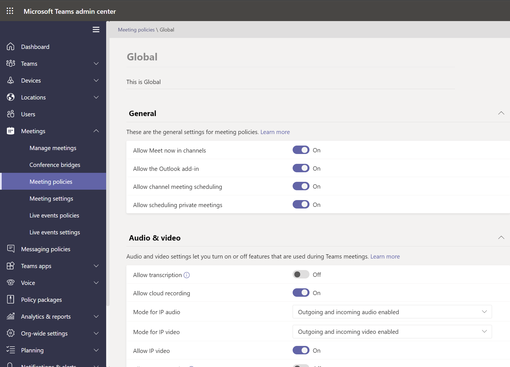

# <a name="assign-policies-in-teams--getting-started"></a>在 Teams 中分配策略 – 入门

作为管理员，可以使用策略来控制Teams用户可用的功能。 例如，有调用策略、会议策略和消息传递策略，仅举几例。

组织具有不同类型的用户，具有独特的需求。 通过创建和分配的自定义策略，可以根据这些需求为不同的用户集定制策略设置。

若要轻松管理组织中策略，Teams提供了多种将策略分配给用户的方法。 将策略直接分配给用户，不管是单独分配还是大规模分配，或者用户作为其成员的组。 还可使用策略包将预设的策略集合分配给组织中具有类似角色的用户。 选择的选项取决于要管理的策略数以及要为其分配策略的用户数。 全局 (组织范围内的默认) 策略适用于组织中的最多用户。 只需将策略分配给需要专用策略的用户。

本文介绍可以将策略分配给用户的不同方法，以及何时使用策略的建议方案。

若要详细了解如何 **向用户和组分配** 策略，请参阅 [向用户和组分配策略](assign-policies-users-and-groups.md)。 若要详细了解如何分配 **策略包，** 请参阅 [分配策略包](assign-policy-packages.md)。

## <a name="which-policy-takes-precedence"></a>哪些策略优先？

用户针对每种策略类型都有一个有效策略。 有可能（甚至有可能）直接为用户分配一个策略，并且该用户也是分配了相同类型的策略的一个或多个组的成员。 在这类方案中，哪一种策略优先？ 用户的有效策略根据优先级规则确定，如下所示。

如果直接为用户分配了一个策略 (单独分配或通过批处理分配) ，则该策略优先。 在下面的可视化示例中，用户的有效策略是直接分配给用户的"万网百元"会议策略。


如果未直接为用户分配给定类型的策略，则分配给该用户是其中一个成员的组的策略优先。 如果用户是多个组的成员，则对于给定策略类型 (组分配) 优先级最高的策略优先。 [](assign-policies-users-and-groups.md#group-assignment-ranking)

在此可视示例中，用户的有效策略是 Exec Teams 和 HD 策略，相对于该用户所参与的其他组，分配排名最高，并且还分配了相同策略类型的策略。  


如果用户未直接分配策略，或者不是任何分配了策略的组的成员，该用户会获取该策略类型的全局 (组织范围默认) 策略。 下面是一个可视示例。


有关详细信息，请参阅 ([优先级规则) 。](assign-policies-users-and-groups.md#precedence-rules)

## <a name="ways-to-assign-policies"></a>分配策略的方法

下面概述了如何向用户分配策略，以及为每个用户分配策略的建议方案。 选择链接以了解更多信息。

在向单个用户或组分配策略之前，请首先设置全局 (组织范围的默认 [) 策略](#set-the-global-policies) ，以便它们适用于组织中的最多用户。  设置全局策略后，只需将策略分配给需要专用策略的用户。

|执行此操作  |如果...  | 使用...
|---------|---------|----|
|[向单个用户分配策略](assign-policies-users-and-groups.md#assign-a-policy-to-individual-users)   | 你刚Teams入门，或者只需向少量用户分配一个或多个策略。 |Microsoft Teams PowerShell 模块中的 Teams 管理中心或 PowerShell cmdlet
|[向组分配策略](assign-policies-users-and-groups.md#assign-a-policy-to-a-group) |根据用户的组成员身份分配策略。 例如，将策略分配给安全组或通讯组列表中的所有用户。| Microsoft Teams PowerShell 模块中的 Teams 管理中心或 PowerShell cmdlet|
|[向一批用户分配策略](assign-policies-users-and-groups.md#assign-a-policy-to-a-batch-of-users)   | 将策略分配给大量用户。 例如，一次向组织中数百或数千个用户分配策略。 |Microsoft Teams PowerShell 模块中的 Teams 管理中心或 PowerShell cmdlet|
|[向用户分配策略包](assign-policy-packages.md#assign-a-policy-package-to-users)  |将多个策略分配给组织中具有相同或类似角色的特定用户集。 例如，将教育 (教师) 策略包分配给学校的教师，让他们完全访问聊天、通话和会议。 将教育 (中学生) 策略包分配给中学生，以限制某些功能，例如私人通话。  |Microsoft Teams PowerShell 模块中的 Teams 管理中心或 PowerShell cmdlet|
|[在个人预览版中将策略包](assign-policy-packages.md#assign-a-policy-package-to-a-group) (组)    |将多个策略分配给组织中具有相同或类似角色的一组用户。 例如，将策略包分配给安全组或通讯组列表中的所有用户。 |Microsoft Teams PowerShell 模块 (powerShell) PowerShell cmdlet 即将推出 Teams 管理中心|
|[将策略包分配给一批用户](assign-policy-packages.md#assign-a-policy-package-to-a-batch-of-users)|将多个策略分配给组织中具有相同或类似角色的一批用户。 例如，使用批处理分配 (教师) 策略包，让他们完全访问聊天、通话和会议。 将教育 (中学生) 策略包分配给一批辅助学生，以限制某些功能，例如私人通话。|PowerShell 模块Teams PowerShell cmdlet|

## <a name="set-the-global-policies"></a>设置全局策略

按照以下步骤设置每个策略 (组织范围的) 策略。

### <a name="using-the-microsoft-teams-admin-center"></a>使用 Microsoft Teams 管理中心

1. 在管理Microsoft Teams左侧导航中，转到要更新的策略类型的策略页。 例如 **，Teams Teams**  >  **策略**、**会议**  >  **策略**、**消息** 策略或 **语音**  >  **呼叫策略**。
2. 选择 **"全局 (组织范围的默认**) 策略以查看当前设置。
3. 根据需要更新策略，然后选择"应用 **"。**



### <a name="using-powershell"></a>使用 PowerShell

若要使用 PowerShell 设置全局策略，请使用全局标识符。  首先查看当前全局策略，确定要更改的设置。

```powershell
Get-CsTeamsMessagingPolicy -Identity Global
 
Identity                      : Global
Description                   :
AllowUrlPreviews              : True
AllowOwnerDeleteMessage       : False
AllowUserEditMessage          : True
AllowUserDeleteMessage        : True
AllowUserChat                 : True
AllowRemoveUser               : True
AllowGiphy                    : True
GiphyRatingType               : Moderate
AllowMemes                    : True
AllowImmersiveReader          : True
AllowStickers                 : True
AllowUserTranslation          : False
ReadReceiptsEnabledType       : UserPreference
AllowPriorityMessages         : True
ChannelsInChatListEnabledType : DisabledUserOverride
AudioMessageEnabledType       : ChatsAndChannels
Expand (20 lines) Collapse 
```

接下来，根据需要更新全局策略。  只需为要更改的设置指定值。

```powershell
Set-CsTeamsMessagingPolicy -Identity Global -AllowUserEditMessage $false
```

## <a name="view-your-policy-assignments-in-the-activity-log"></a>在活动日志中查看策略分配

在管理中心向Microsoft Teams分配策略时，可以在活动日志中查看这些策略分配的状态。 "活动日志"显示过去 30 天内通过 Microsoft Teams管理中心向超过 20 名用户的批次分配策略。 请记住，活动日志不会显示策略包分配、通过 Microsoft Teams 管理中心向少于 20 名用户的批次显示策略分配，或者通过 PowerShell 显示策略分配。


## <a name="view-your-policy-assignment-activities-in-the-activity-log"></a>在活动日志中查看策略分配活动

在活动日志中查看策略分配：

1. 在管理中心的左侧导航Microsoft Teams，转到"**仪表板**"，然后在"活动日志"**下选择"****查看详细信息"。**
2. 可以查看所有策略分配或按状态筛选列表，以只显示未启动、正在进行或 **已完成的分配**。  你将看到有关每个作业的以下信息：
    - **名称**：策略分配的名称。 单击该链接可查看更多详细信息。 这包括策略分配到的用户数，以及已完成、进行中和未启动的分配数。 还将看到批处理中的用户列表，以及每个用户的状态和结果。 下面是一个示例：

        

    - **已提交**：提交策略分配的日期和时间。
    - **完成时间**：完成策略分配的日期和时间。
    - **影响：** 批中的用户数。
    - **总体状态**：策略分配的状态。

> [!NOTE]
> 还可以从"用户"页 **访问活动日志** 。 单击" **应用** "提交批量策略分配后，页面顶部显示一个横幅。 单击 **横幅中的** "活动日志"链接。

## <a name="related-topics"></a>相关主题

- [将策略分配给用户和组](assign-policies-users-and-groups.md)
- [将策略包分配给用户和组](assign-policy-packages.md)
- [使用Teams管理策略](manage-teams-with-policies.md)
- [Teams PowerShell 概览](teams-powershell-overview.md)