# 面向教育的 Teams 策略和策略包Teams Policies and Policy Packages for Education

> [!NOTE]
> 有关 Microsoft Teams 中策略的更多信息，请查看[向 Microsoft Teams 中的用户分配策略](assign-policies.md)。For the larger story on policies in Microsoft Teams, please review [Assign policies to your users in Microsoft Teams](assign-policies.md).

请务必注意，本文将介绍多种向 Teams 中的用户分配策略的方法。It's important to note this article will cover multiple ways to assign policies to users in Teams.

- 手动分配给单个用户。Manual assign to individual users.
- 通过 PowerShell 批量分配给多个用户。Bulk assigning via PowerShell to multiple users.
- 将策略包分配给单个或多个用户。Assigning policy packages to individual or multiple users.

这些方法的优缺点取决于机构的个人需求。The advantages and disadvantages of these approaches come down to the institution's individual needs.

## 管理员：Microsoft Teams 策略管理入门Admins: Getting started with Microsoft Teams policy management

Microsoft Teams 的核心是使用户能够执行诸如参加会议或实时事件、聊天、拨打电话和使用应用之类的事情。Microsoft Teams, at its core, is about users being able to do things like go to meetings or live events, chat, make calls, and use apps. 设置恰当的 Microsoft Teams 管理员策略是为 Teams 中的学生营造安全的学习环境的关键一步。And setting the right Microsoft Teams admin policies is a critical step in creating a safe learning environment for students within Teams. 作为管理员，你可以使用策略来控制你的教育机构中的用户可以使用的 Teams 功能。As an admin, you can use policies to control the Teams features that are available to users in your educational institute.

下面是你将在 Microsoft Teams 中找到的策略区域列表：Here's a list of the policy areas you will find in Microsoft Teams:

- 会议Meetings
- 实时事件Live events
- 通话Calling
- 消息传递Messaging
- TeamsTeams
- 应用权限App permissions

:::image type="content" source="media/edu-admin-center-users.png" alt-text="应用了策略的用户的屏幕截图。":::

使用管理员凭据登录后，可轻松地在 [ Microsoft Teams 管理中心](https://admin.teams.microsoft.com)中管理所有 Teams 策略。You can easily manage all Teams policies in the [Microsoft Teams admin center](https://admin.teams.microsoft.com) by signing in with your admin credentials.

### 在哪里可以找到 Microsoft Teams 策略Where to find Microsoft Teams policies

登录 Teams 管理中心后，可单击 Teams 管理中心左侧导航中的策略选项，转到需要管理的任何 Teams 区域的策略设置。Once you've logged into the Teams admin center, you'll be able to go to the policy settings for any area of Teams you need to manage, by clicking on the policy option in the left hand navigation of the Teams admin center. 我们提供了消息传递策略位置的屏幕截图。We've included a screenshot of the location of the messaging policies.

:::image type="content" source="media/edu-messaging-policies.png" alt-text="Teams 管理中心中的消息策略位置。":::

### 如何创建和更新策略定义How to create and update a policy definition

在向用户分配策略之前，你需要首先通过 Teams 为每个功能区域添加和创建策略定义。Before you assign policies to your users, you need to first add and create your policy definitions for each capability area with Teams.

> [!NOTE]
> 建议为学生和教师设置不同的策略定义。We recommend that you set different policy definitions for your students and educators.

默认情况下，将为每个新用户（学生或教师）分配每个功能区域的全局（组织范围默认）策略定义。By default, every new user (student or educator) will be assigned the Global (Org-wide default) policy definition for each capability area. 建议按照下列步骤操作：We recommend you follow these steps:

1. 为每个 Teams 功能区域创建一个自定义策略定义，然后可以将其分配给教师（如果不这样做，则你对全局策略所做的任何更改都会限制教师，直到他们拥有自己的策略为止）。Create a custom policy definition for each Teams capability area that can then be assigned to your educators (without this, any changes you make to the Global policy will restrict educators until they have their own policy).
1. 将教师分配给新的策略定义。Assign your educators to this new policy definition.
1. 更新全局（组织范围默认）策略定义，然后将其分配给学生。Update the Global (Org-wide default) policy definition, then assign it to your students.

若要创建或编辑策略定义，请转到要使用的策略功能区域（例如，消息传递策略）。To create or edit policy definitions, go to the policy capability area you want to work in (for example, Messaging policies). 如果想要创建新的自定义策略定义（将为针对教师创建的自定义策略定义执行此操作），请选择“**添加**”。Select **Add** if you want to create a new custom policy definition (which you'll do for the custom policy definition you create for educators). 或者，若要更改现有策略定义，请选择“**编辑**”（如果选择为学生更新全局策略，则会执行此操作）。Otherwise, to change an existing policy definition, then select **Edit** (which will be what you do if you choose to update the Global policy for students).

:::image type="content" source="media/edu-messaging-policies-add-closeup.png" alt-text="消息传递策略部分的特写，可看到“添加”按钮。":::

无论选择添加还是编辑策略定义，你都将进入一个视图，其中列出了与此策略区域相关的所有策略选项。Whether you choose to add or edit a policy definition, you're brought to a view that lists all the policy options related to this policy area. 使用此列表可选择要在策略定义中设置的值。Use this list to select what values you want set in your policy definition.

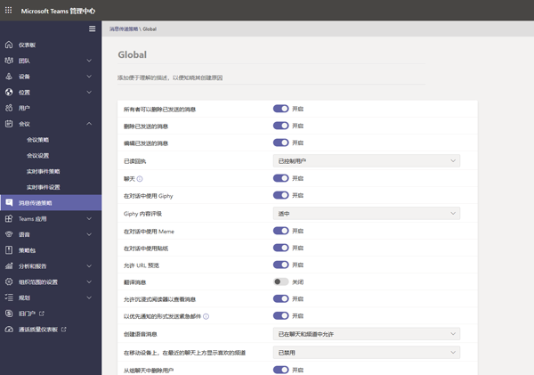

> [!IMPORTANT]
> 离开页面前，请不要忘记选择“**保存**”。Don’t forget to select **Save** before you leave the page.

### 如何向用户分配策略定义How to assign a policy definition to a user

> [!NOTE]
> 分配策略定义时，可能需要一段时间才能传播给所有用户和客户端。Assigning a policy definition may take a while to propagate out to all the users and clients. 首次在 Azure/M365 中创建用户帐户时，以及每当有新学生加入教育机构时，你都可能需要执行此操作。You might want to do this when the user accounts are first created in Azure/M365, and whenever a new student joins the educational institute.

创建或更新策略定义后，可通过在策略页面中选择“**管理用户**”，搜索所需的用户，然后应用策略，将其分配给用户。Once your policy definition is created or updated, you can assign it to a user by selecting **Manage users** in policy page, searching for the desired user then applying the policy.

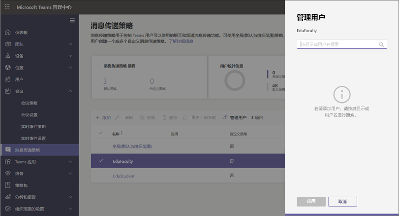

你还可以通过导航到“用户”，选择要为其更新策略的用户，选择“策略”，然后选择“编辑”，将策略分配给用户。You can also assign a policy to a user by navigating to Users, selecting the user you wish to update policies for, selecting Policies, then Edit. 在此处，可以选择对于每个功能区域要分配给用户的策略定义。From there, you can select the policy definition you’d like to use assign to the user for each capability area.

> [!IMPORTANT]
> 如果你是大型教育机构的一员，则可能很难利用 Microsoft Teams 管理门户体验为每个用户设置策略。If you're part of a large educational institute, using the Microsoft Teams admin portal experience to set policies for each user may be difficult. 最好通过 PowerShell 批量分配策略。It'll be better for you to assign policies in batches via PowerShell. 我们提供了一些特定于 EDU 的信息，说明如何[将策略分配给教育机构中的大量用户](batch-policy-assignment-edu.md)（如果需要），你还可以查看下面有关策略包的部分，这是另一种管理大量用户的策略和设置的好方法。We have some EDU-specific information on how to [Assign policies to large sets of users in your educational institute](batch-policy-assignment-edu.md) if you need it, and you can also check out the section below on policy packages, which are another great way to manage policies and settings for large groups of users.

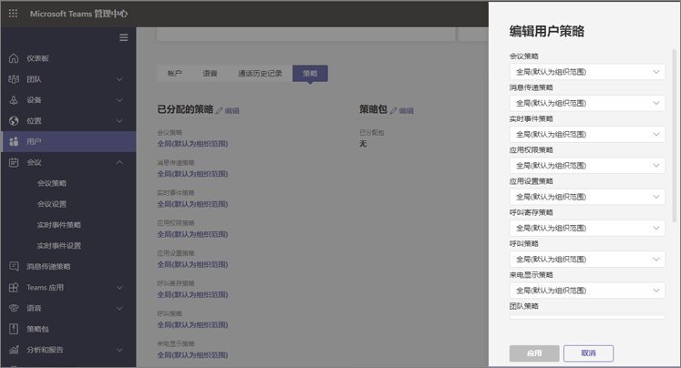

### Microsoft Teams 中的策略包Policy packages in Microsoft Teams

Teams 中的策略包将收集预定义策略和上述策略设置，并将其分配给机构中具有相似角色的用户。A policy package in Teams collects predefined policies and policy settings that you learned about outlined above, and assigns them to users with similar roles in your institution. 策略包可简化并有助于提供一致的策略管理。Policy packages simplify, streamline, and help provide consistency when managing policies. 通常，为每个用户分配一个策略包，然后根据需要重新定义每个包中的策略，以满足该用户组的需要。In normal practice, you assign each of your users a policy package, and  redefine the policies in each package as needed to suit the needs of that user group. 更新包中的设置时，分配给该包的所有用户都将作为批量更新进行更改。When you update settings in a package, all users assigned to that package are changed as a bulk update.

一般情况下，教育机构的许多用户有其独特的需求，部分取决于学生的年龄和成熟度。Educational institutions in general have many users with unique needs, depending partly on the age and maturity of the students. 例如，你可能想要授予教师和教职员工对 Microsoft Teams 的完全访问权限，但想要对学生限制 Microsoft Teams 功能，以便鼓励营造安全且专注的学习环境。For example, you may want to grant educators and staff full access to Microsoft Teams, but want to limit Microsoft Teams capabilities for students to encourage a safe and focused learning environment. 可使用策略包根据教育机构社区中不同群体的需求来定制设置。You can use policy packages to tailor settings based on the needs of different cohorts in your educational institute community.

> [!NOTE]
> 有关详细信息，可查看[管理 Microsoft Teams 中的策略包](manage-policy-packages.md)，了解有关向单个用户分配包、向多达 5000 个用户批量分配包以及管理和更新链接到每个包的策略的分步指导。For more reading, you can check out [Manage policy packages in Microsoft Teams](manage-policy-packages.md) for step by step guidance on assigning single users a package, assigning packages in bulk to up to 5000 users, and managing and updating the policies linked to each package.

就像本文前面的策略列表一样，策略包预定义以下各项的策略：Just like the policy list earlier in this article, policy packages predefine policies for:

- 会议Meetings
- 实时事件Live events
- 通话Calling
- 消息传递Messaging
- TeamsTeams
- 应用权限App permissions

Microsoft Teams 当前包含以下策略包：Microsoft Teams currently includes the following policy packages:

|Microsoft Teams 管理中心中列出的包名称Package name listed in Microsoft Teams Admin center |最适合用于Best used for  |说明Description |
|:--- |:--- |:--- |
|**Education_Teacher****Education_Teacher**| 教师和教职员工Educators and staff| 使用这组策略和策略设置可以为组织中的教师和教职员工授予通过 Microsoft Teams 进行聊天、通话和会议的完全访问权限。Use this set of policies and policy settings to grant educators and staff within your organization full access to chat, calling and meetings through Microsoft Teams. |
|**Education_PrimaryStudent****Education_PrimaryStudent**| 小学适龄学生Primary school aged students  | 你所在机构内年幼的小学适龄学生可能需要 Microsoft Teams 中的更多限制。Younger, primary school aged students within your institution may need more limits within Microsoft Teams. 使用这组策略和策略设置可限制会议创建和管理、聊天管理和私人通话等功能。Use this set of policies and policy settings to limit capabilities like meetings creation and management,  chat management, and private calling. |
|**Education_SecondaryStudent****Education_SecondaryStudent**| 中学学龄学生Secondary school aged students | 你所在机构内的中学适龄学生可能需要 Microsoft Teams 中的更多限制。Secondary school aged students within your institution may need more limits within Microsoft Teams. 使用这组策略和策略设置可限制会议创建和管理、聊天管理和私人通话等功能。Use this set of policies and policy settings to limit capabilities like meetings creation and management,  chat management, and private calling. |
|**Education_HigherEducationStudent****Education_HigherEducationStudent**| 高等教育学生Higher education students | 你所在机构内的高等教育学生所需的限制可能比年幼学生要少，但是可能建议采用某些限制。Higher education students within your intuition may need fewer limits than younger students, but some limitations may be recommended. 可以使用这组策略和策略设置来授予对组织内的聊天、通话和会议的访问权限，但限制学生与外部参与者一起使用 Microsoft Teams 的方式。You can use this set of policies and policy settings to give access to chat, calling, and meetings within your  organization, but limit how your students use Microsoft Teams with external participants. |
|**Education_PrimaryTeacher_RemoteLearning****Education_PrimaryTeacher_RemoteLearning**| 教师和教职员工Educators and staff | 创建一组适用于主要教师的策略，在远程学习中最大化学生的安全和协作。Creates a set of policies that apply to primary teachers to maximize student safety and collaboration when using remote learning. |
|**Education_PrimaryStudent_RemoteLearning****Education_PrimaryStudent_RemoteLearning**| 小学适龄学生Primary school aged students| 创建一组适用于主要学生的策略，在远程学习中最大化学生的安全和协作。Creates a set of policies that apply to primary students to maximize student safety and collaboration when using remote learning.
|||

:::image type="content" source="media/edu-policy-packages-list.png" alt-text="策略包页面，其中包含可供选择的策略包列表。":::

将为每个单独的策略提供策略包的名称，以便你可以轻松识别链接到该策略包的策略。Each individual policy is given the name of the policy package so you can easily identify policies linked to a policy package. 例如，当你将 Education_Teacher 策略包分配给教育机构中的教师时，将为包中的每个策略创建一个名为 Education_Teacher 的策略。For example, when you assign the Education_Teacher policy package to educators in your educational institution, a policy named Education_Teacher is created for each policy in the package.

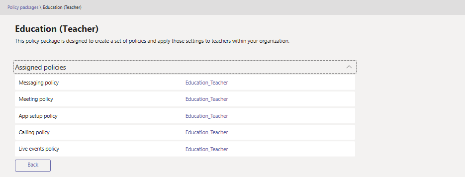

> [!NOTE]
> 如果确定教师和管理支持人员需要不同的策略，则可以重新调整现有包：识别当前不使用的包，并更改设置以适合该组。If you decide that educators and administrative support staff need different policies, you can repurpose an existing package: identify a package you aren't currently using and change the settings to be appropriate for that group. 你可能需要自己记录哪个小组拥有哪个包，但这是重新调整包的唯一障碍。You might have to make a note to yourself which group has which package, but that's the only impediment to repurposing a package.

## 应为学生安全分配的策略Policies that should be assigned for student safety

### 会议策略Meeting policies

#### 关闭创建和启动会议的功能Turn off the ability to create and start meetings

> [!NOTE]
> 你现在可能还没有在租户中发现此功能。You may not notice this functionality in your tenant right now. 这是因为此功能当前还在推出过程中，将在完成在所有租户上的部署后向所有用户推出。That's because this feature is currently being rolled out, and will be available to all users once it's been rolled out to all tenants. 有关详细信息，请参阅 [Teams 路线图](https://www.microsoft.com/microsoft-365/roadmap?filters=&searchterms=63355)。Please see the [Teams Roadmap](https://www.microsoft.com/microsoft-365/roadmap?filters=&searchterms=63355) for more information.

若要确保学生无法安排会议来进行无人参与的通信，可通过以下常规设置将会议策略设置为**关闭**会议创建功能：To ensure that students can’t schedule a meeting to communicate unattended, in meeting policies set to **Off** meeting creation capabilities through these General settings:

- **允许在频道中立即开会**：关闭**Allow Meet now in channels**: Off
- **允许 Outlook 加载项**：关闭**Allow the Outlook add-in**: Off
- **允许安排频道会议**：关闭**Allow channel meeting scheduling**: Off
- **允许安排私人会议**：关闭**Allow scheduling private meetings**: Off

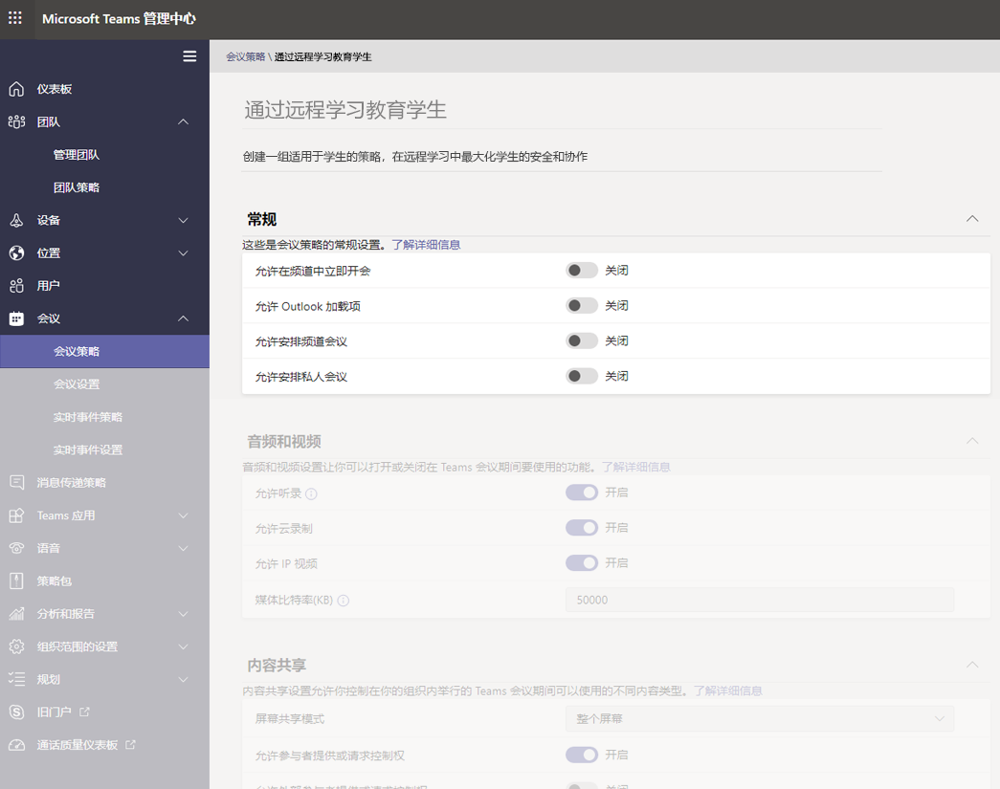

- 在同一页面上，在会议部分中的“参与者和来宾”中：And on the same page, in the Participants and Guests in meeting section:
  - **允许在私人会议中立即开会**：关闭**Allow Meet now in private meetings**: Off
  - **允许在会议中聊天**：已禁用**Allow chat in meetings**: Disabled

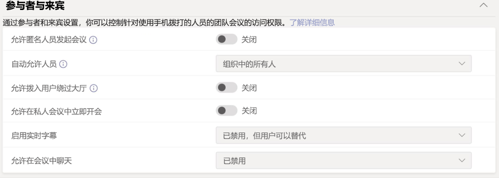

为学生关闭“**允许在频道中立即开会**”、“**允许安排频道会议**”、“**允许安排私人会议**”和“**在私人会议中立即开会**”，不仅可阻止学生以组织者身份安排会议，还可为教育客户提供以下安全措施：Turning off **Allow Meet now in channels**, **Allow channel meeting scheduling**, **Allow scheduling private meetings**, and **Meet now in private meetings** for students not only blocks students from scheduling a meeting as the organizer, they also provide the following safety measures for education:

- 如果学生尝试在教师之前加入会议，则他们将无法在最新版本的 Teams 应用中加入会议。If students attempt to join the meeting before the educator, they won't be able to join the meeting in the latest version of the Teams app.
- 尽管会议创建适用于任何用户和任何许可证，但是上述有关会议加入阻止的安全措施仅基于用户的许可证类型应用于 Teams 中的教育客户。Although meeting creation applies to any users and any licenses, the safety measures on meeting join block described above apply only to education customers in Teams based on the users’ license type.

如果你将“**允许在会议中聊天**”策略更改为禁用，并阻止学生从上方安排会议，但是继续对教育工作者启用此策略时（对于不是从某个频道或频道中的“立即开会”安排的会议），则学生将无法在教师加入会议之前进行聊天，也不能在会议结束后进行聊天。When you change the **Allow chat in meetings** policy to disabled and block students from scheduling meetings from above while and keep this policy on for educators (for the meetings that are not scheduled from a channel or meet now in a channel), students won't be able to chat before the educator joins the meeting, nor after the meeting. 他们仍然可以在会议之前、期间和之后查看历史聊天记录。They will still be able to see the chat history before, during, and after the meeting. 例如，他们将能够查看来自老师的消息或会议录制链接（如果录制了会议）。As an example, they'll be able to see messages from the teacher, or the meeting recording link, if the meeting was recorded.

如果学生和教师都禁用了“**允许在会议中聊天**”策略，则任何人都无法在会议聊天窗口中聊天。If both students and educators have the **Allow chat in meetings** policy turned off, no one will be able to chat in the meeting chat window. 上述关于会议聊天限制的安全措施仅基于用户的许可类型应用于 Teams 中的教育客户。The safety measure on meeting chat restriction described above only applies to education customers in Teams based on users’ license type.

#### 控制学生是否可以在通话和会议期间分享他们的视频Control whether or not students can share their videos during calls and meetings

在会议策略部分，确保为学生设置的音频和视频值与教育机构的指导原则以及学生、教师、家长和监护人的期望相符（“**允许云录制**”除外，建议将其设置为“**关闭**”）。In the meeting policies section, ensure that the Audio and visual values you set for your students aligns to your educational institution’s guidelines, as well as the desires of students, educators, and parents and guardians (With the exception of **Allow cloud recording**, which we recommend be set to **Off**).

选项如下：The options here:

- **允许听录**：关闭/打开**Allow transcription**: Off/On
- **允许云录制**：**关闭****Allow cloud recording**: **Off**
- **允许 IP 视频**：关闭/打开**Allow IP Video**: Off/On

:::image type="content" source="media/edu-policy-list-b.png" alt-text="远程学习页面中的教育学生，其中显示视频选项。":::

### 实时事件策略Live events policies

#### 关闭创建和启动实时事件的功能Turn off the ability to create and start live events

若要确保学生无法计划实时事件来进行无人参与的通信，请为学生禁用“**允许安排**”策略，方法是将其设置为“**关闭**”。To ensure that students can’t schedule a live events to communicate unattended, disable the **Allow scheduling** policy for students by setting it to **Off**.

:::image type="content" source="media/edu-allow-scheduling-off.png" alt-text="远程学习页面中的教育学生，其中“允许安排”选项已关闭。":::

### 通话策略Calling policies

#### 关闭进行私人通话的功能Turn off the ability to make private calls

若要确保学生无法与其他学生或教师进行私人通话，可为学生禁用“**拨打私人电话**”策略，方法是将其设置为“**关闭**”。To ensure that students can’t make private calls with other students or educators, disable the **Make private calls** policy for students by setting it to **Off**.

:::image type="content" source="media/edu-private-calls-off.png" alt-text="远程学习页面中的教育学生，其中“拨打私人电话”设置为“关闭”。":::

### 消息传递策略Messaging policies

#### 关闭删除或编辑已发送消息的功能Turn off the ability to delete or edit sent messages

- 对于学生：若要确保学生发送的消息未被删除或更改，学生应将以下设置设为“**关闭**”：For students: To make sure the messages that students send aren’t deleted or altered, students should have these settings turned **Off**:
  - **删除已发送的消息****Delete sent messages**
  - **编辑已发送的消息****Edit sent messages**
- 对于教师：若要确保教师能够审查或删除学生发送的不适当消息，教师应将以下设置设为“**打开**”：For educators: To make sure that educators can moderate or delete inappropriate messages students sent, educators should have these settings turned **On**:
  - **所有者可以删除已发送的消息**（此设置允许教师删除不适当的学生消息）**Owners can delete sent messages** (This setting allows educators to delete inappropriate student messages)
  - **删除已发送的消息****Delete sent messages**
  - **编辑已发送的消息****Edit sent messages**

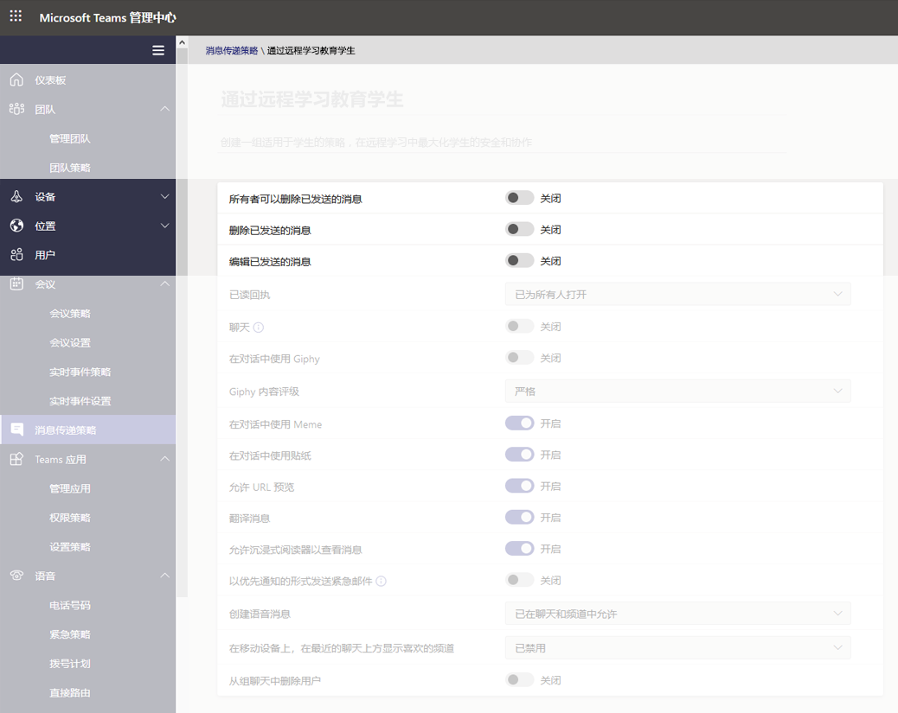

> [!NOTE]
> 有关此主题的详细信息，请查看[将课堂团队中的学生设为静音](https://support.office.com/article/Mute-student-comments-in-a-class-team-a378de16-ffc0-420c-b08d-e17ec08e7c17)。For more information on this topic, check out [Mute student comments in a class team.](https://support.office.com/article/Mute-student-comments-in-a-class-team-a378de16-ffc0-420c-b08d-e17ec08e7c17).

#### 控制学生是否可以私下聊天Control whether students can chat privately

确保为学生设置的“**聊天打开/关闭**”值与教育机构的指导原则以及学生和教师的期望相符。Ensure that the **Chat On/Off** value you set for students aligns to your educational institution’s guidelines as well as the desires of students and educators. 此控件可打开或关闭用户在 Teams 中一对一私聊或群聊的功能。This control turns on or off the ability for a user to communicate privately in 1:1 chat or group chat in Teams.

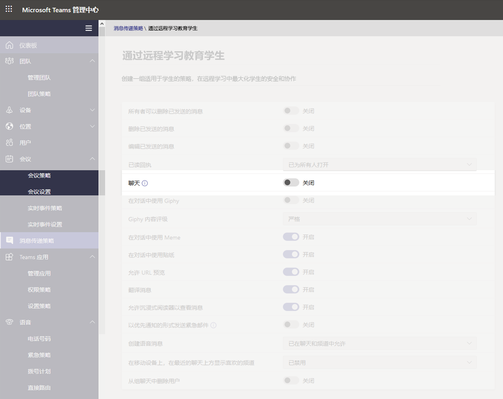

#### 控制学生是否可以对其消息进行个性化设置Control whether students can personalize their messages

确保为学生设置的值与教育机构的指导原则以及学生、教师、家长和监护人的期望相符。Ensure that the value you set for students aligns to your educational institution’s guidelines as well as the desires of students, educators, parents, and guardians. 建议将“**适用于学生的 Giphy**”设置为“**关闭**”，并**打开**“**Meme 和贴纸**”。Our recommendation is to set **Giphy for students** to **Off**, and keep **Memes and Stickers** turned **On**.

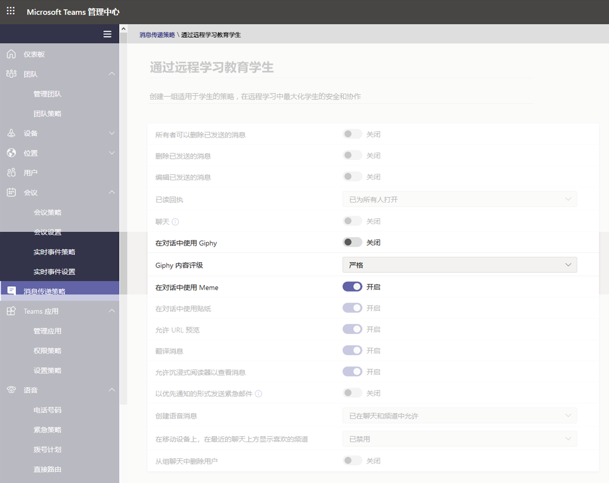

#### 控制学生是否可以发送语音消息Control whether students can send voice messages

确保为学生设置的“**创建语音消息**”值与教育机构的指导原则以及学生和教师的期望相符。Ensure that the value you set for **Create voice messages** for students aligns to your educational institution’s guidelines as well as the desires of students and educators.

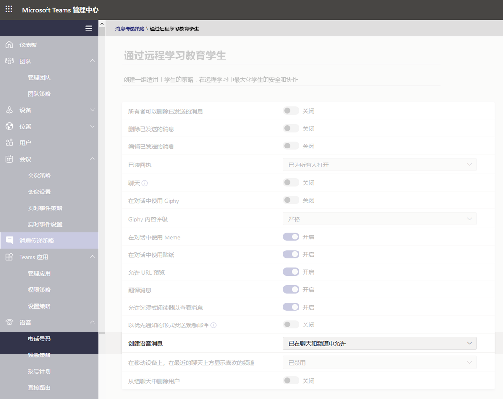

#### 关闭从聊天中删除用户的功能Turn off the ability to remove users from chat for students

学生不应能够从其参与的任何聊天中删除其他用户。Students should not have the ability to remove other users from any chats they're included in. “**从组聊天中删除用户**”的设置应设为“**关闭**”。The setting for **Remove users from group chats** should be set to **Off**.

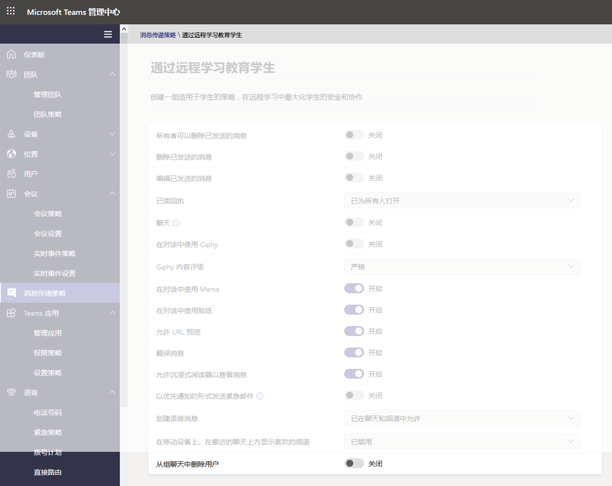

### Teams 策略Teams policies

#### 关闭发现和创建专用频道的功能Turn off the ability to discover and create private channels

若要确保学生无法创建专用频道作为个人空间来在没有监督的情况下进行交流，请为学生将“**创建专用频道**”策略设置为“**关闭**”。To ensure that students can’t create a private channel as personal space to communicate without supervision, set the **Create private channels** policy for students to **Off**.

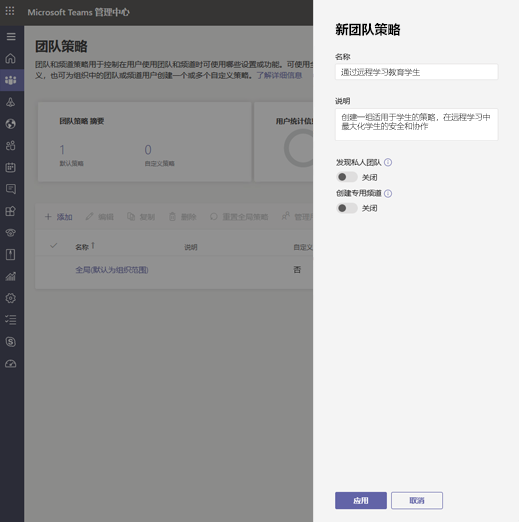

> [!IMPORTANT]
> 你可能还希望确保学生无法在 Microsoft Teams 中创建新团队。Likely you will also want to ensure students don't have the ability to create new teams in Microsoft Teams. 这实际上是一个 M365 组设置，可在[此处](https://docs.microsoft.com/microsoft-365/admin/create-groups/manage-creation-of-groups)了解更多信息。This is actually an M365 groups setting, and you can read more about it [here](https://docs.microsoft.com/microsoft-365/admin/create-groups/manage-creation-of-groups).

### 应用权限策略App permission policies

#### 控制学生是否可以在 Teams 中添加应用Control whether students can add apps within Teams

确保为学生设置的值与教育机构的指导原则相符。Ensure the values you set for students align to your educational institution’s guidelines. 例如，如果希望让学生使用你批准的应用程序，则可以选择：For example, if you’d like the students to be exposed to the apps you approve, you can select:

- **Microsoft 应用**：**允许所有应用****Microsoft apps**: **Allow all apps**
- **对于第三方应用**：**允许特定的应用并阻止其他所有应用****For Third-party apps**: **Allow specific apps and block all others**
- **对于租户应用**：**允许特定的应用并阻止其他所有应用****For Tenant apps**: **Allow specific apps and block all others**

:::image type="content" source="media/edu-policies-apps.png" alt-text="远程学习页面中的教育学生以及设置的应用策略选项。":::

> [!NOTE]
> 这是一个示例，如上所述，应按照教育机构的指导原则设置这些策略。This is an example, and as stated above, you should set these policies in accordance to your educational institution's guidelines.

## 应为教师分配的策略Policies that should be assigned for educators

这些是建议管理员应用于教师的策略设置，以便他们可以为其学生提供安全的课堂体验。These are recommended policy settings for admins to apply for educators, so they can have a safe class experience for their students.

> [!NOTE]
> 与将在下面看到的教师部分相比，针对学生的策略建议包含更多信息。The policy recommendations for students contains more information than the educators' sections you'll see below. 尽管你可以根据自己的教育机构的政策和程序来设置策略设置，但此处提供的建议与学生的安全密切相关。While you may set policy settings in-line with your educational institute's own policies and procedures, the recommendations provided here are strictly relevant when it comes to the safety and security of students.

### 会议策略Meeting policies

这些设置将允许教师控制对其会议的访问。These settings will allow educators to control access to their meetings.

- **允许匿名人员发起会议**：**关闭****Let anonymous people start a meeting**: **Off**
- **自动允许人员**：**你所在组织中的所有人****Automatically admit people**: **Everyone in your organization**
- **允许拨号加入的用户绕过大厅**：**关闭****Allow dial-in users to bypass the lobby**: **Off**
- 1**DesignatedPresenterRoleMode**: **OrganizerOnlyUserOverride**1**DesignatedPresenterRoleMode**: **OrganizerOnlyUserOverride**

1 该设置不在 Microsoft Teams 管理中心中，因此你将需要使用 PowerShell 通过 [Set-CsTeamsMeetingPolicy](https://docs.microsoft.com/powershell/module/skype/set-csteamsmeetingpolicy) 或 [New-CsTeamsMeetingPolicy](https://docs.microsoft.com/powershell/module/skype/new-csteamsmeetingpolicy) cmdlet 设置 **DesignatedPresenterRoleMode** 参数。1 This setting isn't in the Microsoft Teams admin center, so you'll need to use PowerShell to set the **DesignatedPresenterRoleMode** parameter using the [Set-CsTeamsMeetingPolicy](https://docs.microsoft.com/powershell/module/skype/set-csteamsmeetingpolicy) or [New-CsTeamsMeetingPolicy](https://docs.microsoft.com/powershell/module/skype/new-csteamsmeetingpolicy) cmdlet. 这将把 Teams“**会议选项**”中的“**谁可以参加?** 设置的默认值设置为“**只有我**”。This sets the default value of the **Who can present?** setting in **Meeting options** in Teams to **Only me**. 通过此设置，只有会议组织者可以成为演示者，所有其他会议参与者都将被指定为与会者。With this setting, only the meeting organizer can be a presenter and all other meeting participants are designated as attendees. 若要了解详细信息，请参阅“[会议策略设置 - 指定的演示者角色模式](meeting-policies-in-teams.md#meeting-policy-settings---designated-presenter-role-mode)”。To learn more, see [Meeting policy settings - Designated presenter role mode](meeting-policies-in-teams.md#meeting-policy-settings---designated-presenter-role-mode).

> [!NOTE]
> 对于不是教师的教职员工，你可能希望将参数设置为 **EveryoneUserOverride**（对应于 Teams 中的“**每个人**”设置）或 **EveryoneInCompanyUserOverride**（对应于 Teams 中的“**我的组织中的人员**”设置。）For staff who aren't educators, you may want to set the parameter to **EveryoneUserOverride** (which corresponds to the **Everyone** setting in Teams) or **EveryoneInCompanyUserOverride** (which corresponds to the **People in my organization** setting in Teams.)

### 消息传递策略Messaging policies

将“**所有者可以删除已发送的消息**”设置为“**打开**”时，教师能够监视聊天会话并删除频道会议中不适当的消息。Setting **Owners can delete sent messages** to **On** will allow educators to monitor chat sessions and remove inappropriate messages in channel meetings.

> [!NOTE]
> 这样，当在频道内创建会议时，教师可以删除班级聊天中不适当的消息，或者删除频道本身内的消息。This allows educators to remove inappropriate messages in class chats when the meeting is created within the channel, or to remove messages within the channel itself.

## 教师可执行哪些操作来保护学生What educators can do to protect students

当然，虽然设置策略是管理员在 Teams 设置中主动保护学生的一种好方法，但教师是定期与学生互动的人，他们在确保学生安全方面也起着至关重要的作用。Of course, while setting policies is a great way for Admins to proactively protect students in a Teams setting, educators are the people who are interacting with the students on a regular basis, and they also have a vital role to play to keep students safe. 管理员可能需要与同自己协作的讲师讨论以下信息。Admins may want to discuss the following information with the educators they work with.

### 通过会议选项设置会议角色Set meeting roles through your Meeting options

通过会议选项，你可以控制会议参与者以与会者还是演示者身份加入你的会议。Meeting options allow you to control if meeting participants join your meetings as attendees or presenters. 选项如下：Your options are:

- 转到“**日历**”并导航到要更新的会议。Go to your **Calendar**  and navigate to the meeting you'd like to update. 单击或点击会议加入链接附近的“**会议选项**”以打开“**会议选项**”。Click or tap **Meeting options** near the meeting join link to open your **Meeting options**.

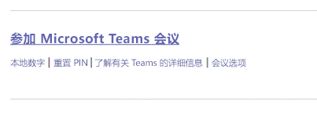

- 通过“**谁可以绕过大厅**”部分来控制谁可以直接进入会议。Control who can enter the meeting directly with the **Who can bypass the lobby** selection. 将其设置为“**我组织中的人员**”以防止外部用户有选项进入，然后将“**始终允许呼叫者绕过大厅**”设置为“**关闭**”，以使参与者等待准许加入会议，而不是立即加入会议。Set it to **People in my organization** to keep external users from having the option to enter, and turn **Always let callers bypass the lobby** to **Off** to have participants wait to be admitted to the meeting instead of joining immediately. 你还可以选择“**在呼叫方加入或退出会议时通知**”，并且应将其设置为“**打开**”，以便你始终了解哪些人出席会议。You also have the option to **Announce when callers join or leave**, and this should be set to **On** so you're always aware of who's in the meeting.
- 控制作为演示者或与会者加入会议的人员。Control who joins the meeting as a presenter or attendee. 可以选择“**仅我**”来指定所有其他参与者为与会者。You can select **Only Me** to designate all other participants as attendees. 对于在课堂环境中举行的会议，这是最安全的设置。This is the safest set-up for meetings held in a classroom setting.
  - 如果希望会议中有多个演示者，请选择“**特定用户**”，然后选择应作为演示者加入的其他参与者。If you expect to have more than one presenter in your meeting, select **Specific people** and pick the other participants who should join as presenters. 如果希望所有参与者都作为演示者加入会议，请选择“**所有人**”。Select **Everyone** if you want all participants to join the meeting as a presenter.

:::image type="content" source="media/edu-meeting-options.png" alt-text="“谁可以绕过大厅”下拉列表并选中“我组织中的人员”，“谁可进行演示”下拉列表并选中“仅我”。":::

### 联机会议中的角色Roles in an online meeting

会议的每位参与者都会被分配演示者或与会者角色。Every participant in a meeting is assigned a role as a presenter or attendee. 参与者的角色控制他们在会议中可以执行的操作。A participant's role controls what they can do in a meeting. 请参阅下表。Please see the table below.

|功能Capabilities  |组织者/演示者Organizer/Presenter  |与会者Attendee  |
|---------|---------|---------|
|说话和共享视频Speak and share video     |     YY     |     YY     |
|参加会议聊天Participate in meeting chat     |     YY     |     YY     |
|私下查看其他人共享的 PowerPoint 文件Privately view a PowerPoint file shared by someone else     |     YY     |     YY     |
|共享内容Share content     |     YY     |     NN     |
|使其他参与者静音Mute other participants|     YY     |     NN     |
|删除参与者Remove participants      |     YY     |     NN     |
|允许大厅中的参与者进入Admit participants from the lobby|     YY     |     NN     |
|更改其他参与者的角色Change the roles of other participants     |     YY     |     NN     |
|开始或停止录制Start or stop recording     |     YY     |     NN     |

### 在会议期间更改角色Change roles during a meeting

会议的每位参与者都会被分配演示者或与会者角色。Every participant in a meeting is assigned a role as presenter or attendee. 参与者的角色控制他们在会议中可以执行的操作。A participant's role controls what they can do while in a meeting.

- 要更改参与者的角色，请在通话控件中单击或点击“**显示参与者**”。To change a participant's role, click or tap to **Show participants** in your call controls. 右键单击需要更改其角色的参与者，然后选择“**设为与会者**”或“**设为演示者**”。Right-click on the participant whose role needs to be changed, and then select **Make an attendee** or **Make a presenter**.

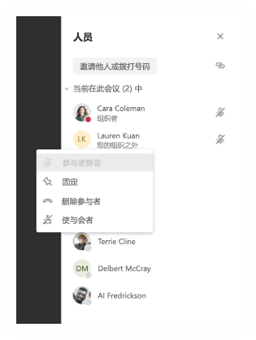

- 要快速访问你的会议选项并更改当前参与者和将来加入会议的任何人的会议角色设置，请在通话控件中单击或点击“**更多操作**”，然后单击“**显示会议详细信息**”。To quickly access your Meeting options and change the meeting role settings for both current participants and anyone joining your meeting in the future, click or tap **More actions** in your call controls, and then **Show meeting details**. 可在会议的加入链接附近找到指向“**会议选项**”的链接。You can find the link to your **Meeting options** near the join link for the meeting.

:::image type="content" source="media/edu-meeting-details.png" alt-text="会议窗口，右侧为会议详细信息窗格。":::

### 将学生评论静音Mute student comments

会议结束后，如果安排了频道会议，则可以阻止学生进一步发表评论。After the meeting, you can block students from commenting further if you scheduled a channel meeting.

#### 对于特定会议For a specific meeting

当你在频道中安排会议时，会议本身是一个频道帖子，并且会议聊天是帖子的副本。When you schedule a meeting in a channel, the meeting itself is a channel post, and the meeting chats are replicas of the post. 作为团队所有者，你可对该帖子单击或点击“**更多操作**”，然后单击“**编辑**”。As the team owner, you can click or tap **More actions** for that post, click **Edit**.

:::image type="content" source="media/edu-meeting-edit.png" alt-text="在频道帖子上选择更多选项，可看到“编辑”菜单选项显示为弹出菜单上的第二个选项。":::

编辑窗格上有一个下拉选项，可将该选项设置为“**你和审查方可以回复**”。On the edit pane, you have a dropdown option, where you can set that option to be **You and moderators can reply**.

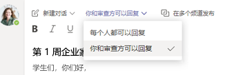

### 对于团队的所有会议和发布For all meetings and posts of a team

你可以控制学生何时可以在课堂团队和会议聊天中发布和回复。You can control when students can post and reply in the class team and meeting chats. 单击或点击团队的“**更多操作**”，单击“**管理团队**”，转到“**成员**”，然后选择要静音的个人或“**将所有学生设为静音**”。Click or tap **More actions** of the team, click **Manage Team**, go to **Members**, and either select individuals to mute or **Mute all students**.

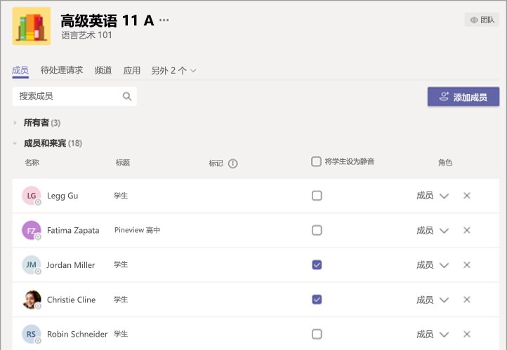

## 延伸阅读Further reading

请查看[使用 Teams 会议进行远程学习时保证学生安全](https://support.office.com/article/keeping-students-safe-while-using-meetings-in-teams-for-distance-learning-f00fa399-0473-4d31-ab72-644c137e11c8)，了解有关保护学生的详细信息。Please review the [Keeping students safe while using meetings in Teams for distance learning](https://support.office.com/article/keeping-students-safe-while-using-meetings-in-teams-for-distance-learning-f00fa399-0473-4d31-ab72-644c137e11c8) for more information on protecting students.
