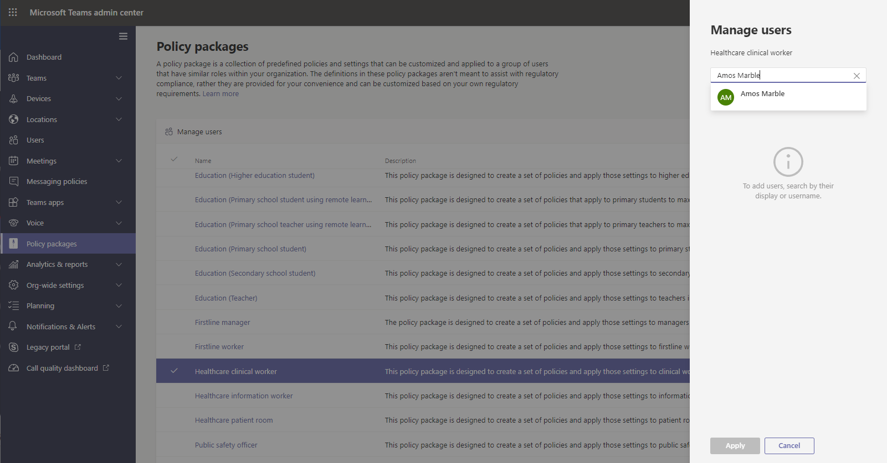

# Teams政府部署策略包Teams policy packages for government

> [!NOTE]
> 目前，在政府高级部署Microsoft 365 DoD GCC策略包不可用。Policy packages are currently not available in Microsoft 365 Government GCC High or DoD deployments.

## 概述Overview

Microsoft Teams 中的[策略包](manage-policy-packages.md)是一组预定义的策略和策略设置，你可以将其分配给组织中具有类似角色的用户。A [policy package](manage-policy-packages.md) in Microsoft Teams is a collection of predefined policies and policy settings that you can assign to users who have similar roles in your organization. 策略包可简化并有助于提供一致的策略管理。Policy packages simplify, streamline, and help provide consistency when managing policies. 你可以自定义包中策略的设置以满足用户的需求。You can customize the settings of the policies in the package to suit the needs of your users. 当你更改策略包中策略的设置时，分配了该包的所有用户均会获得更新后的设置。When you change the settings of policies in a policy package, all users who are assigned to that package get the updated settings. 你可以使用 Microsoft Teams 管理中心或 PowerShell 管理策略包。You can manage policy packages by using the Microsoft Teams admin center or PowerShell.

策略包针对以下各项预定义了策略，具体内容因策略包而异：Policy packages pre-define policies for the following, depending on the package:

- 消息传递Messaging
- 会议Meetings
- 通话Calling
- 应用设置App setup
- 实时事件Live events

Teams包括以下政府策略包。Teams currently includes the following policy packages for government.

|Microsoft Teams 管理中心中的策略包名称Package name in the Microsoft Teams admin center|最适合用于Best used for|说明Description |
|---------|---------|---------|
|公共安全人员Public safety officer  |政府组织的公共安全人员Public safety officers in your government organization  |创建一组适用于组织中公共安全人员的策略和策略设置。Creates a set of policies and policy settings that apply to public safety officers in your organization. |
|前端管理器Frontline manager  |政府组织的一线经理Frontline Managers in your government organization |创建一组策略，将这些设置应用到组织的一线经理。Creates a set of policies and applies those settings to Frontline Managers in your organization.|
|一线辅助角色Frontline worker  |政府组织的一线员工Frontline Workers in your government organization |创建一组策略，将这些设置应用到组织的一线员工。Creates a set of policies and applies those settings to Frontline Workers in your organization.|

将为每个单独的策略提供策略包的名称，以便你可以轻松识别链接到该策略包的策略。Each individual policy is given the name of the policy package so you can easily identify the policies that are linked to a policy package. 例如，将"公共安全人员"策略包分配给组织中用户时，PublicSafety_Officer包中每个策略创建名为 PublicSafety_Officer 的策略。For example, when you assign the Public safety officer policy package to users in your organization, a policy named PublicSafety_Officer is created for each policy in the package.

## 管理策略包Manage policy packages

### 查看View

在分配包前查看策略包中每个策略的设置。View the settings of each policy in a policy package before you assign a package. 在 Microsoft Teams 管理中心的左侧导航栏中，依次选择 **策略包**、程序包名称，然后选择策略名称。In the left navigation of the Microsoft Teams admin center, select **Policy packages**, select the package name, and then select the policy name.

确定预定义值是否适合你的组织，或是否需要根据组织的需求对其进行自定义，使其更具限制性或更宽松。Decide whether the predefined values are appropriate for your organization or whether you need to customize them to be more restrictive or lenient based on your organization's needs.

### 自定义Customize

根据需要自定义策略包中的策略设置，满足组织的需求。Customize the settings of policies in the policy package, as needed, to fit the needs of your organization. 对策略设置所做的任何更改都将自动应用到已分配了该包的用户。Any changes you make to policy settings are automatically applied to users who are assigned the package. 若要编辑策略包中的策略设置，请在 Microsoft Teams 管理中心中，依次选择策略包、要编辑的策略的名称，然后选择 **编辑**。To edit the settings of a policy in a policy package, in the Microsoft Teams admin center, select the policy package, select the name of the policy you want to edit, and then select **Edit**.

请记住，在分配策略包之后，你还可以更改包中的策略设置。Keep in mind that you can also change the settings of policies in a package after you assign the policy package. 若要了解详细信息，请参阅[自定义策略包](manage-policy-packages.md#customize-policies-in-a-policy-package)中的策略。To learn more, see [Customize policies in a policy package](manage-policy-packages.md#customize-policies-in-a-policy-package). 

### 分配Assign

将策略包分配给用户。如果用户已分配策略，稍后又分配了另一个策略，则最近分配的优先级将会更高。Assign the policy package to users. If a user has a policy assigned, and then later you assign a different policy, the most recent assignment will take priority.

> [!NOTE]
> 每个用户都需要高级通信加载项才能接收自定义策略包分配。Each user will require the Advanced Communications add-on in order to receive a custom policy package assignment. 有关详细信息，请参阅适用于 Microsoft Teams[的高级通信Microsoft Teams。](/microsoftteams/teams-add-on-licensing/advanced-communications)For more information, see [Advanced Communications add-on for Microsoft Teams](/microsoftteams/teams-add-on-licensing/advanced-communications).

#### 向一个或多个用户分配策略包Assign a policy package to one or several users

若要将策略包分配给一个或多个用户，请在 Microsoft Teams 管理中心的左侧导航中，转到 **策略包**，然后选择 **管理用户**。To assign a policy package to one or multiple users, in the left navigation of the Microsoft Teams admin center, go to **Policy packages**, and then select **Manage users**.  

若要了解详细信息，请参阅[分配策略包](manage-policy-packages.md#assign-a-policy-package)。To learn more, see [Assign a policy package](manage-policy-packages.md#assign-a-policy-package).

如果用户已分配策略，稍后又分配了另一个策略，则最近分配的优先级将会更高。If a user has a policy assigned, and then later you assign a different policy, the most recent assignment will take priority.

#### 将策略包分配给组。Assign a policy package to a group

**此功能在私有预览版中****This feature is in private preview**

通过将策略包分配到组，可将多个策略分配给一组用户，例如安全组或通讯组列表。Policy package assignment to groups let you assign multiple policies to a group of users, such as a security group or distribution list. 根据优先级规则，将策略分配传播到组中的成员。The policy assignment is propagated to members of the group according to precedence rules. 将成员添加到组或从组中删除成员时，将相应更新其继承的策略分配。As members are added to or removed from a group, their inherited policy assignments are updated accordingly. 建议将此方法用于最多 50,000 个用户的组，但也可使用更大的组。This method is recommended for groups of up to 50,000 users but will also work with larger groups.

若要了解详细信息，请参阅[将策略包分配到组](assign-policies.md#assign-a-policy-package-to-a-group)。To learn more, see [Assign a policy package to a group](assign-policies.md#assign-a-policy-package-to-a-group).

#### 向大型组（批处理）分配策略包Assign a policy package to a large set (batch) of users

使用批处理策略包分配，每次向大型用户组分配策略包。Use batch policy package assignment to assign a policy package to large sets of users at a time. 使用 [New-CsBatchPolicyPackageAssignmentOperation](/powershell/module/teams/new-csbatchpolicypackageassignmentoperation) cmdlet 提交要分配的一批用户和策略包。You use the [New-CsBatchPolicyPackageAssignmentOperation](/powershell/module/teams/new-csbatchpolicypackageassignmentoperation) cmdlet to submit a batch of users and the policy package that you want to assign. 作业将作为后台操作处理，并为每个批处理生成操作 ID。The assignments are processed as a background operation and an operation ID is generated for each batch.

批处理最多可包含 5,000 个用户。A batch can contain up to 5,000 users. 可通过对象 Id、UPN、SIP 地址或电子邮件地址指定用户。You can specify users by their object Id, UPN, SIP address, or email address. 若要了解详细信息，请参阅[将策略包分配给批次用户](assign-policies.md#assign-a-policy-package-to-a-batch-of-users)。To learn more, see [Assign a policy package to a batch of users](assign-policies.md#assign-a-policy-package-to-a-batch-of-users).

## 相关主题Related topics

[在 Teams 中管理策略包Manage policy packages in Teams](manage-policy-packages.md)

[将策略包分配给用户和组Assign policy packages to users and groups](assign-policy-packages.md)
