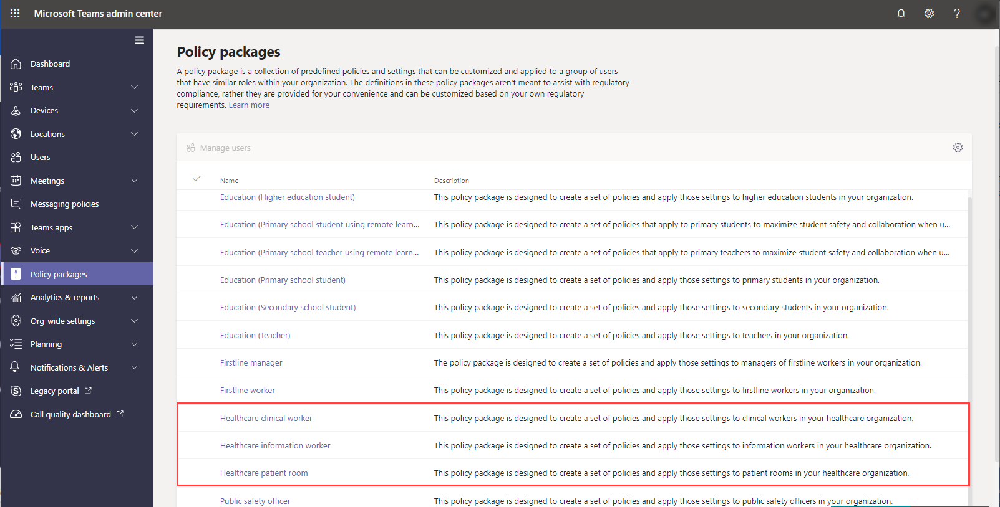
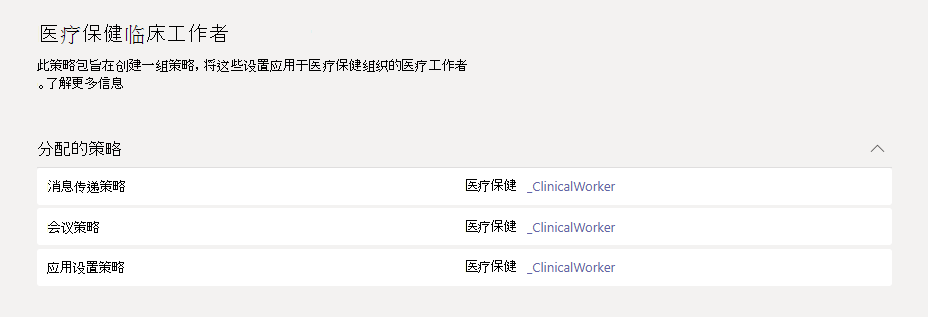

# 医疗保健的团队策略程序包

## 概述

Microsoft 团队中的 [策略包](manage-policy-packages.md) 是预定义策略和策略设置的集合，可分配给在组织中具有类似角色的用户。 策略包可简化并有助于提供一致的策略管理。 你可以自定义程序包中的策略设置以满足你的用户需求。 当您更改策略包中的策略设置时，分配到该程序包的所有用户都将获得更新的设置。 你可以使用 Microsoft 团队管理中心或 PowerShell 管理策略包。

> [!VIDEO https://www.microsoft.com/videoplayer/embed/RE4Ht2o]

策略程序包针对以下情况预定义策略，具体取决于程序包：

- 消息传递
- 会议
- 通话
- 应用设置
- 实时事件

团队当前包含以下医疗保健策略程序包。

|Microsoft 团队管理中心中的程序包名称|最适合用于|说明 |
|---------|---------|---------|
|医疗保健临床工作者  |医疗保健组织中的临床工作者  |创建一组策略和策略设置，为临床工作者（如注册的护士、费用护理、医生和社会工作者）提供对聊天、通话、班次管理和会议的完全访问权限。 |
|医疗保健信息工作者  |您的医疗保健组织中的信息工作者 |创建一组策略和策略设置，提供信息工作者，如 IT 人员、informatics 员工、财务人员和合规性监察官、对聊天、通话和会议的完全访问权限。|
|医疗保健患者聊天室  |患者聊天室设备|创建一组策略和策略设置，这些策略设置适用于您的医疗保健组织中的患者聊天室。|

每个单独策略都被授予策略程序包的名称，以便你可以轻松地识别链接到策略包的策略。 例如，当你将医疗保健临床工作人员策略包分配给你的组织中的临床医生时，将为程序包中的每个策略创建一个名为 Healthcare_ClinicalWorker 的策略。

## 策略程序包入门

若要开始使用医疗保健策略程序包，请在 Microsoft 管理中心的 "加入中心" 中选择 " **医疗保健** "，然后选择 " **按角色分配策略设置** "。 准备好开始使用后，请确定你想要为组织中的个人分配哪些策略包。

选择 " **查看策略详细信息** " 以了解有关程序包中的特定策略及其各自的设置的详细信息。 这些可在团队管理中心中分配后 [进行自定义](manage-policy-packages.md#customize-policies-in-a-policy-package) 。

选择一个或多个要分配的程序包，然后单击 " **下一步** "。 你可以搜索联系人并将其添加到最适合其角色的策略包。 一次无法将一个人分配给多个策略程序包。

将人员添加到正确的策略包后，请 **完成** 最终的选择。 你可以继续自定义和管理 Microsoft 团队管理中心中的策略包。

## 管理策略包

### 查看

在分配程序包之前查看策略包中每个策略的设置。 在 Microsoft 团队管理中心的左侧导航中，转到 " **策略程序包** "，选择程序包名称，然后选择 "策略名称"。

确定预定义的值是否适合你的组织，或者你是否需要根据组织的需求自定义它们以使其更具限制性或 lenient。

### 自定义

根据需要自定义策略包中的策略设置，以满足组织的需要。 对策略设置所做的任何更改都将自动应用到分配了该程序包的用户。 若要编辑策略包中的策略设置，请在 Microsoft 团队管理中心的左侧导航中，转到 " **策略程序包** "，选择策略程序包，选择要编辑的策略的名称，然后选择 " **编辑** "。

请记住，你还可以在分配策略包后更改程序包中的策略设置。 若要了解详细信息，请参阅 [自定义策略包中的策略](manage-policy-packages.md#customize-policies-in-a-policy-package)。

### 分配

将策略包分配给用户。 如果用户分配了策略，然后你分配了其他策略，则最新作业的优先级将会更高。

#### 将策略包分配给一个或多个用户

若要向一个或多个用户分配策略包，请在 Microsoft 团队管理中心的左侧导航中，转到 " **策略程序包** "，然后选择 " **管理用户** "。  

若要了解详细信息，请参阅 [分配策略包](manage-policy-packages.md#assign-a-policy-package)。

如果用户分配了策略，然后你分配了其他策略，则最新作业的优先级将会更高。

#### 为组分配策略包

**此功能在私人预览版中**

通过将策略包分配给组，你可以将多个策略分配给一组用户，如安全组或通讯组列表。 根据优先级规则，策略分配将传播到组的成员。 将成员添加到组或从组中删除成员后，将相应地更新其继承的策略分配。 对于多达50000用户的组，建议使用此方法，但也可使用较大的组。

若要了解详细信息，请参阅向 [组分配策略包](assign-policies.md#assign-a-policy-package-to-a-group)。

#### 将策略包分配给大型集 (批处理) 用户

使用批处理策略程序包分配来一次为大型用户分配一个策略包。 使用 [CsBatchPolicyPackageAssignmentOperation](https://docs.microsoft.com/powershell/module/teams/new-csbatchpolicypackageassignmentoperation) cmdlet 提交要分配的一批用户和策略包。 作业作为后台操作处理，并为每个批处理生成操作 ID。

批处理最多可包含5000个用户。 你可以按对象 Id、UPN、SIP 地址或电子邮件地址指定用户。 若要了解详细信息，请参阅向 [一批用户分配策略包](assign-policies.md#assign-a-policy-package-to-a-batch-of-users)。

## 相关主题

[在 Teams 中管理策略包](manage-policy-packages.md)

[向团队中的用户分配策略](assign-policies.md)
