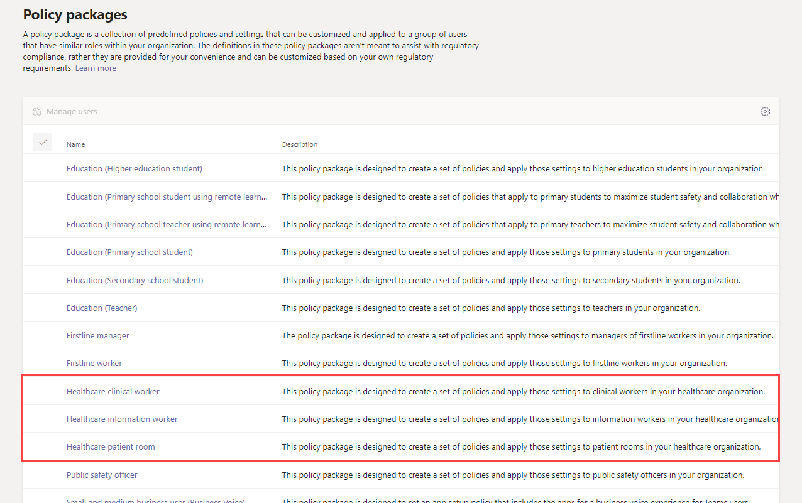
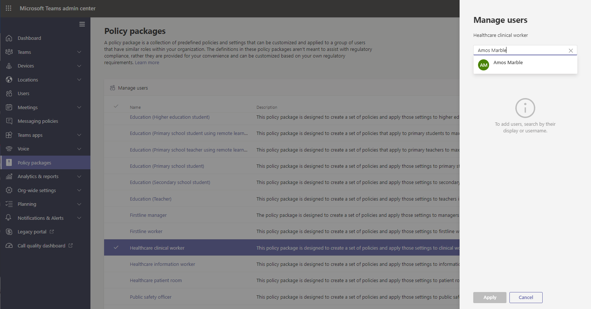

# Teams 医疗保健策略包Teams policy packages for healthcare

## 概述Overview

Microsoft Teams 中的[策略包](manage-policy-packages.md)是一组预定义的策略和策略设置，你可以将其分配给组织中具有类似角色的用户。A [policy package](manage-policy-packages.md) in Microsoft Teams is a collection of predefined policies and policy settings that you can assign to users who have similar roles in your organization. 策略包可简化并有助于提供一致的策略管理。Policy packages simplify, streamline, and help provide consistency when managing policies. 你可以自定义包中策略的设置以满足用户的需求。You can customize the settings of the policies in the package to suit the needs of your users. 当你更改策略包中策略的设置时，分配了该包的所有用户均会获得更新后的设置。When you change the settings of policies in a policy package, all users who are assigned to that package get the updated settings. 你可以使用 Microsoft Teams 管理中心或 PowerShell 管理策略包。You can manage policy packages by using the Microsoft Teams admin center or PowerShell.

> [!VIDEO https://www.microsoft.com/videoplayer/embed/RE4Ht2o]

策略包针对以下各项预定义了策略，具体内容因策略包而异：Policy packages pre-define policies for the following, depending on the package:

- 消息传递Messaging
- 会议Meetings
- 通话Calling
- 应用设置App setup
- 实时事件Live events

Teams 当前包括以下医疗保健策略包。Teams currently includes the following healthcare policy packages.

|Microsoft Teams 管理中心中的策略包名称Package name in the Microsoft Teams admin center|最适合用于Best used for|说明Description |
|---------|---------|---------|
|医疗保健临床工作者Healthcare clinical worker  |医疗保健组织的临床工作者Clinical workers in your healthcare organization  |创建一组策略和策略设置，以使临床工作者（例如注册护士、护士长、医师和社会工作者）可以完全访问聊天、通话、轮班管理和会议。Creates a set of policies and policy settings that give clinical workers such as registered nurses, charge nurses, physicians, and social workers full access to chat, calling, shift management, and meetings. |
|医疗保健信息工作者Healthcare information worker  |医疗保健组织的信息工作者Information workers in your healthcare organization |创建一组策略和策略设置，以使信息工作者（例如 IT 人员、信息学人员、财务人员和合规专员）可以完全访问聊天、通话和会议。Creates a set of policies and policy settings that give information workers such as IT personnel, informatics staff, finance personnel, and compliance officers, full access to chat, calling, and meetings.|
|医疗保健病房Healthcare patient room  |病房设备Patient room devices|创建一组适用于医疗保健组织中病房的策略和策略设置。Creates a set of policies and policy settings that apply to patient rooms in your healthcare organization.|

将为每个单独的策略提供策略包的名称，以便你可以轻松识别链接到该策略包的策略。Each individual policy is given the name of the policy package so you can easily identify the policies that are linked to a policy package. 例如，当你将医疗保健临床工作者策略包分配给组织中的临床医师时，系统将为该策略包中的每个策略创建一个名为 Healthcare_ClinicalWorker 的策略。For example, when you assign the Healthcare clinical worker policy package to clinicians in your organization, a policy named Healthcare_ClinicalWorker is created for each policy in the package.

## 开始使用策略包Get started with policy packages

若要开始使用医疗保健策略包，请在 Microsoft 管理中心载入中心上选择“**医疗保健**”，然后选择“**按角色分配策略设置**”。To get you started with Healthcare policy packages, on the Microsoft Admin Center onboarding hub, select **Healthcare**, and then select **Assign policy settings by role**. 准备好开始使用后，请确定要将组织中的个人分配给哪些策略包。Once you’re ready to get started, decide which policy packages you'd like to assign individuals in your organization to.

选择“**查看策略详细信息**”，以了解有关策略包中的特定策略及其各自设置的更多信息。Select **View policy details** to learn more about the specific policies in a package and their respective settings. 分配后可在 Teams 管理中心中[自定义](manage-policy-packages.md#customize-policies-in-a-policy-package)这些设置。These [can be customized](manage-policy-packages.md#customize-policies-in-a-policy-package) after assignment in the Teams Admin Center.

选择要分配的一个或多个包，然后单击“**下一步**”。Choose one or multiple packages to assign and then click **Next**. 可以搜索人员并将其添加到最适合其角色的策略包。You can search for and add people to the policy package best suited for their role. 不能一次将一个人分配给多个策略包。An individual can't be assigned to more than one policy package at one time.

将人员添加到正确的策略包后，请单击“**完成**”以最终确定你所做的选择。Once you’ve added people to the right policy package, **Finish** finalizes your selections. 可在 Microsoft Teams 管理中心中继续自定义和管理策略包。You can continue to customize and manage policy packages in the Microsoft Teams admin center.

## 管理策略包Manage policy packages

### 查看View

在分配包前查看策略包中每个策略的设置。View the settings of each policy in a policy package before you assign a package. 在 Microsoft Teams 管理中心的左侧导航栏中，转至“**策略包**”，选择策略包名称，然后选择策略名称。In the left navigation of the Microsoft Teams admin center, go to **Policy packages**, select the package name, and then select the policy name.

确定预定义值是否适合你的组织，或是否需要根据组织的需求对其进行自定义，使其更具限制性或更宽松。Decide whether the predefined values are appropriate for your organization or whether you need to customize them to be more restrictive or lenient based on your organization's needs.

### 自定义Customize

根据需要自定义策略包中的策略设置，满足组织的需求。Customize the settings of policies in the policy package, as needed, to fit the needs of your organization. 对策略设置所做的任何更改都将自动应用到已分配了该包的用户。Any changes you make to policy settings are automatically applied to users who are assigned the package. 若要编辑策略包中某个策略的设置，请在 Microsoft Teams 管理中心的左侧导航栏中，转至“**策略包**”，选择策略包，选择要编辑的策略的名称，然后选择“**编辑**”。To edit the settings of a policy in a policy package, in the left navigation of the Microsoft Teams admin center, go to **Policy packages**, select the policy package, select the name of the policy you want to edit, and then select **Edit**.

请记住，在分配策略包之后，你还可以更改包中的策略设置。Keep in mind that you can also change the settings of policies in a package after you assign the policy package. 若要了解详细信息，请参阅[自定义策略包](manage-policy-packages.md#customize-policies-in-a-policy-package)中的策略。To learn more, see [Customize policies in a policy package](manage-policy-packages.md#customize-policies-in-a-policy-package).

### 分配Assign

将策略包分配给用户。如果用户已分配策略，稍后又分配了另一个策略，则最近分配的优先级将会更高。Assign the policy package to users. If a user has a policy assigned, and then later you assign a different policy, the most recent assignment will take priority.

#### 向一个或多个用户分配策略包Assign a policy package to one or several users

若要将策略包分配给一个或多个用户，请在 Microsoft Teams 管理中心的左侧导航中，转到 **策略包**，然后选择 **管理用户**。To assign a policy package to one or multiple users, in the left navigation of the Microsoft Teams admin center, go to **Policy packages**, and then select **Manage users**.  

若要了解详细信息，请参阅[分配策略包](manage-policy-packages.md#assign-a-policy-package)。To learn more, see [Assign a policy package](manage-policy-packages.md#assign-a-policy-package).

如果用户已分配策略，稍后又分配了另一个策略，则最近分配的优先级将会更高。If a user has a policy assigned, and then later you assign a different policy, the most recent assignment will take priority.

#### 将策略包分配给组。Assign a policy package to a group

**此功能在私有预览版中****This feature is in private preview**

通过将策略包分配到组，可将多个策略分配给一组用户，例如安全组或通讯组列表。Policy package assignment to groups let you assign multiple policies to a group of users, such as a security group or distribution list. 根据优先级规则，将策略分配传播到组中的成员。The policy assignment is propagated to members of the group according to precedence rules. 将成员添加到组或从组中删除成员时，将相应更新其继承的策略分配。As members are added to or removed from a group, their inherited policy assignments are updated accordingly. 建议将此方法用于最多 50,000 个用户的组，但也可使用更大的组。This method is recommended for groups of up to 50,000 users but will also work with larger groups.

若要了解详细信息，请参阅[将策略包分配到组](assign-policies.md#assign-a-policy-package-to-a-group)。To learn more, see [Assign a policy package to a group](assign-policies.md#assign-a-policy-package-to-a-group).

#### 向大型组（批处理）分配策略包Assign a policy package to a large set (batch) of users

使用批处理策略包分配，每次向大型用户组分配策略包。Use batch policy package assignment to assign a policy package to large sets of users at a time. 使用 [New-CsBatchPolicyPackageAssignmentOperation](/powershell/module/teams/new-csbatchpolicypackageassignmentoperation) cmdlet 提交要分配的一批用户和策略包。You use the [New-CsBatchPolicyPackageAssignmentOperation](/powershell/module/teams/new-csbatchpolicypackageassignmentoperation) cmdlet to submit a batch of users and the policy package that you want to assign. 作业将作为后台操作处理，并为每个批处理生成操作 ID。The assignments are processed as a background operation and an operation ID is generated for each batch.

批处理最多可包含 5,000 个用户。A batch can contain up to 5,000 users. 可通过对象 Id、UPN、SIP 地址或电子邮件地址指定用户。You can specify users by their object Id, UPN, SIP address, or email address. 若要了解详细信息，请参阅[将策略包分配给批次用户](assign-policies.md#assign-a-policy-package-to-a-batch-of-users)。To learn more, see [Assign a policy package to a batch of users](assign-policies.md#assign-a-policy-package-to-a-batch-of-users).

## 相关主题Related topics

[在 Teams 中管理策略包Manage policy packages in Teams](manage-policy-packages.md)

[向 Teams 中的用户分配策略Assign policies to your users in Teams](assign-policies.md)