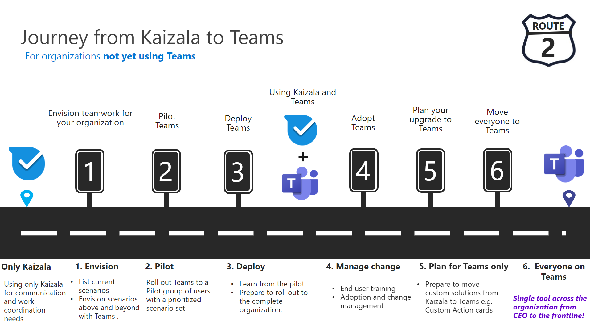

# 绘制从Kaizala到Teams的图表

你已决定从Kaizala移动到Microsoft Teams。

在入门之前，必须回答以下两个问题：

- 哪些用户组将迁移到Teams？  

- 目标路径Teams？

## 标识用户组

*组织中存在哪些组？Who将如何使用Teams？这些组对于有效团队合作需要哪些需求？* 若要开始迁移Teams，请首先 **确定要转换的用户组。**  用户组是员工中的一组员工，负责在类似的业务领域工作。 

我们已确定三个常见用户组，用于支持你确定协作需求。 每个用户组在通信方面都有其自己的独特需求。 

 1. **信息工作者** 是员工，在工作过程中创建、使用、转换、使用或管理信息。

 2. **一** 线员工主要是无办公桌工作者，其主要功能是直接与客户提供服务、支持和销售产品的一般公众合作，或者直接参与产品/服务的制造。

 3. **外部** 用户是组织外部的用户，例如供应商、供应商、业务合作伙伴、客户或客户。

与员工中其他信息工作者进行连接的用户需要：

- 聊天、会议、文件协作

- 跨设备工作

- 行业解决方案

- 高级 IT 控件
  
- 使用电子邮件进行内部和外部协作

与一线员工连接的用户需要：

- 与组织目录中的一线员工建立连接

- 脱机、远程位置

- 员工参与和扩展

- 数字化流程和工作流

- 排班计划和任务管理

与外部用户连接 (供应商/供应商) 可以使用：

- [来宾访问](/MicrosoftTeams/guest-joins) 协作

- [联合身份验证](/microsoftteams/manage-external-access)

## 确定路径

验证用户组的协作需求后，您将能够确定从 Kaizala 到 Teams 的路径。 每个组织都是唯一的，任何员工旅程都完全相同。 当前未使用Teams组织将需要做出其他战略决策，以确保成功过渡过程。 确定路径有助于确定为成功转换而应完成的任何重要操作。

我们概述了路径可能包含哪些内容，具体取决于贵组织的当前使用情况：  

对于 **未使用Teams**：

 1. 为组织构想团队合作

 2. 试点Teams
  
 3. 部署Teams
  
 4. 使用Kaizala和Teams
  
 5. 管理更改

 6. 计划采用Teams

 7. 将组织移动到Teams

对于已 **使用Teams**：

 1. 规划过渡

 2. 管理更改

## 后续步骤

[计划成功过渡到 Microsoft Teams](/MicrosoftTeams/plan-your-move-kaizala)
