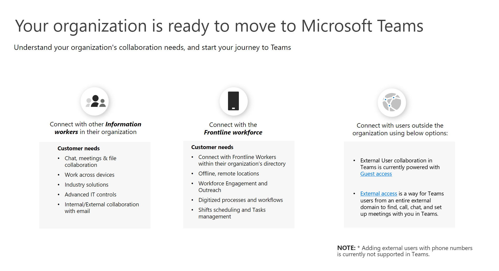

# 绘制 Kaizala 到 Teams 旅程的图表Charting your Kaizala to Teams journey

你已决定你的组织已准备好从 Kaizala 移动到 Microsoft Teams。You’ve decided that your organization is ready to move from Kaizala to Microsoft Teams. 在开始使用之前，在转换之前了解组织的协作需求非常重要。Before getting started, it's important to understand your organization’s collaboration needs before transitioning. 对于组织来说，成功的通信看起来是什么？What does successful communication look like for your organization? 组织需要做好哪些准备来迁移？What preparations will your organization need to make for the move? 若要回答这些问题，需要考虑组织的用户组及其独特协作需求。To answer these questions, you'll need to consider your organization's user groups and their unique collaboration needs. 员工的独特需求将决定你访问 Teams 的路径。Your workforce's unique needs will determine what path you will take to Teams.

## 标识用户组Identify User Groups

*组织中存在哪些组？谁将使用 Teams 以及如何使用 Teams？这些组对于有效团队合作需要哪些需求？**What groups exist in your organization? Who will be using Teams and how? What needs will these groups require for effective teamwork?* 若要开始 Teams 之旅，请首先 **确定要转换的用户组。**To begin your journey to Teams, first **identify users groups for your transition.**  用户组是员工中的一组员工，负责在类似的业务领域工作。User groups are a set of employees within your workforce that conduct work in similar areas of the business. 

我们已确定三个常见用户组，用于支持你确定协作需求。We’ve identified three common user groups to support you in identifying collaboration needs. 每个用户组在通信方面都有其自己的独特需求。Every user group has its own unique needs in terms of communication. 

 1. **信息工作者** 是员工，在工作过程中创建、使用、转换、使用或管理信息。**Information workers** are employees who create, use, transform, consume, or manage information in the course of their work.

 2. **一线** 员工的主要功能是直接与客户或提供服务、支持和销售产品的公众合作，或直接参与产品或服务的制造和分发的员工。**Frontline workers** are employees whose primary function is to work directly with customers or the general public providing services, support, and selling products, or employees directly involved in the manufacturing and distribution of products or services.
 
 3. **外部** 用户是组织外部的用户，例如供应商、供应商、业务合作伙伴、客户或客户。**External users** are people outside your organization such as your suppliers, vendors, business partners, clients, or customers. 
 
与员工中其他信息工作者进行连接的用户需要：Users connecting with other information workers in their workforce need:

 - 聊天、会议、文件协作Chat, meeting, file collaboration
 
 - 跨设备工作Work across devices
 
 - 行业解决方案Industry solutions
 
 - 高级 IT 控件Advanced IT controls
  
 - 使用电子邮件进行内部和外部协作Internal and external collaboration with email

与一线员工连接的用户需要：Users connecting with the Frontline workforce need:

 - 与组织目录中的一线员工建立连接Connection with Frontline Workers within their organization’s directory
 
 - 脱机、远程位置Offline, remote locations
 
 - 员工参与和扩展Workforce engagement and outreach
 
 - 数字化流程和工作流Digitized processes and workflows
 
 - 排班计划和任务管理Shifts scheduling and tasks management

与外部用户连接 (供应商/供应商) 可以使用：Users connecting with external users (suppliers/vendors) could use:
 - 来宾访问协作Guest access collaboration
 
 - 联合Federation 

## 确定路径Determine your path

验证用户组的协作需求后，你将能够确定从 Kaizala 到 Teams 的路径将如下所示。After verifying the collaboration needs of your user groups, you'll be able to determine what your path from Kaizala to Teams will look like. 每个组织都是唯一的，任何员工旅程都完全相同。Every organization is unique, and no workforce’s journey will be the exact same. 当前未使用 Teams 的组织将需要做出其他战略决策，以确保成功过渡过程。Organizations not currently using Teams will need to make additional strategic decisions to ensure a successful transition journey. 确定路径有助于确定为成功转换而应完成的任何重要操作。Determining your path will help you identify any important actions that should be completed for a successful transition.

我们概述了路径可能包含哪些内容，具体取决于贵组织的当前使用情况：We’ve outlined what the path may consist of depending on your organization’s usage today:  

对于未 **使用 Teams 的组织**：For organizations **not using Teams**:

 1. 为组织构想团队合作Envision teamwork for your organization
 
 2. 试点团队Pilot Teams
  
 3. 部署 TeamsDeploy Teams
  
 4. 使用 Kaizala 和 TeamsUse Kaizala and Teams
  
 5. 管理更改Manage change
 
 6. 规划 Teams 的采用Plan for your adoption of Teams
 
 7. 将组织移动到 TeamsMove your organization to Teams

对于已 **使用 Teams 的组织**：For organizations **already using Teams**:

 1. 规划过渡Plan for your transition
 
 2. 管理更改Manage change
 

 
