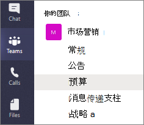
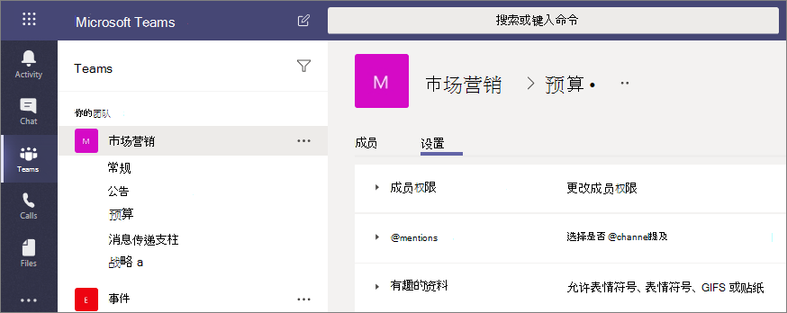

# Microsoft Teams 中的私人频道

Microsoft Teams 中的私人频道创建专用空间供团队展开协作。 仅属于私人频道的所有者或成员的团队用户可以访问此频道。 只要已是团队的成员（包括来宾），均可将其添加为专用渠道的成员。

如果想要将协作限制为有知情需求的人员之间，或者想要促进分配到特定项目的一组人员之间的通信，你可能会需要使用私人频道，而不必创建额外的团队并进行管理。

例如，在以下情景中，私人频道非常有用：

- 团队中的一组人员希望有一个专用空间来展开协作，而不必创建单独的团队。
- 团队中的一部分人员希望使用私人频道来讨论敏感信息，如预算、资源、战略定位等。

锁定图标表示私人频道。只有私人频道的成员才能查看和参与他们添加到的私人频道。

创建私人频道后，它将链接到父团队，并且无法移动到其他团队。 此外，不能将私人频道转换为标准频道，反之亦然。

## 私有频道创建

默认情况下，任何团队所有者或团队成员都可以创建私人频道。 来宾无法创建私人频道。 可在团队级别和组织级别管理创建专用频道的能力。 使用 [策略](teams-policies.md) 控制允许哪些组织用户创建专用频道。 设置策略后，团队所有者可以关闭或打开成员在" **设置**"选项卡创建专用频道的能力。

创建私人频道的人员是私人频道所有者，只有私人频道所有者才能直接从中添加或删除人员。 私人频道所有者可将任何团队成员添加到自己创建的私人频道，包括来宾。 私人频道的成员具有安全的对话空间，添加新成员后，他们可以查看该私人频道中的所有对话（甚至是旧对话）。

团队所有者可以查看其团队中所有私人频道的名称，也可以删除该团队中的任何私人频道。 （已删除的私人频道可在删除后的 30 天内还原）。 团队所有者无法查看私人频道中的文件或私人频道的对话和成员列表，除非他们是该私人频道的成员。

团队成员只能看到已添加到的专用频道。

## 添加和删除所有者和成员

如果私人频道所有者是一个或多个私人频道的最后一个所有者，则无法通过 Teams 客户端将其删除。

如果专用频道所有者离开组织，或者从与团队关联的 Microsoft 365 组中删除他们，将自动提升为专用频道所有者。

如果团队成员离开团队或从团队中删除成员，则该用户也将从团队中的所有私人频道中离开或删除。 如果将用户添加回团队，则必须将其添加回团队中的私人频道。

## 频道所有者设置

每个专用频道都有自己的可管理设置，包括添加和删除成员、添加选项卡以及@mentioning功能。 这些设置独立于父团队设置。 创建私人频道时，它将继承父团队的设置，之后可以独立于父团队设置更改其设置。

私人频道所有者可以单击“**管理频道**”，然后使用“**成员**”和“**设置**”选项卡来添加或删除成员以及编辑设置。

## 专用频道所有者和成员操作

下表概述了所有者、成员和来宾可以在私人频道中执行的操作。

|操作  |团队所有者|团队成员|团队来宾|私人频道所有者|私人频道成员|私人频道来宾|
|---------|---------|---------|---------|---------|---------|---------|
|创建私人频道|管理员控制|管理员和团队所有者控制|否|不适用|不适用|不适用|
|删除私人频道|是|否|否|是|否|否|
|离开私人频道|不适用|不适用|不适用|是，除非他们最后一次拥有|是|是|
|编辑私人频道|否|不适用|不适用|是|否|否|
|还原已删除的私人频道|是|否|否|是|否|否|
|添加成员|否|不适用|不适用|是|否|否|
|编辑设置|否|不适用|不适用|是|否|否|
|管理选项卡和应用|否|不适用|不适用|是，必须为团队安装应用|频道所有者控制|不支持|

## 管理专用频道的生命周期

有关如何管理组织中专用频道的生命周期的指导，请参阅[在Teams中管理专用频道的生命周期](private-channels-life-cycle-management.md)。 这包括如何控制组织中的用户是否可以创建私人频道、如何代表团队所有者创建私人频道、如何出于存档和审核目的获取所有私人频道消息的列表，以及其他管理任务。  

## 私人频道 SharePoint 网站

每个专用频道都有其自己的 SharePoint 网站。 单独的网站用于确保仅访问专用频道文件的成员。 默认情况下，这些网站集是使用文档库创建的，并且可通过[网站管理界面](https://support.office.com/article/A2F2A5C2-093D-4897-8B7F-37F86D83DF04)轻松增强为功能齐全的网站集。 每个网站创建在与父团队网站相同的地理区域创建。 这些轻型网站具有自定义模板 ID“TEAMCHANNEL#0”，可通过 PowerShell 和 Graph API 实现更轻松的管理。 

>[!NOTE]
>- 只有拥有在 Microsoft Teams 中授予的所有者或成员权限的用户才能访问专用频道网站中的内容。
>- 新 SharePoint 管理中心的活动网站页面中不包括专用频道 SharePoint 网站。
>- 在 2021 年 6 月 28 日之后创建的专用频道 SharePoint 网站将具有自定义模板 ID TEAMCHANNEL#1。

专用频道网站同步数据分类，并继承父团队网站的来宾访问权限。 网站集所有者和成员组的成员资格将与 Teams 中私人频道的成员资格保持同步。 在 SharePoint Online 中对所有者或成员组的成员资格所做的任何更改都将在四个小时内自动还原为私人频道成员资格。 

团队管理专用频道网站的生命周期。 如果在 Teams 外部删除了网站集，则只要私人频道仍处于活动状态，后台作业将在四个小时内还原该网站。 如果永久删除该网站，为专用频道预配了新网站。

如果还原了含有专用频道的专用频道或团队，网站将随其一起还原。 如果已还原私人频道网站集，并且超出了私人频道的 30 天软删除时间段，则该网站集将作为独立网站集运行。

> [!NOTE]
> 在 Microsoft Teams 中创建新团队或专用频道时，将自动创建 SharePoint 中的团队网站。 若要编辑此团队网站的网站说明或分类，请转到相应频道的[在 Microsoft Teams 中设置](https://support.microsoft.com/office/change-a-team-s-data-security-classification-in-teams-bf39798f-90d2-44fb-a750-55fa05a56f1d)。
>
> 了解有关管理 [Microsoft Teams 连接的团队网站](/SharePoint/teams-connected-sites)的详细信息。

## 私人频道消息合规记录

在私人频道中发送的消息记录将传递到所有私人频道成员的邮箱，而不是传递到组邮箱。 记录的标题已格式化为指示它们是从哪个私人频道发送的。

有关对私人频道消息执行电子数据展示搜索的详细信息，请参阅[私人频道的电子数据展示](ediscovery-investigation.md#ediscovery-of-private-channels)。

## 有关专用频道中的文件访问的注意事项

在私人频道中创建新的 OneNote 笔记本时，其他用户仍可以访问该笔记本，因为其行为与在私人频道 SharePoint 网站中与用户共享任何其他项目的访问权限相同。

如果通过 SharePoint 向用户授予对私人频道中的笔记本的访问权限，则从团队或私人频道中删除用户将不会删除用户对该笔记本的访问权限。

如果现有笔记本作为选项卡添加到专用频道，则不更改对专用频道的访问权限，且笔记本将保留其现有权限。

## 专用频道限制

目前，私人频道支持连接器和选项卡（Stream、Planner 和 Forms 除外）。 我们正致力于为私人频道（包括消息传递扩展和机器人）提供完整的应用支持。

每个团队最多可拥有 30 个私人频道，每个私人频道最多可拥有 250 个成员。 30 个私人频道限制是对每个团队 200 个标准频道限制的补充。 

从现有团队创建团队时，不会复制现有团队中任何专用频道。

目前错过的活动电子邮件中不包含来自专用频道的通知。

## 相关主题

[Teams 中的团队和频道概述](teams-channels-overview.md)

[Teams PowerShell 概览](teams-powershell-overview.md)

[将 Microsoft Graph API 与 Teams 结合使用](/graph/api/resources/teams-api-overview)
