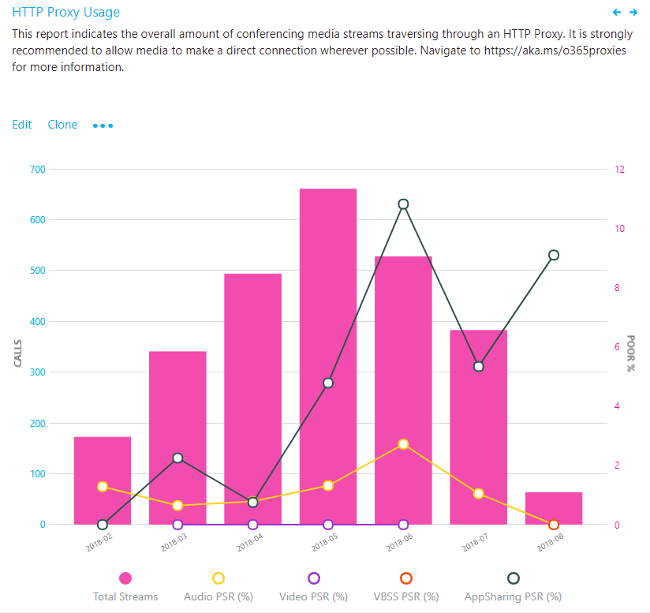

#  <a name="use-cqd-to-manage-call-and-meeting-quality-in-microsoft-teams"></a>使用 CQD 管理呼叫和会议质量Microsoft Teams 

本文将帮助您（Teams 管理员或支持工程师和支持工程师）使用 Microsoft Teams 呼叫质量仪表板 (CQD) 为组织制定监视和维护呼叫和会议质量的流程。 我们的指南强调音频质量方案，因为你为改进音频体验而进行的任何网络改进都将转换为视频和共享方面的改进。

本指南的关键是两 [个特策划的 CQD](https://aka.ms/QERtemplates) 模板 - 建议在浏览本文中的指南之前下载它们。

本文假定你已设置[CQD。](turning-on-and-using-call-quality-dashboard.md)


## <a name="categories-to-monitor-and-maintain"></a>要监视和维护的类别

在会议中推出会议和语音Teams，需要制定持续监视和维护计划。 这样做可确保Teams始终以最佳方式运行。 此计划应包括下面列出的主要区域。 还应针对质量指标建立目标，并制定计划，在问题出现时进行故障排除和隔离。

<table>
<thead>
<tr class="header">
<th>类别</th>
<th>描述</th>
</tr>
</thead>
<tbody>
<tr class="odd">
<td><strong>呼叫质量</strong></td>
<td>
<p>通过组织内部呼叫 (（例如 VPN、WiFi、有线) 或外部呼叫）来分解指标</p>
<p>通过生成或网络分解指标</p>
<p>VPN 调用</p>
<p>使用 TCP、UDP 或代理的调用</p>
</td>
</tr>
<tr class="even">
<td><strong>调用可靠性</strong></td>
<td><p>识别并修正任何网络或防火墙问题</p>
<p>深入了解通话设置的百分比并删除失败</p>
<p>了解大部分呼叫设置和删除失败发生位置</p>
</td>
</tr>
<tr class="odd">
<td><strong>用户调查</strong></td>
<td>
<p>使用"评价我的通话"数据了解用户的实际体验</p>
<p>不良体验在哪里发生？</p>
<p>将较差的体验与呼叫质量、可靠性和设备相关联</p>
</td>
</tr>
<tr class="even">
<td><strong>Devices</strong></td>
<td><p>了解最常用的麦克风和扬声器及其对呼叫质量的影响</p>
<p>是否定期修补支持的音频、视频、USB 和 WiFi 驱动程序？</p>
</td>
</tr>
<tr class="odd">
<td><strong>客户端</strong></td>
<td>
<p>了解所使用的客户端类型和版本及其对呼叫质量和可靠性的影响  </p>
</ol></td>
</tr>
</tbody>
</table>

通过持续评估和修正本文中所述的领域，可以减少它们可能对用户造成负面影响的可能性。 大多数用户问题可以分为以下类别：

-   防火墙或代理配置不完整
-   Wi-Fi 覆盖范围较小
-   带宽不足
-   VPN
-   不一致或过时的客户端版本和驱动程序
-   未优化或内置音频设备
-   子网或网络设备存在问题

在部署 Teams 或 Skype for Business Online 之前，通过适当的规划和设计，可以减少保持高质量体验所需的工作量。

本文重点介绍使用呼叫质量仪表板 (CQD) Online 作为主要工具来报告并调查每个区域，并特别强调音频，以最大限度地提高采用和影响。 对网络进行的任何改进来改善音频体验也将直接转换为视频和桌面共享方面的改进。

为了加快评估速度，我们提供了两个特策划的 [CQD](https://aka.ms/qertemplates) 模板：一个模板用于管理所有网络，另一个模板仅针对托管 (内部) 筛选。 尽管"所有网络"模板报表配置为显示建筑物和网络信息，但仍可在收集和上传建筑物信息时使用。 将建筑物信息上传到 CQD 可让服务通过添加自定义建筑物、网络和位置信息来增强报告，同时区分内部子网和外部子网。 有关详细信息，请阅读建筑物 [映射](CQD-building-mapping.md)。

### <a name="intended-audience"></a>目标受众

本文适用于具有协作主管/架构师、顾问、变更管理/采用专家、支持/技术支持主管、网络主管、桌面主管和 IT 管理员等角色的合作伙伴和客户利益干系人。

本文还旨在由指定的质量冠军 () 。 有关详细信息，请参阅 [质量冠军角色](4-envision-plan-my-service-management.md#the-quality-champion-role)。


## <a name="what-is-quality"></a>什么是质量？

在此上下文中，质量是服务指标和用户体验的组合。


### <a name="service-metrics"></a>服务指标

服务指标由特定的基于客户端的指标组成。 在每个调用期间，客户端收集调用的遥测数据，并在每个调用结束时提交报告，该报告稍后可在 CQD 或每个用户调用分析 [中访问](set-up-call-analytics.md)。 这些指标包括 (，但不限于) ：

-   传入 (传出流的流) 
-   设置失败率
-   丢弃失败率


#### <a name="poor-stream-rate"></a>流速率不佳

PSR (较差) 表示组织质量不佳的流的总体百分比。 此指标旨在突出显示组织可以集中努力对降低此值和改进用户体验产生最大影响的领域，这就是为什么在查看 PSR 时，托管网络是主要关注[](#managed-versus-unmanaged-networks)点的原因。 外部用户也很重要，但调查在组织上有所不同。 考虑为外部用户提供最佳做法，并独立于整个组织调查外部呼叫。

CQD 中的实际度量因工作负荷而异，但出于本文的目的，我们主要关注 _Audio Poor Percentage 度量_ 。 PSR 由下表中所述的五个网络指标平均值决定。 若要将流分类为差，只需一个指标超过定义的阈值。 CQD 提供"Poor Due To..."以更好地了解导致流分类为差的条件。 有关详细信息，请阅读 [CQD 中的流分类](stream-classification-in-call-quality-dashboard.md)。

> [!Note]
> CQD 提供"Poor due to..."以更好地了解导致流分类为差的条件。


##### <a name="audio-poor-quality-metrics"></a>音频质量不佳指标

| 指标平均值     | 说明     | 用户体验 |
|-------------|-----------------|-----------------|
| 抖动 \> 30 毫秒        | 这是连续数据包之间的延迟的平均变化。 Teams和Skype for Business可以通过缓冲来适应某些级别的抖动。 只有当抖动超过缓冲时，参与者才能注意到抖动的影响。      | 以不同速度到达的数据包会导致说话人的声音听起来像机器人一样。   |
| 数据包丢失率 \> 10% 或 0.1        | 这通常定义为丢失的数据包的百分比。 数据包丢失会直接影响音频质量 -来自小型、单个丢失的数据包，这些数据包几乎不会影响到导致音频完全中断的背对回突发丢失。     | 丢弃的数据包未到达其预期目标会导致媒体中出现间隙，导致错过音节和字词，以及视频和共享中断。 |
| 往返时间 \> 500 毫秒        | 这是从点 A 获取 IP 数据包到点 B 和返回点 A 所花的时间。此网络传播延迟与两个点之间的物理距离和光速有关，包括网络路径中各种设备所取的额外开销。      | 数据包到达目的地所花时间过长会导致对讲者产生对讲效果。   |
| NMOS 平均降级 \> 1.0         | NMOS [的平均网络平均 (分数) ](/previous-versions/office/communications-server/bb894481(v=office.12)#network-mos) 流降级。 表示网络丢失和抖动对接收的音频质量的影响，导致 NMOS 下降一个点以上。 | 这是抖动、数据包丢失和（在较小程度）增加的往返时间的组合。 用户可能遇到这些症状的组合。   |
| 隐藏样本的平均比率 \> 7% 或 0.07 | 数据包丢失修复生成的隐藏样本的音频帧数与音频帧总数的平均比率。 隐藏音频示例是一种用于平滑处理通常由丢弃的网络数据包导致的突然转换的技术。      | 高值表示已应用大量丢失隐藏，导致音频失真或丢失。     |

##### <a name="why-do-we-prefer-to-use-streams-instead-of-calls"></a>我们为什么更希望使用流而不是通话？

流让我们知道通话的特定段是差的 - 传出或传入。 查看较差呼叫的呼叫分析时，请确定较差的呼叫是由该调用方的流 (出站) 还是被调用方的流 (入站) 。 确定哪个流正在影响呼叫质量对于会议更加重要。 如果您仅查看呼叫数据，您将看到一个人参与的会议数，但您看不到哪些人员是活动发言人，从而执行最多的屏幕共享。

呼叫数据提供使用情况指标，但不一定会导致通话质量不佳的根本原因。 通过查看流方向，可以识别多种因素，例如不在托管网络上呼叫、来自非员工 (例如供应商或其他网络提供商的某人的呼叫) 。 在这些情况下，如果其他人的网络连接不佳，则整个呼叫将被标记为差。 不能对外部因素执行任何操作，因此此数据没有帮助。

流方向还有助于识别有问题的设备或客户端。

 - 例如，如果你对设备的预算有限，并且只想为大量音频用户提供设备，请使用音频使用情况报告 (VoIP) 并筛选出站流和会议。 查找在内置麦克风中讲话的高音量音频用户 - 这可能与通话质量较差 (并且你可能希望为这些用户提供音频设备) 。 为清楚起见，可以筛选数据包利用率，以便面向特别大量的音频用户。 

  - 另一个示例涉及屏幕共享。 如果客户使用旧的客户端Teams，屏幕共享性能可能会受到影响。 可以通过为执行大量屏幕共享的人确定客户端升级的优先级来解决此问题。

 - 通过确定流的哪个方向导致通话质量差，可以确定你是否有 QoS 或带宽相关的问题。 如果尚未完全实现 QoS，或者仅在客户端而不是入站流中标记数据包，则可能会看到较差的呼叫质量。 通过查看流方向，可以更精细地查看特定方向的数据包丢失、延迟或抖动。 

   - 例如，假设用户在有线连接时抱怨机器人音频 (抖动) 。 通过查看流和方向，可以确定问题发生在入站流上，仅针对一组特定的子网。 将此信息提供给网络团队后，他们可以跟踪到未绕过媒体流量的未配置 WAN 加速器。 网络团队重新配置 WAN 加速器后，抖动消失，呼叫质量提高。 


#### <a name="setup-failure-rate"></a>设置失败率

设置失败率（也称为 CQD中的总呼叫设置失败百分比度量）是在调用开始时在终结点之间无法建立媒体路径的流的数量。

这表示无法建立的任何媒体流。 考虑到此问题对用户体验的影响的严重性，目标是尽可能将此值减小到接近零。 在防火墙规则不完整的新部署中，此指标的高价值比成熟的部署更常见，但必须定期观察。

此指标的计算公式是：将未能设置的流总数除以在 CDR 中提交成功的呼叫详细信息记录的 (总数) ：

-   **设置失败率** = 总调用设置失败流计数/CDR 可用流计数总计

#### <a name="drop-failure-rate"></a>丢弃失败率

丢弃失败率（也称为 CQD中的总呼叫丢弃失败百分比度量）是媒体路径未正常终止的成功建立的流的百分比。

这表示意外终止的任何媒体流。 尽管这种影响与未能设置的流的影响并不严重，但仍会对用户体验产生负面影响。 突然和频繁的媒体删除不仅会对用户体验造成严重影响，还会导致用户需要重新连接，从而失去工作效率 (更别提) 。

通过采用丢弃的流总数除以已成功设置的流的总数计算指标：

-   **丢弃失败率** = 总呼叫丢弃流计数/总呼叫设置成功流计数

### <a name="define-your-target-metrics"></a>定义目标指标

本部分讨论我们用于评估服务运行状况的一些核心服务指标。 通过持续评估和推动努力，使这些指标低于其定义的目标，你将帮助确保用户体验一致、可靠的呼叫质量。 首先，请使用下表中建议的目标。 根据需要调整目标以满足业务目标。

<table>
<tr>
<th rowspan="2" colspan="2" valign="center">网络类型</th><th rowspan="1">质量目标</th><th colspan="2">可靠性目标</th></tr>
<tr><th>Audio Poor Stream Rate</th><th>设置失败率</th><th>丢弃失败率</th></tr>
<tr><td rowspan="2"><strong>All</strong></td><td>内部</td><td>2.0%</td><td>0.5%</td><td>2.0%</td></tr>
<tr><td>整体</td><td>3.0%</td><td>1.0%</td><td>3.0%</td></tr>
<tr><td rowspan="5"><strong>会议</strong></td><td>内部</td><td>2.0%</td><td>0.5%</td><td>2.0%</td></tr>
<tr><td>有线内部</td><td>1.0%</td><td>0.5%</td><td>1.0%</td></tr>
<tr><td>Wi-Fi 5 GHz 内部</td><td>1.0%</td><td>0.5%</td><td>1.0%</td></tr>
<tr><td>Wi-Fi 2.4 GHz 内部</td><td>2.0%</td><td>0.5%</td><td>2.0%</td></tr>
<tr><td>整体</td><td>2.0%</td><td>0.5%</td><td>3.0%</td></tr>
<tr><td rowspan="4"><strong>P2P</strong></td><td>内部</td><td>2.0%</td><td>0.5%</td><td>2.0%</td></tr>
<tr><td>有线/Wi-Fi 5 GHz 内部</td><td>1.0%</td><td>0.5%</td><td>1.0%</td></tr>
<tr><td>有线/Wi-Fi 总体 5 GHz</td><td>2.0%</td><td>1.0%</td><td>1.0%</td></tr>
<tr><td>整体</td><td>2.0%</td><td>1.0%</td><td>3.0%</td></tr>
</table>

### <a name="user-experience"></a>用户体验

分析用户体验比分析科学更艺术，因为此处收集的指标不一定总意味着网络或服务存在问题，而只是表示用户感知了问题。 CQD 包括内置调查机制（对 RMC (呼叫) 进行评分）以帮助评估整体用户体验。 RMC 将让用户从用户的角度深入了解以下问题：

-   我是否知道如何使用该解决方案？
-   该解决方案是否易于使用且直观，是否支持我的日常通信需求？
-   该解决方案是否可帮助我完成工作？
-   我对于解决方案的整体认知是什么？
-   我能否随时使用该解决方案，无论我在哪里？
-   能否设置和维护呼叫？

#### <a name="rate-my-call"></a>评价我的通话 

将我的呼叫 (RMC) 内置在 Teams Skype for Business。 它每 10 次调用中一次自动弹出，即 10%。 此简短调查要求用户对呼叫进行评分，并提供一些上下文来说明通话质量可能较差的原因。 一个或两个分级被视为差，3 到 4 为好，5 为优秀。 尽管它有点滞后，但这是一个有用的指标，用于发现服务指标可能错过的问题。

> [!Note]
> 人为因素：当通话质量良好时，用户通常会忽略调查，在通话质量不佳时填写调查。 因此，即使服务指标良好，RMC 报告也可能偏斜到较差的一端。

可以使用 CQD 报告 RMC 用户响应，示例报告包含在 CQD 模板中。 但是，本文中不会详细讨论它们。 

#### <a name="client-and-device-readiness"></a>客户端和设备就绪性

你需要一个可靠的客户端和设备策略来帮助确保你的用户具有一致和积极的用户体验。 几个关键原则驱动每个准备策略。

##### <a name="client-readiness"></a>客户端就绪性

使Teams客户端保持最新状态可确保用户始终获得最佳体验。 Microsoft 会在后台[](teams-client-update.md)Teams更新 (更新会在后台自行安装，除非你已关闭此功能，否则我们不建议) 。 此外，必须记住修补网络、视频、USB 和音频驱动程序，因为它们经常被忽略，并且可能会影响呼叫和会议质量。 请考虑将网络、Wi-Fi、视频、USB 和音频驱动程序添加到当前的修补程序管理过程。


##### <a name="device-readiness"></a>设备就绪性

任何一种策略都不会影响用户体验，而只影响设备就绪性策略。 例如，依赖笔记本电脑扬声器和麦克风的用户将在通话和会议中遇到大量背景噪音。 Teams几乎适用于任何设备，但如果遇到设备相关的问题，请查看 电话[Teams。](./devices/phones-for-teams.md)


### <a name="categories-of-quality"></a>质量类别

实施一组质量管理做法 - 这为你提供了最佳通话和会议质量的机会。 良好的质量管理计划可解决以下类别：

-   **网络：** 音频质量侧重于 PSR (低) 、TCP 使用情况、有线和无线子网，以及识别 HTTP 代理和 VPN 的使用

-   **终结点：** 音频设备和最新客户端

-   **服务管理：** 此类别包括两个部分：

    -   首先，Microsoft 负责管理和维护联机服务Teams Skype for Business服务。

    -   第二是组织为确保对服务的可靠访问而管理的任务，例如更新建筑物信息，以及维护新的 Office 365 IP 地址的防火墙，因为基础结构已添加到服务。


查看以下建议的任务列表，以保持质量。 应定期执行这些任务，例如每周。

#### <a name="service-management-tasks"></a>服务管理任务

这些任务包括确保有足够的带宽在不使 Internet 链接饱和的情况下访问服务、验证服务质量 (QoS) 在所有托管网络区域上是否到位，以及保持位于防火墙上的[Office 365 IP](/microsoft-365/enterprise/urls-and-ip-address-ranges)范围。

#### <a name="network-tasks"></a>网络任务

网络任务有两类：可靠性和质量。 可靠性侧重于衡量用户成功进行呼叫并保持联系的能力。 质量侧重于在呼叫期间Teams Skype for Business客户端发送到 Skype for Business Online 的聚合遥测数据。 

考虑到可靠性对用户体验的严重影响，建议在深入了解质量之前评估和调查可靠性指标。 

#### <a name="endpoints-tasks"></a>终结点任务

此类别中的主要任务消除了常规客户端更新[Teams障碍](teams-client-update.md)。 默认情况下，Teams会定期更新 (，除非你关闭此设置，我们不建议) 。 

还应监视设备，并每当识别与设备相关的问题时提供更新。

## <a name="use-cqd-to-manage-call-quality"></a>使用 CQD 管理呼叫质量

设置 [CQD](turning-on-and-using-call-quality-dashboard.md)后，即可开始使用它来管理组织的呼叫和会议质量。

大多数性能问题Teams分为以下类别：

-   防火墙或代理配置不完整
-   Wi-Fi 覆盖范围较小
-   带宽不足
-   VPN
-   不一致或过时的客户端版本和驱动程序
-   未优化或内置音频设备
-   子网或网络设备存在问题

如果在推出新应用之前Teams评估这些方面并修正任何缺陷，则你将减少为所有用户保持Teams体验所需的工作量。 有关评估网络以准备推出Teams的帮助，请阅读适用于 Teams 的顾问和[](use-advisor-teams-roll-out.md)准备网络[以Teams。](prepare-network.md)

### <a name="expectations-using-cqd"></a>使用 CQD 的预期

使用 CQD (呼叫) 仪表板来深入了解使用 Teams 和 Skype for Business 服务进行呼叫的质量。 CQD 旨在帮助Teams Skype for Business管理员和网络工程师优化网络并密切关注质量、可靠性和用户体验。 CQD 查看整个组织的聚合遥测数据，其中的总体模式可能变得明显;这样，你能够做出明智的评估和规划补救。 CQD 提供指标报告，用于深入了解总体质量、可靠性和用户体验。

CQD 虽然可用于分析趋势和子网，但并不总是为给定方案提供特定的原因。 在使用 CQD 时了解这一点并设置正确的期望非常重要：

-   CQD 不会提供每种方案的根本原因
-   CQD 不包含电话系统音频会议流
-   CQD 将指出根据趋势进行进一步调查的区域

### <a name="cqd-reports-overview"></a>CQD 报表概述

使用屏幕顶部的下拉菜单打开报表。 有关每个报告中提供的数据的列表，请阅读 [CQD 报告中提供的数据](CQD-data-and-reports.md#data-available-in-cqd-reports)。

2020 年 1 月新增功能[：Power BI CQD 的查询模板](https://github.com/MicrosoftDocs/OfficeDocs-SkypeForBusiness/blob/live/Teams/downloads/CQD-Power-BI-query-templates.zip?raw=true)。 可Power BI模板，可用于分析和报告 CQD 数据。


### <a name="teams-vs-skype-for-business"></a>Teams与Skype for Business

CQD 可以报告Teams Skype for Business。 但是，有时可能需要开发一个报表来查看独立于Teams的遥测Skype for Business。

#### <a name="summary-reports"></a>摘要报告

若要修改摘要报表页面以仅查看Teams或Skype for Business，请从屏幕顶部选择"产品筛选器"下拉菜单，然后选择想要的产品。


#### <a name="detailed-reports"></a>详细报告

若要筛选所有详细报告，在浏览器栏中，将以下内容追加到 URL 的末尾：

```PowerShell
/filter/[AllStreams].[Is Teams]|[FALSE]
```

**示例：**

```https://cqd.teams.microsoft.com/cqd/#/1234567/2018-5/filter/[AllStreams].[Is Teams]|[FALSE]```

有关 URL 筛选器详细信息，请阅读 [本部分](CQD-data-and-reports.md#report-filters) 稍后的筛选报告。

若要筛选单个详细报表，请向报表添加筛选器 ``Is Teams`` ，将其设置为 True 或 False。


### <a name="managed-versus-unmanaged-networks"></a>托管网络与非托管网络

默认情况下，CQD 中所有终结点都归类为外部终结点。 引入生成文件后，我们可以开始查看托管终结点数据。 如前所述，CQD 中的网络定义为：

-   _托管网络_（通常称为内部或内部网络）受组织的影响和控制。 这包括内部 LAN、远程 WAN 和 VPN。
-   _组织不能_ 影响或控制非托管网络（通常称为外部或外部网络）。 非托管网络的示例是酒店或机场网络。

### <a name="dimensions-measures-and-filters"></a>维度、度量值和筛选器

格式良好的 CQD 查询包含以下所有三个参数：

-   **维度：** 我想要如何透视数据。

-   **度量值：** 我要报告什么。

-   **筛选器：** 如何减少查询返回的数据集。

查看此内容的另一种方式是维度是分组函数，度量值是感兴趣的数据，筛选器是我希望将结果缩小到与查询相关的结果的方式。 

格式良好的查询示例是按第 6 建筑物 [筛选器] 的子网 [维度] 显示差流 **[Measure]**。 有关详细信息，请参阅 [CQD 中可用的维度和度量值](./dimensions-and-measures-available-in-call-quality-dashboard.md)。

### <a name="first-vs-second"></a>第一个与第二个 

CQD 中的许多维度和度量值被分类为第一个或第二个。 CQD 不使用调用方/被调用方字段，这些字段已重命名为第一个和第二个，因为调用方和被调用方之间存在中间步骤。 以下逻辑确定将涉及的终结点标记为第一个：

-   **如果** 流或呼叫中涉及 (，则首先始终是会议服务器、中介服务器等) 服务器终结点。

-   **第** 二个始终是客户端终结点，除非流在两个服务器终结点之间。

-   如果两个终结点的类型相同，则首先根据用户代理类别的内部顺序进行选择。 这样可以确保排序的一致性。

有关确定第一个或第二个终结点何时二者相同，请参阅 [CQD 中可用的维度和度量值](./dimensions-and-measures-available-in-call-quality-dashboard.md)。

### <a name="stream-vs-call"></a>流与通话

你需要了解调用和流的区别，以正确选择要在 CQD 中查看的维度或度量值。 尽管 CQD 的主要焦点位于流上，但基于调用的度量也可用。

-   **流：** 只有 _两_ 个终结点之间存在一个流。 每个方向只有一个流，通信需要两个流。 流可用于调查建筑物、网络或子网。 在某些情况下，调用和流都用于度量的名称中，例如 (设置流或呼叫丢弃的流) 。 这些仍分类为流。

-   **调用：** 呼叫 _是_ 来自所有参与者的所有流的分组。 调用至少包含两个流。 一次调用将至少有两个终结点，每个终结点至少包含一个流。

有关维度或度量值是引用调用还是流的其他指南，请参阅 CQD 中可用的 [维度和度量值](./dimensions-and-measures-available-in-call-quality-dashboard.md)

### <a name="good-poor-and-unclassified-calls"></a>良好、较差和未分类的呼叫

调用被分类为良好、较差或未分类。 让我们花些时间更详细地讨论每个对话。

-   **好或差：** 良好或较差的呼叫包括包含一组完整服务指标的呼叫，服务生成并接收了完整的 QoE 报告。 本文前面介绍了确定流是好还是 [差](#poor-stream-rate)。

-   **未分类：** 未分类的流不包含一组完整的服务指标。 这些呼叫可能是短时间通话（通常少于 60 秒），无法计算平均值，并且未生成 QoE 报告。 调用未分类的最常见原因是数据包利用率很少或没有。 例如，参与者在静音时加入会议，从不说话。 参与者正在接收媒体，但不传输媒体。 如果不传输媒体，CQD 将不会使用任何指标来分类终结点的出站媒体流。

有关详细信息，请阅读 [CQD 中的流分类](stream-classification-in-call-quality-dashboard.md)。

### <a name="common-subnets"></a>常见子网

常见子网是酒店、家庭网络、热点和类似区域使用的特定专用子网。 这些子网因广泛使用而难以会审。 如果组织使用这些常见子网之一，我们建议将该网络移到另一个子网。 这会使 CQD 中的报告更加轻松。 注意，"所有网络"模板中的报告已配置为排除这些子网，以将其作为质量差的来源消除。 下面定义了常见子网;其影响因组织而异。

-   10.0.0.0/24
-   192.168.0.0/24
-   192.168.1.0/24
-   192.168.2.0/24
-   172.20.10.0/24
-   192.168.43.0/24

调查使用公用子网的托管网络时，需使用"第二反身本地 IP"维度对子网进行分组。 此维度包含终结点的公共 IP 地址。


## <a name="reliability-investigations"></a>可靠性调查

提高质量的第一步是评估整个组织的可靠性状态。 由于可靠性对于积极的用户体验至关重要，我们首先从测量可靠性的两个组件着手：

1.  **安装失败：** 无法建立呼叫。

2.  **删除失败：** 调用已建立，意外终止。

在本部分，我们将介绍调查这两个方面的方法。

> [!NOTE]
> 本文并未介绍模板中包含的所有报告。 但是，下面介绍的调查方法仍然适用。 有关详细信息，请参阅单个报表说明。


### <a name="setup-failures"></a>设置失败

优先修复此区域中的设置失败，因为这些故障会对用户体验产生显著负面影响。

通过评估组织的总体设置失败百分比开始调查，然后根据生成或网络根据最高百分比确定调查领域的优先级。 

#### <a name="setup-failure-trend-analysis"></a>设置失败趋势分析

此报表显示流总数、流设置失败数和流设置失败率。 指向任一列以显示其各个值。 

##### <a name="analysis"></a>分析

使用此报告可以回答以下问题并确定下一步操作过程：

-   当前月份的总呼叫设置失败百分比如何？

-   总调用设置失败百分比是否低于或高于定义的目标指标？

-   故障趋势是比上个月更差还是更好？

-   故障趋势是增加、稳定还是减少？

不管这些问题的回答如何，请花些时间进一步调查，使用配套子报表查找任何可能需要修正的单个建筑物或子网。 尽管整体故障率可能低于目标指标，但一个或多个建筑物或网络的故障率可能高于目标指标，需要调查。

#### <a name="setup-failure-investigations"></a>设置失败调查 

此摘要报告用于发现和隔离任何可能需要修正的建筑物或网络。

> [!NOTE]
> 请务必将"月年"报表筛选器调整为当前月份。 选择 **"编辑**"，然后调整 **"月份年份** "报表筛选器以保存新的默认月份。

##### <a name="remediation"></a>修正 

将第一次补救工作集中在故障量最大的建筑物或子网上。 这会最大程度地影响用户体验，并有助于快速降低组织呼叫设置失败率。 下表列出了 CQD 报告的安装失败的两个原因。

| 调用设置失败原因       | 典型原因                    |
|----------------------------------|----------------------------------|
| 缺少 FW 深度数据包检查豁免规则 | 指示路径中的网络设备由于深度数据包检查规则而阻止建立媒体路径。 这很可能是因为防火墙规则未正确配置。 在此方案中，TCP 握手成功，但 SSL 握手未成功。      |
| 缺少 FW IP 阻止异常规则      | 指示路径中的网络设备阻止建立到网络或Microsoft 365 Office 365路径。 这可能是因为代理或防火墙规则未正确配置为允许访问用于访问流量和流量Teams Skype for Business端口。 |

开始修正时，可以将精力集中在特定的建筑物或子网上。 如上表所示，这些问题由防火墙或代理配置导致。 查看下表中的选项，查看修正操作。

|      修正      |指引  |
|-----------------------|----------|
| 配置防火墙 | 与网络团队合作，根据 IP 地址列表 Office 365[防火墙配置](/microsoft-365/enterprise/urls-and-ip-address-ranges)。<br><br>验证 [媒体子网和](https://support.office.com/article/Office-365-URLs-and-IP-address-ranges-8548a211-3fe7-47cb-abb1-355ea5aa88a2#bkmk_teams) 端口是否包含在防火墙规则中。 <br><br>验证所需的 [端口在](prepare-network.md) 防火墙中是否打开。 应优先使用 UDP，因为 TCP 被视为基于音频、视频和视频的屏幕共享的故障回复协议，并且其使用将影响呼叫质量。 旧版 RDP 应用程序共享仅使用 TCP。|

### <a name="drop-failures"></a>删除失败

与设置失败代码不同，CQD 没有删除失败代码来指示失败原因，因此难以找出特定的根本原因。 若要更好地进行会审丢弃失败，请使用推断的方法。 通过修正媒体感兴趣的任何领域、修补客户端和驱动程序，以及驱动 Teams 和 Skype for Business 认证设备的使用情况，可以预期故障下降。

#### <a name="drop-failure-trend-analysis"></a>删除失败趋势分析

此报表显示音频流总数、总拖放失败数和拖放失败率。 指向任一列以显示其值。 


##### <a name="analysis"></a>分析

使用此类型的报表可以回答以下问题：

-   当前的拖放失败率是什么？
-   丢弃失败率是否低于定义的目标指标？
-   故障趋势是比上个月更差还是更好？
-   故障趋势是增加、稳定还是减少？

不管上述问题的答案如何，请花些时间使用子报表进行调查，以查找任何可能需要修正的建筑物或网络。 尽管整体拖放失败率可能低于目标指标，但一个或多个建筑物或网络的拖放失败率可能高于目标指标，需要调查。

#### <a name="drop-failure-investigations"></a>删除失败调查

此处报告的失败表明调用被意外删除，导致负面的用户体验。 与趋势报告不同，这些报告提供对需要进一步调查的特定子网的更多见解。


##### <a name="remediation"></a>修正

使用包含的表报告，可以隔离网络中拖放率高于定义的目标指标的问题区域。 将第一次补救工作集中在总流计数最高的建筑物或子网上，以产生最大的影响。

调用删除的常见原因：

-   预配不足的网络或 Internet 出口
-   在受限网络上未配置 QoS
-   旧版客户端
-   用户行为

发现问题区域后，可以使用按用户调用分析[](use-call-analytics-to-troubleshoot-poor-call-quality.md)进一步查看该大楼中的用户，了解具体问题。 调用分析包含其他 EUII 数据，可用于进一步隔离删除失败的潜在原因。

无论下一步如何，都建议通知支持人员已发现特定建筑物或子网的问题。 这可让支持人员更高效地快速响应传入呼叫和会审用户。 然后，可以将已标记的用户报告回工程团队进行进一步调查。

下表列出了管理和修正删除故障的一些常见方法。

| 修正                              | 指引                      |
|------------------------------------------|-------------------------------|
| **网络/Internet**                         | **拥** 塞：与网络团队合作，监视特定建筑物/子网的带宽，以确认过度使用存在问题。 如果确认存在网络拥塞，请考虑增加该建筑物的带宽或应用 QoS。 使用包含 [的"质量较差流](#quality-investigations) "摘要报告查看问题子网中出现抖动、延迟和数据包丢失的问题，因为这些问题通常会在丢弃的流之前发生。<br><br>**QoS：** 如果增加带宽不切实际或成本过高，请考虑实施 QoS。 此工具在管理拥堵的流量方面非常有效，可以保证托管网络上媒体数据包的优先级高于非媒体流量。 或者，如果没有明确的证据表明带宽是问题原因，请考虑以下解决方案：<ul><li>[Microsoft TeamsQoS 指南](qos-in-teams.md)</li></ul><br>**执行网络就绪性评估**：网络评估提供有关预期的带宽使用情况、如何处理带宽和网络更改的详细信息，以及针对 Teams 和 Skype for Business。 使用上表作为源，有一个建筑物或子网列表，这些建筑物或子网是评估的极佳候选项。<ul><li>[为 Teams 准备贵组织的网络](prepare-network.md)</li></ul> |
| **仅 (Skype for Business Online 客户端)** | 一些Skype for Business客户端在媒体可靠性方面已知的、有记录的问题。 查看来自多个受影响用户的呼叫分析报告，或在 CQD 中创建自定义客户端版本表报告，该报告筛选出特定建筑物或子网，并按总呼叫丢弃失败百分比度量值进行筛选。 此信息将帮助你了解该特定建筑物中的调用丢弃和客户端的特定版本之间是否存在关系。     |
| **Devices**                                  |如果设备是呼叫质量问题的原因，请考虑更新有问题的设备。 阅读[手机Teams](./devices/phones-for-teams.md)了解有关详细信息。 |
| **用户行为**                            | 如果确定网络、设备或客户端都不是问题，请考虑制定用户采用策略，以指导用户如何以最佳方式加入和退出会议。 更智能Teams Skype for Business将为会议的所有参与者带来更好的用户体验。 例如，在未退出会议的情况下关闭 (将笔记本电脑置于睡眠状态的用户) 将归类为意外呼叫丢弃。   |

## <a name="quality-investigations"></a>质量调查

评估整个组织音频质量状态的下一步是调查 PSR (、TCP 和) 的低流速率。 必须记住，CQD 数据不会提供特定的根本原因，而是提供可能的问题领域，让你开始与相应的团队展开协作对话，以便进行修正活动。 

> [!NOTE]
> 本文未涵盖模板中包含的所有报告;但是，下面介绍的调查方法仍适用于这些报告。 有关详细信息，请参阅单个报表说明。 

### <a name="quality"></a>质量

PSR 百分比用于指示组织是否满足给定重点区域定义的指标目标。 必须注意，即使高级百分比在定义的目标内，单个子网或建筑物也可能无法满足定义的目标，因此需要进一步调查。 例如，如果 4 月的整体音频 PSR 百分比为 2%，满足示例目标，则单个建筑物和子网可能仍然体验不佳，具体取决于该 2% 的总体分布。 

若要评估较差流的百分比，请使用质量报告。 提供了各种质量报告，用于查看整体、会议、双方、PSTN 呼叫、VPN 和会议室的指标。 提供每月、每周和每日报告来帮助完成此过程。 每周和每日报告仅限于托管网络模板，以提高其有效性并减少干扰。 

#### <a name="quality-trend-analysis"></a>质量趋势分析

趋势报告显示一段时间的质量信息，用于帮助识别和了解每个感兴趣领域的质量趋势。 如上所述，模板中包含用于调查质量的报告树;会议、双方、PSTN 呼叫、VPN 和会议室。 为了分析质量，调查过程是相同的。 但是，我们建议你首先从会议开始，因为会议质量的任何改进也将对所有其他领域产生积极的影响。 

> [!Note]
> 调查双方、PSTN 呼叫和会议室类似于调查会议。 重点是隔离质量最差的建筑物或子网，并确定质量不佳的原因。

> [!Important]
> 基于 VPN 的报告使用第二个 VPN 维度进行筛选。 此维度要求 VPN 网络适配器正确注册为远程访问适配器。 VPN 供应商不可靠地使用此标志，你的里程因组织中部署的 VPN 供应商而异。 根据需要， [使用](CQD-upload-tenant-building-data.md#vpn) 建筑物或网络名称修改 VPN 报告。

##### <a name="investigation"></a>调查

使用这些报表可以回答以下问题：

-   当前月份的总 PSR 是什么？
-   PSR 是否低于定义的目标指标？
-   PSR 是否比上个月更差或更好？
-   PSR 趋势是增加、稳定还是递减？

无论上述问题的答案如何，都请花些时间通过子报表进行调查，以查找任何可能需要调查的建筑物或子网。 尽管整体 PSR 可能低于目标指标，但一个或多个建筑物或网络的 PSR 通常高于该指标，需要修正。

#### <a name="quality-investigations"></a>质量调查

质量摘要报告可让你更深入地了解导致流被分类为差的原因，并帮助隔离托管网络中的问题区域。

尽管报表之间所使用的维度可能略有不同，但每个报告将包含针对总流、总较差流、PSR 和由于原因导致的质量不佳的度量值。 已针对每个感兴趣的领域创建报告：会议、双方、PSTN 呼叫、VPN 和会议室。 托管网络模板包括其他报表，以利用通过建筑物文件上传的位置信息。


> [!Note]
> 常见的子网因广泛使用而难以会审。 向"所有网络"模板中添加了一个单独的报表，显示客户端的公共 IP (第二反身本地 IP) ，以帮助修正使用公用网络的办事处。


##### <a name="remediation"></a>修正

将补救工作集中在具有最大流量的建筑物或子网上，因为这将最大化影响，并有助于快速改善用户体验。 使用抖动、数据包丢失和往返时间 (RTT) 测量来了解导致质量不佳的原因 (因为存在多个问题) ：

-   **抖动**：媒体数据包以不同的速度到达，这导致扬声器发出声音机器人的声音。
-   **数据包** 丢失：媒体数据包被丢弃，从而产生缺少字词或音节的影响。
-   **RTT：** 媒体数据包需要很长时间才能到达其目标，从而产生对讲人效果。

若要帮助调查质量问题，请使用 [按用户调用分析](use-call-analytics-to-troubleshoot-poor-call-quality.md)。 使用呼叫分析，你可以查看特定的会议或用户的呼叫报告。 此报告包含 EUII/PII 数据，在查找故障原因时非常有用。 知道哪个建筑物受影响后，应该可以直截了当地跟踪该大楼中的用户。 

不要忘记让你的支持人员知道这些网络遇到了质量问题，以便他们可以快速会审和响应传入呼叫。

| 修正                              | 指引                         |
|------------------------------------------|----------------------------------|
| **网络**                                 | **拥** 塞：过度使用或预配不足的网络可能会导致媒体质量问题。 与网络团队合作，确定从用户到 Internet 出口点的网络连接是否有足够的带宽来支持媒体。 <br><br>**执行网络就绪性评估**：网络评估提供有关预期的带宽使用情况、如何处理带宽和网络更改的详细信息，以及针对 Teams 和 Skype for Business。 使用上表作为源，有一个建筑物或子网列表，这些建筑物或子网是评估的极佳候选项。<ul><li>[为 Teams 准备贵组织的网络](prepare-network.md)</li></ul>|
| **服务质量 (QoS)**  | QoS 是经过验证的工具，可帮助在交通塞塞的网络上确定数据包的优先级，以确保数据包能够原封不动地按时到达目的地。 考虑在整个组织中实施 QoS，以最大程度地提高带宽受限的用户体验的质量。 QoS 将有助于解决通常与数据包丢失程度较高以及抖动和往返时间更低程度相关的问题。<ul><li>[TeamsQoS 指南](qos-in-teams.md)</li></ul> |
| **Wi-Fi**               | Wi-Fi对呼叫质量有显著影响。 Wi-Fi部署通常不会考虑 VoIP 服务的网络要求，并且通常是质量不佳的来源。 有关优化基础结构Wi-Fi，请参阅 [此文章，Wi-Fi规划](/skypeforbusiness/certification/plan-wifi)。<br><br>**无线驱动程序**：确保无线驱动程序是最新的。 这有助于缓解与过时的驱动程序相关的任何不良用户体验。 许多组织未在修补程序周期中包括无线驱动程序，这些驱动程序可能多年未修补。 许多无线问题都可以通过确保无线驱动程序是最新的来解决的。<br><br>**WMM：** 无线多媒体扩展 (WMM) 也称为 Wi-Fi 多媒体，为无线网络提供基本的 QoS 功能。 现代无线网络必须支持许多设备。 这些设备会竞争带宽，并可能导致 VoIP 服务的质量问题，其中速度和延迟至关重要。 请咨询无线供应商，确定具体信息，并考虑在无线网络上实施 WMM，以优先处理Skype for Business Teams媒体。<br><br>**接入点密度**：接入点可能离得过远，或者不在理想位置。 为了尽量减少潜在干扰，可将额外的接入点放在会议室和未被墙壁或其他对象遮挡的位置，因为Wi-Fi信号很弱。<br><br>**2.4 GHz** 与 5 GHz：5 GHz 提供较少的背景干扰和更高的速度，在通过 Wi-Fi 部署 VoIP 时应优先处理。 但是，5 GHz 不及 2.4 GHz 的强，并且不容易穿过墙壁。 查看建筑物布局，确定可以依赖哪个频率才能获得最佳连接。 |
|**网络设备** | 大型组织可能有数百台设备分散在网络中。 与网络团队合作，确保从用户到 Internet 的网络设备保持最新状态。 |
| **VPN**  | VPN 设备在传统上不旨在处理实时媒体工作负荷。 某些 VPN 配置禁止使用 UDP (这是媒体通信的首选协议) 仅依赖于 TCP。 考虑实施 VPN 拆分隧道解决方案，以帮助减少 VPN 作为质量不佳的来源。 |
| **客户端** <br> (Skype for Business Online)  | 确保所有客户端都定期更新。 |
| **Devices** | 如果设备是呼叫质量问题的原因，请考虑更新有问题的设备。 阅读[手机Teams](./devices/phones-for-teams.md)以了解有关详细信息。 |
| **驱动程序** | 在以太网 (Wlan) 、音频、视频和 USB 驱动程序修补网络应成为整体修补管理策略的一部分。 许多质量问题都可以通过更新驱动程序来解决。 |
| **Wi-Fi 上的会议室** | 强烈建议会议室设备至少使用 1 Gbps 以太网连接连接到网络。 会议室设备通常包含多个音频和视频流，以及会议内容（如屏幕共享）并且与其他终结点Teams或Skype for Business要求。 根据定义，会议室是固定设备，Wi-Fi仅在安装期间提供权益。<br><br>需要格外小心处理会议室，以确保使用这些设备的体验符合或超出预期。 会议室的质量问题通常会迅速升级，因为高级职员经常使用这些问题。<br><br>除了便利性 (，) ，Wi-Fi通常比有线连接要低。 随着"自带设备"策略的上升和笔记本电脑的激增，Wi-Fi接入点往往过度使用。 实时媒体可能不会在网络网络上Wi-Fi优先级，这可能会导致在高峰使用时段出现质量问题。 这种大量使用可以与会议同时发生，其中可能有十几个人参加会议，每个人员都拥有自己的笔记本电脑和智能手机，全部连接到会议室设备的同一Wi-Fi接入点。<br><br>Wi-Fi应仅视为临时解决方案、用于移动安装，或者当 Wi-Fi 已正确预配以支持基于业务类、实时的媒体时。 |


### <a name="tcp"></a>TCP 

TCP (控制) 协议被视为故障回复传输，而不是实时媒体需要的主要传输。 故障回复传输的原因是 TCP 的有状态性质。 例如，如果在潜在网络上进行调用，而媒体数据包被延迟，则几秒钟前发送的数据包（这些数据包不再有用）会竞争带宽以到达接收方，这会使状况更严重。 这会使音频修复器拼结和拉伸音频，导致有声项目，通常以抖动形式出现。

本部分中的报表不会区分好流和差流。 鉴于 UDP 是首选的，报告将查找 TCP 用于基于音频、视频和基于视频的屏幕共享， (VBSS) 。 提供较差的流速率有助于比较 UDP 质量和 TCP 质量，以便你可以专注于影响最大的工作。 TCP 使用情况主要由不完整的防火墙规则造成。 有关联机和 Teams Skype for Business 的防火墙规则Microsoft 365，Office 365 URL 和[IP](/microsoft-365/enterprise/urls-and-ip-address-ranges)地址范围。

> [!Note]
> 音频、视频和 VBSS 都首选 UDP 作为主要传输。 旧版 RDP 应用程序共享工作负荷仅使用 TCP。

#### <a name="tcp-usage"></a>TCP 使用情况

TCP 报告指示过去 7 个月的总体 TCP 使用情况。 本部分中所有进一步的报告将侧重于缩小最常用的 TCP 的特定建筑物和子网的范围。 会议流和双方流都有单独的报告。


##### <a name="investigation"></a>调查

使用此报表可以回答以下问题：

-   当前月份 TCP 流的总容量如何？
-   比上个月更差还是更好？
-   TCP 使用趋势是增加、稳定还是减少？
-   TCP PSR 是否与整体 PSR 相同？

如果发现 TCP 使用趋势正在增加或高于每月正常使用量，请花些时间使用子报表进行调查，以查找任何可能需要修正的建筑物或网络。 理想情况下，需要托管网络上尽可能少的基于 TCP 的音频会话。

#### <a name="tcp-vs-udp"></a>TCP 与 UDP

此报告确定基于 VBSS 的基于音频、视频和视频的屏幕共享的 TCP 与 UDP 使用情况报告 (数量) 。 


##### <a name="analysis"></a>分析

尽管希望 TCP 使用率尽可能低，但是，在正常的部署中可能会看到一些 TCP 使用率。 TCP 本身不会导致较差的调用，因此提供流速率以帮助确定 TCP 使用率是否导致质量不佳。 

#### <a name="tcp-investigations"></a>TCP 调查

在提供的 CQD 模板中，使用"托管网络"或"所有网络"模板通过"生成"和"子网"报表导航到 TCP 流。 调查 TCP 使用情况的过程是相同的，因此我们将重点介绍此处有关会议的讨论。


##### <a name="remediation"></a>修正

此报告标识了影响 TCP 用量的特定建筑物和子网。 此外，还包括一个报告，用于标识调用中使用的 Microsoft 中继 IP，以帮助隔离缺少的防火墙规则。 将修正工作集中在 TCP 流量最大的建筑物上，以最大限度地提高影响。

TCP 使用的最常见原因是防火墙或代理中缺少异常规则。 我们将在下一部分中讨论代理，因此现在请专注于防火墙。 通过使用提供的建筑物或子网，可以确定需要更新哪个防火墙。

| 修正        | 指引     |
|--------------------|--------------------------------------|
| 配置防火墙 | 验证[Microsoft 365或Office 365](/microsoft-365/enterprise/urls-and-ip-address-ranges) IP 端口和地址是否从防火墙中排除。 对于与媒体相关的 TCP 问题，请专注于以下初始工作：<ul><li>验证客户端媒体子网 13.107.64.0/18 和 52.112.0.0/14 是否在你的防火墙规则中。</li><li>UDP 端口 3478–3481 是必需的媒体端口，必须打开，否则客户端将故障回复到 TCP 端口 443。</li></ul> |
| 验证             | 使用[Microsoft 网络评估工具](https://www.microsoft.com/download/details.aspx?id=53885)检查与受影响建筑物或子网Microsoft 365或Office 365 IP 地址和端口的连接问题。    |

### <a name="http-proxy"></a>HTTP 代理

HTTP 代理不是建立媒体会话的首选路径，原因有很多。 许多服务包含深度数据包检查功能，这些功能可以防止服务连接完成并造成中断。 此外，几乎所有代理都强制 TCP，而不是允许 UDP，这是为获得最佳音频质量建议。

我们始终建议将客户端配置为直接连接到Teams Skype for Business服务。 这对基于媒体的流量尤其重要。


> [!IMPORTANT]
> 建议上传 [有效的生成文件](CQD-upload-tenant-building-data.md) ，以便分析代理使用情况时，可以在内部与外部音频流中区分。 


#### <a name="http-proxy-usage"></a>HTTP 代理使用情况

模板本部分中的 HTTP 代理流报告与 TCP 报告非常类似。 它不会查看调用是较差还是良好，而是查看调用是否通过 HTTP 连接。



##### <a name="analysis"></a>分析

希望查看尽可能少的 HTTP 媒体流。 如果有流遍历代理，请咨询网络团队，确保已设置适当的排除项，以便客户端直接路由到 Teams 或 Skype for Business Online 媒体子网。

如果组织中只有一个 Internet 代理，请验证正确的Microsoft 365或Office 365 URL 和[IP 地址范围排除项](/microsoft-365/enterprise/urls-and-ip-address-ranges)。 如果组织中配置了多个 Internet 代理，请使用 HTTP 子报表来隔离受影响的建筑物或子网。

对于无法绕过代理的组织，请确保将 Skype for Business 客户端配置为在位于代理后面时正确登录，如 Skype for Business 应该使用代理服务器登录而不是尝试直接[连接](https://support.microsoft.com/help/3207112/skype-for-business-should-use-proxy-server-to-sign-in-instead-of-tryin)一文所述。 


#### <a name="http-proxy-investigations"></a>HTTP 代理调查

此报告标识导致 HTTP 使用情况的特定建筑物和子网。


##### <a name="remediation"></a>修正

[我们建议](proxy-servers-for-skype-for-business-online.md)你始终绕过用于Skype for Business和Teams，尤其是媒体流量的代理。 代理不会使代理Skype for Business，因为它的流量已加密。 环境中可能会出现由于延迟和数据包丢失而引起的与性能相关的问题。 此类问题将导致音频、视频和屏幕共享的负面体验，实时流至关重要。

HTTP 使用的最常见原因是代理中缺少异常规则。 通过使用提供的建筑物或子网，可以快速确定需要为媒体绕过配置哪个代理。

验证所需的Microsoft 365[或Office 365 FQNS](/microsoft-365/enterprise/urls-and-ip-address-ranges)是否添加到代理中的 allowlist。

## <a name="endpoint-investigations"></a>终结点调查

本部分侧重于报告客户端版本和使用认证设备的任务。 报告可用于概述客户端版本、客户端类型、捕获设备和驱动程序的使用情况 (麦克风) 、视频捕获设备和 Wi-Fi 供应商和驱动程序版本。

> [!NOTE]
> 本文未涵盖模板中包含的所有报告;但是，下面介绍的调查方法仍然适用。 有关详细信息，请参阅单个报表说明。

### <a name="client-versions"></a>客户端版本

这些报告侧重于确定Skype for Business的客户端版本及其在环境中的相对卷。

> [!IMPORTANT]
> 目前，Teams客户端通过 Azure 门户进行分发和更新内容分发网络服务会保持最新状态。 因此，无需监视 Teams 客户端 (，除非关闭自动更新，我们不建议) 。

除非排除联合参与者数据，否则这些报告将包括来自联合终结点的客户端遥测数据。 若要排除联合终结点，必须为设置为组织的租户 ID 的第二个租户 ID 添加 [查询筛选器](CQD-data-and-reports.md#how-to-find-your-tenant-id)。 或者，可以使用 URL 筛选器 [排除](CQD-data-and-reports.md#url-filters) 联合参与者遥测数据。


#### <a name="remediation"></a>修正

推动优质用户体验的一个关键部分是确保托管客户端运行最新版本的 Skype for Business，以及确保支持的音频、视频、网络和 USB 驱动程序是最新的。 这有几个好处，其中包括： 

-   与管理多个版本相比，管理几个版本更容易。
-   它提供一致的体验级别。
-   它可更轻松地排查呼叫质量和可用性问题。
-   Microsoft 持续在整个产品内进行常规改进和优化。 确保用户收到这些更新可降低其出现已解决的问题的风险。

将部署限制到少于六个月的客户端版本，会减少需要支持的版本数，从而改善整体用户体验并提高可管理性。

如果仅使用"Office即点即用"，则会自动在六个月的时段内运行。 无需进一步操作。

如果将即点即用包和安装程序包混合 (MSI) ，可以使用报告来验证 MSI 客户端是否定期更新。 如果发现客户端落后于人，请协助负责管理更新Office团队，并确保他们定期批准和部署客户端修补程序。

考虑并确保网络、视频、USB 和音频驱动程序也进行修补也很重要。 可以很容易忽略这些驱动因素，而不要将它们包括在修补程序管理策略中。

可通过以下Skype for Business找到以下版本的版本号：

-   [更新的发布Microsoft 365 应用版](/officeupdates/release-notes-office365-proplus)
-   [更新历史记录Microsoft 365 企业应用版](/officeupdates/update-history-office365-proplus-by-date)
-   [Skype for Business 下载和更新](/SkypeForBusiness/software-updates)

### <a name="devices"></a>设备

若要使用麦克风设备报告，我们需要了解 MOS (平均) 。 MOS 是金级标准度量，用于测量感知的音频质量。 它表示为从 0 到 5 的整数分级。

所有语音质量衡量的基础是人们如何感知语音质量。 由于它受人类感知的影响，因此它本质上是主观的。 主观测试有几种不同的方法。 大多数语音质量度量基于 ACR (的绝对) 分级。

在 ACR 主观测试中，具有统计显著性的人以 1 (到 5 (的优秀标准 () 评估其) 。 分数的平均值是 MOS。 生成的 MOS 取决于向组公开的体验范围和所评分的体验类型。

由于对实时通信系统进行语音质量的主观测试不切实际，Microsoft Teams Skype for Business 使用高级算法来以客观方式预测主观测试的结果来生成 MOS 值。

可用的 MOS 和关联的指标集提供音频设备交付给用户的体验质量的视图。 

通过为用户提供经 Teams 和 Skype for Business 认证的设备，可以减少由于设备本身而遇到负面体验的可能性 (例如，使用内置的笔记本电脑扬声器和麦克风) 。 有关详细信息，请参阅有关认证计划的文章[和](/SkypeForBusiness/certification/overview)[合作伙伴解决方案目录](https://partnersolutions.skypeforbusiness.com/solutionscatalog/personal-peripherals-pcs)。

设备报告用于按音量和 MOS 分数（仅音频 (）评估) ，可在"客户端和设备"下的随附模板&找到。 

> [!IMPORTANT]
> 除非排除联合参与者数据，否则这些报告将包括来自联合终结点的客户端遥测数据。 若要排除联合终结点，必须为设置为组织的租户 ID 的第二个 **租户 ID** 添加 [查询筛选器](CQD-data-and-reports.md#how-to-find-your-tenant-id)。 通常，可以使用 URL 筛选器 [排除](CQD-data-and-reports.md#url-filters) 联合参与者遥测数据。


> [!Note]
> 查看此报告时，可能会注意到看到同一设备多次报告。 这是因为向 CQD 报告设备的方式。 硬件和 OS 区域设置的差异会导致设备数据的报告方法不同。

##### <a name="remediation"></a>修正

通常，你需要发现并逐步淘汰未认证的设备，并将其替换为经过认证的设备。 查看设备报告时，一些注意事项包括：

-   使用中的设备是否经过认证，Teams Skype for Business？ 
-   可以使用按用户调用分析 来标识特定 [设备的用户](use-call-analytics-to-troubleshoot-poor-call-quality.md)。 检查以确保他们拥有最新的设备驱动程序，并且其设备未通过 USB 集线器或扩展坞进行连接。 
-   使用的不同驱动程序有多少不同版本？ 它们是否定期修补？ 确保定期修补音频、视频和Wi-Fi驱动程序有助于消除这些问题作为质量问题的来源，使用户体验更加可预测和一致。

##### <a name="audio"></a>音频

下一个任务是确定经过认证的音频 [设备的总体使用情况](https://partnersolutions.skypeforbusiness.com/solutionscatalog/personal-peripherals-pcs)。 我们建议至少 80% 的所有音频流都使用经过认证的音频设备。 最好是将麦克风设备报告导出到 Excel来计算认证或批准的设备的使用情况。 组织通常保留所有已批准设备的列表，因此筛选和排序数据应该非常简单。

##### <a name="video"></a>视频

视频驱动程序对于保持更新也非常重要。 确保定期修补视频卡有助于排除视频驱动程序作为视频流质量差的来源。 使用 [经过认证的视频](https://partnersolutions.skypeforbusiness.com/solutionscatalog/personal-peripherals-pcs) 设备有助于确保流畅、高质量的用户体验。 首选支持 H.264 本机编码的视频设备，以减少视频会议期间 CPU 使用率。

##### <a name="wi-fi"></a>Wi-Fi

Wi-Fi驱动程序也需要定期修补，并且应包含在修补程序管理策略中。 许多质量问题可以通过维护最新的驱动程序来Wi-Fi。 有关优化基础结构Wi-Fi，请参阅 [此文章，Wi-Fi规划](/skypeforbusiness/certification/networking-wifi)。


## <a name="related-topics"></a>相关主题

[使用顾问进行Teams](use-advisor-teams-roll-out.md)

[准备用于 Teams 的网络](prepare-network.md)

[Office 365网络连接原则](/microsoft-365/enterprise/microsoft-365-network-connectivity-principles)

[Teams 分析和报告](teams-analytics-and-reports/teams-reporting-reference.md)

[在 Teams 中管理设备](./devices/device-management.md)

[改进和监视呼叫质量Teams](monitor-call-quality-qos.md)

[什么是 CQD？](CQD-what-is-call-quality-dashboard.md)

[使用 CQD (设置呼叫质量) ](turning-on-and-using-call-quality-dashboard.md)

[Upload租户和建筑物数据](CQD-upload-tenant-building-data.md)

[CQD 数据和报表](CQD-data-and-reports.md)

[CQD 中可用的维度和度量值](dimensions-and-measures-available-in-call-quality-dashboard.md)

[CQD 中的流分类](stream-classification-in-call-quality-dashboard.md)

[使用Power BI分析 CQD 数据](CQD-Power-BI-query-templates.md)