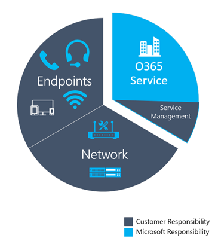

#  <a name="use-cqd-to-manage-call-and-meeting-quality-in-microsoft-teams"></a>使用 CQD 在Microsoft Teams中管理呼叫和会议质量 

本文将帮助你（Teams管理员、支持人员和帮助人员工程师）使用Microsoft Teams呼叫质量仪表板 (CQD) ，为组织制定监视和维护呼叫和会议质量的过程。 我们的指南强调音频质量方案，因为你为改善音频体验而所做的任何网络改进都将转化为视频和共享方面的改进。

本指南的关键是两个 [精心策划的 CQD 模板](https://aka.ms/QERtemplates) - 建议在完成本文中的指南之前下载它们。

本文假设已 [设置 CQD](turning-on-and-using-call-quality-dashboard.md)。


## <a name="categories-to-monitor-and-maintain"></a>要监视和维护的类别

在Teams中推出会议和语音后，你将需要一个持续监视和维护的计划。 这样做将确保Teams始终以最佳方式运行。 此计划应包括下面列出的关键区域。 还应为质量指标制定目标，并制定一个计划，以便在问题发生时进行故障排除和隔离。

<table>
<thead>
<tr class="header">
<th>类别</th>
<th>描述</th>
</tr>
</thead>
<tbody>
<tr class="odd">
<td><strong>呼叫质量</strong></td>
<td>
<p>通过组织内的内部调用 (（例如 VPN、WiFi、有线) 或外部调用）细分指标</p>
<p>通过生成或网络分解指标</p>
<p>VPN 调用</p>
<p>使用 TCP、UDP 或代理的调用</p>
</td>
</tr>
<tr class="even">
<td><strong>呼叫可靠性</strong></td>
<td><p>识别并修正任何网络或防火墙问题</p>
<p>深入了解调用设置和删除失败的百分比</p>
<p>了解大多数呼叫设置和删除失败发生的位置</p>
</td>
</tr>
<tr class="odd">
<td><strong>用户调查</strong></td>
<td>
<p>使用“速率我的呼叫”数据了解用户的实际体验</p>
<p>不良体验在哪里发生？</p>
<p>将不良体验与呼叫质量、可靠性和设备相关联</p>
</td>
</tr>
<tr class="even">
<td><strong>Devices</strong></td>
<td><p>了解最常用的麦克风和扬声器及其对通话质量的影响</p>
<p>是否定期修补支持音频、视频、USB 和 WiFi 驱动程序？</p>
</td>
</tr>
<tr class="odd">
<td><strong>客户端</strong></td>
<td>
<p>了解正在使用的客户端类型和版本及其对呼叫质量和可靠性的影响  </p>
</ol></td>
</tr>
</tbody>
</table>

通过持续评估和修正本文中所述的区域，可以降低它们对用户产生负面影响的可能性。 大多数用户问题可以分为以下类别：

-   防火墙或代理配置不完整
-   Wi-Fi 覆盖范围较小
-   带宽不足
-   VPN
-   不一致或过时的客户端版本和驱动程序
-   未优化或内置音频设备
-   子网或网络设备存在问题

在部署 Teams 或 Skype for Business Online 之前，通过适当的规划和设计，可以减少维护高质量体验所需的工作量。

本文重点介绍如何使用通话质量仪表板 (CQD) Online 作为报告和调查每个区域的主要工具，并特别强调音频以最大程度地采用和影响。 对网络所做的任何改进以改善音频体验也将直接转化为对视频和桌面共享的改进。

为了加快评估速度，提供了 [两个精心策划的 CQD 模板](https://aka.ms/qertemplates) ：一个用于管理所有网络，另一个用于仅针对托管 (内部) 网络进行筛选。 尽管“所有网络”模板报表配置为显示生成和网络信息，但它们仍可用于收集和上传生成信息。 将生成信息上传到 CQD 使服务能够通过添加自定义生成、网络和位置信息来增强报告，同时区分内部子网和外部子网。 有关详细信息，请阅读 [生成映射](CQD-building-mapping.md)。

### <a name="intended-audience"></a>预期受众

本文旨在供合作伙伴和客户利益干系人使用，其角色包括协作主管/架构师、顾问、变更管理/采用专家、支持/帮助台主管、网络潜在顾客、桌面潜在顾客和 IT 管理员。

本文还打算由指定的质量冠军 () 使用。 有关详细信息，请参阅 [质量冠军角色](4-envision-plan-my-service-management.md#the-quality-champion-role)。


## <a name="what-is-quality"></a>什么是质量？

在此上下文中，质量是服务指标和用户体验的组合。


### <a name="service-metrics"></a>服务指标

服务指标包括特定的基于客户端的指标。 在每次调用期间，客户端都会收集呼叫的遥测数据，并在每个调用结束时提交一个报表，该报告稍后可以在 CQD 或 [每用户调用分析](set-up-call-analytics.md)中访问。 这些指标包括 (但不限于) ：

-   流 (传入和传出) 差
-   安装失败率
-   删除失败率


#### <a name="poor-stream-rate"></a>流速率差

低流速率 (PSR) 表示组织质量较差的流的总体百分比。 此指标旨在突出组织可以集中力量在降低此值和改善用户体验方面产生最大影响的领域，这就是为什么 [托管网络](#managed-versus-unmanaged-networks) 是查看 PSR 时的主要关注点。 外部用户也很重要，但调查在组织上有所不同。 考虑为外部用户提供最佳做法，并独立于整个组织调查外部调用。

CQD 中的实际度量因工作负荷而异，但出于本文的目的，我们主要关注 _音频差百分比_ 度量。 PSR 由下表中所述的五个网络指标平均值组成。 若要将流分类为差，只需一个指标才能超过定义的阈值。 CQD 提供“差欠...”测量，以更好地了解是什么条件导致流被归类为差。 若要了解详细信息，请 [阅读 CQD 中的流分类](stream-classification-in-call-quality-dashboard.md)。

> [!Note]
> CQD 提供“由于...而差”测量，以更好地了解是什么条件导致流被归类为差。


##### <a name="audio-poor-quality-metrics"></a>音频质量差指标

| 指标平均值     | 说明     | 用户体验 |
|-------------|-----------------|-----------------|
| 抖动 \>30 毫秒        | 这是连续数据包之间的延迟平均变化。 Teams和Skype for Business可以通过缓冲适应某些级别的抖动。 只有当抖动超出缓冲区时，参与者才会注意到抖动的影响。      | 以不同速度到达的数据包会导致说话人的声音发出机器人的声音。   |
| 数据包丢失率 \>10% 或 0.1        | 这通常定义为丢失的数据包的百分比。 数据包丢失直接影响音频质量-从小，个别丢失的数据包，几乎没有影响背靠背突发损失，导致音频完全切断。     | 数据包被丢弃且未到达预期目标会导致媒体出现缺口，导致缺少音节和单词，以及断断续续的视频和共享。 |
| 往返时间 \>500 毫秒        | 这是从点 A 到点 B 以及从点到点 A 获取 IP 数据包所需的时间。此网络传播延迟与两个点和光速之间的物理距离相关联，包括网络路径中各种设备占用的额外开销。      | 数据包到达目标的时间过长会导致对讲机效果。   |


##### <a name="why-do-we-prefer-to-use-streams-instead-of-calls"></a>为什么我们更喜欢使用流而不是呼叫？

流让我们知道呼叫的特定部分是差的 - 传出或传入。 如果查看呼叫分析不佳，请确定调用不佳是由于该调用方的流 (出站) 还是被调用方的流 (入站) 。 确定影响呼叫质量的流对于会议更为重要。 如果你只查看呼叫数据，你将看到一个人参与的会议数，但你不会看到哪些人是活动发言人，执行最多的屏幕共享。

呼叫数据提供使用情况指标，但不一定会导致呼叫质量不佳的根本原因。 通过查看流方向，可以识别各种因素，例如不在托管网络上的呼叫、非员工 (的呼叫，例如供应商或不同网络) 上的人员。 在这些情况下，如果其他人的网络连接较差，则整个调用将标记为差。 不能对外部因素执行任何操作，因此此数据没有帮助。

流方向还可以帮助你识别有问题的设备或客户端。

 - 例如，如果设备预算有限，并且希望仅为大量音频用户提供设备，请使用音频使用情况报告 (VoIP) 和筛选出站流和会议。 查找在内置麦克风中讲话的高容量音频用户 - 这些音频用户可能与较差的通话质量 (相关，你可能希望为这些用户提供音频设备) 。 为了提高清晰度，可以筛选数据包利用率，这使你能够面向特别大容量的音频用户。 

  - 另一个示例涉及屏幕共享。 如果客户使用旧Teams客户端，屏幕共享性能可能会受到影响。 可以通过为执行大量屏幕共享的人员确定客户端升级的优先级来解决此问题。

 - 通过确定流的哪个方向导致调用质量不佳，可以确定是否存在与 QoS 或带宽相关的问题。 如果尚未完全实现 QoS，或者仅在客户端标记数据包，而不是在入站流中标记数据包，则可能会看到调用质量较差。 通过查看流方向，可以更精细地查看特定方向的数据包丢失、延迟或抖动。 

   - 例如，假设用户在有线连接时抱怨机器人音频， (抖动) 。 通过查看流和方向，可以确定问题发生在入站流上，仅针对一组特定子网。 向网络团队提供此信息后，他们可以将其跟踪到未绕过媒体流量的未配置的 WAN 加速器。 网络团队重新配置 WAN 加速器后，抖动就会消失，调用质量就会提高。 


#### <a name="setup-failure-rate"></a>安装失败率

设置失败率（也称为 CQD 中 _的总呼叫设置失败百分比_ 度量）是无法在调用开始时终结点之间建立媒体路径的流数。

这表示无法建立的任何媒体流。 鉴于此问题对用户体验的影响的严重性，目标是将此值尽可能降低到接近零。 与成熟的部署相比，在防火墙规则不完整的新部署中，此指标的高值更为常见，但定期监视仍然很重要。

此指标的计算方法是：将未设置的流总数除以提交成功调用详细信息记录 (CDR) 的流总数：

-   **安装失败率** = 总呼叫设置失败流计数/CDR 可用流计数总数

#### <a name="drop-failure-rate"></a>删除失败率

下降失败率（即 CQD 中 _的总调用删除失败百分比_ 度）是成功建立的流的百分比，其中媒体路径未正常终止。

这表示意外终止的任何媒体流。 尽管其影响并不像未能设置的流那样严重，但它仍然会对用户体验产生负面影响。 突然和频繁的媒体下降不仅会对用户体验产生严重影响，而且会导致用户需要重新连接，导致生产力下降 (更何况挫折) 。

该指标的计算方法是将删除的流总数除以成功设置的流总数：

-   **删除失败率** = 总调用删除流计数/总调用设置成功流计数

### <a name="define-your-target-metrics"></a>定义目标指标

本部分讨论用于评估服务运行状况的一些核心服务指标。 通过持续评估和推动努力使这些指标低于其定义的目标，你将帮助确保用户体验一致且可靠的呼叫质量。 作为起点，请使用下表中的建议目标。 根据需要调整目标以满足业务目标。

<table>
<tr>
<th rowspan="2" colspan="2" valign="center">网络类型</th><th rowspan="1">质量目标</th><th colspan="2">可靠性目标</th></tr>
<tr><th>音频差流速率</th><th>安装失败率</th><th>删除失败率</th></tr>
<tr><td rowspan="2"><strong>All</strong></td><td>内部</td><td>2.0%</td><td>0.5%</td><td>2.0%</td></tr>
<tr><td>整体</td><td>3.0%</td><td>1.0%</td><td>3.0%</td></tr>
<tr><td rowspan="5"><strong>会议</strong></td><td>内部</td><td>2.0%</td><td>0.5%</td><td>2.0%</td></tr>
<tr><td>有线内部</td><td>1.0%</td><td>0.5%</td><td>1.0%</td></tr>
<tr><td>Wi-Fi 5 GHz 内部</td><td>1.0%</td><td>0.5%</td><td>1.0%</td></tr>
<tr><td>Wi-Fi 2.4 GHz 内部</td><td>2.0%</td><td>0.5%</td><td>2.0%</td></tr>
<tr><td>整体</td><td>2.0%</td><td>0.5%</td><td>3.0%</td></tr>
<tr><td rowspan="4"><strong>P2P</strong></td><td>内部</td><td>2.0%</td><td>0.5%</td><td>2.0%</td></tr>
<tr><td>有线/Wi-Fi 5 GHz 内部</td><td>1.0%</td><td>0.5%</td><td>1.0%</td></tr>
<tr><td>Wired/Wi-Fi 5 GHz 整体</td><td>2.0%</td><td>1.0%</td><td>1.0%</td></tr>
<tr><td>整体</td><td>2.0%</td><td>1.0%</td><td>3.0%</td></tr>
</table>

### <a name="user-experience"></a>用户体验

分析用户体验比科学更艺术，因为收集在这里的指标并不总是意味着网络或服务存在问题，而只是表明用户认为存在问题。 CQD 包括内置调查机制（“我的呼叫率” (RMC) ），以帮助衡量总体用户体验。 RMC 将从用户的角度深入了解以下问题：

-   是否知道如何使用该解决方案？
-   解决方案是否易于使用和直观，是否支持我的日常通信需求？
-   该解决方案是否可帮助我完成工作？
-   我对解决方案的总体看法是什么？
-   无论我在哪里，我能否在任何时间点使用该解决方案？
-   是否可以设置和维护呼叫？

#### <a name="rate-my-call"></a>对我的呼叫进行评分 

 (RMC) 内置于Teams和Skype for Business中。 它每 10 个调用中就有 1 个或 10% 后自动弹出。 此简短调查要求用户对呼叫进行评分，并为呼叫质量可能较差的原因提供一些上下文。 一两个分级被认为是差的，三到四是好的，五个是优秀的。 虽然它有点滞后指示器，但这是一个有用的指标，用于发现服务指标可能错过的问题。

> [!Note]
> 人为因素：当呼叫质量良好时，用户通常会忽略调查，并且在呼叫质量不佳时填写。 因此，即使服务指标良好，RMC 报告也可能偏向于较差的一面。

可以使用 CQD 报告 RMC 用户响应，示例报表包含在 CQD 模板中。 但是，本文未详细讨论这些内容。 

#### <a name="client-and-device-readiness"></a>客户端和设备就绪情况

你需要一个可靠的客户端和设备策略来帮助确保用户具有一致和积极的用户体验。 一些关键原则推动了每个准备策略。

##### <a name="client-readiness"></a>客户端就绪情况

使Teams客户端保持最新状态可确保用户始终获得最佳体验。 Microsoft 会频繁发布[对Teams客户端的更新](teams-client-update.md)， (更新会在后台自行安装，除非你已关闭此功能-我们不建议) 。 还必须记住修补网络、视频、USB 和音频驱动程序，因为它们通常被忽视，可能会影响通话和会议质量。 请考虑将网络、Wi-Fi、视频、USB 和音频驱动程序添加到当前的修补程序管理过程中。


##### <a name="device-readiness"></a>设备就绪情况

没有一个策略比设备就绪策略更能影响用户体验。 例如，依赖笔记本电脑扬声器和麦克风的用户在通话和会议中会遇到很多背景噪音。 Teams设计用于处理几乎所有设备，但如果遇到与设备相关的问题，请查看[电话Teams](./devices/phones-for-teams.md)。


### <a name="categories-of-quality"></a>质量类别

操作一组质量管理做法 - 这为你提供了最佳通话和会议质量的机会。 高质量的管理计划可解决以下类别：

-   **网络：** 音频质量侧重于低流比 (PSR) 指标、TCP 使用情况、有线子网和无线子网，以及识别 HTTP 代理和 VPN 的使用情况

-   **端点：** 音频设备和最新客户端

-   **服务管理：** 此类别包括两个部分：

    -   首先是 Microsoft 负责管理和维护Teams和Skype for Business联机服务。

    -   第二是组织为确保对服务的可靠访问而管理的任务，例如更新生成信息，以及在将基础结构添加到服务时维护新Office 365 IP 地址的防火墙。



查看以下建议用于保持质量的任务列表。 应定期执行这些任务，例如每周执行一次。

#### <a name="service-management-tasks"></a>服务管理任务

这些任务包括确保有足够的带宽在不饱和 Internet 链接的情况下访问服务，验证所有托管网络区域上的 QoS) 服务 (质量，以及在[防火墙上保持Office 365 IP 范围](/microsoft-365/enterprise/urls-and-ip-address-ranges)之上。

#### <a name="network-tasks"></a>网络任务

网络任务分为两类：可靠性和质量。 可靠性侧重于衡量用户成功拨打呼叫和保持连接的能力。 质量侧重于用户客户端在呼叫期间和结束后发送到Teams和联机Skype for Business的聚合遥测数据。 

鉴于可靠性对用户体验产生的关键影响，建议在深入了解质量之前评估和调查可靠性指标。 

#### <a name="endpoints-tasks"></a>终结点任务

此类别中的主要任务消除了常规[Teams客户端更新](teams-client-update.md)的任何障碍。 默认情况下，Teams会定期 (自动更新，除非你关闭此设置，我们不建议) 。 

还应监视设备，并在发现与设备相关的问题时提供更新。

## <a name="use-cqd-to-manage-call-quality"></a>使用 CQD 管理呼叫质量

[设置 CQD](turning-on-and-using-call-quality-dashboard.md) 后，即可开始使用它来管理组织的通话和会议质量。

Teams性能的大多数问题都归入以下类别：

-   防火墙或代理配置不完整
-   Wi-Fi 覆盖范围较小
-   带宽不足
-   VPN
-   不一致或过时的客户端版本和驱动程序
-   未优化或内置音频设备
-   子网或网络设备存在问题

如果在推出Teams来评估这些方面并修正任何缺陷之前花费一些时间，则会减少为所有用户维护高质量Teams体验所需的工作量。 若要帮助评估网络以准备Teams推出，请阅读[Teams的顾问](use-advisor-teams-roll-out.md)，[并为Teams准备网络](prepare-network.md)。

### <a name="expectations-using-cqd"></a>使用 CQD 的预期

使用呼叫质量仪表板 (CQD) ，通过使用Teams和Skype for Business服务来深入了解呼叫的质量。 CQD 旨在帮助Teams和Skype for Business管理员和网络工程师优化网络，并密切关注质量、可靠性和用户体验。 CQD 查看整个组织的聚合遥测数据，其中整体模式可能会变得明显;这使你能够进行明智的评估和计划修正。 CQD 提供指标报告，可深入了解总体质量、可靠性和用户体验。

CQD 虽然可用于分析趋势和子网，但并不总是为给定方案提供特定原因。 请务必了解这一点，并在使用 CQD 时设置正确的预期：

-   CQD 不会为每个方案提供根本原因
-   CQD 不包含电话系统流或音频会议流
-   CQD 将根据趋势调用区域进行进一步调查

### <a name="cqd-reports-overview"></a>CQD 报告概述

使用屏幕顶部的下拉菜单打开报表。 有关每个报表中提供的数据列表，请读取 [CQD 报表中可用的数据](CQD-data-and-reports.md#data-available-in-cqd-reports)。

2020 年 1 月新增功能：[下载 CQD 的Power BI查询模板](https://github.com/MicrosoftDocs/OfficeDocs-SkypeForBusiness/blob/live/Teams/downloads/CQD-Power-BI-query-templates.zip?raw=true)。 可自定义的Power BI模板，可用于分析和报告 CQD 数据。


### <a name="teams-vs-skype-for-business"></a>Teams与Skype for Business

CQD 可以报告Teams和Skype for Business。 但是，有时可能需要开发报表来查看与Skype for Business分开的Teams遥测数据。

#### <a name="summary-reports"></a>摘要报表

若要修改摘要报表页以仅查看Teams或Skype for Business，请从屏幕顶部选择 **“产品筛选器**”下拉菜单，然后选择所需的产品。


#### <a name="detailed-reports"></a>详细报告

若要筛选所有详细报表，请在浏览器栏中将以下内容追加到 URL 的末尾：

```PowerShell
/filter/[AllStreams].[Is Teams]|[FALSE]
```

**例子：**

```https://cqd.teams.microsoft.com/cqd/#/1234567/2018-5/filter/[AllStreams].[Is Teams]|[FALSE]```

有关 URL 筛选器的详细信息，请阅读本部分后面的 [筛选报告](CQD-data-and-reports.md#report-filters) 。

若要筛选单个详细报表，请将筛选器 ``Is Teams`` 添加到报表，并将其设置为 True 或 False。


### <a name="managed-versus-unmanaged-networks"></a>托管网络与非托管网络

默认情况下，CQD 中的所有终结点都归类为外部终结点。 引入生成文件后，即可开始查看托管终结点数据。 如前所述，CQD 中的网络定义为：

-   _托管网络_（通常称为内部或内部）可能会受到组织的影响和控制。 这包括内部 LAN、远程 WAN 和 VPN。
-   _非托管网络_（通常称为外部或外部）不能受到组织的影响或控制。 非托管网络的示例是酒店或机场网络。

### <a name="dimensions-measures-and-filters"></a>维度、度量值和筛选器

格式正确的 CQD 查询包含以下三个参数：

-   **维 度：** 如何透视数据。

-   **措施：** 我想报告的内容。

-   **滤波器：** 如何减少查询返回的数据集。

另一种情况是 _，维度_ 是分组函数， _度量_ 值是我感兴趣的数据， _筛选器_ 是希望将结果缩小到与查询相关的结果的方式。

格式正确的查询的一个示例是 **显示生成 6 [筛选器] 的子网 [维度] 的差流 [度量值]**。 有关详细信息，请参阅 [CQD 中提供的维度和度量](./dimensions-and-measures-available-in-call-quality-dashboard.md)值。

### <a name="first-vs-second"></a>第一个与第二个 

CQD 中的许多维度和度量值都归类为第一个或第二个。 CQD 不使用调用方/被调用方字段，因为调用方和被调用方之间存在干预步骤，因此这些字段已 _重命名为第一_ 和第 _二_ 。 以下逻辑确定所涉及的终结点标记为第一个终结点：

-   如果服务器涉及流或呼叫，**则首先** 始终是 (会议服务器、中介服务器等) 的服务器终结点。

-   **第二** 个终结点始终是客户端终结点，除非流在两个服务器终结点之间。

-   如果这两个终结点的类型相同，则首先选择的终结点基于用户代理类别的内部排序。 这样可以确保排序的一致性。

有关在两者相同时确定第一个或第二个终结点的详细信息，请参阅 [CQD 中可用的维度和度量](./dimensions-and-measures-available-in-call-quality-dashboard.md)值。

### <a name="stream-vs-call"></a>流与调用

你需要了解调用和流之间的区别，以便正确选择要在 CQD 中查看的维度或度量值。 尽管 CQD 的主要重点是流，但基于调用的度量也可用。

-   **流：** 只有两个终结点之间存在 _流_ 。 每个方向只有一个流，通信需要两个流。 流可用于调查建筑物、网络或子网。 在某些情况下，调用和流都用于度量的名称 (例如呼叫设置流或呼叫删除流) 。 这些仍被分类为流。

-   **叫：**_呼叫_ 是来自所有参与者的所有流的分组。 调用至少由两个流组成。 单个调用将至少有两个终结点，每个终结点至少有一个流。

有关维度或度量值是指调用还是流的其他指南，请参阅 [CQD 中可用的维度和度量](./dimensions-and-measures-available-in-call-quality-dashboard.md)值

### <a name="good-poor-and-unclassified-calls"></a>好、差和未分类的调用

调用被归类为“好”、“差”或“未分类”。 让我们花点时间更详细地谈论每一个。

-   **好或差：** 好或差的调用包括包含一组完整的服务指标的调用，服务会为此生成并接收完整的 QoE 报告。 [本文前面](#poor-stream-rate)介绍了确定流是好是差。

-   **未分类：** 未分类的流不包含一整组服务指标。 这些可能是短呼叫（通常小于 60 秒），无法计算平均值，并且未生成 QoE 报表。 调用未分类的最常见原因是几乎没有数据包使用率。 这方面的一个示例是参加静音会议，从不说话的参与者。 参与者正在接收但未传输媒体。 如果不传输媒体，CQD 将没有任何指标可用于对终结点的出站媒体流进行分类。

若要了解详细信息，请 [阅读 CQD 中的流分类](stream-classification-in-call-quality-dashboard.md)。

### <a name="common-subnets"></a>常见子网

常见子网是酒店、家庭网络、热点和类似区域使用的特定专用子网。 这些子网由于广泛使用而难以进行会审。 如果你的组织使用这些常见子网之一，建议将该网络移动到另一个子网。 这样就可以在 CQD 中更轻松地进行报告。 如果注意到，所有网络模板中的报表已配置为排除这些子网，以消除这些子网作为质量不佳的根源。 下面定义了通用子网;它们的影响因组织而异。

-   10.0.0.0/24
-   192.168.0.0/24
-   192.168.1.0/24
-   192.168.2.0/24
-   172.20.10.0/24
-   192.168.43.0/24

调查使用常用子网的托管网络时，需要使用第二个反射本地 IP 维度对子网进行分组。 此维度包含终结点的公共 IP 地址。


## <a name="reliability-investigations"></a>可靠性调查

提高质量的第一步是评估整个组织的可靠性状态。 由于可靠性对于积极的用户体验至关重要，因此我们从衡量可靠性的两个组件开始：

1.  **安装失败：** 无法建立呼叫。

2.  **删除失败：** 呼叫已建立并意外终止。

在本部分中，我们将介绍调查这两个领域的方法。

> [!NOTE]
> 本文并未介绍模板中包含的所有报表。 但是，下面解释的调查方法仍然适用。 有关详细信息，请参阅单个报表说明。


### <a name="setup-failures"></a>安装失败

优先修正此领域的安装失败，因为这些故障会对用户体验产生显著的负面影响。

通过评估组织的总体设置失败百分比开始调查，然后通过构建或网络根据最高百分比确定调查区域的优先级。 

#### <a name="setup-failure-trend-analysis"></a>安装失败趋势分析

此报表显示流总数、流设置失败和流设置失败率。 指向任意一列以显示其单个值。 

##### <a name="analysis"></a>分析

通过使用此报表，可以回答以下问题并确定下一个操作过程：

-   当月的总呼叫设置失败百分比是怎样的？

-   总调用设置失败百分比是否低于或高于定义的目标指标？

-   失败趋势是否比前一个月更严重或更好？

-   失败趋势是增大、稳定还是下降？

无论你对这些问题的回答如何，请花时间通过使用配套子报表进一步调查，以查找任何可能需要修正的单独建筑物或子网。 尽管总体故障率可能低于目标指标，但一个或多个建筑物或网络的故障率可能高于目标指标，需要进行调查。

#### <a name="setup-failure-investigations"></a>安装失败调查 

此摘要报告用于发现和隔离任何可能需要修正的建筑物或网络。

> [!NOTE]
> 请务必将月份报表筛选器调整为当前月份。 选择 **“编辑**”，并调整 **“月年”** 报表筛选器以保存新的默认月份。

##### <a name="remediation"></a>修复 

将首次修正工作重点放在故障量最大的建筑物或子网上。 这将最大程度地影响用户体验，并有助于快速降低组织呼叫设置失败率。 下表列出了 CQD 报告的安装失败的两个原因。

| 呼叫设置失败原因       | 典型原因                    |
|----------------------------------|----------------------------------|
| 缺少 FW 深包检查豁免规则 | 指示路径沿线的网络设备由于深度数据包检查规则而阻止建立媒体路径。 这可能是由于防火墙规则未正确配置。 在此方案中，TCP 握手成功，但 SSL 握手未成功。      |
| 缺少 FW IP 块异常规则      | 指示沿路径的网络设备阻止将媒体路径建立到Microsoft 365或Office 365网络。 这可能是由于代理或防火墙规则未正确配置为允许访问用于Teams和Skype for Business流量的 IP 地址和端口。 |

开始修正时，可以将工作重点放在特定的建筑物或子网上。 如上表所示，这些问题是由于防火墙或代理配置造成的。 查看下表中有关修正操作的选项。

|      修复      |指引  |
|-----------------------|----------|
| 配置防火墙 | 请与网络团队协作，针对[Office 365 IP 地址列表](/microsoft-365/enterprise/urls-and-ip-address-ranges)验证防火墙配置。<br><br>验证是否在防火墙规则中包含 [媒体子网](https://support.office.com/article/Office-365-URLs-and-IP-address-ranges-8548a211-3fe7-47cb-abb1-355ea5aa88a2#bkmk_teams) 和端口。 <br><br>验证是否已在防火墙中打开 [必要的端口](prepare-network.md) 。 应优先考虑 UDP，因为 TCP 被视为音频、视频和基于视频的屏幕共享的故障回复协议，其使用将影响通话质量。 旧版 RDP 应用程序共享仅使用 TCP。|

### <a name="drop-failures"></a>删除失败

与安装失败代码不同，CQD 没有删除失败代码来指示发生删除失败的原因，这使无法隔离特定的根本原因。 若要更好地对删除失败进行会审，请使用推断方法。 通过修正媒体感兴趣的任何领域、修补客户端和驱动程序，以及推动Teams和Skype for Business认证设备的使用，可能会导致故障下降。

#### <a name="drop-failure-trend-analysis"></a>删除失败趋势分析

此报表显示音频流总量、删除失败总数和删除失败率。 指向任意一列以显示其值。 


##### <a name="analysis"></a>分析

通过使用此类报表，可以回答以下问题：

-   当前的下降失败率是怎样的？
-   下降失败率是否低于定义的目标指标？
-   失败趋势是否比前一个月更严重或更好？
-   失败趋势是增大、稳定还是下降？

无论上述问题的答案如何，请花时间调查如何使用子报表查找任何可能需要修正的建筑物或网络。 尽管总体下降失败率可能低于目标指标，但一个或多个建筑物或网络的下降失败率可能高于目标指标，需要进行调查。

#### <a name="drop-failure-investigations"></a>删除失败调查

此处报告的失败表明调用意外删除，导致用户体验出现负值。 与热门报表不同，这些报告提供了对需要进一步调查的特定子网的更多见解。


##### <a name="remediation"></a>修复

使用包含的表报表，可以隔离网络中下降速率高于已定义的目标指标的问题区域。 将首次修正工作重点放在总流计数最高的建筑物或子网上，以产生最大的影响。

调用下降的常见原因：

-   预配不足的网络或 Internet 出口
-   在受约束的网络上未配置 QoS
-   较旧的客户端版本
-   用户行为

发现问题区域后，可以使用 [每用户呼叫分析](use-call-analytics-to-troubleshoot-poor-call-quality.md) 来进一步查看该建筑中的用户，了解特定问题。 呼叫分析包含其他 EUII 数据，可用于进一步隔离删除失败的潜在原因。

无论下一步如何，最好通知支持人员特定建筑物或子网已发现问题。 这样，支持人员就可以更高效地快速响应传入呼叫和会审用户。 然后，可以将标记的用户报告回工程团队以供进一步调查。

下表列出了一些用于管理和修正删除失败的常见方法。

| 修复                              | 指引                      |
|------------------------------------------|-------------------------------|
| **网络/Internet**                         | **拥塞**：请与网络团队合作，监视特定建筑物/子网的带宽，以确认过度使用存在问题。 如果确认存在网络拥塞，请考虑增加该建筑物的带宽或应用 QoS。 使用包含 [的质量差流摘要报表](#quality-investigations) 查看问题子网，了解抖动、延迟和数据包丢失问题，因为这些问题通常会在删除流之前出现。<br><br>**QoS**：如果增加带宽不切实际或成本过高，请考虑实现 QoS。 此工具在管理拥挤的流量方面非常有效，可以保证托管网络上的媒体数据包优先于非媒体流量。 或者，如果没有明确的证据表明带宽是罪魁祸首，请考虑以下解决方案：<ul><li>[Microsoft Teams QoS 指南](qos-in-teams.md)</li></ul><br>**执行网络就绪性评估**：网络评估提供有关预期带宽使用情况、如何应对带宽和网络更改的详细信息，以及Teams和Skype for Business建议的网络做法。 使用上表作为源，你有一个建筑物或子网列表，这些建筑物或子网是评估的优秀候选项。<ul><li>[为 Teams 准备贵组织的网络](prepare-network.md)</li></ul> |
| **客户端仅 (Skype for Business联机)** | 一些较旧Skype for Business客户端已经知道，并记录了媒体可靠性问题。 查看来自多个受影响用户的呼叫分析报告，或在 CQD 中创建自定义客户端版本表报表，该报表筛选到具有“总呼叫删除失败百分比”度量值的特定建筑物或子网。 此信息将帮助你了解该特定生成中的调用删除与客户端的特定版本之间是否存在关系。     |
| **Devices**                                  |如果设备是呼叫质量问题的罪魁祸首，请考虑更新违规设备。 阅读[电话Teams](./devices/phones-for-teams.md)了解详细信息。 |
| **用户行为**                            | 如果确定网络、设备或客户端都不是问题所在，请考虑制定用户采用策略，以教育用户如何最好地加入和退出会议。 更智能的Teams和Skype for Business用户将为会议中的所有参与者提供更好的用户体验。 例如，通过关闭盖子 () 而不退出会议将笔记本电脑置于睡眠状态的用户将被归类为意外呼叫删除。   |

## <a name="quality-investigations"></a>质量调查

下一步是调查 PSR) 、TCP 和代理使用率 (差的音频质量状态。 请务必记住，CQD 数据不会为你提供特定的根本原因，而是为你提供可能的问题领域，以便开始与相应的团队进行协作对话以进行修正活动。 

> [!NOTE]
> 本文并未介绍模板中包含的所有报表;但是，下面所述的调查方法仍将适用于这些报告。 有关详细信息，请参阅单个报表说明。 

### <a name="quality"></a>质量

PSR 百分比用于指示组织是否满足给定焦点区域的定义指标目标。 请务必注意，即使高级别百分比在定义的目标范围内，单个子网或建筑物也可能不符合定义的目标，因此需要进一步调查。 例如，如果总体音频 PSR 百分比在 4 月为 2%，满足示例目标，则单个建筑物和子网可能仍然体验不佳，具体取决于该 2% 的总体分布。 

若要评估不良流的百分比，请使用质量报告。 提供了各种质量报告，用于查看整体、会议、双方、PSTN 呼叫、VPN 和会议室的指标。 提供每月、每周和每日报告，以帮助完成此过程。 每周和每日报表仅限于托管网络模板，以提高其有效性并降低干扰。 

#### <a name="quality-trend-analysis"></a>质量趋势分析

趋势报表随时间推移显示质量信息，用于帮助识别和了解每个感兴趣的领域中的质量趋势。 如上所述，模板中包含报表树，用于调查质量：会议、两方会议、PSTN 呼叫、VPN 和会议室。 为了分析质量，调查过程是相同的。 但是，我们建议首先从会议开始，因为会议质量的任何改进也会对所有其他领域产生积极影响。 

> [!Note]
> 调查双方、PSTN 呼叫和会议室类似于调查会议。 重点是隔离质量最差的建筑物或子网，并找出质量差的原因。

> [!Important]
> 基于 VPN 的报表使用第二个 VPN 维度进行筛选。 此维度要求将 VPN 网络适配器正确注册为远程访问适配器。 VPN 供应商不可靠地使用此标志，你的里程将因组织中部署的 VPN 供应商而异。 如果需要，请使用建筑物或网络名称修改 [VPN](CQD-upload-tenant-building-data.md#vpn) 报表。

##### <a name="investigation"></a>调查

通过使用这些报表，可以回答以下问题：

-   当月的总 PSR 是什么？
-   PSR 是否低于定义的目标指标？
-   PSR 是否比上一个月更差或更好？
-   PSR 趋势是增加、稳定还是下降？

无论上述问题的答案如何，请花时间通过使用子报表来调查任何可能需要调查的建筑物或子网。 尽管总体 PSR 可能低于目标指标，但一个或多个建筑物或网络的 PSR 通常高于指标，需要修正。

#### <a name="quality-investigations"></a>质量调查

通过质量摘要报告，可以更深入地了解导致流被归类为差的原因，并有助于隔离托管网络中的问题区域。

尽管所使用的维度在报表之间可能略有不同，但每个报表将包括对总流、总差流、PSR 和质量差的度量值。 已针对每个感兴趣的领域创建报告：会议、双方会议室、PSTN 呼叫、VPN 和会议室。 托管网络模板包含其他报表，以利用通过生成文件上传的位置信息。


> [!Note]
> 常见的子网由于广泛使用而难以进行会审。 向“所有网络”模板添加了一个单独的报表，其中显示了客户端的公共 IP (第二个反身本地 IP) ，以帮助修正使用公共网络的办公室。


##### <a name="remediation"></a>修复

将修正工作重点放在流量最大的建筑物或子网上，因为这将最大程度地影响和帮助快速改善用户体验。 使用抖动、数据包丢失和往返时间 (RTT) 度量来了解导致质量不佳的原因 (可能存在多个问题) ：

-   **抖动**：媒体数据包以不同的速度到达，这会导致扬声器发出机器人的声音。
-   **数据包丢失**：正在删除媒体数据包，这会产生缺少单词或音节的效果。
-   **RTT**：媒体数据包需要很长时间才能到达其目标，这会产生对讲机效果。

若要协助调查质量问题，请使用 [每用户呼叫分析](use-call-analytics-to-troubleshoot-poor-call-quality.md)。 使用呼叫分析，可以查看特定会议或用户的呼叫报告。 此报表将包含 EUII/PII 数据，在查找故障原因时非常有用。 知道哪个建筑物受到影响后，应该可以直接跟踪该建筑中的用户。 

请勿忘记让支持人员知道这些网络正遇到质量问题，因此它们可以快速会审和响应传入的呼叫。

| 修复                              | 指引                         |
|------------------------------------------|----------------------------------|
| **网络**                                 | **拥塞**：过度使用或预配不足的网络可能会导致媒体质量问题。 与网络团队合作，确定从用户到 Internet 出口点的网络连接是否有足够的带宽来支持媒体。 <br><br>**执行网络就绪性评估**：网络评估提供有关预期带宽使用情况、如何应对带宽和网络更改的详细信息，以及Teams和Skype for Business建议的网络做法。 使用上表作为源，你有一个建筑物或子网列表，这些建筑物或子网是评估的优秀候选项。<ul><li>[为 Teams 准备贵组织的网络](prepare-network.md)</li></ul>|
| **服务质量 (QoS)**  | QoS 是一种经过验证的工具，可帮助在拥挤的网络上确定数据包的优先级，以确保数据包能够完整、按时到达目标。 考虑在整个组织中实现 QoS，以最大程度地提高受约束带宽的用户体验的质量。 QoS 将帮助解决通常与高数据包丢失以及更小程度的抖动和往返时间相关的问题。<ul><li>[Teams QoS 指南](qos-in-teams.md)</li></ul> |
| **Wi-Fi**               | Wi-Fi可能会对调用质量产生重大影响。 Wi-Fi部署通常不考虑 VoIP 服务的网络要求，通常是质量不佳的来源。 有关优化Wi-Fi基础结构的详细信息，请参阅 [本文介绍Wi-Fi规划](/skypeforbusiness/certification/plan-wifi)。<br><br>**无线驱动程序**：确保无线驱动程序是最新的。 这将有助于缓解与过时驱动程序相关的任何不良用户体验。 许多组织在其修补程序周期中不包括无线驱动程序，这些驱动程序可以取消修补多年。 许多无线问题通过确保无线驱动程序是最新的来解决的。<br><br>**WMM**： (WMM) （也称为Wi-Fi多媒体）的无线多媒体扩展为无线网络提供基本的 QoS 功能。 新式无线网络必须支持许多设备。 这些设备争夺带宽，并可能导致 VoIP 服务的质量问题，其中速度和延迟至关重要。 请咨询无线供应商了解具体信息，并考虑在无线网络上实现 WMM，以确定Skype for Business和Teams媒体的优先级。<br><br>**访问点密度**：访问点可能相距太远或不位于理想位置。 若要最大程度地减少潜在的干扰，请将额外的访问点放置在会议室和不被墙壁或Wi-Fi信号较弱的其他对象阻碍的位置。<br><br>**2.4 GHz 与 5 GHz**：5 GHz 提供较少的后台干扰和更高的速度，在通过 Wi-Fi 部署 VoIP 时应优先考虑。 但是，5 GHz 并不像 2.4 GHz 那么强大，也不会那么容易穿透墙壁。 查看生成布局以确定可以依赖哪种频率来实现最佳连接。 |
|**网络设备** | 大型组织可能有数百台设备分布在网络中。 请与网络团队协作，确保维护从用户到 Internet 的网络设备，并保持最新状态。 |
| **VPN**  | VPN 设备通常不用于处理实时媒体工作负荷。 某些 VPN 配置禁止使用 UDP (这是媒体) 的首选协议，仅依赖于 TCP。 请考虑实现 VPN 拆分隧道解决方案，以帮助减少 VPN 作为质量不佳的根源。 |
| **客户端** <br>仅 (Skype for Business联机)  | 确保定期更新所有客户端。 |
| **Devices** | 如果设备是呼叫质量问题的罪魁祸首，请考虑更新违规设备。 阅读[电话Teams](./devices/phones-for-teams.md)了解详细信息。 |
| **司机** | 修补网络 (以太网和 Wi-Fi) 、音频、视频和 USB 驱动程序应是整个修补程序管理策略的一部分。 许多质量问题都是通过更新驱动程序来解决的。 |
| **Wi-Fi 上的会议室** | 强烈建议使用至少 1 Gbps 以太网连接将会议室设备连接到网络。 会议室设备通常包括多个音频和视频流以及会议内容（如屏幕共享），并且比其他Teams或Skype for Business终结点具有更高的网络要求。 根据定义，会议室是固定设备，Wi-Fi仅在安装期间提供权益。<br><br>会议室需要格外小心和注意，以确保使用这些设备的体验符合或超出预期。 会议室的质量问题通常会迅速升级，因为高级职员经常使用这些问题。<br><br>除了方便) 之外，所有内容都相等 (，Wi-Fi性能通常小于有线连接。 随着“自带设备”策略的兴起和笔记本电脑的激增，Wi-Fi接入点往往被过度利用。 实时媒体可能不会在Wi-Fi网络上设置优先级，这可能会在使用高峰期导致质量问题。 这种繁重的使用可能与一个会议同时发生，其中可能有十几个人出席，每个会议都有自己的笔记本电脑和智能手机，都连接到与会议室设备相同的Wi-Fi接入点。<br><br>Wi-Fi应仅被视为临时解决方案、移动安装或已正确预配Wi-Fi以支持基于业务类的实时媒体。 |


### <a name="tcp"></a>TCP 

传输控制协议 (TCP) 被视为故障回复传输，而不是实时媒体所需的主要传输。 故障回复传输的原因是 TCP 的有状态性质。 例如，如果在潜在网络上进行调用，而媒体数据包被延迟，那么几秒钟前的数据包（不再有用）会争用带宽来到达接收方，这可能会使情况变得更糟。 这使得音频愈合器缝合和拉伸音频，导致可听见的项目，往往以抖动的形式。

本部分中的报表不区分好流和差流。 鉴于首选 UDP，报表将查找 TCP 用于音频、视频和基于视频的屏幕共享 (VBSS) 。 提供低流速率有助于比较 UDP 质量与 TCP 质量，以便你可以在影响最大的位置集中工作。 TCP 使用量主要由不完整的防火墙规则导致。 有关Teams和联机Skype for Business防火墙规则的详细信息，请参阅[Microsoft 365和Office 365 URL 和 IP 地址范围](/microsoft-365/enterprise/urls-and-ip-address-ranges)。

> [!Note]
> 音频、视频和 VBSS 都倾向于将 UDP 作为主要传输方式。 旧版 RDP 应用程序共享工作负载仅使用 TCP。

#### <a name="tcp-usage"></a>TCP 使用情况

TCP 报表指示过去七个月的总体 TCP 使用情况。 本部分中的所有进一步报告将侧重于缩小 TCP 最常用的特定建筑物和子网的范围。 单独的报表可用于会议和两方流。


##### <a name="investigation"></a>调查

通过使用此报表，可以回答以下问题：

-   本月的 TCP 流总量是怎样的？
-   是比上个月更糟还是更好？
-   TCP 使用趋势是增加、稳定还是减少？
-   TCP PSR 是否与我的总体 PSR 相同？

如果注意到 TCP 使用率趋势正在增加或高于正常每月使用量，请花时间通过使用子报表来调查可能需要修正的任何建筑物或网络。 理想情况下，需要在托管网络上尽量少使用基于 TCP 的音频会话。

#### <a name="tcp-vs-udp"></a>TCP 与 UDP

此报表标识最近一个月用于音频、视频和基于视频的屏幕共享 (VBSS) 的 TCP 与 UDP 使用情况报告的数量。 


##### <a name="analysis"></a>分析

尽管希望 TCP 使用率尽可能低，但在其他正常部署中可能会看到一些 TCP 使用率。 TCP 本身不会导致调用不佳，因此提供流速率有助于确定 TCP 使用率是否是导致质量不佳的因素。 

#### <a name="tcp-investigations"></a>TCP 调查

在提供的 CQD 模板中，使用托管网络或所有网络模板通过生成和子网报表导航到 TCP 流。 为了调查 TCP 使用情况，此过程是相同的，因此我们将在此处将讨论重点放在会议上。


##### <a name="remediation"></a>修复

此报表标识有助于 TCP 使用量的特定建筑物和子网。 此外，还包含一份其他报告，用于标识调用中用于帮助隔离缺失防火墙规则的 Microsoft 中继 IP。 将修正工作重点放在 TCP 流量最高的建筑物上，以最大限度地提高影响。

TCP 使用的最常见原因是防火墙或代理中缺少异常规则。 我们将在下一部分讨论代理，因此现在将精力集中在防火墙上。 通过使用提供的生成或子网，可以确定需要更新的防火墙。

| 修复        | 指引     |
|--------------------|--------------------------------------|
| 配置防火墙 | 验证是否从防火墙中排除[Microsoft 365或Office 365 IP 端口和地址](/microsoft-365/enterprise/urls-and-ip-address-ranges)。 对于与媒体相关的 TCP 问题，请将初始工作重点放在以下方面：<ul><li>验证客户端媒体子网 13.107.64.0/18 和 52.112.0.0/14 是否在防火墙规则中。</li><li>UDP 端口 3478-3481 是必需的媒体端口，必须打开，否则客户端将故障回复到 TCP 端口 443。</li></ul> |
| 验证             | 使用 [Microsoft 网络评估工具](https://www.microsoft.com/download/details.aspx?id=53885)检查与特定Microsoft 365或从受影响的建筑物或子网Office 365 IP 地址和端口的连接问题。    |

### <a name="http-proxy"></a>HTTP 代理

由于多种原因，HTTP 代理不是建立媒体会话的首选路径。 许多数据包都包含深度数据包检查功能，这些功能可防止完成与服务的连接并导致中断。 此外，几乎所有代理都强制使用 TCP，而不是允许 UDP，建议使用 UDP 来获得最佳音频质量。

我们始终建议将客户端配置为直接连接到Teams和Skype for Business服务。 这对基于媒体的流量尤其重要。


> [!IMPORTANT]
> 建议上传 [有效的生成文件](CQD-upload-tenant-building-data.md) ，以便在分析代理使用情况时，可以在内部与外部音频流区分开来。 


#### <a name="http-proxy-usage"></a>HTTP 代理使用情况

模板此部分中的 HTTP 代理流报表与 TCP 报表非常类似。 它不考虑调用是差还是好，而是调用是否通过 HTTP 连接。


##### <a name="analysis"></a>分析

你希望看到尽可能少的 HTTP 媒体流。 如果有遍历代理的流，请咨询网络团队，确保存在适当的排除项，以便客户端直接路由到Teams或Skype for Business联机媒体子网。

如果组织中只有一个 Internet 代理，请验证正确的[Microsoft 365或Office 365 URL 和 IP 地址范围排除项](/microsoft-365/enterprise/urls-and-ip-address-ranges)。 如果组织中配置了多个 Internet 代理，请使用 HTTP 子报表隔离受影响的生成或子网。

对于无法绕过代理的组织，请确保Skype for Business客户端在位于代理后面时配置为正确登录，如文章中所述[Skype for Business应使用代理服务器登录，而不是尝试直接连接](https://support.microsoft.com/help/3207112/skype-for-business-should-use-proxy-server-to-sign-in-instead-of-tryin)。 


#### <a name="http-proxy-investigations"></a>HTTP 代理调查

此报表标识导致 HTTP 使用情况的特定建筑物和子网。


##### <a name="remediation"></a>修复

[建议始终](proxy-servers-for-skype-for-business-online.md)绕过代理Skype for Business和Teams，尤其是媒体流量。 代理不会使Skype for Business更安全，因为它的流量已加密。 环境中可能会出现由于延迟和数据包丢失而引起的与性能相关的问题。 诸如此类的问题将导致音频、视频和屏幕共享的负面体验，而实时流是必不可少的。

HTTP 使用率的最常见原因是代理中缺少异常规则。 通过使用提供的生成或子网，可以快速确定需要为媒体旁路配置的代理。

验证是否将所需的[Microsoft 365或Office 365 FQDN](/microsoft-365/enterprise/urls-and-ip-address-ranges) 添加到代理中的允许列表中。

## <a name="endpoint-investigations"></a>终结点调查

本部分重点介绍报告客户端版本和使用认证设备的任务。 报表可用于概述客户端版本、客户端类型、捕获设备和驱动程序 (麦克风) 、视频捕获设备以及Wi-Fi供应商和驱动程序版本的使用情况。

> [!NOTE]
> 本文并未介绍模板中包含的所有报表;但是，下面解释的调查方法仍然适用。 有关详细信息，请参阅单个报表说明。

### <a name="client-versions"></a>客户端版本

这些报告侧重于标识Skype for Business使用的客户端版本及其在环境中的相对卷。

> [!IMPORTANT]
> 目前，Teams客户端通过 Azure 内容分发网络自动分发和更新，服务将保持最新状态。 因此，无需监视Teams客户端版本 (，除非关闭自动更新，我们不建议) 。

除非排除联合参与者数据，否则这些报告将包括联合终结点中的客户端遥测数据。 若要排除联合终结点，必须向组织的 [租户 ID](CQD-data-and-reports.md#how-to-find-your-tenant-id) 添加第二租户 ID 的查询筛选器。 或者，可以使用 [URL 筛选器](CQD-data-and-reports.md#url-filters) 排除联合参与者遥测。


#### <a name="remediation"></a>修复

推动高质量用户体验的关键部分是确保托管客户端运行最新版本的Skype for Business，以及确保支持音频、视频、网络和 USB 驱动程序是最新的。 这提供了一些好处，其中包括： 

-   与许多版本相比，管理几个版本更容易。
-   它提供一定程度的体验一致性。
-   这样可以更轻松地排查呼叫质量和可用性问题。
-   Microsoft 在产品中不断进行常规改进和优化。 确保用户收到这些更新可降低他们遇到已解决的问题的风险。

将部署限制为 6 个月以下的客户端版本将通过减少需要支持的版本数来改善整体用户体验并提高可管理性。

如果只使用Office即点即用，则会在六个月的窗口内自动使用。 无需执行进一步操作。

如果混合使用即点即用和安装程序包 (MSI) ，则可以使用报表来验证 MSI 客户端是否正在定期更新。 如果发现客户端落后，请与负责管理Office更新的团队协作，并确保他们定期批准和部署客户端修补程序。

同样重要的是要考虑并确保网络、视频、USB 和音频驱动程序也得到修补。 可以很容易地忽略这些驱动程序，而不会将其包含在修补程序管理策略中。

可以通过以下链接找到Skype for Business的版本号：

-   [Microsoft 365 应用版更新的发布信息](/officeupdates/release-notes-office365-proplus)
-   [更新Microsoft 365 企业应用版的历史记录](/officeupdates/update-history-office365-proplus-by-date)
-   [Skype for Business 下载和更新](/SkypeForBusiness/software-updates)

### <a name="devices"></a>设备

若要使用麦克风设备报表，我们需要了解 MOS)  (平均意见分数的概念。 MOS 是衡量感知到的音频质量的黄金标准度量。 它表示为从 0 到 5 的整数分级。

语音质量指标的基础是一个人如何看待语音质量。 因为它受到人类感知的影响，所以本质上是主观的。 有多种不同的方法用于主观测试。 大多数语音质量度量基于绝对分类分级 (ACR) 规模。

在ACR主观测试中，有相当一部分人将其经验质量从1 (不良) 到5 (优秀) 。 分数的平均值为 MOS。 生成的 MOS 取决于向组公开的体验范围以及被评级的体验类型。

由于对实时通信系统进行语音质量的主观测试是不切实际的，因此Microsoft Teams和Skype for Business使用高级算法客观预测主观测试的结果来生成 MOS 值。

可用的 MOS 集和关联的指标提供了音频设备传递给用户的体验质量的视图。 

通过向用户提供经过Teams和Skype for Business认证的设备，可以降低由于设备本身 (（例如，内置笔记本电脑扬声器和麦克风) ）而遇到负面体验的可能性。 有关详细信息，请参阅有关 [认证计划](/SkypeForBusiness/certification/overview) 和 [合作伙伴解决方案目录](https://partnersolutions.skypeforbusiness.com/solutionscatalog/personal-peripherals-pcs)的这些文章。

设备报表用于按音量和 MOS 分数评估设备使用情况， (仅) 音频，并且可以在客户端&设备下的随附模板中找到。 

> [!IMPORTANT]
> 除非排除联合参与者数据，否则这些报告将包括联合终结点中的客户端遥测数据。 若要排除联合终结点，必须向组织的 [租户 ID](CQD-data-and-reports.md#how-to-find-your-tenant-id) 添加第 **二租户 ID** 的查询筛选器。 可以使用 [URL 筛选器](CQD-data-and-reports.md#url-filters) 来排除联合参与者遥测数据。


> [!Note]
> 查看此报表时，你可能会注意到，你已多次看到同一设备报告。 这是由于向 CQD 报告设备的方式。 硬件和 OS 区域设置的差异会导致设备数据报告方式的差异。

##### <a name="remediation"></a>修复

通常，需要发现和逐步淘汰未经认证的设备，并将它们替换为经过认证的设备。 查看设备报表时的一些注意事项包括：

-   正在使用的设备是否有Teams和Skype for Business认证？ 
-   可以使用 [每用户呼叫分析](use-call-analytics-to-troubleshoot-poor-call-quality.md)来标识特定设备的用户。 检查以确保他们拥有最新的设备驱动程序，并且其设备未通过 USB 中心或停靠站连接。 
-   正在使用多少不同版本的各种驱动程序？ 它们定期修补吗？ 确保定期修补音频、视频和Wi-Fi驱动程序将有助于消除这些驱动程序作为质量问题的根源，并使用户体验更具可预测性和一致性。

##### <a name="audio"></a>音频

下一个任务是确定 [经认证的音频设备](https://partnersolutions.skypeforbusiness.com/solutionscatalog/personal-peripherals-pcs)的总体使用情况。 我们建议至少 80% 的所有音频流都使用经过认证的音频设备。 最好将麦克风设备报表导出到Excel，以计算经认证或批准的设备的使用情况。 组织通常保留所有已批准设备的列表，因此，对数据进行筛选和排序应非常简单。

##### <a name="video"></a>视频

视频驱动程序也必须不断更新。 确保定期修补视频卡将帮助排除视频驱动程序作为视频流质量差的根源。 使用 [经过认证的视频设备](https://partnersolutions.skypeforbusiness.com/solutionscatalog/personal-peripherals-pcs) 将有助于确保顺利且高质量的用户体验。 支持 H.264 本机编码的视频设备是首选设备，以减少视频会议期间的 CPU 使用率。

##### <a name="wi-fi"></a>Wi-Fi

Wi-Fi驱动程序也需要按常规节奏进行修补，并且应包含在修补程序管理策略中。 可以通过维护最新的Wi-Fi驱动程序来更正许多质量问题。 有关优化Wi-Fi基础结构的详细信息，请参阅 [本文介绍Wi-Fi规划](/skypeforbusiness/certification/networking-wifi)。


## <a name="related-topics"></a>相关主题

[将顾问用于Teams](use-advisor-teams-roll-out.md)

[准备用于 Teams 的网络](prepare-network.md)

[Office 365网络连接原则](/microsoft-365/enterprise/microsoft-365-network-connectivity-principles)

[Teams 分析和报告](teams-analytics-and-reports/teams-reporting-reference.md)

[在 Teams 中管理设备](./devices/device-management.md)

[改进和监视Teams的呼叫质量](monitor-call-quality-qos.md)

[什么是 CQD？](CQD-what-is-call-quality-dashboard.md)

[设置呼叫质量仪表板 (CQD) ](turning-on-and-using-call-quality-dashboard.md)

[Upload租户和生成数据](CQD-upload-tenant-building-data.md)

[CQD 数据和报表](CQD-data-and-reports.md)

[CQD 中可用的维度和度量值](dimensions-and-measures-available-in-call-quality-dashboard.md)

[CQD 中的流分类](stream-classification-in-call-quality-dashboard.md)

[使用Power BI分析 CQD 数据](CQD-Power-BI-query-templates.md)
