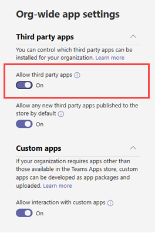

# 资源特定的许可Microsoft Teams

[!INCLUDE [preview-feature](includes/preview-feature.md)]

团队所有者允许团队所有者Microsoft Teams应用程序访问团队数据。 此类访问的示例包括读取通道消息、创建和删除通道以及创建和删除通道选项卡的功能。

作为管理员，你可以控制你的组织中团队所有者是否可以通过使用 Azure Active Directory (Azure AD) PowerShell 模块或 Azure 门户和 Microsoft Teams 管理中心配置的设置来表示同意。  

## 设置团队所有者是否可以许可应用

下面是必须设置的设置，用于控制团队所有者是否可以许可应用。 请务必查看以下所有设置。

### 设置 Azure AD 中的应用

以下两个设置确定团队所有者是否可以许可应用。

> [!IMPORTANT]
> 更改这些设置中的任一设置不会影响已授予许可的应用的数据访问。 例如，如果将这些设置配置为防止团队所有者同意，这些更改不会删除已授予的数据访问权限。

#### "用户可以同意应用代表他们访问公司数据"设置

此设置控制您的组织中的用户是否可以代表他们许可应用。 若要使团队所有者能够表示同意，必须将此设置设置为"**是"。** 若要管理此设置，请执行下列操作：

1. 在 Azure 门户中，转到 **"Enterprise应用程序**  >  **用户设置"。**
2. 在 **Enterprise应用程序"** 下，将"用户可以代表他们同意访问公司数据的应用"设置为 **"否"** 或 **"****是"。**

也可使用 PowerShell 管理此设置。 有关详细信息，请参阅 [将用户内容配置为应用程序](/azure/active-directory/manage-apps/configure-user-consent#configure-user-consent-to-applications)。

#### "EnableGroupSpecificConsent"设置

此设置控制您的组织中的用户是否可以同意应用访问他们拥有组的公司数据。 必须启用此设置，团队所有者才能表示同意。 有关如何使用 PowerShell 管理此设置的步骤，请参阅 [配置组所有者对访问组数据的应用的同意](/azure/active-directory/manage-apps/configure-user-consent#configure-group-owner-consent-to-apps-accessing-group-data)。

### 设置管理Microsoft Teams中

除了 Azure AD 中的设置外，"管理应用"页上的"组织范围"应用设置、在"管理应用"页上是阻止还是允许应用，以及分配给团队所有者的应用权限策略决定了团队所有者是否可以同意。 

> [!IMPORTANT]
> 更改这些设置中的任一设置不会影响已授予许可的应用的数据访问。 例如，如果在组织范围内禁用第三方应用，或者阻止特定应用以防止团队所有者同意，这些更改不会删除已授予的数据访问权限。  

#### 组织范围应用设置中的"允许第三方应用"设置

此组织范围内的应用设置控制组织中的用户是否可以使用第三方应用。 必须启用此设置，团队所有者才能表示同意。 若要管理此设置，请执行下列操作：

1. 在管理中心的左侧导航Microsoft Teams，转到"管理Teams **应用**"，然后单击"  >  **组织范围的应用设置"。**
2. 在 **"第三方应用"** 下，关闭或打开"**允许第三方应用"。**

    

最长可能需要等待 24 小时，更改才会生效。

#### 在组织级别允许或阻止应用

在"管理应用"页面上阻止或允许应用时，将阻止或允许组织中所有用户使用该应用。 只有在允许应用的情况下，团队所有者才能许可应用。 若要在组织级别允许或阻止应用，请执行下列操作：

1. 在 Microsoft Teams 管理中心的左侧导航中，转到“**Teams 应用**” > “**管理应用**”。
2. 在"管理应用"页面上，选择应用，然后单击"阻止"以阻止它 **或单击"** 允许"以允许它。

    

#### 分配给团队所有者的应用权限策略

团队所有者只能同意应用其应用权限策略允许其运行。 若要查看和管理分配给团队所有者的应用权限策略，请执行下列操作：

1. 在管理中心左侧导航Microsoft Teams，转到"用户 **"。**
2. 双击团队所有者显示名称，然后单击"策略 **"。**
3. 分配给团队所有者的策略列在"应用权限 **策略"下**。
    - 若要分配其他策略，请单击" **编辑**"，然后选择要分配的策略。
    - 若要编辑分配给团队所有者的策略设置，请单击策略名称，然后进行您需要的更改。  

## 上传自定义应用

上传自定义应用 (使用特定于资源) 的旁加载应用时，应用必须来自它要安装到的租户。 换句话说，Azure AD 应用注册必须来自此租户。 全局管理员不受此限制，可以直接将自定义应用从任何租户上传到团队 (旁加载) 或租户应用目录。

## 相关主题

- [可用的 RSC 权限](/microsoftteams/platform/graph-api/rsc/resource-specific-consent)
- [Microsoft Graph](https://developer.microsoft.com/graph)
- [在管理中心内Microsoft Teams应用](manage-apps.md)
- [在 Teams 中管理应用权限策略](teams-app-permission-policies.md)