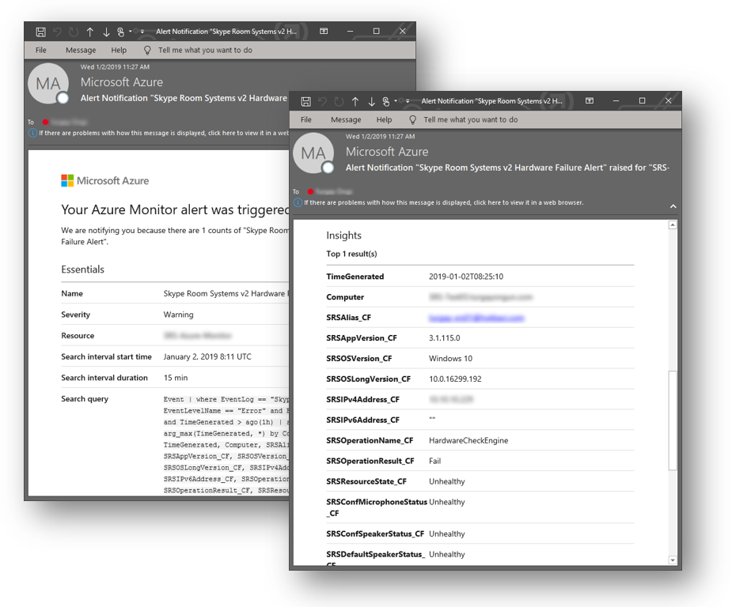

# <a name="deploy-microsoft-teams-rooms-management-with-azure-monitor"></a><span data-ttu-id="6cdc2-103">通过 Azure 监视器部署 Microsoft 团队聊天室管理</span><span class="sxs-lookup"><span data-stu-id="6cdc2-103">Deploy Microsoft Teams Rooms management with Azure Monitor</span></span>

<span data-ttu-id="6cdc2-104">本文介绍如何使用 Azure 监视器设置和部署 Microsoft 团队聊天室设备的集成端到端管理。</span><span class="sxs-lookup"><span data-stu-id="6cdc2-104">This article discusses how to set up and deploy integrated, end-to-end management of Microsoft Teams Rooms devices by using Azure Monitor.</span></span>

<span data-ttu-id="6cdc2-105">你可以在 Azure 监视器中配置日志分析, 以提供可帮助你管理 Microsoft 团队聊天室设备的基本遥测和警报。</span><span class="sxs-lookup"><span data-stu-id="6cdc2-105">You can configure Log Analytics within Azure Monitor to provide basic telemetry and alerts that will help you manage Microsoft Teams Rooms meeting room devices.</span></span> <span data-ttu-id="6cdc2-106">随着管理解决方案的成熟, 你可能会决定部署其他数据和管理功能来创建更详细的设备可用性和性能视图。</span><span class="sxs-lookup"><span data-stu-id="6cdc2-106">As your management solution matures, you might decide to deploy additional data and management capabilities to create a more detailed view of device availability and performance.</span></span>

<span data-ttu-id="6cdc2-107">通过遵循本指南, 你可以使用仪表板 (如以下示例) 获取有关设备可用性、应用程序和硬件运行状况以及 Microsoft 团队聊天室应用程序和操作系统版本分发的详细状态报告。</span><span class="sxs-lookup"><span data-stu-id="6cdc2-107">By following this guide, you can use a dashboard like the following example to get detailed status reporting for device availability, application and hardware health, and Microsoft Teams Rooms application and operating system version distribution.</span></span>

<span data-ttu-id="6cdc2-108"></span><span class="sxs-lookup"><span data-stu-id="6cdc2-108"></span></span>

<span data-ttu-id="6cdc2-109">你需要在高级别执行以下任务：</span><span class="sxs-lookup"><span data-stu-id="6cdc2-109">At a high level, you need to perform the following tasks:</span></span>


1.  [<span data-ttu-id="6cdc2-110">验证 Log Analytics 配置</span><span class="sxs-lookup"><span data-stu-id="6cdc2-110">Validate Log Analytics configuration</span></span>](azure-monitor-deploy.md#validate_LogAnalytics)
2.  [<span data-ttu-id="6cdc2-111">配置日志分析管理设置的测试设备</span><span class="sxs-lookup"><span data-stu-id="6cdc2-111">Configure test devices for Log Analytics management setup</span></span>](azure-monitor-deploy.md#configure_test_devices)
3.  [<span data-ttu-id="6cdc2-112">映射自定义字段</span><span class="sxs-lookup"><span data-stu-id="6cdc2-112">Map custom fields</span></span>](azure-monitor-deploy.md#Custom_fields)
4.  [<span data-ttu-id="6cdc2-113">在日志分析中定义 Microsoft 团队聊天室视图</span><span class="sxs-lookup"><span data-stu-id="6cdc2-113">Define the Microsoft Teams Rooms views in Log Analytics</span></span>](azure-monitor-deploy.md#Define_Views)
5.  [<span data-ttu-id="6cdc2-114">定义警报</span><span class="sxs-lookup"><span data-stu-id="6cdc2-114">Define alerts</span></span>](azure-monitor-deploy.md#Alerts)
6.  [<span data-ttu-id="6cdc2-115">配置用于监视的所有设备</span><span class="sxs-lookup"><span data-stu-id="6cdc2-115">Configure all devices for Monitoring</span></span>](azure-monitor-deploy.md#configure_all_devices)
7.  [<span data-ttu-id="6cdc2-116">配置其他 Azure 监视器解决方案</span><span class="sxs-lookup"><span data-stu-id="6cdc2-116">Configure additional Azure Monitor solutions</span></span>](azure-monitor-deploy.md#Solutions)

> [!IMPORTANT]
> <span data-ttu-id="6cdc2-117">尽管使用最少的配置, Azure 监视器日志分析可以监视运行 Windows 操作系统的计算机, 但仍有一些 Microsoft 团队聊天室-在开始向所有 Microsoft 团队部署代理之前需要执行的特定步骤会议室设备。</span><span class="sxs-lookup"><span data-stu-id="6cdc2-117">Although with minimal configuration, Azure Monitor Log Analytics can monitor a computer running a Windows operating system, there are still some Microsoft Teams Rooms–specific steps that you need to take before you start deploying agents to all Microsoft Teams Rooms devices.</span></span>
> <span data-ttu-id="6cdc2-118">因此, 我们强烈建议你按照正确的顺序执行所有配置步骤, 以进行受控设置和配置。</span><span class="sxs-lookup"><span data-stu-id="6cdc2-118">Therefore, we highly recommend you perform all configuration steps in the right order for a controlled setup and configuration.</span></span> <span data-ttu-id="6cdc2-119">最终结果的质量非常多取决于初始配置的质量。</span><span class="sxs-lookup"><span data-stu-id="6cdc2-119">The quality of the end result very much depends on the quality of the initial configuration.</span></span>

## <a name="validate-log-analytics-configuration"></a><span data-ttu-id="6cdc2-120">验证 Log Analytics 配置</span><span class="sxs-lookup"><span data-stu-id="6cdc2-120">Validate Log Analytics configuration</span></span>
<span data-ttu-id="6cdc2-121"><a name="validate_LogAnalytics"> </a></span><span class="sxs-lookup"><span data-stu-id="6cdc2-121"></span></span>

<span data-ttu-id="6cdc2-122">你需要具有 Log Analytics 工作区才能开始从 Microsoft 团队聊天室设备收集日志。</span><span class="sxs-lookup"><span data-stu-id="6cdc2-122">You need to have a Log Analytics workspace to start collecting logs from Microsoft Teams Rooms devices.</span></span> <span data-ttu-id="6cdc2-123">工作区是具有自己的数据存储库、数据源和解决方案的唯一日志分析环境。</span><span class="sxs-lookup"><span data-stu-id="6cdc2-123">A workspace is a unique Log Analytics environment with its own data repository, data sources, and solutions.</span></span> <span data-ttu-id="6cdc2-124">如果你已有一个现有的 Log Analytics 工作区, 则可以使用它监视你的 Microsoft 团队会议室部署, 或者, 你可以创建特定于你的 Microsoft 团队聊天室监视需求的专用 Log Analytics 工作区。</span><span class="sxs-lookup"><span data-stu-id="6cdc2-124">If you already have an existing Log Analytics workspace, you might use it to monitor your Microsoft Teams Rooms deployment or alternatively, you can create a dedicated Log Analytics workspace specific to your Microsoft Teams Rooms monitoring needs.</span></span>

<span data-ttu-id="6cdc2-125">如果需要创建新的 Log Analytics 工作区, 请按照文章在[Azure 门户中创建 Log Analytics 工作区](https://docs.microsoft.com/azure/azure-monitor/learn/quick-create-workspace)中的说明进行操作</span><span class="sxs-lookup"><span data-stu-id="6cdc2-125">If you need to create a new Log Analytics workspace, follow the instructions in the article [Create a Log Analytics workspace in the Azure portal](https://docs.microsoft.com/azure/azure-monitor/learn/quick-create-workspace)</span></span>

> [!NOTE]
> <span data-ttu-id="6cdc2-126">若要对 Azure 监视器使用日志分析, 你需要具有活动的 Azure 订阅。</span><span class="sxs-lookup"><span data-stu-id="6cdc2-126">To use Log Analytics with Azure Monitor, you need to have an active Azure subscription.</span></span> <span data-ttu-id="6cdc2-127">如果您没有 Azure 订阅, 您可以创建[一个免费试用订阅](https://azure.microsoft.com/free)作为起始点。</span><span class="sxs-lookup"><span data-stu-id="6cdc2-127">If you don’t have an Azure subscription, you can create [a free trial subscription](https://azure.microsoft.com/free) as a starting point.</span></span>

### <a name="configure-log-analytics-to-collect-microsoft-teams-rooms-event-logs"></a><span data-ttu-id="6cdc2-128">配置日志分析以收集 Microsoft 团队聊天室事件日志</span><span class="sxs-lookup"><span data-stu-id="6cdc2-128">Configure Log Analytics to collect Microsoft Teams Rooms event logs</span></span>

<span data-ttu-id="6cdc2-129">日志分析仅收集在设置中指定的 Windows 事件日志中的事件。</span><span class="sxs-lookup"><span data-stu-id="6cdc2-129">Log Analytics only collects events from the Windows event logs that are specified in the settings.</span></span> <span data-ttu-id="6cdc2-130">对于每个日志, 仅收集具有选定严重性的事件。</span><span class="sxs-lookup"><span data-stu-id="6cdc2-130">For each log, only the events with the selected severities are collected.</span></span>

<span data-ttu-id="6cdc2-131">你需要配置日志分析以收集监视 Microsoft 团队聊天室设备和应用程序状态所需的日志。</span><span class="sxs-lookup"><span data-stu-id="6cdc2-131">You need to configure Log Analytics to collect the logs required to monitor Microsoft Teams Rooms device and application status.</span></span> <span data-ttu-id="6cdc2-132">Microsoft 团队会议室设备使用**Skype 会议室系统**事件日志。</span><span class="sxs-lookup"><span data-stu-id="6cdc2-132">Microsoft Teams Rooms devices use the **Skype Room System** event log.</span></span>

<span data-ttu-id="6cdc2-133">若要配置日志分析以收集 Microsoft 团队聊天室事件, 请参阅[Azure 监视器中的 Windows 事件日志数据源](https://docs.microsoft.com/azure/azure-monitor/platform/data-sources-windows-events)</span><span class="sxs-lookup"><span data-stu-id="6cdc2-133">To configure Log Analytics to collect the Microsoft Teams Rooms events, see [Windows event log data sources in Azure Monitor](https://docs.microsoft.com/azure/azure-monitor/platform/data-sources-windows-events)</span></span>

<span data-ttu-id="6cdc2-134"></span><span class="sxs-lookup"><span data-stu-id="6cdc2-134"></span></span>

> [!IMPORTANT]
> <span data-ttu-id="6cdc2-135">配置 Windows 事件日志设置并输入作为事件日志名称的**Skype 会议室系统**, 然后选中 "**错误**"、"**警告**" 和 "**信息**" 复选框。</span><span class="sxs-lookup"><span data-stu-id="6cdc2-135">Configure Windows Event Log settings and enter **Skype Room System** as event log name, and then select the **Error**, **Warning**, and **Information** check boxes.</span></span>

## <a name="configure-test-devices-for-azure-monitoring"></a><span data-ttu-id="6cdc2-136">配置用于 Azure 监视的测试设备</span><span class="sxs-lookup"><span data-stu-id="6cdc2-136">Configure test devices for Azure Monitoring</span></span>
<span data-ttu-id="6cdc2-137"><a name="configure_test_devices"> </a></span><span class="sxs-lookup"><span data-stu-id="6cdc2-137"></span></span>

<span data-ttu-id="6cdc2-138">你需要准备日志分析, 以便能够监视 Microsoft 团队聊天室-相关事件。</span><span class="sxs-lookup"><span data-stu-id="6cdc2-138">You need to prepare Log Analytics to be able to monitor Microsoft Teams Rooms–related events.</span></span> <span data-ttu-id="6cdc2-139">首先, 你需要将 Microsoft Monitoring agent 部署到你具有物理访问权限的一个或两个 Microsoft 团队聊天室设备, 并且让这些测试设备生成一些数据并将其推送到 Log Analytics 工作区。</span><span class="sxs-lookup"><span data-stu-id="6cdc2-139">To start with, you need to deploy Microsoft Monitoring agents to just one or two Microsoft Teams Rooms devices that you have physical access to, and get those test devices generate some data and push it to the Log Analytics workspace.</span></span>

### <a name="install-microsoft-monitoring-agents-to-test-devices"></a><span data-ttu-id="6cdc2-140">安装 Microsoft Monitoring agent 以测试设备</span><span class="sxs-lookup"><span data-stu-id="6cdc2-140">Install Microsoft Monitoring agents to test devices</span></span>

<span data-ttu-id="6cdc2-141">通过使用[将 Windows 计算机连接到 Azure 中的 Log Analytics 服务](https://docs.microsoft.com/azure/azure-monitor/platform/agent-windows)中提供的说明, 将 Microsoft Monitoring agent 部署到测试设备。</span><span class="sxs-lookup"><span data-stu-id="6cdc2-141">Deploy the Microsoft Monitoring agent to the test devices by using the instructions provided in [Connect Windows computers to the Log Analytics service in Azure](https://docs.microsoft.com/azure/azure-monitor/platform/agent-windows).</span></span> <span data-ttu-id="6cdc2-142">本文提供有关为 Windows 部署 Microsoft Monitoring Agent 的步骤的详细信息, 获取用于获取连接到的 Microsoft 团队聊天室设备的 Log Analytics***工作区 ID***和***主密钥***的说明你的 Azure 监视器部署和验证代理连接到 Log Analytics 实例的步骤。</span><span class="sxs-lookup"><span data-stu-id="6cdc2-142">This article provides detailed information about the steps for deploying Microsoft Monitoring Agent for Windows, instructions for obtaining the Log Analytics ***Workspace ID*** and the ***primary key*** to get Microsoft Teams Rooms devices connected to your Azure Monitor deployment, and steps to verify agent connectivity to Log Analytics instance.</span></span>

### <a name="generate-sample-microsoft-teams-rooms-events"></a><span data-ttu-id="6cdc2-143">生成 Microsoft 团队会议室事件示例</span><span class="sxs-lookup"><span data-stu-id="6cdc2-143">Generate sample Microsoft Teams Rooms events</span></span>

<span data-ttu-id="6cdc2-144">将 Microsoft Monitoring agent 部署到测试设备后, 请验证 Azure 监视器是否收集了所需的事件日志数据。</span><span class="sxs-lookup"><span data-stu-id="6cdc2-144">After the Microsoft Monitoring agent is deployed onto the test devices, verify that the required event log data is collected by Azure Monitor.</span></span>

> [!NOTE]
> <span data-ttu-id="6cdc2-145">在安装 Microsoft Monitoring agent 后重新启动设备, 并确保 Microsoft 团队聊天室会议应用已启动, 以便它可以在事件日志中生成新事件。</span><span class="sxs-lookup"><span data-stu-id="6cdc2-145">Reboot the device after the installation of the Microsoft Monitoring agent, and make sure that Microsoft Teams Rooms Meeting app is started, so that it can generate new events into the Event Log.</span></span>

1.  <span data-ttu-id="6cdc2-146">登录到[Microsoft Azure 门户](https://portal.azure.com)并转到日志分析并选择你的工作区。</span><span class="sxs-lookup"><span data-stu-id="6cdc2-146">Sign in to the [Microsoft Azure portal](https://portal.azure.com) and go to Log Analytics and select your workspace.</span></span>

2.  <span data-ttu-id="6cdc2-147">列出由 Microsoft 团队聊天室设备生成的检测信号事件:</span><span class="sxs-lookup"><span data-stu-id="6cdc2-147">List the heartbeat events generated by a Microsoft Teams Rooms device:</span></span>
    1.  <span data-ttu-id="6cdc2-148">选择您的工作区并转到 "**日志**" 并使用查询来检索将具有 Microsoft 团队聊天室的自定义域的检测信号记录。</span><span class="sxs-lookup"><span data-stu-id="6cdc2-148">Select your workspace and go to **Logs** and use a query to retrieve the heartbeat records that will have the custom fields for Microsoft Teams Rooms.</span></span>
    2.  <span data-ttu-id="6cdc2-149">示例查询:`Event | where Source == "SRS-App" and EventID == 2000`</span><span class="sxs-lookup"><span data-stu-id="6cdc2-149">Sample query: `Event | where Source == "SRS-App" and EventID == 2000`</span></span>

3.  <span data-ttu-id="6cdc2-150">请确保查询返回包含由 Microsoft 团队聊天室会议应用生成的事件的日志记录。</span><span class="sxs-lookup"><span data-stu-id="6cdc2-150">Make sure that the query returns log records that include events generated by the Microsoft Teams Rooms meetings app.</span></span>

4.  <span data-ttu-id="6cdc2-151">生成硬件问题, 并验证是否在 Azure 日志分析中记录所需的事件。</span><span class="sxs-lookup"><span data-stu-id="6cdc2-151">Generate a hardware issue, and validate that the required events are logged in Azure Log Analytics.</span></span>
    1.  <span data-ttu-id="6cdc2-152">拔掉测试 Microsoft 团队聊天室系统上的其中一个外围设备。</span><span class="sxs-lookup"><span data-stu-id="6cdc2-152">Unplug one of the peripheral devices on the test Microsoft Teams Rooms system.</span></span> <span data-ttu-id="6cdc2-153">这可能是相机、话筒、麦克风或前置房间显示</span><span class="sxs-lookup"><span data-stu-id="6cdc2-153">This could be the camera, speakerphone, microphone, or Front Room Display</span></span>
    2.  <span data-ttu-id="6cdc2-154">等待10分钟, 以便在 Azure 日志分析中填充事件日志。</span><span class="sxs-lookup"><span data-stu-id="6cdc2-154">Wait 10 minutes for the event log to be populated in Azure Log Analytics.</span></span>
    3.  <span data-ttu-id="6cdc2-155">使用查询列出硬件错误事件:`Event | where Source == "SRS-App" and EventID == 3001`</span><span class="sxs-lookup"><span data-stu-id="6cdc2-155">Use a query to list hardware error events: `Event | where Source == "SRS-App" and EventID == 3001`</span></span>

5.  <span data-ttu-id="6cdc2-156">生成应用程序问题, 并验证是否已记录所需的事件。</span><span class="sxs-lookup"><span data-stu-id="6cdc2-156">Generate an application issue, and validate that the required events are logged.</span></span>
    1.  <span data-ttu-id="6cdc2-157">修改 Microsoft "团队聊天室应用程序配置", 然后键入不正确的会话初始协议 (SIP) 地址/密码对。</span><span class="sxs-lookup"><span data-stu-id="6cdc2-157">Modify Microsoft Teams Rooms application configuration, and type an incorrect Session Initiation Protocol (SIP) address/password pair.</span></span>
    2.  <span data-ttu-id="6cdc2-158">等待10分钟, 以便在 Azure 日志分析中填充事件日志。</span><span class="sxs-lookup"><span data-stu-id="6cdc2-158">Wait 10 minutes for the event log to be populated in Azure Log Analytics.</span></span>
    3.  <span data-ttu-id="6cdc2-159">使用查询列出应用程序错误事件:`Event | where Source == "SRS-App" and EventID == 2001 and EventLevel == 1`</span><span class="sxs-lookup"><span data-stu-id="6cdc2-159">Use a query to list application error events: `Event | where Source == "SRS-App" and EventID == 2001 and EventLevel == 1`</span></span>

> [!IMPORTANT]
> <span data-ttu-id="6cdc2-160">在可以配置自定义字段之前, 需要这些示例事件日志。</span><span class="sxs-lookup"><span data-stu-id="6cdc2-160">These sample event logs are required before custom fields can be configured.</span></span> <span data-ttu-id="6cdc2-161">不要继续执行下一步操作, 直到收集了所需的事件日志。</span><span class="sxs-lookup"><span data-stu-id="6cdc2-161">Don’t proceed to the next step until you have collected the required event logs.</span></span>

## <a name="map-custom-fields"></a><span data-ttu-id="6cdc2-162">映射自定义字段</span><span class="sxs-lookup"><span data-stu-id="6cdc2-162">Map custom fields</span></span>
<span data-ttu-id="6cdc2-163"><a name="Custom_fields"> </a></span><span class="sxs-lookup"><span data-stu-id="6cdc2-163"></span></span>

<span data-ttu-id="6cdc2-164">使用自定义域从事件日志中提取特定数据。</span><span class="sxs-lookup"><span data-stu-id="6cdc2-164">You use custom fields to extract specific data from the event logs.</span></span> <span data-ttu-id="6cdc2-165">你需要定义稍后将用于你的磁贴、仪表板视图和通知的自定义字段。</span><span class="sxs-lookup"><span data-stu-id="6cdc2-165">You need to define custom fields that will be used later with your tiles, dashboard views, and alerts.</span></span> <span data-ttu-id="6cdc2-166">查看[日志分析中的自定义字段](https://docs.microsoft.com/azure/azure-monitor/platform/custom-fields), 并熟悉概念, 然后再开始创建自定义字段。</span><span class="sxs-lookup"><span data-stu-id="6cdc2-166">See [Custom fields in Log Analytics](https://docs.microsoft.com/azure/azure-monitor/platform/custom-fields) and become familiar with the concepts before you start creating your custom fields.</span></span>

<span data-ttu-id="6cdc2-167">若要从捕获的事件日志中提取自定义域, 请按照下列步骤操作:</span><span class="sxs-lookup"><span data-stu-id="6cdc2-167">To extract your custom fields out of the captured event logs, follow these steps:</span></span>

1.  <span data-ttu-id="6cdc2-168">登录到[Microsoft Azure 门户](https://portal.azure.com)并转到日志分析并选择你的工作区。</span><span class="sxs-lookup"><span data-stu-id="6cdc2-168">Sign in to the [Microsoft Azure portal](https://portal.azure.com) and go to Log Analytics and select your workspace.</span></span>

2. <span data-ttu-id="6cdc2-169">列出由 Microsoft 团队聊天室设备生成的事件:</span><span class="sxs-lookup"><span data-stu-id="6cdc2-169">List the events generated by a Microsoft Teams Rooms device:</span></span>
   1.  <span data-ttu-id="6cdc2-170">转到 "**日志**" 并使用查询检索将具有自定义字段的记录。</span><span class="sxs-lookup"><span data-stu-id="6cdc2-170">Go to **Logs** and use a query to retrieve the records that will have the custom field.</span></span>
   2.  <span data-ttu-id="6cdc2-171">示例查询:`Event | where Source == "SRS-App" and EventID == 2000`</span><span class="sxs-lookup"><span data-stu-id="6cdc2-171">Sample query: `Event | where Source == "SRS-App" and EventID == 2000`</span></span>

3. <span data-ttu-id="6cdc2-172">选择其中一个记录, 选择左侧的按钮, 然后启动 "字段提取向导"。</span><span class="sxs-lookup"><span data-stu-id="6cdc2-172">Select one of the records, select the button to the left, and start the field extraction wizard.</span></span>
4. <span data-ttu-id="6cdc2-173">突出显示要从 RenderedDescription 中提取的数据, 并提供字段标题。</span><span class="sxs-lookup"><span data-stu-id="6cdc2-173">Highlight the data you’d like to extract from the RenderedDescription and provide a Field Title.</span></span> <span data-ttu-id="6cdc2-174">表1中提供了应使用的字段名称。</span><span class="sxs-lookup"><span data-stu-id="6cdc2-174">The field names that you should use are provided in Table 1.</span></span>

   <span data-ttu-id="6cdc2-175"></span><span class="sxs-lookup"><span data-stu-id="6cdc2-175"></span></span>

5. <span data-ttu-id="6cdc2-176">使用*表 1*中所示的映射。</span><span class="sxs-lookup"><span data-stu-id="6cdc2-176">Use the mappings shown in *Table 1*.</span></span> <span data-ttu-id="6cdc2-177">当您定义新字段时, 日志分析将自动追加\*\* \_CF\*\*字符串。</span><span class="sxs-lookup"><span data-stu-id="6cdc2-177">Log Analytics will automatically append the **\_CF** string when you define the new field.</span></span>

> [!IMPORTANT]
> <span data-ttu-id="6cdc2-178">请记住, 所有 JSON 和 Log Analytics 字段都区分大小写。</span><span class="sxs-lookup"><span data-stu-id="6cdc2-178">Remember that all JSON and Log Analytics fields are case-sensitive.</span></span>
> 
> <span data-ttu-id="6cdc2-179">请注意下表中每个自定义域所需的查询。</span><span class="sxs-lookup"><span data-stu-id="6cdc2-179">Pay attention to the queries required for each custom field in the table below.</span></span> <span data-ttu-id="6cdc2-180">需要使用正确的日志分析查询才能成功提取自定义域值。</span><span class="sxs-lookup"><span data-stu-id="6cdc2-180">You need to use the correct queries for Log Analytics to successfully extract custom field values.</span></span>
> 
 <span data-ttu-id="6cdc2-181"></span><span class="sxs-lookup"><span data-stu-id="6cdc2-181"></span></span>

<span data-ttu-id="6cdc2-182">**表1**</span><span class="sxs-lookup"><span data-stu-id="6cdc2-182">**Table 1**</span></span>

| <span data-ttu-id="6cdc2-183">**JSON 字段**</span><span class="sxs-lookup"><span data-stu-id="6cdc2-183">**JSON field**</span></span>                   | <span data-ttu-id="6cdc2-184">**日志分析自定义字段**</span><span class="sxs-lookup"><span data-stu-id="6cdc2-184">**Log Analytics custom field**</span></span> | <span data-ttu-id="6cdc2-185">**事件 ID**</span><span class="sxs-lookup"><span data-stu-id="6cdc2-185">**Event ID**</span></span> | <span data-ttu-id="6cdc2-186">**要与提取一起使用的查询**</span><span class="sxs-lookup"><span data-stu-id="6cdc2-186">**Query to use with the extraction**</span></span>                   |
|:---------------------------------|:-------------------------------|:-------------|:-------------------------------------------------------|
| <span data-ttu-id="6cdc2-187">说明</span><span class="sxs-lookup"><span data-stu-id="6cdc2-187">Description</span></span>                      | <span data-ttu-id="6cdc2-188">SRSEventDescription</span><span class="sxs-lookup"><span data-stu-id="6cdc2-188">SRSEventDescription</span></span>         | <span data-ttu-id="6cdc2-189">**2000**</span><span class="sxs-lookup"><span data-stu-id="6cdc2-189">**2000**</span></span>     | <span data-ttu-id="6cdc2-190">源\| = = "SRS-App" 和 EventID = = 2000 的事件</span><span class="sxs-lookup"><span data-stu-id="6cdc2-190">Event \| where Source == "SRS-App" and EventID == 2000</span></span> |
| <span data-ttu-id="6cdc2-191">ResourceState</span><span class="sxs-lookup"><span data-stu-id="6cdc2-191">ResourceState</span></span>                    | <span data-ttu-id="6cdc2-192">SRSResourceState</span><span class="sxs-lookup"><span data-stu-id="6cdc2-192">SRSResourceState</span></span>            | <span data-ttu-id="6cdc2-193">**2000**</span><span class="sxs-lookup"><span data-stu-id="6cdc2-193">**2000**</span></span>     | <span data-ttu-id="6cdc2-194">源\| = = "SRS-App" 和 EventID = = 2000 的事件</span><span class="sxs-lookup"><span data-stu-id="6cdc2-194">Event \| where Source == "SRS-App" and EventID == 2000</span></span> |
| <span data-ttu-id="6cdc2-195">OperationName</span><span class="sxs-lookup"><span data-stu-id="6cdc2-195">OperationName</span></span>                    | <span data-ttu-id="6cdc2-196">SRSOperationName</span><span class="sxs-lookup"><span data-stu-id="6cdc2-196">SRSOperationName</span></span>            | <span data-ttu-id="6cdc2-197">**2000**</span><span class="sxs-lookup"><span data-stu-id="6cdc2-197">**2000**</span></span>     | <span data-ttu-id="6cdc2-198">源\| = = "SRS-App" 和 EventID = = 2000 的事件</span><span class="sxs-lookup"><span data-stu-id="6cdc2-198">Event \| where Source == "SRS-App" and EventID == 2000</span></span> |
| <span data-ttu-id="6cdc2-199">OperationResult</span><span class="sxs-lookup"><span data-stu-id="6cdc2-199">OperationResult</span></span>                  | <span data-ttu-id="6cdc2-200">SRSOperationResult</span><span class="sxs-lookup"><span data-stu-id="6cdc2-200">SRSOperationResult</span></span>          | <span data-ttu-id="6cdc2-201">**2000**</span><span class="sxs-lookup"><span data-stu-id="6cdc2-201">**2000**</span></span>     | <span data-ttu-id="6cdc2-202">源\| = = "SRS-App" 和 EventID = = 2000 的事件</span><span class="sxs-lookup"><span data-stu-id="6cdc2-202">Event \| where Source == "SRS-App" and EventID == 2000</span></span> |
| <span data-ttu-id="6cdc2-203">OS</span><span class="sxs-lookup"><span data-stu-id="6cdc2-203">OS</span></span>                               | <span data-ttu-id="6cdc2-204">SRSOSVersion</span><span class="sxs-lookup"><span data-stu-id="6cdc2-204">SRSOSVersion</span></span>                | <span data-ttu-id="6cdc2-205">**2000**</span><span class="sxs-lookup"><span data-stu-id="6cdc2-205">**2000**</span></span>     | <span data-ttu-id="6cdc2-206">源\| = = "SRS-App" 和 EventID = = 2000 的事件</span><span class="sxs-lookup"><span data-stu-id="6cdc2-206">Event \| where Source == "SRS-App" and EventID == 2000</span></span> |
| <span data-ttu-id="6cdc2-207">OSVersion</span><span class="sxs-lookup"><span data-stu-id="6cdc2-207">OSVersion</span></span>                        | <span data-ttu-id="6cdc2-208">SRSOSLongVersion</span><span class="sxs-lookup"><span data-stu-id="6cdc2-208">SRSOSLongVersion</span></span>            | <span data-ttu-id="6cdc2-209">**2000**</span><span class="sxs-lookup"><span data-stu-id="6cdc2-209">**2000**</span></span>     | <span data-ttu-id="6cdc2-210">源\| = = "SRS-App" 和 EventID = = 2000 的事件</span><span class="sxs-lookup"><span data-stu-id="6cdc2-210">Event \| where Source == "SRS-App" and EventID == 2000</span></span> |
| <span data-ttu-id="6cdc2-211">别名</span><span class="sxs-lookup"><span data-stu-id="6cdc2-211">Alias</span></span>                            | <span data-ttu-id="6cdc2-212">SRSAlias</span><span class="sxs-lookup"><span data-stu-id="6cdc2-212">SRSAlias</span></span>                    | <span data-ttu-id="6cdc2-213">**2000**</span><span class="sxs-lookup"><span data-stu-id="6cdc2-213">**2000**</span></span>     | <span data-ttu-id="6cdc2-214">源\| = = "SRS-App" 和 EventID = = 2000 的事件</span><span class="sxs-lookup"><span data-stu-id="6cdc2-214">Event \| where Source == "SRS-App" and EventID == 2000</span></span> |
| <span data-ttu-id="6cdc2-215">DisplayName</span><span class="sxs-lookup"><span data-stu-id="6cdc2-215">DisplayName</span></span>                      | <span data-ttu-id="6cdc2-216">SRSDisplayName</span><span class="sxs-lookup"><span data-stu-id="6cdc2-216">SRSDisplayName</span></span>              | <span data-ttu-id="6cdc2-217">**2000**</span><span class="sxs-lookup"><span data-stu-id="6cdc2-217">**2000**</span></span>     | <span data-ttu-id="6cdc2-218">源\| = = "SRS-App" 和 EventID = = 2000 的事件</span><span class="sxs-lookup"><span data-stu-id="6cdc2-218">Event \| where Source == "SRS-App" and EventID == 2000</span></span> |
| <span data-ttu-id="6cdc2-219">AppVersion</span><span class="sxs-lookup"><span data-stu-id="6cdc2-219">AppVersion</span></span>                       | <span data-ttu-id="6cdc2-220">SRSAppVersion</span><span class="sxs-lookup"><span data-stu-id="6cdc2-220">SRSAppVersion</span></span>               | <span data-ttu-id="6cdc2-221">**2000**</span><span class="sxs-lookup"><span data-stu-id="6cdc2-221">**2000**</span></span>     | <span data-ttu-id="6cdc2-222">源\| = = "SRS-App" 和 EventID = = 2000 的事件</span><span class="sxs-lookup"><span data-stu-id="6cdc2-222">Event \| where Source == "SRS-App" and EventID == 2000</span></span> |
| <span data-ttu-id="6cdc2-223">IPv4Address</span><span class="sxs-lookup"><span data-stu-id="6cdc2-223">IPv4Address</span></span>                      | <span data-ttu-id="6cdc2-224">SRSIPv4Address</span><span class="sxs-lookup"><span data-stu-id="6cdc2-224">SRSIPv4Address</span></span>              | <span data-ttu-id="6cdc2-225">**2000**</span><span class="sxs-lookup"><span data-stu-id="6cdc2-225">**2000**</span></span>     | <span data-ttu-id="6cdc2-226">源\| = = "SRS-App" 和 EventID = = 2000 的事件</span><span class="sxs-lookup"><span data-stu-id="6cdc2-226">Event \| where Source == "SRS-App" and EventID == 2000</span></span> |
| <span data-ttu-id="6cdc2-227">IPv6Address</span><span class="sxs-lookup"><span data-stu-id="6cdc2-227">IPv6Address</span></span>                      | <span data-ttu-id="6cdc2-228">SRSIPv6Address</span><span class="sxs-lookup"><span data-stu-id="6cdc2-228">SRSIPv6Address</span></span>              | <span data-ttu-id="6cdc2-229">**2000**</span><span class="sxs-lookup"><span data-stu-id="6cdc2-229">**2000**</span></span>     | <span data-ttu-id="6cdc2-230">源\| = = "SRS-App" 和 EventID = = 2000 的事件</span><span class="sxs-lookup"><span data-stu-id="6cdc2-230">Event \| where Source == "SRS-App" and EventID == 2000</span></span> |
| <span data-ttu-id="6cdc2-231">会议麦克风状态</span><span class="sxs-lookup"><span data-stu-id="6cdc2-231">Conference Microphone status</span></span>     | <span data-ttu-id="6cdc2-232">SRSConfMicrophoneStatus</span><span class="sxs-lookup"><span data-stu-id="6cdc2-232">SRSConfMicrophoneStatus</span></span>     | <span data-ttu-id="6cdc2-233">**3001**</span><span class="sxs-lookup"><span data-stu-id="6cdc2-233">**3001**</span></span>     | <span data-ttu-id="6cdc2-234">源\| = = "SRS-App" 和 EventID = = 3001 的事件</span><span class="sxs-lookup"><span data-stu-id="6cdc2-234">Event \| where Source == "SRS-App" and EventID == 3001</span></span> |
| <span data-ttu-id="6cdc2-235">会议演讲者状态</span><span class="sxs-lookup"><span data-stu-id="6cdc2-235">Conference Speaker status</span></span>        | <span data-ttu-id="6cdc2-236">SRSConfSpeakerStatus</span><span class="sxs-lookup"><span data-stu-id="6cdc2-236">SRSConfSpeakerStatus</span></span>        | <span data-ttu-id="6cdc2-237">**3001**</span><span class="sxs-lookup"><span data-stu-id="6cdc2-237">**3001**</span></span>     | <span data-ttu-id="6cdc2-238">源\| = = "SRS-App" 和 EventID = = 3001 的事件</span><span class="sxs-lookup"><span data-stu-id="6cdc2-238">Event \| where Source == "SRS-App" and EventID == 3001</span></span> |
| <span data-ttu-id="6cdc2-239">默认扬声器状态</span><span class="sxs-lookup"><span data-stu-id="6cdc2-239">Default Speaker status</span></span>           | <span data-ttu-id="6cdc2-240">SRSDefaultSpeakerStatus</span><span class="sxs-lookup"><span data-stu-id="6cdc2-240">SRSDefaultSpeakerStatus</span></span>     | <span data-ttu-id="6cdc2-241">**3001**</span><span class="sxs-lookup"><span data-stu-id="6cdc2-241">**3001**</span></span>     | <span data-ttu-id="6cdc2-242">源\| = = "SRS-App" 和 EventID = = 3001 的事件</span><span class="sxs-lookup"><span data-stu-id="6cdc2-242">Event \| where Source == "SRS-App" and EventID == 3001</span></span> |
| <span data-ttu-id="6cdc2-243">相机状态</span><span class="sxs-lookup"><span data-stu-id="6cdc2-243">Camera status</span></span>                    | <span data-ttu-id="6cdc2-244">SRSCameraStatus</span><span class="sxs-lookup"><span data-stu-id="6cdc2-244">SRSCameraStatus</span></span>             | <span data-ttu-id="6cdc2-245">**3001**</span><span class="sxs-lookup"><span data-stu-id="6cdc2-245">**3001**</span></span>     | <span data-ttu-id="6cdc2-246">源\| = = "SRS-App" 和 EventID = = 3001 的事件</span><span class="sxs-lookup"><span data-stu-id="6cdc2-246">Event \| where Source == "SRS-App" and EventID == 3001</span></span> |
| <span data-ttu-id="6cdc2-247">房间前显示状态</span><span class="sxs-lookup"><span data-stu-id="6cdc2-247">Front of Room Display status</span></span>     | <span data-ttu-id="6cdc2-248">SRSFORDStatus</span><span class="sxs-lookup"><span data-stu-id="6cdc2-248">SRSFORDStatus</span></span>               | <span data-ttu-id="6cdc2-249">**3001**</span><span class="sxs-lookup"><span data-stu-id="6cdc2-249">**3001**</span></span>     | <span data-ttu-id="6cdc2-250">源\| = = "SRS-App" 和 EventID = = 3001 的事件</span><span class="sxs-lookup"><span data-stu-id="6cdc2-250">Event \| where Source == "SRS-App" and EventID == 3001</span></span> |
| <span data-ttu-id="6cdc2-251">运动传感器状态</span><span class="sxs-lookup"><span data-stu-id="6cdc2-251">Motion Sensor status</span></span>             | <span data-ttu-id="6cdc2-252">SRSMotionSensorStatus</span><span class="sxs-lookup"><span data-stu-id="6cdc2-252">SRSMotionSensorStatus</span></span>       | <span data-ttu-id="6cdc2-253">**3001**</span><span class="sxs-lookup"><span data-stu-id="6cdc2-253">**3001**</span></span>     | <span data-ttu-id="6cdc2-254">源\| = = "SRS-App" 和 EventID = = 3001 的事件</span><span class="sxs-lookup"><span data-stu-id="6cdc2-254">Event \| where Source == "SRS-App" and EventID == 3001</span></span> |
| <span data-ttu-id="6cdc2-255">HDMI 接收状态</span><span class="sxs-lookup"><span data-stu-id="6cdc2-255">HDMI Ingest status</span></span>               | <span data-ttu-id="6cdc2-256">SRSHDMIIngestStatus</span><span class="sxs-lookup"><span data-stu-id="6cdc2-256">SRSHDMIIngestStatus</span></span>         | <span data-ttu-id="6cdc2-257">**3001**</span><span class="sxs-lookup"><span data-stu-id="6cdc2-257">**3001**</span></span>     | <span data-ttu-id="6cdc2-258">源\| = = "SRS-App" 和 EventID = = 3001 的事件</span><span class="sxs-lookup"><span data-stu-id="6cdc2-258">Event \| where Source == "SRS-App" and EventID == 3001</span></span> |


## <a name="define-the-microsoft-teams-rooms-views-in-log-analytics"></a><span data-ttu-id="6cdc2-259">在日志分析中定义 Microsoft 团队聊天室视图</span><span class="sxs-lookup"><span data-stu-id="6cdc2-259">Define the Microsoft Teams Rooms views in Log Analytics</span></span>
<span data-ttu-id="6cdc2-260"><a name="Define_Views"> </a></span><span class="sxs-lookup"><span data-stu-id="6cdc2-260"></span></span>

<span data-ttu-id="6cdc2-261">收集数据并映射自定义字段后, 可以使用 "视图设计器" 开发包含各种磁贴的仪表板, 以监视 Microsoft 团队会议室事件。</span><span class="sxs-lookup"><span data-stu-id="6cdc2-261">After data is collected and custom fields are mapped, you can use View Designer to develop a dashboard containing various tiles to monitor Microsoft Teams Rooms events.</span></span> <span data-ttu-id="6cdc2-262">使用 "视图设计器" 创建以下图块。</span><span class="sxs-lookup"><span data-stu-id="6cdc2-262">Use View Designer to create the following tiles.</span></span> <span data-ttu-id="6cdc2-263">有关详细信息, 请参阅[使用日志分析中的视图设计器创建自定义视图](https://docs.microsoft.com/azure/azure-monitor/platform/view-designer)</span><span class="sxs-lookup"><span data-stu-id="6cdc2-263">For more information, see [Create custom views by using View Designer in Log Analytics](https://docs.microsoft.com/azure/azure-monitor/platform/view-designer)</span></span>

> [!NOTE]
> <span data-ttu-id="6cdc2-264">应完成本指南前面的步骤, 仪表板图块才能正常工作。</span><span class="sxs-lookup"><span data-stu-id="6cdc2-264">Previous steps in this guide should have been completed for the dashboard tiles to work properly.</span></span>

### <a name="create-a-microsoft-teams-rooms-dashboard-by-using-the-import-method"></a><span data-ttu-id="6cdc2-265">使用 import 方法创建 Microsoft 团队聊天室仪表板</span><span class="sxs-lookup"><span data-stu-id="6cdc2-265">Create a Microsoft Teams Rooms dashboard by using the import method</span></span>

<span data-ttu-id="6cdc2-266">你可以导入 Microsoft 团队聊天室仪表板, 并快速开始监视你的设备。</span><span class="sxs-lookup"><span data-stu-id="6cdc2-266">You can import an Microsoft Teams Rooms dashboard and start monitoring your devices quickly.</span></span> <span data-ttu-id="6cdc2-267">执行以下步骤导入仪表板:</span><span class="sxs-lookup"><span data-stu-id="6cdc2-267">Take the following steps to import the dashboard:</span></span>

1.  <span data-ttu-id="6cdc2-268">获取 omsview 仪表板文件[SkypeRoomSystems_v2](https://go.microsoft.com/fwlink/?linkid=835675) 。</span><span class="sxs-lookup"><span data-stu-id="6cdc2-268">Get the [SkypeRoomSystems_v2.omsview](https://go.microsoft.com/fwlink/?linkid=835675) dashboard file.</span></span>
2.  <span data-ttu-id="6cdc2-269">登录到[Microsoft Azure 门户](https://portal.azure.com)并转到日志分析并选择你的工作区。</span><span class="sxs-lookup"><span data-stu-id="6cdc2-269">Sign in to the [Microsoft Azure portal](https://portal.azure.com) and go to Log Analytics and select your workspace.</span></span>
3.  <span data-ttu-id="6cdc2-270">打开**视图设计器**。</span><span class="sxs-lookup"><span data-stu-id="6cdc2-270">Open **View Designer**.</span></span>
4.  <span data-ttu-id="6cdc2-271">选择 "**导入**", 然后选择 " **SkypeRoomSystems_v2** " 文件。</span><span class="sxs-lookup"><span data-stu-id="6cdc2-271">Select **Import**, and then select the **SkypeRoomSystems_v2.omsview** file.</span></span>
5.  <span data-ttu-id="6cdc2-272">选择 "**保存**"。</span><span class="sxs-lookup"><span data-stu-id="6cdc2-272">Select **Save**.</span></span>

### <a name="create-a-microsoft-teams-rooms-dashboard-manually"></a><span data-ttu-id="6cdc2-273">手动创建 Microsoft 团队聊天室仪表板</span><span class="sxs-lookup"><span data-stu-id="6cdc2-273">Create a Microsoft Teams Rooms dashboard manually</span></span>

<span data-ttu-id="6cdc2-274">或者, 你可以创建自己的仪表板并仅添加你希望监视的磁贴。</span><span class="sxs-lookup"><span data-stu-id="6cdc2-274">Alternatively, you can create your own dashboard and add only the tiles that you wish to monitor.</span></span>

#### <a name="configure-the-overview-tile"></a><span data-ttu-id="6cdc2-275">配置概述图块</span><span class="sxs-lookup"><span data-stu-id="6cdc2-275">Configure the Overview Tile</span></span>

1.  <span data-ttu-id="6cdc2-276">打开**视图设计器**。</span><span class="sxs-lookup"><span data-stu-id="6cdc2-276">Open **View Designer**.</span></span>
2.  <span data-ttu-id="6cdc2-277">选择 "**概述图块**", 然后从库中选择**两个数字**。</span><span class="sxs-lookup"><span data-stu-id="6cdc2-277">Select **Overview Tile**, and then select **Two numbers** from the gallery.</span></span>
3.  <span data-ttu-id="6cdc2-278">将磁贴命名为**Microsoft 团队聊天室**。</span><span class="sxs-lookup"><span data-stu-id="6cdc2-278">Name the tile **Microsoft Teams Rooms**.</span></span>
4.  <span data-ttu-id="6cdc2-279">定义**第一个图块**:</span><span class="sxs-lookup"><span data-stu-id="6cdc2-279">Define the **First Tile**:</span></span><br>
    <span data-ttu-id="6cdc2-280">**图例:** 在上个月内至少发送过一次检测信号的设备</span><span class="sxs-lookup"><span data-stu-id="6cdc2-280">**Legend:** Devices that sent a heartbeat at least once within the last month</span></span><br>
    <span data-ttu-id="6cdc2-281">**查询:**```Event | where EventLog == "Skype Room System" and TimeGenerated > ago(30d) | summarize TotalSRSDevices = dcount(Computer)```</span><span class="sxs-lookup"><span data-stu-id="6cdc2-281">**Query:** ```Event | where EventLog == "Skype Room System" and TimeGenerated > ago(30d) | summarize TotalSRSDevices = dcount(Computer)```</span></span>
5.  <span data-ttu-id="6cdc2-282">定义**第二个图块**:</span><span class="sxs-lookup"><span data-stu-id="6cdc2-282">Define the **Second Tile**:</span></span><br>
    <span data-ttu-id="6cdc2-283">**图例:** 在过去一小时内发送检测信号的活动设备</span><span class="sxs-lookup"><span data-stu-id="6cdc2-283">**Legend:** Active devices that sent a heartbeat within the last hour</span></span><br>
    <span data-ttu-id="6cdc2-284">**查询:**```Event | where EventLog == "Skype Room System" and SRSOperationName_CF == "Heartbeat" and TimeGenerated > ago(1h) | summarize TotalSRSDevices = dcount(Computer)```</span><span class="sxs-lookup"><span data-stu-id="6cdc2-284">**Query:** ```Event | where EventLog == "Skype Room System" and SRSOperationName_CF == "Heartbeat" and TimeGenerated > ago(1h) | summarize TotalSRSDevices = dcount(Computer)```</span></span>
6.  <span data-ttu-id="6cdc2-285">选择 "**应用**"。</span><span class="sxs-lookup"><span data-stu-id="6cdc2-285">Select **Apply**.</span></span>

### <a name="create-a-tile-that-displays-active-devices"></a><span data-ttu-id="6cdc2-286">创建显示活动设备的磁贴</span><span class="sxs-lookup"><span data-stu-id="6cdc2-286">Create a tile that displays active devices</span></span>

1.  <span data-ttu-id="6cdc2-287">选择 "**查看仪表板**" 以开始添加磁贴。</span><span class="sxs-lookup"><span data-stu-id="6cdc2-287">Select **View Dashboard** to start adding your tiles.</span></span>
2.  <span data-ttu-id="6cdc2-288">从库中选择 "**编号" & 列表**</span><span class="sxs-lookup"><span data-stu-id="6cdc2-288">Select **Number & list** from the gallery</span></span>
3.  <span data-ttu-id="6cdc2-289">定义**常规**属性:</span><span class="sxs-lookup"><span data-stu-id="6cdc2-289">Define the **General** properties:</span></span><br>
    <span data-ttu-id="6cdc2-290">**组标题:** 检测信号状态</span><span class="sxs-lookup"><span data-stu-id="6cdc2-290">**Group Title:** Heartbeat Status</span></span><br>
    <span data-ttu-id="6cdc2-291">**新组:** 处于</span><span class="sxs-lookup"><span data-stu-id="6cdc2-291">**New Group:** Selected</span></span>
4.  <span data-ttu-id="6cdc2-292">定义**图块**属性:</span><span class="sxs-lookup"><span data-stu-id="6cdc2-292">Define the **Tile** properties:</span></span><br>
    <span data-ttu-id="6cdc2-293">**图例:** 活动设备 (最近20分钟内发送的检测信号)</span><span class="sxs-lookup"><span data-stu-id="6cdc2-293">**Legend:** Active devices (heartbeat sent in the last 20 minutes)</span></span><br>
    <span data-ttu-id="6cdc2-294">**图块查询：** ```Event | where EventLog == "Skype Room System" and SRSOperationName_CF == "Heartbeat" and TimeGenerated > ago(20m) | summarize AggregatedValue = count() by Computer | count```</span><span class="sxs-lookup"><span data-stu-id="6cdc2-294">**Tile Query:** ```Event | where EventLog == "Skype Room System" and SRSOperationName_CF == "Heartbeat" and TimeGenerated > ago(20m) | summarize AggregatedValue = count() by Computer | count```</span></span>
5.  <span data-ttu-id="6cdc2-295">定义**列表**属性:</span><span class="sxs-lookup"><span data-stu-id="6cdc2-295">Define the **List** properties:</span></span><br>
    <span data-ttu-id="6cdc2-296">**列表查询:**```Event | where EventLog == "Skype Room System" and SRSOperationName_CF == "Heartbeat" and TimeGenerated > ago(20m) | summarize TimeGenerated = max(TimeGenerated) by Computer | order by TimeGenerated```</span><span class="sxs-lookup"><span data-stu-id="6cdc2-296">**List Query:** ```Event | where EventLog == "Skype Room System" and SRSOperationName_CF == "Heartbeat" and TimeGenerated > ago(20m) | summarize TimeGenerated = max(TimeGenerated) by Computer | order by TimeGenerated```</span></span>
6.  <span data-ttu-id="6cdc2-297">定义**列标题**:</span><span class="sxs-lookup"><span data-stu-id="6cdc2-297">Define **Column Titles**:</span></span><br>
    <span data-ttu-id="6cdc2-298">**名称:** 计算机名</span><span class="sxs-lookup"><span data-stu-id="6cdc2-298">**Name:** Computer Name</span></span><br>
    <span data-ttu-id="6cdc2-299">**值:** 上次检测信号</span><span class="sxs-lookup"><span data-stu-id="6cdc2-299">**Value:** Last Heartbeat</span></span>
7.  <span data-ttu-id="6cdc2-300">定义**导航查询**。</span><span class="sxs-lookup"><span data-stu-id="6cdc2-300">Define **Navigation Query**.</span></span><br>
    ```search {selected item} | where EventLog == "Skype Room System" and SRSOperationName_CF == "Heartbeat" | summarize arg_max(TimeGenerated, *) by Computer | project TimeGenerated, Computer, SRSAlias_CF, SRSAppVersion_CF, SRSOSVersion_CF, SRSOSLongVersion_CF, SRSIPv4Address_CF, SRSIPv6Address_CF, SRSOperationName_CF, SRSOperationResult_CF, SRSResourceState_CF, SRSEventDescription_CF```
8.  <span data-ttu-id="6cdc2-301">选择 "**应用**", 然后单击 "**关闭**"。</span><span class="sxs-lookup"><span data-stu-id="6cdc2-301">Select **Apply**, and then **Close**.</span></span>

### <a name="create-a-tile-that-displays-devices-that-have-connectivity-issues"></a><span data-ttu-id="6cdc2-302">创建显示有连接问题的设备的磁贴</span><span class="sxs-lookup"><span data-stu-id="6cdc2-302">Create a tile that displays devices that have connectivity issues</span></span>

1.  <span data-ttu-id="6cdc2-303">从库中选择 "**编号" & 列表**, 然后添加新磁贴。</span><span class="sxs-lookup"><span data-stu-id="6cdc2-303">Select **Number & list** from the gallery, and then add a new tile.</span></span>
2.  <span data-ttu-id="6cdc2-304">定义**常规**属性:</span><span class="sxs-lookup"><span data-stu-id="6cdc2-304">Define the **General** properties:</span></span><br>
    <span data-ttu-id="6cdc2-305">**组标题:** 留空</span><span class="sxs-lookup"><span data-stu-id="6cdc2-305">**Group Title:** Leave empty</span></span><br>
    <span data-ttu-id="6cdc2-306">**新组:** 未选中</span><span class="sxs-lookup"><span data-stu-id="6cdc2-306">**New Group:** Not Selected</span></span>
3.  <span data-ttu-id="6cdc2-307">定义**图块**属性:</span><span class="sxs-lookup"><span data-stu-id="6cdc2-307">Define the **Tile** properties:</span></span><br>
    <span data-ttu-id="6cdc2-308">**图例:** 非活动设备 (最近20分钟内未发送检测信号消息)</span><span class="sxs-lookup"><span data-stu-id="6cdc2-308">**Legend:** Inactive Devices (no heartbeat message sent in the last 20 minutes)</span></span><br>
    <span data-ttu-id="6cdc2-309">**图块查询：** ```Event | where EventLog == "Skype Room System" and SRSOperationName_CF == "Heartbeat" | summarize LastHB = max(TimeGenerated) by Computer | where LastHB < ago(20m) | count```</span><span class="sxs-lookup"><span data-stu-id="6cdc2-309">**Tile Query:** ```Event | where EventLog == "Skype Room System" and SRSOperationName_CF == "Heartbeat" | summarize LastHB = max(TimeGenerated) by Computer | where LastHB < ago(20m) | count```</span></span>
4.  <span data-ttu-id="6cdc2-310">定义**列表**属性:</span><span class="sxs-lookup"><span data-stu-id="6cdc2-310">Define the **List** properties:</span></span><br>
    <span data-ttu-id="6cdc2-311">**列表查询:**```Event | where EventLog == "Skype Room System" and SRSOperationName_CF == "Heartbeat" | summarize TimeGenerated = max(TimeGenerated) by Computer | where TimeGenerated < ago(20m) | order by TimeGenerated```</span><span class="sxs-lookup"><span data-stu-id="6cdc2-311">**List Query:** ```Event | where EventLog == "Skype Room System" and SRSOperationName_CF == "Heartbeat" | summarize TimeGenerated = max(TimeGenerated) by Computer | where TimeGenerated < ago(20m) | order by TimeGenerated```</span></span>
5.  <span data-ttu-id="6cdc2-312">定义**列标题**:</span><span class="sxs-lookup"><span data-stu-id="6cdc2-312">Define **Column Titles**:</span></span><br>
    <span data-ttu-id="6cdc2-313">**名称:** 计算机名</span><span class="sxs-lookup"><span data-stu-id="6cdc2-313">**Name:** Computer Name</span></span><br>
    <span data-ttu-id="6cdc2-314">**值:** 上次检测信号</span><span class="sxs-lookup"><span data-stu-id="6cdc2-314">**Value:** Last Heartbeat</span></span>
6.  <span data-ttu-id="6cdc2-315">定义**导航查询**:</span><span class="sxs-lookup"><span data-stu-id="6cdc2-315">Define **Navigation Query**:</span></span><br>
    ```search {selected item} | where EventLog == "Skype Room System" and SRSOperationName_CF == "Heartbeat" | summarize arg_max(TimeGenerated, *) by Computer | project TimeGenerated, Computer, SRSAlias_CF, SRSAppVersion_CF, SRSOSVersion_CF, SRSOSLongVersion_CF, SRSIPv4Address_CF, SRSIPv6Address_CF, SRSOperationName_CF, SRSOperationResult_CF, SRSResourceState_CF, SRSEventDescription_CF```
7.  <span data-ttu-id="6cdc2-316">选择 "**应用**", 然后单击 "**关闭**"。</span><span class="sxs-lookup"><span data-stu-id="6cdc2-316">Select **Apply**, and then **Close**.</span></span>

### <a name="create-a-tile-that-displays-devices-that-have-a-hardware-error"></a><span data-ttu-id="6cdc2-317">创建显示硬件出现错误的设备的磁贴</span><span class="sxs-lookup"><span data-stu-id="6cdc2-317">Create a tile that displays devices that have a hardware error</span></span>

1.  <span data-ttu-id="6cdc2-318">从库中选择 "**编号" & 列表**, 然后添加新磁贴。</span><span class="sxs-lookup"><span data-stu-id="6cdc2-318">Select **Number & list** from the gallery, and then add a new tile.</span></span>
2.  <span data-ttu-id="6cdc2-319">定义**常规**属性:</span><span class="sxs-lookup"><span data-stu-id="6cdc2-319">Define the **General** properties:</span></span><br>
    <span data-ttu-id="6cdc2-320">**组标题:** 硬件状态</span><span class="sxs-lookup"><span data-stu-id="6cdc2-320">**Group Title:** Hardware Status</span></span><br>
    <span data-ttu-id="6cdc2-321">**新组:** 处于</span><span class="sxs-lookup"><span data-stu-id="6cdc2-321">**New Group:** Selected</span></span>
3.  <span data-ttu-id="6cdc2-322">定义**图块**属性:</span><span class="sxs-lookup"><span data-stu-id="6cdc2-322">Define the **Tile** properties:</span></span><br>
    <span data-ttu-id="6cdc2-323">**图例:** 过去一小时内遇到硬件错误的设备</span><span class="sxs-lookup"><span data-stu-id="6cdc2-323">**Legend:** Devices that experienced a hardware error in the last hour</span></span><br>
    <span data-ttu-id="6cdc2-324">**图块查询：** ```Event | where EventLog == "Skype Room System" and EventLevelName == "Error" and EventID == "3001" and TimeGenerated > ago(1h) | summarize AggregatedValue = count() by Computer | count```</span><span class="sxs-lookup"><span data-stu-id="6cdc2-324">**Tile Query:** ```Event | where EventLog == "Skype Room System" and EventLevelName == "Error" and EventID == "3001" and TimeGenerated > ago(1h) | summarize AggregatedValue = count() by Computer | count```</span></span>
4.  <span data-ttu-id="6cdc2-325">定义**列表**属性:</span><span class="sxs-lookup"><span data-stu-id="6cdc2-325">Define the **List** properties:</span></span><br>
    <span data-ttu-id="6cdc2-326">**列表查询:**```Event | where EventLog == "Skype Room System" and EventLevelName == "Error" and EventID == "3001" and TimeGenerated > ago(1h) | summarize TimeGenerated = max(TimeGenerated) by Computer | order by TimeGenerated```</span><span class="sxs-lookup"><span data-stu-id="6cdc2-326">**List Query:** ```Event | where EventLog == "Skype Room System" and EventLevelName == "Error" and EventID == "3001" and TimeGenerated > ago(1h) | summarize TimeGenerated = max(TimeGenerated) by Computer | order by TimeGenerated```</span></span>
5.  <span data-ttu-id="6cdc2-327">定义**列标题**:</span><span class="sxs-lookup"><span data-stu-id="6cdc2-327">Define **Column Titles**:</span></span><br>
    <span data-ttu-id="6cdc2-328">**名称:** 计算机名</span><span class="sxs-lookup"><span data-stu-id="6cdc2-328">**Name:** Computer Name</span></span><br>
    <span data-ttu-id="6cdc2-329">**值:** 上一个错误</span><span class="sxs-lookup"><span data-stu-id="6cdc2-329">**Value:** Last Error</span></span>
6.  <span data-ttu-id="6cdc2-330">定义**导航查询**:</span><span class="sxs-lookup"><span data-stu-id="6cdc2-330">Define **Navigation Query**:</span></span><br>
    ```search {selected item} | where EventLog == "Skype Room System" and EventID == 3001 and EventLevelName == "Error" | summarize arg_max(TimeGenerated, *) by Computer | project TimeGenerated, Computer, SRSAlias_CF, SRSAppVersion_CF, SRSOSVersion_CF, SRSOSLongVersion_CF, SRSIPv4Address_CF, SRSIPv6Address_CF, SRSOperationName_CF, SRSOperationResult_CF, SRSResourceState_CF, SRSConfMicrophoneStatus_CF, SRSConfSpeakerStatus_CF, SRSDefaultSpeakerStatus_CF, SRSCameraStatus_CF, SRSFORDStatus_CF, SRSMotionSensorStatus_CF, SRSHDMIIngestStatus_CF, SRSEventDescription_CF | sort by TimeGenerated desc```
7.  <span data-ttu-id="6cdc2-331">选择 "**应用**", 然后单击 "**关闭**"。</span><span class="sxs-lookup"><span data-stu-id="6cdc2-331">Select **Apply**, and then **Close**.</span></span>

### <a name="create-a-tile-that-displays-microsoft-teams-rooms-operating-system-versions"></a><span data-ttu-id="6cdc2-332">创建显示 Microsoft 团队聊天室操作系统版本的磁贴</span><span class="sxs-lookup"><span data-stu-id="6cdc2-332">Create a tile that displays Microsoft Teams Rooms Operating System versions</span></span>

1.  <span data-ttu-id="6cdc2-333">从库中选择 "**同心圆 & 列表**", 然后添加新磁贴。</span><span class="sxs-lookup"><span data-stu-id="6cdc2-333">Select **Donut & list** from the gallery, and then add a new tile.</span></span>
2.  <span data-ttu-id="6cdc2-334">定义**常规**属性:</span><span class="sxs-lookup"><span data-stu-id="6cdc2-334">Define the **General** properties:</span></span><br>
    <span data-ttu-id="6cdc2-335">**组标题:** 操作系统详细信息</span><span class="sxs-lookup"><span data-stu-id="6cdc2-335">**Group Title:** Operating System details</span></span><br>
    <span data-ttu-id="6cdc2-336">**新组:** 处于</span><span class="sxs-lookup"><span data-stu-id="6cdc2-336">**New Group:** Selected</span></span>
3.  <span data-ttu-id="6cdc2-337">定义**页眉**属性:</span><span class="sxs-lookup"><span data-stu-id="6cdc2-337">Define the **Header** properties:</span></span><br>
    <span data-ttu-id="6cdc2-338">**标题:** 操作系统版本</span><span class="sxs-lookup"><span data-stu-id="6cdc2-338">**Title:** Operating System versions</span></span><br>
    <span data-ttu-id="6cdc2-339">**副标题:** 运行特定操作系统版本的设备</span><span class="sxs-lookup"><span data-stu-id="6cdc2-339">**Subtitle:** Devices running specific OS versions</span></span>
4.  <span data-ttu-id="6cdc2-340">定义**同心圆**属性:</span><span class="sxs-lookup"><span data-stu-id="6cdc2-340">Define the **Donut** properties:</span></span><br>
    <span data-ttu-id="6cdc2-341">**查询:**```Event | where EventLog == "Skype Room System" and SRSOperationName_CF == "Heartbeat" | summarize OS_Version = max(SRSOSLongVersion_CF) by Computer | summarize AggregatedValue = count() by OS_Version | sort by OS_Version asc```</span><span class="sxs-lookup"><span data-stu-id="6cdc2-341">**Query:** ```Event | where EventLog == "Skype Room System" and SRSOperationName_CF == "Heartbeat" | summarize OS_Version = max(SRSOSLongVersion_CF) by Computer | summarize AggregatedValue = count() by OS_Version | sort by OS_Version asc```</span></span><br>
    <span data-ttu-id="6cdc2-342">**文本居中:** 台</span><span class="sxs-lookup"><span data-stu-id="6cdc2-342">**Center Text:** Devices</span></span><br>
    <span data-ttu-id="6cdc2-343">**操作:** 量</span><span class="sxs-lookup"><span data-stu-id="6cdc2-343">**Operation:** Sum</span></span>
5.  <span data-ttu-id="6cdc2-344">定义**列表**属性。</span><span class="sxs-lookup"><span data-stu-id="6cdc2-344">Define the **List** properties.</span></span><br>
    <span data-ttu-id="6cdc2-345">**列表查询:**```Event | where EventLog == "Skype Room System" and SRSOperationName_CF == "Heartbeat" | summarize SRSOSLongVersion_CF = max(SRSOSLongVersion_CF) by Computer | sort by Computer asc```</span><span class="sxs-lookup"><span data-stu-id="6cdc2-345">**List Query:** ```Event | where EventLog == "Skype Room System" and SRSOperationName_CF == "Heartbeat" | summarize SRSOSLongVersion_CF = max(SRSOSLongVersion_CF) by Computer | sort by Computer asc```</span></span><br>
    <span data-ttu-id="6cdc2-346">**隐藏图形:** 处于</span><span class="sxs-lookup"><span data-stu-id="6cdc2-346">**Hide Graph:** Selected</span></span><br>
    <span data-ttu-id="6cdc2-347">**启用迷你图:** 未选中</span><span class="sxs-lookup"><span data-stu-id="6cdc2-347">**Enable Sparklines:** Not selected</span></span>
6.  <span data-ttu-id="6cdc2-348">定义**列标题**。</span><span class="sxs-lookup"><span data-stu-id="6cdc2-348">Define **Column Titles**.</span></span><br>
    <span data-ttu-id="6cdc2-349">**名称:** 计算机名</span><span class="sxs-lookup"><span data-stu-id="6cdc2-349">**Name:** Computer Name</span></span><br>
    <span data-ttu-id="6cdc2-350">**值:** 留空</span><span class="sxs-lookup"><span data-stu-id="6cdc2-350">**Value:** Leave Empty</span></span>
7.  <span data-ttu-id="6cdc2-351">定义**导航查询**。</span><span class="sxs-lookup"><span data-stu-id="6cdc2-351">Define **Navigation Query**.</span></span><br>
    ```search {selected item} | where EventLog == "Skype Room System" and SRSOperationName_CF == "Heartbeat" | summarize arg_max(TimeGenerated, *) by Computer | project TimeGenerated, Computer, SRSDisplayName_CF, SRSAlias_CF, SRSAppVersion_CF, SRSOSVersion_CF, SRSOSLongVersion_CF, SRSIPv4Address_CF, SRSIPv6Address_CF, SRSOperationName_CF, SRSOperationResult_CF, SRSResourceState_CF, SRSEventDescription_CF```
8.  <span data-ttu-id="6cdc2-352">选择 "**应用**", 然后选择 "**关闭**"。</span><span class="sxs-lookup"><span data-stu-id="6cdc2-352">Select **Apply** and then **Close**.</span></span>

### <a name="create-a-tile-that-displays-microsoft-teams-rooms-application-versions"></a><span data-ttu-id="6cdc2-353">创建显示 Microsoft 团队聊天室应用程序版本的磁贴</span><span class="sxs-lookup"><span data-stu-id="6cdc2-353">Create a tile that displays Microsoft Teams Rooms application versions</span></span>

1.  <span data-ttu-id="6cdc2-354">从库中选择 "**同心圆 & 列表**", 然后添加新磁贴。</span><span class="sxs-lookup"><span data-stu-id="6cdc2-354">Select **Donut & list** from the gallery, and then add a new tile.</span></span>
2.  <span data-ttu-id="6cdc2-355">定义**常规**属性:</span><span class="sxs-lookup"><span data-stu-id="6cdc2-355">Define the **General** properties:</span></span><br>
    <span data-ttu-id="6cdc2-356">**组标题:** Microsoft 团队聊天室应用程序详细信息</span><span class="sxs-lookup"><span data-stu-id="6cdc2-356">**Group Title:** Microsoft Teams Rooms application details</span></span><br>
    <span data-ttu-id="6cdc2-357">**新组:** 处于</span><span class="sxs-lookup"><span data-stu-id="6cdc2-357">**New Group:** Selected</span></span>
3.  <span data-ttu-id="6cdc2-358">定义**页眉**属性:</span><span class="sxs-lookup"><span data-stu-id="6cdc2-358">Define the **Header** properties:</span></span><br>
    <span data-ttu-id="6cdc2-359">**标题:** 应用程序版本</span><span class="sxs-lookup"><span data-stu-id="6cdc2-359">**Title:** Application versions</span></span><br>
    <span data-ttu-id="6cdc2-360">**副标题:** 运行特定应用程序版本的设备</span><span class="sxs-lookup"><span data-stu-id="6cdc2-360">**Subtitle:** Devices running specific application versions</span></span>
4.  <span data-ttu-id="6cdc2-361">定义**同心圆**属性:</span><span class="sxs-lookup"><span data-stu-id="6cdc2-361">Define the **Donut** properties:</span></span><br>
    <span data-ttu-id="6cdc2-362">**查询:**```Event | where EventLog == "Skype Room System" and SRSOperationName_CF == "Heartbeat" | summarize App_Version = max(SRSAppVersion_CF) by Computer | summarize AggregatedValue = count() by App_Version | sort by App_Version asc```</span><span class="sxs-lookup"><span data-stu-id="6cdc2-362">**Query:** ```Event | where EventLog == "Skype Room System" and SRSOperationName_CF == "Heartbeat" | summarize App_Version = max(SRSAppVersion_CF) by Computer | summarize AggregatedValue = count() by App_Version | sort by App_Version asc```</span></span><br>
    <span data-ttu-id="6cdc2-363">**文本居中:** 台</span><span class="sxs-lookup"><span data-stu-id="6cdc2-363">**Center Text:** Devices</span></span><br>
    <span data-ttu-id="6cdc2-364">**操作:** 量</span><span class="sxs-lookup"><span data-stu-id="6cdc2-364">**Operation:** Sum</span></span>
5.  <span data-ttu-id="6cdc2-365">定义**列表**属性。</span><span class="sxs-lookup"><span data-stu-id="6cdc2-365">Define the **List** properties.</span></span><br>
    <span data-ttu-id="6cdc2-366">**列表查询:**```Event | where EventLog == "Skype Room System" and SRSOperationName_CF == "Heartbeat" | summarize SRSAppVersion_CF = max(SRSAppVersion_CF) by Computer | sort by Computer asc```</span><span class="sxs-lookup"><span data-stu-id="6cdc2-366">**List Query:** ```Event | where EventLog == "Skype Room System" and SRSOperationName_CF == "Heartbeat" | summarize SRSAppVersion_CF = max(SRSAppVersion_CF) by Computer | sort by Computer asc```</span></span><br>
    <span data-ttu-id="6cdc2-367">**隐藏图形:** 处于</span><span class="sxs-lookup"><span data-stu-id="6cdc2-367">**Hide Graph:** Selected</span></span><br>
    <span data-ttu-id="6cdc2-368">**启用迷你图:** 未选中</span><span class="sxs-lookup"><span data-stu-id="6cdc2-368">**Enable Sparklines:** Not selected</span></span>
6.  <span data-ttu-id="6cdc2-369">定义**列标题**。</span><span class="sxs-lookup"><span data-stu-id="6cdc2-369">Define **Column Titles**.</span></span><br>
    <span data-ttu-id="6cdc2-370">**名称:** 计算机名</span><span class="sxs-lookup"><span data-stu-id="6cdc2-370">**Name:** Computer Name</span></span><br>
    <span data-ttu-id="6cdc2-371">**值:** 留空</span><span class="sxs-lookup"><span data-stu-id="6cdc2-371">**Value:** Leave Empty</span></span>
7.  <span data-ttu-id="6cdc2-372">定义**导航查询**。</span><span class="sxs-lookup"><span data-stu-id="6cdc2-372">Define **Navigation Query**.</span></span><br>
    ```search {selected item} | where EventLog == "Skype Room System" and SRSOperationName_CF == "Heartbeat" | summarize arg_max(TimeGenerated, *) by Computer | project TimeGenerated, Computer, SRSAlias_CF, SRSAppVersion_CF, SRSOSVersion_CF, SRSOSLongVersion_CF, SRSIPv4Address_CF, SRSIPv6Address_CF, SRSOperationName_CF, SRSOperationResult_CF, SRSResourceState_CF, SRSEventDescription_CF```
8.  <span data-ttu-id="6cdc2-373">选择 "**应用**", 然后选择 "**关闭**"。</span><span class="sxs-lookup"><span data-stu-id="6cdc2-373">Select **Apply** and then **Close**.</span></span>

### <a name="create-a-tile-that-displays-devices-that-have-an-application-error"></a><span data-ttu-id="6cdc2-374">创建显示有应用程序错误的设备的磁贴</span><span class="sxs-lookup"><span data-stu-id="6cdc2-374">Create a tile that displays devices that have an application error</span></span>

1.  <span data-ttu-id="6cdc2-375">从库中选择 "**编号" & 列表**, 然后添加新磁贴。</span><span class="sxs-lookup"><span data-stu-id="6cdc2-375">Select **Number & list** from the gallery, and then add a new tile.</span></span>
2.  <span data-ttu-id="6cdc2-376">定义**常规**属性。</span><span class="sxs-lookup"><span data-stu-id="6cdc2-376">Define the **General** properties.</span></span><br>
    <span data-ttu-id="6cdc2-377">**组标题:** 留空</span><span class="sxs-lookup"><span data-stu-id="6cdc2-377">**Group Title:** Leave empty</span></span><br>
    <span data-ttu-id="6cdc2-378">**新组:** 未选中</span><span class="sxs-lookup"><span data-stu-id="6cdc2-378">**New Group:** Not Selected</span></span>
3.  <span data-ttu-id="6cdc2-379">定义**图块**属性。</span><span class="sxs-lookup"><span data-stu-id="6cdc2-379">Define the **Tile** properties.</span></span><br>
    <span data-ttu-id="6cdc2-380">**图例:** 过去一小时遇到应用程序错误的设备</span><span class="sxs-lookup"><span data-stu-id="6cdc2-380">**Legend:** Devices that experienced an application error in the last hour</span></span><br>
    <span data-ttu-id="6cdc2-381">**图块查询：** ```Event | where EventLog == "Skype Room System" and EventLevelName == "Error" and EventID == "2001" and TimeGenerated > ago(1h) | summarize AggregatedValue = count() by Computer | count```</span><span class="sxs-lookup"><span data-stu-id="6cdc2-381">**Tile Query:** ```Event | where EventLog == "Skype Room System" and EventLevelName == "Error" and EventID == "2001" and TimeGenerated > ago(1h) | summarize AggregatedValue = count() by Computer | count```</span></span>
4.  <span data-ttu-id="6cdc2-382">定义**列表**属性。</span><span class="sxs-lookup"><span data-stu-id="6cdc2-382">Define the **List** properties.</span></span><br>
    <span data-ttu-id="6cdc2-383">**列表查询:**```Event | where EventLog == "Skype Room System" and EventLevelName == "Error" and EventID == "2001" and TimeGenerated > ago(1h) | summarize TimeGenerated = max(TimeGenerated) by Computer | order by TimeGenerated```</span><span class="sxs-lookup"><span data-stu-id="6cdc2-383">**List Query:** ```Event | where EventLog == "Skype Room System" and EventLevelName == "Error" and EventID == "2001" and TimeGenerated > ago(1h) | summarize TimeGenerated = max(TimeGenerated) by Computer | order by TimeGenerated```</span></span>
5.  <span data-ttu-id="6cdc2-384">定义**列标题**。</span><span class="sxs-lookup"><span data-stu-id="6cdc2-384">Define **Column Titles**.</span></span><br>
    <span data-ttu-id="6cdc2-385">**名称:** 计算机名</span><span class="sxs-lookup"><span data-stu-id="6cdc2-385">**Name:** Computer Name</span></span><br>
    <span data-ttu-id="6cdc2-386">**值:** 上一个错误</span><span class="sxs-lookup"><span data-stu-id="6cdc2-386">**Value:** Last Error</span></span>
6.  <span data-ttu-id="6cdc2-387">定义**导航查询**。</span><span class="sxs-lookup"><span data-stu-id="6cdc2-387">Define **Navigation Query**.</span></span><br>
    ```search {selected item} | where EventLog == "Skype Room System" and EventID == 2001 and EventLevelName == "Error" | summarize arg_max(TimeGenerated, *) by Computer | project TimeGenerated, Computer, SRSAlias_CF, SRSAppVersion_CF, SRSOSVersion_CF, SRSOSLongVersion_CF, SRSIPv4Address_CF, SRSIPv6Address_CF, SRSOperationName_CF, SRSOperationResult_CF, SRSResourceState_CF, SRSEventDescription_CF | sort by TimeGenerated desc```
7.  <span data-ttu-id="6cdc2-388">选择 "**应用**", 然后选择 "**关闭**"。</span><span class="sxs-lookup"><span data-stu-id="6cdc2-388">Select **Apply** and then **Close**.</span></span>

### <a name="create-a-tile-that-displays-devices-that-have-been-restarted"></a><span data-ttu-id="6cdc2-389">创建显示已重新启动的设备的磁贴</span><span class="sxs-lookup"><span data-stu-id="6cdc2-389">Create a tile that displays devices that have been restarted</span></span>

1.  <span data-ttu-id="6cdc2-390">从库中选择 "**编号" & 列表**, 然后添加新磁贴。</span><span class="sxs-lookup"><span data-stu-id="6cdc2-390">Select **Number & list** from the gallery, and then add a new tile.</span></span>
2.  <span data-ttu-id="6cdc2-391">定义**常规**属性。</span><span class="sxs-lookup"><span data-stu-id="6cdc2-391">Define the **General** properties.</span></span><br>
    <span data-ttu-id="6cdc2-392">**组标题:** 留空</span><span class="sxs-lookup"><span data-stu-id="6cdc2-392">**Group Title:** Leave empty</span></span><br>
    <span data-ttu-id="6cdc2-393">**新组:** 未选中</span><span class="sxs-lookup"><span data-stu-id="6cdc2-393">**New Group:** Not Selected</span></span>
3.  <span data-ttu-id="6cdc2-394">定义**图块**属性。</span><span class="sxs-lookup"><span data-stu-id="6cdc2-394">Define the **Tile** properties.</span></span><br>
    <span data-ttu-id="6cdc2-395">**图例:** 在过去24小时内重新启动应用程序的设备以及重启次数</span><span class="sxs-lookup"><span data-stu-id="6cdc2-395">**Legend:** Devices where the application was restarted in the last 24 hours, and number of restarts</span></span><br>
    <span data-ttu-id="6cdc2-396">**图块查询：** ```Event | where EventLog == "Skype Room System" and EventID == "4000" and TimeGenerated > ago(24h) | summarize AggregatedValue = count() by Computer | count```</span><span class="sxs-lookup"><span data-stu-id="6cdc2-396">**Tile Query:** ```Event | where EventLog == "Skype Room System" and EventID == "4000" and TimeGenerated > ago(24h) | summarize AggregatedValue = count() by Computer | count```</span></span>
4.  <span data-ttu-id="6cdc2-397">定义**列表**属性。</span><span class="sxs-lookup"><span data-stu-id="6cdc2-397">Define the **List** properties.</span></span><br>
    <span data-ttu-id="6cdc2-398">**列表查询:**```Event | where EventLog == "Skype Room System" and EventID == "4000" and TimeGenerated > ago(24h) | order by TimeGenerated | summarize AggregatedValue = count(EventID) by Computer```</span><span class="sxs-lookup"><span data-stu-id="6cdc2-398">**List Query:** ```Event | where EventLog == "Skype Room System" and EventID == "4000" and TimeGenerated > ago(24h) | order by TimeGenerated | summarize AggregatedValue = count(EventID) by Computer```</span></span>
5.  <span data-ttu-id="6cdc2-399">定义**列标题**。</span><span class="sxs-lookup"><span data-stu-id="6cdc2-399">Define **Column Titles**.</span></span><br>
    <span data-ttu-id="6cdc2-400">**名称:** 计算机名</span><span class="sxs-lookup"><span data-stu-id="6cdc2-400">**Name:** Computer Name</span></span><br>
    <span data-ttu-id="6cdc2-401">**值:** 重启次数</span><span class="sxs-lookup"><span data-stu-id="6cdc2-401">**Value:** Number of Restarts</span></span>
6.  <span data-ttu-id="6cdc2-402">定义**导航查询**。</span><span class="sxs-lookup"><span data-stu-id="6cdc2-402">Define **Navigation Query**.</span></span><br>
    ```search {selected item} | where EventLog == "Skype Room System" and EventID == "4000" and TimeGenerated > ago(24h) | project TimeGenerated, Computer, SRSAlias_CF, SRSAppVersion_CF, SRSOSVersion_CF, SRSOSLongVersion_CF, SRSIPv4Address_CF, SRSIPv6Address_CF, SRSOperationName_CF, SRSOperationResult_CF, SRSResourceState_CF, SRSEventDescription_CF```
7.  <span data-ttu-id="6cdc2-403">选择 "**应用**", 然后选择 "**关闭**"。</span><span class="sxs-lookup"><span data-stu-id="6cdc2-403">Select **Apply** and then **Close**.</span></span>
8.  <span data-ttu-id="6cdc2-404">选择 "**保存**" 以保存仪表板。</span><span class="sxs-lookup"><span data-stu-id="6cdc2-404">Select **Save** to save your dashboard.</span></span>

<span data-ttu-id="6cdc2-405">现在, 你已完成创建视图。</span><span class="sxs-lookup"><span data-stu-id="6cdc2-405">Now you’ve completed creating your views.</span></span>

## <a name="configure-alerts-in-azure-monitor"></a><span data-ttu-id="6cdc2-406">在 Azure 监视器中配置警报</span><span class="sxs-lookup"><span data-stu-id="6cdc2-406">Configure Alerts in Azure Monitor</span></span>
<span data-ttu-id="6cdc2-407"><a name="Alerts"> </a></span><span class="sxs-lookup"><span data-stu-id="6cdc2-407"></span></span>

<span data-ttu-id="6cdc2-408">当 Microsoft 团队聊天室控制台遇到问题时, Azure 监视器可引发通知以通知管理员。</span><span class="sxs-lookup"><span data-stu-id="6cdc2-408">Azure Monitor can raise alerts to notify the administrators, when a Microsoft Teams Rooms console encounters an issue.</span></span>

<span data-ttu-id="6cdc2-409">Azure 监视器包括以固定时间间隔通过计划的日志搜索运行的内置警报机制。</span><span class="sxs-lookup"><span data-stu-id="6cdc2-409">Azure Monitor includes a built-in alerting mechanism that runs through scheduled log searches at regular intervals.</span></span> <span data-ttu-id="6cdc2-410">如果日志搜索的结果符合某些特定条件, 则会创建一条警告记录。</span><span class="sxs-lookup"><span data-stu-id="6cdc2-410">If the results of the log search match some particular criteria, an alert record is created.</span></span>

<span data-ttu-id="6cdc2-411">然后, 该规则可以自动运行一个或多个操作, 主动通知你警报或调用另一个进程。</span><span class="sxs-lookup"><span data-stu-id="6cdc2-411">The rule can then automatically run one or more actions to proactively notify you of the alert or invoke another process.</span></span> <span data-ttu-id="6cdc2-412">警报的可能选项如下:</span><span class="sxs-lookup"><span data-stu-id="6cdc2-412">The possible options with alerts are:</span></span>
-   <span data-ttu-id="6cdc2-413">发送电子邮件</span><span class="sxs-lookup"><span data-stu-id="6cdc2-413">Sending an email</span></span>
-   <span data-ttu-id="6cdc2-414">通过 HTTP POST 请求调用外部进程</span><span class="sxs-lookup"><span data-stu-id="6cdc2-414">Invoking an external process through an HTTP POST request</span></span>
-   <span data-ttu-id="6cdc2-415">在 Azure 自动化服务中启动 runbook</span><span class="sxs-lookup"><span data-stu-id="6cdc2-415">Starting a runbook in Azure Automation service</span></span>

<span data-ttu-id="6cdc2-416">请参阅[在 Azure 监视器中记录警报](https://docs.microsoft.com/azure/azure-monitor/platform/alerts-unified-log), 了解有关 Azure 监视器中的警报的详细信息。</span><span class="sxs-lookup"><span data-stu-id="6cdc2-416">See [Log alerts in Azure Monitor](https://docs.microsoft.com/azure/azure-monitor/platform/alerts-unified-log) to learn more about the alerts in Azure Monitor.</span></span>

> [!NOTE]
> <span data-ttu-id="6cdc2-417">以下示例将在 Microsoft 团队会议室设备生成硬件或应用程序错误时发送电子邮件警报。</span><span class="sxs-lookup"><span data-stu-id="6cdc2-417">The following examples send email alerts when a Microsoft Teams Rooms device generates a hardware or an application error.</span></span>

### <a name="configure-an-email-alert-for-microsoft-teams-rooms-hardware-issues"></a><span data-ttu-id="6cdc2-418">配置 Microsoft 团队会议室硬件问题的电子邮件通知</span><span class="sxs-lookup"><span data-stu-id="6cdc2-418">Configure an email alert for Microsoft Teams Rooms hardware issues</span></span>

<span data-ttu-id="6cdc2-419">配置在过去一小时内遇到硬件问题的 Microsoft 团队聊天室设备进行检查的警报规则。</span><span class="sxs-lookup"><span data-stu-id="6cdc2-419">Configure an alert rule that checks for Microsoft Teams Rooms devices that have encountered hardware issues within the last hour.</span></span>
1.  <span data-ttu-id="6cdc2-420">登录到[Microsoft Azure 门户](https://portal.azure.com)并转到日志分析并选择你的工作区。</span><span class="sxs-lookup"><span data-stu-id="6cdc2-420">Sign in to the [Microsoft Azure portal](https://portal.azure.com) and go to Log Analytics and select your workspace.</span></span>

2. <span data-ttu-id="6cdc2-421">导航到 Log Analytics 工作区并选择 "**通知**", 然后选择 "**新建警报规则**"</span><span class="sxs-lookup"><span data-stu-id="6cdc2-421">Navigate to your Log Analytics workspace and select **Alerts** and then select **New alert rule**</span></span>

3. <span data-ttu-id="6cdc2-422">选择 "**添加条件**", 然后选择 "**自定义日志搜索**"</span><span class="sxs-lookup"><span data-stu-id="6cdc2-422">Select **Add condition** and then **Custom log search**</span></span>

4.  <span data-ttu-id="6cdc2-423">在 "搜索查询" 文本框中输入以下查询。</span><span class="sxs-lookup"><span data-stu-id="6cdc2-423">Enter the following query to the Search query text box.</span></span><br>
    ```
    Event
    | where EventLog == "Skype Room System" and EventLevelName == "Error" and EventID == "3001" and TimeGenerated > ago(1h)
    | summarize arg_max(TimeGenerated, *) by Computer
    | project TimeGenerated, Computer, SRSAlias_CF, SRSAppVersion_CF, SRSOSVersion_CF, SRSOSLongVersion_CF, SRSIPv4Address_CF, SRSIPv6Address_CF, SRSOperationName_CF, SRSOperationResult_CF, SRSResourceState_CF, SRSConfMicrophoneStatus_CF, SRSConfSpeakerStatus_CF, SRSDefaultSpeakerStatus_CF, SRSCameraStatus_CF, SRSFORDStatus_CF, SRSMotionSensorStatus_CF, SRSHDMIIngestStatus_CF, SRSEventDescription_CF
    |sort by TimeGenerated desc
    ```

5.  <span data-ttu-id="6cdc2-424">配置警报逻辑设置:</span><span class="sxs-lookup"><span data-stu-id="6cdc2-424">Configure the Alert logic settings:</span></span><br>
    <span data-ttu-id="6cdc2-425">**基于:** 结果数</span><span class="sxs-lookup"><span data-stu-id="6cdc2-425">**Based on:** Number of results</span></span><br>
    <span data-ttu-id="6cdc2-426">**条件:** 大于</span><span class="sxs-lookup"><span data-stu-id="6cdc2-426">**Condition:** Greater then</span></span><br>
    <span data-ttu-id="6cdc2-427">**Treshold:** 0</span><span class="sxs-lookup"><span data-stu-id="6cdc2-427">**Treshold:** 0</span></span><br>

6. <span data-ttu-id="6cdc2-428">配置评估设置, 然后选择 "**完成**":</span><span class="sxs-lookup"><span data-stu-id="6cdc2-428">Configure Evaluation settings and select **Done**:</span></span> <br>
    <span data-ttu-id="6cdc2-429">**周期 (分钟):** 60</span><span class="sxs-lookup"><span data-stu-id="6cdc2-429">**Period (in minutes):** 60</span></span><br>
    <span data-ttu-id="6cdc2-430">**频率 (分钟):** 60</span><span class="sxs-lookup"><span data-stu-id="6cdc2-430">**Frequency (in minutes):** 60</span></span><br>

7. <span data-ttu-id="6cdc2-431">配置操作组:</span><span class="sxs-lookup"><span data-stu-id="6cdc2-431">Configure action groups:</span></span>
    1.  <span data-ttu-id="6cdc2-432">选择 "**新建**"</span><span class="sxs-lookup"><span data-stu-id="6cdc2-432">Select **Create New**</span></span>
    2.  <span data-ttu-id="6cdc2-433">为 "*操作组名称*" 和 "*短名称*" 字段提供合适的名称。</span><span class="sxs-lookup"><span data-stu-id="6cdc2-433">Provide suitable names for the *Action group name* and *Short Name* fields.</span></span>
    3.  <span data-ttu-id="6cdc2-434">指定唯一的*操作名称*, 选择 "**电子邮件/短信/短信/推/语音**", 然后选择 "**编辑详细信息**"。</span><span class="sxs-lookup"><span data-stu-id="6cdc2-434">Specify a unique *Action Name* and select **Email/SMS/Push/Voice**, and then select **Edit details**.</span></span>
    4.  <span data-ttu-id="6cdc2-435">选择 "电子邮件" 复选框, 并提供将接收通知的人员或组的电子邮件地址。</span><span class="sxs-lookup"><span data-stu-id="6cdc2-435">Select the Email checkbox and provide the email address of the person or group that will recieve the alerts.</span></span>
    5.  <span data-ttu-id="6cdc2-436">您还可以提供您的电话号码以接收短信通知、语音通话或同时获得这两者。</span><span class="sxs-lookup"><span data-stu-id="6cdc2-436">You may also provide your phone number to get notified with SMS, a voice call or both.</span></span>
    6. <span data-ttu-id="6cdc2-437">选择 **"确定"**。</span><span class="sxs-lookup"><span data-stu-id="6cdc2-437">Select **OK**.</span></span>

8. <span data-ttu-id="6cdc2-438">如果想要替代预警电子邮件的主题行, 请**自定义操作**。</span><span class="sxs-lookup"><span data-stu-id="6cdc2-438">**Customize Actions** if you like to override the subject line of the alert emails.</span></span>

9. <span data-ttu-id="6cdc2-439">指定规则名称和说明。</span><span class="sxs-lookup"><span data-stu-id="6cdc2-439">Specify a rule name and description.</span></span><br>
    <span data-ttu-id="6cdc2-440">**规则名称:** Microsoft 团队会议室硬件故障警报</span><span class="sxs-lookup"><span data-stu-id="6cdc2-440">**Rule Name:** Microsoft Teams Rooms Hardware Failure Alert</span></span><br>
    <span data-ttu-id="6cdc2-441">**说明:** 过去一小时内遇到硬件问题的设备的列表</span><span class="sxs-lookup"><span data-stu-id="6cdc2-441">**Description:** List of devices that encountered a hardware issue within the last hour</span></span><br>

10. <span data-ttu-id="6cdc2-442">选择预期的严重性, 并确保规则已启用。</span><span class="sxs-lookup"><span data-stu-id="6cdc2-442">Select the intended severity and make sure the rule is enabled.</span></span>

11. <span data-ttu-id="6cdc2-443">选择 "**创建通知规则**"。</span><span class="sxs-lookup"><span data-stu-id="6cdc2-443">Select **Create alert rule**.</span></span>

### <a name="configure-an-email-alert-for-microsoft-teams-rooms-application-issues"></a><span data-ttu-id="6cdc2-444">为 Microsoft 团队聊天室应用程序问题配置电子邮件通知</span><span class="sxs-lookup"><span data-stu-id="6cdc2-444">Configure an email alert for Microsoft Teams Rooms application issues</span></span>

<span data-ttu-id="6cdc2-445">重复相同的过程, 但使用以下查询列出过去一小时内遇到的应用程序问题的设备。</span><span class="sxs-lookup"><span data-stu-id="6cdc2-445">Repeat the same procedure but use the following query to list devices that have encountered application issues within the last hour.</span></span>

    ```
    Event
    | where EventLog == "Skype Room System" and EventLevelName == "Error" and EventID == "2001" and TimeGenerated > ago(1h)
    | summarize arg_max(TimeGenerated, *) by Computer
    | project TimeGenerated, Computer, SRSAlias_CF, SRSAppVersion_CF, SRSOSVersion_CF, SRSOSLongVersion_CF, SRSIPv4Address_CF, SRSIPv6Address_CF, SRSOperationName_CF, SRSOperationResult_CF, SRSResourceState_CF, SRSEventDescription_CF
    | sort by TimeGenerated desc
    ```

<span data-ttu-id="6cdc2-446">现在, 你已完成定义通知。</span><span class="sxs-lookup"><span data-stu-id="6cdc2-446">Now you’ve completed defining alerts.</span></span> <span data-ttu-id="6cdc2-447">你可以使用上述示例定义其他警报。</span><span class="sxs-lookup"><span data-stu-id="6cdc2-447">You can define additional alerts by using the examples above.</span></span>

<span data-ttu-id="6cdc2-448">生成警报时, 你将收到一封电子邮件, 其中列出了在过去一小时内遇到问题的设备。</span><span class="sxs-lookup"><span data-stu-id="6cdc2-448">When an alert is generated, you’ll get an email that lists the devices that encountered an issue within the last hour.</span></span>

<span data-ttu-id="6cdc2-449"></span><span class="sxs-lookup"><span data-stu-id="6cdc2-449"></span></span>

## <a name="configure-all-devices-for-azure-monitoring"></a><span data-ttu-id="6cdc2-450">配置用于 Azure 监视的所有设备</span><span class="sxs-lookup"><span data-stu-id="6cdc2-450">Configure all devices for Azure Monitoring</span></span>
<span data-ttu-id="6cdc2-451"><a name="configure_all_devices"></a>配置仪表板和警报后, 你可以在所有 Microsoft 团队聊天室设备上设置和配置 microsoft Monitoring agent, 以完成你的监视部署。</span><span class="sxs-lookup"><span data-stu-id="6cdc2-451"><a name="configure_all_devices"> </a> After the dashboards and alerts are configured, you can set up and configure Microsoft Monitoring agent on all Microsoft Teams Rooms devices to complete your monitoring deployment.</span></span>

<span data-ttu-id="6cdc2-452">虽然你可以在每台设备上手动安装和配置 Microsoft Monitoring agent, 但我们强烈建议你充分利用现有软件部署工具和方法。</span><span class="sxs-lookup"><span data-stu-id="6cdc2-452">Although you can install and configure the Microsoft Monitoring agent manually on each device, we highly recommend you leverage existing software deployment tools and methods.</span></span>

<span data-ttu-id="6cdc2-453">如果你是首次构建 Microsoft 团队聊天室设备, 你可能希望在生成过程中包含 Microsoft Monitoring agent 设置和配置步骤。</span><span class="sxs-lookup"><span data-stu-id="6cdc2-453">If you’re building your Microsoft Teams Rooms devices for the first time, you might want to include the Microsoft Monitoring agent setup and configuration steps as part of your build process.</span></span> <span data-ttu-id="6cdc2-454">有关详细信息, 请参阅[使用命令行安装代理](https://docs.microsoft.com/azure/azure-monitor/platform/agent-windows#install-the-agent-using-the-command-line)。</span><span class="sxs-lookup"><span data-stu-id="6cdc2-454">For more information, see [Install the agent using the command line](https://docs.microsoft.com/azure/azure-monitor/platform/agent-windows#install-the-agent-using-the-command-line).</span></span>

### <a name="deploying-microsoft-monitoring-agent-by-using-a-group-policy-object-gpo"></a><span data-ttu-id="6cdc2-455">使用组策略对象 (GPO) 部署 Microsoft Monitoring agent</span><span class="sxs-lookup"><span data-stu-id="6cdc2-455">Deploying Microsoft Monitoring agent by using a Group Policy Object (GPO)</span></span>

<span data-ttu-id="6cdc2-456">如果你在实现 Azure 监视之前已部署 Microsoft 团队聊天室设备, 你可以使用提供的脚本来使用 Active Directory 组策略对象设置和配置代理。</span><span class="sxs-lookup"><span data-stu-id="6cdc2-456">If you already deployed your Microsoft Teams Rooms devices before you implement Azure Monitoring, you can use the provided script to set up and configure the agents by using Active Directory group policy objects.</span></span>

1.  <span data-ttu-id="6cdc2-457">创建共享网络路径并向 "**域计算机**" 组授予 "读取" 访问权限。</span><span class="sxs-lookup"><span data-stu-id="6cdc2-457">Create a shared network path and grant read access to **Domain Computers** group.</span></span>

2.  <span data-ttu-id="6cdc2-458">从下载 Windows 的 Microsoft Monitoring Agent 64 位版本<https://go.microsoft.com/fwlink/?LinkID=517476></span><span class="sxs-lookup"><span data-stu-id="6cdc2-458">Download the 64-bit version of the Microsoft Monitoring Agent for Windows from <https://go.microsoft.com/fwlink/?LinkID=517476></span></span>

3.  <span data-ttu-id="6cdc2-459">将安装程序包的内容提取到网络共享中。</span><span class="sxs-lookup"><span data-stu-id="6cdc2-459">Extract the contents of the setup package into the network share.</span></span>
    1.  <span data-ttu-id="6cdc2-460">打开命令提示符窗口, 然后执行**MMASetup-AMD64/c**</span><span class="sxs-lookup"><span data-stu-id="6cdc2-460">Open a Command Prompt window, and then execute **MMASetup-AMD64.exe /c**</span></span>
    2.  <span data-ttu-id="6cdc2-461">指定刚刚创建的共享, 然后提取内容。</span><span class="sxs-lookup"><span data-stu-id="6cdc2-461">Specify the share you just created, and extract the content.</span></span>

4.  <span data-ttu-id="6cdc2-462">创建新的组策略对象, 并将其分配给 Microsoft 团队聊天室计算机帐户所在的组织单位。</span><span class="sxs-lookup"><span data-stu-id="6cdc2-462">Create a new Group Policy Object and assign it to the organizational unit where Microsoft Teams Rooms machine accounts are located.</span></span>

5.  <span data-ttu-id="6cdc2-463">配置 PowerShell 执行策略:</span><span class="sxs-lookup"><span data-stu-id="6cdc2-463">Configure PowerShell execution policy:</span></span>
    1.  <span data-ttu-id="6cdc2-464">编辑新创建的组策略对象并导航到 "计算机\\配置\\策略" \\管理模板\\ windows 组件 windows PowerShell</span><span class="sxs-lookup"><span data-stu-id="6cdc2-464">Edit the newly created Group Policy Object and navigate to Computer Configuration \\ Policies \\ Administrative Templates \\ Windows Components \\ Windows PowerShell</span></span>
    2.  <span data-ttu-id="6cdc2-465">启用 "**打开脚本执行**" 和 "设置**执行策略**" 以**允许本地脚本**。</span><span class="sxs-lookup"><span data-stu-id="6cdc2-465">Enable the **Turn on Script Execution** and set **Execution Policy** to **Allow Local Scripts**.</span></span>

6.  <span data-ttu-id="6cdc2-466">配置启动脚本:</span><span class="sxs-lookup"><span data-stu-id="6cdc2-466">Configure the startup script:</span></span>
    1.  <span data-ttu-id="6cdc2-467">复制以下脚本并将其另存为 Install-MMAgent。</span><span class="sxs-lookup"><span data-stu-id="6cdc2-467">Copy the following script and save it as Install-MMAgent.ps1.</span></span>
    2.  <span data-ttu-id="6cdc2-468">修改 WorkspaceId、WorkspaceKey 和 SetupPath 参数以匹配您的配置。</span><span class="sxs-lookup"><span data-stu-id="6cdc2-468">Modify WorkspaceId, WorkspaceKey, and SetupPath parameters to match your configuration.</span></span>
    3.  <span data-ttu-id="6cdc2-469">编辑相同的组策略对象并导航到 "计算机\\配置\\ " 策略\\ Windows 设置脚本 (启动/关闭)</span><span class="sxs-lookup"><span data-stu-id="6cdc2-469">Edit the same Group Policy Object and navigate to Computer Configuration \\ Policies \\ Windows Settings \\ Scripts (Startup/Shutdown)</span></span>
    4.  <span data-ttu-id="6cdc2-470">双击以选择 "**启动**", 然后选择 " **PowerShell 脚本**"。</span><span class="sxs-lookup"><span data-stu-id="6cdc2-470">Double-click to select **Startup**, and then select **PowerShell Scripts**.</span></span>
    5.  <span data-ttu-id="6cdc2-471">选择 "**显示文件**", 然后将**Install-MMAgent**文件复制到该文件夹。</span><span class="sxs-lookup"><span data-stu-id="6cdc2-471">Select **Show Files**, and then copy the **Install-MMAgent.ps1** file to that folder.</span></span>
    6.  <span data-ttu-id="6cdc2-472">选择 "**添加**", 然后单击 "**浏览**"。</span><span class="sxs-lookup"><span data-stu-id="6cdc2-472">Select **Add**, and then **Browse**.</span></span>
    7.  <span data-ttu-id="6cdc2-473">选择您刚刚复制的 ps1 脚本。</span><span class="sxs-lookup"><span data-stu-id="6cdc2-473">Select the ps1 script you just copied.</span></span>

7.  <span data-ttu-id="6cdc2-474">Microsoft 团队会议室设备应在第二次重启时安装和配置 Microsoft Monitoring agent。</span><span class="sxs-lookup"><span data-stu-id="6cdc2-474">Microsoft Teams Rooms devices should install and configure the Microsoft Monitoring agent with the second reboot.</span></span>

```
# Install-MMAgent.ps1
<#
Date:        04/20/2018
Script:      Install-MMAgent.ps1
Version:     1.0
#>

# Set the parameters
$WorkspaceId = "<your workspace id>"
$WorkspaceKey = "<your workspace key>"
$SetupPath = "\\Server\Share"

$SetupParameters = "/qn NOAPM=1 ADD_OPINSIGHTS_WORKSPACE=1 OPINSIGHTS_WORKSPACE_AZURE_CLOUD_TYPE=0 OPINSIGHTS_WORKSPACE_ID=$WorkspaceId OPINSIGHTS_WORKSPACE_KEY=$WorkspaceKey AcceptEndUserLicenseAgreement=1"

# $SetupParameters = $SetupParameters + " OPINSIGHTS_PROXY_URL=<Proxy server URL> OPINSIGHTS_PROXY_USERNAME=<Proxy server username> OPINSIGHTS_PROXY_PASSWORD=<Proxy server password>"

# Start PowerShell logging
Start-Transcript -Path C:\Temp\MMA-Install.Log

# Check if the Microsoft Monitoring Agent is installed
$mma = New-Object -ComObject 'AgentConfigManager.MgmtSvcCfg'

# Check if the Microsoft Monitoring agent is installed
if (!$mma)
{
    #Install agent
    Start-Process -FilePath "$SetupPath\Setup.exe" -ArgumentList $SetupParameters -ErrorAction Stop -Wait
}

# Check if the agent has a valid configuration
$CheckMMA = $mma.GetCloudWorkspace($WorkspaceId).AgentId
if (!$CheckMMA)
{
    # Apply new configuration
    $mma.AddCloudWorkspace($WorkspaceId, $WorkspaceKey)
    $mma.ReloadConfiguration()
}

Stop-Transcript
```

> [!NOTE]
> <span data-ttu-id="6cdc2-475">如果需要重新配置代理、将其移动到其他工作区或在初始安装后修改代理服务器设置, 可以参阅[管理和维护日志分析代理](https://docs.microsoft.com/azure/azure-monitor/platform/agent-manage)的文章。</span><span class="sxs-lookup"><span data-stu-id="6cdc2-475">You can refer to the article [Managing and maintaining the Log Analytics agent](https://docs.microsoft.com/azure/azure-monitor/platform/agent-manage) when you need to reconfigure an agent, move it to a different workspace, or modify proxy settings after the initial installation.</span></span>

## <a name="additional-solutions"></a><span data-ttu-id="6cdc2-476">其他解决方案</span><span class="sxs-lookup"><span data-stu-id="6cdc2-476">Additional Solutions</span></span>
<span data-ttu-id="6cdc2-477"><a name="Solutions"> </a></span><span class="sxs-lookup"><span data-stu-id="6cdc2-477"></span></span>

<span data-ttu-id="6cdc2-478">Azure 监视器通过其[解决方案库](https://docs.microsoft.com/azure/azure-monitor/insights/solutions)提供内置管理解决方案, 进一步帮助你监视你的环境。</span><span class="sxs-lookup"><span data-stu-id="6cdc2-478">Azure Monitor provides built-in management solutions through its [solution gallery](https://docs.microsoft.com/azure/azure-monitor/insights/solutions) to further help you monitor your environment.</span></span> <span data-ttu-id="6cdc2-479">强烈建议你将[警报管理](https://docs.microsoft.com/azure/azure-monitor/platform/alert-management-solution)和[Azure 日志分析代理运行状况](https://docs.microsoft.com/azure/azure-monitor/insights/solution-agenthealth)解决方案添加到你的工作区。</span><span class="sxs-lookup"><span data-stu-id="6cdc2-479">We highly recommend that you add [Alert Management](https://docs.microsoft.com/azure/azure-monitor/platform/alert-management-solution) and [Azure Log Analytics Agent Health](https://docs.microsoft.com/azure/azure-monitor/insights/solution-agenthealth) solutions to your workspace as well.</span></span>

> [!NOTE]
> <span data-ttu-id="6cdc2-480">代理运行状况解决方案可帮助你在你的环境中识别过时或损坏的 Microsoft Monitoring agent, 并且警报管理解决方案提供有关在给定时间段内引发的警报的详细信息。</span><span class="sxs-lookup"><span data-stu-id="6cdc2-480">The Agent Health solution can help you identify outdated or broken Microsoft Monitoring agents within your environment, and the Alert Management solution provides details about the alerts that have been raised within a given period.</span></span>

## <a name="see-also"></a><span data-ttu-id="6cdc2-481">另请参阅</span><span class="sxs-lookup"><span data-stu-id="6cdc2-481">See also</span></span>

[<span data-ttu-id="6cdc2-482">通过 Azure 监视器规划 Microsoft 团队聊天室管理</span><span class="sxs-lookup"><span data-stu-id="6cdc2-482">Plan Microsoft Teams Rooms management with Azure Monitor</span></span>](azure-monitor-plan.md)

[<span data-ttu-id="6cdc2-483">通过 Azure 监视器管理 Microsoft 团队聊天室设备</span><span class="sxs-lookup"><span data-stu-id="6cdc2-483">Manage Microsoft Teams Rooms devices with Azure Monitor</span></span>](azure-monitor-manage.md)
