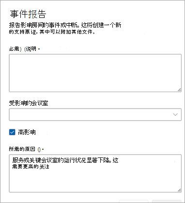

# 客户报告的事件票证

对于 Microsoft 未标记的任何类型的事件，或者对于有关服务/功能的问题，客户或合作伙伴代表客户可以使用“报告事件”功能提醒 Microsoft 调查问题或回答问题。

在“说明”字段中，尽可能地描述需要 Microsoft 帮助的问题。 可以添加一个或多个会议室。

检查  **事件** 是否导致服务或关键室的运行状况严重恶化。 若要帮助 Microsoft 正确确定请求的优先级，请详细描述影响很大的原因。

> [!NOTE]
> 不要将此字段用于一般问题、会议室和/或没有可用缓解措施的问题。

客户报告的事件 (CRI) 被视为关键票证，这意味着Teams 会议室服务运营中心首先会审这些票证。 请参阅 [此](microsoft-teams-rooms-premium.md)处的客户报告事件的服务说明 SLA。 当会议室 (或) 选择会议室作为 CRI 的一部分时，每个房间将标记为 **“不正常”** ，直到 CRI 关闭。

## 关闭客户报告的事件票证

客户报告的事件可由客户、代表客户管理会议室的合作伙伴或 Microsoft 的 Service Operations Center 工程师关闭。

**关闭事件**

1. 选择 **“关闭票证**”。

   

1. 通过从列表中选择一个类别来选择关闭的原因。

   确认关闭原因后，票证将关闭并移至 **“已解决**”。

   

票证的“详细信息概述”部分显示，托管会议室服务 (Microsoft) 或客户/合作伙伴的名称关闭了票证。  

 

## 常见问题

**有人能关票吗？**

用户或 Microsoft 的托管会议室服务运营中心只能关闭客户报告的事件。 已分配合作伙伴以使用票证管理权限管理其会议室的客户将能够关闭客户报告的事件。

**我可以限制谁可以关闭票证吗？**

目前不行。 拥有票证管理权限的所有用户都可以关闭 CRI。

**客户报告的事件票证关闭时是否收到通知？**

目前不行。