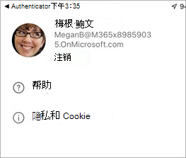

# Teams 会议室移动客户端应用程序功能

有时可能需要从移动设备管理 Teams 会议室 托管服务 (MTMS) 。 移动应用具有许多可从移动设备或平板电脑设备管理的功能。
## 开始之前

你必须是 Microsoft 365 组织中的管理员才能使用Teams 会议室移动应用。
从 Apple App Store 或 [Google Play 应用商店](https://play.google.com/store/search?q=Microsoft%20Teams%20Rooms&c=apps)下载[Teams 会议室](https://apps.apple.com/app/apple-store/id761397963?pt=80423&ct=docsaboutadminapp&mt=8)移动应用。

移动客户端提供在组织内创建票证和管理事件功能。

## 后续步骤

**获取 MTMS 移动应用**

1. 在应用商店中为设备搜索Teams 会议室托管服务并安装它。
2. 使用全局管理员电子邮件地址登录，并查看仪表板以查看服务运行状况、监视用户许可证以及查看消息和服务请求。

**使用Teams 会议室移动应用**

1. 从 [Apple App Store]() 或 [Google Play 应用商店]()下载应用。
1. 确保拥有有效的 Microsoft 365 订阅。
1. 使用工作凭据访问Teams 会议室桌面应用。

## 管理事件

下面是移动应用上用于管理事件的一些功能。

- 接收新事件的推送通知。
- 点击通知以立即打开并查看事件详细信息。
- 列出所有活动和已解决的事件，包括邮件上的读取和未读状态。
- 使用票证信息（包括消息）查看基本事件详细信息。
- 查看票证附件和文件。
- 从用户面板注销 (通知/消息在注销) 时会被禁用。

“事件”页显示打开事件的类型。

### 报告事件

### 按类别查看事件

### 管理票证
下面是移动应用上用于管理票证的一些功能。

- 确认事件 (标记为读) 。
- 读取、发布和回复票证上的邮件。
- 切换到深色模式。
- 添加附件 (拍摄和上传图片) 。
- 创建用于报告事件的票证。
- 使用 Microsoft Defender 与专家的托管安全和通信

应用在单独的选项卡下显示票证详细信息、消息和文件。

<!--

### Sign out

-->

## 疑难解答

可以尝试一些常见的移动应用故障排除步骤：
- 关闭并重新打开应用。
- 卸载并重新安装应用。 确保使用的是最新版本的应用。
- 如果设备上安装了 Microsoft Authenticator 或公司门户应用，请尝试重新安装或更新到最新版本。 如果这不起作用，你可以在 feedback365@microsoft.com 给我们发电子邮件，告诉我们。
